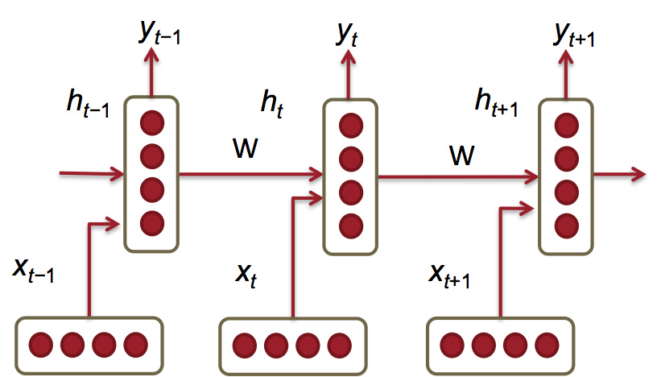
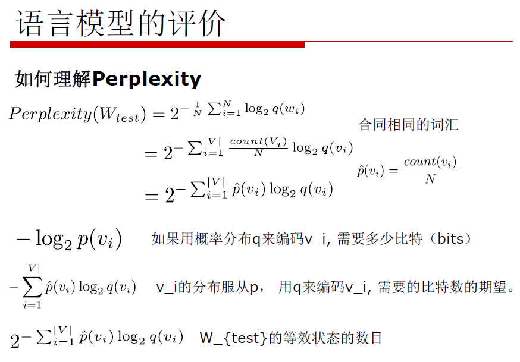

上一篇文章中的NNLM模型的缺陷在于，输入数据要求是固定的长度，和N-gram一样也假设当前词仅依赖于前n-1个词。因此，NNLM模型也无法解决长期依赖问题。语言模型任务是一个序列预测问题，而RNN(Rcurrent Neural Networks, 循环神经网络)是天然用来解决序列问题的模型，且在RNN模型中，理论上之前所有的单词都会影响到当前单词的预测。

对于当前时刻t，输入由两部分组成：当前位置单词的词向量$x_t$，以及上一时刻的隐状态$h_{t-1}$，输出为下一个位置的单词预测概率分布$\hat y_t$，这个分布是基于整个词表|V|的，因此维度也是|V|。真实的分布是$y_t$，是一个ont-hot向量，在正确单词的位置上的值为1，其它位置的值为0。

隐藏层的特征表示为：

$h_t=\sigma(W^{(hh)}h_{t-1}+W^{(hx)}x_t)$

$h_0$是隐藏层的初始状态，可用较小的值初始化得到（比如均值为0方差为0.1的高斯分布）。

输出的概率分布$\hat y_t$为：

$\hat y_t=softmax(W^{(S)}h_t)$

其中的$W^{(hh)}, W^{(hx)}, W^{(S)}$都是参数矩阵，与时刻t无关，因此参数是共享的，参数规模不会随着依赖上下文长度的增加而指数增长。

$\sigma()$是sigmoid激活函数：

$\sigma(z)=\frac {1}{1+e^{-z}}$

可以看到，概率分布的计算是基于隐藏层状态的，而隐藏层状态又是基于当前时刻t的单词向量以及上一时刻的隐藏层状态得到的，这样循环计算，理论上每个时刻的隐藏状态都包含了之前所有时刻的单词向量信息，从而“解决”了长期依赖问题（实际上并没有完全解决，所以才会出现LSTM）。

模型的损失函数是常见的交叉熵损失函数：

$J^{(t)}(\theta)=-\sum_{j=1}^{|V|}y_{t,j}\times log(\hat y_{t,j})$

只有对于正确单词的位置j，$y_{t,j}=1$，其它位置都是0，因此上式只关心正确单词对应的概率，这个概率越大越好。注意这只是针对某一个输出的损失。

而在大小为T的整个语料上的交叉熵损失为：

$J=\frac 1T\sum_{t=1}^T J^{(t)}(\theta)=-\frac 1T \sum_{t=1}^T \sum_{j=1}^{|V|}y_{t,j}\times log(\hat y_{t,j})$

也就是将所有输出的损失加起来。

如果以2为底会得到perplexity困惑度，代表模型下结论时的困惑程度，这个值越小越好，越小代表置信度越高：

$Perplexity=2^J$

困惑度是评价语言模型好坏常用的方法，简称PPL。困惑度的公式有两种形式：

（1）$PP(S)=P(w_1w_2...w_N)^{-\frac 1N}=\sqrt[N]{\frac {1}{p(w_1w_2...w_N)}}=\sqrt[N]{\prod_{i=1}^N\frac {1}{p(w_i|w_1w_2...w_{i-1})}}$

S代表句子，N是句子长度，$p(w_i)$是第i个词的概率，所以上式的意思就是正常句子的概率越大，困惑度越小，语言模型越好。

还有一种解释是，困惑度可以认为是average branch factor(平均分支系数)，即预测下一个词时可以有多少种选择，可以理解为可选次数越少，模型越准确。

（2）$PP(S)=2^{-\frac 1N \sum log(P(w_i))}$

第二种形式和第一种形式的意义是一样的。

要注意这个指标不是完全意义上的标准，它可能会受到很多其它因素影响，可以用它来大致估计效果。

例如：

PPX（投掷硬币）=2

PPX（投掷骰子）=6

参考资料

http://www.hankcs.com/nlp/cs224n-rnn-and-language-models.html

论文《Extensions of recurrent neural network language model》 by Mikolov

https://blog.csdn.net/index20001/article/details/78884646