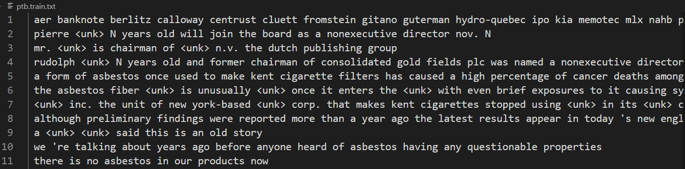
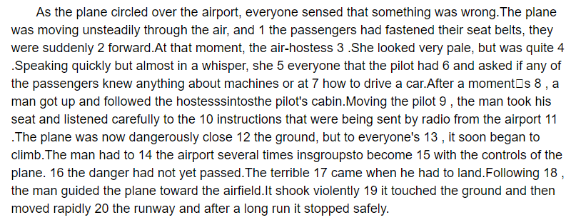
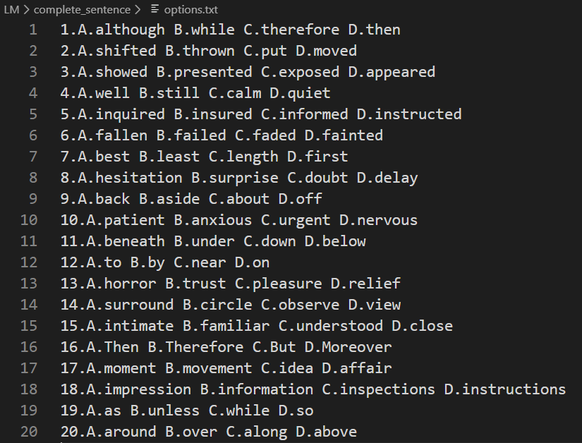
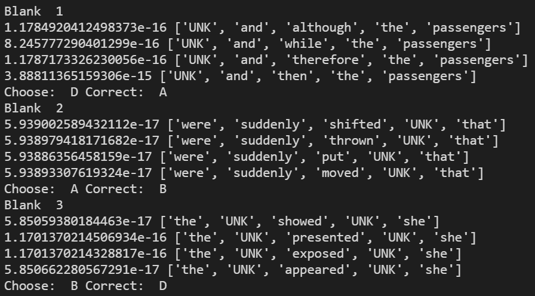
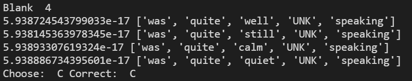

理论结合实践才是最好的学习方式，今天我们来用N-gram模型完成一个完形填空的任务。案例来源于以下网址：

http://edu.sina.com.cn/en/2002-09-27/6063.html

### N-gram模型回顾

N-gram模型假设句子中每个词出现的概率仅与它前面n-1个词有关。而句子的概率则为句子中每个词出现的概率的乘积。

更详细的内容请看之前的文章

那么N-gram模型要如何应用到我们的完形填空任务中呢？

首先我们需要有一个语料库，这里使用PTB文本数据集，它是语言模型中一个广泛应用的数据集。根据语料库我们可以用最大似然估计法计算出每个词出现的概率。在预测的时候，将待预测的词填入句子的对应空位，然后计算句子的概率，使得句子概率最大的词就是N-gram模型选出的正确答案。

下面我们结合代码来看如何实现一个n=3的trigram模型。

### 构建语料库

先来看看PTB数据集长什么样子：



可以发现这个数据已经分好词，做好预处理了。所以我们不需要再清洗数据，但是对于数据中的未知词`<unk>`，我们要将其替换成`UNK`。替换后的数据集命名为`ptb.train.txt.UNK`。

首先导入我们需要用到的包：

```python
import nltk
from collections import Counter
```

使用`pip install nltk`命令可以安装nltk，然后进入python，下载分词需要用到的文件：

```python
import nltk
nltk.download('punkt')
```

下载不成功的话就手动下载文件，然后复制到对应的失败的目录，并解压（后台回复`ngram`可获取分词文件）。

为了计算每个词$w_i$的概率：

$P(w_i|w_{i-1}, w_{i-2})=\frac{count(w_{i-2},w_{i-1}, w_i)}{count(w_{i-2},w_{i-1})}$

我们需要统计分子和分母，也就是三元组的出现次数以及其前缀二元组的出现次数。

遍历语料库中的所有句子，然后从中提取所有的 n-gram 元组（n=3 时就是三元组），保存在 `ngrams_list` 列表中；同时还要提取所有的前缀二元组，保存在 `prefix_list` 列表中。在这两个列表中保存了所有的 3-gram 以及前缀二元组，接着使用 col­lec­tions 模块中的 Counter 对每个元组出现的次数进行计数，得到 `ngrams_counter` 和 `prefix_counter`。这两个 counter 将用于最大似然估计概率。

```python
# settings
n = 3  # 3-gram
fn = "../data/ptb.train.txt.UNK"
all_words = set()  # 记录语料库中的全部词
ngrams_list = []  # n元组（分子）
prefix_list = []  # n-1元组（分母）

# 构建语料库
with open(fn) as f:
    for line in f:
        sentence = line.split()
        word_list = [x.lower() for x in sentence]
        for word in word_list:
            word = word.strip()
            all_words.add(word)
        ngrams = list(zip(*[sentence[i:] for i in range(n)]))   # 一个句子中n-gram元组的列表
        prefix = list(zip(*[sentence[i:] for i in range(n-1)])) # 前缀元组的列表
        ngrams_list += ngrams
        prefix_list += prefix

all_words = list(all_words)
ngrams_counter = Counter(ngrams_list)
prefix_counter = Counter(prefix_list)
```

要理解ngrams的生成过程，可以看一个例子：

```python
sentence = ['a', 'b', 'c', 'd', 'e', 'f', 'g']

print([sentence[i:] for i in range(n)])

print(*[sentence[i:] for i in range(n)])

print(list(zip(*[sentence[i:] for i in range(n)])))
```

上述程序依次输出的内容是：

```python
[['a', 'b', 'c', 'd', 'e', 'f', 'g'],
  ['b', 'c', 'd', 'e', 'f', 'g'],
  ['c', 'd', 'e', 'f', 'g']]

['a', 'b', 'c', 'd', 'e', 'f', 'g'],
 ['b', 'c', 'd', 'e', 'f', 'g'],
 ['c', 'd', 'e', 'f', 'g']

[('a', 'b', 'c'),
  ('b', 'c', 'd'),
  ('c', 'd', 'e'),
  ('d', 'e', 'f'),
  ('e', 'f', 'g')]
```

第一步是取句子列表的3个子列表（分别从第0、1、2个元素开始取）组成新的列表，第二步是将新列表解包，变成3个列表，第三步是利用zip将3个列表中的对应元素打包，形成了元组组成的列表，且以3个列表中长度最短的列表为准。这样就得到了我们想要的所有三元组。

zip的作用是将参数（可迭代对象）中对应的元素打包成一个个元组，然后返回由这些元组组成的列表。

到这里，我们有了所有三元组的count值，以及前缀二元组的count值，就可以预测了。（是不是超简单？）

### 预测

来看看测试集：



这也就是我们需要做的完形填空，每个数字代表一个“空”，对应有4个选项，我们要从中选出一个最合适的填入。



对应的答案是：

```
ABDCCDBABCDADBBCADAC
```

我们先将段落，候选项以及答案读入。

```python
# 加载测试集
fn = "./sentences.txt"
with open(fn) as f:
    line = f.read()
    # 分词
    words = nltk.tokenize.word_tokenize(line)
    words = [x.lower() for x in words]
print(" ".join(words))

# 将语料库中没有的词替换成UNK
blank_ids = [str(n) for n in range(1, 21)]
for i in range(len(words)):
    if words[i] in blank_ids:
        continue
    if not words[i] in all_words:
        words[i] = "UNK"
print(" ".join(words))
sentence = words

# 加载测试集选项
f = open("./options.txt")
options = []
for line in f: 
    ll = line.split()
    words = []
    for s in ll:
        word = s.split(".")[-1].lower()
        words.append(word)
    options.append(words)
f.close()
print(options)

# 加载测试集标签（答案）
f = open("./answers.txt")
answers = f.readline().strip()
f.close()
print(answers)
```

对于每个空，依次尝试将四个选项的词填入，然后计算对应句子的概率，最终选取使得句子概率最大的那个词。实际上，我们无需计算整个句子的概率，只需计算待预测词附近的概率即可（即待预测词及其前后各n-1个词），因为较远词的概率已经固定了，不受待预测词的影响。

当n=3时，句子的概率可以等价于包括待预测词在内的5个词的联合概率。因为待预测词前2个词以及后2个词会影响待预测词或被待预测词影响。

比如有一个由五个单词构成的句子 “ABMCD”，该句子的概率为：

$p(A, B, M, C, D) = \frac{c(A, B, M)}{c(A, B)}\times \frac{c(B, M, C)}{c(B, M)} \times \frac{c(M, C, D)}{c(M, C)}$

其中c()表示count。

先实现一个计算句子概率的函数，输入一个由多个词构成的列表，函数内将列表转换为 n-gram，然后计算 n-gram 概率的乘积。为了避免数据匮乏的问题，这里采用了加一法（拉普拉斯平滑）进行数据平滑。

```python
def probability(sentence):
    """
    计算一个句子的概率。
    Params:
        sentence: 由词构成的列表表示的句子。
    Returns:
        句子的概率。
    """
    prob = 1  # 初始化句子概率
    ngrams = list(zip(*[sentence[i:] for i in range(n)]))   # 将句子处理成n-gram的列表
    for ngram in ngrams:
        # 累乘每个n-gram的概率，并使用加一法进行数据平滑
        prob *= (1 + ngrams_counter[ngram]) / (len(prefix_counter) + prefix_counter[(ngram[0], ngram[1])])
    return prob
```

遍历四个选项，选出使得句子概率最大的词作为结果。

```python
def predict(words, options, right_answers):
    """
    根据历史进行一个词的预测。
    Params:
        words: 待预测的句子组成的列表。
        options: 所有候选词构成的列表。
    Returns:
        预测结果
    """
    blank_ids = [str(n) for n in range(1, 21)]
    bid = 0
    answers = ""
    for i in range(len(words)):
        if words[i] in blank_ids:
            print("Blank ", words[i])
            word_prob = []  # 候选词及其概率构成的元组的列表
            pre_sentence = words[i-(n-1):i]
            post_sentence = words[i+1:i + n]
            max_score = -float('inf')
            choice = -1
            # 遍历当前空的所有选项
            for j in range(len(options[bid])):
                option = options[bid][j]
                if not option in all_words:
                    option = "UNK"
                # 实际上不需要算整个句子的概率，只需要算待预测词附近的概率即可，因为句子其他部分的概率不受待预测词影响
                seq = pre_sentence + [option] + post_sentence   # 待预测词及其前后各n-1个词的列表
                score = probability(seq)
                print(score, seq)
                if score > max_score:
                    max_score = score
                    choice = j
            print("Choose: ", 'ABCD'[choice], "Correct: ", right_answers[bid])
            answers += 'ABCD'[choice]
            bid += 1 

    return answers
```

将读入的测试集sentence，候选项options以及答案answers（这里输入答案只是为了对比模型结果和正确答案）作为参数传入上述函数，得到模型的选择结果choices。

```python
choices = predict(sentence, options, answers)
print(choices, ",", answers)
```

我们来看几个例子：



前面3个都选错了，其实只看到这5个词确实很难选出正确选项。比如第一个空，although, while, therefore, then都是连接词，没有更长的上下文无法判断应该是哪一个。

来看一个选对了的



根据choices和answers来计算模型的准确率

```python
def accuracy(answers,choices):
    n = len(answers)
    c = 0
    for i in range(len(answers)):
        if answers[i] == choices[i]:
            c += 1
    return c*1.0/n

a = accuracy(answers, choices)
print(a) 
```

准确率是0.55，其实比瞎猜好很多了。因为有4个选项，瞎猜的正确率是0.25。

这个N-gram模型的实现可以说是从零开始了，也没有用到什么复杂的平滑方式，只用了个简单的加一平滑，那么下次，我们使用一个工具来训练N-gram模型并预测，该工具使用了更严谨的平滑方法。敬请期待~

本文的代码以及可能用到的软件，可以在后台回复`ngram`获取。


### 参考资料

用 Python 实现 n-gram 语言模型进行新闻文本内容预测

https://www.jeddd.com/article/python-ngram-language-prediction.html