## 03.AI概览：宣传片外的人工智能

内容概述

- **人工智能是什么**

- **人工智能的发展历史**

- **人工智能的现状和展望**

人工智能之父：Fallece John McCathy

人工智能的复兴≈ 神经网络的复兴

神经网络的概念很早就已经出现，但是在2000 年左右，由于SVM 的出现，
使得神经网络没落了一段时间。

神经网络的再次兴起，主要源于2013 年深度学习的出现。GPU的出现让算力变得便宜（GPU非常适应并行计算）。一些CV领域的出现突破

真正的人工智能其实就包括两个：预测性建模和优化。

预测性建模

- 主要目的：在给定数据的基础上提升预测模型的准确率

- 绝大多数人工智能的应用在很大程度上均可以认为是预测性建模的范畴

- 预测性建模VS 统计学
  - 预测性建模：只关注模型的预测准确性
  - 统计学模型：主要关注模型的可解释性
  - 例如湖北疫情数据，预关注的是明天新增多少感染，怎么得到这些数据不是最关心的。统关心什么会影响感染率的增加，通过什么样的措施可以减少病患率
  - 预和统都是相互补偿的，只是近年来预的发展速度更快

优化问题

- 优化问题是指如何根据已有的数学模型求出最优解的过程
  - 通常是一种量上的优化而不是质上的优化。例如城市如何管控整体的交通灯，怎么尽可能的减低交通拥堵
  - 优化问题不是一个新领域，一般跟两个领域相关：运筹学和优化理论
- 近年来取得主要进展的优化问题主要在于增强学习领域
- 增强学习：解决一小部分的优化问题
  - 解决的问题：如何在动态环境下做出正确的决定。例如交通灯，动态：控制停车或通行秒数。静态：该在哪里安装交通灯
  - 主要应用：游戏AI。
    - 进展主要来自DeepMind机构，阿尔法击败李世石，AlphaStar(针对星际争霸2的游戏AI)决策空间非常复杂
  - 其他应用：内容推荐、搜索排名、智能化定价
    - 智能对话机器人的构建，最难的核心点是如何选择一个子系统，一般通过增强学习解决。
    - Youtube的推荐系统也是增强学习做的

人工智能的另外一种分类

- 结构化数据（一般存数据库，一列一列的），例如银行消费记录、贷款记录等
- 文本数据
- 图像、视频数据
- 语音数据

传统来讲是把非结构化数据转为结构化数据（例如从文本中提取一些关键词），但有些情况很复杂不能单单靠结构化。

例如：反讽的语句，如果只是通过找情感词可能会判断错误，没考虑上下文。

神经网络就是一个非常复杂的特质提取器

被媒体夸大的人工智能

- 媒体的口中，本质是追求曝光度，所以会夸大其词，很多不切实际的信息，鱼龙混杂。

人工智能和任何一个学科都一样，可能会在短暂时间内有突破发展，但本质上是遵循科学的循序渐进的过程。例如最小二乘法（高斯,1777-1855）和拟牛顿法（牛顿，1643-1727）。

人工智能常常以不同面目出现，不停地重新被包装：

机器智能、统计学、运筹学——模式识别、数据挖掘——BI（商业智能）——神经网络、深度学习——人工智能

动力：吸引更多的眼球

人工智能现状

- 有一定的进展，来源于算法进步，业界形态进步，硬件算力的进步
- 从理论上来讲我们还远远没有达到能够超越人的地步，从实践来讲很多人工智能项目是难以落地的

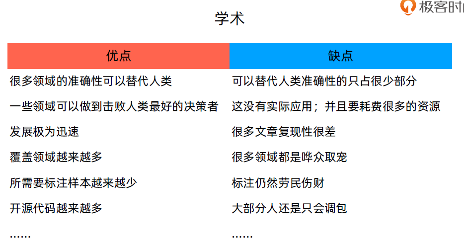

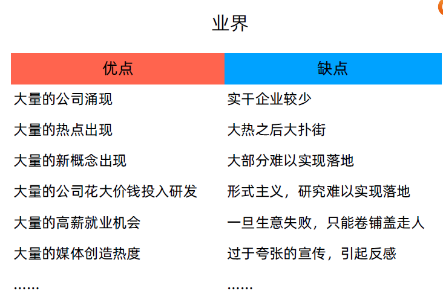

我们该怎么做

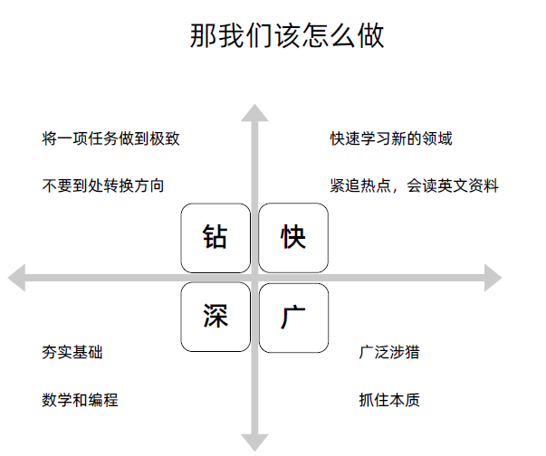

## 04.AI项目流程：从实验到落地

如何判断是否要做一个AI 项目

1. 技术的成熟度
   1. 底线：人工是否可以解决这个问题。人不能做的绝大多数机器也做不了
   2. Paper 中技术的复现性VS 领先厂商当前的水平。参照大厂的技术的解决程度
   3. 初期通过小Demo 测试准确率。不同实用领域的准确率可能会差很多，先提前用这个数据测试一下。
   4. 团队的时间和能力
   5. 项目部署问题。最后一刻部署的时候发现这个操作系统不能安装tf，也不能安装pytorch，因为它是AMD的系统，AMD的显卡，所有东西重做
   6. 保守估计项目的交付时间
2. 需求的可控程度
   1. 公司是销售导向OR 技术导向，是不是要跟着销售走，销售有决定话语权
   2. 客户管理能力。后端人员不直接面对客户其实很危险，可能不知道真实需求。要会处理客户提出的实现不了的要求甚至无理要求
   3. 团队整体的需求控制能力。leader要挡一些需求
3. 项目投入的周期和成本
   1. 大多数时候，人们会低估项目投入的周期和成本。
   2. 项目周期和成本不可控的原因主要来源于需求的变更。客户可能不知道他要什么，看到了才知道
   3. 其他可能出现的问题：
      1. 标注的不可控性。数据不全，标注标准，错标。
      2. 模型效果调优所需要的时间，要留出来
      3. 推断速度提升所需要的时间，容易被低估
      4. 环境部署所需要的时间
      5. 运行模型所需要的算力成本，硬盘算力要多少
4. 项目最终的交付流程
   1. 明确项目目标
   2. 不要忽略交付流程中的额外投入
   3. 组织的项目交付的流水化能力：
      1. 是否有明确的交付流程
      2. 人员职责安排是否清晰
      3. 是否严格遵循时间规范
      4. 项目是否有烂尾的风险

项目的一般流程

1.前期调研和方案确定（如何做前期的调研）

- 容易被忽略的问题：
  - 很多时候，学术结果难以复现。
  - 很多方法在某些数据上可能会非常好用，但是在另一些数据上则会失效。不仅要技术研发，还要数据研发
  - 很多方法的成功取决于一些细节，而这些细节只有真正做过的人才会知道。
  - 很多时候人们会过于关注方法的效果，而忽略了整体的运行实效。环境不一样
  - 在绝大多数的时候，人们都会低估整个项目的难度。

数据标注和开发（如何做开发的计划）

- 数据标注
  - 前期一定要制定充分的标注规则
  - 数据的采集一定要具有代表性
  - 非常不建议采用自动标注的方式。模型准确率一定不会比标注的高。数据漂移问题。例如用关键词去标注，那么模型很有可能学习到如何区分有没有关键词。
  - 先训练一个初步模型，然后只让相关人员进行校对，可以保证标注效率并减少标注成本。Active Learning
- 算法开发
  - 千万不要采用规则的方式进行开发。初期成本低，但是后期成本越来越高。规则尽量放在最后用。尽量写成可以配置的方式。
  - 初期就要引导客户使用和购买能够支持深度学习框架的硬件。一开始就申请GPU，而不是后期再提。
  - 算法开发的过程中，一定要有量化的指标并记录下来。记录方案、测试的数据集
  - 开发的过程中，多分解问题。不可能100%。怎么调优？分解成多种情况去分析。数据扩充的时候要去扩充表现不好的地方。引导客户：对于简单的问题已经达到90%的准确率，对于难的问题小冰也答不上来。
  - 前端对接的时候一定要去引导何为“智能”

3.效果调优（包括准确性和速度）（如何对结果进行验证）

- 初期要充分考虑到效果优化所需要的时间和成本
- 客户并不知道通过什么标准来评估一个系统的好坏。其实是好事，可以引导客户，比如去看整体准确率而不是某一个例子。
- 一定要从数据的角度出发进行优化。分析哪一部分数据表现比较差，而不是频繁换模型。
- 学会止损。不要投入无限的量去优化。
- 除了准确性的优化，还要注重代码运算效率的优化
- 算法开发和效果优化常常是需要反复进行的工作

4.代码部署（如何进行部署）

- 如果客户的系统比较奇怪，或者难以满足一些要求，要提前让客户知晓这些风险。AI部署常常用GPU，安装驱动CUDA，CUDA会重新编译对方的Linux内核，会改变整个系统，绝大多数公司不能承受。
- 即使再小的项目，我也强烈建议用微服务架构进行部署。Docker可以不改变对方环境，但是不稳定，配上kubernertes。
- 不要把算法部署在本地，尽量采用云端部署。可以更好地控制环境、投入，可以不用做更多的交涉。云端部署demo让客户看。

## 05. NLP领域简介：NLP基本任务及研究方向

基础性研究

- 基础性研究：网络架构。Transformer
- 基础性研究：优化理论。参数变多，模型大，优化难，优化的精度、速度的问题。Lookahead
- 基础性研究：对抗训练。数据噪声变多怎么办？对抗训练，例如虚拟的对抗训练。
- 基础性研究：数据增强。获得更多数据。但是如果有很多相似的样本，容易过拟合。
- 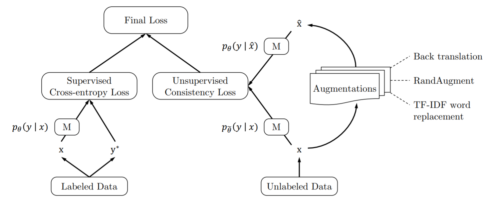
- 基础研究：半监督学习。
- 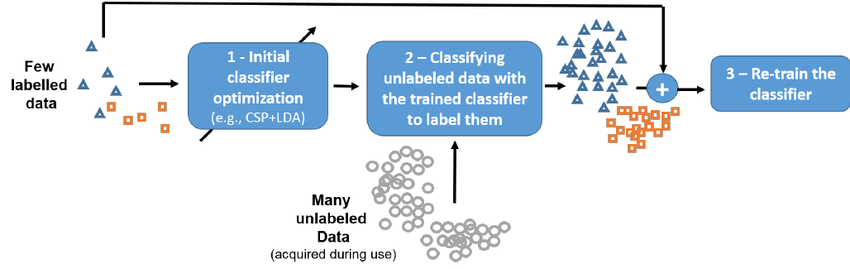
- 基础研究：域迁移
- 
- 基础研究：Meta Learning。神经网络的训练过程极其困难，让机器去看着训练。DeepMind发布文章Direct Policy Gradient。RL中，一种是MCTS（Monte Carlo Tree Search)，这个基本上是暴力去算可能性，可以理解为类似于计算的过程。另外一种就是Q-learning和policy gradient。这类基本上是基于神经网络的，所以可以认为是一种类似于“感觉”的东西。Direct Policy Gradient等于把这两个结合了。跟lookahead有相似性，可以向前看。
- 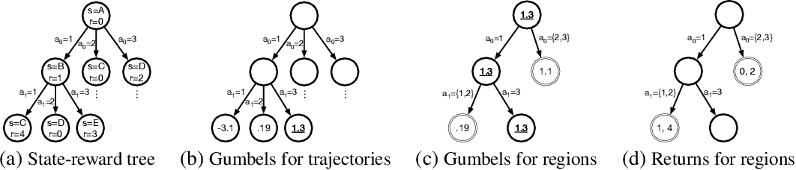
- 基础研究：Auto ML。完全自动化。RENAS遗传算法和增强学习结合。
- 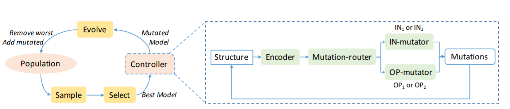
- 基础研究：多任务学习
- 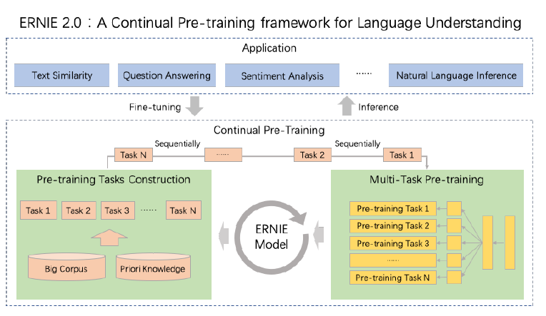
- 基础研究：集成学习
- 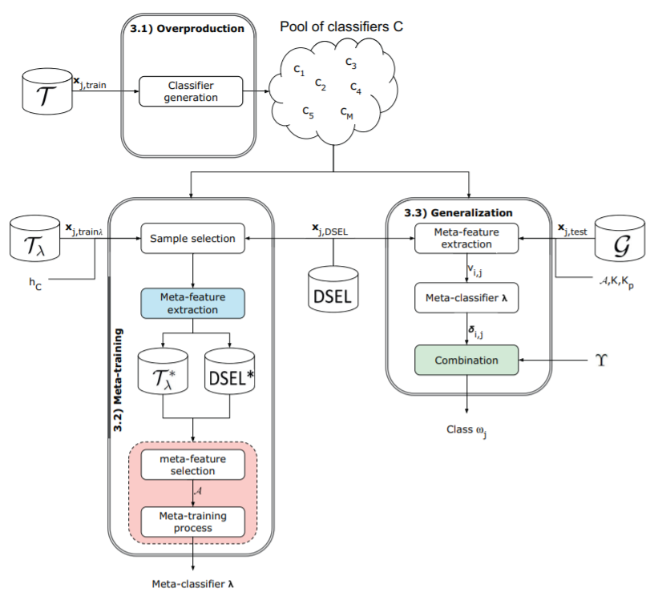
- 基础研究：图网络。抽象语法树也是图
- 基础研究：知识图谱。三元组的集合。落地难
- 基础研究：多模态学习。比如图像文本结合
- 基础研究：机器推理。很老的研究。
- 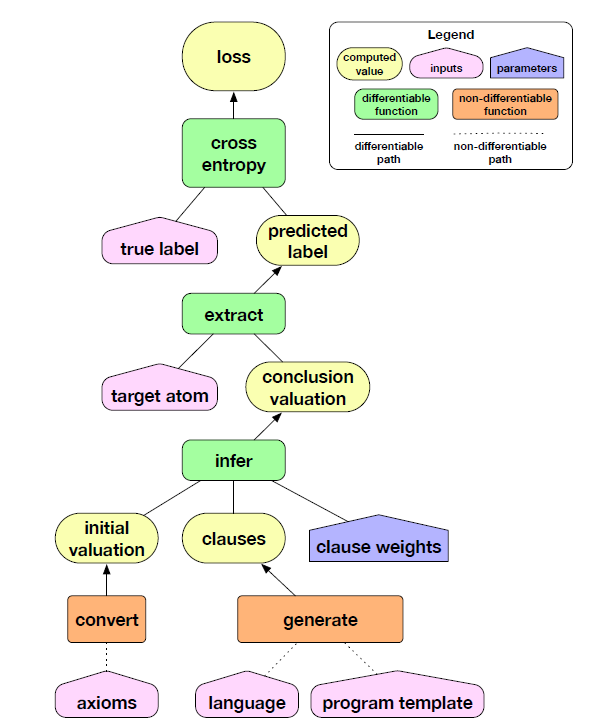

专属NLP 领域的研究

- NLP 研究：预训练语言模型。例如XLNet
- NLP 研究：文本分类。比如情感分析
- NLP 研究：序列标注。比如NER，分词
- NLP 研究：关系提取。
- NLP 研究：Dependency Parsing
- NLP 研究：Semantic Parsing
- NLP 研究：Seq2Seq
- NLP 研究：文本生成。看着美，落地难。语法流畅，逻辑不流畅。往往需要结合模板
- 
- NLP 研究：文本推荐。今日头条文本推荐做得好。机器如何理解文本，人的兴趣漂移
- NLP 研究：翻译。例如Pivot vs. Zero-Shot Translation
- NLP 研究：指代消解
- 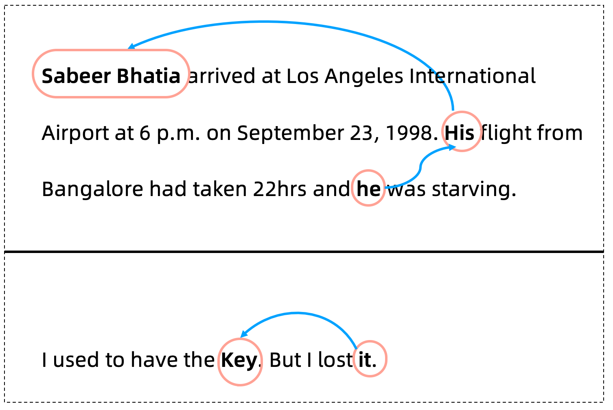

NLP 综合性研究（不仅仅包括一个算法），落地难，要考虑多个算法

- 智能对话机器人
- 文本校对
- 文本检索
- 开源情报系统
- Smart BI

交叉领域的研究

## 06. NLP 应用：智能问答系统

- A Taste of Reality

- 很多系统是由多个组件组成的
- 很多系统是存在很多挑战的
- 很多系统落地是存在问题的
- 但是，很多时候有些问题也是可以解决的…

###如何构建一个智能问答系统

功能：基础问答，特定任务，闲聊功能，推理问答，话题发尾，其他

有一个增强学习控制中心，控制不同场景下上述的功能

问题——召回（需要快速）——分类（干掉完全不相干的类别）——关键词——等价性（等价/相关问题）——排序（相关性强弱）

智能对话系统的挑战

- 技术困难

- 投入巨大（需要大量的数据）

- 落地困难（有时候可能不需要那么智能的机器人，只需要一些基本功能）

有多少人会经常跟机器人闲聊？思考它的落地，是否真的有必要让它变得那么智能？

如何把一个机器人问成弱智

- 省略回复
- 知识推理（姚明的爸爸的儿子的爸爸是谁）
- 错别字
- 状态切换
- 延续话题

对话机器人的实践

- 我曾经生不如死地开发过一个对话机器人（类似于百度UNIT ）
- 挑战：
  - 技术复杂（次要）
  - 客户关系（主要）

数据扩充，通常是用等价词语替换。

例如：市政府是干什么的？

A的B是什么，C的B是什么，A和C等价

利用语法树扩充数据，比如“是什么”，“职责是什么”。

直接替换可以，但是有两个问题，量少，第二个过拟合。语法树其实是交叉的方式来增加更多看起来不一样其实一个意思的情况。

总结

- 目标分解
- 创新并非那么困难
- 综合考虑技术因素和人的因素

## 07 NLP 应用：文本校对系统

从Grammarly 出发

理论模型：Seq2Seq

实际模型：？？？（效果极其糟糕）

为什么中文校对会比英文校对要难？

- I am born im China. 看几个词同时出现的频率，发现错误
- 我在中国出生。先分词，分词器准确率？我 在中 国 出生 我在中的词频很低？有错误？如果有错误，分词器可能受影响，分词都分错。
- 本质：一旦错误，传统的模型会崩溃

如何解决

- 目标分解
- 逆向思维

例如：

这时他进来

这是他进来

去看整个句子的通顺程度，这是他进来和这时他进来哪个更通顺。

这种做法是先纠错再查错，传统的是先查错再纠错。

其他可以尝试的

- 语法错误校对（非常困难）
- 常识校对（更加复杂）

## 08 NLP 的学习方法：如何在AI 爆炸时代快速上手学习？

在最短的时间内把新的东西初步掌握；需要创造性思维

知识可以快速补充，能力需要实践去补充

AI 时代的学习

- 为什么要学习
  - 迁移学习的出现使得技术不再是数据标注的衬托
  - AI 一直在迅速发展
  - AI 本身还不成熟，有大量的创新空间
- 学习的误区
  - “大佬（同事）带带我”；（自己的担子很重，没有时间手把手教你，希望对方自己学习）
  - 夯实基础，拿下西瓜书；（真正的基础是什么？数学和编程是真正的基础，看新的模型能够快速读懂）
  - 一切要从结果出发，要务实；（如果只局限一部分会错过通用的本质）
  - 创新是给巨佬的，跟我没关系；
  - 不要造轮子；（比如只会调包也不行，需要适当地造轮子）
  - 三个月内从零到Kaggle Master；（想快速学习没问题，但不应该所有事情都想走捷径）
  - Andrew Ng 说一切机器学习问题的本质一定是要么过拟合和欠拟合；（没说过这句话，只是看问题的一种方式而不是所有的方式）
  - 看英文太费劲，国内有很多公众号不错；（翻译的过程中可能会出错，学会英文搜索更可能找到正确答案，因为英文是世界性的语言）
- 如何有效地进行学习（学习路线建议）
  - 基础= 数学+ 编程+（英语）（每天做一点）
  - 积极寻找对AI 有情怀的人（乐趣就是解决问题、分享，自己也要变成这种有情怀的人才能吸引别人）
  - 上来就是干（上手，不是去看课程，而是看开源库）
  - 考虑其它维度（是否陷入思维定势）
  - 兼听则明，AI 届没有上帝
  - 怀疑一切（即使是谷歌也会犯错，人都会犯错）
  - 人们将如此多的时间花在走捷径之上，以至于正常走远路的人反倒是首先到终点的（保证不断学习，提升）
  - 做深一点，扩展多点

## 09 深度学习框架简介：如何选择合适的深度学习框架？

深度学习框架包括什么

- GPU 为基础的Tensor 运算
- 构建网络后自动求解梯度的方法
- 模型训练体系（简洁程度，运算速度）
- 模型推断体系

选择深度学习框架的准则

- 生态圈
- 易用性（不要光看Demo 来判断）
- 功能是否完整
- API 是否稳定
- 效率

TensorFlow

- 优点
  - 谷歌爸爸一撑腰，研究代码两丰收
  - 新版TensorFlow API 较简洁
  - 天生和谷歌云兼容（谷歌云支持TPU）
  - 有良好的推断支持（tfserving）
  - 功能十分强大

- 缺点
  - API 不稳定
  - 学习成本高
  - 开发成本高

PyTorch

- 优点
  - 上手容易
  - 代码简洁
  - 发展快速，现在已经支持TPU
  - API 相对稳定
- 缺点
  - 没有Keras API 那样简洁
  - 一些功能比较难以实现（全局变量问题）

## 10 深度学习与硬件：CPU 篇

为何关注深度学习硬件

- 关注硬件不等于所有都要重新写

- 加速训练

- 避免部署出现问题

CPU 硬件基础

- Core, Register, Cache, Memory
- Cache miss

CPU 在训练时候的注意事项

- 一般不用CPU 训练深度学习模型。
- 很多if…else 出现时，CPU 会比GPU 快。（善于处理复杂逻辑）
- 如果需要加速，可以通过Cython 访问C++，这在实际业务性应用时很有用。
- 对于大部分硬件（GPU，TPU，FPGA），CPU会负责数据的读写-> 在进行训练时，有时为了加速需要选择更多核的机器。

CPU 在部署时候的注意事项

- 避免Cache Miss（常见的情况是不断地需要读写）

- 有时需要使用足够多的核来支持读写

## 11 深度学习与硬件：GPU 篇

GPU 的主要厂商

- 英伟达NVIDIA
- AMD（对深度学习支持差）

商用卡，民用卡

V100, 2080Ti, P1000

GPU 硬件特点

- SIMT，即使做一个很简单的计算也要调用大量的核core
- 显存污染
- 显存独立于内存，内存和显存的读取可能会成为问题。
- 对于显存的处理，multi-stream processer 并不如CPU 一样强大。
- GPU 是非常复杂的处理器。

GPU 训练注意事项

- GPU 训练效率可以被DeepSpeed 显著提升。
- 很少出现GPU 多线程训练。（多个用户用同一块GPU去训练，容易造成显存污染）
- GPU 训练有时可能会被一些其他因素影响，如CPU，GPU 之间沟通速度（多GPU或多节点）。
- 传统来说，NLP 的训练一般来说不会耗尽GPU的资源，但是深度迁移模型出现后，GPU 常常出现算力不足或显存资源不足的情况。
- GPU 可处理动态的网络。（AutoML）

GPU 部署的注意事项

- GPU 部署的最大问题：显存污染。（很难发现，只能避免，一台GPU只负责一个serving）
- GPU 部署经常被内存与显存之间的带宽影响。
- 部署时需要对参数做详细调整，最重要参数为Batch Size。

## 12 深度学习与硬件：TPU 篇

TPU 的特点

- 用于训练神经网络的TPU 只能通过GCP （谷歌云）获得
- TPU 本质上来说是矩阵/向量相乘的机器，构造远比GPU 简单，所以：
  - TPU 十分便宜
  - TPU 很容易预测其表现
- TPU 很擅长基于Transformer 架构的训练和预测
- TPU 不能处理动态网络（必须依赖tf静态图）

TPU 与深度学习

- 原生Tensorflow 对TPU 支持最好，PyTorch 目前通过XLA 的引进也部分支持TPU。
- TPU 的主要运算瓶颈在于IO 支持。
- 建议采用TPU V3 多线程的方式，这种方式性价比最高。

## 13 AI 项目部署：基本原则

AI 项目部署的难点

- AI 项目整体结构复杂，模块繁多。
- AI 很多时候需要大量的算力，需要使用GPU，TPU 或者FPGA。（了解硬件）
- 深度学习框架依赖十分复杂，配置环境困难。（cuda需要重新编译整个linux系统）

AI 项目部署目标

- 不要崩，不要崩，不要崩

- 保证不出大的问题

- 保证合适的效率（比如增加算力）

- 保证尽可能少的侵入性

AI 项目部署基本原则

- 采用微服务框架（方便、稳定）。
- 采用合适硬件，注意CPU 选型和GPU 选型。
- 以Profiler 为导向进行优化。
- 推断服务应该用同一个框架和一个线程，TPU 除外。
- 部署应该是在项目初期就考虑的，要制定完善的项目计划，并注意和客户的沟通。

## 14 AI 项目部署：框架

深度学习推断框架的任务

- 读取模型，提供REST 接口。
- 调用不同的硬件资源。
- 对推断过程做一定处理，其中最重要的是批处理。

选择深度学习推断框架的主要根据

- 生态圈
- 易用性和文档完整性
- 对不同硬件的支持程度
- 功能是否强大
- 推断速度

TF Serving 简介

- 同时支持CPU，GPU，TPU
- 生态圈

## 15 AI 项目部署：微服务简介

微服务基本介绍

- 微服务是一个概念，而不是一个严谨的定义

微服务的主要原件

- Docker，Kubernetes，Istio

为何选择微服务

- 入侵性小
- 稳定性高
- 功能强大

微服务部署AI 的一些基本原则

- 对于推断，一个节点只部署一个Docker！（TPU 除外）
- 如果没时间，起码选择Kubernetes 和Docker，因为Docker 很容易崩溃。
- 一些其他的考虑：
  - 错误恢复（服务崩了之后？）
  - 灰度上线（模型更新）
  - Kafka（统一一段一段去请求，而不是一个一个）
  - Actor
  - 其他功能

## 16 统计学基础：随机性是如何改变数据拟合的本质的？

出发点

- 数学定理表明，任何一个函数都可以用多项式无限接近的拟合。
- 为什么我们不用多项式呢？

随机性是如何改变数据拟合的本质的

- 数据的拟合有两种随机性：
  - 噪声->无法消除
  - 函数拟合的随机性->可以提升
- 过拟合和欠拟合
- 引入其他信息的必要性（现有信息可能不足以判断）
- 多角度考虑问题（多个数据源）

随机性对算法工程师意味着什么

- 过拟合和欠拟合是对神经网络设计和训练很重要的一点，但不是全部
- 能否解决问题在很大程度上取决于数据是否有足够信息
  - 引入结构化数据的必要性
  - 为什么人解决不了的问题机器也解决不了
- 算法除了考虑数学之外，还需要考虑实际数据的情况
- 训练集和测试集不同是机器学习算法最大的坑（尽量建立客观的测试集）

## 17 神经网络基础：神经网络还是复合函数

关于神经网络错误的说法

- 神经网络是大家根据神经科学得到的最伟大的发明

神经网络的数学本质

- 由于神经网络复合函数的本质，使得神经网络可以很方便地组合出很多复杂的函数
- 由于复合函数求导法则，所以大部分神经网络的训练过程可以自动化（反向梯度传递）

一些神经网络的术语

- 神经网络的训练
- 神经层
- 激活函数
- 隐含层

## 18 神经网络基础：训练神经网络

传统优化求解方法的问题

- 传统的求解方法：
  - 拟牛顿法等
  - Proximal Methods
- 传统求解方法的问题
  - 传统方法需要根据全部样本计算梯度（导数），这导致对于非常复杂的网络，求解计算上根本不可行

基础的梯度下降算法

- SGD（图像领域里一般用这个好）
- SGD with Momentum（新batch的方向和旧batch的方向加权，方向更稳定）
- Adagrad（陡的地方多走一些，否则少走一些）
- Adam（NLP领域里一般用这个好）

梯度消失和梯度爆炸

- 由于求解过程的复杂性，这使得神经网络的求解并不一定会收敛到最优解
- 对于神经网络训练最大的敌人是梯度消失和梯度爆炸
- 解决梯度消失和梯度爆炸往往是网络设计和优化算法需要考虑的问题

## 19 神经网络基础：神经网络的基础构成

损失函数

- y值连续时：L2 Loss（为了减少异常点的影响，用clipping），L1 Loss
- y值离散时：交叉熵

全连接层

激活函数：sigmoid，tanh，relu

Dropout

Batch Normalization

## 20 Embedding 简介：为什么Embedding更适合编码文本特征？

什么是Embedding

为什么我们需要Embedding

Embedding 是怎么训练的

## RNN 简介：马尔科夫过程和隐马尔科夫过程

马尔科夫过程

隐马尔科夫过程

## RNN 简介：RNN 和LSTM

RNN

LSTM

https://blog.csdn.net/dqcfkyqdxym3f8rb0/article/details/82922386

## CNN 简介

CNN 简介

做max pooling和average pooling，把两个部分拼接起来——CVPR比赛的一个小trick

CNN 如何应用在文本当中

- 传统来说，NLP 当中的CNN 一般较浅，但有证据表明更深的CNN 更有效。
- 在传统文本分类模型当中，CNN 效果往往要比LSTM 分类效果好（但不一定）。

