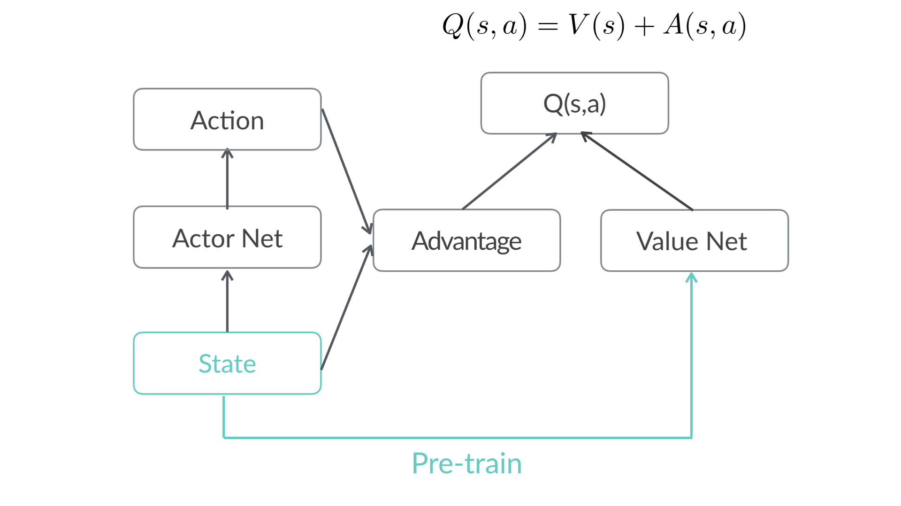
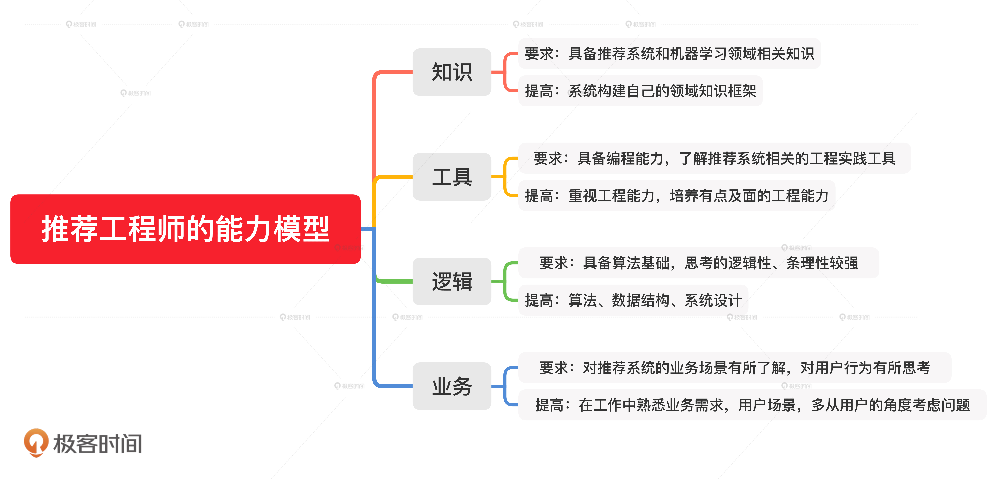

## Deep Crossing

图 1 展示的就是微软在 2016 年提出的深度学习模型 Deep Crossing，微软把它用于广告推荐这个业务场景上。它是一个经典的 Embedding+MLP 模型结构，我们可以看到，Deep Crossing 从下到上可以分为 5 层，分别是 Feature 层、Embedding 层、Stacking 层、MLP 层和 Scoring 层。


Feature 层也叫做输入特征层，它处于 Deep Crossing 的最底部，作为整个模型的输入。

Feature#1 代表的是类别型特征经过 One-hot 编码后生成的特征向量，而 Feature#2 代表的是数值型特征。我们知道，One-hot 特征太稀疏了，不适合直接输入到后续的神经网络中进行训练，所以我们需要通过连接到 Embedding 层的方式，把这个稀疏的 One-hot 向量转换成比较稠密的 Embedding 向量。

Embedding 层并不是全部连接起来的，而是每一个特征对应一个 Embedding 层，不同 Embedding 层之间互不干涉。

Stacking 层中文名是堆叠层，我们也经常叫它连接（Concatenate）层。它的作用比较简单，就是把不同的 Embedding 特征和数值型特征拼接在一起，形成新的包含全部特征的特征向量。

再往上看，MLP 层就是我们开头提到的多层神经网络层，在图 1 中指的是 Multiple Residual Units 层，中文叫多层残差网络。微软在实现 Deep Crossing 时针对特定的问题选择了残差神经元，但事实上，神经元的选择有非常多种，比如我们之前在深度学习基础知识中介绍的，以 Sigmoid 函数为激活函数的神经元，以及使用 tanh、ReLU 等其他激活函数的神经元。我们具体选择哪种是一个调参的问题，一般来说，ReLU 最经常使用在隐层神经元上，Sigmoid 则多使用在输出神经元，实践中也可以选择性地尝试其他神经元，根据效果作出最后的决定。

不管选择哪种神经元，MLP 层的特点是全连接，就是不同层的神经元两两之间都有连接。

MLP 层的作用是让特征向量不同维度之间做充分的交叉，让模型能够抓取到更多的非线性特征和组合特征的信息，这就使深度学习模型在表达能力上较传统机器学习模型大为增强。

最后是 Scoring 层，它也被称为输出层。虽然深度学习模型的结构可以非常复杂，但最终我们要预测的目标就是一个分类的概率。如果是点击率预估，就是一个二分类问题，那我们就可以采用逻辑回归作为输出层神经元，而如果是类似图像分类这样的多分类问题，我们往往在输出层采用 softmax 这样的多分类模型。

Embedding+MLP 的五层结构。它的结构重点用一句话总结就是，对于类别特征，先利用 Embedding 层进行特征稠密化，再利用 Stacking 层连接其他特征，输入 MLP 的多层结构，最后用 Scoring 层预估结果。


代码：Sparrow Recsys 项目 TFRecModel 模块的 EmbeddingMLP.py

```python

import tensorflow as tf


TRAIN_DATA_URL = "file:///Users/zhewang/Workspace/SparrowRecSys/src/main/resources/webroot/sampledata/modelSamples.csv"
samples_file_path = tf.keras.utils.get_file("modelSamples.csv", TRAIN_DATA_URL)


def get_dataset(file_path):
    dataset = tf.data.experimental.make_csv_dataset(
        file_path,
        batch_size=12,
        label_name='label',
        na_value="?",
        num_epochs=1,
        ignore_errors=True)
    return dataset


# sample dataset size 110830/12(batch_size) = 9235
raw_samples_data = get_dataset(samples_file_path)


test_dataset = raw_samples_data.take(1000)
train_dataset = raw_samples_data.skip(1000)


genre_vocab = ['Film-Noir', 'Action', 'Adventure', 'Horror', 'Romance', 'War', 'Comedy', 'Western', 'Documentary',
               'Sci-Fi', 'Drama', 'Thriller',
               'Crime', 'Fantasy', 'Animation', 'IMAX', 'Mystery', 'Children', 'Musical']


GENRE_FEATURES = {
    'userGenre1': genre_vocab,
    'userGenre2': genre_vocab,
    'userGenre3': genre_vocab,
    'userGenre4': genre_vocab,
    'userGenre5': genre_vocab,
    'movieGenre1': genre_vocab,
    'movieGenre2': genre_vocab,
    'movieGenre3': genre_vocab
}


categorical_columns = []
for feature, vocab in GENRE_FEATURES.items():
    cat_col = tf.feature_column.categorical_column_with_vocabulary_list(
        key=feature, vocabulary_list=vocab)
    emb_col = tf.feature_column.embedding_column(cat_col, 10)
    categorical_columns.append(emb_col)


movie_col = tf.feature_column.categorical_column_with_identity(key='movieId', num_buckets=1001)
movie_emb_col = tf.feature_column.embedding_column(movie_col, 10)
categorical_columns.append(movie_emb_col)


user_col = tf.feature_column.categorical_column_with_identity(key='userId', num_buckets=30001)
user_emb_col = tf.feature_column.embedding_column(user_col, 10)
categorical_columns.append(user_emb_col)


numerical_columns = [tf.feature_column.numeric_column('releaseYear'),
                   tf.feature_column.numeric_column('movieRatingCount'),
                     tf.feature_column.numeric_column('movieAvgRating'),
                     tf.feature_column.numeric_column('movieRatingStddev'),
                     tf.feature_column.numeric_column('userRatingCount'),
                     tf.feature_column.numeric_column('userAvgRating'),
                     tf.feature_column.numeric_column('userRatingStddev')]


preprocessing_layer = tf.keras.layers.DenseFeatures(numerical_columns + categorical_columns)


model = tf.keras.Sequential([
    preprocessing_layer,
    tf.keras.layers.Dense(128, activation='relu'),
    tf.keras.layers.Dense(128, activation='relu'),
    tf.keras.layers.Dense(1, activation='sigmoid'),
])


model.compile(
    loss='binary_crossentropy',
    optimizer='adam',
    metrics=['accuracy'])


model.fit(train_dataset, epochs=10)


test_loss, test_accuracy = model.evaluate(test_dataset)


print('\n\nTest Loss {}, Test Accuracy {}'.format(test_loss, test_accuracy)

```

训练情况

```

Epoch 1/10
8236/8236 [==============================] - 20s 2ms/step - loss: 2.7379 - accuracy: 0.5815
Epoch 2/10
8236/8236 [==============================] - 21s 3ms/step - loss: 0.6397 - accuracy: 0.6659
Epoch 3/10
8236/8236 [==============================] - 21s 3ms/step - loss: 0.5550 - accuracy: 0.7179
Epoch 4/10
8236/8236 [==============================] - 21s 2ms/step - loss: 0.5209 - accuracy: 0.7431
Epoch 5/10
8236/8236 [==============================] - 21s 2ms/step - loss: 0.5010 - accuracy: 0.7564
Epoch 6/10
8236/8236 [==============================] - 20s 2ms/step - loss: 0.4866 - accuracy: 0.7641
Epoch 7/10
8236/8236 [==============================] - 20s 2ms/step - loss: 0.4770 - accuracy: 0.7702
Epoch 8/10
8236/8236 [==============================] - 21s 2ms/step - loss: 0.4688 - accuracy: 0.7745
Epoch 9/10
8236/8236 [==============================] - 20s 2ms/step - loss: 0.4633 - accuracy: 0.7779
Epoch 10/10
8236/8236 [==============================] - 20s 2ms/step - loss: 0.4580 - accuracy: 0.7800
1000/1000 [==============================] - 1s 1ms/step - loss: 0.5037 - accuracy: 0.7473


Test Loss 0.5036991238594055, Test Accuracy 0.747250020503997
```


在我们实现的 Embedding+MLP 模型中，也有用户 Embedding 层和物品 Embedding 层。你觉得从这两个 Embedding 层中，抽取出来的用户和物品 Embedding，能直接用来计算用户和物品之间的相似度吗？为什么？

## Wide&Deep


它是由左侧的 Wide 部分和右侧的 Deep 部分组成的。Wide 部分的结构太简单了，就是把输入层直接连接到输出层，中间没有做任何处理。Deep 层的结构稍复杂，它就是我们上节课学习的 Embedding+MLP 的模型结构。

简单来说，Wide 部分的主要作用是让模型具有较强的“记忆能力”（Memorization），而 Deep 部分的主要作用是让模型具有“泛化能力”（Generalization），因为只有这样的结构特点，才能让模型兼具逻辑回归和深度神经网络的优点，也就是既能快速处理和记忆大量历史行为特征，又具有强大的表达能力，这就是 Google 提出这个模型的动机。

所谓的 “记忆能力”，可以被宽泛地理解为模型直接学习历史数据中物品或者特征的“共现频率”，并且把它们直接作为推荐依据的能力 。 就像我们在电影推荐中可以发现一系列的规则，比如，看了 A 电影的用户经常喜欢看电影 B，这种“因为 A 所以 B”式的规则，非常直接也非常有价值。

但这类规则有两个特点：一是数量非常多，一个“记性不好”的推荐模型很难把它们都记住；二是没办法推而广之，因为这类规则非常具体，没办法或者说也没必要跟其他特征做进一步的组合。就像看了电影 A 的用户 80% 都喜欢看电影 B，这个特征已经非常强了，我们就没必要把它跟其他特征再组合在一起。

现在，我们就可以回答开头的问题了，为什么模型要有 Wide 部分？就是因为 Wide 部分可以增强模型的记忆能力，让模型记住大量的直接且重要的规则，这正是单层的线性模型所擅长的。

“泛化能力”指的是模型对于新鲜样本、以及从未出现过的特征组合的预测能力。 这怎么理解呢？我们还是来看一个例子。假设，我们知道 25 岁的男性用户喜欢看电影 A，35 岁的女性用户也喜欢看电影 A。如果我们想让一个只有记忆能力的模型回答，“35 岁的男性喜不喜欢看电影 A”这样的问题，这个模型就会“说”，我从来没学过这样的知识啊，没法回答你。

这就体现出泛化能力的重要性了。模型有了很强的泛化能力之后，才能够对一些非常稀疏的，甚至从未出现过的情况作出尽量“靠谱”的预测。

回到刚才的例子，有泛化能力的模型回答“35 岁的男性喜不喜欢看电影 A”这个问题，它思考的逻辑可能是这样的：从第一条知识，“25 岁的男性用户喜欢看电影 A“中，我们可以学到男性用户是喜欢看电影 A 的。从第二条知识，“35 岁的女性用户也喜欢看电影 A”中，我们可以学到 35 岁的用户是喜欢看电影 A 的。那在没有其他知识的前提下，35 岁的男性同时包含了合适的年龄和性别这两个特征，所以他大概率也是喜欢电影 A 的。这就是模型的泛化能力。

事实上，我们学过的矩阵分解算法，就是为了解决协同过滤“泛化能力”不强而诞生的。因为协同过滤只会“死板”地使用用户的原始行为特征，而矩阵分解因为生成了用户和物品的隐向量，所以就可以计算任意两个用户和物品之间的相似度了。这就是泛化能力强的另一个例子。

深度学习模型有很强的数据拟合能力，在多层神经网络之中，特征可以得到充分的交叉，让模型学习到新的知识。因此，Wide&Deep 模型的 Deep 部分，就沿用了上节课介绍的 Embedding+MLP 的模型结构，来增强模型的泛化能力。

Wide&Deep 模型是由 Google 的应用商店团队 Google Play 提出的，在 Google Play 为用户推荐 APP 这样的应用场景下，Wide&Deep 模型的推荐目标就显而易见了，就是应该尽量推荐那些用户可能喜欢，愿意安装的应用。那具体到 Wide&Deep 模型中，Google Play 团队是如何为 Wide 部分和 Deep 部分挑选特征的呢？


我们先从右边 Wide 部分的特征看起。这部分很简单，只利用了两个特征的交叉，这两个特征是“已安装应用”和“当前曝光应用”。这样一来，Wide 部分想学到的知识就非常直观啦，就是希望记忆好“如果 A 所以 B”这样的简单规则。在 Google Play 的场景下，就是希望记住“如果用户已经安装了应用 A，是否会安装 B”这样的规则。

接着，我们再来看看左边的 Deep 部分，它就是一个非常典型的 Embedding+MLP 结构了。我们看到其中的输入特征很多，有用户年龄、属性特征、设备类型，还有已安装应用的 Embedding 等等。我们把这些特征一股脑地放进多层神经网络里面去学习之后，它们互相之间会发生多重的交叉组合，这最终会让模型具备很强的泛化能力。

总的来说，Wide&Deep 通过组合 Wide 部分的线性模型和 Deep 部分的深度网络，取各自所长，就能得到一个综合能力更强的组合模型。

代码：Sparrow Recsys 的 WideNDeep.py 文件

```python

# wide and deep model architecture
# deep part for all input features
deep = tf.keras.layers.DenseFeatures(numerical_columns + categorical_columns)(inputs)
deep = tf.keras.layers.Dense(128, activation='relu')(deep)
deep = tf.keras.layers.Dense(128, activation='relu')(deep)
# wide part for cross feature
wide = tf.keras.layers.DenseFeatures(crossed_feature)(inputs)
both = tf.keras.layers.concatenate([deep, wide])
output_layer = tf.keras.layers.Dense(1, activation='sigmoid')(both)
model = tf.keras.Model(inputs, output_layer)


movie_feature = tf.feature_column.categorical_column_with_identity(key='movieId', num_buckets=1001)
rated_movie_feature = tf.feature_column.categorical_column_with_identity(key='userRatedMovie1', num_buckets=1001)
crossed_feature = tf.feature_column.crossed_column([movie_feature, rated_movie_feature], 10000)

```


deep的输出是128，wide是10000，两个不在一个量纲，感觉直接这么concate，会不会削弱deep的效果，模型退化成LR？

我的思考是不会，因为wide部分一般来说都是非常稀疏的特征，虽然总的维度很大，但是在实际inference的过程中，wide部分往往只有几个维度是有值的，而deep部分一般都是稠密的特征向量，所以理论上两个部分对结果的影响不存在太大的bias。


对于 Deep 部分来说，你觉得我们一股脑地把所有特征都扔进 MLP 中去训练，这样的方式有没有什么改进的空间？比如说，“用户喜欢的电影风格”和“电影本身的风格”这两个特征，我们能不能进一步挖掘出它们之间的相关性，而不是简单粗暴地扔给神经网络去处理呢？

答：改进空间大致上我能想到两种方式：我选2
1、手动人工两个特征交叉或求解相关性（即，电影风格类型较低情况下，数据维度较低、数据量较小情况下是可以的，但是在实际工业应用领域是不切实际的），
2、改进算法的wide部分，提升记忆能力，使用端到端模型，减少人工操作。例如DCNMix、DeepFM。以DeepFM这个模型都可以很好学习到高低特征与交叉。（实际业界常用，推荐）
普及一下高低阶特征知识：
低阶特征：是指线性-线性组合，只能算一个有效的线性组合，线性-非线性-线性，这样算两个有效的线性组合，一般常说的低阶特征只有小于等于2阶；
高阶特征：说高阶特征，可以理解为经过多次线性-非线性组合操作之后形成的特征，为高度抽象特征，一般人脑很难解析出原有的特征了

用户喜欢的风格和电影本身自己的风格，做attention做为一个值喂给mlp

## NeuralCF

协同过滤相比深度学习模型的弊端就日益显现出来了，因为它是通过直接利用非常稀疏的共现矩阵进行预测的，所以模型的泛化能力非常弱，遇到历史行为非常少的用户，就没法产生准确的推荐结果了。

虽然，我们可以通过矩阵分解算法增强它的泛化能力，但因为矩阵分解是利用非常简单的内积方式来处理用户向量和物品向量的交叉问题的，所以，它的拟合能力也比较弱。这该怎么办呢？不是说深度学习模型的拟合能力都很强吗？我们能不能利用深度学习来改进协同过滤算法呢？

2017 年，新加坡国立的研究者就使用深度学习网络来改进了传统的协同过滤算法，取名 NeuralCF（神经网络协同过滤）。NeuralCF 大大提高了协同过滤算法的泛化能力和拟合能力，让这个经典的推荐算法又重新在深度学习时代焕发生机。

协同过滤是利用用户和物品之间的交互行为历史，构建出一个像图 1 左一样的共现矩阵。在共现矩阵的基础上，利用每一行的用户向量相似性，找到相似用户，再利用相似用户喜欢的物品进行推荐。

矩阵分解则进一步加强了协同过滤的泛化能力，它把协同过滤中的共现矩阵分解成了用户矩阵和物品矩阵，从用户矩阵中提取出用户隐向量，从物品矩阵中提取出物品隐向量，再利用它们之间的内积相似性进行推荐排序。如果用神经网络的思路来理解矩阵分解，它的结构图就是图 2 这样的。


图 2 中的输入层是由用户 ID 和物品 ID 生成的 One-hot 向量，Embedding 层是把 One-hot 向量转化成稠密的 Embedding 向量表达，这部分就是矩阵分解中的用户隐向量和物品隐向量。输出层使用了用户隐向量和物品隐向量的内积作为最终预测得分，之后通过跟目标得分对比，进行反向梯度传播，更新整个网络。

把矩阵分解神经网络化之后，把它跟 Embedding+MLP 以及 Wide&Deep 模型做对比，我们可以一眼看出网络中的薄弱环节：矩阵分解在 Embedding 层之上的操作好像过于简单了，就是直接利用内积得出最终结果。这会导致特征之间还没有充分交叉就直接输出结果，模型会有欠拟合的风险。针对这一弱点，NeuralCF 对矩阵分解进行了改进，它的结构图是图 3 这样的。


NeuralCF 用一个多层的神经网络替代掉了原来简单的点积操作。这样就可以让用户和物品隐向量之间进行充分的交叉，提高模型整体的拟合能力。

NeuralCF 的模型结构之中，蕴含了一个非常有价值的思想，就是我们可以把模型分成用户侧模型和物品侧模型两部分，然后用互操作层把这两部分联合起来，产生最后的预测得分。

这里的用户侧模型结构和物品侧模型结构，可以是简单的 Embedding 层，也可以是复杂的神经网络结构，最后的互操作层可以是简单的点积操作，也可以是比较复杂的 MLP 结构。但只要是这种物品侧模型 + 用户侧模型 + 互操作层的模型结构，我们把它统称为“双塔模型”结构。

对于 NerualCF 来说，它只利用了用户 ID 作为“用户塔”的输入特征，用物品 ID 作为“物品塔”的输入特征。事实上，我们完全可以把其他用户和物品相关的特征也分别放入用户塔和物品塔，让模型能够学到的信息更全面。比如说，YouTube 在构建用于召回层的双塔模型时，就分别在用户侧和物品侧输入了多种不同的特征，如图 5 所示。


我们看到，YouTube 召回双塔模型的用户侧特征包括了用户正在观看的视频 ID、频道 ID（图中的 seed features）、该视频的观看数、被喜欢的次数，以及用户历史观看过的视频 ID 等等。物品侧的特征包括了候选视频的 ID、频道 ID、被观看次数、被喜欢次数等等。在经过了多层 ReLU 神经网络的学习之后，双塔模型最终通过 softmax 输出层连接两部分，输出最终预测分数。

在实际工作中，双塔模型最重要的优势就在于它易上线、易服务。

你注意看一下物品塔和用户塔最顶端的那层神经元，那层神经元的输出其实就是一个全新的物品 Embedding 和用户 Embedding。我们就可以把 u(x) 和 v(y) 存入特征数据库，这样一来，线上服务的时候，我们只要把 u(x) 和 v(y) 取出来，再对它们做简单的互操作层运算就可以得出最后的模型预估结果了！

所以使用双塔模型，我们不用把整个模型都部署上线，只需要预存物品塔和用户塔的输出，以及在线上实现互操作层就可以了。如果这个互操作层是点积操作，那么这个实现可以说没有任何难度，这是实际应用中非常容易落地的，也是工程师们喜闻乐见的，这也正是双塔模型在业界巨大的优势所在。正是因为这样的优势，双塔模型被广泛地应用在 YouTube、Facebook、百度等各大公司的推荐场景中，持续发挥着它的能量。

代码：SparrowRecsys 项目中的 NeuralCF.py

```python

# neural cf model arch two. only embedding in each tower, then MLP as the interaction layers
def neural_cf_model_1(feature_inputs, item_feature_columns, user_feature_columns, hidden_units):
    # 物品侧特征层
    item_tower = tf.keras.layers.DenseFeatures(item_feature_columns)(feature_inputs)
    # 用户侧特征层
    user_tower = tf.keras.layers.DenseFeatures(user_feature_columns)(feature_inputs)
    # 连接层及后续多层神经网络
    interact_layer = tf.keras.layers.concatenate([item_tower, user_tower])
    for num_nodes in hidden_units:
        interact_layer = tf.keras.layers.Dense(num_nodes, activation='relu')(interact_layer)
    # sigmoid单神经元输出层
    output_layer = tf.keras.layers.Dense(1, activation='sigmoid')(interact_layer)
    # 定义keras模型
    neural_cf_model = tf.keras.Model(feature_inputs, output_layer)
    return neural_cf_model
```

双塔

```python

# neural cf model arch one. embedding+MLP in each tower, then dot product layer as the output
def neural_cf_model_2(feature_inputs, item_feature_columns, user_feature_columns, hidden_units):
    # 物品侧输入特征层
    item_tower = tf.keras.layers.DenseFeatures(item_feature_columns)(feature_inputs)
    # 物品塔结构
    for num_nodes in hidden_units:
        item_tower = tf.keras.layers.Dense(num_nodes, activation='relu')(item_tower)
    # 用户侧输入特征层
    user_tower = tf.keras.layers.DenseFeatures(user_feature_columns)(feature_inputs)
    # 用户塔结构
    for num_nodes in hidden_units:
        user_tower = tf.keras.layers.Dense(num_nodes, activation='relu')(user_tower)
    # 使用内积操作交互物品塔和用户塔，产生最后输出
    output = tf.keras.layers.Dot(axes=1)([item_tower, user_tower])
    # 定义keras模型
    neural_cf_model = tf.keras.Model(feature_inputs, output)
    return neural_cf_model

```


对于我们这节课学习的双塔模型来说，把物品侧的 Embedding 和用户侧的 Embedding 存起来，就可以进行线上服务了。但如果我们把一些场景特征，比如当前时间、当前地点加到用户侧或者物品侧，那我们还能用这种方式进行模型服务吗？为什么？

如果在物品侧或者用户侧加入场景特征的话，就没法做到预存embedding的serving方式了。因为场景特征是在线上不断变化的。

## DeepFM

事实上，这类特征组合和特征交叉问题非常常见，而且在实际应用中，特征的种类还要多得多，特征交叉的复杂程度也要大得多。解决这类问题的关键，就是模型对于特征组合和特征交叉的学习能力，因为它决定了模型对于未知特征组合样本的预测能力，而这对于复杂的推荐问题来说，是决定其推荐效果的关键点之一。

但无论是 Embedding MLP，还是 Wide&Deep 其实都没有对特征交叉进行特别的处理，而是直接把独立的特征扔进神经网络，让它们在网络里面进行自由组合，就算是 NeuralCF 也只在最后才把物品侧和用户侧的特征交叉起来。

我们之前一直说 MLP 有拟合任意函数的能力，这没有错，但这是建立在 MLP 有任意多层网络，以及任意多个神经元的前提下的。

在训练资源有限，调参时间有限的现实情况下，MLP 对于特征交叉的处理其实还比较低效。因为 MLP 是通过 concatenate 层把所有特征连接在一起成为一个特征向量的，这里面没有特征交叉，两两特征之间没有发生任何关系。

这个时候，在我们有先验知识的情况下，人为地加入一些负责特征交叉的模型结构，其实对提升模型效果会非常有帮助。

说到解决特征交叉问题的传统机器学习模型，我们就不得不提一下，曾经红极一时的机器学习模型因子分解机模型（Factorization Machine）了，我们可以简称它为 FM。


首先，我们看上图中模型的最下面，它的输入是由类别型特征转换成的 One-hot 向量，往上就是深度学习的常规操作，也就是把 One-hot 特征通过 Embedding 层转换成稠密 Embedding 向量。到这里，FM 跟其他深度学习模型其实并没有区别，但再往上区别就明显了。

FM 会使用一个独特的层 FM Layer 来专门处理特征之间的交叉问题。你可以看到，FM 层中有多个内积操作单元对不同特征向量进行两两组合，这些操作单元会把不同特征的内积操作的结果输入最后的输出神经元，以此来完成最后的预测。

这样一来，如果我们有两个特征是用户喜爱的风格和电影本身的风格，通过 FM 层的两两特征的内积操作，这两个特征就可以完成充分的组合，不至于像 Embedding MLP 模型一样，还要 MLP 内部像黑盒子一样进行低效的交叉。

FM 是一个善于进行特征交叉的模型，但是我们之前也讲过，深度学习模型的拟合能力强啊，那二者之间能结合吗？

DeepFM 是由哈工大和华为公司联合提出的深度学习模型


DeepFM 利用了 Wide&Deep 组合模型的思想，用 FM 替换了 Wide&Deep 左边的 Wide 部分，加强了浅层网络部分特征组合的能力，而右边的部分跟 Wide&Deep 的 Deep 部分一样，主要利用多层神经网络进行所有特征的深层处理，最后的输出层是把 FM 部分的输出和 Deep 部分的输出综合起来，产生最后的预估结果。这就是 DeepFM 的结构。

FM 和 DeepFM 中进行特征交叉的方式，都是进行 Embedding 向量的点积操作，那是不是说特征交叉就只能用点积操作了？

答案当然是否定的。事实上还有很多向量间的运算方式可以进行特征的交叉，比如模型 NFM（Neural Factorization Machines，神经网络因子分解机），它就使用了新的特征交叉方法。

它跟其他模型的区别，也就是 Bi-Interaction Pooling 层。


Bi-Interaction Pooling Layer 翻译成中文就是“两两特征交叉池化层”。假设 Vx 是所有特征域的 Embedding 集合，那么特征交叉池化层的具体操作如下所示。


在进行两两特征 Embedding 向量的元素积操作后，再求取所有交叉特征向量之和，我们就得到了池化层的输出向量。接着，我们再把该向量输入上层的多层全连接神经网络，就能得出最后的预测得分。

总的来说，NFM 并没有使用内积操作来进行特征 Embedding 向量的交叉，而是使用元素积的操作。在得到交叉特征向量之后，也没有使用 concatenate 操作把它们连接起来，而是采用了求和的池化操作，把它们叠加起来。

代码

```python

item_emb_layer = tf.keras.layers.DenseFeatures([movie_emb_col])(inputs)
user_emb_layer = tf.keras.layers.DenseFeatures([user_emb_col])(inputs)
item_genre_emb_layer = tf.keras.layers.DenseFeatures([item_genre_emb_col])(inputs)
user_genre_emb_layer = tf.keras.layers.DenseFeatures([user_genre_emb_col])(inputs)


# FM part, cross different categorical feature embeddings
product_layer_item_user = tf.keras.layers.Dot(axes=1)([item_emb_layer, user_emb_layer])
product_layer_item_genre_user_genre = tf.keras.layers.Dot(axes=1)([item_genre_emb_layer, user_genre_emb_layer])
product_layer_item_genre_user = tf.keras.layers.Dot(axes=1)([item_genre_emb_layer, user_emb_layer])
product_layer_user_genre_item = tf.keras.layers.Dot(axes=1)([item_emb_layer, user_genre_emb_layer])


# deep part, MLP to generalize all input features
deep = tf.keras.layers.DenseFeatures(deep_feature_columns)(inputs)
deep = tf.keras.layers.Dense(64, activation='relu')(deep)
deep = tf.keras.layers.Dense(64, activation='relu')(deep)


# concatenate fm part and deep part
concat_layer = tf.keras.layers.concatenate([product_layer_item_user, product_layer_item_genre_user_genre,
                                            product_layer_item_genre_user, product_layer_user_genre_item, deep], axis=1)
output_layer = tf.keras.layers.Dense(1, activation='sigmoid')(concat_layer)


model = tf.keras.Model(inputs, output_lay)

```

构建 FM 部分的时候，我们先为 FM 部分选择了 4 个用于交叉的类别型特征，分别是用户 ID、电影 ID、用户喜欢的风格和电影自己的风格。接着，我们使用 Dot layer 把用户特征和电影特征两两交叉，这就完成了 FM 部分的构建。

而 Deep 部分的实现，其实和我们之前实现过的 Wide&Deep 模型的 Deep 部分完全一样。只不过，最终我们会使用 concatenate 层，去把 FM 部分的输出和 Deep 部分的输出连接起来，输入到输出层的 sigmoid 神经元，从而产生最终的预估分数。那关于 DeepFM 的全部代码，你可以参照 SparrowRecsys 项目中的 DeepFM.py 文件。


## 注意力机制、兴趣演化

DIN 模型的应用场景是阿里最典型的电商广告推荐。对于付了广告费的商品，阿里会根据模型预测的点击率高低，把合适的广告商品推荐给合适的用户，所以 DIN 模型本质上是一个点击率预估模型。

下面的图 2 就是 DIN 的基础模型 Base Model。我们可以看到，Base Model 是一个典型的 Embedding MLP 的结构。它的输入特征有用户属性特征（User Proflie Features）、用户行为特征（User Behaviors）、候选广告特征（Candidate Ad）和场景特征（Context Features）。


用户行为特征是由一系列用户购买过的商品组成的，也就是图上的 Goods  1 到 Goods N，而每个商品又包含了三个子特征，也就是图中的三个彩色点，其中红色代表商品 ID，蓝色是商铺 ID，粉色是商品类别 ID。同时，候选广告特征也包含了这三个 ID 型的子特征，因为这里的候选广告也是一个阿里平台上的商品。

我们之前讲过，在深度学习中，只要遇到 ID 型特征，我们就构建它的 Embedding，然后把 Embedding 跟其他特征连接起来，输入后续的 MLP。阿里的 Base Model 也是这么做的，它把三个 ID 转换成了对应的 Embedding，然后把这些 Embedding 连接起来组成了当前商品的 Embedding。

因为用户的行为序列其实是一组商品的序列，这个序列可长可短，但是神经网络的输入向量的维度必须是固定的，那我们应该怎么把这一组商品的 Embedding 处理成一个长度固定的 Embedding 呢？图 2 中的 SUM Pooling 层的结构就给出了答案，就是直接把这些商品的 Embedding 叠加起来，然后再把叠加后的 Embedding 跟其他所有特征的连接结果输入 MLP。

但这个时候问题又来了，SUM Pooling 的 Embedding 叠加操作其实是把所有历史行为一视同仁，没有任何重点地加起来，这其实并不符合我们购物的习惯。

阿里正是在 Base Model 的基础上，把注意力机制应用在了用户的历史行为序列的处理上，从而形成了 DIN 模型。

我们可以从下面的 DIN 模型架构图中看到，与 Base Model 相比，DIN 为每个用户的历史购买商品加上了一个激活单元（Activation Unit），这个激活单元生成了一个权重，这个权重就是用户对这个历史商品的注意力得分，权重的大小对应用户注意力的高低。


那现在问题就只剩下一个了，这个所谓的激活单元，到底是怎么计算出最后的注意力权重的呢？为了搞清楚这个问题，我们需要深入到激活单元的内部结构里面去，一起来看看图 3 右上角激活单元的详细结构。

它的输入是当前这个历史行为商品的 Embedding，以及候选广告商品的 Embedding。我们把这两个输入 Embedding，与它们的外积结果连接起来形成一个向量，再输入给激活单元的 MLP 层，最终会生成一个注意力权重，这就是激活单元的结构。简单来说，激活单元就相当于一个小的深度学习模型，它利用两个商品的 Embedding，生成了代表它们关联程度的注意力权重。

从“注意力机制”开始，越来越多对深度学习模型结构的改进是基于对用户行为的深刻观察而得出的。由此，我也想再次强调一下，一名优秀的算法工程师应该具备的能力，就是基于对业务的精确理解，对用户行为的深刻观察，得出改进模型的动机，进而设计出最合适你的场景和用户的推荐模型。

沿着这条思路，阿里的同学们在提出 DIN 模型之后，并没有停止推荐模型演化的进程，他们又在 2019 年提出了 DIN 模型的演化版本，也就是深度兴趣进化网络 DIEN（Deep Interest Evolution Network）。

无论是电商购买行为，还是视频网站的观看行为，或是新闻应用的阅读行为，特定用户的历史行为都是一个随时间排序的序列。既然是和时间相关的序列，就一定存在前后行为的依赖关系，这样的序列信息对于推荐过程是非常有价值的。

如果我们能让模型预测出用户购买商品的趋势，肯定会对提升推荐效果有益。而 DIEN 模型正好弥补了 DIN 模型没有对行为序列进行建模的缺陷，它围绕兴趣进化这个点进一步对 DIN 模型做了改进。

图 4 就是 DIEN 模型的架构图，这个模型整体上仍然是一个 Embedding MLP 的模型结构。与 DIN 不同的是，DIEN 用“兴趣进化网络”也就是图中的彩色部分替换掉了原来带有激活单元的用户历史行为部分。这部分虽然复杂，但它的输出只是一个 h'(T) 的 Embedding 向量，它代表了用户当前的兴趣向量。有了这个兴趣向量之后，再把它与其他特征连接在一起，DIEN 就能通过 MLP 作出最后的预测了。


现在问题的焦点就在，DIEN 模型是如何生成这个兴趣向量的。关键就在于 DIEN 模型中彩色部分的三层兴趣进化网络

最下面一层是行为序列层（Behavior Layer，浅绿色部分）。它的主要作用和一个普通的 Embedding 层是一样的，负责把原始的 ID 类行为序列转换成 Embedding 行为序列。

再上一层是兴趣抽取层（Interest Extractor Layer，浅黄色部分）。它的主要作用是利用 GRU 组成的序列模型，来模拟用户兴趣迁移过程，抽取出每个商品节点对应的用户兴趣。

最上面一层是兴趣进化层（Interest Evolving Layer，浅红色部分）。它的主要作用是利用 AUGRU(GRU with Attention Update Gate) 组成的序列模型，在兴趣抽取层基础上加入注意力机制，模拟与当前目标广告（Target Ad）相关的兴趣进化过程，兴趣进化层的最后一个状态的输出就是用户当前的兴趣向量 h'(T)。

兴趣抽取层和兴趣进化层都用到了序列模型的结构，那什么是序列模型呢？它和我们之前看到的多层神经网络的结构不同，序列模型是“一串神经元”，其中每个神经元对应了一个输入和输出。

在 DIEN 模型中，神经元的输入就是商品 ID 或者前一层序列模型的 Embedding 向量，而输出就是商品的 Embedding 或者兴趣 Embedding，除此之外，每个神经元还会与后续神经元进行连接，用于预测下一个状态，放到 DIEN 里就是为了预测用户的下一个兴趣。这就是序列模型的结构和作用。

DIEN 有效的前提是应用场景满足两个条件，一是应用场景存在“兴趣的进化”。二是用户兴趣的进化过程能够被数据完整捕获。如果二者中有一个条件不成立，DIEN 就很可能不会带来较大的收益。

事实上，序列模型已经不仅在电商场景下，成功应用于推测用户的下次购买行为，在 YouTube、Netflix 等视频流媒体公司的视频推荐模型中，序列模型也用来推测用户的下次观看行为（Next Watch）。除此之外，音乐类应用也非常适合使用序列模型来预测用户的音乐兴趣变化。所以，掌握 DIEN 模型的架构对于拓宽我们的技术视野非常有帮助。


DIN 使用了一个结构比较复杂的激活单元来计算注意力权重，你觉得有没有更简单、更实用的方式来生成注意力权重呢？其实，计算注意力权重就是为了计算历史行为物品和广告物品的相关性，在这个过程中，你觉得能不能利用到特征交叉的知识呢？为什么？

## 强化学习

强化学习也被称为增强学习，它在模型实时更新、用户行为快速反馈等方向上拥有巨大的优势。自从 2018 年开始，它就被大量应用在了推荐系统中，短短几年时间内，微软、美团、阿里等多家一线公司都已经有了强化学习的成功应用案例。

虽然，强化学习在推荐系统中的应用是一个很复杂的工程问题，我们自己很难在单机环境下模拟，但理解它在推荐系统中的应用方法，是我们进一步改进推荐系统的关键点之一，也是推荐系统发展的趋势之一。

强化学习的基本原理，简单来说，就是一个智能体通过与环境进行交互，不断学习强化自己的智力，来指导自己的下一步行动，以取得最大化的预期利益。

对于一个通用的强化学习框架来说，有这么六个元素是必须要有的：

- 智能体（Agent）：强化学习的主体也就是作出决定的“大脑”；
- 环境（Environment）：智能体所在的环境，智能体交互的对象；
- 行动（Action）：由智能体做出的行动；
- 奖励（Reward）：智能体作出行动后，该行动带来的奖励；
- 状态（State）：智能体自身当前所处的状态；
- 目标（Objective）：指智能体希望达成的目标。

用一段话把强化学习的六大要素串起来：一个智能体身处在不断变化的环境之中，为了达成某个目标，它需要不断作出行动，行动会带来好或者不好的奖励，智能体收集起这些奖励反馈进行自我学习，改变自己所处的状态，再进行下一步的行动，然后智能体会持续这个“行动 - 奖励 - 更新状态”的循环，不断优化自身，直到达成设定的目标。

强化学习推荐模型 DRN（Deep Reinforcement Learning Network，深度强化学习网络）是微软在 2018 年提出的，它被应用在了新闻推荐的场景上，下图 1 是 DRN 的框架图。事实上，它不仅是微软 DRN 的框架图，也是一个经典的强化学习推荐系统技术框图。


在新闻的推荐系统场景下，DRN 模型的第一步是初始化推荐系统，主要初始化的是推荐模型，我们可以利用离线训练好的模型作为初始化模型，其他的还包括我们之前讲过的特征存储、推荐服务器等等。

接下来，推荐系统作为智能体会根据当前已收集的用户行为数据，也就是当前的状态，对新闻进行排序这样的行动，并在新闻网站或者 App 这些环境中推送给用户。

用户收到新闻推荐列表之后，可能会产生点击或者忽略推荐结果的反馈。这些反馈都会作为正向或者负向奖励再反馈给推荐系统。

推荐系统收到奖励之后，会根据它改变、更新当前的状态，并进行模型训练来更新模型。接着，就是推荐系统不断重复“排序 - 推送 - 反馈”的步骤，直到达成提高新闻的整体点击率或者用户留存等目的为止。


到这里，你有没有发现强化学习推荐系统跟传统推荐系统相比，它的主要特点是什么？其实，就在于强化学习推荐系统始终在强调“持续学习”和“实时训练”。它不断利用新学到的知识更新自己，做出最及时的调整，这也正是将强化学习应用于推荐系统的收益所在。

智能体是强化学习框架的核心，作为推荐系统这一智能体来说，推荐模型就是推荐系统的“大脑”。在 DRN 框架中，扮演“大脑”角色的是 Deep Q-Network (深度 Q 网络，DQN)。其中，Q 是 Quality 的简称，指通过对行动进行质量评估，得到行动的效用得分，来进行行动决策。


DQN 的网络结构如图 2 所示，它就是一个典型的双塔结构。其中，用户塔的输入特征是用户特征和场景特征，物品塔的输入向量是所有的用户、环境、用户 - 新闻交叉特征和新闻特征。

在强化学习的框架下，用户塔特征向量因为代表了用户当前所处的状态，所以也可被视为状态向量。物品塔特征向量则代表了系统下一步要选择的新闻，我们刚才说了，这个选择新闻的过程就是智能体的“行动”，所以物品塔特征向量也被称为行动向量。

双塔模型通过对状态向量和行动向量分别进行 MLP 处理，再用互操作层生成了最终的行动质量得分 Q(s,a)，智能体正是通过这一得分的高低，来选择到底做出哪些行动，也就是推荐哪些新闻给用户的。

DRN 的学习过程是整个强化学习推荐系统框架的重点，正是因为可以在线更新，才使得强化学习模型相比其他“静态”深度学习模型有了更多实时性上的优势。


我们先来看离线部分。DRN 根据历史数据训练好 DQN 模型，作为智能体的初始化模型。

而在线部分根据模型更新的间隔分成 n 个时间段，这里以 t1 到 t5 时间段为例。首先在 t1 到 t2 阶段，DRN 利用初始化模型进行一段时间的推送服务，积累反馈数据。接着是在 t2 时间点，DRN 利用 t1 到 t2 阶段积累的用户点击数据，进行模型微更新（Minor update）。

最后在 t4 时间点，DRN 利用 t1 到 t4 阶段的用户点击数据及用户活跃度数据，进行模型的主更新（Major update）。时间线不断延长，我们就不断重复 t1 到 t4 这 3 个阶段的操作。

这其中，我要重点强调两个操作，一个是在 t4 的时间点出现的模型主更新操作，我们可以理解为利用历史数据的重新训练，用训练好的模型来替代现有模型。另一个是 t2、t3 时间点提到的模型微更新操作，想要搞清楚它到底是怎么回事，还真不容易，必须要牵扯到 DRN 使用的一种新的在线训练方法，Dueling Bandit Gradient Descent algorithm（竞争梯度下降算法）。


DRN 的在线学习过程主要包括三步

第一步，对于已经训练好的当前网络 Q，对其模型参数 W 添加一个较小的随机扰动，得到一个新的模型参数，这里我们称对应的网络为探索网络 Q~。

在这一步中，由当前网络 Q 生成探索网络 ，产生随机扰动的公式 1 如下：

ΔW=α⋅rand(−1,1)⋅W

其中，α 是一个探索因子，决定探索力度的大小。rand(-1,1) 产生的是一个[-1,1]之间的随机数。

第二步，对于当前网络 Q 和探索网络 Q~，分别生成推荐列表 L 和 L~，再将两个推荐列表用间隔穿插（Interleaving）的方式融合，组合成一个推荐列表后推送给用户。

最后一步是实时收集用户反馈。如果探索网络 Q～生成内容的效果好于当前网络 Q，我们就用探索网络代替当前网络，进入下一轮迭代。反之，我们就保留当前网络。

总的来说，DRN 的在线学习过程利用了“探索”的思想，其调整模型的粒度可以精细到每次获得反馈之后，这一点很像随机梯度下降的思路：虽然一次样本的结果可能产生随机扰动，但只要总的下降趋势是正确的，我们就能够通过海量的尝试最终达到最优点。DRN 正是通过这种方式，让模型时刻与最“新鲜”的数据保持同步，实时地把最新的奖励信息融合进模型中。模型的每次“探索”和更新也就是我们之前提到的模型“微更新”。

这个模型本质上到底改进了什么？从我的角度来说，它最大的改进就是把模型推断、模型更新、推荐系统工程整个一体化了，让整个模型学习的过程变得更高效，能根据用户的实时奖励学到新知识，做出最实时的反馈。但同时，也正是因为工程和模型紧紧地耦合在一起，让强化学习在推荐系统中的落地并不容易。

因为涉及到了模型训练、线上服务、数据收集、实时模型更新等几乎推荐系统的所有工程环节，所以强化学习整个落地过程的工程量非常大。这不像我们之前学过的深度学习模型，只要重新训练一下它，我们就可以改进一个模型结构，强化学习模型需要工程和研究部门通力合作才能实现。

在这个过程中，能不能有一个架构师一样的角色来通盘协调，就成为了整个落地过程的关键点。有一个环节出错，比如说模型在做完实时训练后，模型参数更新得不及时，那整个强化学习的流程就被打乱了，整体的效果就会受到影响。


DRN 的微更新用到了竞争梯度下降算法，你觉得这个算法有没有弊端？你还知道哪些可以进行模型增量更新或者实时更新的方法吗？

思考题：我认为这个算法相比于随机梯度下降算法的弊端是：每个参数的更新方向是随机的，而不是像随机下降算法一样，是沿着梯度更新的。随机更新可能导致的结果就是：1.收敛是缓慢的。2.很难收敛到全局最优值。

## 最优的模型怎么找

到底怎样的模型结构是最优的模型结构，跟你的业务特点和数据特点强相关。因此，在模型结构的选择上，没有“银弹”，没有最优，只有最合适。

“学生思维”最典型的表现就是总是在寻求一个问题的标准答案。

但在工作中就不一样了。举个例子来说，在讲 Embedding 的部分，很多同学问我 Embedding 到底应该取多少维？在实际的工作中，这就是一个典型的没有标准答案的问题。实际工作中，它应有的决策链条应该是下面这样的：

- 先取一个初始值，比如说 10 维来尝试一下效果；
- 以 10 维 Embedding 的效果作为 baseline，进行一定程度的参数调优，比如尝试 5 维和 20 维的 Embedding，比较它跟 10 维的效果，确定更好的维度数；
- 如果项目时间和硬件条件允许，我们还可以尝试 fine tunning（精细调参），直到找到最优的维度设置；
- 在上线前再次评估 Embedding 线上存储所需存储量的限制，如果线上存储的可用空间有限，我们可以通过适当降低维度数缩小 Embedding 所需的存储空间。

算法工程师正确的工作方法

- 问题提出 ： 清楚领导提出的问题，或者自己发现问题。
- 数据和业务探索 ： 在动手解决这个问题之前，我们一定要花时间弄清楚业务的相关逻辑，并且动手用一些脚本程序弄清楚自己可利用数据的数据量、数据特点、提取出一些特征并分析特征和标签之间的相关性。
- 初始解决方案 ： 根据探索结果提出初始解决方案。
- 解决方案调优 ：在初始解决方案之上，进行技术选型和参数调优，确定最终的解决方案。
- 工程落地调整 ：针对工程上的限制调整技术方案，尽量做到能简勿繁，能稳定不冒险。
- 生产环境上线 ： 进行最终的调整之后，在生产环境上线。
- 迭代与复盘 ： 根据生产环境的结果进行迭代优化，并复盘这个过程，继续发现问题，解决问题。

做算法工程师，首先要有扎实全面的技术功底，但更重要的其实是自信和务实的精神，不迷信所谓的权威模型，不试图寻找万能的参数，从业务出发，从用户的真实行为出发，才能够构建出最适合你业务场景的推荐模型 。

## 实战

特征样本的拼接：com.wzhe.sparrowrecsys.online.recprocess.RecForYouProcess。

```java

/**
 * call TenserFlow serving to get the NeuralCF model inference result
 * @param user              input user
 * @param candidates        candidate movies
 * @param candidateScoreMap save prediction score into the score map
 */
public static void callNeuralCFTFServing(User user, List<Movie> candidates, HashMap<Movie, Double> candidateScoreMap){
    if (null == user || null == candidates || candidates.size() == 0){
        return;
    }
    //保存所有样本的JSON数组
    JSONArray instances = new JSONArray();
    for (Movie m : candidates){
        JSONObject instance = new JSONObject();
        //为每个样本添加特征，userId和movieId
        instance.put("userId", user.getUserId());
        instance.put("movieId", m.getMovieId());
        instances.put(instance);
    }
    JSONObject instancesRoot = new JSONObject();
    instancesRoot.put("instances", instances);
    //请求TensorFlow Serving API
    String predictionScores = asyncSinglePostRequest("http://localhost:8501/v1/models/recmodel:predict", instancesRoot.toString());
    //获取返回预估值
    JSONObject predictionsObject = new JSONObject(predictionScores);
    JSONArray scores = predictionsObject.getJSONArray("predictions");
    //将预估值加入返回的map
    for (int i = 0 ; i < candidates.size(); i++){
        candidateScoreMap.put(candidates.get(i), scores.getJSONArray(i).getDouble(0));
    }
}
```

如何建立起 TensorFlow Serving API：NeuralCF.py。

```python

tf.keras.models.save_model(
    model,
  "file:///Users/zhewang/Workspace/SparrowRecSys/src/main/resources/webroot/modeldata/neuralcf/002",
    overwrite=True,
    include_optimizer=True,
    save_format=None,
    signatures=None,
    options=None
)
```

```

docker run -t --rm -p 8501:8501     -v "/Users/zhewang/Workspace/SparrowRecSys/src/main/resources/webroot/modeldata/neuralcf:/models/recmodel"     -e MODEL_NAME=recmodel     tensorflow/serving &
```

冒号后的部分“/models/recmodel”指的是 TensorFlow Serving API 在这个模型上的具体 url，刚才我们是通过请求 http://localhost:8501/v1/models/recmodel:predict 获取模型预估值的，请求连接中的 models/recmodel 就是在这里设定的。

获取返回得分和排序。com.wzhe.sparrowrecsys.online.recprocess.RecForYouProcess

```

{
    "predictions": [[0.824034274], [0.86393261], [0.921346784], [0.957705915], [0.875154734], [0.905113697], [0.831545711], [0.926080644], [0.898158073]...
    ]
}
```


推荐系统的特征预处理是一项很重要的工作，比如一些连续特征的归一化，分桶等等。那么这些预处理的过程，我们应该放在线上部分的哪里完成呢？是在 Tensorflow Serving 的部分，还是在推荐服务器内部，还是在离线部分完成？你有什么好的想法吗？

思考题：推荐服务器内部专门开发特征加工模块，进行一些人工的处理。比如点击率特征，实际上“点击”会包含多种点击行为，各种行为如何融合，需要灵活配置。既不能放在离线存（更新不便），也不能放在tf serving里（逻辑多了太慢）
1、tf serving只负责简单的模型运算；
2、离线redis等负责通用特征数据的存储；
3、推荐系统服务器进行数据加工

## 离线评估

常用的离线评估方法主要有五种，分别是：Holdout 检验、交叉检验、自助法、时间切割、离线 Replay。

Holdout 检验是最基础，最常用的离线评估方法，它将原始的样本集合随机划分为训练集和测试集两部分，所以 Holdout 检验的关键词就是“随机”。

虽然 Holdout 检验很简单实用，但它的缺点也很明显，就是评估的结果有一定随机性，因为训练集和验证集的划分是随机的，所以如果只进行少量的 Holdout 检验，得到的评估指标会存在一定的波动。那为了消除这种随机性，我们就要使用“交叉检验”的方法。

自助法（Bootstrap）是基于自助采样的检验方法，它的主要过程是：对于总数为 n 的样本集合，我们先进行 n 次有放回地随机抽样，得到大小为 n 的训练集。在 n 次采样过程中，有的样本会被重复采样，有的样本没有被抽出过，我们再将这些没有被抽出的样本作为验证集进行模型验证，这就是自助法的验证过程。

虽然自主法能够保持训练集的规模，但是它的缺点也很明显，它其实改变了原有数据的分布，有可能让模型产生一定程度的偏差。至于，到底是自助采样增加训练样本规模的收益大，还是数据分布被改变带来的损失大，这就需要我们在实践中进行验证了。

未来信息”是说，如果我们在 t 时刻进行模型预测，那么 t+1 时刻的信息就是未来信息。在构建特征工程的时候，我们要避免引入“未来信息”。其实，在进行模型评估的时候，我们同样不应该在训练集中包含“未来”的样本。怎么理解这句话呢？比如，我们所有的样本数据分布在 t0到 tn这样的时间轴上，如果训练样本是通过随机采样得到的，那么训练数据也会分布在 t0到 tn上，同样，测试数据也会分布在 t0到 tn上。

如果你细想，这个事情其实是有点反常理的。因为训练模型的时候，我们已经使用了 tn这个时间窗口的数据，结果你却用它来预测 t0的事件，这不是很荒谬吗？这就相当于你有一个时光机，已经穿越到了明天，知道股票会涨，结果你又穿越回来，预测说明天股票会涨，这哪是预测呢？这就是“作弊”。

为了防止这类“信息穿越”导致的模型作弊现象发生，我们一般会使用时间切割的方案去划分训练集和测试集，它的做法很简单。比如，你一共处理了 30 天的样本，从第 25 天末开始切割，前 25 天的样本作为训练集，后 5 天的样本作为测试集，这样我们就从根源上切断了引入“未来信息”的可能。当然切割的比例到底如何，也需要根据你的实践来定，一般来说我们控制训练集跟测试集的比例在 3:1 到 10:1 之间，比例太小训练样本不够，比例太大测试结果不够稳定。

时间切割的方法虽然能避免“信息穿越”，但也不是没有缺点的。它的缺点就在于整个评估过程是静态的，模型不会随着评估的进行而更新，这显然是不符合事实的。就拿我们刚才举的例子来说，用前 25 天的数据做训练集，用后 5 天的数据做测试集。如果在生产环境中，模型是日更新的，那后 5 天的评测过程就不准确，因为在离线测试中，我们并没有在后 5 天的评测过程中做到日更模型。

那怎么解决这个问题呢？我们也可以在离线状态下对线上更新过程进行仿真，让整个评估过程“动”起来。业界把这样离线仿真式的评估方式叫做离线 Replay。

下图就是动态的 Replay 评估法与静态的时间分割评估法的对比示意图。我们可以看到，“Replay 评估方法”先根据产生时间对测试样本，由早到晚地进行排序，再让模型根据样本时间的先后进行预测。在模型更新的时间点上，模型需要增量学习更新时间点前的测试样本，更新模型后，再继续评估更新点之后的样本。


Replay 评估的过程更接近于真实的线上环境，因为它在线下还原了模型在线上的更新、预估过程。这也让 Replay 方法的评估结果更加权威可信，毕竟，我们最终的目标是让模型在线上产生更好的效果。

当然，Replay 评估方法也有弊端，因为它需要在评估过程中不断更新模型，这让评估过程的工程实现难度加大，因为包含了模型训练的时间，所以整个评估过程的总时长也会加长，影响评估和调参的效率。到底是要评估的准确性，还是要评估的效率，这又是一个需要权衡的问题，我们需要根据自己工程上的侧重点进行选择。

代码

com.wzhe.sparrowrecsys.offline.spark.featureeng.FeatureEngForRecModel 中的 splitAndSaveTrainingTestSamples 函数，划分训练集和测试集

```scala

val Array(trainingSamples, testSamples) = samples.randomSplit(Array(0.9, 0.1))


val cv = new CrossValidator()
  .setEstimator(modelPipeline)
  .setEvaluator(new BinaryClassificationEvaluator)
  .setEstimatorParamMaps(paramGrid)
  .setNumFolds(10)  // Use 3+ in practice
val cvModel = cv.fit(training)
```

这段代码中有三个关键参数，一是 setEstimator，这是我们要评估的对象，它需要把我们构建的模型 pipeline 设置进去；二是 setEvaluator，它用来设置评估所用的方法和指标；三是 setNumFolds，它设置的是交叉检验中 k 的值，也就是把样本分成多少份用于交叉检验。本质上 Spark 的 CrossValidator 其实是通过交叉检验来选择模型的最优参数，但也可以通过模型中 cvModel.avgMetrics 参数查看模型的评估指标。

接下来，我们来实现时间切割方法。既然是要按时间划分，如果你知道样本的时间跨度，直接用 where 语句就可以把训练集和测试集划分开了，这也是我最推荐的方法，因为它最高效，不用专门判断切割点。

如果你不知道样本的时间跨度，就要按照时间求取样本的分位数。具体来说就是，通过 Spark 的 approxQuantile 函数，我们可以找到划分样本集为 8:2 的训练集和测试集的时间戳的值。那么接下来我们根据这个值通过 where 语句划分就可以了。我把这个过程的关键代码贴到了下面，供你参考。完整的源代码，你可以参考 com.wzhe.sparrowrecsys.offline.spark.featureeng.FeatureEngForRecModel 中的 splitAndSaveTrainingTestSamplesByTimeStamp 函数。

```scala

//找到时间切割点
val quantile = smallSamples.stat.approxQuantile("timestampLong", Array(0.8), 0.05)
val splitTimestamp = quantile.apply(0)
//切割样本为训练集和测试集
val training = smallSamples.where(col("timestampLong") <= splitTimestamp).drop("timestampLong")
val test = smallSamples.where(col("timestampLong") > splitTimestamp).drop("timestampLong")

```


你觉得离线 Replay 这个方法，跟我们之前讲过的增强学习有什么相似之处吗？你知道它们两个还有什么更深层次的关系吗？

思考题：离线Replay和RL都是动态更新模型的，都需要不断的测试和再训练模型。增强学习(如DRN)是通过不断接受反馈，在线更新模型的，所以评估方法不能引入未来信息，而简单的时间切割评估方法又不能模拟模型的更新频率，所以离线Replay是增强学习的唯一离线评估方法。

## 评估指标

按照指标计算的难易程度，和评估的全面性，把推荐系统的评估指标可以分成低阶评估指标和高阶评估指标两大类。对于低阶评估指标来说，准确率、精确率与召回率、对数损失、均方根误差，这四个指标在推荐模型评估中最常用，计算起来也最容易。

在推荐列表中，通常没有一个确定的阈值来把预测结果直接判定为正样本或负样本，而是采用 Top N  排序结果的精确率（Precision@N）和召回率（Recall@N）来衡量排序模型的性能。具体操作，就是认为模型排序的前 N 个结果就是模型判定的正样本，然后分别计算 Precision@N 和 Recall@N。

精确率和召回率可以反应模型在 Top n 个排序结果上的表现，但我们要知道，在真正的推荐问题中，n 的值是变化的，因为用户可能会通过不断的翻页、下滑来拉取更多的推荐结果，这就需要有更高阶的评估指标来衡量模型在不同数量推荐结果上的综合性能。所以，我们接下来再讲几个非常流行，也非常权威的高阶评估指标。

在高阶评估指标部分，我会给你讲 P-R 曲线、ROC 曲线、平均精度均值，这三个最常用的评估指标。

平均精度均值 mAP（mAP，mean average precision）这个高阶指标，它除了在推荐系统中比较常用，在信息检索领域也很常用。mAP 其实是对平均精度（AP，average precision）的再次平均

除了这些评估指标，还有很多其他的推荐系统指标，比如归一化折扣累计收益（Normalized Discounted Cumulative Gain,NDCG）、覆盖率（Coverage）、多样性（Diversity）等等。

比如，在对推荐模型的离线评估中，大家默认的权威指标是 ROC 曲线的 AUC。但 AUC 评估的是整体样本的 ROC 曲线，所以我们往往需要补充分析 mAP，或者对 ROC 曲线进行一些改进，我们可以先绘制分用户的 ROC，再进行用户 AUC 的平均等等。

再比如，在评估 CTR 模型效果的时候，我们可以采用准确率来进行初步的衡量，但我们很有可能会发现，不管什么模型，准确率都在 95% 以上。仔细查看数据我们会发现，由于现在电商点击率、视频点击率往往都在 1%-10% 之间。也就是说，90% 以上都是负样本，因此准确率这个指标就不能够精确地反应模型的效果了。这时，我们就需要加入精确率和召回率指标进行更精确的衡量，比如我们采用了 Precision@20 和 Recall@20 这两个评估指标，但它终究只衡量了前 20 个结果的精确率和召回率。

如果我们要想看到更全面的指标，就要多看看 Precision@50 和 Recall@50，Precision@100 和 Recall@100，甚至逐渐过渡到 P-R 曲线。

总的来说，评估指标的选择不是唯一的，而是一个动态深入，跟你评测的“深度”紧密相关的过程。而且，在真正的离线实验中，虽然我们要通过不同角度评估模型，但也没必要陷入“完美主义”和“实验室思维”的误区，选择过多指标评估模型，更没有必要为了专门优化某个指标浪费过多时间。离线评估的目的在于快速定位问题，快速排除不可行的思路，为线上评估找到“靠谱”的候选者。因此，我们根据业务场景选择 2~4 个有代表性的离线指标，进行高效率的离线实验才是离线评估正确的“打开方式”。


对于我们今天学到的 P-R 曲线和 ROC 曲线，你觉得它们的优缺点分别是什么呢？在正负样本分布极不均衡的情况下，你觉得哪个曲线的表现会更稳定、更权威一点？

ROC曲线，FPR=FP/N,TPR=TP/P，当我们将负样本复制10倍时，TPR显然不会变，FPR是负样本中被预测为正样本的比例，这其实也是不变的，那整个ROC曲线也就没有变。PR曲线，精确率P=TP/(TP+FP)，TP不变，FP增大，而召回率R没有变，显然ROC曲线更稳定一些

```python

# compile the model, set loss function, optimizer and evaluation metrics
model.compile(
    loss='binary_crossentropy',
    optimizer='adam',
    metrics=['accuracy', tf.keras.metrics.AUC(curve='ROC'), tf.keras.metrics.AUC(curve='PR')])
# train the model
model.fit(train_dataset, epochs=5)
# evaluate the model
test_loss, test_accuracy, test_roc_auc, test_pr_auc = model.evaluate(test_dataset)
```

如果测试集的评估结果相比训练集出现大幅下降，比如下降幅度超过了 5%，就说明模型产生了非常严重的过拟合现象，我们就要反思一下是不是在模型设计过程中出现了一些问题，比如模型的结构对于这个问题来说过于复杂，模型的层数或者每层的神经元数量过多，或者我们要看一看是不是需要加入 Dropout，正则化项来减轻过拟合的风险。

遇到这种情况，我们该如何挑出更好的那个模型呢？一般我们会在两个方向上做尝试：一是做进一步的模型调参，特别是对于复杂一点的 Wide&Deep 模型，我们可以尝试通过参数的 Fine Tuning（微调）让模型达到更好的效果；二是如果经过多次尝试两个模型的效果仍比较接近，我们就通过线上评选出最后的胜出者。

1. 除了这节课用到的 Loss、Accuracy、ROC AUC、PR AUC 这四个指标，你在 TensorFlow 的实践中还会经常用到哪些评估指标呢？ 你能把这些常用指标以及它们特点分享出来吗？（你可以参考 TensorFlow 的官方Metrics 文档 ）
2. 你认为 DeepFM 评估结果这么差的原因，除了过拟合，还有什么更深层次的原因呢？可以尝试从模型结构的原理上给出一些解释吗？

  我猜测是因为交叉层的数据太稀疏了，不能够让交叉层完全收敛。

另外交叉层大量使用id类特征，测试集的id特征和训练集的id特征重叠比较少的话，很可能无法作出合理的预测。这也是所谓模型泛化性和记忆性的矛盾。  

## 线上测试

A/B 测试又被称为“分流测试”或“分桶测试”，它通过把被测对象随机分成 A、B 两组，分别对它们进行对照测试的方法得出实验结论。具体到推荐模型测试的场景下，它的流程是这样的：先将用户随机分成实验组和对照组，然后给实验组的用户施以新模型，给对照组的用户施以旧模型，再经过一定时间的测试后，计算出实验组和对照组各项线上评估指标，来比较新旧模型的效果差异，最后挑选出效果更好的推荐模型。

首先，离线评估无法完全还原线上的工程环境。 一般来讲，离线评估往往不考虑线上环境的延迟、数据丢失、标签数据缺失等情况，或者说很难还原线上环境的这些细节。因此，离线评估环境只能说是理想状态下的工程环境，得出的评估结果存在一定的失真现象。

其次，线上系统的某些商业指标在离线评估中无法计算。 离线评估一般是针对模型本身进行评估的，无法直接获得与模型相关的其他指标，特别是商业指标。像我们上节课讲的，离线评估关注的往往是 ROC 曲线、PR 曲线的改进，而线上评估却可以全面了解推荐模型带来的用户点击率、留存时长、PV 访问量这些指标的变化。

最后是离线评估无法完全消除数据有偏（Data Bias）现象的影响。 什么叫“数据有偏”呢？因为离线数据都是系统利用当前算法生成的数据，因此这些数据本身就不是完全客观中立的，它是用户在当前模型下的反馈。所以说，用户本身有可能已经被当前的模型“带跑偏了”，你再用这些有偏的数据来衡量你的新模型，得到的结果就可能不客观。

在 A/B 测试分桶的过程中，我们需要注意的是样本的独立性和分桶过程的无偏性。这里的“独立性”指的是同一个用户在测试的全程只能被分到同一个桶中。“无偏性”指的是在分桶过程中用户被分到哪个实验桶中应该是一个纯随机的过程。

举个简单的例子，我们把用户 ID 是奇数的用户分到对照组，把用户 ID 是偶数的用户分到实验组，这个策略只有在用户 ID 完全是随机生成的前提下才能说是无偏的，如果用户 ID 的奇偶分布不均，我们就无法保证分桶过程的无偏性。所以在实践的时候，我们经常会使用一些比较复杂的 Hash 函数，让用户 ID 尽量随机地映射到不同的桶中。

说完了分桶，那什么是分层呢？要知道，在实际的 A/B 测试场景下，同一个网站或应用往往要同时进行多组不同类型的 A/B 测试。比如，前端组正在进行不同 App 界面的 A/B 测试的时候，后端组也在进行不同中间件效率的 A/B 测试，同时算法组还在进行推荐场景 1 和推荐场景 2 的 A/B 测试。这个时候问题就来了，这么多 A/B 测试同时进行，我们怎么才能让它们互相不干扰呢？

为了解决这个问题，我们就要用到 A/B 测试的分层原则了。Google 在一篇关于实验测试平台的论文《Overlapping Experiment Infrastructure: More, Better, Faster Experimentation》中，详细介绍了 A/B 测试分层以及层内分桶的原则。

层与层之间的流量“正交”，同层之间的流量“互斥”。

层与层之间的流量“正交”，它指的是层与层之间的独立实验的流量是正交的，一批实验用的流量穿越每层实验时，都会再次随机打散，然后再用于下一层的实验。

同层之间的流量“互斥”。这里的“互斥”具体有 2 层含义：如果同层之间进行多组 A/B 测试，不同测试之间的流量不可以重叠，这是第一个“互斥”；一组 A/B 测试中实验组和对照组的流量是不重叠的，这是第二个“互斥”。

在基于用户的 A/B 测试中，“互斥”的含义可以被进一步解读为，不同实验之间以及 A/B 测试的实验组和对照组之间的用户是不重叠的。特别是对推荐系统来说，用户体验的一致性是非常重要的。也就是说我们不可以让同一个用户在不同的实验组之间来回“跳跃”，这样会严重损害用户的实际体验，也会让不同组的实验结果相互影响。因此在 A/B 测试中，保证同一用户始终分配到同一个组是非常有必要的。

A/B 测试的“正交”与“互斥”原则共同保证了 A/B 测试指标的客观性，而且由于分层的存在，也让功能无关的 A/B 测试可以在不同的层上执行，充分利用了流量资源。

一般来说，A/B 测试是模型上线前的最后一道测试，通过 A/B 测试检验的模型会直接服务于线上用户，来完成公司的商业目标。因此，A/B 测试的指标应该与线上业务的核心指标保持一致。


线上 A/B 测试的指标和离线评估的指标（诸如 AUC、F1- score 等），它们之间的差异非常大。这主要是因为，离线评估不具备直接计算业务核心指标的条件，因此退而求其次，选择了偏向于技术评估的模型相关指标，但公司更关心的是能够驱动业务发展的核心指标，这也是 A/B 测试评估指标的选取原则。

```java

public class ABTest {
    final static int trafficSplitNumber = 5;
    final static String bucketAModel = "emb";
    final static String bucketBModel = "nerualcf";
    final static String defaultModel = "emb";
    public static String getConfigByUserId(String userId){
        if (null == userId || userId.isEmpty()){
            return defaultModel;
        }
        if(userId.hashCode() % trafficSplitNumber == 0){
            System.out.println(userId + " is in bucketA.");
            return bucketAModel;
        }else if(userId.hashCode() % trafficSplitNumber == 1){
            System.out.println(userId + " is in bucketB.");
            return bucketBModel;
        }else{
            System.out.println(userId + " isn't in AB test.");
            return defaultModel;
        }
    }
}


if (Config.IS_ENABLE_AB_TEST){
    model = ABTest.getConfigByUserId(userId);
}
//a simple method, just fetch all the movie in the genre
List<Movie> movies = RecForYouProcess.getRecList(Integer.parseInt(userId), Integer.parseInt(size), model);
```


今天讲的 A/B 测试的分层和分桶的原则你都理解了吗？如果我们在测试模型的时候，一个实验是在首页测试新的推荐模型，另一个实验是在内容页测试新的推荐模型，你觉得这两个实验应该放在同一层，还是可以放在不同的层呢？为什么？

我认为应该放在同一层，因为首页推荐可能会把一些有兴趣偏好的用户导入到对应的内容页，比如首页推荐球鞋，对于想购买球鞋的就会进入到球鞋内容页，这样对于内容页推荐来说 ，用户不是随机，是有偏的。


评估体系：如何解决A/B测试资源紧张的窘境？

我们在进行推荐系统评估时经常会遇到两类问题。

一类是在做线上 A/B 测试的时候，流量经常不够用，要排队等别人先做完测试之后才能进行自己的测试。线上 A/B 测试资源紧张的窘境，会大大拖慢我们试验的新思路，以及迭代优化模型的进度。

另一类是，离线评估加上在线评估有那么多种测试方法，在实际工作中，我们到底应该选择哪一种用来测试，还是都要覆盖到呢？

其实，这两个问题的答案是有深刻联系的，并不是孤立的。我认为最好的解决办法就是，建立起一套推荐系统的评估体系，用它来解决不同评估方法的配合问题，以及线上 A/B 测试资源紧张的问题。

推荐系统的评估体系指的是，由多种不同的评估方式组成的、兼顾效率和正确性的，一套用于评估推荐系统的解决方案。一个成熟的推荐系统评估体系应该综合考虑评估效率和正确性，可以利用很少的资源，快速地筛选出效果更好的模型。

图 1 就是一个典型的评估体系示意图。从图中我们可以看到，处于最底层的是传统的离线评估方法，比如 Holdout 检验、交叉检验等，往上是离线 Replay 评估方法，再往上是一种叫 Interleaving 的线上测试方法，我们等会还会详细介绍，最后是线上 A/B 测试。


这四层结构共同构成完整的评估体系，做到了评估效率和评估正确性之间的平衡，越是底层的方法就会承担越多筛选掉改进思路的任务，这时候“评估效率”就成了更关键的考虑因素，那对于“正确性”的评估，我们反而没有多么苛刻的要求了。

总的来说，离线评估由于有着更多可供利用的计算资源，可以更高效、快速地筛选掉那些“不靠谱”的模型来改进思路，所以被放在了第一层的位置。

随着候选模型被一层层筛选出来，越接近正式上线的阶段，评估方法对评估“正确性”的要求就越严格。因此，在模型正式上线前，我们应该以最接近真实产品体验的 A/B 测试，来做最后的模型评估，产生最具说服力的在线指标之后，才能够进行最终的模型上线，完成模型改进的迭代过程。

离线 Replay 方法的原理：离线 Replay 通过动态的改变测试时间点，来模拟模型的在线更新过程，让测试过程更接近真实线上环境。


但是在 Replay 方法的实现过程中，存在一个很棘手的工程问题，就是我们总提到的“未来信息”问题，或者叫做“特征穿越”问题。因此在 Replay 过程中，每次模型更新的时候，我们都需要用历史上“彼时彼刻”的特征进行训练，否则训练和评估的结果肯定是不准确的。

Netflix 为了进行离线 Replay 的实验，建立了一整套从数据生成到数据处理再到数据存储的数据处理架构，并给它起了一个很漂亮的名字，叫做时光机（Time Machine）。

下图 4 就是时光机的架构，图中最主要的就是 Snapshot Jobs（数据快照）模块。它是一个每天执行的 Spark 程序，它做的主要任务就是把当天的各类日志、特征、数据整合起来，形成当天的、供模型训练和评估使用的样本数据。它还会以日期为目录名称，将样本快照数据保存在分布式文件系统 S3 中（Snapshots），再对外统一提供 API（Batch APIs），供其他模型在训练和评估的时候按照时间范围方便地获取。


这个 Snapshot Jobs 主任务的源数据是从哪来的呢？你可以重点关注它上方的 Context Set 模块和左边的 Prana 模块。接下来，我再详细和你说说这两个模块的任务。

Context Set 模块负责保存所有的历史当天的环境信息。 环境信息主要包括两类：一类是存储在 Hive 中的场景信息，比如用户的资料、设备信息、物品信息等数据；另一类是每天都会发生改变的一些统计类信息，包括物品的曝光量、点击量、播放时长等信息。

Prana 模块负责处理每天的系统日志流。 系统日志流指的是系统实时产生的日志，它包括用户的观看历史（Viewing History）、用户的推荐列表（My List）和用户的评价（Ratings）等。这些日志从各自的服务（Service）中产生，由 Netflix 的统一数据接口 Prana 对外提供服务。

因此，Snapshot Jobs 这个核心模块每天的任务就是，通过 Context Set 获取场景信息，通过 Prana 获取日志信息，再经过整合处理、生成特征之后，保存当天的数据快照到 S3。

在生成每天的数据快照后，使用 Replay 方法进行离线评估就不再是一件困难的事情了，因为我们没有必要在 Replay 过程中进行烦琐的特征计算，直接使用当天的数据快照就可以了。

在时光机这个架构之上，使用某个时间段的样本进行一次 Replay 评估，就相当于直接穿越到了彼时彼刻，用当时的日志和特征进行模型训练和评估，就像进行了一次时光旅行（Time Travel）一样。

Interleaving 评估方法提出的意义是什么呢？主要有两方面：首先，它是和 A/B 测试一样的在线评估方法，能够得到在线评估指标；其次，它提出的目的是为了比传统的 A/B 测试用更少的资源，更快的速度得到在线评估的结果。

在传统的 A/B 测试中，我们会把用户随机分成两组。一组接受当前的推荐模型 A 的推荐结果，这一组被称为对照组 。另一组接受新的推荐模型 B 的推荐结果，这组被成为实验组。

在 Interleaving 方法中，不再需要两个不同组的用户，只需要一组用户，这些用户会收到模型 A 和模型 B 的混合结果。也就是说，用户会在一个推荐列表里同时看到模型 A 和模型 B 的推荐结果。在评估的过程中，Interleaving 方法通过分别累加模型 A 和模型 B 推荐物品的效果，来得到模型 A 和 B 最终的评估结果。


那你可能想问了，在使用 Interleaving 方法进行测试的时候，我们该怎么保证对模型 A 和模型 B 的测试是公平的呢？如果有一个模型的结果总排在第一位，这对另一个模型不就不公平了吗？这个问题很好，我们确实需要考虑推荐列表中位置偏差的问题，要想办法避免来自模型 A 或者模型 B 的物品总排在第一位。因此，我们需要以相等的概率让模型 A 和模型 B 产生的物品交替领先。

我们先选模型 A 或者模型 B 的排名第一的物品作为最终推荐列表的第一个物品，然后再交替选择，直到填满整个推荐列表。所以，最后得到的列表会是 ABABAB，或者 BABABA 这样的顺序，而且这两种形式出现的概率应该是相等的，这样才能保证两个模型的公平性。

最后，我们要清楚推荐列表中的物品到底是由模型 A 生成的，还是由模型 B 生成的，然后统计出所有模型 A 物品的综合效果，以及模型 B 物品的综合效果，然后进行对比。这样，模型评估过程就完成了。

总的来说，Interleaving 的方法由于不用进行用户分组，因此比传统 A/B 测试节约了一半的流量资源。但是 Interleaving 方法能彻底替代传统 A/B 测试吗？其实也不能，在测试一些用户级别而不是模型级别的在线指标时，我们就不能用 Interleaving 方法。

比如用户的留存率，用户从试用到付费的转化率等，由于 Interleaving 方法同时使用了对照模型和实验模型的结果，我们就不清楚到底是哪个模型对这些结果产生了贡献。但是在测试 CTR、播放量、播放时长这些指标时，Interleaving 就可以通过累加物品效果得到它们。这个时候，它就能很好地替代传统的 A/B 测试了。


在 Interleaving 方法中，推荐列表是由模型 A 和模型 B 的结果共同组成的，那如果模型 A 和模型 B 的结果中有重叠怎么办？是保留模型 A 的结果还是模型 B 的结果呢？你有什么好的想法吗？

随机交替选择模型A或B来显示，如果本次随机选择了模型A，那下次可以选择模型B，这样不丢失模型A和B的信息。只要保证A和B每次去除重复的概率相同就可以了。

## YouTube深度学习推荐系统


它的推荐过程可以分成二级。第一级是用候选集生成模型（Candidate Generation Model）完成候选视频的快速筛选，在这一步，候选视频集合由百万降低到几百量级，这就相当于经典推荐系统架构中的召回层。第二级是用排序模型（Ranking Model）完成几百个候选视频的精排，这相当于经典推荐系统架构中的排序层。

首先，是用于视频召回的候选集生成模型，它的模型架构如下图所示。


最底层是它的输入层，输入的特征包括用户历史观看视频的 Embedding 向量，以及搜索词的 Embedding 向量。对于这些 Embedding 特征，YouTube 是利用用户的观看序列和搜索序列，采用了类似 Item2vec 的预训练方式生成的。

除了视频和搜索词 Embedding 向量，特征向量中还包括用户的地理位置 Embedding、年龄、性别等特征。这里我们需要注意的是，对于样本年龄这个特征，YouTube 不仅使用了原始特征值，还把经过平方处理的特征值也作为一个新的特征输入模型。

这个操作其实是为了挖掘特征非线性的特性，当然，这种对连续型特征的处理方式不仅限于平方，其他诸如开方、Log、指数等操作都可以用于挖掘特征的非线性特性。具体使用哪个，需要我们根据实际的效果而定。

确定好了特征，跟我们之前实践过的深度学习模型一样，这些特征会在 concat 层中连接起来，输入到上层的 ReLU 神经网络进行训练。

三层 ReLU 神经网络过后，YouTube 又使用了 softmax 函数作为输出层。值得一提的是，这里的输出层不是要预测用户会不会点击这个视频，而是要预测用户会点击哪个视频，这就跟我们之前实现过的深度推荐模型不一样了。

总的来讲，YouTube 推荐系统的候选集生成模型，是一个标准的利用了 Embedding 预训练特征的深度推荐模型，它遵循我们之前实现的 Embedding MLP 模型的架构，只是在最后的输出层有所区别。

为什么候选集生成模型要用“视频 ID”这个标签，来代替“用户会不会点击视频”这个标签作为预测目标。事实上，这跟候选集生成模型独特的线上服务方式紧密相关。


架构图左上角的模型服务（Serving）方法与模型训练方法完全不同。在候选集生成模型的线上服务过程中，YouTube 并没有直接采用训练时的模型进行预测，而是采用了一种最近邻搜索的方法

具体来说，在模型服务过程中，网络结构比较复杂，如果我们对每次推荐请求都端到端地运行一遍模型，处理一遍候选集，那模型的参数数量就会巨大，整个推断过程的开销也会非常大。 

因此，在通过“候选集生成模型”得到用户和视频的 Embedding 后，我们再通过 Embedding 最近邻搜索的方法，就可以提高模型服务的效率了。这样一来，我们甚至不用把模型推断的逻辑搬上服务器，只需要将用户 Embedding 和视频 Embedding 存到特征数据库就行了。再加上可以使用局部敏感哈希这类快速 Embedding 查找方法，这对于百万量级规模的候选集生成过程的效率提升是巨大的。

那么问题又来了，这里的用户 Embedding 和视频 Embedding 到底是从哪里来的呢？这个问题的答案就是，候选集生成模型为什么要用视频 ID 作为多分类输出的答案了。我们再仔细看一下图 2 的架构，架构图中从 softmax 向模型服务模块画了个箭头，用于代表视频 Embedding 向量的生成。

由于最后的输出层是 softmax，而这个 softmax 层的参数本质上就是一个 m x n 维的矩阵，其中 m 指的是最后一层红色的 ReLU 层的维度 m，n 指的是分类的总数，也就是 YouTube 所有视频的总数 n。因此，视频 Embedding 就是这个 m x n 维矩阵的各列向量。

因为输入的特征向量全部都是用户相关的特征，一个物品和场景特征都没有，所以在使用某用户 u 的特征向量作为模型输入时，最后一层 ReLU 层的输出向量就可以当作该用户 u 的 Embedding 向量。

在模型训练完成后，逐个输入所有用户的特征向量到模型中，YouTube 就可以得到所有用户的 Embedding 向量，之后就可以把它们预存到线上的特征数据库中了。

在预测某用户的视频候选集时，YouTube 要先从特征数据库中拿到该用户的 Embedding 向量，再在视频 Embedding 向量空间中，利用局部敏感哈希等方法搜索该用户 Embedding 向量的 K 近邻，这样就可以快速得到 k 个候选视频集合。这就是整个候选集生成模型的训练原理和服务过程。

通过候选集生成模型，YouTube 已经得到了几百个候选视频的集合了，下一步就是利用排序模型进行精排序。下图就是 YouTube 深度学习排序模型的架构，我们一起来看一看。


第一眼看上去，你可能会认为排序模型的网络结构与候选集生成模型没有太大区别，在模型结构上确实是这样的，它们都遵循 Embedding MLP 的模型架构。但是我们来看其中的细节，特别是输入层和输出层的部分，它们跟候选集生成模型还是有很大不同的，这就是我们要重点关注的。

我们先看输入层，相比于候选集生成模型需要对几百万候选集进行粗筛，排序模型只需对几百个候选视频进行排序，因此可以引入更多特征进行精排。具体来说，YouTube 的输入层从左至右引入的特征依次是：

impression video ID embedding：当前候选视频的 Embedding；

watched video IDs average embedding：用户观看过的最后 N 个视频 Embedding 的平均值；

language embedding：用户语言的 Embedding 和当前候选视频语言的 Embedding；

time since last watch：表示用户上次观看同频道视频距今的时间；

\#previous impressions：该视频已经被曝光给该用户的次数；

上面 5 个特征中，前 3 个 Embedding 特征的含义很好理解，我就不细说了。第 4 个特征和第 5 个特征，因为很好地引入了 YouTube 工程师对用户行为的观察，所以我来重点解释一下。

第 4 个特征 time since last watch 说的是用户观看同类视频的间隔时间。如果从用户的角度出发，假如某用户刚看过“DOTA 比赛经典回顾”这个频道的视频，那他很大概率会继续看这个频道的其他视频，该特征就可以很好地捕捉到这一用户行为。

第 5 个特征 #previous impressions 说的是这个视频已经曝光给用户的次数。我们试想如果一个视频已经曝光给了用户 10 次，用户都没有点击，那我们就应该清楚，用户对这个视频很可能不感兴趣。所以 #previous impressions 这个特征的引入就可以很好地捕捉到用户这样的行为习惯，避免让同一个视频对同一用户进行持续的无效曝光，尽量增加用户看到新视频的可能性。

把这 5 类特征连接起来之后，需要再经过三层 ReLU 网络进行充分的特征交叉，然后就到了输出层。这里我们要重点注意，排序模型的输出层与候选集生成模型又有所不同。不同主要有两点：一是候选集生成模型选择了 softmax 作为其输出层，而排序模型选择了 weighted logistic regression（加权逻辑回归）作为模型输出层；二是候选集生成模型预测的是用户会点击“哪个视频”，排序模型预测的是用户“要不要点击当前视频”。

其实，排序模型采用不同输出层的根本原因就在于，YouTube 想要更精确地预测用户的观看时长，因为观看时长才是 YouTube 最看中的商业指标，而使用 Weighted LR 作为输出层，就可以实现这样的目标。

这是怎么做到的呢？在 Weighted LR 的训练中，我们需要为每个样本设置一个权重，权重的大小，代表了这个样本的重要程度。为了能够预估观看时长，YouTube 将正样本的权重设置为用户观看这个视频的时长，然后再用 Weighted LR 进行训练，就可以让模型学到用户观看时长的信息。

这是因为观看时长长的样本更加重要，严格一点来说，就是观看时长长的样本被模型预测的为正样本的概率更高，这个概率与观看时长成正比，这就是使用 Weighted LR 来学习观看时长信息的基本原理。

最后，我们再聊一聊排序模型的模型服务方法。我刚才讲过了，候选集生成模型是可以直接利用用户 Embedding 和视频 Embedding 进行快速最近邻搜索的。那排序模型还能这样做吗？

这就不可以了，原因有两点：一是因为我们的输入向量中同时包含了用户和视频的特征，不再只是单纯的用户特征。这样一来，用户 x 物品特征的组合过多，就无法通过预存的方式保存所有模型结果；二是因为排序模型的输出层不再是预测视频 ID，所以我们也无法拿到视频 Embedding。因此对于排序模型，我们必须使用 TensorFlow Serving 等模型服务平台，来进行模型的线上推断。


YouTube 的这篇《Deep Neural Networks for YouTube Recommendations》

YouTube 的排序模型和候选集生成模型，都使用了平均池化这一操作，来把用户的历史观看视频整合起来。你能想到更好的方法来改进这个操作吗？

1，在召回层，对用户历史观看的序列，按照时间衰减因子，对用户观看emb序列进行加权求平均，加强最近观看视频的影响力
2，在排序层，可以加入注意力机制，类似DIN模型中，计算候选emb与用户行为序列中视频emb的权重，然后在进行加权求平均，得到用户行为序列的emb

## 图神经网络：Pinterest

基于随机游走的间接性 Graph Embedding 方法。它其实代表了我们在解决一类技术问题时的思路，就是面对一个复杂问题时，我们不直接解决它，而是“搭一座桥”，通过这座桥把这个复杂问题转换成一个简单问题，因为对于简单问题，我们有非常丰富的处理手段。这样一来，这个复杂问题也就能简单地解决了。显然，基于随机游走的 Graph Embedding 方法就是这样一种“搭桥”的解决方案。

但搭桥的过程中难免会损失一些有用的信息，比如用随机游走对图数据进行抽样的时候，虽然我们得到的序列数据中还包含了图结构的信息，但却破坏了这些信息原始的结构。

正因为这样，很多研究者、工程师不满足于这样搭桥的方式，而是希望造一台“推土机”，把这个问题平推过去，直接解决它。GNN 就是这样一种平推解决图结构数据问题的方法，它直接输入图结构的数据，产生节点的 Embedding 或者推荐结果。当然，不同研究者打造这台推土机的方式各不相同，我们今天要重点介绍的 GraphSAGE，就是其中最著名的一台，也最具参考价值。

GraphSAGE 的全称叫做 Graph Sample and Aggregate，翻译过来叫“图采样和聚集方法”。


GraphSAGE 的过程如上图所示，主要可以分为 3 步：

- 在整体的图数据上，从某一个中心节点开始采样，得到一个 k 阶的子图，示意图中给出的示例是一个二阶子图；
- 有了这个二阶子图，我们可以先利用 GNN 把二阶的邻接点聚合成一阶的邻接点（图 1-2 中绿色的部分），再把一阶的邻接点聚合成这个中心节点（图 1-2 中蓝色的部分）；
- 有了聚合好的这个中心节点的 Embedding，我们就可以去完成一个预测任务，比如这个中心节点的标签是被点击的电影，那我们就可以让这个 GNN 完成一个点击率预估任务。

总的来说，GraphSAGE 的主要步骤就是三个“抽样 - 聚合 - 预测”。


上图中处理的样本是一个以点 A 为中心节点的二阶子图，从左到右我们可以看到，点 A 的一阶邻接点包括点 B、点 C 和点 D，从点 B、C、D 再扩散一阶，可以看到点 B 的邻接点是点 A 和点 C，点 C 的邻接点是 A、B、E、F，而点 D 的邻接点是点 A。

清楚了样本的结构，我们再从右到左来看一看 GraphSAGE 的训练过程。这个 GNN 的输入是二阶邻接点的 Embedding，二阶邻接点的 Embedding 通过一个叫 CONVOLVE 的操作生成了一阶邻接点的 Embedding，然后一阶邻接点的 Embedding 再通过这个 CONVOLVE 的操作生成了目标中心节点的 Embedding，至此完成了整个训练。

这个 CONVOLVE 操作是由两个步骤组成的：第一步叫 Aggregate 操作，就是图 4 中 gamma 符号代表的操作，它把点 A 的三个邻接点 Embedding 进行了聚合，生成了一个 Embedding hN(A)；第二步，我们再把 hN(A) 与点 A 上一轮训练中的 Embedding hA 连接起来，然后通过一个全联接层生成点 A 新的 Embedding。

Aggregate 操作我们也不陌生，它其实就是把多个 Embedding 聚合成一个 Embedding 的操作，我们在推荐模型篇中也讲过很多次了。比如，我们最开始使用的 Average Pooling，在 DIN 中使用过的 Attention 机制，在序列模型中讲过的基于 GRU 的方法，以及可以把这些 Embedding 聚合起来的 MLP 等等。Aggregate 操作非常多，如果你要问具体用哪个，我还是那句老话，实践决定最终结构。

GraphSAGE 既可以预测中心节点的标签，比如点击或未点击，又可以单纯地生成中心节点的 Embedding。

为了预测中心节点附带的标签，比如这个标签是点击或未点击，我们就需要让 GraphSAGE 的输出层是一个 Logistic Regression 这样的二分类模型，这个输出层的输入，就是我们之前通过 GNN 学到的中心节点 Embedding，输出当然就是预测标签的概率了。这样，GraphSAGE 就可以完成有监督学习的任务了。

而对于无监督学习，那就更简单了。这是因为，我们的输出层就完全可以仿照第 6 讲中 Word2vec 输出层的设计，用一个 softmax 当作输出层，预测的是每个点的 ID。这样一来，每个点 ID 对应的 softmax 输出层向量就是这个点的 Embedding，这就和 word2vec 的原理完全一致了。

Pinterest 这个网站的主要功能是为用户提供各种商品的浏览、推荐、收藏的服务，那么所谓的 Pin 这个动作，其实就是你收藏了一个商品到自己的收藏夹。因此，所有的 Pin 操作就连接起了用户、商品和收藏夹，共同构成了一个它们之间的关系图。PinSAGE 就是在这个图上训练并得到每个商品的 Embedding 的。

PinSAGE Embedding 的具体应用场景就是商品的相似推荐。


使用 GraphSAGE 是为了生成每个节点的 Embedding，那我们有没有办法在 GraphSAGE 中加入物品的其他特征，如物品的价格、种类等等特征，让最终生成的物品 Embedding 中包含这些物品特征的信息呢？

1）能否在第一阶聚合的时候，就把物品的其他特征拼接起来，作为节点的初始embedding呢？2）也可以在k阶聚合完成后，像wide&deep钟一样，将节点的embedding和物品其他特征拼接后接入全连接层和softmax层得到embedding

如果要加，我觉得要加在和上一轮连接起来这里，每次再多加上去这个特征的embedding。这样能保证最原始的数据放进去，保留原始特征，而不会被二次聚合。

## 流处理平台：Flink

为什么说实时性是影响推荐系统效果的关键因素？推荐系统只有拥有实时抓住用户新兴趣点的能力，才能让你的用户“离不开你”。

到底什么是批流一体的数据处理体系？

我们之前讲的数据处理，无论是数据的预处理，还是特征工程，大部分是在 Spark 平台上完成的。Spark 平台的特点是，它处理的数据都是已经落盘的数据。也就是说，这些数据要么是在硬盘上，要么是在分布式的文件系统上，然后才会被批量地载入到 Spark 平台上进行运算处理，这种批量处理大数据的架构就叫做批处理大数据架构。

但批处理架构的特点就是慢，数据从产生到落盘，再到被 Spark 平台重新读取处理，往往要经历几十分钟甚至几小时的延迟。

在数据产生后就直接对数据流进行处理的架构，就叫做流处理大数据架构。它和批处理大数据架构相比，不仅用流处理平台替换掉了分布式批处理 Map Reduce 计算平台，而且在数据源与计算平台之间，也不再有存储系统这一层。这就大大提高了数据处理的速度，让数据的延迟可以降低到几分钟级别，甚至一分钟以内，这也让实时推荐成为了可能。


但是，流处理平台也不是十全十美的。由于流处理平台是对数据流进行直接处理，它没有办法进行长时间段的历史数据的全量处理，这就让流处理平台无法应用在历史特征的提取，模型的训练样本生成这样非常重要的领域。

那是不是说，根本就没有能够同时具有批处理、流处理优势的解决方案吗？当然是有的，这就是我们在一开始说的，批流一体的大数据架构，其中最有代表性的就是 Flink。

批流一体的大数据架构最重要的特点，就是在流处理架构的基础上添加了数据重播的功能。

我们怎么理解这个数据重播功能呢？它指的是在数据落盘之后，还可以利用流处理平台同样的代码，进行落盘数据的处理，这就相当于进行了一遍重播。这样不就实现了离线环境下的数据批处理了吗？而且由于流处理和批处理使用的是一套代码，因此完美保证了代码维护的一致性，是近乎完美的数据流解决方案。


既然批流一体的大数据架构这么完美，为什么我们很少听说有实现这套方案的公司呢？以我个人的实践经验来看，这主要是因为它实现起来有下面两个难点。

- 大批成熟的互联网公司已经在 Spark 等批处理平台上，构建起了整套的数据体系，要想完全迁移到批流一体的数据体系上，有着非常沉重的技术负担。
- 批流一体的解决方案还很理想化，因为我们在实际处理特征的时候，很难让批处理和流处理完全共享一套代码。

比如，我们在流处理中可以很方便地计算出点击量、曝光量这类方便累计的指标，但如果遇到比较复杂的特征，像是用户过去一个月的平均访问时长，用户观看视频的进度百分比等等，这些指标就很难在流处理中计算得到了。这是因为计算这类特征所需的数据时间跨度大，计算复杂，流处理难以实现。

因此，在对待流处理平台时，我们的态度应该是，取其所长。更具体点来说就是，在需要实时计算的地方发挥它的长处，但也没有必要过于理想主义，强调一切应用都应该批流一体，这反而会为我们增加过多的技术负担。

业界流行的 Flink 到底是怎么实现数据流处理的？

我们先来认识 Flink 中两个最重要的概念，数据流（DataStream）和窗口（Window）。数据流其实就是消息队列，从网站、APP 这些客户端中产生的数据，被发送到服务器端的时候，就是一个数据消息队列，而流处理平台就是要对这个消息队列进行实时处理。

Flink 会怎么处理这个消息队列里的数据呢？答案很简单，就是随着时间的流失，按照时间窗口来依次处理每个时间窗口内的数据。

比如图 4 中的数据流就被分割成了 5 个时间窗口，每个窗口的长度假设是 5 分钟，这意味着每积攒够 5 分钟的数据，Flink 就会把缓存在内存中的这 5 分钟数据进行一次批处理。这样，我们就可以算出数据流中涉及物品的最新 CTR，并且根据用户最新点击的物品来更新用户的兴趣向量，记录特定物品曝光给用户的次数等等。

除了上面例子中的固定窗口以外，Flink 还提供了多种不同的窗口类型，滑动窗口（Sliding Window）也是我们经常会用到的。

滑动窗口的特点是在两个窗口之间留有重叠的部分，Flink 在移动窗口的时候，不是移动 window size 这个长度，而是移动 window slide 这个长度，window slide 的长度要小于 window size。因此，窗口内部的数据不仅包含了数据流中新进入的 window slide 长度的数据，还包含了上一个窗口的老数据，这部分数据的长度是 window size-window slide。

那滑动窗口这种方式有什么用呢？它最典型的用处就是做一些数据的 JOIN 操作。比如我们往往需要通过 JOIN 连接一个物品的曝光数据和点击数据，以此来计算 CTR，但是你要知道，曝光数据肯定是在点击数据之前到达 Flink 的。

那如果在分窗的时候，恰好把曝光数据和点击数据分割在了两个窗口怎么办呢？那点击数据就不可能找到相应的曝光数据了。这个时候，只要我们使用滑动窗口，这个问题就迎刃而解了。因为两个窗口重叠的部分给我们留了足够的余量来进行数据 JOIN，避免数据的遗漏。

事实上，除了固定窗口和滑动窗口，Flink 还提供了更丰富的窗口操作，比如基于会话的 Session Window，全局性的 Global Window。除此之外，Flink 还具有数据流 JOIN，状态保存特性 state 等众多非常有价值的操作，想继续学习的同学可以在课后参考 Flink 的官方文档 。


我们要继续在 SparrowRecsys 项目上利用 Flink 实现一个特征更新的应用。因为没有真实的数据流环境，所以我们利用 MoviesLens 的 ratings 表来模拟一个用户评分的数据流，然后基于这个数据流，利用 Flink 的时间窗口操作，来实时地提取出用户最近的评分电影，以此来反映用户的兴趣。

详细代码：com.sparrowrecsys.nearline.flink.RealTimeFeature

```java

DataStream<Rating> ratingStream = inputStream.map(Rating::new);
ratingStream.keyBy(rating -> rating.userId)
        .timeWindow(Time.seconds(1))
        .reduce(
                (ReduceFunction<Rating>) (rating, t1) -> {
                    if (rating.timestamp.compareTo(t1.timestamp) > 0){
                        return rating;
                    }else{
                        return t1;
                    }
                }
        ).addSink(new SinkFunction<Rating>() {
    @Override
    public void invoke(Rating value, Context context) {
        System.out.println("userId:" + value.userId + "\tlatestMovieId:" + value.latestMovieId);
    }
});

```

你知道我们应该怎么把用户最近的高分电影评价历史，实时反映到推荐结果上了吗？其实很简单，我们的用户 Embedding 是通过平均用户的高分电影 Embedding 得到的，我们只需要在得到新的高分电影后，实时地更新用户 Embedding 就可以了，然后在推荐过程中，用户的推荐列表自然会发生实时的变化。这就是 SparrowRecsys 基于 Flink 的实时推荐过程。


你觉得实时性是不是对所有推荐系统都非常重要？比如对于抖音、快手这类短视频应用，还有优酷、Netflix 这类长视频应用，实时性对哪个更重要一些？为什么？

Flink 要加强的往往是数据的实时性，特征的实时性，你觉得模型训练的实时性重要吗？模型训练的实时性发挥的作用和特征实时性有什么不同呢？

1、短视频应用的实时性要求更高！因为相同时间内，短视频用户的单视频停留周期短、场景更换频繁，用户兴趣反馈信息更多；
2、我们常说的推荐实时=7特征实时+3模型实时，都很重要！特征实时推荐是加强当前用户关注话题（现在、个别），模型训练实时推荐加强的用户未来关注的话题（下次、整体）。业界常见的做法，基于用户特征实时变化的推荐（热周期-用户活跃期），至于模型训练（或强化学习）放在冷周期（用户睡眠期）。

## 模型迭代

不断地优化整个推荐系统的架构，做到持续的效果提升和高质量的模型迭代。

阿里妈妈是阿里巴巴集团的营销广告团队，他们负责了阿里大部分广告推荐系统的工作。下图 1 就是一个阿里妈妈典型的广告推荐场景。这是我在手机淘宝上搜索了“篮球鞋”之后，App 给我推荐的一个商品列表。其中，第一个搜索结果的左上角带着 HOT 标识，左下角还有一个比较隐蔽的灰色“广告”标识。那带有这两个标志的，就是阿里妈妈广告推荐系统推荐的商品啦。

如果让你来构建这个广告推荐模型，你觉得应该考虑的关键点是什么？

我们可以重点从它的商业目标来思考。阿里妈妈的广告大部分是按照 CPC（Cost Per Click）付费的，也就是按照点击效果付费的，所以构建这个模型最重要的一点就是要准确预测每个广告商品的点击率，这样才能把高点击率的商品个性化地推荐给特定的用户，让整个广告系统的收益更高。

因此，模型怎么预测出用户爱点击的广告种类就是重中之重了。那预测广告就一定要分析和利用用户的历史行为，因为这些历史行为之中包含了用户最真实的购买兴趣。

而阿里妈妈推荐模型的主要进化和迭代的方向，也是围绕着用户历史行为的处理展开的。

阿里妈妈深度推荐模型的起点被称为 Base Model，它是一个基础版本的模型结构，就是我们之前讲过的 Embedding MLP 的结构，它的结构如图 2 所示。


Base Model 的输入特征包括用户特征、广告特征、场景特征等等，我们最需要关注的，就是它处理用户行为特征的原理，也就是图中彩色的部分。Base Model 使用了 SUM Pooling 层将用户的所有历史购买商品 Embedding 进行了加和。这样一来，Base Model 就会一视同仁、不分重点地把用户的历史行为都加起来，形成一个固定的用户兴趣向量。

改进：使用注意力机制来计算每个历史行为和当前要预测的候选广告物品之间的关系，关系紧密的权重大，关系疏远的权重低。


没有考虑商品的购买时间。DIN 模型就进一步进化到了 DIEN 模型。图 4 就很好地展示了 DIEN 的模型结构和它对应的用户历史行为样例。


其实，本质上所有的用户历史行为都是序列式的，时间维度是天然附着在每个历史商品之上的属性。既然我们在之前的模型中把这个属性丢掉了，就一定存在着信息的浪费和知识的丢失。因此在改进模型时，这自然成为了一个突破点。

DIEN 正是在模型中加入了一个三层的序列模型结构，来处理用户的历史行为序列，进而抽取出用户的购买兴趣演化序列，最后预测出用户当前的购买兴趣。但是这次改进之后，模型的迭代之路似乎变得越来越难了，似乎算法工程师们把该想到的都想到了。

算法工程师这条职业道路确实是这样的，它是一个自己跟自己较劲的过程，上一轮大幅提高的优化效果，反而可能会成为这一轮改进的阻碍。这个时候，我们很可能会陷入阶段性的怀疑状态，怀疑自己还能不能找到更好的改进点。这种自我怀疑是正常的，但更重要的是，我们能不能在阶段性的怀疑过后，重新开始冷静地分析问题，找到还没有利用过的信息资源，或者补上之前的某个技术短板，从而在现有系统中“扣出”下一个增长点。

2019 年，阿里的工程师们提出了新的模型改进思路，也就是多通道兴趣记忆网络 MIMN。因为他们发现，DIEN 虽然存在着序列模型的结构，但所有的历史行为都是在一条线上演化的，而事实上，用户的兴趣演化过程完全可以多条并行。这该怎么理解呢？

我们还以样例中的这位女性用户为例，她购买女装的兴趣演化路径，完全可以跟购买婴儿物品的演化路径平行，她的兴趣向量也可以是多个，而不仅仅局限于一个。


正是基于这样的模型改进动机，MIMN 相比于 DIEN 加入了多条平行的兴趣演化路径，最终为 Embedding MLP 的主模型提供了多个课选择的兴趣向量。当然，具体选择哪个，我们还是要根据当前兴趣与目标广告商品之间的注意力得分而定。通过引入兴趣演化的多通道，MIMN 进一步加强了模型的表达能力，让模型挖掘数据价值的能力更强。


所有论文中的实验效果你都应该辩证地来看，可以作为一个参考值，但不能全部相信。因为就像我常说的在，模型结构不存在最优，只要你的数据、业务特点和阿里不一样，就不能假设这个模型在你的场景下具有同样的效果，所以根据自己的数据特点来改进模型才最重要。

阿里妈妈的同学们只是瞄着用户历史这个点去优化吗？感觉这一点的优化空间早晚会穷尽啊。我要说这个观察角度太好了，作为一名算法工程师，技术的格局和全面的视野都是非常重要的，技术的空间那么大，我们不能只盯着一个点去改进，要适当地跳出局限你的空间，去找到其他的技术短板。这样一来，我们往往会发现更好的迭代方向。

所以，阿里的工程师们除了对用户历史进行挖掘，也针对商品图片信息进行了建模，也就是所谓的 DICM（Deep Image CTR Model）。


图 6 中 DICM 的模型结构很好理解，它还是采用了 Embedding MLP 的主模型架构，只不过引入了用户历史购买过的商品的图片信息，以及当前广告商品的图片信息。这些商品图片还是以 Embedding 的形式表示，然后输入后续 MLP 层进行处理。

因为要引入图片信息，所以在 MLP 层之前，还需要利用一个预训练好的 CV 模型来生成这些图片的 Embedding 表达。简单来说，就是一个预训练图片 Embedding+MLP 的模型结构。

除此之外，阿里团队还在很多方向上都做了研究。比如说，同时处理 CTR 预估和 CVR 预估问题的多目标优化模型 ESMM（Entire Space Multi-Task Model），基于用户会话进行会话内推荐的 DSIN（Deep Session Interest Network ），可以在线快速排序的轻量级深度推荐模型 COLD(Computing power cost-aware Online and Lightweight Deep pre-ranking system) 等等。


横向的维度是推荐主模型的发展过程，从基础的深度模型一路走来，沿着挖掘用户行为信息的思路不断深化，我把这种发展思路叫做模型的深化演进思路。

但是深化演进的过程是一个不断挑战自己的过程，虽然我们说数据中埋藏着无穷无尽的宝藏，不可能让我们挖完，但是挖掘的难度一直在不断加大。

就像刚开始通过用深度学习模型替代传统机器学习模型，我们能取得 10% 这个量级的收益，加入注意力机制，加入序列模型这样大的结构改进，我们能取得 1%-3% 这个量级的收益，到后来，更加复杂的改进，可能只能取得 0.5% 甚至更低的收益。这个时候，我们就需要把视野拓宽，从其他角度看待推荐问题，找到新的切入点。

这方面，阿里给我们做了很好的示范。比如图 7 纵向的发展过程就是阿里团队对于一些独立问题的解决方法：多目标、多模态，包括我们之前提到的可以进行实时服务和在线学习在 COLD 模型。这些都是独立的技术点，但是它们对于推荐效果的提高可能丝毫不弱于主排序模型的改进。这种从不同角度改进推荐模型的思路，我称之为广度扩展。

推荐系统是一个非常复杂的系统，系统中成百上千个不同的模块共同围成了这个系统，它最终的效果也是由这几百上千个模块共同决定的。在通往资深推荐工程师的路上，你的任务是敏锐地发现这些模块中的短板，而不是总盯着最长的那块木板改进，只有高效地解决短板问题，我们才能取得最大的收益。这也是我们这门课为什么一直强调要系统性地建立知识体系的原因。


如果我让你在 MIMN 的基础上进一步改进模型，你觉得还有什么可供挖掘的用户行为信息吗？或者说还有什么方式能够进一步利用好用户行为信息吗？

我在想，当前模型在考虑用户历史行为信息时，只考虑了用户的点击行为，能否将特定的曝光行为也考虑进去呢？比如，历史曝光过得广告商品，或曝光时间较长的商品。这样做，不仅可以做更深层次的兴趣挖掘，还可以尝试去做兴趣培养。就像对于某音某手的平台，人们往往诟病的是推荐算法让人变得更极端，推荐算法能否挖掘出或识别出能够改变人兴趣或观点的item呢？

  这是一个非常好的点，其实有点类似于我们经常说的疲劳度，或者探索的思想。

我记得YouTube那个模型中我讲过，它放入了曝光item的次数这个feature，其实就是想让它发挥一个负相关的作用，尽量去推荐新的视频。

我想这类曝光ID类的feature就是要告诉模型说，我们这个item已经推荐的够多了，不用再继续推荐了。  

感觉还可以利用用户的浏览记录，搜索记录，以及用户与朋友之间推荐分享记录。

## 强化学习

即使很难，但业界依然有成功落地强化学习的案例，典型的就是美团在“猜你喜欢”功能中的应用。美团曾在[官方博客](https://tech.meituan.com/2018/11/15/reinforcement-learning-in-mt-recommend-system.html)中详细介绍过这一落地方案的技术细节

“猜你喜欢”是美团这个团购 App 中流量最大的推荐展位，产品形态是信息流。“猜你喜欢”列表中推荐了用户可能喜欢的餐厅，用户可以通过下滑和翻页的方式实现与 App 的多轮交互，在这个过程中，用户还可能发生点击、购买等多种行为。

强化学习的应用场景就藏在用户和美团 App 的多轮交互之中。如果推荐系统能够在用户每次翻页的时候都考虑到用户刚刚发生的行为，就能够提供实时性更强的推荐体验。图 2 是美团的同学统计的用户翻页次数的分布图，我们可以看到，多轮交互确实是美团 App 中非常常见的用户场景，这也说明强化学习还是非常有用武之地的。


美团是怎么针对这六个要素进行建模的。

首先是“智能体”，它指的就是美团的推荐系统，这其中最重要的部分自然就是强化学习的模型。“环境”我们刚才介绍过了，指的是美团 App 这个“猜你喜欢”的推荐场景。“行动”也不难理解，就是推荐系统选出商铺的列表，然后推荐给用户这个动作。接下来的三个要素是整个系统的重点，就是“奖励”、“目标”和“状态”。

“奖励”指的是推荐系统把推荐列表推送给用户之后，用户在这个列表之上的反馈。对于美团来说，“猜你喜欢”展位的核心优化指标是点击率和下单率，这里的奖励就可以被定义成推荐列表中物品的点击次数和下单次数的加权和。

有了奖励的定义，那么整个强化学习过程的目标就很好定义了，就是多轮交互后的奖励期望之和最大


你可以看到，公式中的 k 指的是交互的轮数，r 指的是我们在上面定义的奖励函数，Gamma 是一个 0-1 之间的损失系数。综合来看这个目标函数的含义就是，在状态 s 的基础上，采取动作 a 让之后 k 轮的奖励之和期望最大。在强化学习模型参数的更新过程中，美团就是根据这个目标函数，并且通过梯度下降的方式进行参数的更新。

然后是状态的定义，在推荐系统的强化学习模型中，状态实质上代表了用户的意图、兴趣和所处场景，所以它在整个搭建过程中非常重要。

那我们如何来表达这个要素呢？美团设计了图 3 所示的网络结构来提取状态的 Embedding 表达，这个状态 Embedding 就是当前推荐系统所处的状态。

这个网络主要分为两个部分：第一个部分是把用户实时行为序列的 Item Embedding 作为输入（就是翻页前点击下单等动作对应的物品），使用一维 CNN 层学习用户实时意图的表达，也就是图中的彩色部分；另一部分是传统的特征工程，它使用了特征值组成的稠密向量来表示用户所处的时间、地点、场景，以及使用兴趣 Embedding 来代表更长时间周期内用户的行为习惯。


这里比较有意思的是第一个部分，它采用了单层 CNN，也就是卷积神经网络来学习用户的实时意图表达，这是我们之前没有遇到过的处理手法。那它是怎么做的呢？它首先把用户交互获得的 Item Embedding 组成了一个矩阵，然后在这个矩阵之上使用了两个不同尺度的卷积层，再对卷积层中的每个行向量进行池化操作，生成两个代表了用户实时意图的 Embedding，把它们与第二部分的场景特征向量连接后，再经过全连接层，生成最终代表状态的 State Embedding。

图 4 就是这个强化学习模型的框图。我们看到，这个模型跟强化学习模型 DRN 一样，都采用了 DQN 的模型框架，也都分成了两个部分，一个部分叫做 Advantage 函数部分 A(s,a)，它与状态、动作都相关，这里面的 s 就是状态，a 就是动作，另一部分叫做 Value Net，它只与状态相关。最终的模型输出得分 Q(s,a) = V(s) + A(s,a)，就是把这两部分的得分融合起来。



这个框图中的状态网络是预训练好的，也就是说在线上推荐的过程中，状态网络是不会进行在线学习的，那么强化学习动态学习的参数到底是什么呢？它学习的其实是 V(s) 和 A(s,a) 这两部分的融合参数，以及跟 Action 相关的参数。V(s) 和 A(s,a) 这两个函数的具体细节，美团并没有披露，但是一种典型的做法就是采用便于学习的线性模型来构建这两个函数。比如，对于 V(s) 这部分来说，输入是状态 Embedding 向量，那么我们就可以使用一个 LR 的结构生成 Value Net 的得分。同理，A(s,a) 也一样，我们可以通过另一个 LR 结构把状态向量和动作相关的特征综合起来，生成一个 Advantage 函数得分。最后，我们再通过加权和的方式把 Value Net 得分和 Advantage 函数得分加起来。

总的来说，整个美团强化学习方案的执行过程可以分成 4 步：

- 根据历史数据预训练 State Embedding 网络，初始化 Value Net 和 Advantage 函数的相关参数；
- 在用户打开 APP 时，根据初始化模型来生成推荐列表；
- 随着用户的不断交互，产生了一些实时的交互数据，这些数据经过 State Embedding 网络的在线推断过程，生成用户的实时 State Embedding，从而实时地影响用户每一轮交互的结果；
- State Embedding 网络不进行在线更新，Value Net 和 Advantage 函数部分进行在线学习来更新相关参数，让强化学习框架具备实时学习的能力。

图 5 就是美团强化学习方案相关的工程架构。从整体上看，它确实像一整个推荐系统的框图，跟我们的 SparrowRecys 项目一样，包含了线上（Online）部分、近线（Nearline）部分和离线（Offline）部分。其中的模块也非常复杂，包含了数据流、模型训练、模型服务、线上推荐等多个模块。


我们从最上方的 Log Collector 开始，它收集了推荐系统产生的各种日志，包括曝光、点击、下单，以及与这些行为相关的特征。这些数据经过消息缓存系统 Kafka 收集之后，会形成数据流来到 Online Joiner 模块，那么 Online Joiner 正是从 Kafka 的数据流中实时收集特征和用户反馈，处理成包含了特征和标签的样本，再分别把样本数据输出到下游的 Kafka 和离线的 HDFS，来分别支持模型的在线和离线更新。

对于在线部分，Kafka 中的数据继续流向了一个叫 Experience Collector 的模块。这个模块是对样本做进一步处理，主要是把离散开的一个个样本点做进一步的整合，生成 App 中展现的推荐列表，然后以列表的形式“喂”给模型进行训练。

到这里，数据流的部分我们就基本讲完了，熟悉 Flink 的同学肯定会说，这部分基于数据流的处理过程不就是 Flink 最擅长的吗？没错，Online Joiner、Experience Collector 这些模块确实是最适合运行在 Flink 这类流处理平台之上。虽然美团没有具体透漏他们的流处理平台，但我们只需要知道这些近线的数据流操作都会运行在 Flink、Spark Streaming 这类流处理平台就可以了。

再说回到整个流程中，生成好的样本数据就来到了训练这一环节。美团使用了 TensorFlow 作为深度学习模型的训练平台。当然，整个模型的训练也分为两部分。一部分是离线的训练，刚才我们提到的 State 网络、Item Embedding 等都是通过离线训练生成的。另一部分需要在线训练，比如 Advantage 和 Value 函数相关的参数，这部分并不是在 TensorFlow 中训练的，而是利用实时数据流中的样本进行在线学习，并实时调整相关参数值。

虽然 TensorFlow 的深度模型部分是在离线预训练好的，但是深度学习模型的线上服务效率问题一直是工程的难点。那美团是怎么解决的呢？和我们的项目一样，美团同样采用了 TensorFlow Serving 作为模型服务的方式，但它进行了 2 点优化。

首先是剥离 State 模型的 Embedding 层，它采取预训练的方式生成 Item Embedding，减小模型的整体体积，方便上线。这些预训练的 Embedding 会预存在内存数据库 Tair 中。Tair 的具体使用方法你不用特别关心，只要知道它是类似 Redis 的 Key-value 内存数据库就可以了。其次是优化了模型更新过程。你可以看到 Version Controller 的模块，它是负责深度学习模型的版本管理的，在训练好一个新的模型之后，就需要把新模型进行上线。

但是在模型上线的时候，TensorFlow Serving 往往会在一两分钟内，产生响应时间骤然增加的现象，产生这种现象的原因主要有两点：一是 TensorFlow Serving 的模型加载和请求共用一个线程池，导致切换模型阻塞请求的处理；二是 TensorFlow 模型的计算图初始化要等到新模型接收第一次请求后才开始。

美团分别针对这两点进行了优化：针对第一点，切分了模型加载部分和请求处理部分的线程池，使之互不干扰；针对第二点，采用了 warm up，也就是预热初始化的方式进行解决，在真实请求到来之前，先用一些预热的请求让模型完成计算图加载的过程。

你觉得我们在离线训练中使用的随机梯度下降之类的方法能用到在线学习上吗？除此之外，你还知道哪些在线学习的方法？

用flink直接将梯度下降的算法写到数据流中，做成mini batch的训练方法

借鉴预训练的思路。先全量计算一个 base model，实时数据进来后，在近线层组装样本，用小规模的新样本训练模型进行 fine-tune。数据量小 SGD，mini-batch 都可以用

## 技术权衡：解决方案这么多，哪个最合适？

工程”和“理论”之间的权衡是所有工程师都要考虑的问题，对这个问题的思考方式决定了你具备的是“工程思维”还是“研究思维”，抑或是“学生思维”。推荐系统是一个工程性极强，以技术落地为首要目标的领域，因此，“工程思维”对推荐系统工程师是最重要的。

在现有实际条件的制约下，以工程完成和技术落地为目标，寻找并实现最优的解决方案。

那推荐系统中“现有实际条件的制约”都有什么呢？我们经常会遇到这 3 种：

- 软硬件环境的制约

- 研发周期的制约

- 实际业务逻辑和应用场景的制约

Redis 容量和模型上线方式之间的权衡

对线上推荐系统来说，为了进行在线服务，需要将特征和模型参数存储到线上数据库或者线上服务器内存中。为了保证这两部分数据的实时性，很多公司采用内存数据库的方式实现，就像我们在第 10 讲中讲的一样，Redis 这类内存数据库自然是主流的选择。但 Redis 需要占用大量内存资源，而内存资源相比存储资源和计算资源又比较稀缺和昂贵的资源。因此，无论是 AWS（Amazon Web Services，亚马逊网络服务平台）、阿里云，还是自建数据中心，实现 Redis 模块的成本都比较高，自然 Redis 的容量就成了制约推荐系统模型上线方式的关键因素。

在这个制约因素下，我们要考虑两方面的事情：

- 模型的参数规模要尽量小。特别是对深度学习推荐系统而言，模型的参数量级较传统模型有了几个量级的提升，所以我们更应该着重考虑模型的参数规模；

- 因为要考虑线上预估延迟和特征存储空间有限的情况，所以线上预估所需的特征数量不能无限制地增加，要根据重要性做一定的删减。

因此，在实际上线推荐系统的时候，我们必然需要进行一定的取舍：舍弃一些次要的要素，关注主要的矛盾。具体怎么做呢？这里，我结合自己的经验，把整个取舍的思考过程做了梳理，一共可以分成四步，你可以作为参考。

首先，对于千万量级甚至更高量级的特征向量维度（理论上模型参数的数量级也在千万量级）来说，因为线上服务很难支持这种级别的数据量，所以我们在上线模型时关注模型的稀疏性和复杂度，通过舍弃一定的模型预测准确度来换取上线的速度和资源消耗。

明确了工程权衡的目标，我们就要思考怎么提高模型的稀疏性，降低模型的复杂度。提高稀疏性的常见方法是，加入 L1 正则化项，或者采用 FTRL 这类稀疏性强的训练方法让大部分参数归零，从而减少模型体积。

对于降低复杂度，我们可以通过减少神经网络的层数，以及每层内神经元的数量来实现。当然，这个方法只有在不明显降低模型效果的前提下，才是可行的工程策略。

在明确了多种备选方案之后，如果还是无法确定哪种技术效果更佳，我们就需要实现所有备选方案以及方案间的各种组合，进行离线和线上的效果测试。

最后，我们要根据测试数据确定最终的技术途径、技术方案，完成最终上线。

以上就是模型侧的“瘦身”方法，在线特征的“瘦身”方法当然也可以采用同样的思路。首先采用“主成分分析”等方法进行特征筛选，在不显著降低模型效果的前提下减少所用的特征。针对不好取舍的特征，进行离线评估和线上 A/B 测试，最终达到工程上可以接受的水平。


研发周期和平台迁移之间的权衡

比如，公司希望把机器学习平台从 Spark MLlib 整体迁移到 TensorFlow 上，毫无疑问，这是顺应深度学习浪潮的技术决策，是非常正确的决定。但由于 Spark 平台自身的特性，它的编程语言、模型训练方式都和 TensorFlow 有很大的差别，因此整个迁移必然要经历一个较长的研发周期。

很常见的情况是，在保证平台升级正常进行的同时，我们还需要兼顾日常的开发进度，去实现一些新的产品需求。这就是工程师需要做出权衡的时候了，也是最考验工程师架构能力的时候。

在这样的情况下，一般来说有 2 种可行的技术方案：

- 集中团队的力量完成 Spark 到 TensorFlow 的迁移，在新平台上进行新模型和新功能的研发。

- 让团队一部分成员利用成熟稳定的 Spark 平台，快速满足产品需求，为 TensorFlow 的迁移、调试、试运行留足充分的时间。同时，让另一部分成员全力完成 TensorFlow 的相关工作，尽量保证新平台的成熟和可靠。

不过，单纯从技术角度考虑，既然团队已经决定迁移到 TensorFlow 平台了，理论上就没必要再花时间利用 Spark 平台研发新模型，否则到时候还要进行二次开发。但是，再成熟的平台也需要整个团队磨合调试较长时间，绝不可能刚迁移 TensorFlow 就让它支持重要的业务逻辑。而且，技术平台的升级换代，应该作为技术团队的内部项目，最好对其他团队是透明的，不应该成为减缓对业务支持的直接理由。


冷启动等业务逻辑对推荐模型的制约

之前，我们讲了很多种生成物品 Embedding 的方法，但在任何公司业务中，物品都不是一成不变的，就像视频网站要不断添加新视频，电商网站会不断加入新的商品。这个时候，新物品的 Embedding 该如何生成呢？对于 Item2vec、DeepWalk 这类基于物品节点的 Embedding 模型来说，数据中必须包含新物品的 ID，才能够生成它相应的 Embedding。这就要求我们必须加快模型的更新速度，让模型尽快学习新物品的数据。这就是业务场景的特点在倒逼我们改进模型的实时性。这个时候，我们就又要思考改进 Embedding 模型实时性的方法了。

方案一：从模型训练 pipeline 的各个环节入手，看看哪些环节可以优化。比如，我们可以优化 Spark 数据预处理的过程，加快预处理速度，优化 Embedding 上线的过程，让 Embedding 从产生到上线的过程更紧凑。

方案二：从模型的复杂度入手，看一看能否在不显著伤及效果的前提下，通过降低模型的复杂度来降低训练时间，进而加快模型更新的速度。

方案三：跳出 End2End 训练 Embedding 模型的限制，看看能不能通过其他策略性的手段来生成临时性的新物品 Embedding。

其中，前两个方案需要我们从细节入手来优化工程上的实现，而第三个则要求我们有更灵活的处理思路。

我们在改进推荐系统的时候，不能总陷进机器学习的固定思维里，认为一定要用一些机器学习模型或者深度学习网络去解决问题，我把这样的思维叫做“技术洁癖”。我们应该清楚的是工程师的第一任务是解决问题，而不是搭一个精致好看的技术玩具，所以在推荐模型的基础上，用一些策略性的手段来修补一些边界情况，“bad case”是可以去尝试的。

回到这个物品 Embedding 冷启动的例子上，策略性地生成新物品的 Embedding 就是很好的补充方式，房屋短租行业的巨头 Airbnb 就给我们提供了一个很好的参考例子。

在 Airbnb 平台上，如果一个新的出租屋发布了，但模型还没有学到它的 Embedding，Airbnb 的推荐系统会怎么做呢？它会通过三个步骤生成新出租屋的 Embedding。第一步根据新房屋的属性，比如租金价格、房屋类型、面积、几房几厅等特征，来找到和它相似的一批房屋；第二步，在这些相似房屋中找到离它最近的三个；第三步，通过平均这三个最近房屋的 Embedding 来生成新房屋的 Embedding。


这节课，我们提到了物品冷启动问题的解决方案，你觉得基于 Embedding，还有哪些好的冷启动解决方案呢？如果让你来解决的话，在实践中你会作出哪些取舍，倾向于哪种选择呢？

个人觉得核心都是“看情况”。以内容推荐来说，如果是微信公众号文章这种冷启动，生产、消费两端多对多关系复杂，优先做好内容理解更重要；而如果是极客时间这种，直接上规则，用运营活动给流量比死磕冷启动工程方法好使

airbnb这个冷启动似乎可以用HNSW等来解决。推荐大家参考https://arxiv.org/abs/1603.09320

## 深度学习时代需要什么样的推荐工程师

模型的工作固然重要，但它仅仅是推荐系统的一个部分，还有其他很多重要的子系统、子模块可以进行深入研究。当我工作了五年之后，我又意识到，原来能够全盘考虑推荐系统的模型、工程、业务，对它们进行整体优化的工程师才是最优秀的那一拨人。

我认为一名推荐工程师的技术能力基本可以拆解成 4 个维度：知识、工具、逻辑、业务。

“知识”代表了推荐工程师应该具备的推荐系统和机器学习领域的相关知识，比如我在推荐模型篇中就强调过，我们一定要建立起自己的推荐模型演化框架，厘清各个模型之间的关系，从整体上建立起推荐系统的知识体系。

而“工具”指的是我们的工程实践能力，掌握推荐系统相关的工程实践工具的使用方法。我在这门课程中讲了很多推荐系统相关的工具、平台，包括 Spark、TensorFlow、Flink、Redis 等等，就是希望你能够具备推荐系统知识的落地能力，把脑海中的专业领域知识转化成实际的能够支持公司业务的推荐系统。

“逻辑”指的是我们作为一名程序员的基本功，包括算法和数据结构基础，以及梳理高质量系统框架的能力。像是我们在第一课中总结过的深度学习推荐系统架构图，以及在第 14 课、23 课这些实践章节中总结过的各种架构图，就是逻辑设计能力的体现。

至于“业务”，我想是推荐工程师跟其他后端工程师区别最大的地方了。在业务维度，推荐工程师需要把自己当成半个产品经理，从业务场景的角度来思考用户到底喜欢什么，他们的习惯到底什么样。只有这样，我们才能够不断发现改进模型的动机，持续地迭代模型。这一点，我想你通过 32 课中阿里模型的演进过程，肯定也有所体会。




推荐工程师职位的面试要求

1.对知识的考察

面试官最关心的就是你对这个领域的知识储备，以及你对一些技术细节的理解。一般来说，他们会按照由广入深，层层递进地方式来考察你的掌握程度。

比如说，在知识广度方面，面试官可能会让你说说主流的推荐模型有哪些，主流的 Embedding 方法有哪些，然后，再根据你的回答挑一到两点继续深入。

假设，你有提到你对 DIN 模型比较熟悉，那么接下来的问题可能是：

注意力机制具体指的是什么？DIN 中注意力单元的具体结构是什么？能否写出注意力单元的形式化定义，并推导它的梯度下降更新过程？

所以，在面试之前，对于你自己熟悉的领域，一定要深入理解每一个细节，切忌浅尝辄止，临时抱佛脚。

2.对逻辑的考察

面试官对“逻辑思维能力”的考察方法就是做题，一般来说也会用两种方式。

一种是直接出算法面试题，让你写一种排序算法，完成二叉树的构建、遍历、反转等等操作，或者任意类似的 LeetCode 面试题。这是所有 CS 相关职位都会检查的，因为一名推荐工程师首先需要是一名合格的、基础牢固的工程师。

第二种方式是让你去设计一个推荐系统的工程架构，可能是根据某个推荐场景，设计一套合适的特征工程和推荐模型等等。这类系统设计题更能检查你严谨、全面的逻辑思考能力。

对于逻辑能力的积累是一个长期的过程，不仅要求你在学生阶段打牢自己 CS 相关的知识基础，而且最好能在工作中面临实际问题的时候，多思考系统设计的问题，即使这部分功能不属于你的工作范畴，你也可以多想一想有哪些可行的设计方案，不断锻炼自己系统设计的能力。

3.对“工具”使用能力的考察

其实，对工具的考察跟公司职位的实际需求最相关，特别是一些比较高级的职位。

如果这个职位要求更强的大数据处理能力，面试官可能会考察你对 Spark 的运用情况，以及对 Spark 背后 Map Reduce 过程原理的理解情况；如果这个职位希望招一位对 TensorFlow，XGBoost 等建模工具应用熟练的同学，面试官就会重点考察你 TensorFlow 的基本概念，以及怎么处理训练过程中遇到的主要问题。

对于这部分，我的建议是，你在了解所有工具基本使用方法的同时，一定要注意一到两个工具的深入实践和积累，争取成为一两个方向的专家。这样，你才能在一些高级职位的竞争中脱颖而出。

4.对“业务”理解能力的考察

如果说前三项能力是一名合格推荐工程师的必备条件，那么业务能力则是你在合格基础上变得优秀的宝贵素质。只有对业务有深刻理解，我们才能够从完成项目的阶段进化到发现项目、领导项目的阶段，所以越高的职位，对业务理解能力的考察就越深刻。

比如：对于 DIN 来说，最关键的点其实并不是用注意力机制来解决这个问题，而是发现用户行为历史和目标商品的相关性。对于 Wide&Deep 来说，最重要的也并不是这个模型结构，而是如何设计 Deep 特征和 Wide 特征，从而发挥出这个模型最大的“功力”；对于模型服务的部分，最重要的是如何设计它才既能满足业务需求，又能实现工程上的要求。

除此之外，推荐系统中遇到的一些常见问题，如冷启动、多目标优化、探索与利用，也是面试常问的业务问题，你必须能说出自己的思考，充分地分析具体问题，提出有针对性的解决方案。

“业务”方面的提高，虽然是一个长期的过程，但我还是要建议你，在平时的工作中，不要总是想着完成一个个工程任务，按部就班的执行上级的命令，而是多思考任务背后的逻辑，多提出自己的见解，这样才能真正的提高自己解决业务问题的能力。

总的来说，“知识”和“逻辑”是一名推荐工程师的基本素质，“工具”和“业务”是影响你能不能获得高端职位的关键。但不管你处于职业生涯的任何阶段，都要注意平时的不断思考和持续学习，从“广度”和“深度”两个方面，不断提升自己的综合能力，这样才能在职业生涯的阶梯上不断前行。


什么样的机器学习人才最紧缺？

首先是阿里的资深技术专家朱小强给我的书写序时的总结，他说：技术发展将从依赖深度学习算法单点突破收割技术红利，开始转向更为复杂的、系统性的技术体系推进，进一步创造技术红利。这里，关键性的技术破局点是算法与系统架构的协同设计（algo-system co-design）。

所以朱小强的观点是，单纯依靠深度学习模型改进就能大幅提高效果的时代已经过去了，现在我们只有把算法和工程协同设计，才能取得进一步的突破。

第二位是前 Google、Facebook 高级工程师，现在的新浪微博广告核心技术负责人詹盈，他对这个问题的看法是：成熟的算法工程师不应仅满足于基本的建模和调参，他们对于业务和产品有较为深刻的理解，并且在实践中能够拥有足够的数据分析能力去指导建模方案的完善，并确确实实地带来客观的业务收益。这一类高端的算法人才是真的稀缺，还远达不到“内卷”的程度。

可以说，詹盈的看法和我对算法工程师能力的总结高度一致：只有综合了算法能力、业务能力、工程能力，你才能成为一名高端的算法工程师。

最后是我的前老板，Hulu 的全球副总裁诸葛越的话，她说：算法工程师这个群体普遍都会遇到的是，算法研究能力和工程能力的权衡问题。在其中任何一个方向上成为专家都没有问题，企业都会有合适的位置给到你。但如果你想走到更高的职级，就需要不断拓宽与现有工作相关的技术栈。随着近两年算法岗位的成熟，有一种说法重新被大家认同，那就是“算法工程师首先是一名工程师”，可见对算法工程师工程能力的重视已经是普遍的观点了。

越姐从一个技术管理者的角度表达了自己的观点，结论也和前几位工程师一样：只有算法研究能力和工程能力都突出的人，才会在现在愈加成熟的业界环境下取得更高的职位。

最后，我想用自己说的话再给这个问题做一个总结：未来 3-5 年业界最需要的是：能够站在机器学习“工程体系”的高度之上，综合考虑“业务特点”、“模型结构”、“工程限制”、“问题目标”的算法工程师。在算法工程师的发展之路上，切忌“好高骛远”，只追求“好看好听”的先进技术的学生思维，回到工程师思维上来，回到解决问题的本质上来，才能够逐渐成为一名优秀的算法工程师。

