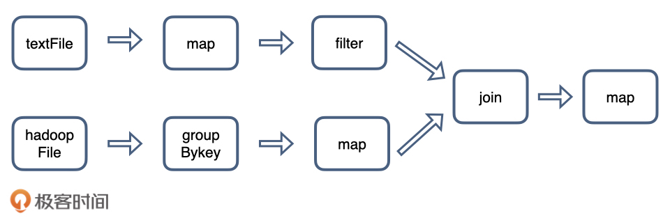
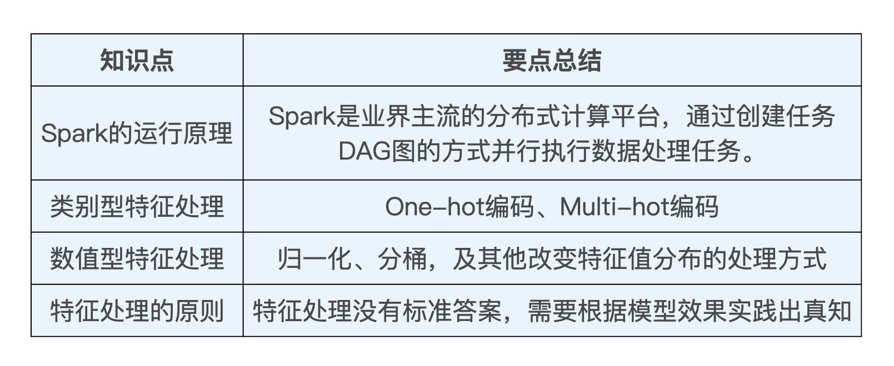
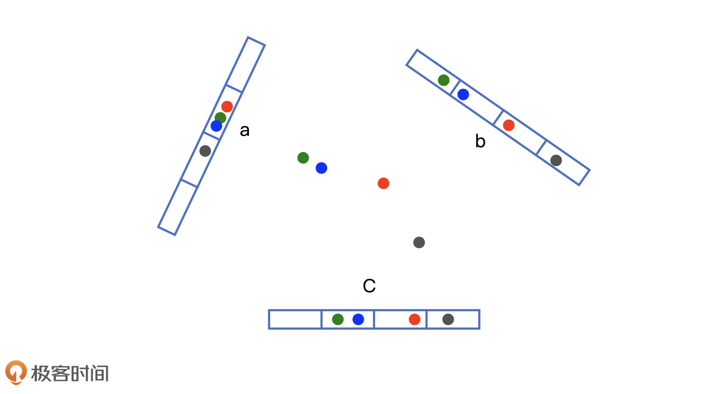
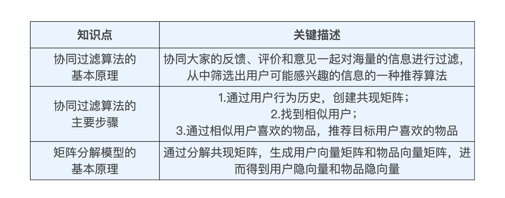

## 技术架构

当你开始学习一个全新领域的时候，你想做的第一件事情是什么？

一个是，这个领域到底要解决什么问题？第二个是，这个领域有没有一个非常高角度的思维导图，让我能够了解这个领域有哪些主要的技术，做到心中有数？

推荐系统要解决的问题用一句话总结就是，在“信息过载”的情况下，用户如何高效获取感兴趣的信息。

推荐系统要处理的其实是“人”和“信息”之间的关系问题。也就是基于“人”和“信息”，构建出一个找寻感兴趣信息的方法。

推荐系统要处理的问题可以被形式化地定义为：对于某个用户U（User），在特定场景C（Context）下，针对海量的“物品”信息构建一个函数 ，预测用户对特定候选物品I（Item）的喜好程度，再根据喜好程度对所有候选物品进行排序，生成推荐列表的问题。

深度学习对推荐系统的革命

- 深度学习应用于推荐系统，能够极大地增强推荐模型的拟合能力和表达能力。深度学习复杂的模型结构，让深度学习模型具备了理论上拟合任何函数的能力。
- 深度学习模型非常灵活的模型结构还让它具备了一个无法替代的优势，就是我们可以让深度学习模型的神经网络模拟很多用户兴趣的变迁过程，甚至用户做出决定的思考过程。比如阿里巴巴的深度学习模型——深度兴趣进化网络，它利用了三层序列模型的结构，模拟了用户在购买商品时兴趣进化的过程，如此强大的数据拟合能力和对用户行为的理解能力，是传统机器学习模型不具备的。

在实际的推荐系统中，工程师需要着重解决的问题有两类。

- 一类问题与数据和信息相关，即“用户信息”“物品信息”“场景信息”分别是什么？如何存储、更新和处理数据？
- 另一类问题与推荐系统算法和模型相关，即推荐系统模型如何训练、预测，以及如何达成更好的推荐效果？

一个工业级推荐系统的技术架构其实也是按照这两部分展开的，其中“数据和信息”部分逐渐发展为推荐系统中融合了数据离线批处理、实时流处理的数据流框架；“算法和模型”部分则进一步细化为推荐系统中，集训练（Training）、评估（Evaluation）、部署（Deployment）、线上推断（Online Inference）为一体的模型框架。

推荐系统的技术架构图：


第一部分：推荐系统的数据部分

推荐系统的“数据部分”主要负责的是“用户”“物品”“场景”信息的收集与处理。根据处理数据量和处理实时性的不同，我们会用到三种不同的数据处理方式，按照实时性的强弱排序的话，它们依次是客户端与服务器端实时数据处理、流处理平台准实时数据处理、大数据平台离线数据处理。

在实时性由强到弱递减的同时，三种平台的海量数据处理能力则由弱到强。因此，一个成熟推荐系统的数据流系统会将三者取长补短，配合使用。

大数据计算平台通过对推荐系统日志，物品和用户的元数据等信息的处理，获得了推荐模型的训练数据、特征数据、统计数据等。那这些数据都有什么用呢？具体说来，大数据平台加工后的数据出口主要有 3 个：

- 生成推荐系统模型所需的样本数据，用于算法模型的训练和评估。
- 生成推荐系统模型服务（Model Serving）所需的“用户特征”，“物品特征”和一部分“场景特征”，用于推荐系统的线上推断。
- 生成系统监控、商业智能（Business Intelligence，BI）系统所需的统计型数据。

第二部分：推荐系统的模型部分

模型的结构一般由“召回层”、“排序层”以及“补充策略与算法层”组成。

“召回层”一般由高效的召回规则、算法或简单的模型组成，这让推荐系统能快速从海量的候选集中召回用户可能感兴趣的物品。“排序层”则是利用排序模型对初筛的候选集进行精排序。而“补充策略与算法层”，也被称为“再排序层”，是在返回给用户推荐列表之前，为兼顾结果的“多样性”“流行度”“新鲜度”等指标，结合一些补充的策略和算法对推荐列表进行一定的调整，最终形成用户可见的推荐列表。

从推荐系统模型接收到所有候选物品集，到最后产生推荐列表，这一过程一般叫做“模型服务过程”。为了生成模型服务过程所需的模型参数，我们需要通过模型训练（Model Training）确定模型结构、结构中不同参数权重的具体数值，以及模型相关算法和策略中的参数取值。

模型的训练方法根据环境的不同，可以分为“离线训练”和“在线更新”两部分。其中，离线训练的特点是可以利用全量样本和特征，使模型逼近全局最优点，而在线更新则可以准实时地“消化”新的数据样本，更快地反应新的数据变化趋势，满足模型实时性的需求。

除此之外，为了评估推荐系统模型的效果，以及模型的迭代优化，推荐系统的模型部分还包括“离线评估”和“线上 A/B 测试”等多种评估模块，用来得出线下和线上评估指标，指导下一步的模型迭代优化。

深度学习对于推荐系统的革命集中在模型部分

- 深度学习中 Embedding 技术在召回层的应用。作为深度学习中非常核心的 Embedding 技术，将它应用在推荐系统的召回层中，做相关物品的快速召回，已经是业界非常主流的解决方案了。
- 不同结构的深度学习模型在排序层的应用。排序层（也称精排层）是影响推荐效果的重中之重，也是深度学习模型大展拳脚的领域。深度学习模型的灵活性高，表达能力强的特点，这让它非常适合于大数据量下的精确排序。深度学习排序模型毫无疑问是业界和学界都在不断加大投入，快速迭代的部分。增强学习在模型更新、工程模型一体化方向上的应用。
- 增强学习可以说是与深度学习密切相关的另一机器学习领域，它在推荐系统中的应用，让推荐系统可以在实时性层面更上一层楼。

Netflix架构图示意图


## 深度学习基础


哪些因素影响着深度学习网络的结构？

第一类：业务场景中用户行为的特点。很多模型结构的实现是为了模拟用户行为的特点，比如注意力机制的引入是用来模拟用户的注意力行为特点，序列模型是用来模拟用户兴趣变迁，特征交叉层是为了让用户和物品的相关特征进行交叉等等。

第二类：数据规模、算力的制约。这一点“一天”同学回答得非常有价值，在实际的业界应用中，数据规模大起来之后，我们往往不能够随意选择复杂模型，而是要在数据规模，平台算力的制约下，尽量选择效果最优的模型结构。

## 特征工程

特征工程就是利用工程手段从“用户信息”“物品信息”“场景信息”中提取特征的过程。

构建推荐系统特征工程的原则：尽可能地让特征工程抽取出的一组特征，能够保留推荐环境及用户行为过程中的所有“有用“信息，并且尽量摒弃冗余信息。

举例：


推荐系统中的常用特征

- 用户行为数据（User Behavior Data）。用户行为在推荐系统中一般分为显性反馈行为（Explicit Feedback）和隐性反馈行为（Implicit Feedback）。
  - 在当前的推荐系统特征工程中，隐性反馈行为越来越重要，主要原因是显性反馈行为的收集难度过大，数据量小。


- 用户关系数据（User Relationship Data）。用户关系数据也可以分为“显性”和“隐性”两种，或者称为“强关系”和“弱关系”。例如可以通过“关注”“好友关系”等连接建立“强关系”，也可以通过“互相点赞”“同处一个社区”，甚至“同看一部电影”建立“弱关系”。
  - 在推荐系统中，利用用户关系数据的方式也是多种多样的，比如可以将用户关系作为召回层的一种物品召回方式；也可以通过用户关系建立关系图，使用 Graph Embedding 的方法生成用户和物品的 Embedding；还可以直接利用关系数据，通过“好友”的特征为用户添加新的属性特征；甚至可以利用用户关系数据直接建立社会化推荐系统。
- 属性类数据（Attribute Data）和标签类数据（Label Data）。本质上都是直接描述用户或者物品的特征。
  - 在推荐系统中使用属性、标签类数据，一般是通过 Multi-hot 编码的方式将其转换成特征向量，一些重要的属性标签类特征也可以先转换成 Embedding，比如业界最新的做法是将标签属性类数据与其描述主体一起构建成知识图谱（Knowledge Graph），在其上施以 Graph Embedding 或者 GNN（Graph Neural Network，图神经网络）生成各节点的 Embedding，再输入推荐模型。


- 内容类数据（Content Data）可以看作属性标签型特征的延伸，同样是描述物品或用户的数据，但相比标签类特征，内容类数据往往是大段的描述型文字、图片，甚至视频。
  - 一般来说，内容类数据无法直接转换成推荐系统可以“消化”的特征，需要通过自然语言处理、计算机视觉等技术手段提取关键内容特征，再输入推荐系统。
- 场景信息，或称为上下文信息（Context Information）是描述推荐行为产生的场景的信息。最常用的上下文信息是“时间”和通过 GPS、IP 地址获得的“地点”信息。根据推荐场景的不同，上下文信息的范围极广，除了我们上面提到的时间和地点，还包括“当前所处推荐页面”“季节”“月份”“是否节假日”“天气”“空气质量”“社会大事件”等等。

### 业界主流的大数据处理利器：Spark

Spark 是一个分布式计算平台。所谓分布式，指的是计算节点之间不共享内存，需要通过网络通信的方式交换数据。Spark 最典型的应用方式就是建立在大量廉价的计算节点上，这些节点可以是廉价主机，也可以是虚拟的 Docker Container（Docker 容器）。

Spark 程序由 Manager Node（管理节点）进行调度组织，由 Worker Node（工作节点）进行具体的计算任务执行，最终将结果返回给 Drive Program（驱动程序）。在物理的 Worker Node 上，数据还会分为不同的 partition（数据分片），可以说 partition 是 Spark 的基础数据单元。


Spark 计算集群能够比传统的单机高性能服务器具备更强大的计算能力，就是由这些成百上千，甚至达到万以上规模的工作节点并行工作带来的。

**用一个任务来解释一下 Spark 的工作过程。**

我们需要先从本地硬盘读取文件 textFile，再从分布式文件系统 HDFS 读取文件 hadoopFile，然后分别对它们进行处理，再把两个文件按照 ID 都 join 起来得到最终的结果。

在 Spark 平台上处理这个任务的时候，会将这个任务拆解成一个子任务 DAG（Directed Acyclic Graph，有向无环图），再根据 DAG 决定程序各步骤执行的方法。从图 2 中我们可以看到，这个 Spark 程序分别从 textFile 和 hadoopFile 读取文件，再经过一系列 map、filter 等操作后进行 join，最终得到了处理结果。



其中，最关键的过程是我们要理解哪些是可以纯并行处理的部分，哪些是必须 shuffle（混洗）和 reduce 的部分。

这里的 shuffle 指的是所有 partition 的数据必须进行洗牌后才能得到下一步的数据，最典型的操作就是图 2 中的 groupByKey 操作和 join 操作。以 join 操作为例，我们必须对 textFile 数据和 hadoopFile 数据做全量的匹配才可以得到 join 后的 dataframe（Spark 保存数据的结构）。而 groupByKey 操作则需要对数据中所有相同的 key 进行合并，也需要全局的 shuffle 才能完成。

与之相比，map、filter 等操作仅需要逐条地进行数据处理和转换，不需要进行数据间的操作，因此各 partition 之间可以完全并行处理。

此外，在得到最终的计算结果之前，程序需要进行 reduce 的操作，从各 partition 上汇总统计结果，随着 partition 的数量逐渐减小，reduce 操作的并行程度逐渐降低，直到将最终的计算结果汇总到 master 节点（主节点）上。可以说，shuffle 和 reduce 操作的触发决定了纯并行处理阶段的边界。


shuffle 操作需要在不同计算节点之间进行数据交换，非常消耗计算、通信及存储资源，因此 shuffle 操作是 spark 程序应该尽量避免的。

一句话总结 Spark 的计算过程：Stage 内部数据高效并行计算，Stage 边界处进行消耗资源的 shuffle 操作或者最终的 reduce 操作。

#### 如何利用 One-hot 编码处理类别型特征

```scala

def oneHotEncoderExample(samples:DataFrame): Unit ={
  //samples样本集中的每一条数据代表一部电影的信息，其中movieId为电影id
  val samplesWithIdNumber = samples.withColumn("movieIdNumber", col("movieId").cast(sql.types.IntegerType))


  //利用Spark的机器学习库Spark MLlib创建One-hot编码器
  val oneHotEncoder = new OneHotEncoderEstimator()
    .setInputCols(Array("movieIdNumber"))
    .setOutputCols(Array("movieIdVector"))
    .setDropLast(false)


  //训练One-hot编码器，并完成从id特征到One-hot向量的转换
  val oneHotEncoderSamples =      oneHotEncoder.fit(samplesWithIdNumber).transform(samplesWithIdNumber)
  //打印最终样本的数据结构
  oneHotEncoderSamples.printSchema()
  //打印10条样本查看结果
  oneHotEncoderSamples.show(10)

//参考 com.wzhe.sparrowrecsys.offline.spark.featureeng.FeatureEngineering__中的oneHotEncoderExample函数）
```

#### 数值型特征的处理 - 归一化和分桶

一是特征的尺度，二是特征的分布。

如果两个特征的尺度差距太大，我们把特征的原始数值直接输入推荐模型，就会导致这两个特征对于模型的影响程度有显著的区别。其中一个特征由于波动范围高出另一个特征几个量级，可能会完全掩盖它的作用。为此我们希望把两个特征的尺度拉平到一个区域内，通常是[0,1]范围，这就是所谓**归一化**。

归一化虽然能够解决特征取值范围不统一的问题，但无法改变特征值的分布。特征分布不均匀导致特征的区分度并不高。我们经常会用分桶的方式来解决特征值分布极不均匀的问题。所谓“分桶（Bucketing）”，就是将样本按照某特征的值从高到低排序，然后按照桶的数量找到分位数，将样本分到各自的桶中，再用桶 ID 作为特征值。

在 Spark MLlib 中，分别提供了两个转换器 MinMaxScaler 和 QuantileDiscretizer，来进行归一化和分桶的特征处理。

```scala

def ratingFeatures(samples:DataFrame): Unit ={
  samples.printSchema()
  samples.show(10)


  //利用打分表ratings计算电影的平均分、被打分次数等数值型特征
  val movieFeatures = samples.groupBy(col("movieId"))
    .agg(count(lit(1)).as("ratingCount"),
      avg(col("rating")).as("avgRating"),
      variance(col("rating")).as("ratingVar"))
      .withColumn("avgRatingVec", double2vec(col("avgRating")))


  movieFeatures.show(10)


  //分桶处理，创建QuantileDiscretizer进行分桶，将打分次数这一特征分到100个桶中
  val ratingCountDiscretizer = new QuantileDiscretizer()
    .setInputCol("ratingCount")
    .setOutputCol("ratingCountBucket")
    .setNumBuckets(100)


  //归一化处理，创建MinMaxScaler进行归一化，将平均得分进行归一化
  val ratingScaler = new MinMaxScaler()
    .setInputCol("avgRatingVec")
    .setOutputCol("scaleAvgRating")


  //创建一个pipeline，依次执行两个特征处理过程
  val pipelineStage: Array[PipelineStage] = Array(ratingCountDiscretizer, ratingScaler)
  val featurePipeline = new Pipeline().setStages(pipelineStage)


  val movieProcessedFeatures = featurePipeline.fit(movieFeatures).transform(movieFeatures)
  //打印最终结果
  movieProcessedFeatures.show(

_（参考 com.wzhe.sparrowrecsys.offline.spark.featureeng.FeatureEngineering中的ratingFeatures函数）_
```

对于数值型特征的处理方法还远不止于此，在经典的 YouTube 深度推荐模型中，我们就可以看到一些很有意思的处理方法。比如，在处理观看时间间隔（time since last watch）和视频曝光量（#previous impressions）这两个特征的时，YouTube 模型对它们进行归一化后，又将它们各自处理成了三个特征（图中红框内的部分），分别是原特征值 x，特征值的平方x^2，以及特征值的开方.


无论是平方还是开方操作，改变的还是这个特征值的分布，这些操作与分桶操作一样，都是希望通过改变特征的分布，让模型能够更好地学习到特征内包含的有价值信息。但由于我们没法通过人工的经验判断哪种特征处理方式更好，所以索性把它们都输入模型，让模型来做选择。

**特征处理并没有标准答案，不存在一种特征处理方式是一定好于另一种的。**在实践中，我们需要多进行一些尝试，找到那个最能够提升模型效果的一种或一组处理方式。



## Embedding

简单来说，Embedding 就是用一个数值向量“表示”一个对象（Object）的方法。

首先，Embedding 是处理稀疏特征的利器。 上节课我们学习了 One-hot 编码，因为推荐场景中的类别、ID 型特征非常多，大量使用 One-hot 编码会导致样本特征向量极度稀疏，而深度学习的结构特点又不利于稀疏特征向量的处理，因此几乎所有深度学习推荐模型都会由 Embedding 层负责将稀疏高维特征向量转换成稠密低维特征向量。所以说各类 Embedding 技术是构建深度学习推荐模型的基础性操作。

其次，Embedding 可以融合大量有价值信息，本身就是极其重要的特征向量 。 相比由原始信息直接处理得来的特征向量，Embedding 的表达能力更强，特别是 Graph Embedding 技术被提出后，Embedding 几乎可以引入任何信息进行编码，使其本身就包含大量有价值的信息，所以通过预训练得到的 Embedding 向量本身就是极其重要的特征向量。

为什么深度学习的结构特点不利于稀疏特征向量的处理呢？

一方面，如果我们深入到神经网络的梯度下降学习过程就会发现，特征过于稀疏会导致整个网络的收敛非常慢，因为每一个样本的学习只有极少数的权重会得到更新，这在样本数量有限的情况下会导致模型不收敛。另一个方面，One-hot 类稀疏特征的维度往往非常地大，可能会达到千万甚至亿的级别，如果直接连接进入深度学习网络，那整个模型的参数数量会非常庞大，这对于一般公司的算力开销来说都是吃不消的。因此，我们往往会先通过 Embedding 把原始稀疏特征稠密化，然后再输入复杂的深度学习网络进行训练，这相当于把原始特征向量跟上层复杂深度学习网络做一个隔离。

### Word2vec

CBOW 模型假设句子中每个词的选取都由相邻的词决定，因此我们就看到 CBOW 模型的输入是 wt周边的词，预测的输出是 wt。Skip-gram 模型则正好相反，它假设句子中的每个词都决定了相邻词的选取，所以你可以看到 Skip-gram 模型的输入是 wt，预测的输出是 wt周边的词。按照一般的经验，Skip-gram 模型的效果会更好一些

它的输入层和输出层的维度都是 V，这个 V 其实就是语料库词典的大小。假设语料库一共使用了 10000 个词，那么 V 就等于 10000。根据图 4 生成的训练样本，这里的输入向量自然就是由输入词转换而来的 One-hot 编码向量，输出向量则是由多个输出词转换而来的 Multi-hot 编码向量，显然，基于 Skip-gram 框架的 Word2vec 模型解决的是一个多分类问题。

隐层的维度是 N，N 的选择就需要一定的调参能力了，我们需要对模型的效果和模型的复杂度进行权衡，来决定最后 N 的取值，并且最终每个词的 Embedding 向量维度也由 N 来决定。

隐层神经元是没有激活函数的，或者说采用了输入即输出的恒等函数作为激活函数，而输出层神经元采用了 softmax 作为激活函数。

推荐资料：[《Word2vec Parameter Learning Explained》](https://github.com/wzhe06/Reco-papers/blob/master/Embedding/%5BWord2Vec%5D%20Word2vec%20Parameter%20Learning%20Explained%20%28UMich%202016%29.pdf)

Item2Vec：Word2vec 方法的推广

微软于 2015 年提出了 Item2Vec 方法。Item2Vec 模型的技术细节几乎和 Word2vec 完全一致，只要能够用序列数据的形式把我们要表达的对象表示出来，再把序列数据“喂”给 Word2vec 模型，我们就能够得到任意物品的 Embedding 了。


计算向量间相似度的常用方法：https://cloud.tencent.com/developer/article/1668762

### Graph Embedding

社交网络图、知识图谱、行为关系类图数据

#### 基于随机游走的 Graph Embedding 方法：Deep Walk

主要思想是在由物品组成的图结构上进行随机游走，产生大量物品序列，然后将这些物品序列作为训练样本输入 Word2vec 进行训练，最终得到物品的 Embedding。因此，DeepWalk 可以被看作连接序列 Embedding 和 Graph Embedding 的一种过渡方法。


DeepWalk 的跳转概率就是跳转边的权重占所有相关出边权重之和的比例。

####在同质性和结构性间权衡的方法，Node2vec

网络的“同质性”指的是距离相近节点的 Embedding 应该尽量近似，在电商网站中，同质性的物品很可能是同品类、同属性，或者经常被一同购买的物品。

“结构性”指的是结构上相似的节点的 Embedding 应该尽量接近，在电商网站中，结构性相似的物品一般是各品类的爆款、最佳凑单商品等拥有类似趋势或者结构性属性的物品。

为了使 Graph Embedding 的结果能够表达网络的“结构性”，在随机游走的过程中，我们需要让游走的过程更倾向于 BFS（Breadth First Search，宽度优先搜索），因为 BFS 会更多地在当前节点的邻域中进行游走遍历，相当于对当前节点周边的网络结构进行一次“微观扫描”。当前节点是“局部中心节点”，还是“边缘节点”，亦或是“连接性节点”，其生成的序列包含的节点数量和顺序必然是不同的，从而让最终的 Embedding 抓取到更多结构性信息。

为了表达“同质性”，随机游走要更倾向于 DFS（Depth First Search，深度优先搜索）才行，因为 DFS 更有可能通过多次跳转，游走到远方的节点上。但无论怎样，DFS 的游走更大概率会在一个大的集团内部进行，这就使得一个集团或者社区内部节点的 Embedding 更为相似，从而更多地表达网络的“同质性”。

### Embedding 应用在推荐系统的特征工程

Embedding 是一种更高阶的特征处理方法，它具备了把序列结构、网络结构、甚至其他特征融合到一个特征向量中的能力。

Embedding 在推荐系统中的应用方式大致有三种，分别是“直接应用”“预训练应用”和“End2End 应用”。

直接利用 Embedding 向量的相似性实现某些推荐系统的功能。典型的功能有，利用物品 Embedding 间的相似性实现相似物品推荐，利用物品 Embedding 和用户 Embedding 的相似性实现“猜你喜欢”等经典推荐功能，还可以利用物品 Embedding 实现推荐系统中的召回层等。

“预训练应用”指的是在我们预先训练好物品和用户的 Embedding 之后，不直接应用，而是把这些 Embedding 向量作为特征向量的一部分，跟其余的特征向量拼接起来，作为推荐模型的输入参与训练。这样做能够更好地把其他特征引入进来，让推荐模型作出更为全面且准确的预测。

把 Embedding 的训练与深度学习推荐模型结合起来，采用统一的、端到端的方式一起训练，直接得到包含 Embedding 层的推荐模型。这种方式非常流行，比如图 6 就展示了三个包含 Embedding 层的经典模型，分别是微软的 Deep Crossing，UCL 提出的 FNN 和 Google 的 Wide&Deep。


Embedding预训练的优点：1.更快。因为对于End2End的方式，Embedding层的优化还受推荐算法的影响，这会增加计算量。2.难收敛。推荐算法是以Embedding为前提的，在端到端的方式中，在训练初期由于Embedding层的结果没有意义，所以推荐模块的优化也可能不太有意义，可能无法有效收敛。
Embedding端到端的优点：可能收敛到更好的结果。端到端因为将Embedding和推荐算法连接起来训练，那么Embedding层可以学习到最有利于推荐目标的Embedding结果。

### Spark应用

Item2vec：序列数据的处理

准备好训练用的序列数据。两个问题：一是 MovieLens 这个 rating 表本质上只是一个评分的表，不是真正的“观影序列”。但对用户来说，当然只有看过这部电影才能够评价它，所以，我们几乎可以把评分序列当作是观影序列。二是我们是应该把所有电影都放到序列中，还是只放那些打分比较高的呢？

这里，我是建议对评分做一个过滤，只放用户打分比较高的电影。为什么这么做呢？我们要思考一下 Item2vec 这个模型本质上是要学习什么。我们是希望 Item2vec 能够学习到物品之间的近似性。既然这样，我们当然是希望评分好的电影靠近一些，评分差的电影和评分好的电影不要在序列中结对出现。

```scala

def processItemSequence(sparkSession: SparkSession): RDD[Seq[String]] ={
  //设定rating数据的路径并用spark载入数据
  val ratingsResourcesPath = this.getClass.getResource("/webroot/sampledata/ratings.csv")
  val ratingSamples = sparkSession.read.format("csv").option("header", "true").load(ratingsResourcesPath.getPath)


  //实现一个用户定义的操作函数(UDF)，用于之后的排序
  val sortUdf: UserDefinedFunction = udf((rows: Seq[Row]) => {
    rows.map { case Row(movieId: String, timestamp: String) => (movieId, timestamp) }
      .sortBy { case (movieId, timestamp) => timestamp }
      .map { case (movieId, timestamp) => movieId }
  })


  //把原始的rating数据处理成序列数据
  val userSeq = ratingSamples
    .where(col("rating") >= 3.5)  //过滤掉评分在3.5一下的评分记录
    .groupBy("userId")            //按照用户id分组
    .agg(sortUdf(collect_list(struct("movieId", "timestamp"))) as "movieIds")     //每个用户生成一个序列并用刚才定义好的udf函数按照timestamp排序
    .withColumn("movieIdStr", array_join(col("movieIds"), " "))
                //把所有id连接成一个String，方便后续word2vec模型处理


  //把序列数据筛选出来，丢掉其他过程数据
  userSeq.select("movieIdStr").rdd.map(r => r.getAs[String]("movieIdStr").split(" ").toSeq)
```

模型训练

```scala

def trainItem2vec(samples : RDD[Seq[String]]): Unit ={
    //设置模型参数
    val word2vec = new Word2Vec()
    .setVectorSize(10)
    .setWindowSize(5)
    .setNumIterations(10)


  //训练模型
  val model = word2vec.fit(samples)


  //训练结束，用模型查找与item"592"最相似的20个item
  val synonyms = model.findSynonyms("592", 20)
  for((synonym, cosineSimilarity) <- synonyms) {
    println(s"$synonym $cosineSimilarity")
  }
 
  //保存模型
  val embFolderPath = this.getClass.getResource("/webroot/sampledata/")
  val file = new File(embFolderPath.getPath + "embedding.txt")
  val bw = new BufferedWriter(new FileWriter(file))
  var id = 0
  //用model.getVectors获取所有Embedding向量
  for (movieId <- model.getVectors.keys){
    id+=1
    bw.write( movieId + ":" + model.getVectors(movieId).mkString(" ") + "\n")
  }
  bw.close()
```

Graph Embedding

生成物品之间的转移概率矩阵

```scala

//samples 输入的观影序列样本集
def graphEmb(samples : RDD[Seq[String]], sparkSession: SparkSession): Unit ={
  //通过flatMap操作把观影序列打碎成一个个影片对
  val pairSamples = samples.flatMap[String]( sample => {
    var pairSeq = Seq[String]()
    var previousItem:String = null
    sample.foreach((element:String) => {
      if(previousItem != null){
        pairSeq = pairSeq :+ (previousItem + ":" + element)
      }
      previousItem = element
    })
    pairSeq
  })
  //统计影片对的数量
  val pairCount = pairSamples.countByValue()
  //转移概率矩阵的双层Map数据结构
  val transferMatrix = scala.collection.mutable.Map[String, scala.collection.mutable.Map[String, Long]]()
  val itemCount = scala.collection.mutable.Map[String, Long]()


  //求取转移概率矩阵
  pairCount.foreach( pair => {
    val pairItems = pair._1.split(":")
    val count = pair._2
    lognumber = lognumber + 1
    println(lognumber, pair._1)


    if (pairItems.length == 2){
      val item1 = pairItems.apply(0)
      val item2 = pairItems.apply(1)
      if(!transferMatrix.contains(pairItems.apply(0))){
        transferMatrix(item1) = scala.collection.mutable.Map[String, Long]()
      }


      transferMatrix(item1)(item2) = count
      itemCount(item1) = itemCount.getOrElse[Long](item1, 0) + count
    }
  

```

随机游走采样过程

```scala

//随机游走采样函数
//transferMatrix 转移概率矩阵
//itemCount 物品出现次数的分布
def randomWalk(transferMatrix : scala.collection.mutable.Map[String, scala.collection.mutable.Map[String, Long]], itemCount : scala.collection.mutable.Map[String, Long]): Seq[Seq[String]] ={
  //样本的数量
  val sampleCount = 20000
  //每个样本的长度
  val sampleLength = 10
  val samples = scala.collection.mutable.ListBuffer[Seq[String]]()
  
  //物品出现的总次数
  var itemTotalCount:Long = 0
  for ((k,v) <- itemCount) itemTotalCount += v


  //随机游走sampleCount次，生成sampleCount个序列样本
  for( w <- 1 to sampleCount) {
    samples.append(oneRandomWalk(transferMatrix, itemCount, itemTotalCount, sampleLength))
  }


  Seq(samples.toList : _*)
}


//通过随机游走产生一个样本的过程
//transferMatrix 转移概率矩阵
//itemCount 物品出现次数的分布
//itemTotalCount 物品出现总次数
//sampleLength 每个样本的长度
def oneRandomWalk(transferMatrix : scala.collection.mutable.Map[String, scala.collection.mutable.Map[String, Long]], itemCount : scala.collection.mutable.Map[String, Long], itemTotalCount:Long, sampleLength:Int): Seq[String] ={
  val sample = scala.collection.mutable.ListBuffer[String]()


  //决定起始点
  val randomDouble = Random.nextDouble()
  var firstElement = ""
  var culCount:Long = 0
  //根据物品出现的概率，随机决定起始点
  breakable { for ((item, count) <- itemCount) {
    culCount += count
    if (culCount >= randomDouble * itemTotalCount){
      firstElement = item
      break
    }
  }}


  sample.append(firstElement)
  var curElement = firstElement
  //通过随机游走产生长度为sampleLength的样本
  breakable { for( w <- 1 until sampleLength) {
    if (!itemCount.contains(curElement) || !transferMatrix.contains(curElement)){
      break
    }
    //从curElement到下一个跳的转移概率向量
    val probDistribution = transferMatrix(curElement)
    val curCount = itemCount(curElement)
    val randomDouble = Random.nextDouble()
    var culCount:Long = 0
    //根据转移概率向量随机决定下一跳的物品
    breakable { for ((item, count) <- probDistribution) {
      culCount += count
      if (culCount >= randomDouble * curCount){
        curElement = item
        break
      }
    }}
    sample.append(curElement)
  }}
  Seq(sample.toList : _

```


## 线上服务

高并发推荐服务的整体架构

宏观来讲，高并发推荐服务的整体架构主要由三个重要机制支撑，它们分别是负载均衡、缓存、推荐服务降级机制。

首先是负载均衡。它是整个推荐服务能够实现高可用、可扩展的基础。当推荐服务支持的业务量达到一定规模的时候，单独依靠一台服务器是不可行的，无论这台服务器的性能有多强大，都不可能独立支撑起高 QPS（Queries Per Second，每秒查询次数）的需求。这时候，我们就需要增加服务器来分担独立节点的压力。既然有多个劳动力在干活，那我们还需要一个“工头”来分配任务，以达到按能力分配和高效率分配的目的，这个“工头”就是所谓的“负载均衡服务器”。


在实际工程中，负载均衡服务器也经常采用非常高效的 nginx 技术选型，甚至采用专门的硬件级负载均衡设备作为解决方案。

“负载均衡”解决高并发的思路是“增加劳动力”，那我们能否从“减少劳动量”的角度来解决高并发带来的负载压力呢？

比如说，当同一个用户多次请求同样的推荐服务时，我们就可以在第一次请求时把 TA 的推荐结果缓存起来，在后续请求时直接返回缓存中的结果就可以了，不用再通过复杂的推荐逻辑重新算一遍。再比如说，对于新用户来说，因为他们几乎没有行为历史的记录，所以我们可以先按照一些规则预先缓存好几类新用户的推荐列表，等遇到新用户的时候就直接返回。

因此，在一个成熟的工业级推荐系统中，合理的缓存策略甚至能够阻挡掉 90% 以上的推荐请求，大大减小推荐服务器的计算压力。

但不管再强大的服务集群，再有效的缓存方案，也都有可能遭遇特殊时刻的流量洪峰或者软硬件故障。在这种特殊情况下，为了防止推荐服务彻底熔断崩溃，甚至造成相关微服务依次崩溃的“雪崩效应”，我们就要在第一时间将问题控制在推荐服务内部，而应对的最好机制就是“服务降级”。

所谓“服务降级”就是抛弃原本的复杂逻辑，采用最保险、最简单、最不消耗资源的降级服务来渡过特殊时期。比如对于推荐服务来说，我们可以抛弃原本的复杂推荐模型，采用基于规则的推荐方法来生成推荐列表，甚至直接在缓存或者内存中提前准备好应对故障时的默认推荐列表，做到“0”计算产出服务结果，这些都是服务降级的可行策略。

总之，“负载均衡”提升服务能力，“缓存”降低服务压力，“服务降级”机制保证故障时刻的服务不崩溃，压力不传导，这三点可以看成是一个成熟稳定的高并发推荐服务的基石。

### 搭建一个工业级推荐服务器的雏形

首先，我们要做的就是选择服务器框架。这里，我们选择的服务器框架是 Java 嵌入式服务器 Jetty。为什么我们不选择其他的服务器呢？原因有三个。

第一，相比于 Python 服务器的效率问题，以及 C++ 服务器的开发维护难度，Java 服务器在效率和开发难度上做到了一个权衡，而且互联网上有大量开源 Java 项目可以供我们直接融合调用，所以 Java 服务器开发的扩展性比较好。

第二，相比 Tomcat 等其他 Java 服务器，Jetty 是嵌入式的，它更轻量级，没有过多 J2EE 的冗余功能，可以专注于建立高效的 API 推荐服务。而 Tomcat 更适用于搭建一整套的 J2EE 项目。

第三，相比于基于 Node.js、Go 这样的服务器，Java 社区更成熟和主流一些，应用范围更广。当然，每一种技术选择都有它的优势，C++ 的效率更高，Python 更便捷，Go 的上升势头也愈发明显，我们只要清楚 Jetty 是企业级服务的选择之一就够了，我们接下来的服务器端实践也是基于 Jetty 开展的。

作为一款嵌入式服务器框架，Jetty 的最大优势是除了 Java 环境外，你不用配置任何其他环境，也不用安装额外的软件依赖，你可以直接在 Java 程序中创建对外服务的 HTTP API，之后在 IDE 中运行或者打 Jar 包运行就可以了。下面就是我们 Sparrow Recsys 中创建推荐服务器的代码

```java

public class RecSysServer {
    //主函数，创建推荐服务器并运行
    public static void main(String[] args) throws Exception {
        new RecSysServer().run();
    }
    //推荐服务器的默认服务端口6010
    private static final int DEFAULT_PORT = 6010;


    //运行推荐服务器的函数
    public void run() throws Exception{
        int port = DEFAULT_PORT;
        //绑定IP地址和端口，0.0.0.0代表本地运行
        InetSocketAddress inetAddress = new InetSocketAddress("0.0.0.0", port);
        //创建Jetty服务器
        Server server = new Server(inetAddress);
        //创建Jetty服务器的环境handler
        ServletContextHandler context = new ServletContextHandler();
        context.setContextPath("/");
        context.setWelcomeFiles(new String[] { "index.html" });


        //添加API，getMovie，获取电影相关数据
        context.addServlet(new ServletHolder(new MovieService()), "/getmovie");
        //添加API，getuser，获取用户相关数据
        context.addServlet(new ServletHolder(new UserService()), "/getuser");
        //添加API，getsimilarmovie，获取相似电影推荐
        context.addServlet(new ServletHolder(new SimilarMovieService()), "/getsimilarmovie");
        //添加API，getrecommendation，获取各类电影推荐
        context.addServlet(new ServletHolder(new RecommendationService()), "/getrecommendation");
        //设置Jetty的环境handler
        server.setHandler(context);


        //启动Jetty服务器
        server.start();
        server.join();
    }
```

 Jetty Context 中的 Servlet 服务举例

```java

//MovieService需要继承Jetty的HttpServlet
public class MovieService extends HttpServlet {
    //实现servlet中的get method
    protected void doGet(HttpServletRequest request,
                         HttpServletResponse response) throws IOException {
        try {
            //该接口返回json对象，所以设置json类型
            response.setContentType("application/json");
            response.setStatus(HttpServletResponse.SC_OK);
            response.setCharacterEncoding("UTF-8");
            response.setHeader("Access-Control-Allow-Origin", "*");
            
            //获得请求中的id参数，转换为movie id
            String movieId = request.getParameter("id");
            //从数据库中获取该movie的数据对象
            Movie movie = DataManager.getInstance().getMovieById(Integer.parseInt(movieId));


            if (null != movie) {
                //使用fasterxml.jackson库把movie对象转换成json对象
                ObjectMapper mapper = new ObjectMapper();
                String jsonMovie = mapper.writeValueAsString(movie);
                //返回json对象
                response.getWriter().println(jsonMovie);
            }else {
                response.getWriter().println("");
            }


        } catch (Exception e) {
            e.printStackTrace();
            response.getWriter().println("");
        }
    }
```


本地运行项目，测试该方法：http://localhost:6010/getmovie?id=1


在一个高并发的推荐服务集群中，负载均衡服务器的作用至关重要，如果你是负载均衡服务器的策略设计师的话，你会怎么实现这个“工头”的调度策略，让它能够公平又高效的完成调度任务呢？（比如是按每个节点的能力分配？还是按照请求本身的什么特点来分配？如何知道什么时候应该扩展节点，什么时候应该关闭节点？）

源地址哈希，或根据服务器计算能力加权随机分配，当出现大量节点利用率很低时，进行资源回收，减少虚拟机，当大部分节点都出现overload情况，进行扩容，增加虚拟机数量。

1.如果硬件配置基本一样且部署服务一样，就采用轮询或者随机的负载均衡策略
2.如果硬件配置不同，可以根据硬件的计算能力做加权的负载均衡策略
3.同样也可以利用源地址hash做策略
4.关于扩容和缩容:可以根据系统负载情况做动态调整。

负载均衡的策略其实有多种选择，比如“smjccj”同学的回答就很专业，他说可以进行源地址哈希，或根据服务器计算能力加权随机分配。这是一个很好的答案，这里我再补充一下。通常来说，常用的负载均衡的策略有三种，分别是轮询调度、哈希调度和一致性哈希调度。我们一一来看。

轮询调度就是以轮询的方式依次把请求调度到不同的服务器。在服务器的算力等硬件配置不同的时候，我们还可以为每个服务器设定权重，按权重比例为能力强的服务器分配更多的请求。

而哈希调度指的是通过某个哈希函数把 key 分配给某个桶，这里 key 可以是请求中的用户 ID，物品 ID 等 ID 型信息，桶的总数就是服务器的总数。这样一来，我们就可以把某个用户的请求分配给某个服务器处理。这么做的好处是可以让一个 key 落在固定的服务器节点上，有利于节约服务器内部缓存的使用。

哈希方式的缺点在于无法高效处理故障点，一旦某个点有故障需要减少桶的数量，或者在 QPS 增大时需要增加服务器，整个分配过程就被完全打乱。因此，一致性哈希调度就是更好的解决方案，简单来说就是使用哈希环来解决计算节点的增加和减少的问题，具体的实现我推荐你参考《一致性哈希算法的理解与实践》这篇文章。


推荐系统中的冷启动策略指的是什么？

冷启动是推荐系统一定要考虑的问题。它是指推荐系统在没有可用信息，或者可用信息很少的情形下怎么做推荐的问题，冷启动可以分为用户冷启动和物品冷启动两类。

用户冷启动是指用户没有可用的行为历史情况下的推荐问题。一般来说，我们需要清楚在没有推荐历史的情况下，还有什么用户特征可以使用，比如注册时的信息，访问 APP 时可以获得的地点、时间信息等等，根据这些有限的信息，我们可以为用户做一个聚类，为每类冷启动用户返回合适的推荐列表。当然，我们也可以利用可用的冷启动特征，来构建一个较简单的冷启动推荐模型，去解决冷启动问题。

对于物品冷启动来说，主要处理的是新加入系统的物品，它们没有跟用户的交互信息。所以，针对物品冷启动，我们除了用类似用户冷启动的方式解决它以外，还可以通过物品分类等信息找到一些相似物品，如果这些相似物品已经具有了预训练的 Embedding，我们也可以采用相似物品 Embedding 平均的方式，来快速确定冷启动物品的 Embedding，让它们通过 Embedding 的方式参与推荐过程。

### 用Redis解决推荐系统特征的存储问题

对于推荐服务器来说，由于线上的 QPS 压力巨大，每次有推荐请求到来，推荐服务器都需要把相关的特征取出。这就要求推荐服务器一定要“快”。

对于一个成熟的互联网应用来说，它的用户数和物品数一定是巨大的，几千万上亿的规模是十分常见的。所以对于存储模块来说，这么多用户和物品特征所需的存储量会特别大。这个时候，事情就很难办了，又要存储量大，又要查询快，还要面对高 QPS 的压力。很不幸，没有一个独立的数据库能经济又高效地单独完成这样复杂的任务。

因此，几乎所有的工业级推荐系统都会做一件事情，就是把特征的存储做成分级存储，把越频繁访问的数据放到越快的数据库甚至缓存中，把海量的全量数据放到便宜但是查询速度较慢的数据库中。


比如说，Netflix 使用的 Cassandra，它作为流行的 NoSQL 数据库，具备大数据存储的能力，但为支持推荐服务器高 QPS 的需求，我们还需要把最常用的特征和模型参数存入 EVcache 这类内存数据库。而对于更常用的数据，我们可以把它们存储在 Guava Cache 等服务器内部缓存，甚至是服务器的内存中。总之，对于一个工程师来说，我们经常需要做出技术上的权衡，达成一个在花销和效果上平衡最优的技术方案。

而对于 MySQL 来说，由于它是一个强一致性的关系型数据库，一般存储的是比较关键的要求强一致性的信息，比如物品是否可以被推荐这种控制类的信息，物品分类的层级关系，用户的注册信息等等。这类信息一般是由推荐服务器进行阶段性的拉取，或者利用分级缓存进行阶段性的更新，避免因为过于频繁的访问压垮 MySQL。

总的来说，推荐系统存储模块的设计原则就是“分级存储，把越频繁访问的数据放到越快的数据库甚至缓存中，把海量的全量数据放到廉价但是查询速度较慢的数据库中”。

SparrowRecsys使用基础的文件系统保存全量的离线特征和模型数据，用 Redis 保存线上所需特征和模型数据，使用服务器内存缓存频繁访问的特征。

在实现技术方案之前，对于问题的整体分析永远都是重要的。我们需要先确定具体的存储方案，这个方案必须精确到哪级存储对应哪些具体特征和模型数据。


首先，用户特征的总数比较大，它们很难全部载入到服务器内存中，所以我们把用户特征载入到 Redis 之类的内存数据库中是合理的。其次，物品特征的总数比较小，而且每次用户请求，一般只会用到一个用户的特征，但为了物品排序，推荐服务器需要访问几乎所有候选物品的特征。针对这个特点，我们完全可以把所有物品特征阶段性地载入到服务器内存中，大大减少 Redis 的线上压力。

最后，我们还要找一个地方去存储特征历史数据、样本数据等体量比较大，但不要求实时获取的数据。这个时候分布式文件系统（单机环境下以本机文件系统为例）往往是最好的选择，由于类似 HDFS 之类的分布式文件系统具有近乎无限的存储空间，我们可以把每次处理的全量特征，每次训练的 Embedding 全部保存到分布式文件系统中，方便离线评估时使用。


Redis 的两个主要特点。

一是所有的数据都以 Key-value 的形式存储。 其中，Key 只能是字符串，value 可支持的数据结构包括 string(字符串)、list(链表)、set(集合)、zset(有序集合) 和 hash(哈希)。这个特点决定了 Redis 的使用方式，无论是存储还是获取，都应该以键值对的形式进行，并且根据你的数据特点，设计值的数据结构。

二是所有的数据都存储在内存中，磁盘只在持久化备份或恢复数据时起作用。这个特点决定了 Redis 的特性，一是 QPS 峰值可以很高，二是数据易丢失，所以我们在维护 Redis 时要充分考虑数据的备份问题，或者说，不应该把关键的业务数据唯一地放到 Redis 中。但对于可恢复，不关乎关键业务逻辑的推荐特征数据，就非常适合利用 Redis 提供高效的存储和查询服务。

首先是安装 Redis。 Redis 的安装过程在 linux/Unix 环境下非常简单，你参照[官方网站](http://www.redis.cn/download.html)的步骤依次执行就好。Windows 环境下的安装过程稍复杂一些，你可以参考[这篇文章](https://www.cnblogs.com/liuqingzheng/p/9831331.html)进行安装。

在启动 Redis 之后，如果没有特殊的设置，Redis 服务会默认运行在 6379 端口，没有特殊情况保留这个默认的设置就可以了，因为我们的 Sparrow RecSys 也是默认从 6379 端口存储和读取 Redis 数据的。

然后是运行离线程序，通过 jedis 客户端写入 Redis。 在 Redis 运行起来之后，我们就可以在离线 Spark 环境下把特征数据写入 Redis。

首先我们利用最常用的 Redis Java 客户端 Jedis 生成 redisClient，然后遍历训练好的 Embedding 向量，将 Embedding 向量以字符串的形式存入 Redis，并设置过期时间（ttl）。具体实现请参考下面的代码（代码参考 com.wzhe.sparrowrecsys.offline.spark.featureeng.Embedding 中的 trainItem2vec 函数）：

```scala

if (saveToRedis) {
  //创建redis client
  val redisClient = new Jedis(redisEndpoint, redisPort)
  val params = SetParams.setParams()
  //设置ttl为24小时
  params.ex(60 * 60 * 24)
  //遍历存储embedding向量
  for (movieId <- model.getVectors.keys) {
    //key的形式为前缀+movieId，例如i2vEmb:361
    //value的形式是由Embedding向量生成的字符串，例如 "0.1693846 0.2964318 -0.13044095 0.37574086 0.55175656 0.03217995 1.327348 -0.81346786 0.45146862 0.49406642"
    redisClient.set(redisKeyPrefix + ":" + movieId, model.getVectors(movieId).mkString(" "), params)
  }
  //关闭客户端连接
  redisClient.close()
}

```

最后是在推荐服务器中把 Redis 数据读取出来。

在服务器端，根据刚才梳理出的存储方案，我们希望服务器能够把所有物品 Embedding 阶段性地全部缓存在服务器内部，用户 Embedding 则进行实时查询。这里，我把缓存物品 Embedding 的代码放在了下面。先用 keys 操作把所有物品 Embedding 前缀的键找出，然后依次将 Embedding 载入内存。

```scala

//创建redis client
Jedis redisClient = new Jedis(REDIS_END_POINT, REDIS_PORT);
//查询出所有以embKey为前缀的数据
Set<String> movieEmbKeys = redisClient.keys(embKey + "*");
int validEmbCount = 0;
//遍历查出的key
for (String movieEmbKey : movieEmbKeys){
    String movieId = movieEmbKey.split(":")[1];
    Movie m = getMovieById(Integer.parseInt(movieId));
    if (null == m) {
        continue;
    }
    //用redisClient的get方法查询出key对应的value，再set到内存中的movie结构中
    m.setEmb(parseEmbStr(redisClient.get(movieEmbKey)));
    validEmbCount++;
}
redisClient.close();

```

这样一来，在具体为用户推荐的过程中，我们再利用相似的接口查询出用户的 Embedding，与内存中的 Embedding 进行相似度的计算，就可以得到最终的推荐列表了。

如果你已经安装好了 Redis，我非常推荐你运行 SparrowRecsys 中 Offline 部分 Embedding 主函数，先把物品和用户 Embedding 生成并且插入 Redis（注意把 saveToRedis 变量改为 true）。然后再运行 Online 部分的 RecSysServer，看一下推荐服务器有没有正确地从 Redis 中读出物品和用户 Embedding 并产生正确的推荐结果（注意，记得要把 util.Config 中的 EMB_DATA_SOURCE 配置改为 DATA_SOURCE_REDIS）。


你觉得课程中存储 Embedding 的方式还有优化的空间吗？除了 string，我们是不是还可以用其他 Redis value 的数据结构存储 Embedding 数据，那从效率的角度考虑，使用 string 和使用其他数据结构的优缺点有哪些？为什么？

redis keys命令不能用在生产环境中，如果数量过大效率十分低，导致redis长时间堵塞在keys上。生产环境我们一般选择提前载入一些warm up物品id的方式载入物品embedding。

Redis value 可以用pb格式存储, 存储上节省空间. 解析起来相比string, cpu的效率也应该会更高

1.redis这种缓存中尽量放活跃的数据，存放全量的embedding数据，对内存消耗太大。尤其物品库，用户embedding特别多的情况下。
2.分布式kv可以做这种embedding的存储
3.关于embedding的编码可以用pb来解决。embedding维度太大的时候，redis里的数据结构占用空间会变大，因为除了embedding本身的空间，还有数据结构本身占用的空间。

## 召回

在推荐物品候选集规模非常大的时候，我们该如何快速又准确地筛选掉不相关物品，从而节约排序时所消耗的计算资源呢？

推荐系统的召回和排序阶段及其特点


召回层就是要快速、准确地过滤出相关物品，缩小候选集，排序层则要以提升推荐效果为目标，作出精准的推荐列表排序。


“单策略召回”方法

单策略召回指的是，通过制定一条规则或者利用一个简单模型来快速地召回可能的相关物品。例如

```Java

//详见SimilarMovieFlow class
public static List<Movie> candidateGenerator(Movie movie){
    ArrayList<Movie> candidates = new ArrayList<>();
    //使用HashMap去重
    HashMap<Integer, Movie> candidateMap = new HashMap<>();
    //电影movie包含多个风格标签
    for (String genre : movie.getGenres()){
        //召回策略的实现
        List<Movie> oneCandidates = DataManager.getInstance().getMoviesByGenre(genre, 100, "rating"); 
        for (Movie candidate : oneCandidates){
            candidateMap.put(candidate.getMovieId(), candidate);
        }
    }
    //去掉movie本身
    if (candidateMap.containsKey(movie.getMovieId())){
        candidateMap.remove(movie.getMovieId());
    }
    //最终的候选集
    return new ArrayList<>(candidateMap.values());
}
```

“多路召回”方法

所谓“多路召回策略”，就是指采用不同的策略、特征或简单模型，分别召回一部分候选集，然后把候选集混合在一起供后续排序模型使用的策略。

其中，各简单策略保证候选集的快速召回，从不同角度设计的策略又能保证召回率接近理想的状态，不至于损害排序效果。所以，多路召回策略是在计算速度和召回率之间进行权衡的结果。

一般来说，如果最后的推荐结果需要n条，k取5-10n是比较合适的。


例如

```java

public static List<Movie> multipleRetrievalCandidates(List<Movie> userHistory){
    HashSet<String> genres = new HashSet<>();
    //根据用户看过的电影，统计用户喜欢的电影风格
    for (Movie movie : userHistory){
        genres.addAll(movie.getGenres());
    }
    //根据用户喜欢的风格召回电影候选集
    HashMap<Integer, Movie> candidateMap = new HashMap<>();
    for (String genre : genres){
        List<Movie> oneCandidates = DataManager.getInstance().getMoviesByGenre(genre, 20, "rating");
        for (Movie candidate : oneCandidates){
            candidateMap.put(candidate.getMovieId(), candidate);
        }
    }
    //召回所有电影中排名最高的100部电影
    List<Movie> highRatingCandidates = DataManager.getInstance().getMovies(100, "rating");
    for (Movie candidate : highRatingCandidates){
        candidateMap.put(candidate.getMovieId(), candidate);
    }
    //召回最新上映的100部电影
    List<Movie> latestCandidates = DataManager.getInstance().getMovies(100, "releaseYear");
    for (Movie candidate : latestCandidates){
        candidateMap.put(candidate.getMovieId(), candidate);
    }
    //去除用户已经观看过的电影
    for (Movie movie : userHistory){
        candidateMap.remove(movie.getMovieId());
    }
    //形成最终的候选集
    return new ArrayList<>(candidateMap.values());
}
```

在实现的过程中，为了进一步优化召回效率，我们还可以通过多线程并行、建立标签 / 特征索引、建立常用召回集缓存等方法来进一步完善它。

不过，多路召回策略虽然能够比较全面地照顾到不同的召回方法，但也存在一些缺点。比如，在确定每一路的召回物品数量时，往往需要大量的人工参与和调整，具体的数值需要经过大量线上 AB 测试来决定。此外，因为策略之间的信息和数据是割裂的，所以我们很难综合考虑不同策略对一个物品的影响。

基于 Embedding 的召回方法

一方面，多路召回中使用的“兴趣标签”“热门度”“流行趋势”“物品属性”等信息都可以作为 Embedding 方法中的附加信息（Side Information），融合进最终的 Embedding 向量中 。因此，在利用 Embedding 召回的过程中，我们就相当于考虑到了多路召回的多种策略。

另一方面，Embedding 召回的评分具有连续性。我们知道，多路召回中不同召回策略产生的相似度、热度等分值不具备可比性，所以我们无法据此来决定每个召回策略放回候选集的大小。但是，Embedding 召回却可以把 Embedding 间的相似度作为唯一的判断标准，因此它可以随意限定召回的候选集大小。

最后，在线上服务的过程中，Embedding 相似性的计算也相对简单和直接。通过简单的点积或余弦相似度的运算就能够得到相似度得分，便于线上的快速召回。

```java

public static List<Movie> retrievalCandidatesByEmbedding(User user){
    if (null == user){
        return null;
    }
    //获取用户embedding向量
    double[] userEmbedding = DataManager.getInstance().getUserEmbedding(user.getUserId(), "item2vec");
    if (null == userEmbedding){
        return null;
    }
    //获取所有影片候选集(这里取评分排名前10000的影片作为全部候选集)
    List<Movie> allCandidates = DataManager.getInstance().getMovies(10000, "rating");
    HashMap<Movie,Double> movieScoreMap = new HashMap<>();
    //逐一获取电影embedding，并计算与用户embedding的相似度
    for (Movie candidate : allCandidates){
        double[] itemEmbedding = DataManager.getInstance().getItemEmbedding(candidate.getMovieId(), "item2vec");
        double similarity = calculateEmbeddingSimilarity(userEmbedding, itemEmbedding);
        movieScoreMap.put(candidate, similarity);
    }
   
    List<Map.Entry<Movie,Double>> movieScoreList = new ArrayList<>(movieScoreMap.entrySet());
    //按照用户-电影embedding相似度进行候选电影集排序
    movieScoreList.sort(Map.Entry.comparingByValue());


    //生成并返回最终的候选集
    List<Movie> candidates = new ArrayList<>();
    for (Map.Entry<Movie,Double> movieScoreEntry : movieScoreList){
        candidates.add(movieScoreEntry.getKey());
    }
    return candidates.subList(0, Math.min(candidates.size(), size));
}

```

总结


思考题

*你能根据我今天讲的内容在 SparrowRecsys 中实现一个多线程版本的多路召回策略吗？*

*你觉得对于 Embedding 召回来说，我们怎么做才能提升计算 Embedding 相似度的速度？*

*你理解的召回层也是这样吗？*

关于EGES的训练,试了下,由于电商领域商品维度非常大,即使hash后也很大,这导致训练非常慢,这个一般怎么解决啊?

1、把商品embedding进行预训练，再跟其他side information特征一起输入EGES。
2、像你说的hash方法
3、商品的聚类后输入，比如非常类似的商品，可以用一个商品id替代，当作一个商品来处理。这个方法airbnb embedding的论文讲的非常好。


用户的多兴趣标签怎么与物品的标签进行最优匹配？当物品的标签有多层时，如何利用上一层的标签？

这个问题最简单的做法，就是把用户的兴趣标签和物品对应的标签都转换成 Multi-hot 向量，然后，我们就可以计算出用户和物品的相似度了。除此之外，我们也可以进一步计算每个兴趣标签的TF-IDF 值，为标签分配权重后，再把它们转换成 Multi-hot 向量，这样我们也可以计算出用户和物品的相似度。如果标签有多层，我们也可以把多层标签全部放到 Multi-hot 向量中，再把高层标签的权重适当降低，这也是可行的思路之一。


在电商领域下，如何解决 EGES 训练非常慢的问题？

EGES 指的是阿里提出的一种 Graph Embedidng 方法，全称是 Enhanced Graph Embedding with Side Information，补充信息增强图 Embedding。它是一种融合了经典的 Deep Walk Graph Embedding 结果和其他特征的 Embedding 方法。

针对 EGES 的训练比较慢的问题，我这里有两条建议可供同学们参考。

第一条是我们可以把商品 Embedding 进行预训练，再跟其他 side information 特征一起输入 EGES，不用直接在 EGES 中加 Embedding 层进行 End2End 训练。

第二条是我们可以把商品进行聚类后再输入 EGES 网络，比如非常类似的商品，可以用一个商品聚类 id 替代，当作一个商品来处理。事实上，这种方法往往可以大幅减少商品数量的量级，AirBnb 就曾经非常成功地应用了该方法，用一些特征的组合来代替一类商品或用户，不仅大幅加快训练速度，而且推荐效果也没有受到影响。


## 局部敏感哈希：如何在常数时间内搜索Embedding最近邻？

由于用户和物品的 Embedding 同处一个向量空间内，因此召回与用户向量最相似的物品 Embedding 向量这一问题，其实就是在向量空间内搜索最近邻的过程。如果我们能够找到高维空间快速搜索最近邻点的方法，那么相似 Embedding 的快速搜索问题就迎刃而解了。

遇到最近邻搜索的问题，直觉上肯定会想到两种解决方案，一种是聚类，我们把相似的点聚类到一起，不就可以快速地找到彼此间的最近邻了吗？另一种是索引，比如，我们通过某种数据结构建立基于向量距离的索引，在查找最近邻的时候，通过索引快速缩小范围来降低复杂度。

K-means。如果我们能够在离线计算好每个 Embedding 向量的类别，在线上我们只需要在同一个类别内的 Embedding 向量中搜索就可以了，这会大大缩小了 Embedding 的搜索范围，时间复杂度自然就下降了。但这个过程还是存在着一些边界情况。比如，聚类边缘的点的最近邻往往会包括相邻聚类的点，如果我们只在类别内搜索，就会遗漏这些近似点。此外，中心点的数量 k 也不那么好确定，k 选得太大，离线迭代的过程就会非常慢，k 选得太小，在线搜索的范围还是很大，并没有减少太多搜索时间。所以基于聚类的搜索还是有一定局限性的，解决上面的问题也会增加过多冗余过程，得不偿失。

经典的向量空间索引方法 Kd-tree（K-dimension tree）。

举个例子，你可以看下图 3 中的点云，我们先用红色的线把点云一分为二，再用深蓝色的线把各自片区的点云一分为二，以此类推，直到每个片区只剩下一个点，这就完成了空间索引的构建。如果我们能够把这套索引“搬”到线上，就可以利用二叉树的结构快速找到邻接点。比如，希望找到点 q 的 m 个邻接点，我们就可以先搜索它相邻子树下的点，如果数量不够，我们可以向上回退一个层级，搜索它父片区下的其他点，直到数量凑够 m 个为止。


听上去 Kd-tree 索引似乎是一个完美的方案，但它还是无法完全解决边缘点最近邻的问题。对于点 q 来说，它的邻接片区是右上角的片区，但是它的最近邻点却是深蓝色切分线下方的那个点。所以按照 Kd-tree 的索引方法，我们还是会遗漏掉最近邻点，它只能保证快速搜索到近似的最近邻点集合。而且 Kd-tree 索引的结构并不简单，离线和在线维护的过程也相对复杂，这些都是它的弊端。

局部敏感哈希”（Locality Sensitive Hashing,LSH）的基本思想是希望让相邻的点落入同一个“桶”，这样在进行最近邻搜索时，我们仅需要在一个桶内，或相邻几个桶内的元素中进行搜索即可。如果保持每个桶中的元素个数在一个常数附近，我们就可以把最近邻搜索的时间复杂度降低到常数级别。

那么，如何构建局部敏感哈希中的“桶”呢？下面，我们以基于欧式距离的最近邻搜索为例，来解释构建局部敏感哈希“桶”的过程。首先，我们要弄清楚一个问题，如果将高维空间中的点向低维空间进行映射，其欧式相对距离是不是会保持不变呢？以图 4 为例，图 4 中间的彩色点处在二维空间中，当我们把二维空间中的点通过不同角度映射到 a、b、c 这三个一维空间时，可以看到原本相近的点，在一维空间中都保持着相近的距离。而原本远离的绿色点和红色点在一维空间 a 中处于接近的位置，却在空间 b 中处于远离的位置。

因此我们可以得出一个定性的结论：欧式空间中，将高维空间的点映射到低维空间，原本接近的点在低维空间中肯定依然接近，但原本远离的点则有一定概率变成接近的点。



利用低维空间可以保留高维空间相近距离关系的性质，我们就可以构造局部敏感哈希“桶”。对于 Embedding 向量来说，由于 Embedding 大量使用内积操作计算相似度，因此我们也可以用内积操作来构建局部敏感哈希桶。假设 v 是高维空间中的 k 维 Embedding 向量，x 是随机生成的 k 维映射向量。那我们利用内积操作可以将 v 映射到一维空间，得到数值 h(v)=v⋅x。

我们可以使用哈希函数 h(v) 进行分桶，公式为：$h^{x,b}(v)=⌊(x⋅v+b)/w⌋$ 。其中， ⌊⌋ 是向下取整操作， w 是分桶宽度，b 是 0 到 w 间的一个均匀分布随机变量，避免分桶边界固化。（  因为如果总是固定边界，很容易让边界两边非常接近的点总是被分到两个桶里。这是我们不想看到的。所以随机调整b，生成多个hash函数，并且采用或的方式组合，就可以一定程度避免这些边界点的问题。  ）

不过，映射操作会损失部分距离信息，如果我们仅采用一个哈希函数进行分桶，必然存在相近点误判的情况，因此，我们可以采用 m 个哈希函数同时进行分桶。如果两个点同时掉进了 m 个桶，那它们是相似点的概率将大大增加。通过分桶找到相邻点的候选集合后，我们就可以在有限的候选集合中通过遍历找到目标点真正的 K 近邻了。

刚才我们讲的哈希策略是基于内积操作来制定的，内积相似度也是我们经常使用的相似度度量方法，事实上距离的定义有很多种，比如“曼哈顿距离”“切比雪夫距离”“汉明距离”等等。针对不同的距离定义，分桶函数的定义也有所不同，但局部敏感哈希通过分桶方式保留部分距离信息，大规模降低近邻点候选集的本质思想是通用的。

如果有多个分桶函数的话，具体应该如何处理不同桶之间的关系呢？这就涉及局部敏感哈希的多桶策略。

那么，我们到底应该选择“且”操作还是“或”操作，以及到底该选择使用几个分桶函数，每个分桶函数分几个桶呢？这些都还是工程上的权衡问题。我虽然不能给出具体的最佳数值，但可以给你一些取值的建议：

- 点数越多，我们越应该增加每个分桶函数中桶的个数；相反，点数越少，我们越应该减少桶的个数；

- Embedding 向量的维度越大，我们越应该增加哈希函数的数量，尽量采用且的方式作为多桶策略；相反，Embedding 向量维度越小，我们越应该减少哈希函数的数量，多采用或的方式作为分桶策略。

  1、每个桶取多少点跟你在线上想寻找top N的规模有关系。比如召回层想召回1000个物品，那么N就是1000，那么桶内点数的规模就维持在1000-5000的级别是比较合适的。当然了点数还跟你想取且还是或，有多少个哈希函数有关系，但基本上需要跟N在一个量级且高于N。

2、Embedding在实践中其实很少取768那么高的维度，我们训练模型时候的经验是，超过100维后，增加维度的作用就没那么明显了，通常取10-50维就足够了。比如说50维，这其实已经是非常高维的embedding了，我推荐用比较复杂一点的操作，比如取5个哈希函数，同时落在3+个桶里的点作为候选点。

但还是那句话，要自己观察数据，观察LSH的召回率如何，因为每家的数据都不一样，从别人那得来的经验经常不奏效是很正常的。  

embedding层K值的初始判断，有个经验公式:K= Embedding维数开4次方 ,x=初始的维度数；
后续，K值调参按照2的倍数进行调整，例如：2，4，8，16；

局部敏感哈希能在常数时间得到最近邻的结果吗？答案是可以的，如果我们能够精确地控制每个桶内的点的规模是 C，假设每个 Embedding 的维度是 N，那么找到最近邻点的时间开销将永远在 O(C⋅N) 量级。采用多桶策略之后，假设分桶函数数量是 K，那么时间开销也在 O(K⋅C⋅N) 量级，这仍然是一个常数。

Sparrow Recsys实践

在将电影 Embedding 数据转换成 dense Vector 的形式之后，我们使用 Spark MLlib 自带的 LSH 分桶模型 BucketedRandomProjectionLSH（我们简称 LSH 模型）来进行 LSH 分桶。其中最关键的部分是设定 LSH 模型中的 BucketLength 和 NumHashTables 这两个参数。其中，BucketLength 指的就是分桶公式中的分桶宽度 w，NumHashTables 指的是多桶策略中的分桶次数。

```scala

def embeddingLSH(spark:SparkSession, movieEmbMap:Map[String, Array[Float]]): Unit ={
  //将电影embedding数据转换成dense Vector的形式，便于之后处理
  val movieEmbSeq = movieEmbMap.toSeq.map(item => (item._1, Vectors.dense(item._2.map(f => f.toDouble))))
  val movieEmbDF = spark.createDataFrame(movieEmbSeq).toDF("movieId", "emb")


  //利用Spark MLlib创建LSH分桶模型
  val bucketProjectionLSH = new BucketedRandomProjectionLSH()
    .setBucketLength(0.1)
    .setNumHashTables(3)
    .setInputCol("emb")
    .setOutputCol("bucketId")
  //训练LSH分桶模型
  val bucketModel = bucketProjectionLSH.fit(movieEmbDF)
  //进行分桶
  val embBucketResult = bucketModel.transform(movieEmbDF)
  
  //打印分桶结果
  println("movieId, emb, bucketId schema:")
  embBucketResult.printSchema()
  println("movieId, emb, bucketId data result:")
  embBucketResult.show(10, truncate = false)
  
  //尝试对一个示例Embedding查找最近邻
  println("Approximately searching for 5 nearest neighbors of the sample embedding:")
  val sampleEmb = Vectors.dense(0.795,0.583,1.120,0.850,0.174,-0.839,-0.0633,0.249,0.673,-0.237)
  bucketModel.approxNearestNeighbors(movieEmbDF, sampleEmb, 5).show(truncate = false)
}

```

事实上，在一些超大规模的最近邻搜索问题中，索引、分桶的策略还能进一步复杂。如果你有兴趣深入学习，我推荐你去了解一下[Facebook 的开源向量最近邻搜索库 FAISS](https://github.com/facebookresearch/faiss)，这是一个在业界广泛应用的开源解决方案。


思考题

如果让你在推荐服务器内部的召回层实现最近邻搜索过程，你会怎样存储和使用我们在离线产生的分桶数据，以及怎样设计线上的搜索过程呢？

以item_id作为key， item_id对应的BucketId作为value存储在redis， 再以每个BucketId作为key， item_id作为value存储在redis， 在召回的时候遍历item_id的所有BucketId，获取BucketId对应的item_id就是需要召回的item

## 模型服务：离线模型部署到线上

把模型部署在线上环境，并实时进行模型推断（Inference）的过程就是模型服务。

业界主流的模型服务方法有 4 种，分别是预存推荐结果或 Embedding 结果、预训练 Embedding+ 轻量级线上模型、PMML 模型以及 TensorFlow Serving。

### 预存推荐结果或 Embedding 结果

对于推荐系统线上服务来说，最简单直接的模型服务方法就是在离线环境下生成对每个用户的推荐结果，然后将结果预存到以 Redis 为代表的线上数据库中。这样，我们在线上环境直接取出预存数据推荐给用户即可。


由于这些优缺点的存在，这种直接存储推荐结果的方式往往只适用于用户规模较小，或者一些冷启动、热门榜单等特殊的应用场景中。

那如果在用户规模比较大的场景下，我们该怎么减少模型存储所需的空间呢？我们其实可以通过存储 Embedding 的方式来替代直接存储推荐结果。具体来说就是，我们先离线训练好 Embedding，然后在线上通过相似度运算得到最终的推荐结果。

由于，线上推断过程非常简单快速，因此，预存 Embedding 的方法是业界经常采用的模型服务手段。但它的局限性同样存在，由于完全基于线下计算出 Embedding，这样的方式无法支持线上场景特征的引入，并且无法进行复杂模型结构的线上推断，表达能力受限。因此对于复杂模型，我们还需要从模型实时线上推断的角度入手，来改进模型服务的方法。

### 预训练 Embedding+ 轻量级线上模型

用复杂深度学习网络离线训练生成 Embedding，存入内存数据库，再在线上实现逻辑回归或浅层神经网络等轻量级模型来拟合优化目标

阿里的推荐模型 MIMN（Multi-channel user Interest Memory Network，多通道用户兴趣记忆网络）的结构：

左边粉色的部分是复杂模型部分，右边灰色的部分是简单模型部分。左边的部分不管多复杂，它们其实是在线下训练生成的，而右边的部分是一个经典的多层神经网络，它才是真正在线上服务的部分。


线上部分从 Redis 之类的模型数据库中拿到这些离线生成 Embedding 向量，然后跟其他特征的 Embedding 向量组合在一起，扔给一个标准的多层神经网络进行预估，这就是一个典型的“预训练 Embedding+ 轻量级线上模型”的服务方式。

它的好处显而易见，就是我们隔离了离线模型的复杂性和线上推断的效率要求，离线环境下，你可以尽情地使用复杂结构构建你的模型，只要最终的结果是 Embedding，就可以轻松地供给线上推断使用。

### 利用 PMML 转换和部署模型

虽然 Embedding+ 轻量级模型的方法既实用又高效，但它还是把模型进行了割裂，让模型不完全是 End2End（端到端）训练 +End2End 部署这种最“完美”的方式。

PMML 的全称是“预测模型标记语言”(Predictive Model Markup Language, PMML)，它是一种通用的以 XML 的形式表示不同模型结构参数的标记语言。在模型上线的过程中，PMML 经常作为中间媒介连接离线训练平台和线上预测平台。


图 中的例子使用了 JPMML 作为序列化和解析 PMML 文件的 library（库），JPMML 项目分为 Spark 和 Java Server 两部分。Spark 部分的 library 完成 Spark MLlib 模型的序列化，生成 PMML 文件，并且把它保存到线上服务器能够触达的数据库或文件系统中，而 Java Server 部分则完成 PMML 模型的解析，生成预估模型，完成了与业务逻辑的整合。

JPMML 在 Java Server 部分只进行推断，不考虑模型训练、分布式部署等一系列问题，因此 library 比较轻，能够高效地完成推断过程。与 JPMML 相似的开源项目还有 MLeap，同样采用了 PMML 作为模型转换和上线的媒介。

事实上，JPMML 和 MLeap 也具备 Scikit-learn、TensorFlow 等简单模型的转换和上线能力。我把[JPMML](https://github.com/jpmml)和[MLeap](https://github.com/combust/mleap)的项目地址放在这里，感兴趣的同学可以进一步学习和实践。

### TensorFlow Serving

对于具有复杂结构的深度学习模型来说，PMML 语言的表示能力还是比较有限的，还不足以支持复杂的深度学习模型结构。

使用 TensorFlow 来构建深度学习推荐模型，这个时候 PMML 的能力就有点不足了。想要上线 TensorFlow 模型，我们就需要借助 TensorFlow 的原生模型服务模块，也就是 TensorFlow Serving 的支持。

从整体工作流程来看，TensorFlow Serving 和 PMML 类工具的流程一致，它们都经历了模型存储、模型载入还原以及提供服务的过程。在具体细节上，TensorFlow 在离线把模型序列化，存储到文件系统，TensorFlow Serving 把模型文件载入到模型服务器，还原模型推断过程，对外以 HTTP 接口或 gRPC 接口的方式提供模型服务。

再具体到咱们的 Sparrow Recsys 项目中，我们会在离线使用 TensorFlow 的 Keras 接口完成模型构建和训练，再利用 TensorFlow Serving 载入模型，用 Docker 作为服务容器，然后在 Jetty 推荐服务器中发出 HTTP 请求到 TensorFlow Serving，获得模型推断结果，最后推荐服务器利用这一结果完成推荐排序。

总的来说，搭建一个 TensorFlow Serving 的服务主要有 3 步，分别是安装 Docker，建立 TensorFlow Serving 服务，以及请求 TensorFlow Serving 获得预估结果。

1. 安装 Docker

Docker 是一个开源的应用容器引擎，你可以把它当作一个轻量级的虚拟机。它可以让开发者打包他们的应用以及依赖包到一个轻量级、可移植的容器中，然后发布到任何流行的操作系统，比如 Linux/Windows/Mac 的机器上。Docker 容器相互之间不会有任何接口，而且容器本身的开销极低，这就让 Docker 成为了非常灵活、安全、伸缩性极强的计算资源平台。

因为 TensorFlow Serving 对外提供的是模型服务接口，所以使用 Docker 作为容器的好处主要有两点，一是可以非常方便的安装，二是在模型服务的压力变化时，可以灵活地增加或减少 Docker 容器的数量，做到弹性计算，弹性资源分配。Docker 的安装也非常简单，我们参考[官网](https://www.docker.com/get-started)的教程，像安装一个普通软件一样下载安装就好。

安装完 Docker 后，你不仅可以通过图形界面打开并运行 Docker，而且可以通过命令行来进行 Docker 相关的操作。那怎么验证你是否安装成功了呢？只要你打开命令行输入 docker --version 命令，它能显示出类似“Docker version 19.03.13, build 4484c46d9d”这样的版本号，就说明你的 Docker 环境已经准备好了。


安装Tensorflow有两种方法，一种是采用 Docker+Jupyter 的方式，另一种是在本地环境安装 TensorFlow 所需的 python 环境和所需依赖库。

 TensorFlow 官方已经为我们准备好了它专用的 Docker 镜像，你只要运行下面两行代码，就可以拉取并运行最新的 TensorFlow 版本，还能在http://localhost:8888/ 端口运行起 Jupyter Notebook。

```

docker pull tensorflow/tensorflow:latest  # Download latest stable image
docker run -it -p 8888:8888 tensorflow/tensorflow:latest-jupyter  # Start Jupyter server 

```

如果你已经能够在浏览器中打开 Jupyter 了，就在这个 Notebook 上开始你“肆无忌惮”地尝试吧。在之后的实践中，我们也可以把 SparrowRecsys 中的 TensorFlow 代码 copy 到 Notebook 上直接执行。因为不用操心非常复杂的 python 环境配置的过程，而且 docker 的运行与你的主系统是隔离的，如果把它“玩坏了”，我们再重新拉取全新的镜像就好，所以这个方式是最快捷安全的方式。


2. 建立 TensorFlow Serving 服务

```


# 从docker仓库中下载tensorflow/serving镜像
docker pull tensorflow/serving


# 把tensorflow/serving的测试代码clone到本地
git clone https://github.com/tensorflow/serving
# 指定测试数据的地址
TESTDATA="$(pwd)/serving/tensorflow_serving/servables/tensorflow/testdata"


# 启动TensorFlow Serving容器，在8501端口运行模型服务API
docker run -t --rm -p 8501:8501 \
    -v "$TESTDATA/saved_model_half_plus_two_cpu:/models/half_plus_two" \
    -e MODEL_NAME=half_plus_two \
    tensorflow/serving &


```

在命令执行完成后，如果你在 Docker 的管理界面中看到了 TenSorflow Serving 容器，如下图所示，就证明 TensorFlow Serving 服务被你成功建立起来了。

3. 请求 TensorFlow Serving 获得预估结果

我们可以通过 curl 命令来发送 HTTP POST 请求到 TensorFlow Serving 的地址，或者利用 Postman 等软件来组装 POST 请求进行验证。

```

# 请求模型服务API
curl -d '{"instances": [1.0, 2.0, 5.0]}' \
    -X POST http://localhost:8501/v1/models/half_plus_two:predict
    

# 返回模型推断结果如下
# Returns => { "predictions": [2.5, 3.0, 4.5] }
```

[TensorFlow Serving的官方教程](https://www.tensorflow.org/tfx/serving/docker)

那对于深度学习推荐系统来说，我们只要选择 TensorFlow Serving 的模型服务方法就万无一失了吗？当然不是，它也有需要优化的地方。在搭建它的过程会涉及模型更新，整个 Docker Container 集群的维护，而且 TensorFlow Serving 的线上性能也需要大量优化来提高，这些工程问题都是我们在实践过程中必须要解决的。但是，它的易用性和对复杂模型的支持，还是让它成为上线 TensorFlow 模型的第一选择。


 TensorFlow Serving，它是 End2End 的解决方案，使用起来非常方便、高效，而且它支持绝大多数 TensorFlow 的模型结构，对于深度学习推荐系统来说，是一个非常好的选择。但它只支持 TensorFlow 模型，而且针对线上服务的性能问题，需要进行大量的优化，这是我们在使用时需要重点注意的。

  谈到tf serving，确实有耗时久的问题，我们实践中同样有这个问题。就两种主流方案，一种是把模型拆了，复杂部分离线算，线上部分保持简单结构，用embedding连接两部分。

第二种是魔改tf serving，需要从源码入手，把其中一些复杂运算和没必要的操作去掉。  

## Sparrow Recsys

将项目用IntelliJ打开后，找到`RecSysServer`，右键点选`Run`，然后在浏览器中输入`http://localhost:6010/`即可看到推荐系统的前端效果。

1. 安装 IDEA。下载 IDE，安装 IDEA 后，打开 IDEA；
2. 在 IDEA 中打开项目。选择 File->Open-> 选择 git clone 到的项目根目录，就可以把项目导入到 IDEA；
3. 配置 maven project。我们在 IDEA 的项目结构树的 pom.xml 上点击右键，设置为 maven project（最新的 IDE 版本也可能不用）就可以了；
4. 配置 SDK。Sparrow Recsys 使用了 Java8，Scala2.11 的编译环境，你可以在 File->Project Structure->Project 中配置 Java SDK，并在 Global Libraries 中配置 Scala SDK（如果没有安装，点加号选择Scala SDK可以Download）；
5. 运行推荐服务器。我们找到类文件 class RecSysServer（com.wzhe.sparrowrecsys.online.RecSysServer），右键点击 -> run；
6. 打开 Sparrow Recsys 首页，在浏览器中输入http://localhost:6010/ ，当看到 Sparrow RecSys 首页的时候，就说明你整个配置和安装成功了。

因为 IDEA 默认不支持 Python 的编译，所以我们需要为它安装 Python 插件。具体的安装路径是点击顶部菜单的 IntelliJ IDEA -> Preferences -> Plugins -> 输入 Python -> 选择插件 Python Community Edition 进行安装。

安装本地 Python 环境。使用Anaconda来创建不同 Python 的虚拟环境，为咱们的 SparrowRecsys 项目，专门创建一个使用 Python3.7 和支持 TensorFlow2.3 的虚拟 Python 环境了。

```python

conda create -n tf tensorflow
conda activate tf
```

配置 IDEA 的项目 Python 环境。

第一步，在 IDEA 中添加项目 Python SDK。File->Project Structure -> SDKs -> 点击 + 号 ->Add Python SDK 

添加完 Python SDK 之后，我们配置 Conda Environment 为项目的 Python SDK。IDEA 会自动检测到系统的 Conda 环境相关路径，你选择按照自动填充的路径就好


最后，我们为 TFRecModel 模块配置 Python 环境。我们选择 Project Structure Modules 部分的 TFRecModel 模块，在其上点击右键来 Add Python。


设置好的 TFRecModel 模块的 Python 环境应该如图 6 所示。


执行测试样例

```python

import tensorflow as tf
//载入MINST数据集
mnist = tf.keras.datasets.mnist
//划分训练集和测试集
(x_train, y_train), (x_test, y_test) = mnist.load_data()
x_train, x_test = x_train / 255.0, x_test / 255.0


//定义模型结构和模型参数
model = tf.keras.models.Sequential([
    //输入层28*28维矩阵
    tf.keras.layers.Flatten(input_shape=(28, 28)), 
    //128维隐层，使用relu作为激活函数
    tf.keras.layers.Dense(128, activation='relu'), 
    tf.keras.layers.Dropout(0.2),
    //输出层采用softmax模型，处理多分类问题
    tf.keras.layers.Dense(10, activation='softmax')
])
//定义模型的优化方法(adam)，损失函数(sparse_categorical_crossentropy)和评估指标(accuracy)
model.compile(optimizer='adam',
              loss='sparse_categorical_crossentropy',
              metrics=['accuracy'])


//训练模型，进行5轮迭代更新(epochs=5）
model.fit(x_train, y_train, epochs=5)
//评估模型
model.evaluate(x_test,  y_test, verbose=2
```

### 模型特征、训练样本的处理

让合适的平台做合适的事情。比如说，数据处理是 Spark 的专长，流处理是 Flink 的专长，构建和训练模型是 TensorFlow 的专长。

在并行数据处理能力上，TensorFlow 很难和动辄拥有几百上千个节点的 Spark 相比。那在面对海量数据的时候，如果我们能够利用 Spark 进行数据清洗、数据预处理、特征提取的话，最好的方案就是让 Spark 发挥它的长处，承担“繁重”但相对简单的样本和特征处理的工作，为 TensorFlow 减轻负担。

我们按照“物品特征”“用户特征”“场景特征”，这三大类推荐系统特征的顺序，来看一看从movies 表和 ratings 表这两张表中能提取出什么样的特征。


我们实践中经常从时间戳中提取出周末，假日，季节这些特征，因为这些时间特征往往影响着数据的一些潜在模式，所以还是非常有价值的。  

示例代码

```scala

val movieRatingFeatures = samplesWithMovies3.groupBy(col("movieId"))
  .agg(count(lit(1)).as("movieRatingCount"),
   avg(col("rating")).as("movieAvgRating"),
   stddev(col("rating")).as("movieRatingStddev"))
```

一般来说，我们不会人为预设哪个特征有用，哪个特征无用，而是让模型自己去判断，如果一个特征的加入没有提升模型效果，我们再去除这个特征。

为了训练模型，我们还需要生成模型所需的训练样本。这里我们需要明确两件事情，一是样本从哪里来，二是样本的标签是什么。

对于一个推荐模型来说，它的根本任务是预测一个用户 U 对一个物品 I 在场景 C 下的喜好分数。所以在训练时，我们要为模型生成一组包含 U、I、C 的特征，以及最终真实得分的样本。在 SparrowRecsys 中，这样的样本就是基于评分数据 ratings，联合用户、物品特征得来的。

```scala

//读取原始ratings数据
val ratingSamples = spark.read.format("csv").option("header", "true").load(ratingsResourcesPath.getPath)
//添加样本标签
val ratingSamplesWithLabel = addSampleLabel(ratingSamples)
//添加物品（电影）特征
val samplesWithMovieFeatures = addMovieFeatures(movieSamples, ratingSamplesWithLabel)
//添加用户特征
val samplesWithUserFeatures = addUserFeatures(samplesWithMovieFeatures)
```

样本的标签是什么，对于 MovieLens 数据集来说，用户对电影的评分是最直接的标签数据，因为它就是我们想要预测的用户对电影的评价，所以 ratings 表中的 0-5 的评分数据自然可以作为样本的标签。

但对于很多应用来说，我们基本上不可能拿到它们的评分数据，更多的是点击、观看、购买这些隐性的反馈数据，所以业界更多使用 CTR 预估这类解决二分类问题的模型去解决推荐问题。

为了让我们的实践过程更接近真实的应用场景，我也对 MovieLens 数据集进行了进一步处理。具体来说就是，把评分大于等于 3.5 分的样本标签标识为 1，意为“喜欢”，评分小于 3.5 分的样本标签标识为 0，意为“不喜欢”。这样一来，我们可以完全把推荐问题转换为 CTR 预估问题。

基本原则是我在分析完分数的总体分布后得出的，3.5分基本是正负样本比例1:1的分界线，另外大于3.5分也符合我们直观意义上的高分，所以认为3.5分是比较合理的。


如何在生成样本时避免引入“未来信息”？

比如说，我们利用 t 时刻的样本进行训练，但是使用了全量的样本生成特征，这些特征就包含了 t+1 时刻的未来信息，这就是一个典型的引入未来信息的错误例子。

```scala

withColumn("userAvgRating", avg(col("rating"))
  .over(Window.partitionBy("userId")
    .orderBy(col("timestamp")).rowsBetween(-100, -1)))

```

代码中有一个over(Window.partitionBy("userId").orderBy(col("timestamp")))操作，它的意思是，在做 rating 平均这个操作的时候，我们不要对这个 userId 下面的所有评分取平均值，而是要创建一个滑动窗口，先把这个用户下面的评分按照时间排序，再让这个滑动窗口一一滑动，滑动窗口的位置始终在当前 rating 前一个 rating 的位置。这样，我们再对滑动窗口内的分数做平均，就不会引入未来信息了。

还有哪些方法也能避免引入未来信息吗？

线上会组装当前访问时的历史序列及历史平均值等，可以利用flink实时落盘这些线上特征，这样线下就不用再离线生成，也就杜绝了特征穿越问题


如何把特征数据存入线上供模型服务用？

特征数据库 Redis 已经为我们提供了解决办法。我们把用户特征和物品特征分别存入 Redis，线上推断的时候，再把所需的用户特征和物品特征分别取出，拼接成模型所需的特征向量就可以了。

FeatureEngForRecModel 中的 extractAndSaveUserFeaturesToRedis 函数给出了详细的 Redis 操作，我把其中的关键操作放在了下面。

```scala

val userKey = userFeaturePrefix + sample.getAs[String]("userId")
val valueMap = mutable.Map[String, String]()
valueMap("userRatedMovie1") = sample.getAs[String]("userRatedMovie1")
valueMap("userRatedMovie2") = sample.getAs[String]("userRatedMovie2")
...
valueMap("userAvgRating") = sample.getAs[String]("userAvgRating")
valueMap("userRatingStddev") = sample.getAs[String]("userRatingStddev")


redisClient.hset(userKey, JavaConversions.mapAsJavaMap(valueMap))
```

代码中使用了 Redis 一个新的操作 hset，它的作用是把一个 Map 存入 Redis。这样做有什么好处呢？对于这里的用户特征来说，Map 中存储的就是特征的键值对，又因为这个 Map 本身是 userId 的值，所以，每个 userId 都拥有一组用户特征。这样一来，我们就可以在推荐服务器内部，通过 userId 来取出所有对应的用户特征了。当然，物品特征的储存方式是一样的。


1.数据和模型部分

_com.wzhe.sparrowrecsys.offline.spark.embedding.__Embedding_对象，它定义了所有项目中用到的 Embedding 方法。

Sparrow Recsys 选择了最主流的内存数据库 Redis 作为实现方案，这一部分的具体实现，你可以参照com.wzhe.sparrowrecsys.offline.spark.embedding.Embedding对象中 trainItem2vec 函数的 Redis 存储操作。

2.线上服务部分

三个主要步骤：候选物品库的建立、召回层的实现、排序层的实现。

Sparrow Recsys 中候选物品库的建立采用了非常简单的方式，就是直接把 MovieLens 数据集中的物品数据载入到内存中。但对于业界比较复杂的推荐业务来说，候选集的选取往往是有很多条件的， 比如物品可不可用，有没有过期，有没有其他过滤条件等等，所以，工业级推荐系统往往会通过比较复杂的 SQL 查询，或者 API 查询来获取候选集。

使用 Embedding 召回的方法来完成召回层的实现。同时，Sparrow Recsys 也实现了基于物品 metadata（元信息）的多路召回方法，具体的实现你可以参照com.wzhe.sparrowrecsys.online.recprocess.SimilarMovieProcess类中的 multipleRetrievalCandidates 函数和 retrievalCandidatesByEmbedding 函数。

根据 Embedding 相似度来进行“相似物品推荐”，是深度学习推荐系统最主流的解决方案，所以在 Sparrow Recsys 中，我们当然也是先根据召回层过滤出候选集，再从 Redis 中取出相应的 Embedding 向量，然后计算目标物品和候选物品之间的相似度，最后进行排序就可以了。

这里“相似度”的定义是多样的，可以是余弦相似度，也可以是内积相似度，还可以根据你训练 Embedding 时定义的不同相似度指标来确定。因为在 Word2vec 中，相似度的定义是内积相似度，所以, 这里我们也采用内积作为相似度的计算方法。同样，具体的实现，你可以参照 com.wzhe.sparrowrecsys.online.recprocess.SimilarMovieProcess 类中的 ranker 函数。

3.前端部分

Sparrow Recsys 的前端部分采用了最简单的 HTML+AJAX 请求的方式。AJAX 的全称是 Asynchronous JavaScript and XML，异步 JavaScript 和 XML 请求。它指的是不刷新整体页面，用 JavaScript 异步请求服务器端，更新页面中部分元素的技术。当前流行的 JavaScript 前端框架 React、Vue 等等也大多是基于 AJAX 来进行数据交互的。

如果你已经在本地的 6010 端口运行起了 Sparrow Recsys，那直接点击这个链接：http://localhost:6010/movie.html?movieId=589 ， 就可以看到电影《终结者 2》的详情页面和相似电影推荐结果了

推荐结果的好坏到底是如何判断的呢？

方法一：人肉测试（SpotCheck）。热门电影其实很容易跟其他大部分电影产生相似性，因为它们会出现在大多数用户的评分序列中。

针对这个问题，其实仅利用基于用户行为序列的 Embedding 方法是很难解决的。这需要我们引入更多内容型特征进行有针对性的改进，比如电影类型、海报风格，或者在训练中有意减少热门电影的样本权重，增大冷门电影的样本权重等等。总的来说，遇到推荐结果不合理的情况，我们需要做更多的调查研究，发掘这些结果出现的真实原因，才能找到改进方向。

方法二：指定 Ground truth（可以理解为标准答案）。虽然我们说，相似影片的 Ground truth 因人而异。但如果只是为了进行初步评估，我们也可以指定一些比较权威的验证集。

方法三：利用商业指标进行评估。既然相似影片比较难以直接衡量，那我们不如换一个角度，来思考一下做相似影片这个功能的目的是什么。对于一个商业网站来说，无非是提高点击率，播放量等等。因此，我们完全可以跃过评估相似度这样一个过程，直接去评估它的终极商业指标。

热门电影的头部效应造成的，有一定影响因素！但我们要分析为何它们这些电影会成为热门呢？热门特性，可以大概的猜测几点：经典、新颖、价值高、文化核心、受众用户群、时间效应等等。所以就像老师召回层的多路召回策略又会衍生出几个问题：1、如何调整热门推荐与个性化推荐权重。2、随着时间效应消失，热门度对个体对用户群又是怎么影响的，又如何实现精准的推荐呢？3、推荐系统针对个人与用户群场景如何切换？
大致上可以 Embedding 方法上的改进建议：1、Attention机制的Embedding算法 2、类别标签TF-CR权重计算等 。
最后，具体问题具体分析，请结合业务改进推荐系统，又如其他同学提及的短视频推荐：停留时间、点击率、点赞数、点击转化率等作为热门评估指标。


## 协同过滤

协同大家的反馈、评价和意见一起对海量的信息进行过滤，从中筛选出用户可能感兴趣的信息。

协同过滤的过程


绿色“点赞”的标志表示好评，用红色“踩”的标志表示了差评

在共现矩阵中，每个用户对应的行向量其实就可以当作一个用户的 Embedding 向量。可以用来计算用户相似度。

我们假设的是“目标用户与其相似用户的喜好是相似的”，根据这个假设，我们可以利用相似用户的已有评价对目标用户的偏好进行预测。最常用的方式是，利用用户相似度和相似用户评价的加权平均值，来获得目标用户的评价预测

在获得用户 u 对不同物品的评价预测后，最终的推荐列表根据评价预测得分进行排序即可得到。到这里，我们就完成了协同过滤的全部推荐过程。

## 矩阵分解算法

协同过滤的缺点就是共现矩阵往往非常稀疏，在用户历史行为很少的情况下，寻找相似用户的过程并不准确。

协同过滤算法找到用户可能喜欢的视频的方式很直观，就是利用用户的观看历史，找到跟目标用户看过同样视频的相似用户，然后找到这些相似用户喜欢看的其他视频，推荐给目标用户。

矩阵分解算法则是期望为每一个用户和视频生成一个隐向量，将用户和视频定位到隐向量的表示空间上，距离相近的用户和视频表明兴趣特点接近，在推荐过程中，我们就应该把距离相近的视频推荐给目标用户。

矩阵分解不就是相当于一种 Embedding 方法嘛。没错，矩阵分解的主要过程，就是先分解协同过滤生成的共现矩阵，生成用户和物品的隐向量，再通过用户和物品隐向量间的相似性进行推荐。

从形式上看，矩阵分解的过程是直观的，就是把一个 mxn 的共现矩阵，分解成一个 mxk 的用户矩阵和 kxn 的物品矩阵相乘的形式。用户隐向量就是用户矩阵相应的行向量，而物品隐向量就是物品矩阵相应的列向量。

我们该通过什么方法把共现矩阵分解开呢？最常用的方法就是梯度下降。

为了实现梯度下降，最重要的一步是定义损失函数 L，定义好损失函数我们才能够通过求导的方式找到梯度方向，这里我们就给出矩阵分解损失函数的定义如下。


rui 是共现矩阵里面用户 u 对物品 i 的评分，qi 是物品向量，pu 是用户向量，K 是所有用户评分物品的全体集合。通过目标函数的定义我们可以看到，我们要求的物品向量和用户向量，是希望让物品向量和用户向量之积跟原始的评分之差的平方尽量小。简单来说就是，我们希望用户矩阵和物品矩阵的乘积尽量接近原来的共现矩阵。

Spark实现

在模型中，我们需要在模型中指定训练样本中用户 ID 对应的列 userIdInt 和物品 ID 对应的列 movieIdInt，并且两个 ID 列对应的数据类型需要是 int 类型的。

```scala

// 建立矩阵分解模型
val als = new ALS()
  .setMaxIter(5)
  .setRegParam(0.01)
  .setUserCol("userIdInt")
  .setItemCol("movieIdInt")
  .setRatingCol("ratingFloat")


//训练模型
val model = als.fit(training)


//得到物品向量和用户向量
model.itemFactors.show(10, truncate = false)
model.userFactors.show(10, truncate = false

```



思考题

1.基于协同过滤算法，你能找到进行相似“物品”推荐的方法吗？

经典的做法是在生成共现矩阵的时候对用户的评分进行用户级别的校正或者归一化，用当前得分减去用户平均得分作为共现矩阵里面的值。

2.在 MovieLens 数据集中，不同用户对物品打分的标准不尽相同。比如说，有的人可能爱打高分，评价的影片得分都在 4 分以上，有的人爱打低分，大部分影片都在 3 分以下。你觉得这样的偏好对于推荐结果有影响吗？我们能不能在算法中消除这种偏好呢？

## 深度学习推荐模型发展的整体脉络

深度学习推荐模型这么多，发展这么快，也没有一个统一的模板，我们该学哪个，怎么学呢？我想说的是，算法工程师的工作是一个持续优化和迭代的过程，如果想要追求更好的推荐效果，我们的思路不应该只局限于某一个被成功应用的模型，而是应该把眼光放得更高、更宽，去思考这些成功的推荐模型在业界下一步的发展方向是什么？有没有哪些其他的模型结构的思路可以借鉴。这些都是你在这个岗位上取得持续成功的关键。那怎么才能做到这一点呢？

我认为，只有建立起一个比较全面的深度学习模型知识库，我们才能在工作中做出正确的技术选择，为模型的下一步改进方向找到思路。

深度学习给推荐系统带来了革命性的影响，能够显著提升推荐系统的效果，原因主要有两点，一是深度学习极大地增强了推荐模型的拟合能力，二是深度学习模型可以利用模型结构模拟用户兴趣的变迁、用户注意力机制等不同的用户行为过程。接下来，我们就结合这两点，来说说深度学习模型到强在哪里。

1.深度学习模型的强拟合能力

在矩阵分解模型的结构（图 1 左）中，用户 One-hot 向量和物品 One-hot 向量分居两侧，它们会先通过隐向量层转换成用户和物品隐向量，再通过点积的方式交叉生成最终的打分预测。


但是，点积这种特征向量交叉的方式毕竟过于简单了，在数据模式比较复杂的情况下，往往存在欠拟合的情况。而深度学习就能大大加强模型的拟合能力，比如在 NeuralCF（神经网络协同过滤）模型中，点积层被替换为多层神经网络，理论上多层神经网络具备拟合任意函数的能力，所以我们通过增加神经网络层的方式就能解决模型欠拟合的问题了。

2.深度学习模型结构的灵活性

如果你读过一些深度学习相关的论文肯定会发现，每篇论文中的模型结构都不尽相同，就像图 3 展示的那样，它们有的是好多层，有的像一个串是串在一起的，而有的像一张网一样，拥有多个输入和多个输出，甚至还有的像金字塔，会从输入到输出逐层变窄。

虽然，模型结构的复杂性让我们难以掌握它们的规律，但也正是因为深度模型拥有这样的灵活性，让它能够更轻松地模拟人们的思考过程和行为过程，让推荐模型像一个无所不知的超级大脑一样，把用户猜得更透。


这其中典型的例子就是阿里巴巴的模型 DIN（深度兴趣网络）和 DIEN（深度兴趣进化网络）。它们通过在模型结构中引入注意力机制和模拟兴趣进化的序列模型，来更好地模拟用户的行为。


DIN 模型，它在神经网络中增加了一个叫做“激活单元“的结构，这个单元就是为了模拟人类的注意力机制。举个例子来说，我们在购买电子产品，比如说笔记本电脑的时候，更容易拿之前购买电脑的经验，或者其他电子产品的经验来指导当前的购买行为，很少会借鉴购买衣服和鞋子的经验。这就是一个典型的注意力机制，我们只会注意到相关度更高的历史购买行为，而 DIN 模型就是模拟了人类的注意力特点。

DIN 模型的改进版 DIEN 模型就更厉害了，它不仅引入了注意力机制，还模拟了用户兴趣随时间的演化过程。我们来看那些彩色的层，这一层层的序列结构模拟的正是用户兴趣变迁的历史，通过模拟变迁的历史，DIEN 模型可以更好地预测下一步用户会喜欢什么。

这些通过改变模型结构来模拟用户行为的做法不胜枚举，很多重要的深度学习模型的改进动机也是基于这样的原理。也正是因为这样的灵活性，正确、全面地掌握不同深度学习模型的特点，以及它们之间的发展关系变得异常重要，只有这样，我们才能在实践中做到有的放矢、灵活应用。

深度学习推荐模型的演化关系图


整个演化图最中心部分，这是深度学习最基础的结构，我们叫它“多层神经网络”或者“多层感知机”，简称 MLP（MultiLayer Perceptron）。它就像一个黑盒，会对输入的特征进行深度地组合交叉，然后输出对兴趣值的预测。其他的深度推荐模型全都是在多层感知机的基础上，进行结构上的改进而生成的，所以“多层感知机”是整个演化图的核心。

从多层感知机向上，还有一个重点模型我们需要知道，那就是 Deep Crossing。Deep Crossing 实际上是一类经典深度学习模型的代表，相比于 MLP，Deep Crossing 在原始特征和 MLP 之间加入了 Embedding 层。这样一来，输入的稀疏特征先转换成稠密 Embedding 向量，再参与到 MLP 中进行训练，这就解决了 MLP 不善于处理稀疏特征的问题。可以说，Embedding+MLP 的结构是最经典，也是应用最广的深度学习推荐模型结构。

从 MLP 向下，我们看到了 Google 提出的推荐模型 Wide&Deep。它把深层的 MLP 和单层的神经网络结合起来，希望同时让网络具备很好的“记忆性”和“泛化性”。

Wide&Deep 提出以来，凭借着“易实现”“易落地”“易改造”的特点，获得了业界的广泛应用。围绕着 Wide&Deep 还衍生出了诸多变种，比如，通过改造 Wide 部分提出的 Deep&Cross 和 DeepFM，通过改造 Deep 部分提出的 AFM、NFM 等等。总之，Wide&Deep 是业界又一得到广泛应用的深度推荐模型。

除此之外，我们还可以看到经典的深度学习模型跟其他机器学习子领域的交叉。这里，我给你举 3 个比较著名的例子：第 1 个是深度学习和注意力机制的结合，诞生了阿里的深度兴趣网络 DIN，浙大和新加坡国立提出的 AFM 等等；第 2 个是把序列模型引入 MLP+Embedding 的经典结构，诞生了阿里的深度兴趣进化网络 DIEN；第 3 个是把深度学习和强化学习结合在一起，诞生了微软的深度强化学习网络 DRN，以及包括[美团](https://tech.meituan.com/2018/11/15/reinforcement-learning-in-mt-recommend-system.html)、阿里在内的非常有价值的业界应用。

看了这诸多模型的演进过程，你肯定想问模型的演化有什么规律可循吗？接下来，我就把我总结出的，关于模型改进的四个方向告诉你 。

一是改变神经网络的复杂程度。 从最简单的单层神经网络模型 AutoRec，到经典的深度神经网络结构 Deep Crossing，它们主要的进化方式在于增加了深度神经网络的层数和结构复杂度。

二是改变特征交叉方式。 这种演进方式的要点在于大大提高了深度学习网络中特征交叉的能力。比如说，改变了用户向量和物品向量互操作方式的 NeuralCF，定义了多种特征向量交叉操作的 PNN 等等。

三是把多种模型组合应用。 组合模型主要指的就是以 Wide&Deep 模型为代表的一系列把不同结构组合在一起的改进思路。它通过组合两种甚至多种不同特点、优势互补的深度学习网络，来提升模型的综合能力。

四是让深度推荐模型和其他领域进行交叉。 我们从 DIN、DIEN、DRN 等模型中可以看出，深度推荐模型无时无刻不在从其他研究领域汲取新的知识。事实上，这个过程从未停歇，我们从今年的推荐系统顶会 Recsys2020 中可以看到，NLP 领域的著名模型 Bert 又与推荐模型结合起来，并且产生了非常好的效果。一般来说，自然语言处理、图像处理、强化学习这些领域都是推荐系统经常汲取新知识的地方。


有的同学说，深度学习这么流行，我把一些经典的深度模型结构实现好，肯定能提升我们公司推荐系统的效果，你觉得这种观点有问题吗？你觉得除了模型结构，还有哪些影响推荐效果的因素？为什么？

  算法选型一定是与业务相关的，按照老师的说法就是没有银弹。比如阿里的购买序列是具有一定的所谓演化的概念的，但不适合feed信息流，feed的兴趣相对会比较稳定。但在结合业务特点情况下选择以后的模型优化好了是大概率有不错的效果提升的。

个人觉得深度学习可以根据业务特点灵活定制模型结构的是其最具有魔力的地方。  


## 思考题

*如果你是一名音乐 App 的用户，你觉得在选歌的时候，有哪些信息是影响你做决定的关键信息？那如果再站在音乐 App 工程师的角度，你觉得有哪些关键信息是可以被用来提取特征的，哪些是很难被工程化的？*


*请你查阅一下 Spark MLlib 的编程手册，找出 Normalizer、StandardScaler、RobustScaler、MinMaxScaler 这个几个特征处理方法有什么不同。*

Normalizer、StandardScaler、RobustScaler、MinMaxScaler 都是用让数据无量纲化
Normalizer: 正则化；（和Python的sklearn一样是按行处理，而不是按列[每一列是一个特征]处理，原因是：Normalization主要思想是对每个样本计算其p-范数，然后对该样本中每个元素除以该范数，这样处理的结果是使得每个处理后样本的p-范数(l1-norm,l2-norm)等于1。）针对每行样本向量：l1: 每个元素/样本中每个元素绝对值的和，l2: 每个元素/样本中每个元素的平方和开根号，lp: 每个元素/每个元素的p次方和的p次根，默认用l2范数。

StandardScaler：数据标准化；(xi - u) / σ 【u:均值，σ：方差】当数据(x)按均值(μ)中心化后，再按标准差(σ)缩放，数据就会服从为均值为0，方差为1的正态分布（即标准正态分布）。

RobustScaler: (xi - median) / IQR 【median是样本的中位数，IQR是样本的 四分位距：根据第1个四分位数和第3个四分位数之间的范围来缩放数据】

MinMaxScaler：数据归一化，(xi - min(x)) / (max(x) - min(x)) ;当数据(x)按照最小值中心化后，再按极差（最大值 - 最小值）缩放，数据移动了最小值个单位，并且会被收敛到 [0,1]之间  

https://www.codeleading.com/article/97252516619/#_OneHot_19


*你能试着运行一下 SparrowRecSys 中的 FeatureEngineering 类，从输出的结果中找出，到底哪一列是我们处理好的 One-hot 特征和 Multi-hot 特征吗？以及这两个特征是用 Spark 中的什么数据结构来表示的呢？*


## 推荐资料

入门基础

- 周志华老师的《机器学习》（偏传统机器学习）
- 邱锡鹏老师的《神经网络与深度学习》（深度学习入门）
- 诸葛越和 hulu 机器学习团队的《百面机器学习》（有一定基础）
- 项亮的《推荐系统实践》（经典的推荐系统算法）
- 王喆《深度学习推荐系统》（书注重知识，课程注重实践）
- 吴军老师的《数学之美》（拓展知识面）
- 《程序员修炼之道》（重构、架构、系统设计、程序员哲学相关的经验知识）

Spark

- 了解大数据生态：[如何用形象的比喻描述大数据的技术生态？Hadoop、Hive、Spark 之间是什么关系？](https://www.zhihu.com/question/27974418)
- 通过 Spark 的[官方教程](https://spark.apache.org/docs/2.4.3/quick-start.html)尝试写一个 Spark Hello World 程序
- [官方教程](https://spark.apache.org/docs/2.4.3/ml-guide.html)初步了解Spark 的机器学习库 Spark MLlib

TensorFlow

- [介绍 TensorFlow 和 Keras 的基本概念的文章](https://blog.csdn.net/li528405176/article/details/83857286)
- 通过给 TensorFlow 的 Keras 接口写一个 Hello World[项目](https://www.tensorflow.org/tutorials/quickstart/beginner)做一个基本的上手实践
- 通过TensorFlow [官方教程](https://www.tensorflow.org/tutorials)进一步熟悉 TensorFlow 的其他功能。

Redis

- [redis的基本介绍](http://www.redis.cn/)
- [下载安装](http://www.redis.cn/download.html)它，尝试使用 Redis 内置客户端 redis-cli，来执行几条基本的Redis命令。

推荐系统paper list：https://github.com/wzhe06/Reco-papers