# M-SQL

[MSQL.pdf](file/MSQL.pdf)

亮点：

（1）论文是国内第一届Text2SQL比赛中的冠军方案

（2）TableQA数据集比传统的WikiSQL数据集更复杂，现有的模型无法很好地解决TableQA，而M-SQL可以。

（3）论文把任务分成8个子任务，使用了基于预训练的BERT来建模，是一个多任务学习模型。

处理Text2SQL的两种方案

- Seq2seq，比如

- Seq2SQL：把任务视为一个文本转SQL的翻译任务。encoder用来编码文本信息获取语义表示，decoder用来解码文本的语义表示来生成SQL

- 没有考虑SQL的语法结构，准确率低

- Sketch-based

- SQL有固定的结构（如图，WikiSQL比较简单），只需要预测关键部分填入模板即可。

- SQLNet：把任务分成6个子任务，每个子任务预测模板的一部分。条件值的预测是seq2seq模型，其它部分是分类模型

- SQLova and X-SQL也用了类似的任务分解，并引入了预训练BERT。基本上能够解决WikiSQL数据集。

WikiSQL相比现实应用场景有很多简化的地方

- 假设select的列只能是1个

- 多条件的样本很少

- 假设where条件之间的关系只能是AND，不考虑OR

- 假设数据库的内容一定会出现在query中。

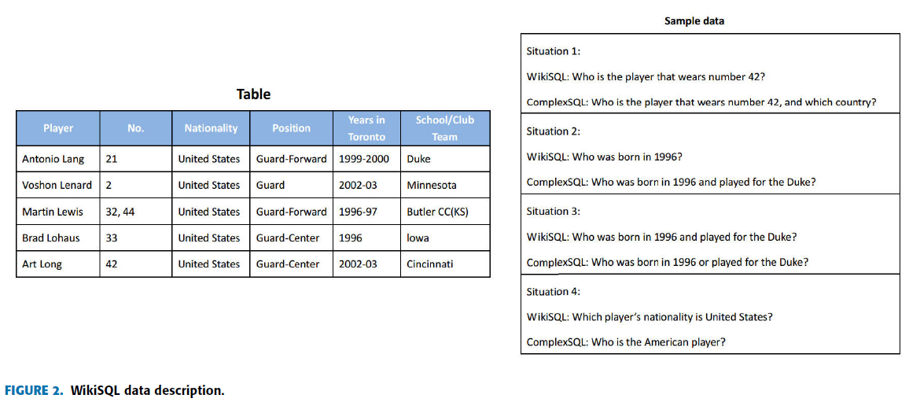

追一科技的Text2SQL比赛数据集TableQA中有更复杂的情况，包括了上述四种。

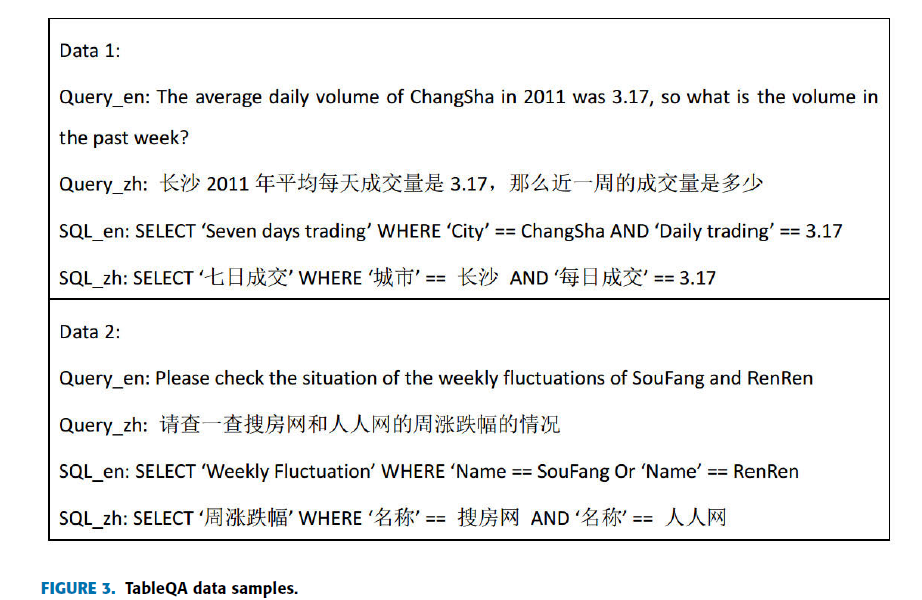

SQLova and X-SQL不能很好地处理TableQA数据集

- TableQA需要两个额外的子任务：预测select的列数量，预测where条件之间的关系

- 现有的模型是基于column representation抽取值的，如果query中有多个值，且这些值属于不同的列，模型就不能准确地抽取值了。M-SQL把这个任务分成两个部分：value extraction和value-column matching.

- TableQA的query形式更加随意，且数据库的内容不一定出现在query中。

提出M-SQL，有8个子模型：S-num,S-col, S-col-agg,W-num-op,W-col,W-col-op,W-col-val and W-cal-match

问题定义

- SQL模板如图所示

- 假设每个SQL都有SELECT和WHERE条件

- $WOP是条件列之间的关系，["", "AND", "OR"]，空值表示没有关系

- $COLUMN是数据库的列名，这里分为selected column和conditional column

- $AGG表示selected column的操作，["", "AVG", "MAX", "MIN", "COUNT", "SUM"]

- $OP是条件列的操作符，[">", "<", "==", "! ="]

- $VALUE是条件列对应的值，如果是字符串类型的话，必须存在于数据库中

- *代表数量，这里假设select的列的数量可以是[1, 2]，条件列的数量可以是[1, 2, 3]

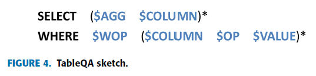

M-SQL包括三个部分：encoder，column representation和几个sub-models。

- encoder用了BERT-wwm-ext treats the Chinese word as a masking unit（而不是character）

- use the ``CONTENT REINFORCING LAYER'' in X-SQL as the column semantic representation

- 8个子模型：S-num（二类分类，[1, 2]）,S-col（单分类，是否选择）, S-col-agg（预测select列的聚合函数）, W-num-op（预测条件列之间的关系和条件列的数量，7类分类）,W-col（预测条件列，单分类，是否选择）,W-col-op（预测条件列的操作符）,W-col-val（从query中抽取条件列的值） and W-cal-match（match条件列和抽取的值）

**Encoder** 

- 输入[XLS],  T1,  T2,  ... , TL, [SEP], H11, H12,  ... , [SEP], ... , [SEP], Hn1, Hn2,  ... ,  [SEP]

**COLUMN REPRESENTATION** 

- 用全局信息xls来加强每列的语义表示（attention）

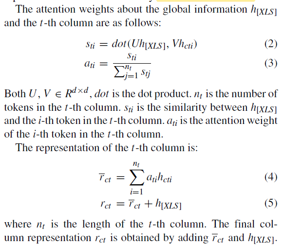

因为h[XLS]是S-num and W-num-op这两个子任务的输入，这里加上h[XLS]可以在子任务之间建立关联，提高多任务学习的能力

**SUB-TASK OUTPUT** 

S-num（二类分类，[1, 2]） and W-num-op（预测条件列之间的关系和条件列的数量，7类分类，）

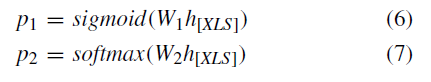

S-col（单分类，是否选择） and W-col（预测条件列，单分类，是否选择）。The probability that the i-th column belong to the target column is as follows.

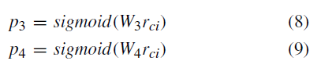

S-col-agg（预测select列的聚合函数），W-col-op（预测条件列的操作符）

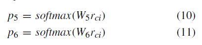

W-col-val（从query中抽取条件列的值）

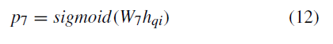

W-val-match（match条件列和抽取的值）

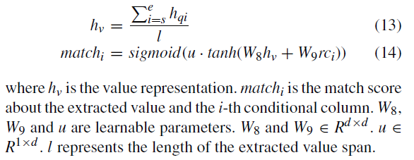

用execution-guided decoding strategy删掉那些不合理的SQL。

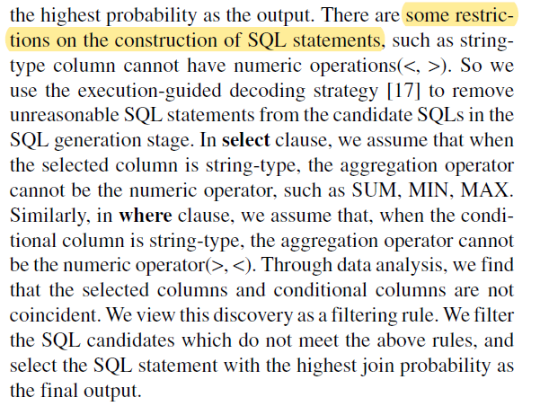

实验

The numbers of train data, evaluation data and test data are 41,522, 2,198 and 2,198 respectively.

评估指标：Logical-form accuracy(LX)，Execution accuracy(X)，Mean accuracy(MX)（前面两个的均值）.

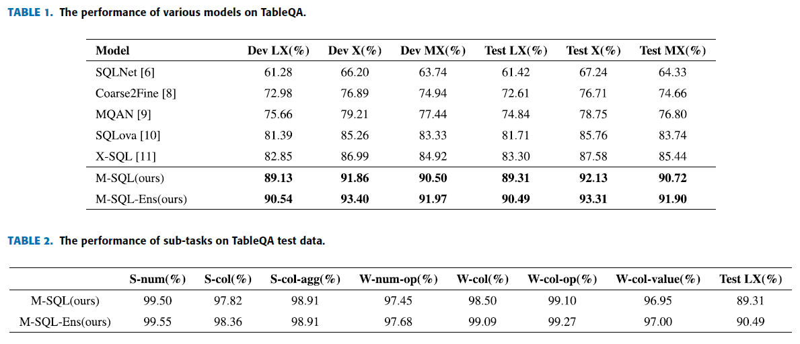

ABLATION STUDY消融实验

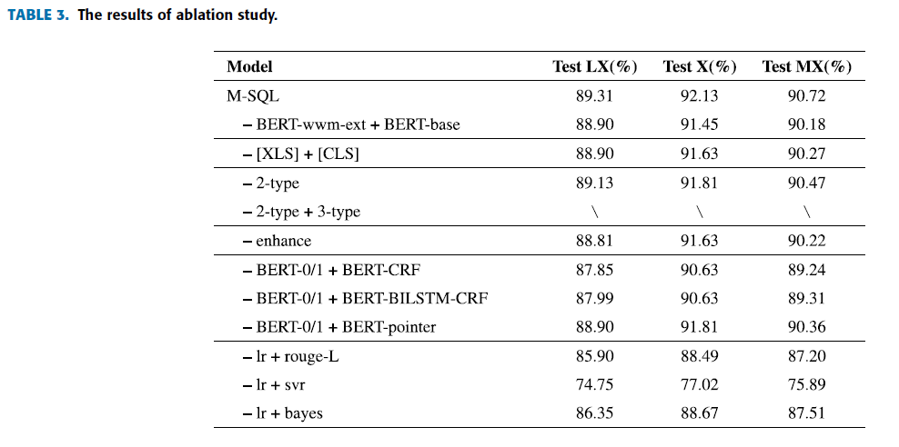

补充

M-SQL是一个多任务学习框架

