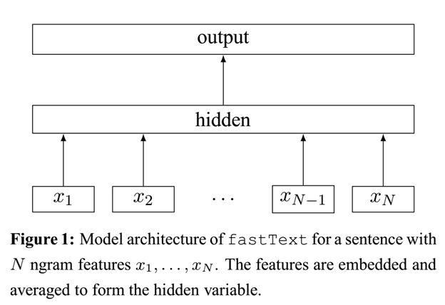

# fastText

fastText是一个快速文本分类算法，与基于神经网络的分类算法相比有两大优点： 1、fastText在保持高精度的情况下加快了训练速度和测试速度 2、fastText不需要预训练好的词向量，fastText会自己训练词向量 3、fastText两个重要的优化：Hierarchical Softmax、N-gram


### 分层softmax（还需补充）

word2vec将上下文关系转化为多分类任务，进而训练逻辑回归模型，这里的类别数量|V|词库大小。通常的文本数据中，词库少则数万，多则百万，在训练中直接训练多分类逻辑回归并不现实。word2vec中提供了两种针对大规模多分类问题的优化手段， negative sampling 和hierarchical softmax。在优化中，negative sampling 只更新少量负面类，从而减轻了计算量。hierarchical softmax 将词库表示成前缀树，从树根到叶子的路径可以表示为一系列二分类器，一次多分类计算的复杂度从|V|降低到了树的高度。

### 字符级别的n-gram

fastText使用了字符级别的n-grams来表示一个单词。对于单词“apple”，假设n的取值为3，则它的trigram有“<ap”, “app”, “ppl”, “ple”, “le>”

其中，<表示前缀，>表示后缀。于是，我们可以用这些trigram来表示“apple”这个单词，进一步，我们可以用这5个trigram的向量叠加来表示“apple”的词向量。

这带来两点**好处** ：

1. 对于低频词生成的词向量效果会更好。因为它们的n-gram可以和其它词共享。

2. 对于训练词库之外的单词，仍然可以构建它们的词向量。我们可以叠加它们的字符级n-gram向量。

### 模型架构

fastText模型架构和word2vec中的CBOW很相似



注意：此架构图没有展示词向量的训练过程。可以看到，和CBOW一样，fastText模型也只有三层：输入层、隐含层、输出层（Hierarchical Softmax），输入都是多个经向量表示的单词，输出都是一个特定的target，隐含层都是对多个词向量的叠加平均。不同的是，CBOW的输入是目标单词的上下文，fastText的输入是多个单词及其n-gram特征，这些特征用来表示单个文档；CBOW的输入单词被onehot编码过，fastText的输入特征是被embedding过；CBOW的输出是目标词汇，fastText的输出是文档对应的类标。

值得注意的是，fastText在输入时，将单词的字符级别的n-gram向量作为额外的特征；在输出时，fastText采用了分层Softmax，大大降低了模型训练时间。

### 核心思想

仔细观察模型的后半部分，即从隐含层输出到输出层输出，会发现它就是一个softmax线性多类别分类器，分类器的输入是一个用来表征当前文档的向量；模型的前半部分，即从输入层输入到隐含层输出部分，主要在做一件事情：生成用来表征文档的向量。那么它是如何做的呢？叠加构成这篇文档的所有词及n-gram的词向量，然后取平均。叠加词向量背后的思想就是传统的词袋法，即将文档看成一个由词构成的集合。

于是fastText的核心思想就是：**将整篇文档的词及n-gram向量叠加平均得到文档向量，然后使用文档向量做softmax多分类。这中间涉及到两个技巧：字符级n-gram特征的引入以及分层Softmax分类。**

### 分类效果

还有个问题，就是为何fastText的分类效果常常不输于传统的非线性分类器？

假设我们有两段文本：

我 来到 达观数据

俺 去了 达而观信息科技

这两段文本意思几乎一模一样，如果要分类，肯定要分到同一个类中去。但在传统的分类器中，用来表征这两段文本的向量可能差距非常大。传统的文本分类中，你需要计算出每个词的权重，比如tfidf值， “我”和“俺” 算出的tfidf值相差可能会比较大，其它词类似，于是，VSM（向量空间模型）中用来表征这两段文本的文本向量差别可能比较大。但是fastText就不一样了，它是用单词的embedding叠加获得的文档向量，词向量的重要特点就是向量的距离可以用来衡量单词间的语义相似程度，于是，在fastText模型中，这两段文本的向量应该是非常相似的，于是，它们很大概率会被分到同一个类中。

**使用词embedding而非词本身作为特征** ，这是fastText效果好的一个原因；另一个原因就是**字符级n-gram特征的引入对分类效果会有一些提升**  。

## 源码解析

## word2vec和fastText对比

1）都可以无监督学习词向量， fastText训练词向量时会考虑subword；

2）fastText还可以进行有监督学习进行文本分类，其主要特点：

-   结构与CBOW类似，但学习目标是人工标注的分类结果；
-   采用hierarchical softmax对输出的分类标签建立哈夫曼树，样本中标签多的类别被分配短的搜寻路径；
-   引入N-gram，考虑词序特征；
-   引入subword来处理长词，处理未登陆词问题；


## Pytorch使用

```python
class Config(object):

    """配置参数"""
    def __init__(self, dataset, embedding):
        self.model_name = 'FastText'
        self.train_path = dataset + '/data/train.txt'                                # 训练集
        self.dev_path = dataset + '/data/dev.txt'                                    # 验证集
        self.test_path = dataset + '/data/test.txt'                                  # 测试集
        self.class_list = [x.strip() for x in open(
            dataset + '/data/class.txt', encoding='utf-8').readlines()]              # 类别名单
        self.vocab_path = dataset + '/data/vocab.pkl'                                # 词表
        self.save_path = dataset + '/saved_dict/' + self.model_name + '.ckpt'        # 模型训练结果
        self.log_path = dataset + '/log/' + self.model_name
        self.embedding_pretrained = torch.tensor(
            np.load(dataset + '/data/' + embedding)["embeddings"].astype('float32'))\
            if embedding != 'random' else None                                       # 预训练词向量
        self.device = torch.device('cuda' if torch.cuda.is_available() else 'cpu')   # 设备

        self.dropout = 0.5                                              # 随机失活
        self.require_improvement = 1000                                 # 若超过1000batch效果还没提升，则提前结束训练
        self.num_classes = len(self.class_list)                         # 类别数
        self.n_vocab = 0                                                # 词表大小，在运行时赋值
        self.num_epochs = 20                                            # epoch数
        self.batch_size = 128                                           # mini-batch大小
        self.pad_size = 32                                              # 每句话处理成的长度(短填长切)
        self.learning_rate = 1e-3                                       # 学习率
        self.embed = self.embedding_pretrained.size(1)\
            if self.embedding_pretrained is not None else 300           # 字向量维度
        self.hidden_size = 256                                          # 隐藏层大小
        self.n_gram_vocab = 250499                                      # ngram 词表大小


'''Bag of Tricks for Efficient Text Classification'''


class Model(nn.Module):
    def __init__(self, config):
        super(Model, self).__init__()
        if config.embedding_pretrained is not None:
            self.embedding = nn.Embedding.from_pretrained(config.embedding_pretrained, freeze=False)
        else:
            self.embedding = nn.Embedding(config.n_vocab, config.embed, padding_idx=config.n_vocab - 1)
        self.embedding_ngram2 = nn.Embedding(config.n_gram_vocab, config.embed)
        self.embedding_ngram3 = nn.Embedding(config.n_gram_vocab, config.embed)
        self.dropout = nn.Dropout(config.dropout)
        self.fc1 = nn.Linear(config.embed * 3, config.hidden_size)
        # self.dropout2 = nn.Dropout(config.dropout)
        self.fc2 = nn.Linear(config.hidden_size, config.num_classes)

    def forward(self, x):

        out_word = self.embedding(x[0])
        out_bigram = self.embedding_ngram2(x[2])
        out_trigram = self.embedding_ngram3(x[3])
        out = torch.cat((out_word, out_bigram, out_trigram), -1)

        out = out.mean(dim=1)
        out = self.dropout(out)
        out = self.fc1(out)
        out = F.relu(out)
        out = self.fc2(out)
        return out
```


## 参考资料

1. [fastText原理和文本分类实战，看这一篇就够了](https://blog.csdn.net/feilong_csdn/article/details/88655927)（包括原理介绍和实战——官方文档的翻译）

2. [fastText原理及实践](https://zhuanlan.zhihu.com/p/32965521)

