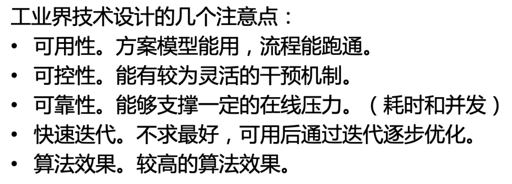
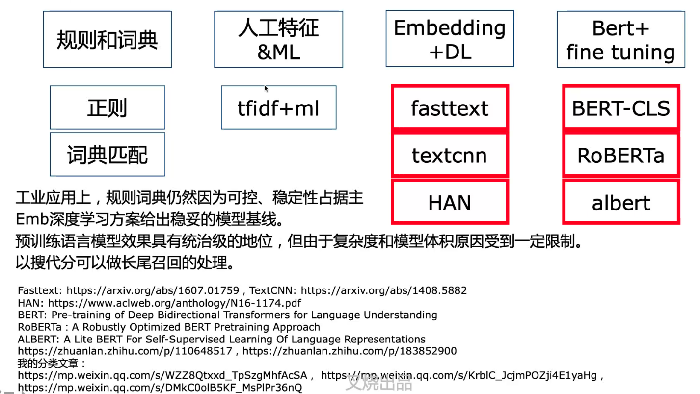
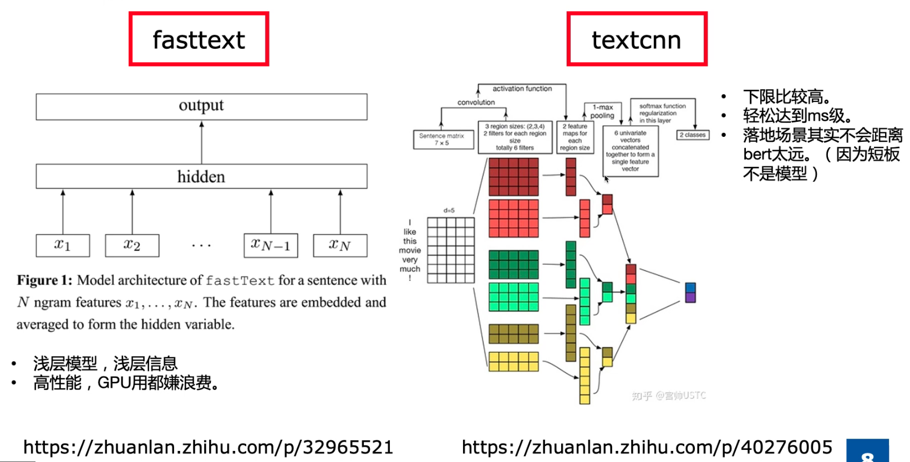
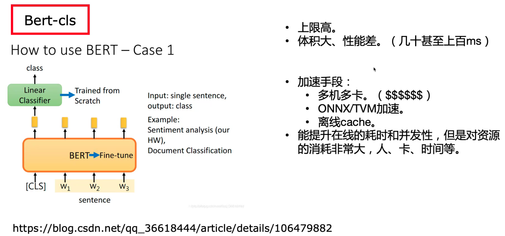
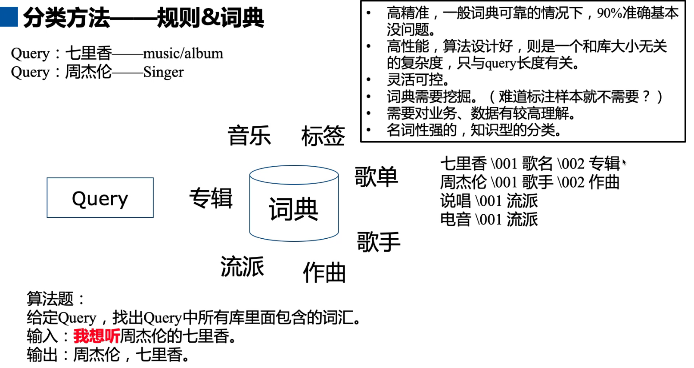
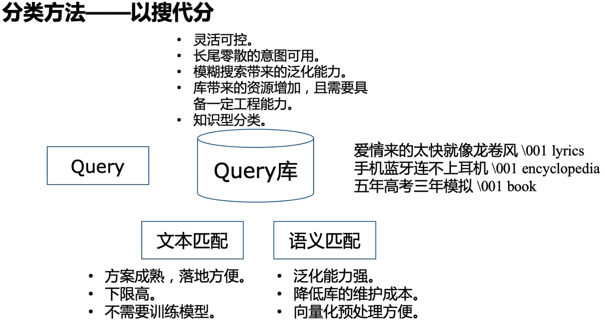
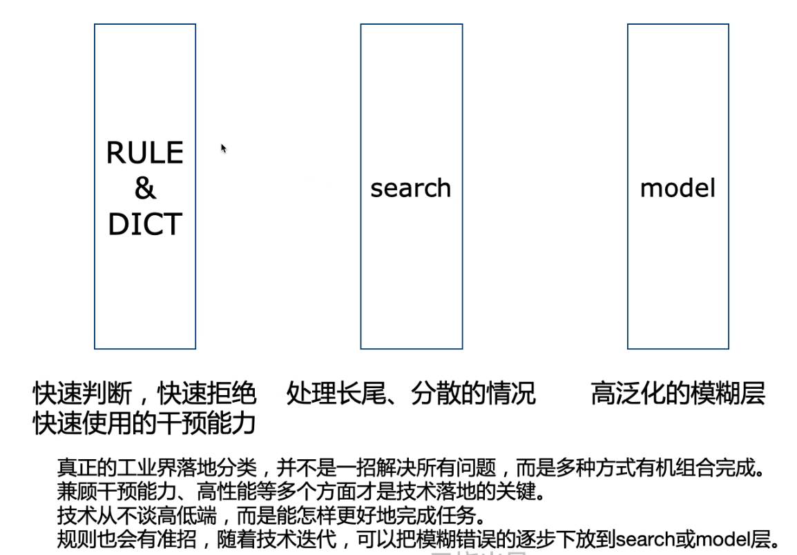
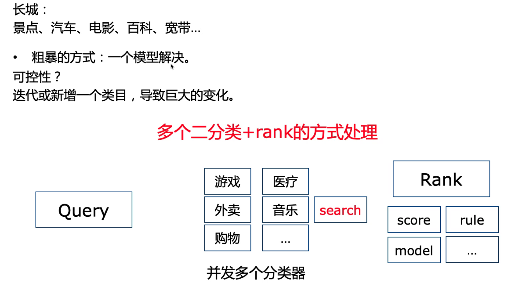

应用场景：搜索，对话

比如细分意图，为下游处理做准备

## 分类模型

fasttext和textcnn

Bert-cls

## 分类方法

### 规则&词典

算法题：前缀树

### 以搜代分

## 分类系统

## 多分类和多标签

样本：

- 比如query中，音乐可以用“我想听...”这样的规则去抽取正样本，然后随机抽取其它的作为负样本。得到粗样本，根据评测集再去做逐步迭代和修正。

## 参考资料

[文本多分类踩过的坑](https://zhuanlan.zhihu.com/p/35586145)（多分类经验：数据不均衡问题，调参等）

[基于深度学习的文本分类](https://zhuanlan.zhihu.com/p/34212945)

