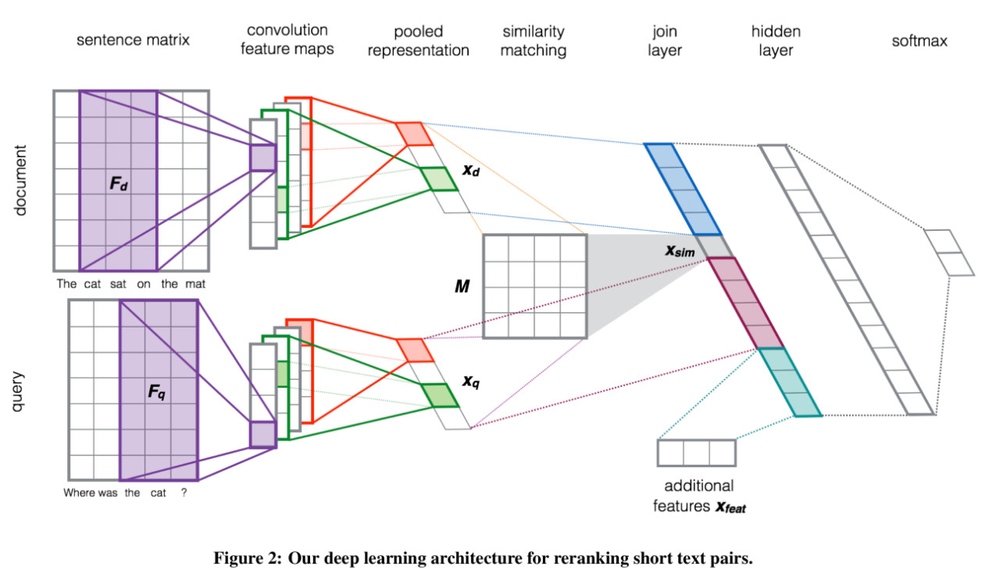
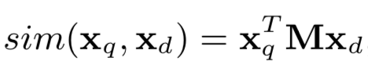
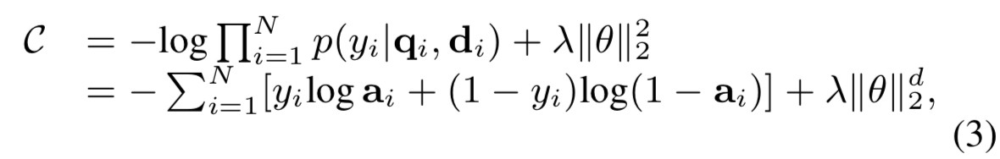

Severyn A , Moschitti A . Learning to Rank Short Text Pairs with Convolutional Deep Neural Networks[C]. the 38th International ACM SIGIR Conference. ACM, 2015.

https://github.com/zhangzibin/PairCNN-Ranking

文章本身是从LTR(learning to rank)的角度去讨论的，谈及文本相似度的计算，主要讨论了基于句法和语义特征的文本相似度的优缺点，优点在于准确性不错，但是缺点在于对外部知识甚至是知识库的依赖导致运算速度等受到限制，而深度学习的方法则更具优势，结合embedding等方式能降低对外部知识，尤其是结构化知识的依赖。

LTR(Learning to rank)是一个研究排序的具体问题，在现实中已经有广泛应用，例如推荐系统中的排序、搜索系统中的排序等，该问题的解决方法被分为3类，pointwise、pairwise和listwise。

pointwise是对每个待排序的条目进行打分，根据大分大小进行排序，现行推荐系统的CTR预估就是目前一个比较典型的pointwise方法。

pairwise是指，两两对比待排序条目，然后根据对比结果进行重排序。

listwise是指，以待排序列表整体为单位进行的排序方法。

对于两套文本的输入，很基本的采用embedding方案将文本转化为句子矩阵(此处文章用的是w2v)。

然后用卷积+池化的方法进行特征提取，卷积一块没使用1维卷积，而是用2维卷积的方式体现bi-gram甚至tri-gram。

卷积+池化后实质上两个句子已经转为了两个句向量，句向量就可以开始进行相似度衡量了

文中构造一个相似矩阵M，用于计算两者的相似度。

然后，将计算得到的相似度、两个句向量、以及额外特征进行拼接组合，得到一个向量，这个向量内涵盖了相似度、query句向量、document句向量以及额外特征4各方面信息，通过全连接层计算后最终到达输出层，整个深度学习模型完成。

训练使用的损失函数是分类常用的交叉熵损失函数，配以L2正则，用adadelta进行训练。

其实实验结果本身不重要，重要的是实验结果中体现的现象以及作者的解释，根据实验结果以及作者的讨论，本模型的特点主要如下：

- 不需要手动特征工程，也几乎不需要预处理和外部资源
- 在多个准确性指标下性能提升，P@30、MAP
- 对较好的embedding方案有一定的依赖性

## 参考资料

[NLP.TM[15] | 短文本相似度-CNN_SIM](https://mp.weixin.qq.com/s/C3ZkxIg_ki8nuYYE8zgvYg)

