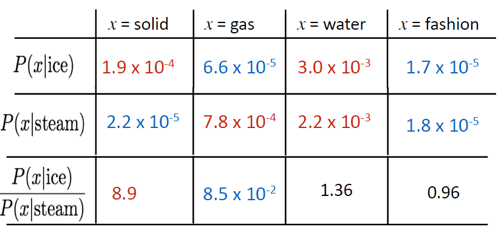
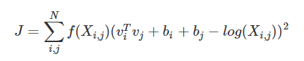

## 共现关系

和word2vector不同，GloVe更倾向于进行分析前后语境之间的共现关系，通过共现关系抽象出词向量。

所谓的共现，共同出现，其实就是看一个词有没有在另一个词的附近出现，所谓的附近，其实就是一个移动窗口的概念，定义窗口的半径（从中心词到边缘的距离）后，看看方圆多少范围内出现词的个数，就是共现。

计算任意两个词之间的共现关系（一般是可逆的），构成共现矩阵X，一般地，X是一个对称矩阵。

**为什么不直接用共现计数矩阵？**

随着词语的变多会变得很大；维度很高，需要大量空间存储；后续的分类问题会遇到稀疏问题。

解决方法：降维，只存储一些重要信息，固定维度。即做SVD。很少起作用，但在某些领域内被用的比较多，举例：Hacks to X(several used in Rohde et al. 2005)

**基于SVD的词嵌入方法**

对共现矩阵X应用SVD分解方法得到$X=USV^T$，选择U前k行得到k维的词向量。

方法存在的问题：维度经常发生改变，矩阵稀疏，矩阵维度高，计算复杂度高等

## Glove

Count based vs. direct prediction

比较SVD这种count based模型与Word2Vec这种direct prediction模型，它们各有优缺点：

Count based模型优点是训练快速，并且有效的利用了统计信息，缺点是对于高频词汇较为偏向，并且仅能概括词组的相关性，而且有的时候产生的word vector对于解释词的含义如word analogy等任务效果不好；

Direct Prediction优点是可以概括比相关性更为复杂的信息，进行word analogy等任务时效果较好，缺点是对统计信息利用的不够充分。

Glove结合两个流派的想法，在神经网络中使用计数矩阵，共现概率的比值可以编码成meaning component

相较于单纯的co-occurrence probability，实际上co-occurrence probability的相对比值更有意义

log-bilinear模型：$w_{i} \cdot w_{j}=\log P(i | j)$

向量差异：$w_{x} \cdot\left(w_{a}-w_{b}\right)=\log \frac{P(x | a)}{P(x | b)}$

如果使向量点积等于共现概率的对数，那么向量差异变成了共现概率的比率

## 词向量的产生

模型的损失函数：

$J=\sum_{i, j=1}^{V} f\left(X_{i j}\right)\left(w_{i}^{T} \tilde{w}_{j}+b_{i}+\tilde{b}_{j}-\log X_{i j}\right)^{2}$

vi和vj是词汇i和j的词向量，bi和bj是常数项，f是特定的权重函数，N是词汇表大小。

考虑两个词汇的共现关系与词向量之间的关系（映射）尽可能接近，于是就构造了上面的损失函数。

## 参考资料

原论文：http://www.eecs.wsu.edu/~sji/classes/DL16/CNN-text/glove.pdf

[【NLP.TM】GloVe模型及其Python实现](https://mp.weixin.qq.com/s/NnebYMUaDUo0riZBVDI7xQ)

- 理解GloVe模型（+总结）：https://blog.csdn.net/u014665013/article/details/79642083
- GloVe模型：https://www.cnblogs.com/Weirping/p/7999979.html

[CS224N笔记(二)：GloVe](https://zhuanlan.zhihu.com/p/60208480)

[https://looperxx.github.io/CS224n-2019-02-Word%20Vectors%202%20and%20Word%20Senses/](https://looperxx.github.io/CS224n-2019-02-Word Vectors 2 and Word Senses/)