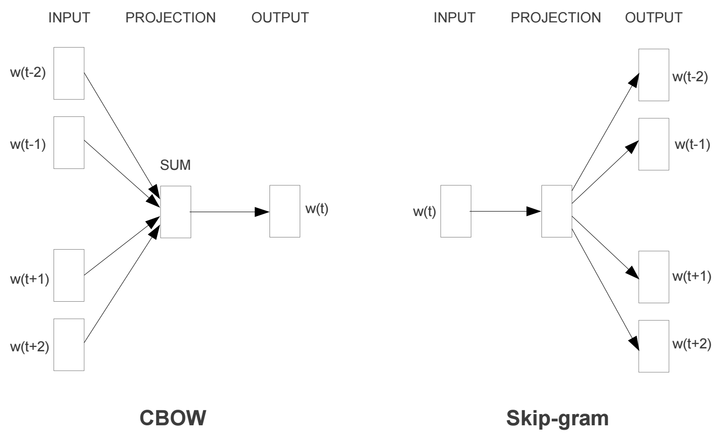
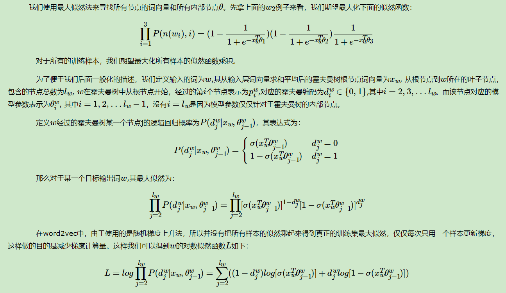
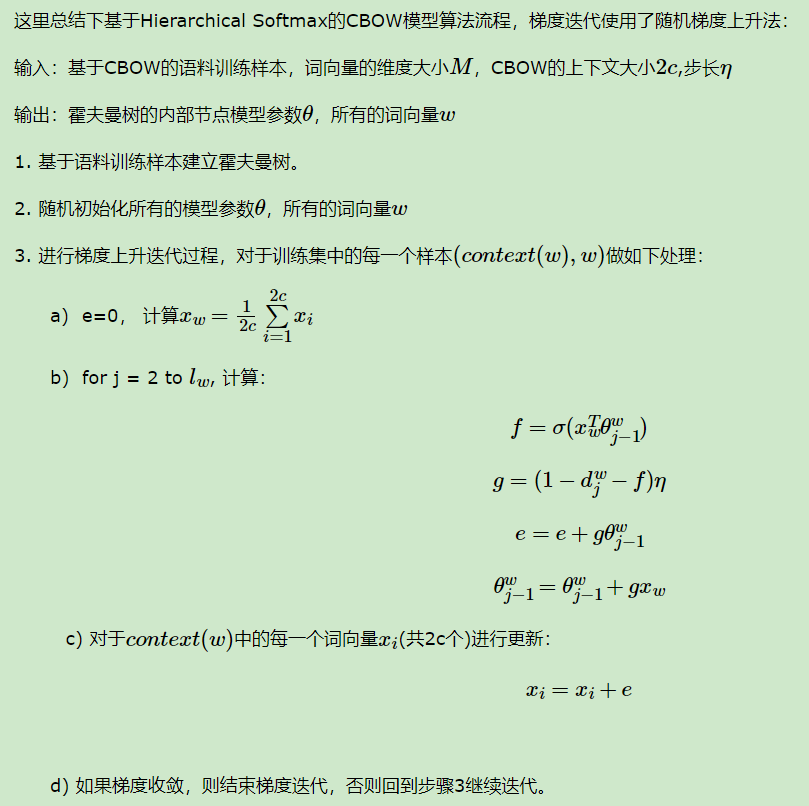
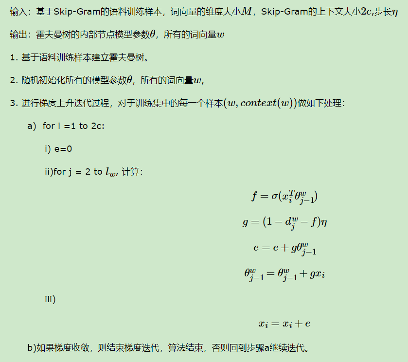
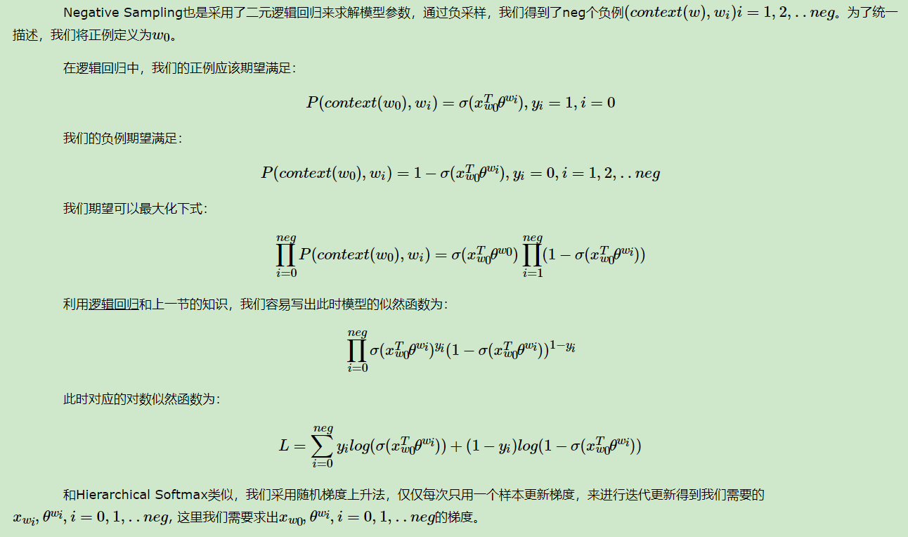
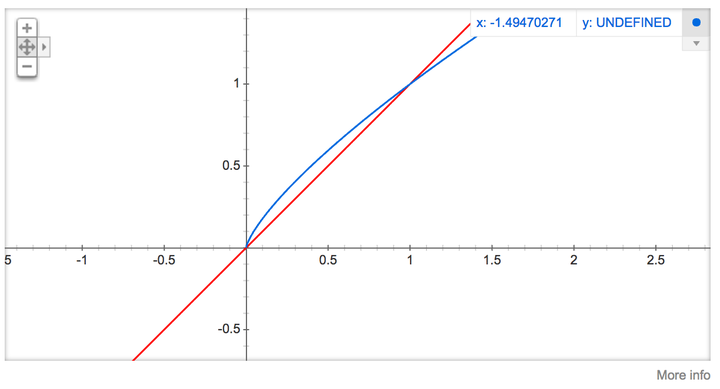
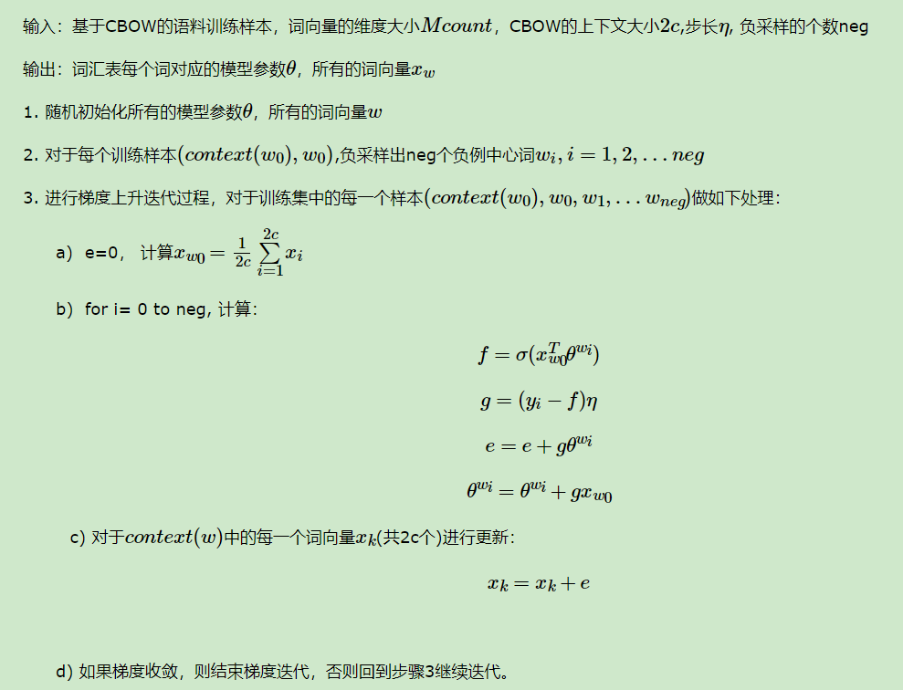
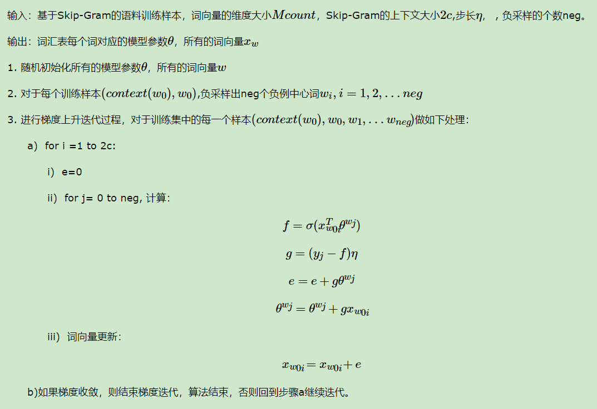

## 单词的表示

**WordNet**, 一个包含同义词集和上位词(“is a”关系) **synonym sets and hypernyms** 的列表的辞典

### 同义词

```
from nltk.corpus import wordnet as wn
poses = { 'n':'noun', 'v':'verb', 's':'adj (s)', 'a':'adj', 'r':'adv'}
for synset in wn.synsets("good"):
    print("{}: {}".format(poses[synset.pos()],
                    ", ".join([l.name() for l in synset.lemmas()])))
```


### 上位词

```
from nltk.corpus import wordnet as wn
panda = wn.synset("panda.n.01")
hyper = lambda s: s.hypernyms()
list(panda.closure(hyper))
```


存在的问题：

- 作为一个资源很好，但忽略了细微差别，比如"proficient"只在某些上下文和"good"是同义词
- 难以持续更新单词的新含义
- 主观的
- 需要人类劳动来创造和调整
- 无法计算单词相似度


在传统的自然语言处理中，我们把词语看作离散的符号，单词通过one-hot向量表示。所有向量是正交的，没有相似性概念，向量维度过大。

在Distributional semantics中，一个单词的意思是由经常出现在该单词附近的词(上下文)给出的，单词通过一个向量表示，称为word embeddings或者word representations，它们是分布式表示(distributed representation)


## word2vec

大部分的有监督机器学习模型，都可以归结为：f(x)->y

在 NLP 中，把 x 看做一个句子里的一个词语，y 是这个词语的上下文词语，那么这里的 f，便是 NLP 中经常出现的『语言模型』（language model），这个模型的目的，就是判断 (x,y) 这个样本，是否符合自然语言的法则，更通俗点说就是：词语x和词语y放在一起，是不是人话。

Word2vec 正是来源于这个思想，但它的最终目的，不是要把 f 训练得多么完美，而是只关心模型训练完后的副产物——模型参数（这里特指神经网络的权重），并将这些参数，作为输入 x 的某种向量化的表示，这个向量便叫做——词向量。

Word2Vec模型实际上分为了两个部分，**第一部分为建立模型，第二部分是通过模型获取嵌入词向量。**Word2Vec的整个建模过程实际上与自编码器（auto-encoder）的思想很相似，即先基于训练数据构建一个神经网络，当这个模型训练好以后，我们并不会用这个训练好的模型处理新的任务，我们真正需要的是这个模型通过训练数据所学得的参数，例如隐层的权重矩阵——后面我们将会看到这些权重在Word2Vec中实际上就是我们试图去学习的“word vectors”。基于训练数据建模的过程，我们给它一个名字叫“Fake Task”，意味着建模并不是我们最终的目的。

> 上面提到的这种方法实际上会在无监督特征学习（unsupervised feature learning）中见到，最常见的就是自编码器（auto-encoder）：通过在隐层将输入进行编码压缩，继而在输出层将数据解码恢复初始状态，训练完成后，我们会将输出层“砍掉”，仅保留隐层。

**目的：通过一个嵌入空间使得语义上相似的单词在该空间内距离很近。**

中心思想：给定大量文本数据，训练每个单词的向量，使得给定中心词c时，上下文词o的概率最大，而这个概率的衡量方式是c和o两个词向量的相似性。

c和o相似性的计算方法是：

$P(o|c)=\frac{exp(u^T_ov_c)}{\sum_{w\in V}exp(u^T_wv_c)}$

每个词有两个向量：作为中心词的向量u和作为上下文词的v

这里用了$softmax(x_i)$函数，放大了最大的概率(max)，仍然为较小的xi赋予了一定概率(soft)

三层的神经网络结构（当然也可以多层），分为输入层，隐藏层和输出层(softmax层)。

## Skip-gram 和 CBOW 模型

- 如果是用一个词语作为输入，来预测它周围的上下文，那这个模型叫做『Skip-gram 模型』
- 而如果是拿一个词语的上下文作为输入，来预测这个词语本身，则是 『CBOW 模型』




### 简单情形

y 是 x 的上下文，所以 y 只取上下文里一个词语的时候，语言模型就变成：用当前词 x 预测它的下一个词 y。

一般的数学模型只接受数值型输入，这里的输入x就是**one-hot encoder**。

Skip-gram 的网络结构：


x 就是上面提到的 one-hot encoder 形式的输入，y 是在这 V 个词上输出的概率，我们希望跟真实的 y 的 one-hot encoder 一样。

**隐层的激活函数其实是线性的**，相当于没做任何处理（这也是 Word2vec 简化之前语言模型的独到之处），我们要训练这个神经网络，用**反向传播算法**，本质上是*链式求导*

#### 词向量

当模型训练完后，最后得到的其实是**神经网络的权重**，比如现在输入一个 x 的 one-hot encoder: [1,0,0,…,0]，对应词语『吴彦祖』，则在输入层到隐含层的权重里，只有对应 1 这个位置的权重被激活，这些权重的个数，跟隐含层节点数是一致的，从而这些权重组成一个向量 vx 来表示x。

输出 y 也是用 V 个节点表示的，对应V个词语，所以其实，我们把输出节点置成 [1,0,0,…,0]，它也能表示『吴彦祖』这个单词，但是激活的是隐含层到输出层的权重，这些权重的个数，跟隐含层一样，也可以组成一个向量 vy，跟上面提到的 vx 维度一样，并且可以看做是**词语『吴彦祖』的另一种词向量**。而这两种词向量 vx 和 vy，正是 Mikolov 在论文里所提到的，『输入向量』和『输出向量』，一般我们用『输入向量』。

需要提到一点的是，这个词向量的维度（与隐含层节点数一致）一般情况下要远远小于词语总数 V 的大小，所以 Word2vec 本质上是一种**降维**操作——把词语从 one-hot encoder 形式的表示降维到 Word2vec 形式的表示。

### Skip-gram 更一般的情形

上面讨论的是最简单情形，即 y 只有一个词，当 y 有多个词时，网络结构如下：


可以看成是 单个x->单个y 模型的并联，cost function 是单个 cost function 的累加（取log之后）

#### 训练样本

假设我们选定句子**“The quick brown fox jumps over lazy dog”**，设定我们的窗口大小为2（window_size=2），也就是说我们仅选输入词前后各两个词和输入词进行组合。下图中，蓝色代表input word，方框内代表位于窗口内的单词。


我们的模型将会从每对单词出现的次数中习得统计结果。例如，我们的神经网络可能会得到更多类似（“Soviet“，”Union“）这样的训练样本对，而对于（”Soviet“，”Sasquatch“）这样的组合却看到的很少。因此，当我们的模型完成训练后，给定一个单词”Soviet“作为输入，输出的结果中”Union“或者”Russia“要比”Sasquatch“被赋予更高的概率。

#### 模型

模型的输入如果为一个10000维的向量，那么输出也是一个10000维度（词汇表的大小）的向量，它包含了10000个概率，每一个概率代表着当前词是输入样本中output word的概率大小。

隐层没有使用任何激活函数，但是输出层使用了softmax。

我们基于成对的单词来对神经网络进行训练，训练样本是 ( input word, output word ) 这样的单词对，input word和output word都是one-hot编码的向量。最终模型的输出是一个概率分布。

步骤

- 生成中心词的one-hot向量x
- 得到中心词的词嵌入向量$v_c=Vx$（lookup table）
- 生成分数向量$z=Uv_c$
- 将分数向量转化为概率$\hat y=softmax(z)$，$\hat y_{c-m},...,\hat y_{c-1}, \hat y_{c+1},...,\hat y_{c+m}$是每个上下文词观察到的概率
- 希望生成的概率向量匹配真实概率$y_{c-m},...,y_{c-1},y_{c+1},...,y_{c+m}$，one-hot向量是实际的输出。


与CBOW模型不同的是，引用了朴素贝叶斯假设来拆分概率，即给定中心词，所有输出的词是完全独立的。
$$
\begin{aligned} 
\text { minimize } J&=-\log P\left(w_{c-m}, \ldots, w_{c-1}, w_{c+1}, \ldots, w_{c+m} | w_{c}\right) \\
&=-\log \prod_{j=0, j \neq m}^{2 m} P\left(w_{c-m+j} | w_{c}\right) \\ 
&=-\log \prod_{j=0, j \neq m}^{2 m} P\left(u_{c-m+j} | v_{c}\right) \\ 
&=-\log \prod_{j=0, j \neq m}^{2 m} \frac{\exp \left(u_{c-m+j}^{T} v_{c}\right)}{\sum_{k=1}^{|V|} \exp \left(u_{k}^{T} v_{c}\right)} \\ 
&=-\sum_{j=0, j \neq m}^{2 m} u_{c-m+j}^{T} v_{c}+2 m \log \sum_{k=1}^{|V|} \exp \left(u_{k}^{T} v_{c}\right) 
\end{aligned}
$$


如果两个不同的单词有着非常相似的“上下文”（也就是窗口单词很相似，比如“Kitty climbed the tree”和“Cat climbed the tree”），那么通过我们的模型训练，这两个单词的嵌入向量将非常相似。

实际上，这种方法实际上也可以帮助你进行词干化（stemming），例如，神经网络对”ant“和”ants”两个单词会习得相似的词向量。

> 词干化（stemming）就是去除词缀得到词根的过程。

### CBOW 更一般的情形

跟 Skip-gram 相似，只不过:Skip-gram 是预测一个词的上下文，而 CBOW 是用上下文预测这个词


更 Skip-gram 的模型并联不同，这里是输入变成了多个单词，所以要对输入处理下（一般是求和然后平均），输出的 cost function 不变

对于模型中的每个单词，需要学习两个向量：

- v (输入向量) 当词在上下文中
- u (输出向量) 当词是中心词

对应地有两个矩阵：

$V\in R^{n\times |V|}$是输入词矩阵，第i列是词$w_i$的n维嵌入向量，定义为$v_i$

$U\in R^{|V|\times n}$是输出词矩阵，第i行是词$w_i$的n维嵌入向量，定义为$u_i$

模型步骤：

- 对于大小为m的输入上下文，每个词生成一个one-hot词向量$x^i, i=c-m, c-m+1,...,c-1,c+1,...,c+m$
- 从上下文矩阵$V$中得到每个词的嵌入词向量$v_i=Vx^i$
- 对上述向量求平均值得到$\hat v$
- 生成一个分数向量$z=U\hat v \in R^{|V|}$，相似向量的点积越高，就会令相似的词更为靠近，从而获得更高的分数。将分数转换为概率$\hat y=softmax(z)$
- 希望生成的概率$\hat y$和实际概率$y$相匹配，使得实际的词刚好就是这个one-hot向量

损失函数：

$H(\hat y, y)=-\sum_{j=1}^{|V|}y_j log(\hat y_j)$

上述公式中的$y_j$是one-hot向量，因此损失函数可以简化为

$H(\hat y, y)=-y_c log(\hat y_c)$

c是正确词的one-hot向量的索引。

优化目标函数的公式为：

$$
\begin{align}
\text {minimize} J &=-\log P\left(w_{c} | w_{c-m}, \ldots, w_{c-1}, w_{c+1}, \ldots, w_{c+m}\right) \\
&=-\log P\left(u_{c} | \hat{v}\right) \\
&=-\log \frac{\exp \left(u_{c}^{T} \hat{v}\right)}{\sum_{j=1}^{|V|} \exp \left(u_{j}^{T} \hat{v}\right)} \\
&=-u_{c}^{T} \hat{v}+\log \sum_{j=1}^{|V|} \exp \left(u_{j}^{T} \hat{v}\right)
\end{align}
$$

### Skip-gram vs CBOW

**cbow**

在cbow方法中，是用周围词预测中心词，从而利用中心词的预测结果情况，使用GradientDesent方法，不断的去调整周围词的向量。当训练完成之后，每个词都会作为中心词，把周围词的词向量进行了调整，这样也就获得了整个文本里面所有词的词向量。

要注意的是， cbow的对周围词的调整是统一的：求出的gradient的值会同样的作用到每个周围词的词向量当中去。

可以看到，cbow预测行为的次数跟整个文本的词数几乎是相等的（每次预测行为才会进行一次backpropgation, 而往往这也是最耗时的部分），复杂度大概是O(V);

**skip-gram**

而skip-gram是用中心词来预测周围的词。在skip-gram中，会利用周围的词的预测结果情况，使用GradientDecent来不断的调整中心词的词向量，最终所有的文本遍历完毕之后，也就得到了文本所有词的词向量。

可以看出，skip-gram进行预测的次数是要多于cbow的：因为每个词在作为中心词时，都要使用周围词进行预测一次。这样相当于比cbow的方法多进行了K次（假设K为窗口大小），因此时间的复杂度为O(KV)，训练时间要比cbow要长。

但是在skip-gram当中，每个词都要收到周围的词的影响，每个词在作为中心词的时候，都要进行K次的预测、调整。因此， 当数据量较少，或者词为生僻词出现次数较少时， 这种多次的调整会使得词向量相对的更加准确。因为尽管cbow从另外一个角度来说，某个词也是会受到多次周围词的影响（多次将其包含在内的窗口移动），进行词向量的跳帧，但是他的调整是跟周围的词一起调整的，grad的值会平均分到该词上， 相当于该生僻词没有收到专门的训练，它只是沾了周围词的光而已。

因此，**从更通俗的角度来说**：

在skip-gram里面，每个词在作为中心词的时候，实际上是 1个学生 VS K个老师，K个老师（周围词）都会对学生（中心词）进行“专业”的训练，这样学生（中心词）的“能力”（向量结果）相对就会扎实（准确）一些，但是这样肯定会使用更长的时间；

cbow是 1个老师 VS K个学生，K个学生（周围词）都会从老师（中心词）那里学习知识，但是老师（中心词）是一视同仁的，教给大家的一样的知识。至于你学到了多少，还要看下一轮（假如还在窗口内），或者以后的某一轮，你还有机会加入老师的课堂当中（再次出现作为周围词），跟着大家一起学习，然后进步一点。因此相对skip-gram，你的业务能力肯定没有人家强，但是对于整个训练营（训练过程）来说，这样肯定效率高，速度更快。

所以，这两者的取舍，要看你自己的需求是什么了。

## Word2vec 的训练trick

Word2Vec模型是一个超级大的神经网络（权重矩阵规模非常大）。

举个栗子，我们拥有10000个单词的词汇表，我们如果想嵌入300维的词向量，那么我们的**输入-隐层权重矩阵**和**隐层-输出层的权重矩阵**都会有 10000 x 300 = 300万个权重，在如此庞大的神经网络中进行梯度下降是相当慢的。更糟糕的是，你需要大量的训练数据来调整这些权重并且避免过拟合。百万数量级的权重矩阵和亿万数量级的训练样本意味着训练这个模型将会是个灾难。

Word2Vec的作者在它的第二篇论文中强调了这些问题，下面是作者在第二篇论文中的三个创新：

1. 将常见的单词组合（word pairs）或者词组作为单个“words”来处理。
2. 对高频次单词进行抽样来减少训练样本的个数。
3. 对优化目标采用“negative sampling”方法，这样每个训练样本的训练只会更新一小部分的模型权重，从而降低计算负担。

事实证明，对常用词抽样并且对优化目标采用“negative sampling”不仅降低了训练过程中的计算负担，还提高了训练的词向量的质量。

### **Word pairs and "phases"**

论文的作者指出，一些单词组合（或者词组）的含义和拆开以后具有完全不同的意义。比如“Boston Globe”是一种报刊的名字，而单独的“Boston”和“Globe”这样单个的单词却表达不出这样的含义。因此，在文章中只要出现“Boston Globe”，我们就应该把它作为一个单独的词来生成其词向量，而不是将其拆开。同样的例子还有“New York”，“United Stated”等。

在Google发布的模型中，它本身的训练样本中有来自Google News数据集中的1000亿的单词，但是除了单个单词以外，单词组合（或词组）又有3百万之多。

如果你对模型的词汇表感兴趣，可以点击[这里](https://link.zhihu.com/?target=http%3A//mccormickml.com/2016/04/12/googles-pretrained-word2vec-model-in-python/)，你还可以直接浏览这个[词汇表](https://link.zhihu.com/?target=https%3A//github.com/chrisjmccormick/inspect_word2vec/tree/master/vocabulary)。

如果想了解这个模型如何进行文档中的词组抽取，可以看[论文](https://link.zhihu.com/?target=http%3A//arxiv.org/pdf/1310.4546.pdf)中“Learning Phrases”这一章，对应的代码word2phrase.c被发布在[这里](https://link.zhihu.com/?target=https%3A//code.google.com/archive/p/word2vec/)。

### **对高频词抽样**

我们的原始文本为“The quick brown fox jumps over the laze dog”，如果我使用大小为2的窗口，那么我们可以得到图中展示的那些训练样本。


但是对于“the”这种常用高频单词，这样的处理方式会存在下面两个问题：

1. 当我们得到成对的单词训练样本时，("fox", "the") 这样的训练样本并不会给我们提供关于“fox”更多的语义信息，因为“the”在每个单词的上下文中几乎都会出现。
2. 由于在文本中“the”这样的常用词出现概率很大，因此我们将会有大量的（”the“，...）这样的训练样本，而这些样本数量远远超过了我们学习“the”这个词向量所需的训练样本数。

Word2Vec通过“抽样”模式来解决这种高频词问题。它的基本思想如下：对于我们在训练原始文本中遇到的每一个单词，它们都有一定概率被我们从文本中删掉，而这个被删除的概率与单词的频率有关。

如果我们设置窗口大小span=10（即skip_window=5），并且从我们的文本中删除所有的“the”，那么会有下面的结果：

1. 由于我们删除了文本中所有的“the”，那么在我们的训练样本中，“the”这个词永远也不会出现在我们的上下文窗口中。
2. 当“the”作为input word时，我们的训练样本数至少会减少10个。


> 这句话应该这么理解，假如我们的文本中仅出现了一个“the”，那么当这个“the”作为input word时，我们设置span=10，此时会得到10个训练样本 ("the", ...) ，如果删掉这个“the”，我们就会减少10个训练样本。实际中我们的文本中不止一个“the”，因此当“the”作为input word的时候，至少会减少10个训练样本。

上面提到的这两个影响结果实际上就帮助我们解决了高频词带来的问题。

**抽样率**

word2vec的C语言代码实现了一个计算在词汇表中保留某个词概率的公式。

wi是一个单词，Z(wi)是这个单词在所有语料中出现的频率，比如peanut在10亿规模大小的语料中出现了1000次，那么Z("peanut")=1000/10亿=1e-6

在代码中还有一个参数叫“sample”，这个参数代表一个阈值，默认值为0.001**（在gensim包中的Word2Vec类说明中，这个参数默认为0.001，文档中对这个参数的解释为“ threshold** **for configuring which higher-frequency words are randomly downsampled”）**。这个值越小意味着这个单词被保留下来的概率越小（即有越大的概率被我们删除）。

P(wi)代表保留某个单词的概率：


图中x轴代表Z(wi)，y轴代表单词被保留的概率。对于一个庞大的语料来说，单个单词的出现频率不会很大，即使是常用词，也不可能特别大。

从这个图中，我们可以看到，随着单词出现频率的增高，它被采样保留的概率越来越小，我们还可以看到一些有趣的结论：

- 当Z(wi)<=0.0026时，P(wi)=1.0.当单词在语料中出现的频率小于0.0026时，它是100%被保留的，这意味着只有那些在语料中出现频率超过0.26%的单词才会被采样。
- 当Z(wi)=0.00746时，P(wi)=0.5，意味着这一部分的单词有50%的概率被保留。
- 当Z(wi)=1.0时，P(wi)=0.033，意味着这部分单词以3.3%的概率被保留。


Word2vec 本质上是一个语言模型，它的输出节点数是 V 个，对应了 V 个词语，本质上是一个多分类问题，但实际当中，词语的个数非常非常多，会给计算造成很大困难，所以需要用技巧来加速训练。

- hierarchical softmax——本质是把 N 分类问题变成 log(N)次二分类。通过使用一个有效的树结构来计算所有词的概率来定义目标

- negative sampling——本质是预测总体类别的一个子集。通过抽取负样本来定义目标

### Hierarchical Softmax

论文：《Distributed Representations of Words and Phrases and their Compositionality.》

**在实际中，hierarchical softmax 对低频词往往表现得更好，负采样对高频词和较低维度向量表现得更好**。

Hierarchical Softmax是一种为了解决词汇表过大导致计算维度过大问题的解决方案，借助树结构的层次性来缓解维度过大的问题，按照出现时间来看其实方法本身的提出甚至早于word2vector本身。

**为了避免要计算所有词的softmax概率，word2vec采样了霍夫曼树来代替从隐藏层到输出softmax层的映射。**

它的实质是构建一棵二叉树，每个单词都挂在叶子节点上，对于大小为 `V`的词库，非叶子节点则对应有 `V-1`个，由于树本身无环的特性（在离散数学中，树的定义是连通但无回路的图），每个单词都能通过从根节点开始的唯一一条路径进行表示。

霍夫曼树的叶子节点起到输出层神经元的作用，叶子节点的个数即为词汇表的小大。 **而内部节点则起到隐藏层神经元的作用。其中，根节点的词向量对应我们的投影后的词向量，而所有叶子节点就类似于之前神经网络softmax输出层的神经元**。


首先是，这棵树怎么建立的。**这棵树的实质是一棵Huffman树（给定n个权值作为n个叶子结点，构造一棵二叉树，若该树的带权路径长度达到最小，称这样的二叉树为最优二叉树，也称为Huffman树），而这棵Huffman树的权重则来源于每个单词出现的频率，根据每个单词的出现频率即可构建出Huffman树。**至于原因，可以比较简单的理解为，更为经常出现的单词，在训练的时候经常会出现，快点找到他更有利于进行后续的计算，因此深度可以浅一些，相反不经常出现的单词弱化存在感问题不大，所以建造这样的Huffman树有利于提升效率。

那么，建立这棵树之后，是怎么应用和计算呢。**此时在word2vec中，使用的就转为分层二分类逻辑斯蒂回归，从根节点出发，分为负类则向左子树走(霍夫曼树编码1)，分为正类则向右子树走(霍夫曼树编码0)，分类的依据来源于每个非叶子节点上所带有的内部节点向量。**


P(+)是分为正类的概率

那么霍夫曼树有什么好处呢？一般得到霍夫曼树后我们会对叶子节点进行霍夫曼编码，由于权重高的叶子节点越靠近根节点，而权重低的叶子节点会远离根节点，这样我们的高权重节点编码值较短，而低权重值编码值较长。这保证的树的带权路径最短，也符合我们的信息论，即我们希望越常用的词拥有更短的编码。如何编码呢？一般对于一个霍夫曼树的节点（根节点除外），可以约定左子树编码为0，右子树编码为1。

在word2vec中，约定编码方式和上面的例子相反，即约定左子树编码为1，右子树编码为0，同时约定左子树的权重不小于右子树的权重。

**使用霍夫曼树有什么好处呢？首先，由于是二叉树，之前计算量为V，现在变成了log2V。第二，由于使用霍夫曼树是高频的词靠近树根，这样高频词需要更少的时间会被找到，这符合我们的贪心优化思想。**


说完应用，就需要回头说怎么训练，训练的原理其实和一般地word2vector非常类似，就是使用基于梯度的方式，如SGD进行更新，值得注意的是，对于树内的每个分类模型，对应的权重也需要更新。

对于上图中的w2，如果它是一个训练样本的输出，那么我们期望对于里面的隐藏节点n(w2,1)的P(−)概率大，n(w2,2)的P(−)概率大，n(w2,3)的P(+)概率大。

（注意w都是一样的，只是参数\theta不一样，对应每个内部节点的参数）




基于Hierarchical Softmax的CBOW模型算法流程：



基于Hierarchical Softmax的Skip-Gram模型算法流程，梯度迭代使用了随机梯度上升法：




可以提炼的两个trick就是：

- 多分类问题，可以转化为多个二分类进行计算。
- 多个二分类问题，可以通过树结构，尤其是Huffman树进行，能进一步提升计算效率。

在这个模型中，没有词的输出表示。相反，图的每个节点（根节点和叶结点除外）与模型要学习的向量相关联。单词作为输出单词的概率定义为从根随机游走到单词所对应的叶的概率。计算成本变为 O(log(|V|))而不是 O(|V|) 。

### Negative Sampling

论文：《Distributed Representations of Words and Phrases and their Compositionality.》

**动机**

1.训练一个神经网络意味着要输入训练样本并且不断调整神经元的权重，从而不断提高对目标的准确预测。每当神经网络经过一个训练样本的训练，它的权重就会进行一次调整。

vocabulary的大小决定了我们的Skip-Gram神经网络将会拥有大规模的权重矩阵，所有的这些权重需要通过我们数以亿计的训练样本来进行调整，这是非常消耗计算资源的，并且实际中训练起来会非常慢。

**负采样（negative sampling）**解决了这个每次迭代的过程中都需要更新大量向量的问题，它是用来提高训练速度并且改善所得到词向量的质量的一种方法。不同于原本每个训练样本更新所有的权重，负采样每次让一个训练样本仅仅更新一小部分的权重，这样就会降低梯度下降过程中的计算量。

当我们用训练样本 ( input word: "fox"，output word: "quick") 来训练我们的神经网络时，“ fox”和“quick”都是经过one-hot编码的。如果我们的vocabulary大小为10000时，在输出层，我们期望对应“quick”单词的那个神经元结点输出1，其余9999个都应该输出0。在这里，这9999个我们期望输出为0的神经元结点所对应的单词我们称为“negative” word。

当使用负采样时，我们将随机选择一小部分的negative words（比如选5个negative words）来更新对应的权重。我们也会对我们的“positive” word进行权重更新（在我们上面的例子中，这个单词指的是”quick“）。

> 在论文中，作者指出指出对于小规模数据集，选择5-20个negative words会比较好，对于大规模数据集可以仅选择2-5个negative words。

回忆一下我们的隐层-输出层拥有300 x 10000的权重矩阵。如果使用了负采样的方法我们仅仅去更新我们的positive word-“quick”的和我们选择的其他5个negative words的结点对应的权重，共计6个输出神经元，相当于每次只更新300x6=1800个权重。对于3百万的权重来说，相当于只计算了0.06%的权重，这样计算效率就大幅度提高。


2.如果我们的训练样本里的中心词w是一个很生僻的词，那么就得在霍夫曼树中辛苦的向下走很久了。


**1）如果通过一个正例和neg个负例进行二元逻辑回归呢？**




考虑一对中心词和上下文词$(w,c)$，通过$P(D=1|w,c)$表示该词对来自语料库，$P(D=0|w,c)$表示不是来自语料库。对$P(D=1|w,c)$用sigmoid函数建模。

建立一个新的目标函数，如果词对确实在语料库中，就最大化概率$P(D=1|w,c)$，否则最大化概率$P(D=0|w,c)$，对这两个概率采用简单的极大似然估计方法
$$
\begin{aligned} \theta &=\underset{\theta}{\operatorname{argmax}} \prod_{(w, c) \in D} P(D=1 | w, c, \theta) \prod_{(w, c) \in \widetilde{D}} P(D=0 | w, c, \theta) \\ 
&=\underset{\theta}{\operatorname{argmax}} \prod_{(w, c) \in D} P(D=1 | w, c, \theta) \prod_{(w, c) \in \widetilde{D}}(1-P(D=1 | w, c, \theta)) \\ 
&=\underset{\theta}{\operatorname{argmax}} \sum_{(w, c) \in D} \log P(D=1 | w, c, \theta)+\sum_{(w, c) \in \widetilde{D}} \log (1-P(D=1 | w, c, \theta)) \\ 
&=\arg \max _{\theta} \sum_{(w, c) \in D} \log \frac{1}{1+\exp \left(-u_{w}^{T} v_{c}\right)}+\sum_{(w, c) \in \widetilde{D}} \log \left(1-\frac{1}{1+\exp \left(-u_{w}^{T} v_{c}\right)}\right) \\ 
&=\arg \max _{\theta} \sum_{(w, c) \in D} \log \frac{1}{1+\exp \left(-u_{w}^{T} v_{c}\right)}+\sum_{(w, c) \in \widetilde{D}} \log \left(\frac{1}{1+\exp \left(u_{w}^{T} v_{c}\right)}\right) 
\end{aligned}
$$
最大化似然函数等价于最小化负对数似然。


**2） 如何进行负采样呢？**

现在我们来看看如何进行负采样，得到neg个负例。word2vec采样的方法并不复杂，如果词汇表的大小为V,那么我们就将一段长度为1的线段分成V份，每份对应词汇表中的一个词。当然每个词对应的线段长度是不一样的，高频词对应的线段长，低频词对应的线段短。每个词w的线段长度由下式决定：


如果看单词在语料库中出现的频次，则停止词出现的会很多，当然还可能会有一些由于文本领域产生的特殊词汇，如果平均分配，则采样并没有特别意义，区分度不大。根据经验，抽样分布从实际效果来看最好的是指数为3/4的Unigram模型（一元模型分布（unigram distribution））。

举例：
$$
\begin{eqnarray}  is: 0.9^{3/4} = 0.92 \nonumber \\ Constitution: 0.09^{3/4}= 0.16 \nonumber \\ bombastic:0.01^{3/4}= 0.032 \nonumber \end{eqnarray}
$$
“Bombastic”现在被抽样的概率是之前的三倍，而“is”只比之前的才提高了一点点。

一个单词被选作negative sample的概率跟它出现的频次有关，出现频次越高的单词越容易被选作negative words。

公式中开3/4的根号完全是基于经验的，论文中提到这个公式的效果要比其它公式更加出色。你可以在google的搜索栏中输入“plot y = x^(3/4) and y = x”，然后看到这两幅图（如下图），仔细观察x在[0,1]区间内时y的取值，$$x^{3/4}$$有一小段弧形，取值在y=x函数之上。




在采样前，我们将这段长度为1的线段划分成M等份，这里M>>V，这样可以保证每个词对应的线段都会划分成对应的小块。而M份中的每一份都会落在某一个词对应的线段上。在采样的时候，我们只需要从M个位置中采样出neg个位置就行，此时采样到的每一个位置对应到的线段所属的词就是我们的负例词。


在word2vec中，M取值默认为10^8。


负采样的C语言实现非常的有趣。unigram table有一个包含了一亿个元素的数组，这个数组是由词汇表中每个单词的索引号填充的，并且这个数组中有重复，也就是说有些单词会出现多次。那么每个单词的索引在这个数组中出现的次数该如何决定呢，有公式P(wi)*table_size，也就是说计算出的**负采样概率\*1亿=单词在表中出现的次数**。

有了这张表以后，每次去我们进行负采样时，只需要在0-1亿范围内生成一个随机数，然后选择表中索引号为这个随机数的那个单词作为我们的negative word即可。一个单词的负采样概率越大，那么它在这个表中出现的次数就越多，它被选中的概率就越大。


基于Negative Sampling的CBOW模型算法流程。梯度迭代过程使用了随机梯度上升法：



基于Negative Sampling的Skip-Gram模型算法流程。梯度迭代过程使用了随机梯度上升法：




此处能够提炼的关键就是：

- 样本不平衡或者更新复杂的情况下可以考虑仅使用部分样本进行计算和更新

这个技巧其实在推荐系统中也非常常见，尤其是CTR预估一块，大部分场景下负样本并不少，此时需要一定的负采样。

## 实现

### gensim

```python
from gensim.models import Word2Vec

sentences = [["cat", "say", "meow"], ["dog", "say", "woof"]]
model = Word2Vec(sentences, min_count=1)
```


## QA

Q1. gensim 和 google的 word2vec 里面并没有用到onehot encoder，而是初始化的时候直接为每个词随机生成一个N维的向量，并且把这个N维向量作为模型参数学习；所以word2vec结构中不存在文章图中显示的将V维映射到N维的隐藏层。

A1. 其实，本质是一样的，加上 one-hot encoder 层，是为了方便理解，因为这里的 N 维随机向量，就可以理解为是 V 维 one-hot encoder 输入层到 N 维隐层的权重，或者说隐层的输出（因为隐层是线性的）。每个 one-hot encoder 里值是 1 的那个位置，对应的 V 个权重被激活，其实就是『从一个V*N的随机词向量矩阵里，抽取某一行』。学习 N 维向量的过程，也就是优化 one-hot encoder 层到隐含层权重的过程


Q2. hierarchical softmax 获取词向量的方式和原先的其实基本完全不一样，我初始化输入的也不是一个onehot，同时我是直接通过优化输入向量的形式来获取词向量？如果用了hierarchical 结构我应该就没有输出向量了吧？

A2. 初始化输入依然可以理解为是 one-hot，同上面的回答；确实是只能优化输入向量，没有输出向量了。具体原因，我们可以梳理一下不用 hierarchical (即原始的 softmax) 的情形：

> 隐含层输出一个 N 维向量 x, 每个x 被一个 N 维权重 w 连接到输出节点上，有 V 个这样的输出节点，就有 V 个权重 w，再套用 softmax 的公式，变成 V 分类问题。这里的类别就是词表里的 V 个词，所以一个词就对应了一个权重 w，从而可以用 w 作为该词的词向量，即文中的输出词向量。
>
> PS. 这里的 softmax 其实多了一个『自由度』，因为 V 分类只需要 V-1 个权重即可

我们再看看 hierarchical softmax 的情形：

> 隐含层输出一个 N 维向量 x, 但这里要预测的目标输出词，不再是用 one-hot 形式表示，而是用 huffman tree 的编码，所以跟上面 V 个权重同时存在的原始 softmax 不一样， 这里 x 可以理解为先接一个输出节点，即只有一个权重 w1 ，输出节点输出 1/1+exp(-w*x)，变成一个二分类的 LR，输出一个概率值 P1，然后根据目标词的 huffman tree 编码，将 x 再输出到下一个 LR，对应权重 w2，输出 P2，总共遇到的 LR 个数（或者说权重个数）跟 huffman tree 编码长度一致，大概有 log(V) 个，最后将这 log(V) 个 P 相乘，得到属于目标词的概率。但注意因为只有 log(V) 个权重 w 了，所以跟 V 个词并不是一一对应关系，就不能用 w 表征某个词，从而失去了词向量的意义
>
> PS. 但我个人理解，这 log(V) 个权重的组合，可以表示某一个词。因为 huffman tree 寻找叶子节点的时候，可以理解成是一个不断『二分』的过程，不断二分到只剩一个词为止。而每一次二分，都有一个 LR 权重，这个权重可以表征该类词，所以这些权重拼接在一起，就表示了『二分』这个过程，以及最后分到的这个词的『输出词向量』。
>
> 我举个例子：
>
> 假设现在总共有 (A,B,C)三个词，huffman tree 这么构建：
> 第一次二分： (A,B), (C)
> 假如我们用的 LR 是二分类 softmax 的情形（比常见 LR 多了一个自由度），这样 LR 就有俩权重，权重 w1_1 是属于 (A,B) 这一类的，w1_2 是属于 (C) 的, 而 C 已经到最后一个了，所以 C 可以表示为 w1_2
>
> 第二次二分： (A), (B)
> 假设权重分别对应 w2_1 和 w2_2，那么 A 就可以表示为 [w1_1, w2_1], B 可以表示为 [w1_1, w2_2]
>
> 这样， A,B,C 每个词都有了一个唯一表示的词向量（此时他们长度不一样，不过可以用 padding 的思路，即在最后补0）
>
> 当然了，一般没人这么干。。。开个脑洞而已


Q3. 是否一定要用Huffman tree?

A3. 未必，比如用完全二叉树也能达到O(log(N))复杂度。但 Huffman tree 被证明是更高效、更节省内存的编码形式，所以相应的权重更新寻优也更快。 举个简单例子，高频词在Huffman tree中的节点深度比完全二叉树更浅，比如在Huffman tree中深度为3，完全二叉树中深度为5，则更新权重时，Huffmantree只需更新3个w，而完全二叉树要更新5个，当高频词频率很高时，算法效率高下立判


一个单词的向量是一行；

得到的概率分布不区分上下文的相对位置；

每个词和and, of等词共同出现的概率都很高

为什么需要两个向量？——数学上更简单(中心词和上下文词分开考虑),最终是把2个向量平均。也可以每个词只用一个向量。


## 参考资料

[[NLP] 秒懂词向量Word2vec的本质](https://zhuanlan.zhihu.com/p/26306795)

[《word2vec Parameter Learning Explained》论文学习笔记](https://blog.csdn.net/lanyu_01/article/details/80097350)

[NLP.TM | 再看word2vector](https://mp.weixin.qq.com/s/Yp9tXTj1npgS4yrQ3vNdjQ)（叉烧的文章）

word2vector论文：Distributed Representations of Words and Phrases and their Compositionality

- [DeeplearningAI笔记]序列模型2.7负采样Negative sampling：有关负采样的文章，比较容易理解：https://blog.csdn.net/u013555719/article/details/82190917
- Hierarchical softmax(分层softmax)简单描述。有关Hierarchical softmax的解释：https://cloud.tencent.com/developer/article/1387413

[https://looperxx.github.io/CS224n-2019-01-Introduction%20and%20Word%20Vectors/](https://looperxx.github.io/CS224n-2019-01-Introduction and Word Vectors/)

[理解 Word2Vec 之 Skip-Gram 模型](https://zhuanlan.zhihu.com/p/27234078)

[基于TensorFlow实现Skip-Gram模型](https://zhuanlan.zhihu.com/p/27296712)

[cbow 与 skip-gram的比较](https://zhuanlan.zhihu.com/p/37477611)（通俗易懂地比较）

[word2vec原理(二) 基于Hierarchical Softmax的模型](https://www.cnblogs.com/pinard/p/7243513.html)

[word2vec原理(三) 基于Negative Sampling的模型](https://www.cnblogs.com/pinard/p/7249903.html)

