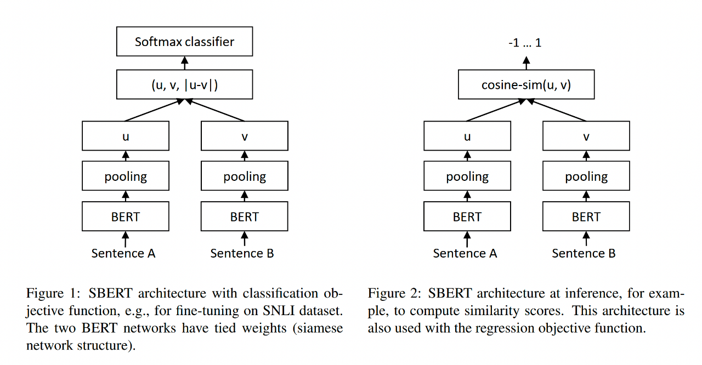
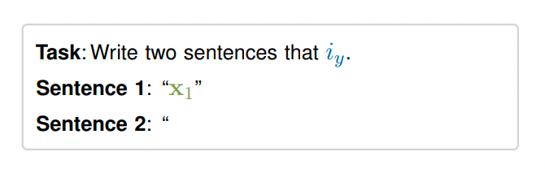
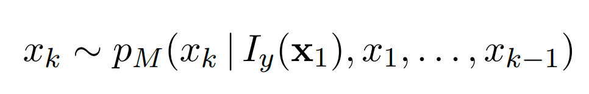

文本表示方法

文本匹配/文本相似度

预训练词向量尽量用新的

## 知乎搜索中的文本相关性

在搜索场景中，文本相关性可以定义为⽤户搜索query的意图与召回 doc 内容的相关程度。

文本的相关性一般可以分为两个维度，字面匹配和语义相关。

在知乎搜索的整个架构中，文本相关性模型主要定位于为二轮精排模型提供更高维/抽象的特征，同时也兼顾了一部分召回相关的工作。

### Befor NN

知乎搜索中的文本相关性整体演进可以分为三个阶段。在引入深度语义匹配模型前，知乎搜索的文本相关性主要是基于TF-IDF/BM25的词袋模型。词袋模型通常来说是一个系统的工程，除了需要人工设计公式外，在统计词的权重、词频的基础上，还需要覆盖率、扩展同义词，紧密度等各种模块的协同配合，才能达到一个较好的效果。

Befor NN

- TF-IDF/BM25
- 词频/权重/覆盖率
- 紧密度/同义词

### Before BERT

基于 BM25 的词袋模型不管如何设计，主要还是只解决文本相关性中的字面匹配这部分问题。第二阶段引入的深度语义匹配模型则聚焦于解决语义相关的问题，主要分为两部分：双塔表示模型和底层交互模型。微软的DSSM是双塔模型的典型代表。双塔模型通过两个不同的 encoder来分别获取query和doc的低维语义句向量表示，然后针对两个语义向量来设计相关性函数（比如cosine）。DSSM摆脱了词袋模型复杂的特征工程和子模块设计，但也存在固有的缺陷：query和doc的语义表示是通过两个完全独立的 encoder 来获取的，两个固定的向量无法动态的拟合doc在不同 query的不同表示。这个反应到最后的精度上，肯定会有部分的损失。

Before BERT

- Embedding: word/char leval
- 表示模型：(C)DSSM
- 交互模型：MatchPyramid, (Conv-)KNRM

底层交互模型一定程度上解决了这个问题。这个交互主要体现在 query 和 doc term/char 交互矩阵（中）的设计上，交互矩阵使模型能够在靠近输入层就能获取 query 和 doc 的相关信息。在这个基础上，后续通过不同的神经网络设计来实现特征提取得到 query-doc pair 的整体表示，最后通过全连接层来计算最终相关性得分。Match-Pyramid、KNRM是交互模型中比较有代表性的设计，我们在这两个模型的基础上做了一些探索和改进，相比于传统的 BM25 词袋模型取得了很大的提升。

### BERT

BERT模型得益于 transformer 结构拥有非常强大的文本表示能力。BERT 的应用也分为表示模型和交互模型。

对于交互模型来说，如下左图，query和doc分别为sentence1和sentence2直接输入到BERT模型中，通过BERT做一个整体的encoder去得到sentence pair的向量表示，再通过全连接层得到相似性打分，因为每个doc都是依赖query的，每个query-doc pair都需要线上实时计算，对GPU机器资源的消耗非常大，对整体的排序服务性能有比较大的影响。

基于上述原因，我们也做了类似于DSSM形式的表示模型，将BERT作为encoder，训练数据的中的每个query和doc在输入层没有区分，都是做为不同的句子输入，得到每个句向量表示，之后再对两个表示向量做点乘，得到得到相关度打分。通过大量的实验，我们最终采用了 BERT 输出 token 序列向量的 average 作为句向量的表示。从交互模型到表示模型的妥协本质是空间换时间，因为doc是可以全量离线计算存储的，在线只需要实时计算比较短的 query ，然后doc直接通过查表，节省了大量的线上计算。相比于交互模型，精度有一部分损失。

## BERT时代

#### 奠基之作

##### 《Sentence-BERT: Sentence Embeddings using Siamese BERT-Networks》

首先，sentence bert的出发点很明确，即将两个句子都输入到网络中的计算开销巨大，10000个句子的集合中找到最相似的句子对需要进行大约5000万次推理计算（~65小时）。BERT的构造使得它不适用于语义相似性搜索以及聚类等无监督任务。

SBERT使用siamese和triplet network结构来推导语义上有意义的句子embedding，使用余弦相似性进行比较，减少了寻找最相似的工作量，从使用BERT/RoBERTa的65小时减少到使用SBERT的约5秒，同时保持了BERT的准确性。

#### word embedding与sentence embedding的分布差异

SBERT速度上有着绝对优势，但缺点是分布之间存在gap，即预先训练的语言模型的句子embedding在没有微调的情况下很难捕捉整句的语义。因为BERT产生的是一个非光滑的各向异性语义空间，这极大地影响了句子语义相似性的计算。

##### 《On the Sentence Embeddings from Pre-trained Language Models》

文章主要针对两个问题进行讨论：

\1) 为什么bert训练的句子embedding在检索语义相似的句子时表现不佳?是包含的语义信息少、还是包含的语义信息没有被充分利用？
\2) 如果BERT embedding捕获了足够多的难以直接利用的语义信息，那么在没有外部监督的情况下如何更容易的利用呢？

以往实验表明，BERT的句子embedding应该不能够直观地反映句子之间的语义相似性。BERT的词表示空间是各向异性的，高频词聚集在一起并靠近原点，而低频词分散得很稀疏。当采用avg embedding时，这些高频词支配句子表示，导致对其真实语义存在偏差。其实词embedding在一个很小的锥空间内，导致BERT的句embedding空间在语义上是不平滑的，这使得很难通过简单的相似度度量来直接使用，例如点积或者cosine相似度。

文章提出通过标准化流将BERT句子embedding分布转换为平滑的各向同性的高斯分布，这是一个由神经网络参数化的可逆函数。具体来说，学习了一个基于流的生成模型，以无监督的方式最大化从一个标准高斯潜变量生成BERT句子embedding的可能性。在训练过程中，只优化了流网络，BERT参数保持不变。然后利用BERT语句embedding与高斯潜在变量之间的可逆映射函数，将BERT语句embedding转换到高斯空间。

首先，标准高斯满足各向同性。标准高斯分布的概率密度不随角度而变化。如果标准高斯分布的2范数归一化为1，这些样本可以认为是均匀分布在一个单位球上。其次，高斯分布的概率密度在整个真实空间上得到了很好的定义，这意味着不存在“洞”区域。基于流的生成模型，建立了从潜在空间Z到观察空间u的可逆转换：

##### 《Whitening Sentence Representations for Better Semantics and Faster Retrieval》

同样是处理各向异性，文章发现传统机器学习中的whitening操作同样可以增强句子表示的各向同性。此外，whitening技术还能够降低句子表征的维数。在保持与bert-flow差不多效果的情况下，可以显著降低存储成本，加快模型检索速度。

假设一组向量满足各向同性，可以假设它来自标准正交基，这就意味着可以通过cos(x,y)计算余弦相似性。否则，如果它是反义的，需要将原始语句embedding变换为各向同性，然后再使用cos(x,y)计算余弦相似性。whitening 的目标很明确：将句子向量平均值转换为0，将协方差矩阵转换为单位矩阵。协方差矩阵∑是正定对称矩阵，所以通过正定对称矩阵的奇异值分解来实现。

句子embedding的原始协方差矩阵可以通过利用变换转换为单位矩阵。其中，正交矩阵U是一种“距离不变”变换，即它不改变整个数据的相对分布，而是将原始协方差矩阵∑变换为对角矩阵。对角矩阵∧的每个对角元素能观察到其所在一维数据的变化。如果值很小，则表示特征的变化很小且不显著，甚至接近于常数。因此，原始的句子向量可能只embedding到一个较低的维空间中，可以在进行降维的同时去除这个维特征，自然地加快了向量检索的速度。

#### 数据增广

不管是何种sentence embedding模型，数据不够或者不好是硬伤，因此数据增广方式基本成为不可或缺的一部分。目前提升数据不够带来的问题，主要有两个大方向，第一直接做对数据进行扩充；第二利用标注数据对模型进行微调。

##### 《Augmented SBERT: Data Augmentation Method for Improving Bi-Encoders for Pairwise Sentence Scoring Tasks》

文章根据特定的采样策略对句子对进行采样，并使用cross-encoder标记这些句子对。将这些弱标记样本称为silver数据集，将与gold训练数据集合并。然后，在这个扩展的训练数据集上训练biencoder。使用核密度估计（KDE）来估计分数s的连续密度函数Fgold和Fsilver，试图他们最小化分布之间的KL散度，让金标和银标同等比例，目的是希望银标的分布近似与金标。（不过KDE采样策略在计算上效率低下）除了以上方式拉近gold和silver，在词汇和语义方面也利用BM25和SBERT生成基于语义的相似数据。

##### 《Generating Datasets with Pretrained Language Models》

无需标记数据、微调或修改预训练目标，利用PLM也可获得高质量的句子embedding，文章利用大型高性能PLM的生成能力生成整个数据集。从零开始创建标记的文本对，根据给定的第一个句子，提示生成第二个句子，目标定位三种，完全相似，不相似，一部分相似，在Iy条件下对token连续采样来获得x2：

除了希望能产生相似的样本，还希望此样本跟其他样本能够区分开，这个部分通过self-debiasing algorithm来实现，例如想生成0.5的样本，但又不是1，以α 作为惩罚因子惩罚每一个xk，让py小于任何一个py'：

由于数据集一定会包含许多噪声示例，所以使用类似标签平滑的技术，并分别用0.1和0.9替换0和1的相似性分数。此外，对于每个x1，从其他数据集条目中采样两个x2，并使用（x1;x2;0）扩充数据集。

#### Sampling与对比学习

上面说到，直接用BERT句向量做无监督语义相似度计算效果会很差，任意两个句子的BERT句向量的相似度都相当高，其中一个原因是向量分布的非线性和奇异性，BERT-flow通过normalizing flow将向量分布映射到规整的高斯分布上，更近一点的BERT-whitening对向量分布做了PCA降维消除冗余信息，但是标准化流的表达能力太差，而whitening操作又没法解决非线性的问题。因此研究转向了对比学习。

##### 《ConSERT: A Contrastive Framework for Self-Supervised Sentence Representation Transfer》

前面也说道，BERT的句子embedding应该不能够直观地反映句子之间的语义相似性。如图所示，当直接将基于语义的句子表示用于语义-文本相似性（STS）任务时，几乎所有句子对的相似性得分都在0.6到1.0之间，即使某些句子对被人类注释者视为完全无关。换言之，BERT派生的句子表示在某种程度上被折叠了，这意味着几乎所有的句子都映射到一个小区域，因此产生了高度的相似性。

文章提出了一个用于自我监督句子表征迁移的对比框架ConSERT，该框架采用对比学习以无监督和有效的方式对BERT进行微调。通过让来自同一个句子的两个增强视图更接近，同时远离其他句子的视图，重塑了BERT派生的句子表示空间，并成功地解决了折叠问题。模型主要分为三部分：data augmentation，shared BERT encoder，contrastive loss layer。

重点在于contrastive loss layer，采用归一化温度标度交叉熵损失（NTXent）作为对比目标。在每个训练步骤中，从D中随机抽取N个文本来构建一个小批量，在扩充后得到2N个表示。对每个数据点进行训练，以找出2N−1个负样本。对所有2N批分类器loss进行平均，以获得最终对比loss。

##### 《SimCSE: Simple Contrastive Learning of Sentence Embeddings》

文章较之之前的论文，在效果上有着极大的提升，总的来说有三点：训练数据的优化；对比学习；找到SBERT与bert-flow之间的平衡点。

而在数据方面，以前的研究采用了一些数据增强方法来构造正例，比如同义词替换，删除不重要的单词，语序重排等，但这些方法都是离散的操作，很难把控，容易引入负面噪声。文章在数据生成方面，通过两个指标：Alignment and uniformity。希望这两个指标都尽可能低，也就是一方面希望正样本要挨得足够近，另一方面语义向量要尽可能地均匀分布在超球面上，因为均匀分布信息熵最高，分布越均匀则保留的信息越多，“拉近正样本，推开负样本”实际上就是在优化这两个指标。

在标准的Transformer中，dropout mask被放置在全连接层和注意力求和操作上，由于dropout mask是随机生成，所以在训练阶段，将同一个样本分两次输入到同一个encoder中，会得到两个不同的表示向量。

在SBERT原文中，作者将NLI数据集作为一个三分类任务来训练，这种方式忽略了正样本与负样本之间的交互，而对比损失则可以让模型学习到更丰富的细粒度语义信息。发现NLI训练出来的模型性能是最好的，这是因为NLI数据集的质量本身很高，正样本词汇重合度非常小(39%)且负样本足够困难。

而文章作者也证明了对比学习的训练目标可以隐式地压低分布的奇异值，提高uniformity，最大程度解决各向异性的问题。

根据Merikoski(1984)的结论，如果WWT的所有元素均为正值，则Sum(WWT)是WWT最大特征值的上界，因此，最小化损失的第二项，其实是在间接最小化Sum(WWT)，隐式地压平了embedding空间的奇异性。对比学习可以潜在地解决表示退化的问题，提升表示向量分布的uniformity，之前的BERT-flow和BERT-whitening仅仅致力于寻找各向同性的表示分布，而在优化对比损失时，对比损失的第二项能够达到同样的规整分布的效果，同时，对比损失的第一项还能确保正样本的对齐，这两项起到了相互制约和促进的作用，最终使得SimCSE在BERT和BERT-flow之间找到了平衡点，这也是SimCSE如此有效的关键之处。

#### 应用层

向量检索在应用层可能不是简单的"求相似"这么简单，涉及到用户的兴趣，内容之间的联系，点击行为，领域知识图谱中的知识结构等。可能一个单纯的相似不太能满足用户真实需求。

在内容量不够多的情况下，向量召回的过程中，可能只有top1是合理的，其余的结果都不合理，这一点确实可以通过置信度或者阈值的方式进行筛选，但是在实际场景中，我们会在完全匹配之外，希望获得一些「次优解」的答案。这些「次优解」可以理解为原始匹配句子在内在知识上有如包含、相关等语义相关性。例如：“***糖尿病怎么治疗？\***”，返回结果“***一型糖尿病的药物有哪些\***”比“***糖尿病的症状有哪些\***”更接近原始意图。

##### 《Embedding-based Retrieval in Facebook Search》

这是一篇非常指的借鉴的论文，与之前论文不同，文章重点不在于优化各种模型结构，如何做数据增强，而是从training，feature，serving，Later-stage Optimization几个重要流程中，分享工程化的经验。

文章主要围绕三个问题：

（1）召回模型中负样本的选取，为什么不能只取曝光未点击的样本作为负样本，即easy negative与hard negative。

通常采用曝光未点击的样本作为负例，其实就是造成了 training 与 serving 的不一致性，因为曝光未点击的样本大部分是 hard case，即使未被点击，但其实与 query 也有一定相关性。但是线上召回时面对的候选集是全部的候选，其中有绝大部分与本次 query 无关的 easy cases。当负例全部采用 hard cases，实际上与最终的 serving 就是不一致的。在实际中采用曝光样本作为正例更合适，原因如下，点击一般是比较稀疏的，数据量较；未点击的样本不应就不是好的样本，有可能只是位置等原因导致的，相比于点击样本，采样这样的样本一定程度上相当于做了 explore。

文中提出了两种方法来挖掘 hard nagative：online hard negative mining 和 offline hard nagative mining：

- ***online hard negative mining\***

在每个 batch 的训练中，假设正样本对为，则对于每个query q(i)，会从 {d(1)+…d(j)+…d(n)+|j≠i}中随机选出 k 个 document 作为 hard nagative。实验数据表明加入这样的 hard nagative 后，在不同类型的 iterm 的搜索上的召回率均有提升。

但是实际上以这种方式选取出来的负样本还不够 hard，原因也很简单，因为这些 negative 是属于不同的 query 的，不同 query 的相关性不高，因此这些样本的相似性也不高，因此有了 offline hard negative mining

- ***offline hard nagative mining\***

offline hard nagative 的做法更像 LTR 的 pairwise 样本构造了

，其选取 negative 的方式是在每个 query 的所有 document 中，选择排序在某一个区间的样本作为 hard nagative。

上面提到的是负样本的 mining，但是同样也可以针对正样本做这样的 hard mining，即从那些failed search session日志中找到那些没被系统召回的但是 positive 的样本。

（2）新的召回策略如何克服当前ranking过程中的偏差。

将召回的 embedding 作为精排模型的特征，paper 中称这样做的动机是能更快让精排学到新召回的特性；embedding 加入精排作为特征的方式有：embedding 作为 feature 直接加入精排模型、基于 embedding 计算出的值加入精排模型(如 query embedding 与 document embedding 的 cosine similarity）等，其中效果最好是通过 cosine similarity 计算出feature 加入精排模型。

（3）如何构建一个召回系统以及一些经验

文章serving 采用的是 ANN（Approximate Near Neighbor），且通过 quantization 来进一步缩短向量间相似性的计算时间，quantization 相当于是一种向量压缩的技术；对于文本特征的构建，paper 中采用的是 character n-gram 而不是 word n-gram，这里的 n-gram 其实就是把连续的 n 个 character 或 word 作为一个 item 输入到 embedding table 中做 embedding lookup，paper 中通过实验证明了采用 character n-gram 比起 word n-gram 效果要更优。

##### 《Bridging the Gap Between Relevance Matching and Semantic Matching for Short Text Similarity Modeling》

信息检索的一个核心问题是相关性匹配，即根据与用户查询的相关性对文档进行排序。另一方面，许多自然语言处理问题，如问答和释义识别，可以被视为语义匹配的变体，即测量两个短文本之间的语义距离。虽然关联和语义匹配都需要对文本相似性进行建模，但目前的研究一般不去兼顾关联关系。原因是语义匹配强调通过利用词汇信息（如单词、短语、实体）和成分结构（如依赖树）实现“意义”对应，而相关匹配则侧重于关键词匹配。

为了弥补这一差距，文章提出了一种新的模型，HCAN（混合共同注意网络），该模型包括（1）一个混合encoder模块，包括基于ConvNet和基于LSTM的encoder，（2）一个相关匹配模块，该模块在多粒度下测量具有重要性权重的软项匹配，以及（3）语义匹配模块，具有捕获上下文感知语义关联的共同注意机制。

如图所示，在标签为1的情况中，除了有本身语义相似的例子，还有偏问答类型的例子，这些在搜索场景下其实都算正例。而比较难的负样例，就是上下文大部分一致，但是核心词不一致。

模型结构包括三个部分：

（1）混合编码模块：CNN与LSTM混合的encoder；

（2）多粒度的相关性匹配模块；

（3）co-attention的语义匹配模块 

相关度特征：word-level -> phrase-level -> sentence-level。通过将query表示矩阵和上下文表示矩阵相乘，来计算查询和每个encoder层的上下文之间的相关性得分。引入外部权重作为先验值来度量不同query词和短语的相对重要性。文章是通过IDF表征query中不同phrase和对应文本质检的相关性程度，过两层池化后（max-pooling和mean-pooling）之后进行softmax。

相似度特征：在每个编码层应用共同注意机制 Co-Attention（协同注意力Co-Attention是一种双向的注意力，不仅要给阅读的文本段落生成一个注意力权重，还要给问句也生成一个注意力权重），实现多语义层的上下文感知表示学习。使用了Co-Attention来计算查询向量和文本向量之间的注意力分数，将其作为语义匹配得分。

## 参考资料

[知乎搜索文本相关性与知识蒸馏](https://mp.weixin.qq.com/s/ybMXgjoZC-Ej8MFBnYGtCw)

[BERT时代，向量语义检索我们关注什么？](https://mp.weixin.qq.com/s/v3UNdoTAowPZwp_v5kDV9w)

句子Embedding，语义匹配：https://github.com/zhoujx4/NLP-Series-sentence-embeddings

