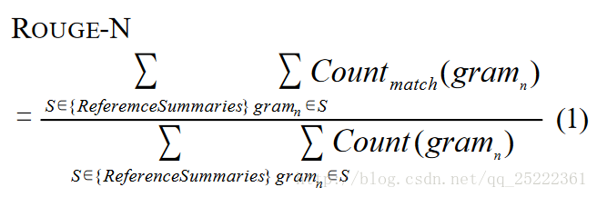
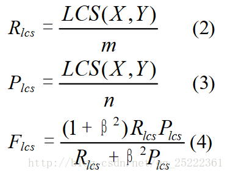
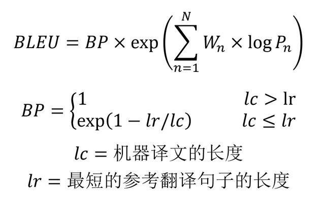
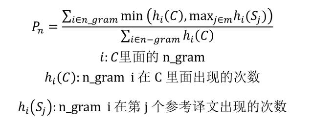
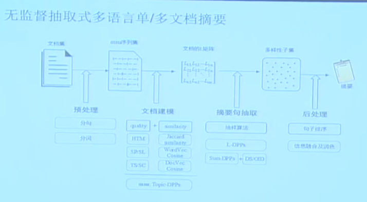
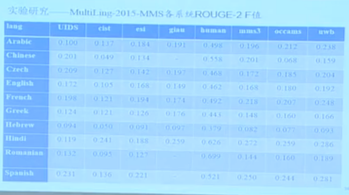

# 文本摘要

## 目录

## 一、动机篇

### 1.1 什么是文本摘要？

文本(自动)摘要是利用计算机自动地将文本(或文档集合)转换成简短摘要的一种信息压缩技术。

一般而言，生成的简短摘要必须满足信息量充分、能够覆盖原文的主要内容、冗余度低和可读性高等要求。

### 1.2 文本摘要技术有哪些类型？

从不同的角度文本自动摘要技术可以被划分为不同的类型。

按照摘要的功能划分：

- 指示型摘要(indicative)——仅提供输入文档(或文档集)的关键主题，旨在帮助用户决定是否需要阅读原文，如标题生成。

- 报道型摘要(informative)——提供输入文档(或文档集)的主要信息，使用户无需阅读原文。

- 评论型摘要(critical)——不仅提供输入文档(或文档集)的主要信息，而且需要给出关于原文的关键评论。

根据输入文本的数量划分：

- 单文档摘要(single-document summarization)

- 多文档摘要(multi-document summarization)

根据输入和输出语言的不同划分：

- 单语言摘要(monolingual summarization)——输入和输出都是同一种语言

- 跨语言摘要(cross-lingual summarization)——输入和输出是不同的语言

- 多语言摘要(multi-lingual summarization)——输入是多种语言，输出是其中的某一种语言

根据应用形式的划分：

- 通用型摘要(generic summarization)——总结原文作者的主要观点

- 面向用户查询的摘要(query-based summarization)——提供与用户兴趣密切相关的内容

根据文摘与原文的关系(即文摘获取方法)划分：

- 抽取式摘要(extraction-based summarization)——摘录原文的重要句子形成摘要

- 压缩式摘要(compression-based summarization)——抽取并简化原文的重要句子形成摘要

- 理解式摘要(abstraction-based summarization)——改写或重新组织原文内容形成摘要

按照输出文摘的长度划分：

- 标题式摘要

- 短摘要

- 长摘要

其中抽取式、压缩式、理解式（或称生成式）是常用的分类方法。

## 二、抽取式摘要篇

### 2.1 抽取式摘要是怎么做的

抽取式摘要，即直接从原文中抽取一些句子组成摘要。抽取式的方法基于一个假设，一篇文档的核心思想可以用文档中的某一句或几句话来概括。那么摘要的任务就变成了找到文档中最重要的几句话。  

这种摘要方式本质上是个排序问题，给每个句子打分排序，再考虑冗余性、新颖性、多样性等做一些后处理（比如MMR），抽取高分的句子作为摘要。这个过程涉及到句子重要性评估算法和基于约束的摘要生成算法。

相关性(能够代表文档的意思)/时效性/新颖性(候选句子包含的冗余信息少)

过程：

-   预处理：分句，逗号或句号作为分隔符
    
-   词、句表示：将词、句表示成计算机能理解的量
    
    -   Bag Of Words，一句话表示成在所有词张成的空间中的一个高维稀疏向量。
        
    -   TFIDF。可以理解为带权重的词袋模型，计算出每个词的TFIDF值，作为该词的权重。
        
    -   LDA/LSI。将整篇文档利用TFIDF模型表示成一个矩阵，做SVD降维分解，生成两个矩阵，一个是文档-话题矩阵、另一个是词-话题矩阵。得到词-话题矩阵之后，可以得到句子-话题矩阵。
        
    -   Word Embedding。 Word2Vec
        
-   排序
    
    -   基于图排序将文档的每句话作为节点，句子之间的相似度作为边权值构建图模型，用pagerank算法进行求解，得到每个句子的得分。HITS
        
    -   基于特征
        
        -   句子长度，长度为某个长度的句子为最理想的长度，依照距离这个长度的远近来打分。
            
        -   句子位置，根据句子在全文中的位置，给出分数。比如每段的第一句是核心句的比例大概是70%
            
        -   句子是否包含标题词，根据句子中包含标题词的多少来打分(与标题的相似度)。
            
        -   句子关键词打分，文本进行预处理之后，按照词频统计出排名前10的关键词，通过比较句子中包含关键词的情况，以及关键词分布的情况来打分。
            
        -   代表算法是TextTeaser。
            
    -   机器学习方法：
        
        -   句子分类（摘要句，非摘要句），序列标注
            
        -   最优化方法
            
        -   聚类(每个类别选择距离质心最近的句子)。
            

-   后处理。排序之后的结果只考虑了相关性并没有考虑新颖性，非常有可能出现排名靠前的几句话表达的都是相似的意思。所以需要引入一个惩罚因子，将新颖性考虑进去。对所有的句子重新打分，如下公式： a * score(i) + (1-a) * similarity(i, i-1), i = 2,3,….N 序号i表示排序后的顺序，从第二句开始，排第一的句子不需要重新计算，后面的句子必须被和前一句的相似度进行惩罚。 这个算法就是MMR（Maximum Margin Relevance）。CSIS
    
-   输出。输出的结果一般是取排序后的前N句话，这里涉及到一个非常重要的问题，也是一直自动文摘质量被诟病的问题，可读性。因为各个句子都是从不同的段落中选择出来的，如果只是生硬地连起来生成摘要的话，很难保证句子之间的衔接和连贯。保证可读性是一件很难的事情。这里有一个取巧的方法，就是将排序之后的句子按照原文中的顺序输出，可以在一定程度下保证一点点连贯性。

#### 2.1.1 句子重要性评估算法有哪些？

常见的句子重要性评估算法有：

- 基于统计：统计词频、位置、长度、是否包含标题词等信息，计算句子的得分，再选出得分高的句子作为摘要。例如Lead3、TextTeaser等。特点：简单易用，但对词句的使用大多仅停留在表面信息。

- 基于图模型：将句子看作结点，句子之间的相似度看作边，构建图，然后用PageRank算法迭代得到每个句子的得分。例如TextRank, LexRank等

- 基于潜在语义：使用主题模型，挖掘语句的隐藏信息。例如LDA，HMM等

- 基于线路规划：将摘要问题转为线路规划，求全局最优解。

- 基于机器学习：句子分类（摘要句、非摘要句，可视为序列标注问题）、聚类（每个类选择一个距离质心最近的句子）等

#### 2.1.2 基于约束的摘要生成方法有哪些？

排序之后的结果只考虑了相关性并没有考虑新颖性，非常有可能出现排名靠前的几句话表达的都是相似的意思。所以需要引入一个惩罚因子，将新颖性考虑进去。对所有的句子重新打分，如下公式： 

$a * score(i) + (1-a) * similarity(i, i-1), i = 2,3,….N$

序号i表示排序后的顺序，从第二句开始，排第一的句子不需要重新计算，后面的句子必须被和前一句的相似度进行惩罚。 

这个算法就是MMR（Maximum Margin Relevance，最大边缘相关）（注意：这里的公式不是原始的MMR公式，而是针对文本摘要任务做了修改）  。它是常见的最小化冗余度算法，主要是面向查询相关的文档自动摘要任务提出。基本思想是在未选句子集合中选择一个与输入查询最相关并且与已选句子最不相似的句子，迭代该过程，直至句子数目或单词数目达到上限。

#### 2.1.3 TextTeaser算法是怎么抽取摘要的

简单来说，根据词频、位置、长度、是否包含标题词等统计指标，计算句子的得分，再选出得分高的句子作为摘要。

具体来说，TextTeaser的统计指标有：

1）句子长度，长度为某个长度（比如20）的句子为最理想的长度，依照距离这个长度的远近来打分。

2）句子位置，根据句子在全文中的位置，给出分数。（比如每段的第一句是核心句的比例大概是70%）。也可以考虑用句子在段落中的位置来评估。

3）文章标题与文章内容的关系，句子是否包含标题词，根据句子中包含标题词的多少来打分。

4）句子关键词打分，文本进行预处理之后，按照词频统计出排名前10的关键词，通过比较句子中包含关键词的情况，以及关键词分布的情况来打分。 

综合上述步骤的打分做累加，然后倒排得到每个句子的重要性得分，此时要考虑到摘要的可读性，通俗的做法是按照句子在文章中出现的顺序输出得分最高的n句话作为摘要。

Python代码开源版本：[https://github.com/DataTeaser/textteaser](https://github.com/DataTeaser/textteaser)

PyTeaser

#### 2.1.4 TextRank算法是怎么抽取摘要的

简单来说，将句子看作结点，句子之间的相似度看作边，构建图，然后用类似PageRank的算法迭代得到每个句子的得分，最终将得分高的句子输出得到摘要。

详细的步骤如下

1. 预处理：将输入的文本或文本集的内容分割成句子得$T=[S_{1},S_{2},…..,S_{m}]$, 构建图$G=(V,E)$, 其中V为句子集，对句子进行分词、去除停止词，得$S_{i}=[t_{i,1},t_{i,2},…….,t_{i,n}]$，其中$t_{i,j} \in S_{j}$是保留后的候选关键词。

2. 句子相似度计算：构建图G中的边集E，基于句子间的内容覆盖率，给定两个句子$S_{i},S_{j}$,采用如下公式进行计算：

$$Similarity(S_{i},S_{j})=\frac{|{w_{k}|w_{k}\in S_{i} \cap w_{k}\in S_{j}}|}{log(|S_{i}|)+log(|S_{j}|)}$$

$S_i$：第i个句子。$w_k$：第k个单词。$|S_i|$：句子i中单词数。简单来说就是，两个句子单词的交集除以两个句子的长度。也可以用其他计算相似度的方法。

若两个句子之间的相似度大于给定的阈值，就认为这两个句子语义相关并将它们连接起来，即边的权值$w_{i,j}=Similarity(S_{i},S_{j})$

3. 句子权重计算：迭代传播权重计算各句子的得分，计算公式如下:

$$WS(V_{i})=(1-d)+d* \sum_{V_{j} \in In(V_{i})}\frac{w_{ji}}{\sum_{V_{k} \in Out(V_{j})}w_{jk}}WS(V_{j})$$

$V_i$为结点。d为阻尼系数，表示从图中某一结点指向其他任意结点的概率。介于0-1之间，通常设为0.85。$w_{ji}$为$V_i$到$V_j$的边的权重。$In(V_i)$为指向$V_i$的点的集合，$Out(V_j)$为$V_j$指出的点的集合。上面公式与PageRank中的公式相比而言，PageRank中的出度权重每条边的权重都是相等的，在上述公式中使用相似度来进行加权赋值，这样每条出度的边的权重就不一定一样了，而在PageRanK中是等权的。

4. 抽取文摘句：将上述得到的句子得分进行倒序排序，抽取重要度最高的T个句子作为候选文摘句。

5. 形成文摘：根据字数或句子数要求，从候选文摘句中抽取句子组成文摘

gensim.summarization模块实现了TextRank

PyTextRank

### 2.2 抽取式摘要的可读性问题是什么？

自动文摘质量一直被诟病的问题就是可读性。因为各个句子都是从不同的段落中选择出来的，如果只是生硬地连起来生成摘要的话，很难保证句子之间的衔接和连贯。保证可读性是一件很难的事情。 

有一个取巧的方法，就是将排序之后的句子按照原文中的顺序输出，可以在一定程度下保证一点点连贯性。

## 三、压缩式摘要篇

### 3.1 压缩式摘要是怎么做的？

压缩式自动摘要对句子进行压缩，保留重要的句子成分，删除无关紧要的成分，使得最终的摘要在固定长度的范围内包含更多的句子，以提升摘要的覆盖度。

核心模块：**句子压缩** 

- 可视为树的精简问题。

- 可视为01序列标注问题。

句子压缩任务可以被定义为一个删词问题：删除句子中不重要的词，形成该句子的一个压缩式表达。常见的方法：

- 基于句法分析树(无监督)：先得到句子对应的短语结构树，再根据规则删除不重要的子树（比如删除介词短语子树、时间短语子树等）

- 基于噪声信道模型(有监督)：给定原始长句子s，寻找最佳压缩句子t，使得后验概率P(t|s)最大（利用贝叶斯准则得到后验概率）。

- 基于决策(有监督)：从结构树改写的角度对句子进行处理，通过一系列“移进-规约-删除”动作实现

压缩式自动摘要方法结合了句子选择和句子压缩两个算法过程，结合方法可以是：（1）先选择后压缩；（2）先压缩后选择；（3）两个过程同时进行。

例如整数线性规划ILP，句子中的每个词都对应一个二值变量表示该词是否保留，每个词都有一个打分（比如tf-idf），目标函数就是最大化句子中的词的打分。最简单的限制比如说至少保留一个词，再比如说当形容词被保留时其修饰的词也要保留（根据parse tree）。

## 四、生成式摘要篇

### 4.1 生成式摘要是怎么做的

生成式摘要，它试图通过理解原文的意思来生成摘要，其实就是模仿人类写摘要的方式。

生成式摘要常见的方法有

- 基于信息融合的生成式摘要：例如基于句法分析树的信息融合技术，利用句法结构树定义概念和事实，计算概念和事实的重要性，度量概念和事实的兼容性，最终组合概念和事实形成摘要句子。

- 基于编码-解码的生成式摘要：在语义向量空间内对文本进行编码，然后通过解码网络逐词生成摘要。

由于深度学习的发展，基于编码-解码的生成式摘要更常见。

AMR方法

基于谓词论元结构的理解式摘要

核心思想：选择并重组概念与行为。

端到端的摘要方法

代表系统有：

-   哈佛大学的OpenNMT
    
-   斯坦福大学的Seq2Seq摘要模型，包含了copy机制和coverage机制。

### 4.2 生成式摘要存在哪些问题

使用seq2seq框架做摘要通常会遇到以下几个问题：

1. OOV问题。源文档语料中的词的数量级通常会很大,但是经常使用的词数量则相对比较固定。因此通常会根据词的频率过滤掉一些词做成词表。这样的做法会导致生成摘要时会遇到UNK的词。

2. 摘要的可读性。通常使用贪心算法或者beamsearch方法来做decoding。这些方法生成的句子有时候会存在不通顺的问题。

3. 摘要的重复性。这个问题出现的频次很高。与2的原因类似，由于一些decoding的方法的自身缺陷，导致模型会在某一段连续timesteps生成重复的词。

4. 长文本摘要生成难度大。对于机器翻译来说，NLG的输入和输出的语素长度大致都在一个量级上，因此NLG在其之上的效果较好。但是对摘要来说，源文本的长度与目标文本的长度通常相差很大，此时就需要encoder很好的将文档的信息总结归纳并传递给decoder，decoder需要完全理解并生成句子。可想而知，这是一个很难的事情。

5. 模型的训练目标与最终的评测指标不太一致。这里牵扯到两个问题，一个是seq2seq的训练模式中，通常会使用teacher-forcing的方式，即在decoder上，将真实target的输入和模型在前一时刻生成的词一起送到下一个时刻的神经元中计算。但是在inference时，是不会有真实target的，因此存在一个gap；另一个问题就是通常模型训练的目标函数都是交叉熵损失函数。但是摘要的评测却不是以交叉熵来判断的，目前一些榜单通常以ROUGE、BLEU等方式评测，虽然这些评测也不是很完美，但是与交叉熵的评测角度均在较大差异。

### 4.3 Pointer-generator network解决了什么问题

指针生成网络从两方面针对seq-to-seq模型在生成式文本摘要中的应用做了改进。

第一，使用指针生成器网络可以通过指向从源文本中复制单词(解决OOV的问题)，这有助于准确复制信息，同时保留generater的生成能力。PGN可以看作是抽取式和生成式摘要之间的平衡。

通过一个门来选择产生的单词是来自于词汇表，还是来自输入序列复制。

第二，使用coverage跟踪摘要的内容，不断更新注意力，从而阻止文本不断重复(解决重复性问题)。利用注意力分布区追踪目前应该被覆盖的单词，当网络再次注意同一部分的时候予以惩罚。

## 五、摘要质量评估方法

### 5.1 摘要质量的评估方法有哪些类型

1.人工评价方法

请专家对系统的自动摘要结果打分，但是专家之间差异性较大。解决方法之一是金字塔方法(pyramid method)。m位专家撰写参考摘要，然后人工分析每个参考摘要，提取摘要内容单元(summary content unit, SCU)（表示摘要中子句级的重要语义单元）的集合，并为参考摘要中每个SCU赋值，被w个参考摘要提及则赋值为w。然后计算所有SCU在系统摘要中的得分之和，系统摘要得分与理想摘要得分的比值作为质量评价得分。

2.自动评价方法

（1）内部(intrinsic)评价：分析摘要的质量评价

- 形式度量(form metrics)：侧重于语法、摘要的连贯性和组织结构

- 内容度量(content metrics)：侧重内容和信息，比如ROUGE（Recall-Oriented Understudy for Gisting Evaluation）。

（2）外部(extrinsic)评价：依据摘要结果对其他应用任务的效果评价

### 5.2 什么是ROUGE

ROUGE（Recall-Oriented Understudy for Gisting Evaluation）是评估自动文本摘要和机器翻译的一组指标。它通过将待审摘要或翻译与一组参考摘要或翻译进行比较计算，得出相应的分数，以衡量自动生成的摘要或翻译与参考摘要之间的相似度。

它的基本思想是将待审摘要和参考摘要的n元组共现统计量作为评价依据。然后通过一系列标准进行打分。

ROUGE包括：ROUGH-N、ROUGH-L、ROUGH-W、ROUGH-S和ROUGH-SU几个类型。通俗地讲就是通过一些定量化的指标来描述待审摘要和参考文摘之间的相似性，维度考虑比较多，在一定程度上可以很好地评价产生的摘要。 

### 5.3 几种ROUGE指标之间的区别是什么 

ROUGE是将待审摘要和参考摘要的n元组共现统计量作为评价依据。

ROUGE-N = 每个n-gram在参考摘要和系统摘要中同现的最大次数之和 / 参考摘要中每个n-gram出现的次数之和

分母也可以是待审摘要中每个n-gram出现的次数之和，不过用参考摘要的话更看重召回，用待审摘要则更看重精确率。

ROUGE-L计算最长公共子序列的匹配率，L是LCS（longest common subsequence）的首字母。如果两个句子包含的最长公共子序列越长，说明两个句子越相似。

其中LCS(X,Y)是X和Y的最长公共子序列的长度，m,n分别表示参考摘要和待审摘要的长度（一般就是所含词的个数）。R和P分别表示召回率和精确率，F即是Rouge-L。一般只考虑召回率，所以参数$\beta$会被设置为一个很大的数。

Rouge-W是Rouge-L的改进版，使用了加权最长公共子序列(Weighted Longest Common Subsequence)，连续最长公共子序列会拥有更大的权重。

ROUGE-S使用了skip-grams。在参考摘要和待审摘要进行匹配时，不要求gram之间必须是连续的，可以跳过几个单词。比如skip-bigram，在产生grams时，允许最多跳过两个词。比如“cat in the hat”的 skip-bigrams 就是 “cat in, cat the, cat hat, in the, in hat, the hat”.

### 5.4 BLEU和ROUGE有什么不同

BLEU 是 2002 年提出的，而 ROUGE 是 2003 年提出的。

**BLEU的计算主要基于精确率，ROUGE的计算主要基于召回率。** 

ROUGE 用作机器翻译评价指标的初衷是这样的：在 SMT（统计机器翻译）时代，机器翻译效果稀烂，需要同时评价翻译的准确度和流畅度；等到 NMT （神经网络机器翻译）出来以后，神经网络脑补能力极强，翻译出的结果都是通顺的，但是有时候容易瞎翻译。

ROUGE的出现很大程度上是为了解决NMT的漏翻问题（低召回率）。所以 ROUGE 只适合评价 NMT，而不适用于 SMT，因为它不管候选译文流不流畅。

BLEU的计算公式：

- BLEU 需要计算译文 1-gram，2-gram，...，N-gram 的精确率，一般 N 设置为 4 即可，公式中的 $P_n$指 n-gram 的精确率。

- $W_n$ 指 n-gram 的权重，一般设为均匀权重，即对于任意 n 都有 $W_n = 1/N$。

- BP 是惩罚因子，如果译文的长度小于最短的参考译文，则 BP 小于 1。

- BLEU 的 1-gram 精确率表示译文忠于原文的程度，而其他 n-gram 表示翻译的流畅程度。

BLEU一般使用改进的方法计算精确率。给定参考译文S1, S2, ..., Sm，待审译文C，可以计算C里面n元组的Precision：

## 训练数据集

[https://github.com/bifeng/nlp_paper_notes/blob/75cf64a7eb244814fccf241d5990e23526352ab3/Summarization.md](https://github.com/bifeng/nlp_paper_notes/blob/75cf64a7eb244814fccf241d5990e23526352ab3/Summarization.md)

[https://github.com/liucongg/GPT2-NewsTitle](https://github.com/liucongg/GPT2-NewsTitle)

[https://github.com/CLUEbenchmark/CLUEDatasetSearch](https://github.com/CLUEbenchmark/CLUEDatasetSearch)

## 论文
无监督方法：

TextRank——. Mihalcea R, Tarau P. Textrank: Bringing order into text[C]//Proceedings of the 2004 conference on empirical methods in natural language processing. 2004: 404-411.

Two-Level Sparse Representation——Liu H, Yu H, Deng Z H. Multi-document summarization based on two-level sparse representation model[C]//Twenty-ninth AAAI conference on artificial intelligence. 2015.

RA-MDS——Li P, Bing L, Lam W, et al. Reader-aware multi-document summarization via sparse coding[C]//Twenty-Fourth International Joint Conference on Artificial Intelligence. 2015.

DAE——Fevry T, Phang J. Unsupervised Sentence Compression using Denoising Auto-Encoders[J]. arXiv preprint arXiv:1809.02669, 2018.

PACSUM (ACL 2019)——Zheng H, Lapata M. Sentence Centrality Revisited for Unsupervised Summarization[J]. arXiv preprint arXiv:1906.03508, 2019.

有监督方法：

R2N2——Cao Z, Wei F, Dong L, et al. Ranking with recursive neural networks and its application to multi-document summarization[C]//Twenty-ninth AAAI conference on artificial intelligence. 2015.

NeuralSum——Cheng J, Lapata M. Neural summarization by extracting sentences and words[J]. arXiv preprint arXiv:1603.07252, 2016.

SummaRuNNer——Nallapati R, Zhai F, Zhou B. Summarunner: A recurrent neural network based sequence model for extractive summarization of documents[C]//Thirty-First AAAI Conference on Artificial Intelligence. 2017.

BertSum——Liu Y. Fine-tune BERT for Extractive Summarization[J]. arXiv preprint arXiv:1903.10318, 2019.

STRASS——Bouscarrat L, Bonnefoy A, Peel T, et al. STRASS: A Light and Effective Method for Extractive Summarization Based on Sentence Embeddings[J]. arXiv preprint arXiv:1907.07323, 2019.

## 分享

[北邮李蕾：关于自动文本摘要的分析与讨论](https://mp.weixin.qq.com/s/3SVSqzaQgf7EDKKGrOXF2Q)

单文档与多文档：

多文档需求更多，实用性更强，难度更大

特征：标题，位置，高频实意词，句法结构（陈述句），线索词（比较级），指示性词语（总之），句子长度，特殊文档格式（如论文）

多文档之间的关系难以定义，哪个文档更重要，更多侧面（聚类、跨文档主题建模），重要性与全面性，用词的可变性（跨文档内容关联，共指消解），时序性，冗余性（去重是句子级？短语级？词语级？）

单语言与多语言

每种语言独特之处，研究方法各异，资源和技术积累不同

TAC 2011 MultiLing

两大类：有MT——效果受制于MT，无MT——着重研究摘要算法对于多种语言的可用性

抽取式与生成式

抽取式更适用于长文本，没有连接词，冗余，不连贯

生成式，seq2seq成为核心模型，生成可能存在重复、晦涩难懂的问题

有监督与无监督

有监督成本大，无监督效果差，考虑半监督和弱监督

无监督：人为预设，基于统计的，基于模型的（文本建模如图模型，主题建模，遗传算法，抽样如DPP）

通用摘要与个性化摘要

个性化——比如根据用户查询

传统文本与网络新文本

用户属性，内容属性，情感倾向

单文档/多语言多文档抽取式无监督新闻摘要，hLDA层次化的主题建模

预处理：分句、分词

文档建模：quality（HTM，SP/SL，TS/SC）+similarity（jaccard, word2vec cosine, docvec cosine），Topic-DPPs

摘要句抽取：抽样算法，L-DPPs，Sum DPPs+DS/CSD

后处理：句子排序，信息融合及润色

CIST，OnForumS

## 实现

text_analysis_tools的

tfidf_summarization

-   文档分割成句子
    
-   计算句子的分数——用jieba.analyse.extract_tags提取出句子top 100的关键词及其分数，不在停用词范围内的分数相加得到句子的分数
    
-   选出较高得分的句子（比如选20%的句子），按原文顺序排序输出 textrank_summarization
    
-   文档分割成句子，句子中长度大于阈值且非停用词的词语存成cut_sentences，句子存成origin_sentences
    
-   根据cut_sentences构建相似矩阵，句子和句子之间的相似度作为矩阵元素（对角线为0），两个句子的词袋向量计算余弦相似度作为句子相似度。将相似矩阵正则化得到A
    
-   pagerank更新矩阵，PR（A）= (1-d)/N + d (PR(T1) / C(T1) + ...)
    
-   排序，选择句子

实践&改进

1.  百度的新闻摘要也是抽取式的
    
2.  Textrank
    
    1.  增加摘要最大长度的限制
        
    2.  摘要句子按原文顺序输出
        
    3.  原本是词袋向量计算相似度
        
    4.  加了word2vec向量化的方式
        

Word_significance：取出文档中词频最高的topk个词语，遍历词语，如果句子中有词频高的词语则抽取（一个词语只抽一个句子）

text_pronouns：句子位置得分+句子长度得分+词性打分+与标题重合情况打分+词频打分等

text_teaser：句子位置+句子长度+sbs+dbs+与标题重合

mmr：句子得分为alpha * score_tfidf - (1 - alpha) * max(sim_i_j)，score_tfidf是本句话与整个文章的相似度，sim_i_j为当前句子i与已经成为候选摘要的句子j的相似度

lda：词频矩阵，LDA分解，根据主题概率抽取句子（最大分数的主题的k个句子，或按照主题概率排序抽取句子）

lsi：SVD分解

nmf：NMF分解

Lead3：取首/尾句子

textrank：词袋模型/word2vec计算句子之间的相似度，构建图，pagerank迭代得到每个句子的最终得分。textrank认为一个句子如果与它相似的句子数越多，表明这个句子与文档主题内容越相关。

Tfidf_sum：使用默认的TF-IDF模型获取句子中词频在topK的作为关键词。根据关键词分数总和计算句子的得分

## 参考资料

1. 《文本数据挖掘》宗成庆等人著

2. [textteaser算法学习](https://blog.csdn.net/Silience_Probe/article/details/80700018)

3. [TextRank算法](https://www.dazhuanlan.com/2019/12/25/5e02ae0a227c3/)

4. [自动文摘评测方法：Rouge-1、Rouge-2、Rouge-L、Rouge-S](https://blog.csdn.net/qq_25222361/article/details/78694617)

5. [文本生成13：万字长文梳理文本生成评价指标](https://zhuanlan.zhihu.com/p/144182853)

6. [文本自动摘要任务的“不完全”心得总结](https://zhuanlan.zhihu.com/p/83596443)

7. [真正理解指针生成网络 Pointer-Generator Networks](https://zhuanlan.zhihu.com/p/106171651)
8. [北邮李蕾：关于自动文本摘要的分析与讨论](https://mp.weixin.qq.com/s/3SVSqzaQgf7EDKKGrOXF2Q)

文本自动摘要概述（三种方法）： [https://blog.csdn.net/h2026966427/article/details/80713412](https://blog.csdn.net/h2026966427/article/details/80713412)

文本自动摘要(比较详细)： [https://blog.csdn.net/lu839684437/article/details/71600410](https://blog.csdn.net/lu839684437/article/details/71600410)

文本摘要简述： [https://www.jiqizhixin.com/articles/2019-03-25-7](https://www.jiqizhixin.com/articles/2019-03-25-7)

文本自动摘要任务的“不完全”心得总结： [https://zhuanlan.zhihu.com/p/83596443](https://zhuanlan.zhihu.com/p/83596443)

TextRank源码笔记： [https://gist.github.com/rsarxiv/11470a8d763b2845f671061c21230435](https://gist.github.com/rsarxiv/11470a8d763b2845f671061c21230435)

基于TextRank算法的文本摘要（附Python代码）： [https://www.jiqizhixin.com/articles/2018-12-28-18](https://www.jiqizhixin.com/articles/2018-12-28-18)

[https://github.com/letiantian/TextRank4ZH](https://github.com/letiantian/TextRank4ZH)

ACL/NAACL 2019自动摘要相关论文选读

[https://thinkwee.top/2019/08/15/acl2019-summarization/](https://thinkwee.top/2019/08/15/acl2019-summarization/)

人工智能之文本摘要自动生成 [https://cloud.tencent.com/developer/article/1018535](https://cloud.tencent.com/developer/article/1018535)

一些模型实现

[https://github.com/theamrzaki/text_summurization_abstractive_methods](https://github.com/theamrzaki/text_summurization_abstractive_methods)

文本摘要的一些算法简介，可以读里面介绍的论文

[https://github.com/icoxfog417/awesome-text-summarization](https://github.com/icoxfog417/awesome-text-summarization)

文本摘要论文

[https://github.com/mathsyouth/awesome-text-summarization](https://github.com/mathsyouth/awesome-text-summarization)

[http://www.abigailsee.com/2017/04/16/taming-rnns-for-better-summarization.html](http://www.abigailsee.com/2017/04/16/taming-rnns-for-better-summarization.html)

无监督文本自动摘要野生技术（有实践，写的挺好的）

[https://juejin.im/post/5ba1d398e51d450e664b3798](https://juejin.im/post/5ba1d398e51d450e664b3798)

非监督文本摘要

[https://www.jianshu.com/p/b561cfd9ebd6](https://www.jianshu.com/p/b561cfd9ebd6)

英文生成式摘要实践

[https://cloud.tencent.com/developer/article/1465015](https://cloud.tencent.com/developer/article/1465015)

历史发展、概述：

[https://mp.weixin.qq.com/s/ikc9-5zlRFwX3cg6eDKINQ](https://mp.weixin.qq.com/s/ikc9-5zlRFwX3cg6eDKINQ)

论文列表：文本摘要(text summarization)最新研究热点、发展趋势，里程碑论文推荐

[https://zhuanlan.zhihu.com/p/111266615](https://zhuanlan.zhihu.com/p/111266615)

文本摘要算法简介（无监督&有监督）

[https://mp.weixin.qq.com/s/UxsyPOvJzcxfzav8X2sTPQ](https://mp.weixin.qq.com/s/UxsyPOvJzcxfzav8X2sTPQ)

自动摘要生成(一）：最大边界相关算法(MMR)

[https://blog.csdn.net/ZJRN1027/article/details/81136761](https://blog.csdn.net/ZJRN1027/article/details/81136761)

BottleSum——文本摘要论文系列解读

[https://zhuanlan.zhihu.com/p/84730122](https://zhuanlan.zhihu.com/p/84730122)

抛开模型，探究文本自动摘要的本质

[https://zhuanlan.zhihu.com/p/76492696](https://zhuanlan.zhihu.com/p/76492696)

[https://medium.com/@abhinaya08/data-scientists-guide-to-summarization-dde46b30b4c3](https://medium.com/@abhinaya08/data-scientists-guide-to-summarization-dde46b30b4c3)

2015-2019年摘要模型发展综述

[https://zhuanlan.zhihu.com/p/138282654](https://zhuanlan.zhihu.com/p/138282654)

生成式自动文本摘要论文阅读（1）

[https://zhuanlan.zhihu.com/p/62770494](https://zhuanlan.zhihu.com/p/62770494)

经典论文

[https://zhuanlan.zhihu.com/p/62770494](https://zhuanlan.zhihu.com/p/62770494)

NLP模型

[https://zhuanlan.zhihu.com/p/58931044](https://zhuanlan.zhihu.com/p/58931044)

PGN

[http://www.abigailsee.com/2017/04/16/taming-rnns-for-better-summarization.html](http://www.abigailsee.com/2017/04/16/taming-rnns-for-better-summarization.html)

[https://cloud.tencent.com/developer/article/1514222](https://cloud.tencent.com/developer/article/1514222)

[http://octopuscoder.github.io/2019/02/20/%E8%AE%BA%E6%96%87%E7%AE%80%E8%AF%BB-Get-To-The-Point-Summarization-with-Pointer-Generator-Networks/](http://octopuscoder.github.io/2019/02/20/%E8%AE%BA%E6%96%87%E7%AE%80%E8%AF%BB-Get-To-The-Point-Summarization-with-Pointer-Generator-Networks/)

A Neural Attention Model for Abstractive Sentence Summarization

[http://www.shuang0420.com/2017/08/08/%E8%AE%BA%E6%96%87%E7%AC%94%E8%AE%B0%20-%20A%20Neural%20Attention%20Model%20for%20Abstractive%20Sentence%20Summarization/](http://www.shuang0420.com/2017/08/08/%E8%AE%BA%E6%96%87%E7%AC%94%E8%AE%B0%20-%20A%20Neural%20Attention%20Model%20for%20Abstractive%20Sentence%20Summarization/)

[https://blog.csdn.net/Neleuska/article/details/87690471](https://blog.csdn.net/Neleuska/article/details/87690471)

Abstractive Text Summarization using Sequence-to-sequence RNNs and

Beyond

[https://rsarxiv.github.io/2016/05/07/%E8%87%AA%E5%8A%A8%E6%96%87%E6%91%98%EF%BC%88%E4%B8%83%EF%BC%89/](https://rsarxiv.github.io/2016/05/07/%E8%87%AA%E5%8A%A8%E6%96%87%E6%91%98%EF%BC%88%E4%B8%83%EF%BC%89/)

