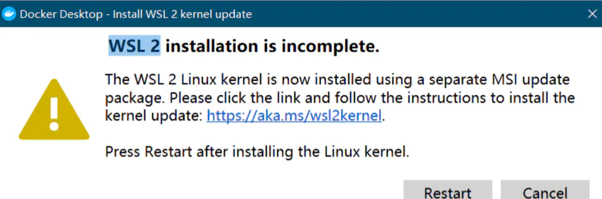
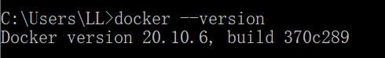
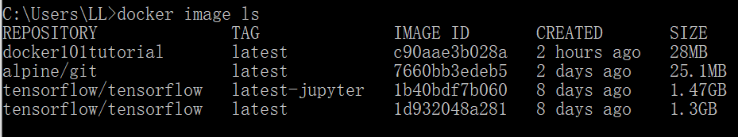
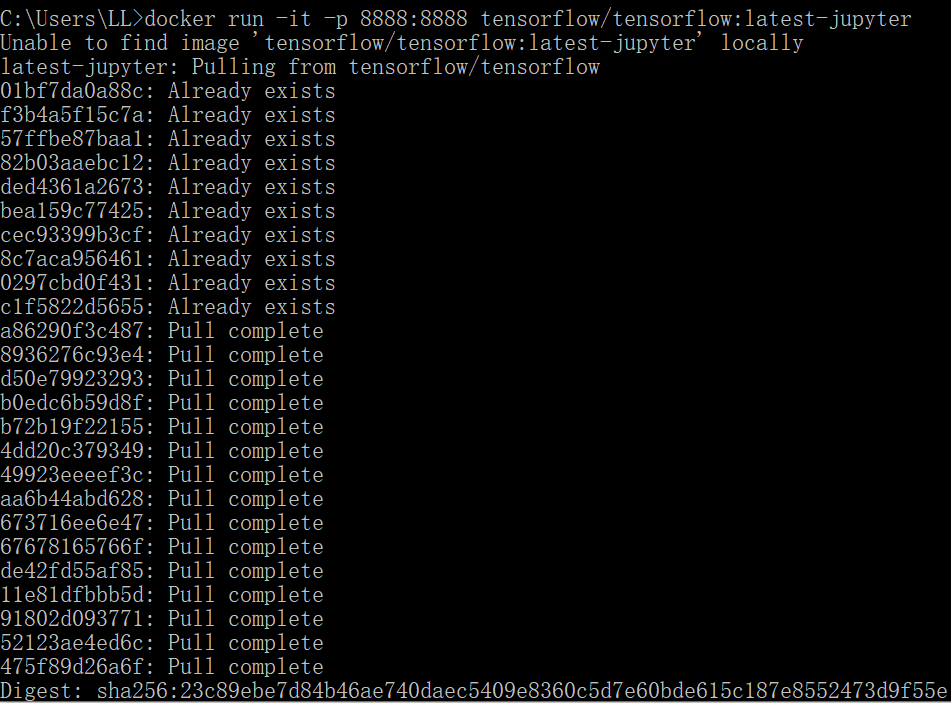
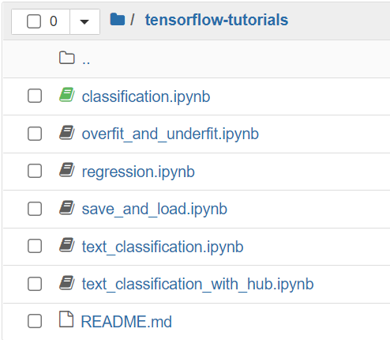

# Docker

## Docker介绍

Docker 是一个开源的应用容器引擎，可以视为一个轻量级的虚拟机。它是做什么的呢？它可以让开发者打包他们的应用以及依赖包到一个轻量级、可移植的容器中，然后发布到任何流行的操作系统，比如 Linux/Windows/Mac 的机器上。说白了就是把一个特定的环境封装起来，如果我们要部署不同的模型，他们有的是需要python2有的需要python3，有的用tf1.x有的用tf2.x，那就需要好几套环境来进行部署，全都装在一个机器里太乱了。所以干脆搞一个集装箱式的东西，每一个集装箱里面装了一套环境（比如py2+tf1.x，或者py3+tf2.x），集装箱里面的环境与外界是独立的，然后把模型部署到这个集装箱里，整个机器的环境就不乱了。

那虚拟机也可以起到同样的作用，为什么不用虚拟机呢？因为相比之下Docker能灵活的分配资源。一个虚拟机占的资源（CPU、内存等）在他被创造出来时候就设定好的，哪怕这个虚拟机啥也不干，这些资源也不能被其他程序利用，这就造成了资源浪费。而Docker可以根据实际消耗来分配不同镜像所占的资源。

## Docker安装

### windows

Docker的安装比较简单，因为我是Win10系统，所以讲讲Win10是怎么安装Docker的。

我们要下载的是Docker Desktop for Windows。[Docker Desktop for Windows](https://docs.docker.com/docker-for-windows/install/) 支持 64 位版本的 Windows 10 Pro，且必须开启 Hyper-V（若版本为 v1903 及以上则无需开启 Hyper-V），或者 64 位版本的 Windows 10 Home v1903 及以上版本。我的系统是64位的Win10家庭版，版本号是1909。所以满足要求。

去[官网](https://www.docker.com/get-started)下载Docker Desktop for Windows.exe。然后双击文件开始安装。安装完成后提示重启，根据指示重启即可。

重启之后又跳出一个框提醒我升级WSL2内核，点击其中的链接下载wsl_update_x64.msi，双击安装。再重启。Docker就自动运行起来了（默认是开机自启动的）。



启动之后任务栏就会出现一个鲸鱼图标。而且会有一个界面教你怎么简单使用。


安装完 Docker 后，不仅可以通过图形界面打开并运行 Docker，而且可以通过命令行来进行 Docker 相关的操作。

打开命令行，输入`docker —version`查看版本。如果可以看到版本说明你的Docker已经安装好了。




### linux

参考[https://yeasy.gitbook.io/docker_practice/install/centos](https://yeasy.gitbook.io/docker_practice/install/centos)

```Markdown
sudo yum install -y yum-utils

sudo yum-config-manager \
    --add-repo \
    https://mirrors.aliyun.com/docker-ce/linux/centos/docker-ce.repo
    
sudo sed -i 's/download.docker.com/mirrors.aliyun.com\/docker-ce/g' /etc/yum.repos.d/docker-ce.repo

sudo yum install docker-ce docker-ce-cli containerd.io

sudo systemctl enable docker
sudo systemctl start docker

```


## Docker常用命令

现在我们就可以使用Docker啦，来看一些常用命令吧~

docker重启``sudo service docker restart`


几个概念

- 镜像（Image）：类似虚拟机镜像。

- 容器（Container）：类似linux系统环境，运行和隔离应用。容器从镜像启动的时候，docker会在镜像的最上一层创建一个可写层，镜像本身是只读的，保持不变。

- 仓库（Repository）：是集中存放镜像的地方。

Docker 运行容器前需要本地存在对应的镜像，如果本地不存在该镜像，Docker 会从镜像仓库下载该镜像。

### 镜像

查看本地镜像`docker image ls`



REPOSITORY表示镜像的仓库源，TAG是镜像的标签，**IMAGE ID** 是镜像ID，然后是创建时间和镜像大小。因为我之前拉取过几个镜像，所以这里会有。

查看镜像`docker images`

删除镜像`docker rmi <your-image-id>`

清理临时的、没有被使用的镜像文件`docker image prune`


拉取镜像的命令是`docker pull [选项] [Docker Registry 地址[:端口号]/]仓库名[:标签]`。

- 具体的选项可以通过 `docker pull --help` 命令看到

- Docker 镜像仓库地址：地址的格式一般是 `<域名/IP>[:端口号]`。默认地址是 Docker Hub(`docker.io`)。

- 仓库名：这里的仓库名是两段式名称，即 `<用户名>/<软件名>`。对于 Docker Hub，如果不给出用户名，则默认为 `library`，也就是官方镜像。

- 标签常用于对应软件的各个版本。如果不给出标签，将以 `latest` 作为默认标签。

比如要拉取TensorFlow官方专用的最新的稳定版的Docker镜像，命令就是`docker pull tensorflow/tensorflow:latest`。运行后就会拉取镜像到本地。

再比例拉取TensorFlow serving的GPU版本：`docker pull tensorflow/serving:1.14.0-gpu` 

删除镜像的命令`docker image rm [选项] <镜像1> [<镜像2> ...]`

- `<镜像>` 可以是`镜像长 ID`、 `镜像短 ID`（一般取前3个字符以上，只要足够区分于别的镜像就可以）、`镜像名`（也就是 `<仓库名>:<标签>`） 或者 `镜像摘要`。

- 镜像摘要默认不显示，需要用`docker image ls --digests`查询。

举例说明删除镜像的方法：


要删除镜像docker101tutorial，可以用`docker image rm c90`，或者`docker image rm docker101tutorial`。一般用镜像短ID比较多，因为方便O(∩_∩)O~

查找镜像的地方

- 官⽅镜像库docker_hub： [https://hub.docker.com/](https://hub.docker.com/)

- 例如cuda相关镜像：[https://hub.docker.com/r/nvidia/cuda/](https://hub.docker.com/r/nvidia/cuda/)

镜像构建


使⽤Dockerfile构建镜像`docker build -t [image_name:tag] [上下⽂路径]`

例如：docker build -t antispam/server:test1 .


由运⾏中的容器构建镜像（不推荐）`docker commit -m"message"-a"author" [CONTAINER ID] [给新的镜像命名]`

### 容器

启动容器有两种方式，一种是基于镜像新建一个容器并启动，另外一个是将在终止状态（`exited`）的容器重新启动。

基于镜像新建一个容器并启动：`docker run [OPTIONS] IMAGE [COMMAND] [ARG...]`

举例：`docker run -it --name {name} -v local_dir:container_dir image:tag`

OPTIONS部分参数说明：

- **-a stdin:**  指定标准输入输出内容类型，可选 STDIN/STDOUT/STDERR 三项；

- **-d:**  后台运行容器，并返回容器ID；

- -e: 设置环境变量

- --gpus：指定想要使⽤的gpu，例如`--gpus '"device=1,2"'`

- **-i:**  以交互模式运行容器，通常与 -t 同时使用；

- --mount： 表示将文件系统挂载附加到容器。例如`--mount type=bind,source=/src/webapp,target=/opt/webapp`

source： 指定要运行部署的模型地址， 也就是挂载的源，这个是在宿主机上的servable模型目录（pb格式模型而不是checkpoint模型）

target: 这个是要挂载的目标位置，也就是挂载到docker容器中的哪个位置，这是docker容器中的目录，模型默认挂在/models/目录下，如果改变路径会出现找不到model的错误

- --name: 指定容器name，后续使用比用container_id更方便。例如`--name=mydemo`

- **-P:**  随机端口映射，容器内部端口**随机** 映射到主机的端口，让外部可访问容器

- **-p:**  指定端口映射，格式为：主机(宿主)端口:容器端口，例如`-p 8080:8080`

- --restart：容器退出时重新启动策略以应用。可以设置为`--restart=always`

- **-t:**  为容器重新分配一个伪输入终端，通常与 -i 同时使用；

- --rm：退出时自动删除容器，一般在临时调试时用

- -v: 绑定挂载卷

容器是否会⻓久运⾏，和 docker run 或者Dockerfile中CMD指定要执⾏的命令有关，和 -d 参数⽆关。


如果想⻓久运⾏⼀个没有指定任何命令的镜像，可以使⽤如下命令：`docker run -dit image:tag`

-it 相当于设置了⼀个可以和容器内部交互的伪终端，便于调试和使用。

当利用 `docker run` 来创建容器时，Docker 在后台运行的标准操作包括：


- 检查本地是否存在指定的镜像，不存在就从 [registry](/docker_practice/repository) 下载


- 利用镜像创建并启动一个容器


- 分配一个文件系统，并在只读的镜像层外面挂载一层可读写层


- 从宿主主机配置的网桥接口中桥接一个虚拟接口到容器中去


- 从地址池配置一个 ip 地址给容器


- 执行用户指定的应用程序


- 执行完毕后容器被终止

例如：运行一个临时容器，使用后自动终止`docker run -it --rm image:tag /bin/bash`

在容器内部时，可以使⽤ exit 命令或 Ctrl+d 退出。

例如新建一个tensorflow的jupyter notebook的容器：`docker run -it -p 8888:8888 tensorflow/tensorflow:latest-jupyter`，就会开始拉取相关镜像并启动容器



运行起来后命令行里可以看到一个[http://127.0.0.1:8888/](http://127.0.0.1:8888/)开头的url，复制该url在浏览器中打开，进入tensorflow-tutorials文件夹即可看到下面的内容。




现在就可以尽情地玩啦~都不用自己安装配置TensorFlow的环境，非常方便有木有！而且 docker 的运行与你的主系统是隔离的，如果把它“玩坏了”，再重新拉取全新的镜像就好。

#### 容器其它命令

启动/停止容器`docker container start/stop $container_id或$container_name`

查看所有运行容器`docker ps`或者`docker container ls`（前者是老命令，建议用后者）

还可以用来查找：`docker container ps | grep "tensorflow/serving"`

查看全部容器`docker ps -a`或者`docker container ls -a`

杀死指定容器`docker container kill $container_id`

删除指定容器`docker container rm $container_id`

查看运行容器的日志`docker container logs -f $container_id`

删除所有处于终⽌状态的容器`docker container prune`

查看运⾏的容器的cpu占⽤及内存占⽤`docker container stats $container_id`

使⽤exec命令进⼊⼀个运⾏中的容器`docker exec -it $container_id bash`

更新容器参数`docker update --restart=always [容器名]`

### 数据拷贝

拷⻉外部数据到容器中`docker cp /src_path container_id:/dst_path_in_container`

拷⻉容器中的数据到外部`docker cp container_id:/src_path_in_container /dst_path`

示例： `docker cp 4b3f8de49dff:/usr/local/tomcat/logs/catalina.out /opt`


## Docker gpu使用

docker gpu工具安装：[https://docs.nvidia.com/datacenter/cloud-native/container-toolkit/install-guide.html#installing-on-centos-7-8](https://docs.nvidia.com/datacenter/cloud-native/container-toolkit/install-guide.html#installing-on-centos-7-8)

Nvidia Container Toolkit,该工具使Docker 的容器能与主机的Nvidia显卡进行interact.

比如nvidia-tensorflow安装命令在：[https://ngc.nvidia.com/catalog/containers/nvidia:tensorflow](https://ngc.nvidia.com/catalog/containers/nvidia:tensorflow)

注意cuda版本和tf版本：[https://docs.nvidia.com/deeplearning/frameworks/tensorflow-release-notes/rel_21-12.html#rel_21-12](https://docs.nvidia.com/deeplearning/frameworks/tensorflow-release-notes/rel_21-12.html#rel_21-12)

注意宿主机的cuda版本要比docker的cuda版本高（最好高好几个，比如宿主机是cuda11.3，docker可以安装11.0）

**宿主机（物理主机）的Nvidia GPU 驱动 必须大于 CUDA Toolkit要求的 Nvida GPU 驱动版本。**

**即使Docker的CUDA和主机无关**，但是**Docker和宿主机的驱动有关**

`nvidia-docker run --rm -it -e NVIDIA_VISIBLE_DEVICES=1,2 --shm-size=1g --ulimit memlock=-1 --mount type=bind,src=$PWD,dst=/gpt-neox gpt-neox`

`nvidia-docker run --user 0 --rm -it -e NVIDIA_VISIBLE_DEVICES=1,2 --shm-size=1g --ulimit memlock=-1 --mount type=bind,src=$PWD,dst=/gpt-neox gpt-neox`

比如使用tf2 gpu：

```Bash
docker run --gpus all -it --rm -v local_dir:container_dir nvcr.io/nvidia/tensorflow:19.12-tf2-py3
```

-   `-it` means run in interactive mode
-   `--rm` will delete the container when finished
-   `-v` is the mounting directory
-   `local_dir` is the directory or file from your host system (absolute path) that you want to access from inside your container. `container_dir` is the target directory when you are inside your container.


参考资料

-   [CUDA兼容性问题（显卡驱动、docker内CUDA）](https://zhuanlan.zhihu.com/p/459431437)
-   [RTX3090运行Tensorflow1.15（CUDA 11.1） Docker、TF1.15测试环境](https://zhuanlan.zhihu.com/p/341969571)
-   [RTX3080+Ubuntu18.04+cuda11.1+cudnn8.0.4+TensorFlow1.15.4+PyTorch1.7.0环境配置](https://blog.csdn.net/wu496963386/article/details/109583045)

## Docker镜像制作

### docker commit

容器-->镜像转化

进入容器**`docker exec -it <container id> or <name> bash`**

pip安装包，exit退出容器

基于安装的包创建一个新的镜像**`docker commit <container id> <new docker name>`**

**docker commit 的弊端：**

如果是安装软件包、编译构建，那会有大量的无关内容被添加进来，如果不小心清理，将会导致镜像极为臃肿。

此外，使用 docker commit 意味着所有对镜像的操作都是黑箱操作，生成的镜像也被称为 黑箱镜像，换句话说，就是除了制作镜像的人知道执行过什么命令、怎么生成的镜像，别人根本无从得知。而且，即使是这个制作镜像的人，过一段时间后也无法记清具体在操作的。虽然 docker diff 或许可以告诉得到一些线索，但是远远不到可以确保生成一致镜像的地步。这种黑箱镜像的后期维护工作是非常痛苦的。

而且，镜像所使用的分层存储，除当前层外，之前的每一层都是不会发生改变的，换句话说，任何修改的结果仅仅是在当前层进行标记、添加、修改，而不会改动上一层。如果使用 docker commit 制作镜像，以及后期修改的话，每一次修改都会让镜像更加臃肿一次，所删除的上一层的东西并不会丢失，会一直如影随形的跟着这个镜像，即使根本无法访问到。这会让镜像更加臃肿。

**docker commit的优点：**

操作简单，易上手

### docker build

docker build的方式生成新镜像的前提条件是有一个旧的基础镜像，在此基础上通过docker build 命令执行dockerfile 文件从而生成一个新的镜像，不同于docker commit，是镜像--> 镜像的转化。

现在，[假设需求是将之前的镜像hub.c.163.com/library/centos：7.3.1611](http://xn--hub-998dt4gmxan0f4r3a22uj2npt0a6o0dwe0a21e.c.163.com/library/centos%EF%BC%9A7.3.1611) 作为基础镜像，通过dockerfile 文件的编写，执行，生成一个新的镜像，镜像名称为centos-vim:v2.0,。

1.  新建一个空文件夹，名称任意，只需要为空就好。假设名称为 make_vim 这个文件夹，进入这个文件夹，编写文件，文件名称为 centos-vimv2.0
2.  centos-vim2.0 的内容如下：

```Bash
FROM  hub.c.163.com/library/centos:7.3.1611
RUN yum install -y vim httpd \
&& yum clean all
RUN pip install --no-cache-dir --upgrade pip && \
    pip install --no-cache-dir nibabel pydicom matplotlib pillow && \
    pip install --no-cache-dir med2image

```

另一个例子：

`FROM` [`nvcr.io/nvidia/tensorflow:21.05-tf1-py3`](http://nvcr.io/nvidia/tensorflow:21.05-tf1-py3)

```Bash
FROM python:3

WORKDIR /usr/src/app

COPY requirements.txt ./
RUN pip install --no-cache-dir -r requirements.txt

COPY . .

CMD [ "python", "./your-daemon-or-script.py" ]
```


```
FROM pytorch/pytorch:1.11.0-cuda11.3-cudnn8-devel

WORKDIR /usr/src/app

RUN rm /etc/apt/sources.list.d/cuda.list \
&& rm /etc/apt/sources.list.d/nvidia-ml.list \
&& apt-get update \
&& apt-get install -y git

COPY requirements.txt ./
RUN pip install --no-cache-dir -r requirements.txt

RUN mkdir -m 700 /root/.ssh; \
touch -m 600 /root/.ssh/known_hosts; \
ssh-keyscan github.com > /root/.ssh/known_hosts

RUN --mount=type=ssh,id=github git clone git地址
```

例子
```
FROM python:3.8-buster as builder-image

COPY requirements.txt ./

RUN pip3 install --no-cache-dir -r requirements.txt -i https://pypi.tuna.tsinghua.edu.cn/simple

FROM python:3.8-slim-buster

COPY --from=builder-image /usr/local/bin /usr/local/bin

COPY --from=builder-image /usr/local/lib/python3.8/site-packages /usr/local/lib/python3.8/site-packages

WORKDIR /opt/chat_server

COPY . .

EXPOSE 8080

ENTRYPOINT [ "python" ]

CMD ["test.py"]
```


build命令`sudo docker build --ssh github=~/.ssh/id_ed25519 -t image_gen:v1.1 .


3.  运行build 命令，生成新镜像centos-vim:v2.0

`docker build -f ./centos-vimv2.0 -t centos-vim:v2.0 .`

注意，是在 make_vim 这个文件夹下执行此命令，命令最后是有一个点的。

`docker run -itd --name centos5 centos-vim:v2.0`

传入参数：`docker build --build-arg ARG1="" --build-arg ARG2="" -t xxx:xxx .`

其中参数是在dockerfile里面定义的，比如`ARG username=$ARG1`

5，当然了，在dockerfile里，加入了清理yum安装痕迹命令，因此，镜像要比commit 方式小一些。仅仅做一个小示例，因此dockerfile的很多功能没有演示，比如：复制宿主机的文件和文件夹到镜像内部，cmd ，entrypoint ，add，copy，export，workdir等等并没有使用。docker build -t 后面接的是新镜像的tag，-f 后面接的是dockerfile文件的名称，如果dockerfile的名称是Dockerfile，那么，可以省略-f以及其以后的内容，也就是不指定，docker会自动优先使用名称叫Dockerfile的文件构建新镜像。

Dockerfile的优点：

能够自由灵活的与宿主机联系，比如，某些配置文件在宿主机验证并使用过后很好用，那么，可以将文件copy到镜像中，（这个动作是写在dockerfile里），add 远程主机的配置文件到镜像中，定义onbuild动作等等各种灵活的功能。docker commit不能做到这些事情，因为是在一个封闭的在运行中的容器中，无法做复制拷贝宿主机文件的事情。

dockerfile本身就是一个比较详细的构建文档，有这个文档就可以清楚的知道新构建的镜像经历了怎样的变化。没有黑箱操作的困扰了，后期的维护更为方便了。

后期可扩展性强，一个文件就可以在哪都可以运行镜像了。（前提有网，有安装docker环境）

Dockerfile的缺点：编写不容易，因为需要对脚本这些比较了解，有Linux基础的人才可以编写出好用的dockerfile，上手难度大。

[docker commit 和docker build （实战使用以及区别）](https://blog.csdn.net/alwaysbefine/article/details/111375658)

[python dockerfile 多阶段构建镜像瘦身](https://www.toutiao.com/article/7023296235822170636/?wid=1652859218807)

[docker镜像的版本（bullseye、buster、slim、alphine）](https://blog.csdn.net/alun550/article/details/123184731)

[https://blog.csdn.net/m0_46090675/article/details/121846718](https://blog.csdn.net/m0_46090675/article/details/121846718)

https://dzone.com/articles/clone-code-into-containers-how

## 权限问题

`id`查看当前用户（宿主机和容器都可以看，同一个uid表示同一个用户）

如果两个不一样，可能会导致容器内没有权限，需要在docker run后面加参数`—user uid`，例如`—user 1000`

参考：[理解 docker 容器中的 uid 和 gid](https://www.cnblogs.com/sparkdev/p/9614164.html)


## 资料

[https://github.com/yeasy/docker_practice](https://github.com/yeasy/docker_practice)

Docker教程推荐


[https://yeasy.gitbooks.io/docker_practice/content/introduction/](https://yeasy.gitbooks.io/docker_practice/content/introduction/)

[https://www.cnblogs.com/bethal/p/5942369.html](https://www.cnblogs.com/bethal/p/5942369.html)

[https://www.cnblogs.com/xiaobaiskill/p/12203575.html](https://www.cnblogs.com/xiaobaiskill/p/12203575.html)

Win下迁移到其它盘：[https://www.cnblogs.com/xhznl/p/13184398.html](https://www.cnblogs.com/xhznl/p/13184398.html)

查看日志等：[https://nkcoder.github.io/posts/docker/docker-container-status/](https://nkcoder.github.io/posts/docker/docker-container-status/)


[修改 Docker 镜像默认存储位置的方法](https://cloud.tencent.com/developer/article/1835999)

（注意文件夹路径，docker/docker了）

[Docker - 挂载目录（bind mounts）和Volume是不同的](https://blog.csdn.net/qingyafan/article/details/89577717)

[17条Docker最佳实践](https://zhuanlan.zhihu.com/p/457069205)

