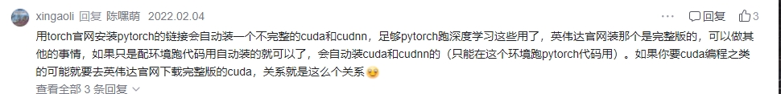
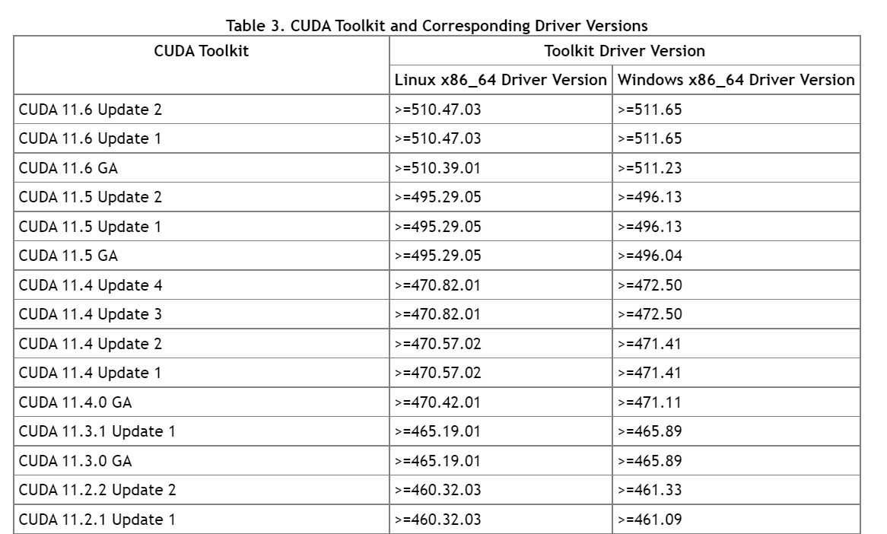
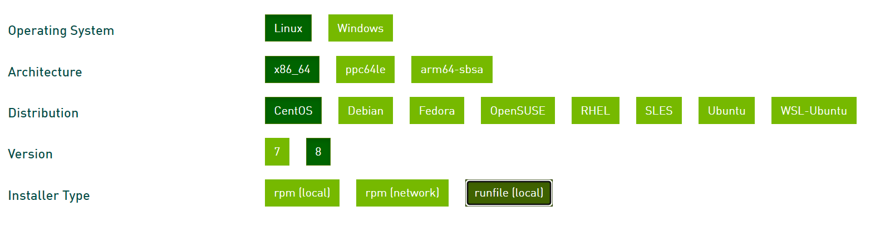
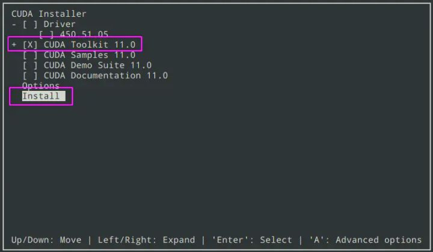
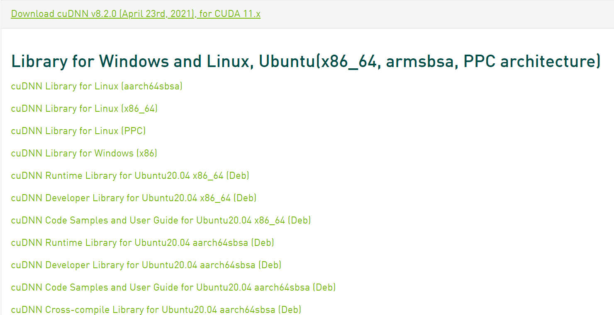

# Linux系统CUDA安装及踩坑记录

我的Linux系统背景：

- 系统和驱动都已安装。
- 系统是centos 8。查看自己操作系统的版本信息：`cat /etc/issue`或者是 `cat /etc/lsb-release`
- 用`nvidia-smi`可以看到显卡驱动和可支持的最高cuda版本，我的是11.4。驱动版本是470.57.02。

首先，检查是否安装了CUDA：`ls -l /usr/local | grep cuda`

如果已经安装了就不需要再次安装，当然有一种说法是不安装CUDA也可行，在虚拟环境中安装pytorch的时候会自动装一个不完整的CUDA，足够跑深度学习了。但是如果需要cuda编程等操作就需要安装完整版的CUDA，也就是后面我要介绍的安装过程。

其实我也试过不安装CUDA直接安装pytorch，确实是可用的，只不过用deepspeed的时候会报错找不到CUDA HOME，所以还是安装完整版CUDA吧~




## 1.安装cuda

根据机器的显卡驱动可以查看可安装的cuda版本

参考：[https://docs.nvidia.com/cuda/cuda-toolkit-release-notes/index.html](https://docs.nvidia.com/cuda/cuda-toolkit-release-notes/index.html)



我选择安装的是CUDA 11.3.1，[不同版本下载安装链接](https://developer.nvidia.com/cuda-toolkit-archive)，根据自己的系统选择下图的选项，installer type选择runfile（local），然后根据给出的命令安装CUDA：



比如我安装CUDA 11.3.1的命令是：

```Bash
wget https://developer.download.nvidia.com/compute/cuda/11.3.1/local_installers/cuda_11.3.1_465.19.01_linux.run
sudo sh cuda_11.3.1_465.19.01_linux.run
```


傻瓜式操作输入yes，accept等即可。安装的时候注意选择不安装驱动，因为机器本身已经有驱动，所以这一步需要用空格取消对`Driver`的选中（事实上我遇到的情况是，如果不取消选中，安装会fail）。其他选项中除了`CUDA Toolkit`是必选，其他都是可选项目。我这里其他都选择了。最后选择`Install`。类似于下图



如果这个过程中出现提示`existing package manager installation of the driver found`，那么需要先退出安装，[删除cuda toolkit和driver](https://docs.nvidia.com/cuda/archive/11.4.1/cuda-installation-guide-linux/index.html#removing-cuda-tk-and-driver)

```Bash
To remove CUDA Toolkit:
$ sudo dnf remove "cuda*" "*cublas*" "*cufft*" "*curand*" \
 "*cusolver*" "*cusparse*" "*npp*" "*nvjpeg*" "nsight*"
To remove NVIDIA Drivers:
$ sudo dnf remove nvidia-driver 
To reset the module stream:
$ sudo dnf module reset nvidia-driver

```


然后装CUDA，再装驱动：`sudo dnf module install nvidia-driver`

如果没有出现这个问题就不需要管驱动啦~


检查cuda是否安装成功：`nvcc -V`

如果没有这个命令的话，需要配置。

`vim ~/.bashrc`

在文件末尾添加（这里的`/usr/local/cuda-11.3`替换成你的cuda安装路径，一般都在`/usr/local`路径下）

```Bash
export LD_LIBRARY_PATH=$LD_LIBRARY_PATH:/usr/local/cuda-11.3/lib64
export PATH=$PATH:/usr/local/cuda-11.3/bin
# export CUDA_HOME=$CUDA_HOME:/usr/local/cuda-11.3
export CUDA_HOME=/usr/local/cuda-11.3
```


然后`source ~/.bashrc`

上述环境变量中，我看很多教程都是按照第三行配置的CUDA_HOME，但是后续我在使用deepspeed的时候会报错找不到`/usr/local/cuda-11.3:/usr/local/cuda-11.3/bin/nvcc`，按照第四行配置CUDA_HOME就不会有这个问题。

再执行`nvcc -V`就会显示出你刚刚安装的CUDA版本


## 2.安装cuDNN

cuDNN**是NVIDIA专门针对深度神经网络（Deep Neural Networks）中的基础操作而设计基于GPU的加速库**。不安装的话不会报错，但是训练的速度会慢很多。

去[英伟达官网](https://developer.nvidia.com/rdp/cudnn-download)下载cuda 11.3对应的cuDNN安装包（需要注册），具体安装哪个版本呢，可以参考这个[链接](https://docs.nvidia.com/deeplearning/cudnn/support-matrix/index.html)和你的CUDA版本选择。

我选择安装的是8.2.0版本，cuDNN Library for Linux(x86_64)这个版本（图中的第二个链接），下载后的文件是cudnn-11.3-linux-x64-v8.2.0.53.tgz



下载完成后解压得到`cuda`目录，`cuda`目录下面有`include`和`lib64`两个子目录。将cuda/include/cudnn.h文件复制到usr/local/cuda-11.3/include文件夹，将cuda/lib64/下所有以libcudnn开头的文件复制到/usr/local/cuda-11.3/lib64文件夹中，并添加读取权限

```Bash
tar -xvf cudnn-11.3-linux-x64-v8.2.0.53.tgz #解压

sudo cp cuda/include/cudnn.h    /usr/local/cuda-xx.x/include # 填写对应的版本的cuda路径
sudo cp cuda/lib64/libcudnn*    /usr/local/cuda-xx.x/lib64   # 填写对应的版本的cuda路径
sudo chmod a+r /usr/local/cuda-xx.xx/include/cudnn.h   /usr/local/cuda-xx.xx/lib64/libcudnn*

```


## 3.测试是否成功

[安装miniconda](https://docs.conda.io/projects/conda/en/latest/user-guide/install/linux.html)，创建环境，安装pytorch。`conda install pytorch torchvision torchaudio cudatoolkit=11.3 -c pytorch`。

进入环境，执行

```Python
import torch
torch.cuda.is_available()
```


返回True就说明没问题了。

然后此处我一直是False，报错信息是`Error 802: system not yet initialized 。`

搜索这个报错信息，找到[教程](https://github.com/pytorch/pytorch/issues/35710)，可以用来验证CUDA是否安装成功。

教程里用的是ubuntu系统。centos系统的操作过程如下（**注意下面的教程操作完成后，显卡驱动会更新**）

```Bash
# 需要先安装git：sudo yum install -y git
# 其实安装cuda的时候如果选了samples也可以直接用那个
git clone https://github.com/NVIDIA/cuda-samples.git
# 这个路径如果不存在，就自己找找bandwidthTest在哪个路径，因为项目可能有更新
cd cuda-samples/Samples/1-Utilities/bandwidthTest
make
./bandwidthTest

```


注意如果`make`报错说没有g++，需要安装`**yum install gcc-c++**`

执行`./bandwidthTest`后报错：

```Bash
> ./bandwidthTest
[CUDA Bandwidth Test] - Starting...
Running on...

cudaGetDeviceProperties returned 802
-> system not yet initialized
CUDA error at bandwidthTest.cu:256 code=802(cudaErrorSystemNotReady) "cudaSetDevice(currentDevice)" 
```


需要安装Data Center GPU manager。[安装教程](https://developer.nvidia.com/dcgm)

```Bash
# Set up the CUDA network repository meta-data, GPG key
sudo dnf config-manager --add-repo https://developer.download.nvidia.com/compute/cuda/repos/rhel8/x86_64/cuda-rhel8.repo
# Install DCGM
sudo dnf clean expire-cache \
&& sudo dnf install -y datacenter-gpu-manager
# Set up the DCGM service
sudo systemctl --now enable nvidia-dcgm

```


然后

```Bash
# terminate the host engine，这里可能会报错unable to terminate xxx，忽略
sudo nv-hostengine -t
# and start the fabricmanager
sudo service nvidia-fabricmanager start

```


如果报错了：

```Bash
> sudo service nvidia-fabricmanager start
Failed to start nvidia-fabricmanager.service: Unit nvidia-fabricmanager.service not found.
```


[开始安装fabric manager](https://centos.pkgs.org/8/cuda-x86_64/cuda-drivers-fabricmanager-510.47.03-1.x86_64.rpm.html)并启动:

```Bash
sudo dnf install cuda-drivers-fabricmanager
sudo service nvidia-fabricmanager start

```


start的时候报错Job for nvidia-fabricmanager.service failed because the control process exited with error code.

`systemctl status nvidia-fabricmanager.service`也看不出个所以然，用`nvidia-smi`发现报错`Failed to initialize NVML: Driver/library version mismatch`说明驱动不匹配。

查看驱动版本`cat /proc/driver/nvidia/version`，还是之前的。

重启服务器，再次查看驱动，发现驱动升级了。

`nvidia-smi`也可以用，显示的CUDA版本是11.6，跟`nvcc`看到的版本不一样。不过这并不冲突，`nvcc`看到的CUDA版本不会大于`nvdia-smi`看到的版本，安装pytorch的时候也是根据`nvcc`的CUDA版本安装的。

至于两者为什么不一样，可以查看这篇文章：[【CUDA】nvcc和nvidia-smi显示的版本不一致？](https://www.jianshu.com/p/eb5335708f2a)。

再次执行`sudo service nvidia-fabricmanager start`不报错

按照之前的教程，验证cuda是否安装成功

```Bash
cd cuda-samples/Samples/1-Utilities/bandwidthTest
./bandwidthTest
```


没有报错！进一步验证`torch.cuda.is_available()`返回True。大功告成！


## 参考资料

CUDA不同版本下载安装链接：https://developer.nvidia.com/cuda-toolkit-archive

删除cuda toolkit和driver的教程：https://docs.nvidia.com/cuda/archive/11.4.1/cuda-installation-guide-linux/index.html#removing-cuda-tk-and-driver

下载cuDNN安装包的链接：https://developer.nvidia.com/rdp/cudnn-download

cuDNN版本选择：https://docs.nvidia.com/deeplearning/cudnn/support-matrix/index.html

安装miniconda：https://docs.conda.io/projects/conda/en/latest/user-guide/install/linux.html

验证CUDA是否安装成功并修复的ubuntu教程：https://github.com/pytorch/pytorch/issues/35710

安装Data Center GPU manager的教程：https://developer.nvidia.com/dcgm

安装fabric manager的教程：https://centos.pkgs.org/8/cuda-x86_64/cuda-drivers-fabricmanager-510.47.03-1.x86_64.rpm.html

【CUDA】nvcc和nvidia-smi显示的版本不一致？：https://www.jianshu.com/p/eb5335708f2a

[理清GPU、CUDA、CUDA Toolkit、cuDNN关系以及下载安装](https://blog.csdn.net/qq_42406643/article/details/109545766)

[https://lizhihao999.cn/posts/脱坑记录/linux多版本cuda安装及切换/](https://lizhihao999.cn/posts/脱坑记录/linux多版本cuda安装及切换/)

