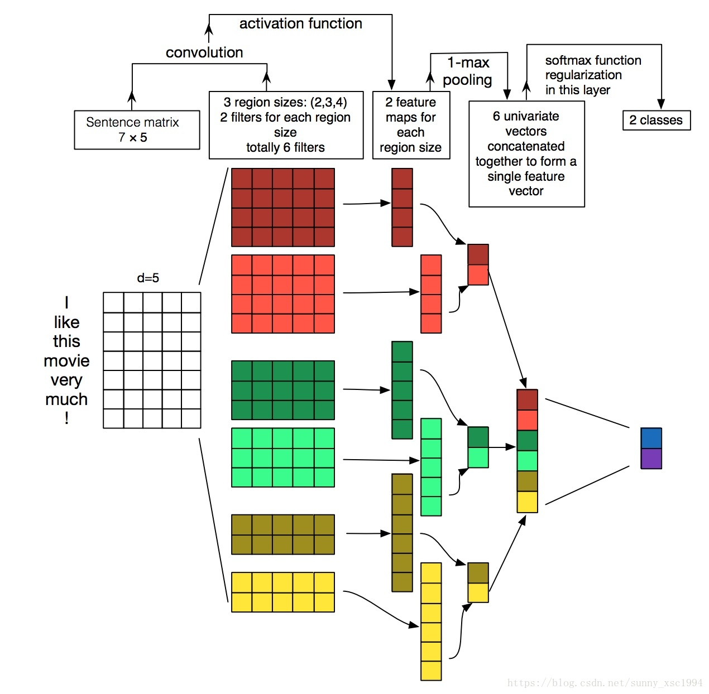

# Pytorch

PyTorch是一个基于python的科学计算包，主要针对两类人群：

- 作为NumPy的替代品，可以利用GPU的性能进行计算
- 作为一个高灵活性、速度快的深度学习平台

安装

`conda install pytorch torchvision torchaudio cudatoolkit=11.1.1 -c pytorch-lts -c nvidia`

`conda install pytorch torchvision torchaudio cudatoolkit=11.3 -c pytorch`

## 指定卡

torch.cuda.set_device(0)

torch.cuda.is_available()

## transformers

### Trainer的使用方法

[huggingface transformers使用指南之二——方便的trainer](https://zhuanlan.zhihu.com/p/363670628)

保存最好的模型：`--load_best_model_at_end --metric_for_best_model eval_loss --greater_is_better False`

### Cache

[https://huggingface.co/docs/datasets/v1.16.1/cache.html](https://huggingface.co/docs/datasets/v1.16.1/cache.html)

## GPU测速

```Python
start = torch.cuda.Event(enable_timing=True)
end = torch.cuda.Event(enable_timing=True)
start.record()
# function
end.record()
torch.cuda.synchronize()
time_snr = start.elapsed_time(end)
```

参考：

[https://www.jianshu.com/p/cbada26ea29d](https://www.jianshu.com/p/cbada26ea29d)

[https://discuss.pytorch.org/t/how-to-measure-time-in-pytorch/26964](https://discuss.pytorch.org/t/how-to-measure-time-in-pytorch/26964)

## 函数

### **torch.cat**

函数目的： 在给定维度上对输入的张量序列seq 进行连接操作。

outputs = torch.cat(inputs, dim=?) → Tensor

inputs : 待连接的张量序列，可以是任意相同Tensor类型的python 序列 dim : 选择的扩维, 必须在0到len(inputs[0])之间，沿着此维连接张量序列。

比如inputs为２个形状为[2 , 3]的矩阵

```python
In    [1]: torch.cat(inputs, dim=0).shape
Out[1]: torch.Size([4,  3])

In    [2]: torch.cat(inputs, dim=1).shape
Out[2]: torch.Size([2, 6])

In    [3]: torch.cat(inputs, dim=2).shape
IndexError: Dimension out of range (expected to be in range of [-2, 1], but got 2)

```

### **DataLoader**

DataLoader(dataset, batch_size=1, shuffle=False, sampler=None, num_workers=0, collate_fn=default_collate, pin_memory=False, drop_last=False)

-   dataset：加载的数据集(Dataset对象)
    
-   batch_size：batch size
    
-   shuffle:：是否将数据打乱
    
-   sampler： 样本抽样，后续会详细介绍
    
- `num_workers`：使用多进程加载的进程数，默认值为 0，表示数据将在主进程中加载。
1. 作用：
    - 当 num_workers > 0 时，DataLoader 使用多进程来并行加载数据。
    - 这可以显著提高数据加载的速度，特别是当数据预处理比较耗时或者 I/O 操作较多时。
2. 性能影响：
    - 增加 num_workers 通常可以提高数据加载速度。
    - 但是，使用过多的 workers 可能会导致 CPU 过载或内存使用过高。
3. 选择合适的值：
    - 一般建议将 num_workers 设置为机器 CPU 核心数的 2-4 倍。
    - 具体的最优值需要根据数据集大小、数据预处理复杂度、硬件配置等因素来实验确定。
4. 注意事项：
    - 在 Windows 系统上，多进程可能会有一些限制和性能问题。
    - 在使用多 GPU 训练时，总的 worker 数量应考虑所有 GPU 的情况。
5. 内存使用：
    - 每个 worker 都会复制一份数据集，因此增加 num_workers 会增加内存使用。
- 每次dataloader加载数据时：dataloader一次性创建num_worker个worker，（也可以说dataloader一次性创建num_worker个工作进程，worker也是普通的工作进程），并用batch_sampler将指定batch分配给指定worker，worker将它负责的batch加载进RAM。
- 然后，dataloader从RAM中找本轮迭代要用的batch，如果找到了，就使用。如果没找到，就要num_worker个worker继续加载batch到内存，直到dataloader在RAM中找到目标batch。一般情况下都是能找到的，因为batch_sampler指定batch时当然优先指定本轮要用的batch。
- num_worker设置得大，好处是寻batch速度快，因为下一轮迭代的batch很可能在上一轮/上上一轮...迭代时已经加载好了。坏处是内存开销大，也加重了CPU负担（worker加载数据到RAM的进程是CPU复制的嘛）。num_workers的经验设置值是自己电脑/服务器的CPU核心数，如果CPU很强、RAM也很充足，就可以设置得更大些。
- 如果num_worker设为0，意味着每一轮迭代时，dataloader不再有自主加载数据到RAM这一步骤（因为没有worker了），而是在RAM中找batch，找不到时再加载相应的batch。缺点当然是速度更慢。
    
-   collate_fn： 如何将多个样本数据拼接成一个batch，一般使用默认的拼接方式即可
    
-   pin_memory：是否将数据保存在pin memory区，pin memory中的数据转到GPU会快一些
    
-   dataset中的数据个数可能不是batch_size的整数倍，drop_last为True会将多出来不足一个batch的数据丢弃
    

`torch.tril(input, diagonal=0, *, out=None) → Tensor`

-   返回矩阵（2-D张量）或矩阵 `input` 批次的下三角部分，结果张量 `out` 的其他元素设置为0。
-   矩阵的下三角部分被定义为对角线上和下的元素。
-   [`diagonal`](https://runebook.dev/zh-CN/docs/pytorch/generated/torch.diagonal#torch.diagonal) 参数控制要考虑的对角线。如果 [`diagonal`](https://runebook.dev/zh-CN/docs/pytorch/generated/torch.diagonal#torch.diagonal) = 0，则保留主对角线上和下方的所有元素。正值包括在主对角线上方的对角线，同样，负值排除在主对角线下方的对角线。主要对角线是索引集\lbrace (i, i) \rbrace fori在[0,/min{d_{1},d_{2}}-1] whered_{1},d_{2}。 是矩阵的维度。

### [torch.ne](http://torch.ne)


### masked_fill_

masked_fill_([mask](https://so.csdn.net/so/search?q=mask&spm=1001.2101.3001.7020), value)掩码操作：用value填充[tensor](https://so.csdn.net/so/search?q=tensor&spm=1001.2101.3001.7020)中与mask中值为1位置相对应的元素。mask的形状必须与要填充的tensor形状一致。


## 安装

[https://pytorch.org/](https://pytorch.org/)  官网点击操作系统等配置获取安装命令

## 数据生成

查看数据的**维度**大小：`a.size()`或者`a.shape`，输出一个tuple：`torch.Size([5, 3])`

和numpy的各种数据生成的方法很像。

创建一个**没有初始化**的5*3矩阵：`x = torch.empty(5, 3)`

创建一个**随机初始化**矩阵：`x = torch.rand(5, 3)`

构造一个**填满`0`**且数据类型为`long`的矩阵:`x = torch.zeros(5, 3, dtype=torch.long)`.还可以通过`torch.zero_()`和`torch.zeros_like()`将现有矩阵转换为全0矩阵.

**标准正态分布**：`torch.randn(num_examples, num_inputs, dtype=torch.float32)`

tensor转numpy类型：`a.numpy()`。注意Torch张量和NumPy数组将共享它们的底层内存位置，因此当一个改变时,另外也会改变。

numpy转tensor类型：`torch.tensor(a)`，`b = torch.from_numpy(a)`

直接从数据构成向量：`torch.LongTensor([0, 1, 2, 3])`

**根据已有的tensor建立新的tensor。**除非用户提供新的值，否则这些方法将重用输入张量的属性，例如dtype等：

```python
x = x.new_ones(5, 3, dtype=torch.double)      # new_* methods take in sizes
print(x)

x = torch.randn_like(x, dtype=torch.float)    # 重载 dtype!
print(x)                                      # 结果size一致
```


## 运算

### 加法

维度相同，`x + y`或`torch.add(x, y)`

给定一个输出张量作为参数

```python
result = torch.empty(5, 3)
torch.add(x, y, out=result)
print(result)
```

原位/原地操作(in-place）：`y.add_(x)`  adds x to y

> 任何一个in-place改变张量的操作后面都固定一个`_`。例如`x.copy_(y)`、`x.t_()`将更改x

### 乘法

torch.mm 和 torch.mul 的区别？ torch.mm是矩阵相乘，torch.mul是按元素相乘

torch.manual_seed(1)的作用？ 设置随机种子，使实验结果可以复现

1. 点乘（Element-wise multiplication）：  
    点乘是一种逐元素相乘的操作，适用于具有相同形状的两个张量。点乘会按照元素对应位置相乘的方式处理两个张量中的每个元素。在PyTorch中，可以使用`torch.mul()`函数或`*`运算符进行点乘。  
    示例代码：
    
    1. `import torch`
    2. `a = torch.tensor([1, 2, 3])`
    3. `b = torch.tensor([4, 5, 6])`
    4. `result = a * b  # 结果为 [4, 10, 18]`
    
2. 批量点乘（Batchwise multiplication）：  
    批量点乘是一种逐批次相乘的操作，适用于具有不同维度的两个张量。在PyTorch中，可以使用`torch.bmm()`函数进行批量点乘。该函数接受两个张量作为参数，并将它们的最后一维进行匹配，然后逐元素相乘。  
    示例代码：
    
    1. `import torch`
    2. `a = torch.tensor([[1, 2], [3, 4]])`
    3. `b = torch.tensor([[5, 6], [7, 8]])`
    4. `result = torch.bmm(a, b)  # 结果为 [[19, 22], [43, 50]]`
    
3. 矩阵乘法（Matrix multiplication）：  
    矩阵乘法是线性代数中的基本运算之一，适用于两个矩阵之间的相乘。在PyTorch中，可以使用`torch.matmul()`函数或`@`运算符进行矩阵乘法。该函数接受两个矩阵作为参数，并按照矩阵乘法的规则进行计算。  
    示例代码：
    
    1. `import torch`
    2. `a = torch.tensor([[1, 2], [3, 4]])`
    3. `b = torch.tensor([[5, 6], [7, 8]])`
    4. `result = torch.matmul(a, b)  # 结果为 [[19, 22], [43, 50]]`
    
    除了上述三种乘法操作外，PyTorch还提供了其他一些高级的乘法函数和运算符，如`torch.einsum()`用于执行爱因斯坦求和约定，以及`torch.mm()`用于执行矩阵乘法。

### 索引

可以使用像标准的NumPy一样的各种索引操作`print(x[:, 1])`

如果是仅包含一个元素的tensor，可以使用`.item()`来得到对应的python数值

```python
x = torch.randn(1)
print(x)
print(x.item())
```


根据index选择数据，0表示按行选，1表示按列选：`features.index_select(0, j)`

### 改变形状

**torch.view**

**.view的用法**，比如a.view(1,6)，a.view(b.size())

把原先tensor中的数据按照行优先的顺序排成一个一维的数据（这里应该是因为要求地址是连续存储的），然后按照参数组合成其他维度的tensor。比如说是不管你原先的数据是[[[1,2,3],[4,5,6]]]还是[1,2,3,4,5,6]，因为它们排成一维向量都是6个元素，所以只要view后面的参数一致，得到的结果都是一样的。

参数如果是-1就代表这个位置由其他位置的数字来推断。a.view(1, -1)，-1代表的维度由a的维度和1推断出来，比如a tensor的数据个数是6，那么-1就代表6。

[Pytorch的nn.DataParallel](https://zhuanlan.zhihu.com/p/102697821)

超过100种tensor的运算操作，包括转置，索引，切片，数学运算， 线性代数，随机数等，具体访问[这里](https://pytorch.org/docs/stable/torch.html)

### CUDA上的张量

张量可以使用`.to`方法移动到任何设备(device）上：

```python
# 当GPU可用时,我们可以运行以下代码
# 我们将使用`torch.device`来将tensor移入和移出GPU
if torch.cuda.is_available():
    device = torch.device("cuda")          # a CUDA device object
    y = torch.ones_like(x, device=device)  # 直接在GPU上创建tensor
    x = x.to(device)                       # 或者使用`.to("cuda")`方法
    z = x + y
    print(z)
    print(z.to("cpu", torch.double))       # `.to`也能在移动时改变dtypeCopy
```

输出：

```python
tensor([1.0445], device='cuda:0')
tensor([1.0445], dtype=torch.float64)
```

## 自动求导

PyTorch中，所有神经网络的核心是 `autograd` 包。`utograd` 包为张量上的所有操作提供了自动求导机制。它是一个在运行时定义(define-by-run）的框架，这意味着反向传播是根据代码如何运行来决定的，并且每次迭代可以是不同的.

`torch.Tensor` 是这个包的核心类。如果设置它的属性 `.requires_grad` 为 `True`，那么`autograd`将会追踪对于该张量的所有操作。当完成计算后可以通过调用 `.backward()`，来自动计算所有的梯度。这个张量的所有梯度将会自动累加到`.grad`属性.

要阻止一个张量被跟踪历史，可以调用 `.detach()` 方法将其与计算历史分离，并阻止它未来的计算记录被跟踪。

为了防止跟踪历史记录(和使用内存），可以将代码块包装在 `with torch.no_grad():` 中。在评估模型时特别有用，因为模型可能具有 `requires_grad = True` 的可训练的参数，但是我们不需要在此过程中对他们进行梯度计算。

还有一个类对于autograd的实现非常重要：`Function`。

`Tensor` 和 `Function` 互相连接生成了一个无圈图(acyclic graph)，它编码了完整的计算历史。每个张量都有一个 `.grad_fn` 属性，该属性引用了创建 `Tensor` 自身的`Function`(除非这个张量是用户手动创建的，即这个张量的 `grad_fn` 是 `None` )。

如果需要计算导数，可以在 `Tensor` 上调用 `.backward()`。如果 `Tensor` 是一个标量(即它包含一个元素的数据），则不需要为 `backward()` 指定任何参数，但是如果它有更多的元素，则需要指定一个 `gradient` 参数，该参数是形状匹配的张量。

```python
import torch

# 创建一个张量并设置requires_grad=True用来追踪其计算历史
x = torch.ones(2, 2, requires_grad=True)
print(x)

# 对这个张量做一次运算：
y = x + 2
print(y)
```

输出

```python
tensor([[3., 3.],
        [3., 3.]], grad_fn=<AddBackward0>)
```

`y`是计算的结果，所以它有`grad_fn`属性。

使用backward()函数反向传播计算tensor的梯度时，并不计算所有tensor的梯度，而是只计算满足这几个条件的tensor的梯度：1.类型为叶子节点、2.requires_grad=True、3.依赖该tensor的所有tensor的requires_grad=True。

所有的tensor都有.requires_grad属性,可以设置这个属性：`x = tensor.ones(2,4,requires_grad=True)`

如果想改变这个属性，就调用tensor.requires_grad_()方法：`x.requires_grad_(False)`

参考：https://zhuanlan.zhihu.com/p/85506092

进行反向传播：`out.backward()`

输出导数：`print(x.grad)`


### sgd梯度下降

```py
def sgd(params, lr, batch_size): 
    for param in params:
        param.data -= lr * param.grad / batch_size # ues .data to operate param without gradient track
```

param.data和 param 共享同一块数据，和param的计算历史无关，且其requires_grad = False

如果只是使用参数本身，那么在这个sgd参数更新其实可能也会变成网络结构的一部分，这时候网络就不是线性回归了，而使用.data可能就是隔断了梯度传导，让这里只是一个参数数值更新。

在损失函数进行求梯度时，为了保证参数值正常更新的同时又不影响梯度的计算，即使用param.data可以将更新的参数独立于计算图，阻断梯度的传播，当训练结束就可以得到最终的模型参数值。

参考：https://www.boyuai.com/elites/course/cZu18YmweLv10OeV/video/Rosi4tliobRSKaSVcsRx_

https://zhuanlan.zhihu.com/p/38475183

**optimizer.zero_grad()的作用？**使梯度置零，防止不同batch得到的梯度累加

## 神经网络

可以使用`torch.nn`包来构建神经网络.

我们已经介绍了`autograd`包，`nn`包则依赖于`autograd`包来定义模型并对它们求导。一个`nn.Module`包含各个层和一个`forward(input)`方法，该方法返回`output`。

一个神经网络的典型训练过程如下：

- 定义包含一些可学习参数(或者叫权重）的神经网络
- 在输入数据集上迭代
- 通过网络处理输入
- 计算loss(输出和正确答案的距离）
- 将梯度反向传播给网络的参数
- 更新网络的权重，一般使用一个简单的规则：`weight = weight - learning_rate * gradient`

### 定义网络

```python
import torch
import torch.nn as nn
import torch.nn.functional as F


class Net(nn.Module):

    def __init__(self):
        super(Net, self).__init__()
        # 输入图像channel：1；输出channel：6；5x5卷积核
        self.conv1 = nn.Conv2d(1, 6, 5)
        self.conv2 = nn.Conv2d(6, 16, 5)
        # an affine operation: y = Wx + b
        self.fc1 = nn.Linear(16 * 5 * 5, 120)
        self.fc2 = nn.Linear(120, 84)
        self.fc3 = nn.Linear(84, 10)

    def forward(self, x):
        # 2x2 Max pooling
        x = F.max_pool2d(F.relu(self.conv1(x)), (2, 2))
        # 如果是方阵,则可以只使用一个数字进行定义
        x = F.max_pool2d(F.relu(self.conv2(x)), 2)
        x = x.view(-1, self.num_flat_features(x))
        x = F.relu(self.fc1(x))
        x = F.relu(self.fc2(x))
        x = self.fc3(x)
        return x

    def num_flat_features(self, x):
        size = x.size()[1:]  # 除去批处理维度的其他所有维度
        num_features = 1
        for s in size:
            num_features *= s
        return num_features


net = Net()
print(net)
```

我们只需要定义 `forward` 函数，`backward`函数会在使用`autograd`时自动定义，`backward`函数用来计算导数。我们可以在 `forward` 函数中使用任何针对张量的操作和计算。

一个模型的可学习参数可以通过`net.parameters()`返回

```python
params = list(net.parameters())
print(len(params))
print(params[0].size())  # conv1's .weight
```

让我们尝试一个随机的32x32的输入。注意:这个网络(LeNet）的期待输入是32x32的张量。如果使用MNIST数据集来训练这个网络，要把图片大小重新调整到32x32。

```python
input = torch.randn(1, 1, 32, 32)
out = net(input)
print(out)Copy
```

输出：

```python
tensor([[ 0.0399, -0.0856,  0.0668,  0.0915,  0.0453, -0.0680, -0.1024,  0.0493,
         -0.1043, -0.1267]], grad_fn=<AddmmBackward>)Copy
```

清零所有参数的梯度缓存，然后进行随机梯度的反向传播：

```python
net.zero_grad()
out.backward(torch.randn(1, 10))Copy
```

> 注意：
>
> `torch.nn`只支持小批量处理(mini-batches）。整个`torch.nn`包只支持小批量样本的输入，不支持单个样本的输入。
>
> 比如，`nn.Conv2d` 接受一个4维的张量，即`nSamples x nChannels x Height x Width`
>
> 如果是一个单独的样本，只需要使用`input.unsqueeze(0)`来添加一个“假的”批大小维度。

在继续之前，让我们回顾一下到目前为止看到的所有类。

**复习：**

- `torch.Tensor` - 一个多维数组，支持诸如`backward()`等的自动求导操作，同时也保存了张量的梯度。

- `nn.Module` - 神经网络模块。是一种方便封装参数的方式，具有将参数移动到GPU、导出、加载等功能。

- `nn.Parameter` - 张量的一种，当它作为一个属性分配给一个`Module`时，它会被自动注册为一个参数。

- `autograd.Function` - 实现了自动求导前向和反向传播的定义，每个`Tensor`至少创建一个`Function`节点，该节点连接到创建`Tensor`的函数并对其历史进行编码。

### 损失函数

一个损失函数接受一对(output, target)作为输入，计算一个值来估计网络的输出和目标值相差多少。

nn包中有很多不同的[损失函数](https://pytorch.org/docs/stable/nn.html)。`nn.MSELoss`是比较简单的一种，它计算输出和目标的均方误差(mean-squared error）。

例如：

```python
output = net(input)
target = torch.randn(10)  # 本例子中使用模拟数据
target = target.view(1, -1)  # 使目标值与数据值尺寸一致
criterion = nn.MSELoss()

loss = criterion(output, target)
print(loss)Copy
```

输出：

```python
tensor(1.0263, grad_fn=<MseLossBackward>)
Copy
```

现在，如果使用`loss`的`.grad_fn`属性跟踪反向传播过程，会看到计算图如下：

```
input -> conv2d -> relu -> maxpool2d -> conv2d -> relu -> maxpool2d
      -> view -> linear -> relu -> linear -> relu -> linear
      -> MSELoss
      -> lossCopy
```

所以，当我们调用`loss.backward()`，整张图开始关于loss微分，图中所有设置了`requires_grad=True`的张量的`.grad`属性累积着梯度张量。

为了说明这一点，让我们向后跟踪几步：

```python
print(loss.grad_fn)  # MSELoss
print(loss.grad_fn.next_functions[0][0])  # Linear
print(loss.grad_fn.next_functions[0][0].next_functions[0][0])  # ReLUCopy
```

输出：

```python
<MseLossBackward object at 0x7f94c821fdd8>
<AddmmBackward object at 0x7f94c821f6a0>
<AccumulateGrad object at 0x7f94c821f6a0>Copy
```

### 反向传播

我们只需要调用`loss.backward()`来反向传播误差。我们需要清零现有的梯度，否则梯度将会与已有的梯度累加。

现在，我们将调用`loss.backward()`，并查看conv1层的偏置(bias）在反向传播前后的梯度。

```python
net.zero_grad()     # 清零所有参数(parameter）的梯度缓存

print('conv1.bias.grad before backward')
print(net.conv1.bias.grad)

loss.backward()

print('conv1.bias.grad after backward')
print(net.conv1.bias.grad)Copy
```

输出：

```python
conv1.bias.grad before backward
tensor([0., 0., 0., 0., 0., 0.])
conv1.bias.grad after backward
tensor([ 0.0084,  0.0019, -0.0179, -0.0212,  0.0067, -0.0096])
```

### 更新权重

最简单的更新规则是随机梯度下降法(SGD）:

```
weight = weight - learning_rate * gradient
```

我们可以使用简单的python代码来实现:

```python
learning_rate = 0.01
for f in net.parameters():
    f.data.sub_(f.grad.data * learning_rate)Copy
```

然而，在使用神经网络时，可能希望使用各种不同的更新规则，如SGD、Nesterov-SGD、Adam、RMSProp等。为此，我们构建了一个较小的包`torch.optim`，它实现了所有的这些方法。使用它很简单：

```python
import torch.optim as optim

# 创建优化器(optimizer）
optimizer = optim.SGD(net.parameters(), lr=0.01)

# 在训练的迭代中：
optimizer.zero_grad()   # 清零梯度缓存
output = net(input)
loss = criterion(output, target)
loss.backward()
optimizer.step()    # 更新参数Copy
```

> 注意：
>
> 观察梯度缓存区是如何使用`optimizer.zero_grad()`手动清零的。这是因为梯度是累加的，正如前面[反向传播章节](https://pytorch.apachecn.org/docs/1.4/blitz/neural_networks_tutorial.html#反向传播)叙述的那样。

## 常用函数解析

### torch.cat

C=torch.cat((A,B),0)就表示按维数0（行）拼接A和B，也就是竖着拼接，A上B下。此时需要注意：列数必须一致，即维数1数值要相同，这里都是3列，方能列对齐。拼接后的C的第0维是两个维数0数值和，即2+4=6.

C=torch.cat((A,B),1)就表示按维数1（列）拼接A和B，也就是横着拼接，A左B右。此时需要注意：行数必须一致，即维数0数值要相同，这里都是2行，方能行对齐。拼接后的C的第1维是两个维数1数值和，即3+4=7.

### Conv1d一维卷积

- in_channels(int) – 输入信号的通道。在文本分类中，即为词向量的维度

- out_channels(int) – 卷积产生的通道。有多少个out_channels，就需要多少个1维卷积

- kernel_size(int or tuple) - 卷积核的尺寸，卷积核的大小为(k,)，第二个维度是由in_channels来决定的，所以实际上卷积大小为kernel_size*in_channels

- stride(int or tuple, optional) - 卷积步长

- padding (int or tuple, optional)- 输入的每一条边补充0的层数

- dilation(int or tuple, `optional``) – 卷积核元素之间的间距

- groups(int, optional) – 从输入通道到输出通道的阻塞连接数

- bias(bool, optional) - 如果bias=True，添加偏置

举个例子:

```Python
conv1 = nn.Conv1d(in_channels=256，out_channels=100,kernel_size=2)
input = torch.randn(32,35,256)
# batch_size x text_len x embedding_size -> batch_size x embedding_size x text_len
input = input.permute(0,2,1)
out = conv1(input)
print(out.size())

```


这里32为batch_size，35为句子最大长度，256为词向量

再输入一维卷积的时候，需要将32x35x256变换为32x256x35，因为一维卷积是在最后维度上扫的，最后out的大小即为：32x100x（35-2+1）=32x100x34。因为out_channels=100，有100个卷积核，相当于提取了100个特征。拼起来就是100。最后一个维度根据卷积核的size和输入维度计算出来的。



[https://blog.csdn.net/sunny_xsc1994/article/details/82969867](https://blog.csdn.net/sunny_xsc1994/article/details/82969867)

### DataLoader就是用来包装所使用的数据，每次抛出一批数据

### keras.preprocessing.sequence.pad_sequences(sequences, maxlen=None, dtype='int32', padding='pre', truncating='pre', value=0.0)将多个序列截断或补齐为相同长度

- sequences: 列表的列表，每一个元素是一个序列。

- maxlen: 整数，所有序列的最大长度。

- dtype: 输出序列的类型。 要使用可变长度字符串填充序列，可以使用 object。

- padding: 字符串，'pre' 或 'post' ，在序列的前端补齐还是在后端补齐。

- truncating: 字符串，'pre' 或 'post' ，移除长度大于 maxlen 的序列的值，要么在序列前端截断，要么在后端。

- value: 浮点数，表示用来补齐的值。

- 返回Numpy 矩阵，尺寸为 (len(sequences), maxlen)。

### RandomSampler

- data_source: 数据集

- num_samples: 指定采样的数量，默认是所有。

- replacement: 若为True，则表示可以重复采样，即同一个样本可以重复采样，这样可能导致有的样本采样不到。所以此时我们可以设置num_samples来增加采样数量使得每个样本都可能被采样到。

### squeeze

squeeze的用法主要就是对数据的维度进行压缩或者解压。

先看torch.squeeze() 这个函数主要对数据的维度进行压缩，去掉维数为1的的维度，比如是一行或者一列这种，一个一行三列（1,3）的数去掉第一个维数为一的维度之后就变成（3）行。squeeze(a)就是将a中所有为1的维度删掉。不为1的维度没有影响。a.squeeze(N) 就是去掉a中指定的维数为一的维度。还有一种形式就是b=torch.squeeze(a，N) a中去掉指定的定的维数为一的维度。

再看torch.unsqueeze()这个函数主要是对数据维度进行扩充。给指定位置加上维数为一的维度，比如原本有个三行的数据（3），在0的位置加了一维就变成一行三列（1,3）。a.squeeze(N) 就是在a中指定位置N加上一个维数为1的维度。还有一种形式就是b=torch.squeeze(a，N) a就是在a中指定位置N加上一个维数为1的维度

### TensorDataset

TensorDataset 可以用来对 tensor 进行打包，就好像 python 中的 zip 功能。该类通过每一个 tensor 的第一个维度进行索引。因此，该类中的 tensor 第一维度必须相等。

### tokenizer.encode

tokenizer.encode 分词并且将词转换成id

- 只保留max_length=510-2（除去[cls][sep]）个token

- add_special_tokens=True将句子转化成对应模型（比如bert有cls和sep）的输入形式。

## 分布式

https://shomy.top/2022/01/05/torch-ddp-intro/

## 教程

[https://pytorch.apachecn.org/docs/1.4/4.html](https://pytorch.apachecn.org/docs/1.4/4.html)

[pytorch 提速指南（持续更新）](https://zhuanlan.zhihu.com/p/119364172)

