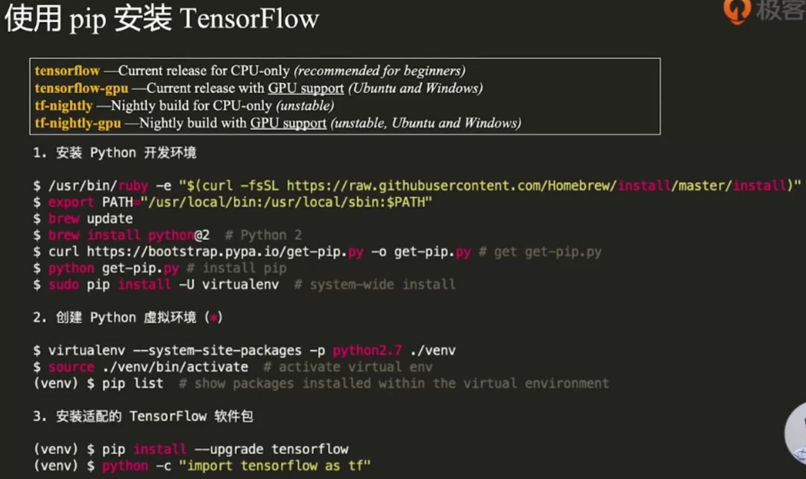
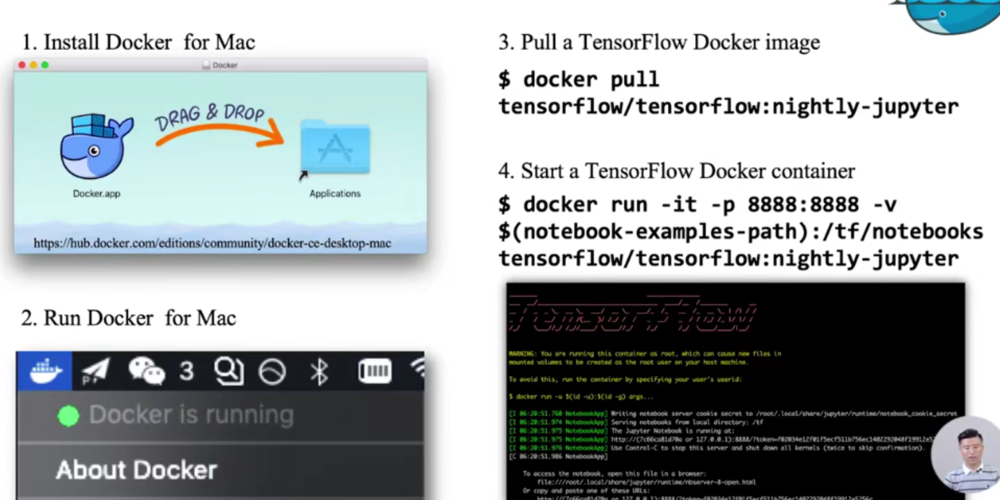

## 环境搭建

python2.7



```python
import tensorflow as tf
hello = tf.constant("Hello TensorFlow")
sess = tf.Session()
print(sess.run(hello))
```

Jupyter Notebook 交互式开发环境

安装：

```python
pip install jupyter
# venv环境
python -m ipykernel install --user --name=venv
```

Docker容器中使用



-it表示交互式，-p端口映射，使得本机端口可以访问容器端口

-v挂载目录，本机目录映射到容器目录

## 安装

**问题**：`keras=2.2.4, tensorflow-gpu==1.15.0`的时候运行代码`model = multi_gpu_model(model, gpus=NUM_GPUS)`，报错：To call `multi_gpu_model` with `gpus=4`, we expect the following devices to be available，详情如图所示：


**尝试**

尝试过安装其他版本的tensorflow，会出现别的问题。

尝试过修改multi_gpu_model函数的源码，将`target_devices = ['/cpu:0'] + ['/gpu:%d' % i for i in target_gpu_ids]`中的`/gpu`改成`/xla_gpu`，还是行不通，虽然不报错，但是训练的时候不会使用GPU。（使用命令nvidia-smi可以看到GPU的使用情况，如果Volatile GPU-Util是0%，说明没用上）

**解决**

用命令`tf.test.is_gpu_available()`运行发现检测不到gpu（输出False），然后看我的cuda版本是10.1，网上的版本对应关系10.1的对应tf版本都是2.0以上的。

查看cuda版本的命令：`nvcc --version`或者`cat /usr/local/cuda/version.txt`

解决安装tensorflow-gpu1.X版本问题只需要在安装tensorflow-gpu之前安装cudatoolkit=10.0的包。先后执行如下命令：

`conda install cudatoolkit=10.0`

`conda install tensorflow-gpu==1.14.0`

然后再运行`tf.test.is_gpu_available()`，返回True，大功告成！

中间参考过的资料：

-   遇到同样问题的github讨论帖[https://github.com/keras-team/keras/issues/11644](https://github.com/keras-team/keras/issues/11644)
-   遇到同样问题的stackoverflow讨论帖：[https://stackoverflow.com/questions/52950449/valueerror-when-using-multi-gpu-model-in-keras/52951437](https://stackoverflow.com/questions/52950449/valueerror-when-using-multi-gpu-model-in-keras/52951437)
-   查看GPU的使用情况：[https://blog.csdn.net/baoyan2015/article/details/78919030](https://blog.csdn.net/baoyan2015/article/details/78919030)
-   在CUDA10.1版本下安装tensorflow-gpu=1.15版本：[https://blog.csdn.net/weixin_43218120/article/details/108447605](https://blog.csdn.net/weixin_43218120/article/details/108447605)
-   CUDA和TensorFlow版本对应关系：[https://tensorflow.google.cn/install/source#linux](https://tensorflow.google.cn/install/source#linux)

## tf-serving

tensorflow-serving的服务，可以自动加载某个路径下的所有模型，模型通过事先定义的输入输出和计算图，直接提供rpc或者rest的服务。

一方面，支持多版本的热部署（比如当前生产环境部署的是1版本的模型，训练完成后生成一个2版本的模型，tensorflow会自动加载这个模型，停掉之前的模型）。

另一方面，tensorflow serving内部通过异步调用的方式，实现高可用，并且自动组织输入以批次调用的方式节省GPU计算资源。

客户端 ----> web服务 --grpc或者rest--> tensorflow serving

性能优化：

[基于TensorFlow Serving的深度学习在线预估](https://tech.meituan.com/2018/10/11/tfserving-improve.html)

[如何将TensorFlow Serving的性能提高超过70%？](https://zhuanlan.zhihu.com/p/60890267)

# tfserving优化

历史模型文件大小：

2019.11.18，pd文件2.7M，变量文件3666M

2021/2/18

1.问题：运行训练代码，报错AttributeError: 'GFile' object has no attribute 'readable'

with tf.gfile.Open(train_data_dir) as f:

pois = pd.read_csv(f, encoding="utf-8", low_memory=False)

解决：去掉encoding="utf-8"即可。

换成Python2运行


max_batch_size { value: 128 }

batch_timeout_micros { value: 0 }

max_enqueued_batches { value: 1000000 }

num_batch_threads { value: 8 }

--enable_batching=true --batching_parameters_file=/config/batching.config--model_config_file_poll_wait_seconds=1

## 参考资料

[tensorflow gfile](https://blog.csdn.net/a373595475/article/details/79693430) 文件操作详解

[https://programtalk.com/python-examples/tensorflow.gfile.Open/](https://programtalk.com/python-examples/tensorflow.gfile.Open/)


一些性能优化文章

[TensorFlow Wide And Deep](https://blog.csdn.net/heyc861221/article/details/80131369) 模型详解与应用

[TensorFlow Wide And Deep](https://blog.csdn.net/heyc861221/article/details/80131373) 模型详解与应用（二）

[TensorFlow](https://xie.infoq.cn/article/decf78f03cfe20ea00b29f20f) 篇| TensorFlow 2.x模型Serving服务（介绍了很多参数，棒~）

[TensorFlow Serving | GPU & Batching](https://anoyi.com/p/c0caa3af68e0) 性能优化篇（batching参数如何设置）

[tensorflow serving batching](http://d0evi1.com/tensorflow/serving/batching/) （batching参数如何设置）

[TensorFlow Serving Batching Guide](https://blog.csdn.net/zhangwl27/article/details/83346758) （官方指南的翻译）

以上基本上都是官方指南的翻译

[使用 JMeter 进行压力测试](https://www.cnblogs.com/stulzq/p/8971531.html)

[Docker](https://www.jianshu.com/p/adaa34795e64) 常用命令与操作

[如何将](https://zhuanlan.zhihu.com/p/60890267) TensorFlow Serving的性能提高超过70%？（国外文章翻译，不太懂）

知乎问答：[https://www.zhihu.com/question/354086469/answer/894235805](https://www.zhihu.com/question/354086469/answer/894235805)

[如何适当减少张量流保存模型的大小？](https://www.thinbug.com/q/51957336)

[基于TensorFlow Serving的深度学习在线预估](https://tech.meituan.com/2018/10/11/tfserving-improve.html) （美团的）

[Tensorflow Serving](https://zhuanlan.zhihu.com/p/113527219) 生产环境部署介绍

[优化用于服务的](https://mp.weixin.qq.com/s/yJ66H7I2uTyuFHsVsi2Cpg) TensorFlow模型

[tensorflow机器学习模型的跨平台上线](https://www.cnblogs.com/pinard/p/9251296.html) （pb文件保存以及java加载全过程）

[分布式](https://blog.codescv.com/dist-tf-for-sparse-models.html) TensorFlow在Sparse模型上的实践（分布式，暂时用不到）

[企业级别的](https://zhuanlan.zhihu.com/p/75946827) tensorflow分布式训练架构总结

[构建并用](https://www.jianshu.com/p/2fffd0e332bc) TensorFlow Serving部署Wide & Deep模型（从零构建模型）

[cpu](https://zhuanlan.zhihu.com/p/86855590) 核心数与线程数（查询cpu核数的命令）

[【](https://zhuanlan.zhihu.com/p/48263982) 0.4】Tensorflow踩坑记之tf.estimator（自己构建网络，然后使用estimator）

[tf.feature_column](https://zhuanlan.zhihu.com/p/73701872) 的特征处理探究（feature_column的各个函数详解）

[推荐系统召回四模型之：全能的](https://zhuanlan.zhihu.com/p/58160982) FM模型

[推荐系统技术演进趋势：从召回到排序再到重排](https://zhuanlan.zhihu.com/p/100019681)


