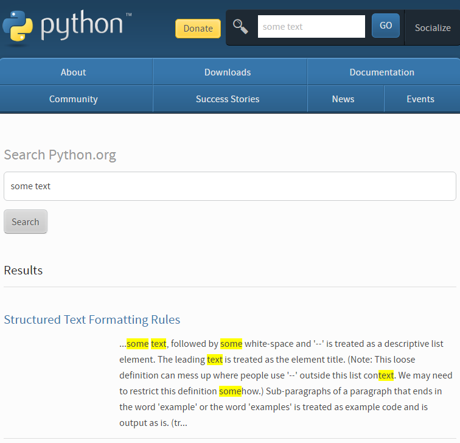
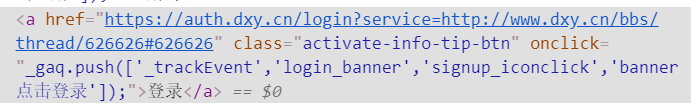
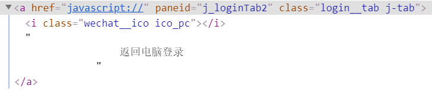
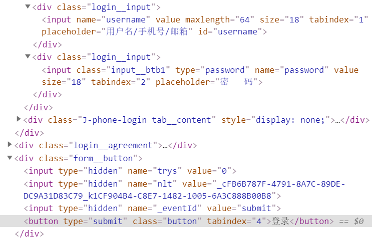
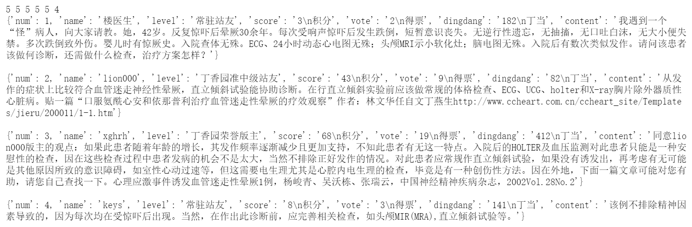
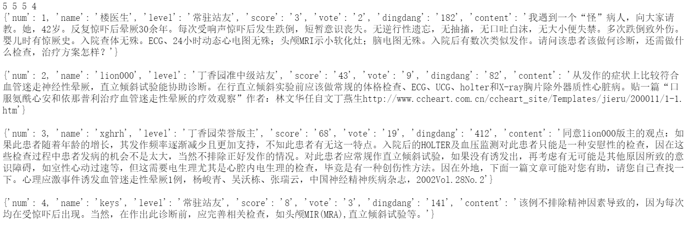

## session和cookie

### 静态网页

- 静态网页是标准的HTML文件，文件扩展名是.htm、.html、.shtml、.xml，直接部署到或者是放到某个 web 容器上，就可以在浏览器通过链接直接访问到了，常用的 web 容器有 Nginx 、 Apache 、 Tomcat 、Weblogic 、 Jboss 、 Resin 等等。
- 举个例子：https://desmonday.github.io/，就是静态网页的代表，这种网页的内容是通过纯粹的 HTML 代码来书写，包括一些资源文件、图片、视频等内容的引入都是使用 HTML 标签来完成的。
- 网页内容一经发布到网站服务器上，无论是否有用户访问，每个静态网页的内容都是保存在网站服务器上的，也就是说，静态网页是实实在在保存在服务器上的文件，每个网页都是一个独立的文件。
- 静态网页的内容相对稳定，因此容易被搜索引擎检索。
- 静态网页没有数据库的支持，在网站制作和维护方面工作量较大，因此当网站信息量很大时完全依靠静态网页制作方式比较困难。
- 静态网页的交互性较差，在功能方面有较大的限制，不能根据参数动态的显示内容等等。
- 页面浏览速度迅速，过程无需连接数据库，开启页面速度快于动态页面。
- 减轻了服务器的负担，工作量减少，也就降低了数据库的成本。


### 动态网页

- 大家常用的某宝、某东、拼夕夕等网站都是由动态网页组成的。
- 当浏览器请求服务器的某个页面时，服务器根据当前时间、环境参数、数据库操作等动态的生成HTML页面，然后再发送给浏览器（后面的处理就跟静态网页一样了）。
- 动态网页中的“动态”是指服务器端页面的动态生成，“静态”则指页面是实实在在的、独立的文件。
- 除了HTML，动态网页还需要用到 JavaScript(Node.js) 、 PHP 、 ASP.NET(或ASP) 、 JSP 、 CGI(早期的动态网页技术) 等技术。
- 动态网页一般以数据库技术为基础，可以大大降低网站维护的工作量；
- 采用动态网页技术的网站可以实现更多的功能，如用户注册、用户登录、在线调查、用户管理、订单管理等等；
- 动态网页实际上并不是独立存在于服务器上的网页文件，只有当用户请求时服务器才返回一个完整的网页；
- 动态网页地址中的“?”对搜索引擎检索存在一定的问题，搜索引擎一般不可能从一个网站的数据库中访问全部网页，或者出于技术方面的考虑，搜索蜘蛛不去抓取网址中“?”后面的内容，因此采用动态网页的网站在进行搜索引擎推广时需要做一定的技术处理才能适应搜索引擎的要求。
- 我们平时使用频率最高的一个功能可能就是登录，像各种电商类网站，肯定是登录了以后才能下单买东西。那么，问题来了，后面的服务端是如何知道当前这个人已经登录了呢？

### http1.0

- HTTP1.0的特点是无状态无链接的
- 
- 无状态就是指 HTTP 协议对于请求的发送处理是没有记忆功能的，也就是说每次 HTTP 请求到达服务端，服务端都不知道当前的客户端（浏览器）到底是一个什么状态。
- 客户端向服务端发送请求后，服务端处理这个请求，然后将内容响应回客户端，完成一次交互，这个过程是完全相互独立的，服务端不会记录前后的状态变化，也就是缺少状态记录。
- 这就产生了一个问题，服务端如何知道当前在浏览器面前操作的这个人是谁？其实，在用户做登录操作的时候，服务端会下发一个类似于 token 凭证的东西返回至客户端（浏览器），有了这个凭证，才能保持登录状态。那么这个凭证是什么？

### session和cookies

- Session 是会话的意思，会话是产生在**服务端**的，用来保存当前用户的会话信息，而 Cookies 是保存在**客户端（浏览器）**，有了 Cookie 以后，客户端（浏览器）再次访问服务端的时候，会将这个 Cookie 带上，这时，服务端可以通过 Cookie 来识别本次请求到底是谁在访问。
- 可以简单理解为 Cookies 中保存了登录凭证，我们只要持有这个凭证，就可以在服务端保持一个登录状态。
- 在爬虫中，有时候遇到需要登录才能访问的网页，只需要在登录后获取了 Cookies ，在下次访问的时候将登录后获取到的 Cookies 放在请求头中，这时，服务端就会认为我们的爬虫是一个正常登录用户。

#### Cookie

Cookie（复数形态：Cookies），是指某些网站为了辨别用户身份、进行session跟踪而储存在用户本地终端上的数据（通常经过加密）。

Cookie是由服务端生成的，发送给客户端（通常是浏览器）的。Cookie总是保存在客户端中，按在客户端中的存储位置，可分为内存Cookie和硬盘Cookie：

-  内存Cookie由浏览器维护，保存在内存中，浏览器关闭后就消失了，其存在时间是短暂的。 
-  硬盘Cookie保存在硬盘里，有一个过期时间，除非用户手工清理或到了过期时间，硬盘Cookie不会被删除，其存在时间是长期的。下次打开浏览器，会再从我们的硬盘中将这个 Cookie 读取出来，用来维持用户的会话状态。所以，按存在时间，可分为非持久Cookie和持久Cookie。 

**工作原理**

Cookies 是如何保持会话状态的呢？

1、创建Cookie

当用户第一次浏览某个使用Cookie的网站时，该网站的服务器就返回一个请求头中带有 `Set-Cookie` 字段的响应给客户端（浏览器），用来标记是哪一个用户：

- ①给用户生成一个唯一的识别码（Cookie id），创建一个Cookie对象；

- ②默认情况下它是一个会话级别的cookie，存储在浏览器的内存中，用户退出浏览器之后被删除。如果网站希望浏览器将该Cookie存储在磁盘上，则需要设置最大时效（maxAge），并给出一个以秒为单位的时间（将最大时效设为0则是命令浏览器删除该Cookie）；

- ③将Cookie放入到HTTP响应报头，将Cookie插入到一个 Set-Cookie HTTP请求报头中。

- ④发送该HTTP响应报文。


2、设置存储Cookie

- 浏览器收到该响应报文之后，根据报文头里的Set-Cookied特殊的指示，生成相应的Cookie，保存在客户端。该Cookie里面记录着用户当前的信息。

我们来使用工具 Postman 来访问下某东的登录页，看下返回的响应头：


3、发送Cookie

- 当用户再次访问该网站时（比如输入好用户名和密码后），浏览器首先检查所有存储的Cookies，如果某个存在该网站的Cookie（即该Cookie所声明的作用范围大于等于将要请求的资源），则把该cookie附在请求资源的HTTP请求头上发送给服务器。

4、读取Cookie

- 服务器接收到用户的HTTP请求报文之后，从报文头获取到该用户的Cookie，从里面找到所需要的东西。
- 这时，服务端就知道是谁在进行登录操作，并且可以判断这个人输入的用户名和密码对不对，如果输入正确，则在服务端的 Session 记录一下这个人已经登录成功了，下次再请求的时候这个人就是登录状态了。
- 如果客户端传给服务端的 Cookies 是无效的，或者这个 Cookies 根本不是由这个服务端下发的，或者这个 Cookies 已经过期了，那么接下里的请求将不再能访问需要登录后才能访问的页面。
- 所以， Session 和 Cookies 之间是需要相互配合的，一个在服务端，一个在客户端。


我们还是打开某东的网站，看下这些 Cookies到底有哪些内容：


(https://cdn.geekdigging.com/python-spider/jd-cookies.png)

具体操作方式还是在 Chrome 中按 F12 打开开发者工具，选择 Application 标签，点开 Cookies 这一栏。

- Name：这个是 Cookie 的名字。一旦创建，该名称便不可更改。
- Value：这个是 Cookie 的值。
- Domain：这个是可以访问该 Cookie 的域名。例如，如果设置为 .jd.com ，则所有以 jd.com 结尾的域名都可以访问该Cookie。 注意第一个字符必须为“.” 。
- Max Age：Cookie 失效的时间，单位为秒，也常和 Expires 一起使用。 Max Age 如果为正数，则在 Max Age 秒之后失效，如果为负数，则关闭浏览器时 Cookie 即失效，浏览器也不会保存该 Cookie 。
- Path：Cookie 的使用路径。如果设置为 /path/ ，则只有路径为 /path/ 的页面可以访问该 Cookie 。如果设置为 / ，则本域名下的所有页面都可以访问该 Cookie 。
- Size：Cookie 的大小。
- HTTPOnly：如果此项打勾，那么通过 JS 脚本将无法读取到 Cookie 信息，这样能有效的防止 XSS 攻击，窃取 Cookie 内容，可以增加 Cookie 的安全性。
- Secure：如果此项打勾，那么这个 Cookie 只能用 HTTPS 协议发送给服务器，用 HTTP 协议是不发送的。


#### session

Session代表服务器与浏览器的一次会话过程，这个过程是连续的，也可以时断时续的。Session是一种服务器端的机制，Session 对象用来存储特定用户会话所需的信息。

Session由服务端生成，保存在服务器的内存、缓存、硬盘或数据库中。

服务端的会话也会无限的维持下去么？当然不会，这就要在 Cookie 和 Session 上做文章了， Cookie 中可以使用加密的方式将用户名记录下来，在下次将 Cookies 读取出来由请求发送到服务端后，服务端悄悄的自己创建一个用户已经登录的会话，这样我们在客户端看起来就好像这个登录会话是一直保持的。

如果说**Cookie机制是通过检查客户身上的“通行证”来确定客户身份的话，那么Session机制就是通过检查服务器上的“客户明细表”来确认客户身份。Session相当于程序在服务器上建立的一份客户档案，客户来访的时候只需要查询客户档案表就可以了。** 

**工作原理**

1、创建Session

当用户访问到一个服务器，如果服务器启用Session，服务器就要为该用户创建一个SESSION，在创建这个SESSION的时候，服务器首先检查这个用户发来的请求里是否包含了一个SESSION ID，如果包含了一个SESSION ID则说明之前该用户已经登陆过并为此用户创建过SESSION，那服务器就按照这个SESSION ID把这个SESSION在服务器的内存中查找出来（如果查找不到，就有可能为他新创建一个），如果客户端请求里不包含有SESSION ID，则为该客户端创建一个SESSION并生成一个与此SESSION相关的SESSION ID。这个SESSION ID是唯一的、不重复的、不容易找到规律的字符串，这个SESSION ID将被在本次响应中返回到客户端保存，而保存这个SESSION ID的正是COOKIE，这样在交互过程中浏览器可以自动的按照规则把这个标识发送给服务器。 

2、传递Session id的方式

第一种通过cookies实现，就是把session id放在cookie里。

第二种通过URL重写实现，在客户端不支持cookie的情况下使用。

一种是把Session id直接附加在URL路径的后面作为URL路径的附加信息,表现形式为： 

http://…./xxx;jSession=ByOK3vjFD75aPnrF7C2HmdnV6QZcEbzWoWiBYEnLerjQ99zWpBng!-145788764； 

另一种是作为查询字符串附加在URL后面，表现形式为： 

http://…../xxx?jSession=ByOK3vjFD75aPnrF7C2HmdnV6QZcEbzWoWiBYEnLerjQ99zWpBng!-145788764 

还有一种就是表单隐藏字段。就是服务器会自动修改表单，添加一个隐藏字段，以便在表单提交时能够把Session id传递回服务器。


#### 一个重要概念

当我们关闭浏览器的时候会自动销毁服务端的会话，这个是错误的，因为在关闭浏览器的时候，浏览器并不会额外的通知服务端说，我要关闭了，你把和我的会话销毁掉吧。

因为服务端的会话是保存在内存中的，虽然一个会话不会很大，但是架不住会话多啊，硬件毕竟是会有限制的，不能无限扩充下去的，所以在服务端设置会话的过期时间就非常有必要。

当然，有没有方式能让浏览器在关闭的时候同步的关闭服务端的会话，当然是可以的，我们可以通过脚本语言 JS 来监听浏览器关闭的动作，当浏览器触发关闭动作的时候，由 JS 像服务端发起一个请求来通知服务端销毁会话。

由于不同的浏览器对 JS 事件的实现机制不一致，不一定保证 JS 能监听到浏览器关闭的动作，所以现在常用的方式还是在服务端自己设置会话的过期时间

### 参考资料

静态网页与动态网页的区别：

 https://www.jianshu.com/p/649d2a0ebde5 

Cookie和Session的作用和工作原理:

 https://blog.csdn.net/guoweimelon/article/details/50886092 

Cookie/Session机制详解：

 https://blog.csdn.net/fangaoxin/article/details/6952954 


## ip代理

### 为什么会出现IP被封

网站为了防止被爬取，会有反爬机制，对于同一个IP地址的大量同类型的访问，会封锁IP，过一段时间后，才能继续访问

### 如何应对IP被封的问题

有几种套路：

1. 修改请求头，模拟浏览器（而不是代码去直接访问）去访问
2. 采用代理IP并轮换
3. 设置访问时间间隔

### 如何获取代理IP地址

- 从该网站获取： https://www.xicidaili.com/
- inspect -> 鼠标定位：
- 要获取的代理IP地址，属于class = "odd"标签的内容：代码如下，获取的代理IP保存在proxy_ip_list列表中

```python
# 案例代码
from bs4 import BeautifulSoup
import requests
import time

def open_proxy_url(url):
    user_agent = 'Mozilla/5.0 (Macintosh; Intel Mac OS X 10_14_2) AppleWebKit/537.36 (KHTML, like Gecko) Chrome/72.0.3626.119 Safari/537.36'
    headers = {'User-Agent': user_agent}
    try:
        r = requests.get(url, headers = headers, timeout = 20)
        r.raise_for_status()
        r.encoding = r.apparent_encoding
        return(r.text)
    except:
        print('无法访问网页' + url)


def get_proxy_ip(response):
    proxy_ip_list = []
    soup = BeautifulSoup(response, 'html.parser')
    proxy_ips = soup.find(id = 'ip_list').find_all('tr')
    for proxy_ip in proxy_ips:
        if len(proxy_ip.select('td')) >=8:   # 去掉干扰项
            ip = proxy_ip.select('td')[1].text
            port = proxy_ip.select('td')[2].text
            protocol = proxy_ip.select('td')[5].text
            if protocol in ('HTTP','HTTPS','http','https'):
                # f-string字符串格式方法
                proxy_ip_list.append(f'{protocol}://{ip}:{port}')
    return proxy_ip_list

if __name__ == '__main__':
    proxy_url = 'https://www.xicidaili.com/'
    text = open_proxy_url(proxy_url)
    proxy_ip_filename = 'proxy_ip.txt'
    with open(proxy_ip_filename, 'w') as f:
        f.write(text)
    text = open(proxy_ip_filename, 'r').read()
    proxy_ip_list = get_proxy_ip(text)
    print(len(proxy_ip_list))
    print(proxy_ip_list)
```

输出;


### 使用代理

- proxies的格式是一个字典：
- {‘http’: ‘http://IP:port‘,‘https’:'https://IP:port‘}](http://xn--ip:port%2Chttps:'https-mc9nd6a//IP:port‘})
- 把它直接传入requests的get方法中即可
- web_data = requests.get(url, headers=headers, proxies=proxies)

```python
def open_url_using_proxy(url, proxy):
    user_agent = 'Mozilla/5.0 (Macintosh; Intel Mac OS X 10_14_2) AppleWebKit/537.36 (KHTML, like Gecko) Chrome/72.0.3626.119 Safari/537.36'
    headers = {'User-Agent': user_agent}
    proxies = {}
    if proxy.startswith(('HTTPS','https')):
        proxies['https'] = proxy
    else:
        proxies['http'] = proxy
        
    try:
        r = requests.get(url, headers = headers, proxies = proxies, timeout = 10)
        r.raise_for_status()
        r.encoding = r.apparent_encoding
        return (r.text, r.status_code)
    except:
        print('无法访问网页' + url)
        print('无效代理IP: ' + proxy)
        return False
url = 'http://www.baidu.com'
text = open_url_using_proxy(url, proxy_ip_list[0])
```

我试了一下，用了代理会输出'无法访问网页'，不用代理反倒能获取到网页文本。。。

### 确认代理IP地址有效性

- 无论是免费还是收费的代理网站，提供的代理IP都未必有效，我们应该验证一下，有效后，再放入我们的代理IP池中，以下通过几种方式：访问网站，得到的返回码是200真正的访问某些网站，获取title等，验证title与预计的相同访问某些可以提供被访问IP的网站，类似于“查询我的IP”的网站，查看返回的IP地址是什么验证返回码

```python
def check_proxy_avaliability(proxy):
    url = 'http://www.baidu.com'
    result = open_url_using_proxy(url, proxy)
    VALID_PROXY = False
    if result:
        text, status_code = result
        if status_code == 200:
            r_title = re.findall('<title>.*</title>', text)
            if r_title:
                if r_title[0] == '<title>百度一下，你就知道</title>':
                    VALID_PROXY = True
        if VALID_PROXY:
            check_ip_url = 'https://jsonip.com/'
            try:
                text, status_code = open_url_using_proxy(check_ip_url, proxy)
            except:
                return

            print('有效代理IP: ' + proxy)
            with open('valid_proxy_ip.txt','a') as f:
                f.writelines(proxy)
            try:
                source_ip = json.loads(text).get('ip')
                print(f'源IP地址为：{source_ip}')
                print('='*40)
            except:
                print('返回的非json,无法解析')
                print(text)
    else:
        print('无效代理IP: ' + proxy)
        
if __name__ == '__main__':
    proxy_url = 'https://www.xicidaili.com/'
    proxy_ip_filename = 'proxy_ip.txt'
    text = open(proxy_ip_filename, 'r').read()
    proxy_ip_list = get_proxy_ip(text)
    for proxy in proxy_ip_list:
        check_proxy_avaliability(proxy)
```

### 关于http和https代理

- 可以看到proxies中有两个键值对：
- {‘http’: ‘http://IP:port’, ‘https’:‘https://IP:port’}
- 其中 HTTP 代理，只代理 HTTP 网站，对于 HTTPS 的网站不起作用，也就是说，用的是本机 IP，反之亦然。
- 刚才使用的验证的网站是[https://jsonip.com](https://jsonip.com/), 是HTTPS网站所以探测到的有效代理中，如果是https代理，则返回的是代理地址
- 如果是http代理，将使用本机IP进行访问，返回的是公网IP地址

### QA

**Q1: 怎么在ip被封之后实现自动更换代理池内的代理？**

A1: 用random.choice 随机选取ip

**Q2: 构建好代理池后，如何在一次爬虫中自动切换代理？ 比如代理无效，或者代理ip被封，这时自动切换下一个ip。**

A2: 首先你要有一个ip代理池（如果比较豪可以自己买真实ip自行搭建，好处独享有技术门槛,或者找第三方ip代理商对接,好吃廉价,但ip不独享）， 真实ip需要自己写程序来代理转发，第三方ip代理商则会提供相关转发API,直接调用就可以，这东西没什么技术难度


### selenium

之前也写过一篇简单的使用：[Python爬虫之selenium]( https://mp.weixin.qq.com/s/3a2PA0VJvP0bvpSFEY1mDw )

这次整合一下新学习到的内容~

- selenium是什么：一个自动化测试工具（大家都是这么说的）
- selenium应用场景：用代码的方式去模拟浏览器操作过程（如：打开浏览器、在输入框里输入文字、回车等），在爬虫方面很有必要
- 准备工作：
  - 安装selenium（pip install selenium）
  - 安装chromedriver（一个驱动程序，用以启动chrome浏览器，具体的驱动程序需要对应的驱动，在官网上可以找到下载地址） 
  -  https://sites.google.com/a/chromium.org/chromedriver/downloads 
  - 某宝的镜像：http://npm.taobao.org/mirrors/chromedriver/
  - chromedriver与chrome版本映射表参照： http://blog.csdn.net/huilan_same/article/details/51896672 
  -  可以将chromedriver配置在环境变量中，或者放在某个目录下。 

使用selenium的作用：

> 为什么要采用selenium来模拟登陆网页。最主要的原因我认为还是在于通过这种模拟登录方式获取的页面html代码，可以把js里的内容也获取到，而通过urllib方式模拟登录的方式虽然也可以伪装成浏览器的形式获取页面html代码，但是这里面的js，css代码是没有的，也就是没有动态的内容，达不到全面抓取数据的目的；当然除了selenium这种方式外，还有其他的途径也能获取到js等动态代码。
> https://blog.csdn.net/lukaishilong/article/details/51888765

但是selenium调用浏览器时，跟我们手动打开浏览器效果一样，从开启到加载完毕，要耗费好几秒时间，加载不完就不能继续后面的操作；​如果要循环执行的话，这个方法的效率就很低。

### 基本使用

- driver = webdriver.Chrome() 打开Chrome浏览器
- driver = webdriver.Firefox() 打开Firefox浏览器
- driver = webdriver.Ie() 打开IE浏览器
-  print(driver.title)  获取当前页面的title，比如 百度首页的标题是“百度一下，你就知道” 
-  driver.back()   相当于点击了浏览器的后退按钮
- driver.forward()   相当于点击了浏览器的前进按钮
-  driver.maximize_window()将浏览器最大化 
-  driver.set_window_size(800, 720) //设置窗口大小为800\*720
-  driver.get_screenshot_as_file("D:/data/test.png")  屏幕截图保存为xx
-  driver.refresh() 重新加载页面,页面刷新 
-  driver.close() 关闭当前页面
- driver.quit() 关闭所有由当前测试脚本打开的页面

1、导入模块：

```python
from selenium import webdriver  # 启动浏览器需要用到
from selenium.webdriver.common.keys import Keys  # 提供键盘按键支持（最后一个K要大写）
```

2、创建一个WebDriver实例，比如我的驱动器放在上级目录中：

```python
# chromedriver.exe的所在目录
driver = webdriver.Chrome("../chromedriver.exe")
```

运行上述代码后会打开谷歌浏览器

3、打开一个页面:

```python
driver.get("http://www.python.org")  
```

这个时候chromedriver会打开一个Chrome浏览器窗口，显示的是网址所对应的页面

4、关闭页面

```python
driver.close()  # 关闭浏览器一个Tab
# 或者
# driver.quit()  # 关闭浏览器窗口
```


### 高级-查找元素

在打开页面和关闭页面中间，就是各种操作！而查找元素这一点，和爬虫常见的HTML页面解析，定位到具体的某个元素基本一样，只不过，调用者是driver

- id定位：find_element_by_id(self, id_)，如browser.find_element_by_id('kw')
- name定位：find_element_by_name(self, name)
- class定位：find_element_by_class_name(self, name)
- tag定位：find_element_by_tag_name(self, name)
- link定位：find_element_by_link_text(self, link_text)
- partial_link定位(部分文本定位) find_element_by_partial_link_text(self, link_text)
- xpath定位：find_element_by_xpath(self, xpath)
- css定位：find_element_by_css_selector(self, css_selector） 

上述方法也有对应的find_elements方法，表示一次查找多个元素（返回一个list）

 比如想要寻找下列HTML代码对应的位置： 

```html
<input type="text" name="passwd" id="passwd-id" />
```

 可以用下列代码查找（选择其中一种即可） 

```python
element = driver.find_element_by_id("passwd-id")
element = driver.find_element_by_name("passwd")
element = driver.find_element_by_tag_name("input")
element = driver.find_element_by_xpath("//input[@id='passwd-id']")
```


### 高级-页面交互

- 找到元素后，就是进行“交互”，如:（需提前导入模块）
- clear 清除元素的内容
- send_keys 模拟按键输入
- click 点击元素
- submit 提交表单


```python
driver = webdriver.Chrome("../chromedriver.exe")
driver.get("http://www.python.org")  
element = driver.find_element_by_name("q")  

element.send_keys("some text")  # 往一个可以输入对象中输入“some text”
```


文本框中出现了"some text"。

```python
element.send_keys(Keys.RETURN)  # 模拟键盘回车
```



输出了查询结果。

```python
element = driver.find_element_by_name("q")  
#一般来说，这种方式输入后会一直存在，而要清空某个文本框中的文字，就需要：
element.clear()  # 清空element对象中的文字
```


文本框的内容被清空了。

如果鼠标点击的是类似于“保存为Excel文件”的按钮，click()执行之后就会自动下载文件，保存到默认目录（可以更改目录）。如果文件下载过多，需要对每一个文件命名，但是selenium似乎不提供这种功能（网上没找到相关资源），可以用下载后通过识别最新下载的文件然后进行重命名的方法对每一个文件命名。

```python
import os

driver.find_element_by_xpath("//a[@href='javascript:saveExcel();']").click()

# 最新创建的文件
filename = max([filepath + '\\' + f for f in os.listdir(filepath)], key=os.path.getctime)
# 重命名
os.rename(os.path.join(filepath, filename), os.path.join(filepath, newfilename))
```


### 高级-等待页面加载（wait）

- 应用场景：含有ajax加载的page！因为在这种情况下，页面内的某个节点并不是在一开始就出现了，而在这种情况下，就不能“查找元素”，元素选择不到，就不好进行交互操作！等待页面加载这两个模块经常是一起导入的：

```python
from selenium import webdriver
from selenium.webdriver.common.by import By
from selenium.webdriver.support import expected_conditions as EC
#from selenium.webdriver.support.wait import WebDriverWait
from selenium.webdriver.support.ui import WebDriverWait
```

- 隐式等待：设置某个具体的等待时间

```python
base_url = "http://www.baidu.com"
driver = webdriver.Chrome("../chromedriver.exe")
driver.implicitly_wait(10) # seconds
driver.get(base_url)
```

- 显示等待：触发某个条件后才能够执行后续的代码

```python
base_url = "http://www.baidu.com"
driver = webdriver.Chrome("../chromedriver.exe")
driver.get(base_url)
try:    
    element = WebDriverWait(driver, 10).until(           
        EC.presence_of_element_located((By.ID, "myDynamicElement")))
finally:    
    driver.quit()
#其中，presence_of_element_located是条件，By.ID是通过什么方式来确认元素（这个是通过id），"myDynamicElement"这个就是某个元素的ID
```

隐式等待和显示等待都存在时，超时时间取二者中较大的。

还可以有其他的条件：

```python
WebDriverWait(driver,10).until(EC.title_is(u"百度一下，你就知道"))
'''判断title,返回布尔值'''

WebDriverWait(driver,10).until(EC.title_contains(u"百度一下"))
'''判断title，返回布尔值'''

WebDriverWait(driver,10).until(EC.presence_of_element_located((By.ID,'kw')))
'''判断某个元素是否被加到了dom树里，并不代表该元素一定可见，如果定位到就返回WebElement'''

WebDriverWait(driver,10).until(EC.visibility_of_element_located((By.ID,'su')))
'''判断某个元素是否被添加到了dom里并且可见，可见代表元素可显示且宽和高都大于0'''

WebDriverWait(driver,10).until(EC.visibility_of(driver.find_element(by=By.ID,value='kw')))
'''判断元素是否可见，如果可见就返回这个元素'''

WebDriverWait(driver,10).until(EC.presence_of_all_elements_located((By.CSS_SELECTOR,'.mnav')))
'''判断是否至少有1个元素存在于dom树中，如果定位到就返回列表'''

WebDriverWait(driver,10).until(EC.visibility_of_any_elements_located((By.CSS_SELECTOR,'.mnav')))
'''判断是否至少有一个元素在页面中可见，如果定位到就返回列表'''

WebDriverWait(driver,10).until(EC.text_to_be_present_in_element((By.XPATH,'//*[@id="s-usersetting-top"]'),u'设置'))
'''判断指定的元素中是否包含了预期的字符串，返回布尔值'''

WebDriverWait(driver,10).until(EC.text_to_be_present_in_element_value((By.CSS_SELECTOR,'#su'),u'百度一下'))
'''判断指定元素的属性值中是否包含了预期的字符串，返回布尔值'''

WebDriverWait(driver,10).until(EC.frame_to_be_available_and_switch_to_it((By.ID,'kw')))
'''判断该frame是否可以switch进去，如果可以的话，返回True并且switch进去，否则返回False'''
#注意这里并没有一个frame可以切换进去

WebDriverWait(driver,10).until(EC.invisibility_of_element_located((By.CSS_SELECTOR,'#swfEveryCookieWrap')))
'''判断某个元素在是否存在于dom或不可见,如果可见返回True,不可见返回这个元素'''
#注意#swfEveryCookieWrap在此页面中是一个隐藏的元素

WebDriverWait(driver,10).until(EC.element_to_be_clickable((By.XPATH,"//*[@id='u1']/a[8]"))).click()
'''判断某个元素中是否可见并且是enable的，代表可点击'''

driver.find_element_by_xpath("//*[@id='wrapper']/div[6]/a[1]")
#WebDriverWait(driver,10).until(EC.element_to_be_clickable((By.XPATH,"//*[@id='wrapper']/div[6]/a[1]"))).click()

#WebDriverWait(driver,10).until(EC.staleness_of(driver.find_element(By.ID,'su')))
'''等待某个元素从dom树中移除'''
#这里没有找到合适的例子

WebDriverWait(driver,10).until(EC.element_to_be_selected(driver.find_element(By.XPATH,"//*[@id='nr']/option[1]")))
'''判断某个元素是否被选中了,一般用在下拉列表'''

WebDriverWait(driver,10).until(EC.element_selection_state_to_be(driver.find_element(By.XPATH,"//*[@id='nr']/option[1]"),True))
'''判断某个元素的选中状态是否符合预期'''

WebDriverWait(driver,10).until(EC.element_located_selection_state_to_be((By.XPATH,"//*[@id='nr']/option[1]"),True))
'''判断某个元素的选中状态是否符合预期'''
driver.find_element_by_xpath(".//*[@id='gxszButton']/a[1]").click()

instance = WebDriverWait(driver,10).until(EC.alert_is_present())
'''判断页面上是否存在alert,如果有就切换到alert并返回alert的内容'''
print(instance.text)
instance.accept()
driver.close()
```


### 实战案例：模拟登录163

```python
import time

from selenium import webdriver
from selenium.webdriver.common.by import By


"""
使用selenium进行模拟登陆
1.初始化ChromDriver
2.打开163登陆页面
3.找到用户名的输入框，输入用户名
4.找到密码框，输入密码
5.提交用户信息
"""
name = '*'
passwd = '*'
driver = webdriver.Chrome('../chromedriver.exe')
driver.get('https://mail.163.com/')
# 将窗口调整最大
driver.maximize_window()
# 休息5s
time.sleep(5)
# driver.current_window_handle 获取当前窗口handle
# driver.window_handles 获取所有窗口的handle，返回list列表
# driver.switch_to.window(handle) 切换到对应的窗口
current_window_1 = driver.current_window_handle
print(current_window_1)

# 默认是手机扫码登录，我们需要切换到密码登录
button = driver.find_element_by_id('lbNormal')
button.click()

# 切换到表单
# 有时候定位不到页面元素往往是因为frame，需要切到对应的frame才能定位到
# driver.switch_to.default_content()是切换回主文档
driver.switch_to.frame(driver.find_element_by_xpath("//iframe[starts-with(@id, 'x-URS-iframe')]"))

# 输入邮箱和密码
email = driver.find_element_by_name('email')
#email = driver.find_element_by_xpath('//input[@name="email"]')
email.send_keys(name)
password = driver.find_element_by_name('password')
#password = driver.find_element_by_xpath("//input[@name='password']")
password.send_keys(passwd)
# 点击登录
submit = driver.find_element_by_id("dologin")
time.sleep(15)
submit.click()
time.sleep(10)
# 获取页面源码
print(driver.page_source)
driver.quit()
```


**Q: 如何用一句通俗的语言解释清楚request、beautifulsoup和selenium三者与浏览器之间的关系？**

A: 

BeautifulSoup：处理速度快，同时可以**连续**查找，主要**用于静态网页**。经过BeautifulSoup处理以后，编码方式都变成了Unicode,需要将其变成所需的编码方式：可以利用encode(‘需要的编码’)，还可以利用 BeautifulSoup(网页/html, lxml/xml”).prettify(‘需要的编码’) 可以利用soup.original_encoding检测原来的编码。 

Selenium：主要用于**动态网页**，查找速度慢 


### 小项目

1. 挑战项目：模拟登录丁香园，并抓取论坛页面所有的人员基本信息与回复帖子内容。
2. 丁香园论坛：http://www.dxy.cn/bbs/thread/626626#626626 。

```python
import requests, json, re, random,time
from bs4 import BeautifulSoup
from selenium import webdriver
from lxml import etree
```

配置好参数，打开浏览器

```python
url = "http://www.dxy.cn/bbs/thread/626626#626626"
username = '你的用户名'
password = '你的密码'
driver = webdriver.Chrome('../chromedriver.exe')
driver.get(url)
```

点击登录按钮



```python
time.sleep(5)
# 点击“登录”的两种方式
# driver.find_element_by_class_name('activate-info-tip-btn').click()
driver.find_element_by_link_text('登录').click()
```

选择电脑登录



```python
time.sleep(5)
# 点击“电脑登录”
# driver.find_element_by_class_name('ico_pc').click()
driver.find_element_by_xpath('//a/i[@class="wechat__ico ico_pc"]').click()
```

输入账号密码登录



```python
time.sleep(5)
# 输入账号
element = driver.find_element_by_name('username')
element.clear()
element.send_keys(username)
time.sleep(5)
# 输入密码
element = driver.find_element_by_name('password')
element.clear()
element.send_keys(password)
time.sleep(5)
# 点击“登录按钮”
driver.find_element_by_class_name('button').click()
# 登录后需要点击文字验证，手动操作。。。
time.sleep(10)
```

获取需要的信息方法一，使用xpath定位：

```python
auth = driver.find_elements_by_class_name('auth')  # 昵称
level = driver.find_elements_by_xpath('//div[@class="info clearfix"]') # 等级
user_atten1 = driver.find_elements_by_xpath('//div[@class="user_atten"]/ul/li[1]')  # 用户属性1
user_atten2 = driver.find_elements_by_xpath('//div[@class="user_atten"]/ul/li[2]')  # 用户属性2
user_atten3 = driver.find_elements_by_xpath('//div[@class="user_atten"]/ul/li[3]')  # 用户属性3
content = driver.find_elements_by_class_name('postbody')   # 内容
print(len(auth), len(level), len(user_atten1), len(user_atten2), len(user_atten3), len(content))
for i in range(len(content)):
    data = str({'num':i+1,'name':auth[i].text,'level':level[i].text,'score':user_atten1[i].text,'vote':user_atten2[i].text,'dingdang':user_atten3[i].text,'content':content[i].text.replace(" ", "").replace("\n", "")}) +"\n" 
    print(data)
```

输出结果：



发现有换行符没有去掉

方法二使用class name定位

```python
auth = driver.find_elements_by_class_name('auth')  # 昵称
level = driver.find_elements_by_class_name('info') # 等级
user_atten = driver.find_elements_by_class_name('user_atten')  # 用户属性
content = driver.find_elements_by_class_name('postbody')   # 内容
sfile = open('data.txt','a',encoding='utf-8')
print(len(auth), len(level), len(user_atten), len(content))
for i in range(len(content)):
    num = user_atten[i].find_elements_by_tag_name('a')
    data = str({'num':i+1,'name':auth[i].text,'level':level[i].text,'score':num[0].text,'vote':num[2].text,'dingdang':num[4].text,'content':content[i].text.replace(" ", "").replace("\n", "")}) +"\n" 
    print(data)
    sfile.writelines(data)
print("success write")
sfile.close()
```



**还有另一种方法，基础流程差不多，但利用了js的知识切换登录界面，获取数据时也是先将页面转成html，在利用xpath提取。**

```python
class getUrl(object):
	"""docstring for getUrl"""
	def __init__(self):
		self.headers={
            "Connection": "keep-alive",
            "User-Agent": "Mozilla/5.0 (Windows NT 10.0; WOW64) AppleWebKit/537.36 "  
                          "(KHTML, like Gecko) Chrome/51.0.2704.63 Safari/537.36",
            "Accept": "text/html,application/xhtml+xml,application/xml;q=0.9,image/webp,*/*;q=0.8",
            "Accept-Encoding": "gzip, deflate, sdch",
            "Accept-Language": "zh-CN,zh;q=0.8"
        };

	def run(self):
		browser = webdriver.Chrome('../chromedriver.exe')
		browser.get('https://auth.dxy.cn/accounts/login?service=http://www.dxy.cn/bbs/index.html')
		time.sleep(1)
		#切换账号密码登录表单
        # 利用style将扫码登录的display值变为none，电脑登录的display值变为block，可以手动切换两种登录方式查看display值的变化
        # none是将元素隐藏，block是将元素显示为块状元素
		js1 = 'document.querySelector("#j_loginTab1").style.display="none";'
		browser.execute_script(js1)
		time.sleep(1)
		js2 = 'document.querySelector("#j_loginTab2").style.display="block";'
		browser.execute_script(js2)
		#输入账号密码
		input_name = browser.find_element_by_name('username')
		input_name.clear()
		input_name.send_keys('*')# 这里为自己账号和密码
		input_pass = browser.find_element_by_name('password')
		input_pass.clear()
		input_pass.send_keys('*')
		browser.find_element_by_xpath('//*[@class="form__button"]/button').click()
		#此步骤应该有验证码，先跳过
		time.sleep(10)
		cookie = browser.get_cookies()
		cookie_dict = {i['name']:i['value'] for i in cookie}
		#转到抓取页面
		browser.get("http://www.dxy.cn/bbs/thread/626626#626626");
		html = browser.page_source
		tree = etree.HTML(html)
		user = tree.xpath('//div[@id="postcontainer"]//div[@class="auth"]/a/text()')
		content = tree.xpath('//td[@class="postbody"]')
		for i in range(0,len(user)):
			result = user[i].strip()+":"+content[i].xpath('string(.)').strip()
			#写入文件
			dir_file = open("DXY_records.txt",'a', encoding="utf-8")
			dir_file.write(result+"\n")
			dir_file.write('*' * 80+"\n")
			dir_file.close()
		print('*' * 5 +"抓取结束"+'*' * 5)


if __name__ == '__main__':
	geturl = getUrl()
	geturl.run()
```


### 参考资料

[1]学习资料：

https://github.com/datawhalechina/team-learning/tree/master/Python爬虫编程实践

[2]用python操作浏览器的三种方式：

https://blog.csdn.net/chengxuyuanyonghu/article/details/79154468

[3]python selenium2 中的显示等待WebDriverWait与条件判断expected_conditions举例

https://www.cnblogs.com/yuuwee/p/6635652.html

[4]模拟登录丁香园

https://blog.csdn.net/devcy/article/details/89290823

https://blog.csdn.net/weixin_44615857/article/details/89289150