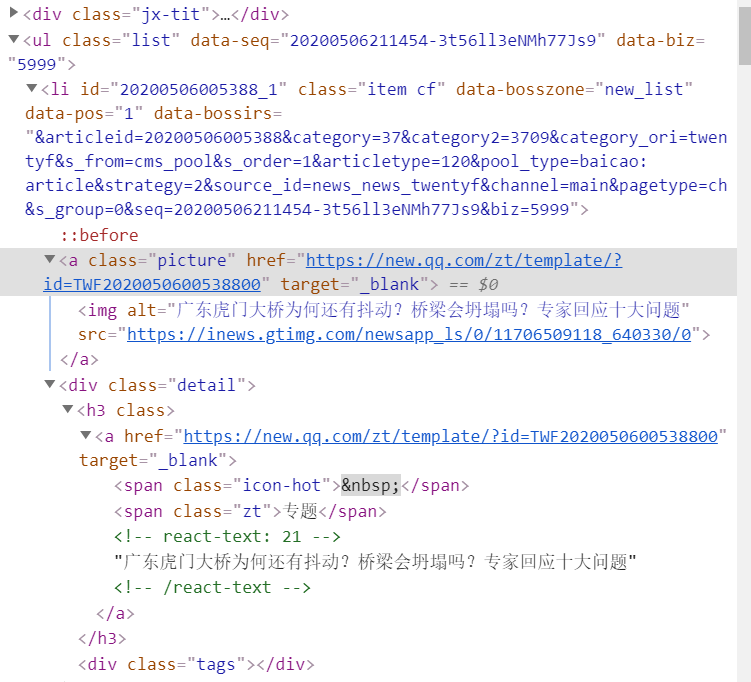
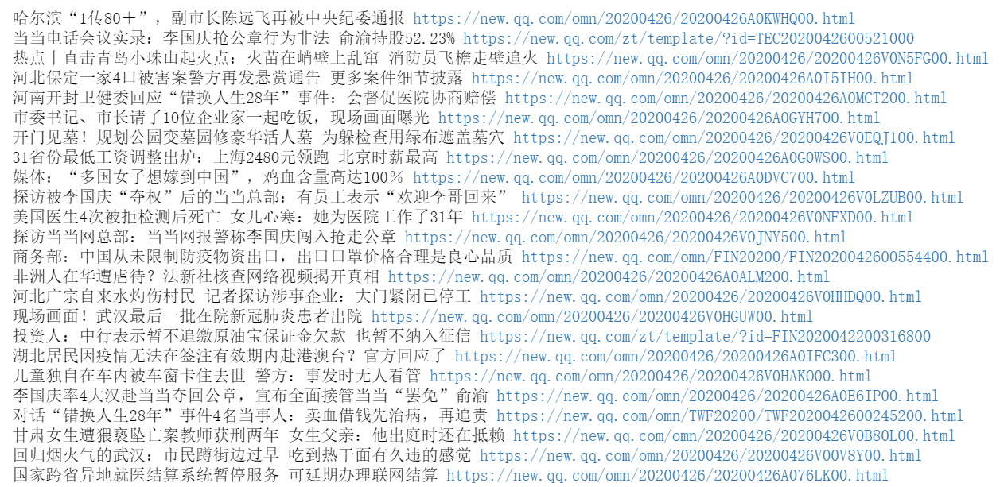

### 爬取腾讯新闻

1. 了解ajax加载

2. 通过chrome的开发者工具，监控网络请求，并分析

3. 用selenium完成爬虫

4. 具体流程如下：

   用selenium爬取https://news.qq.com/ 的热点精选

   热点精选至少爬50个出来，存储成csv 每一行如下 标号（从1开始）,标题,链接,...（前三个为必做，后面内容可以自己加）


导入需要用到的包

```python
import time
from  selenium import webdriver
from bs4 import BeautifulSoup
from lxml import etree
driver = webdriver.Chrome("../chromedriver.exe")
driver.get("https://news.qq.com/")  
# driver.maximize_window()  # 窗口最大化
```

使页面向下滑动，以便获取足够多的数据

```python
time.sleep(5)

# 向下滚动1000像素
js = "window.scrollBy(0, 1000)"
# 滚动到当前页面底部，这两个试过，没有用
# js = "window.scrollTo(0,document.body.scrollHeight)" 
# js = "document.documentElement.scrollTop=500000"
# 方法一
for i in range(10):
    driver.execute_script(js)
    time.sleep(3)

# 方法二
for i in range(1,100):
    time.sleep(2)
    # scrollTo(xpos,ypos)把内容滚动到指定的坐标
    # 要在窗口文档显示区左上角显示的文档的 x，y 坐标。
    driver.execute_script("window.scrollTo(window.scrollX, %d);"%(i*200))
    
html = driver.page_source
```

开始爬取数据，先看看网页结构：



每条新闻都对应着一个li标签，要获取新闻标题和链接有两种方式，一种是通过li标签下的第一个a标签中的img/alt获取标题，href获取链接；第二种方法是通过li标签下的class为detail的div标签下面的a标签获取。

第一种方法，用bs4来查找标签：

```python
bsObj=BeautifulSoup(html,"html5lib")
# 先找到所有li标签的内容，注意find_all返回的是list类型的数据，所以需要取第一个
jxtits=bsObj.find_all("div",{"class":"jx-tit"})[0].find_next_sibling().find_all("li")
print("index",",","title",",","url")
for i,jxtit in enumerate(jxtits):
    try:
        # 通过第一个img标签的alt获取标题
        text=jxtit.find_all("img")[0]["alt"]
    except:
        # 在网页中看不到这个div标签，但是输出bsObj可以看到lazyload-placeholder
        text=jxtit.find_all("div",{"class":"lazyload-placeholder"})[0].text
    try:
        # 通过第一个a标签的href获取链接
        url=jxtit.find_all("a")[0]["href"]
    except:
        print(jxtit)
    print(i+1,",",text,",",url) 
```

第二种方法，用xpath来查找标签：

```python
tree = etree.HTML(html)
# 试过用//li[@class="item cf"]/a[@class="picture"]/@href以及
# //li[@class="item cf"]/a[@class="picture"]/img/@alt
# 效果不好，获取到的数据长度不一致
lis = tree.xpath('//li[@class="item cf"]/div[@class="detail"]/h3/a')
link = tree.xpath('//li[@class="item cf"]/div[@class="detail"]/h3/a/@href')
title = tree.xpath('//li[@class="item cf"]/div[@class="detail"]/h3/a/text()')
print(len(lis))
print(len(link))
print(len(title))
# 这三个长度一致的时候再进行下一步
# 输出结果
for i in range(len(lis)):
    print(title[i], link[i])
```



写入csv

```python
import csv

# windows下如果不加newline=''会有空行
# 如果不加encoding用vscode打开会乱码，如果是encoding='utf-8'用excel打开会乱码，只有用encoding='utf-8-sig'两者打开都不会乱码
with open('test.csv','w',newline='',encoding='utf-8-sig')as f:
    f_csv = csv.writer(f)
    f_csv.writerow(['index', 'title', 'url'])
    # 或者用f_csv.writerows([[数据1], [数据2], ...])一次性写入
    for i in range(len(lis)):
        f_csv.writerow([i+1, title[i], link[i]])
```


### 参考资料

使用selenium获取ajax加载的页面信息

https://blog.csdn.net/weixin_43182689/article/details/88842715

看这一篇就够了！-Ajax详解

https://blog.csdn.net/Oriental_/article/details/104863762

selenium_对浏览器操作、鼠标操作等总结

https://www.jianshu.com/p/7a4414082ce2


### 知乎爬虫

链接如下

https://www.zhihu.com/search?q=Datawhale&utm_content=search_history&type=content

用requests库实现，不能用selenium网页自动化


参考资料

nodejs入门--node的下载与安装

https://blog.csdn.net/adisonW/article/details/95475229

