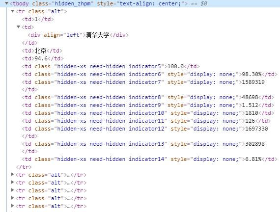
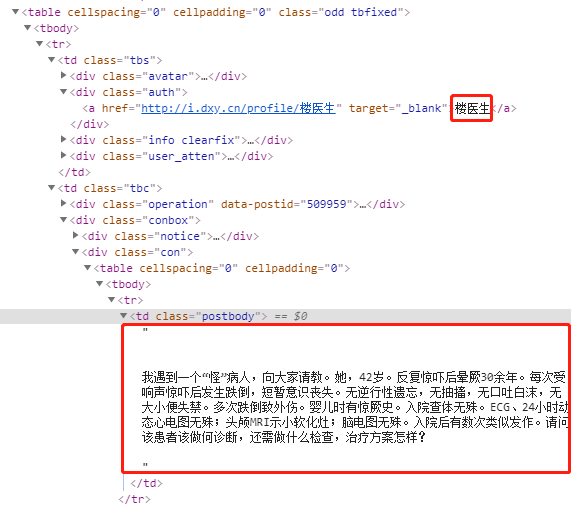
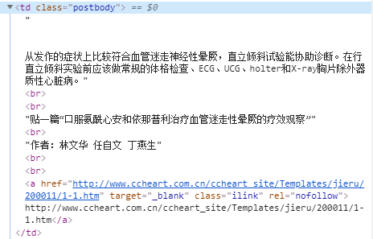
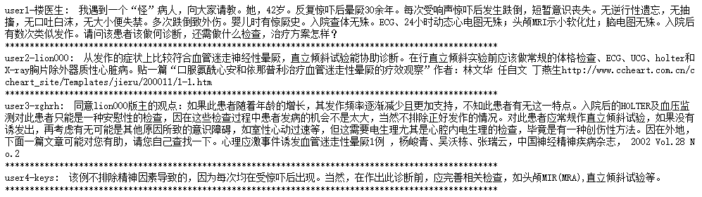
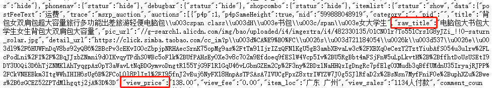
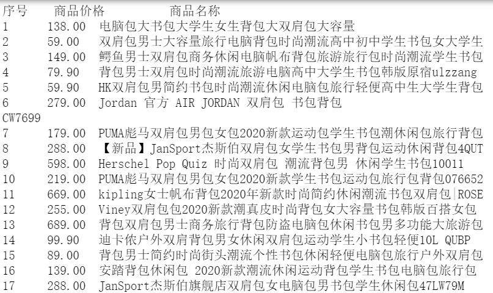

## Beautiful Soup

### 基本介绍

- Beautiful Soup 是一个HTML/XML 的解析器，主要用于解析和提取 HTML/XML 数据。
- 它是基于HTML DOM 的，会载入整个文档，解析整个DOM树，因此时间和内存开销都会大很多，所以性能要低于lxml(xpath)，lxml只会进行局部遍历。
- BeautifulSoup 用来解析 HTML 比较简单，API非常人性化，支持CSS选择器、Python标准库中的HTML解析器，也支持 lxml 的 XML解析器。
- 虽然说BeautifulSoup4 简单比较容易上手，但是匹配效率还是远远不如正则以及xpath的，一般不推荐使用，推荐正则的使用。

### 安装使用beautiful soup

1. 安装：pip install beautifulsoup4 
2. 在代码中导入： from bs4 import BeautifulSoup 
3. 创建 Beautiful Soup对象 soup = BeautifulSoup(html，'html.parser') 

这里html是被解析的文档，'html.parser'是文档解析器。

- 要解析的文档类型，目前支持： “html”, “xml”, 和 “html5”
- 指定的解析器，目前支持：“lxml”, “html5lib”, 和 “html.parser”

如果仅仅想要解析HTML文档,只要用文档创建 `BeautifulSoup` 对象就可以了.Beautiful Soup会自动选择一个解析器来解析文档 ,解析器的优先顺序: lxml, html5lib . 

下表列出了主要的解析器,以及它们的优缺点: 

| 解析器           | 使用方法                                                     | 优势                                                      | 劣势                                          |
| ---------------- | ------------------------------------------------------------ | --------------------------------------------------------- | --------------------------------------------- |
| Python标准库     | `BeautifulSoup(markup, "html.parser")`                       | Python的内置标准库，执行速度适中，文档容错能力强          | Python 2.7.3 or 3.2.2前的版本中文档容错能力差 |
| lxml HTML 解析器 | `BeautifulSoup(markup, "lxml")`                              | 速度快，文档容错能力强                                    | 需要安装C语言库                               |
| lxml XML 解析器  | `BeautifulSoup(markup, ["lxml-xml"])``BeautifulSoup(markup, "xml")` | 速度快，唯一支持XML的解析器                               | 需要安装C语言库                               |
| html5lib         | `BeautifulSoup(markup, "html5lib")`                          | 最好的容错性，以浏览器的方式解析文档，生成HTML5格式的文档 | 速度慢，不依赖外部扩展                        |

如果指定的解析器没有安装,Beautiful Soup会自动选择其它方案.目前只有 lxml 解析器支持XML文档的解析,在没有安装lxml库的情况下,创建 `beautifulsoup` 对象时无论是否指定使用lxml,都无法得到解析后的对象 

如果一段HTML或XML文档格式不正确的话,那么在不同的解析器中返回的结果可能是不一样的,查看官方文档了解更多细节。解析器之间的区别：

https://beautifulsoup.readthedocs.io/zh_CN/v4.4.0/#id53

### Beautiful Soup库的基本元素

Beautiful Soup库的理解： Beautiful Soup库是解析、遍历、维护“标签树”的功能库，对应一个HTML/XML文档的全部内容。

BeautifulSoup类的基本元素:

- `Tag 标签，最基本的信息组织单元，分别用<>和标明开头和结尾；`
- `Name 标签的名字，<p>…</p>的名字是'p'，格式：<tag>.name;`
- `Attributes 标签的属性，字典形式组织，格式：<tag>.attrs;`
- `NavigableString 标签内非属性字符串，<>…</>中字符串，格式：<tag>.string;`
- `Comment 标签内字符串的注释部分，一种特殊的NavigableString 对象类型;`

下面来进行代码实践

```python
# 导入bs4库
from bs4 import BeautifulSoup
import requests # 抓取页面

r = requests.get('https://python123.io/ws/demo.html') # Demo网址
demo = r.text  # 抓取的数据
demo
```

```reStructuredText
'<html><head><title>This is a python demo page</title></head>\r\n<body>\r\n<p class="title"><b>The demo python introduces several python courses.</b></p>\r\n<p class="course">Python is a wonderful general-purpose programming language. You can learn Python from novice to professional by tracking the following courses:\r\n<a href="http://www.icourse163.org/course/BIT-268001" class="py1" id="link1">Basic Python</a> and <a href="http://www.icourse163.org/course/BIT-1001870001" class="py2" id="link2">Advanced Python</a>.</p>\r\n</body></html>'
```

```python
# 解析HTML页面
soup = BeautifulSoup(demo, 'html.parser')  # 抓取的页面数据；bs4的解析器
# 有层次感的输出解析后的HTML页面
print(soup.prettify())
```

输出：

```reStructuredText
<html>
 <head>
  <title>
   This is a python demo page
  </title>
 </head>
 <body>
  <p class="title">
   <b>
    The demo python introduces several python courses.
   </b>
  </p>
  <p class="course">
   Python is a wonderful general-purpose programming language. You can learn Python from novice to professional by tracking the following courses:
   <a class="py1" href="http://www.icourse163.org/course/BIT-268001" id="link1">
    Basic Python
   </a>
   and
   <a class="py2" href="http://www.icourse163.org/course/BIT-1001870001" id="link2">
    Advanced Python
   </a>
   .
  </p>
 </body>
</html>
```

**`1）标签，用soup.<tag>访问获得:`**

当HTML文档中存在多个相同对应内容时，soup.返回第一个

```python
soup.a # 访问标签a
# <a class="py1" href="http://www.icourse163.org/course/BIT-268001" id="link1">Basic Python</a>
```

```python
soup.title
# <title>This is a python demo page</title>
```

**`2）标签的名字:每个都有自己的名字，通过soup.<tag>.name获取，字符串类型`**

```python
soup.a.name, soup.a.parent.name, soup.p.parent.name
# ('a', 'p', 'body')
```

**`3)标签的属性,一个可以有0或多个属性，字典类型,soup.<tag>.attrs`**

```python
tag = soup.a
print(tag.attrs)
# 获取属性值的两种方法
print(tag.attrs['class'], tag['class'])
print(type(tag.attrs))
```

```
# 输出
{'href': 'http://www.icourse163.org/course/BIT-268001', 'class': ['py1'], 'id': 'link1'}
['py1'] ['py1']
<class 'dict'>
```

**`4)NavigableString:标签内非属性字符串,格式：soup.<tag>.string, NavigableString可以跨越多个层次`**

```python
print(soup.a.string)
print(type(soup.a.string))
```

```
# 输出
Basic Python
<class 'bs4.element.NavigableString'>
```

**`5）Comment:标签内字符串的注释部分，Comment是一种特殊类型的NavigableString 对象(有-->)`**

```python
markup = "<b><!--Hey, buddy. Want to buy a used parser?--></b>"
soup2 = BeautifulSoup(markup)
comment = soup2.b.string
print(type(comment))
# <class 'bs4.element.Comment'>
print(comment)
# Hey, buddy. Want to buy a used parser?
```

**6) .prettify()为HTML文本<>及其内容增加更加'\n',有层次感的输出**

.prettify()可用于标签，方法：`<tag>`.prettify()

```python
print(soup.a.prettify())
```

```
# 输出
<a class="py1" href="http://www.icourse163.org/course/BIT-268001" id="link1">
 Basic Python
</a>
```

**7)bs4库将任何HTML输入都变成utf‐8编码**

Python 3.x默认支持编码是utf‐8,解析无障碍

```python
newsoup = BeautifulSoup('<a>中文</a>', 'html.parser')
print(newsoup.prettify())
```

```
# 输出
<a>
 中文
</a>
```

### 基于bs4库的HTML内容遍历方法

HTML基本格式:`<>…</>`构成了所属关系，形成了标签的树形结构

- 标签树的下行遍历
  - .contents 子节点的列表，将`<tag>`所有儿子节点存入列表
  - .children 子节点的迭代类型，与.contents类似，用于循环遍历儿子节点
  - .descendants 子孙节点的迭代类型，包含所有子孙节点，用于循环遍历
- 标签树的上行遍历
  - .parent 节点的父亲标签
  - .parents 节点先辈标签的迭代类型，用于循环遍历先辈节点
- 标签树的平行遍历
  - .next_sibling 返回按照HTML文本顺序的下一个平行节点标签
  - .previous_sibling 返回按照HTML文本顺序的上一个平行节点标签
  - .next_siblings 迭代类型，返回按照HTML文本顺序的后续所有平行节点标签
  - .previous_siblings 迭代类型，返回按照HTML文本顺序的前续所有平行节点标签
- 标签树的回退和前进
  - .next_element返回解析过程中下一个被解析的对象(字符串或tag)
  - .previous_element返回解析过程中上一个被解析的对象(字符串或tag)
  - .next_elements 迭代类型，返回解析过程中后续所有被解析的对象(字符串或tag)
  - .previous_elements迭代类型，返回解析过程中前续所有被解析的对象(字符串或tag)

详见官方文档的“遍历文档树”及博客：

https://www.cnblogs.com/mengxiaoleng/p/11585754.html#_label0


**标签树的下行遍历**

```python
import requests
from bs4 import BeautifulSoup

r=requests.get('http://python123.io/ws/demo.html')
demo=r.text
soup=BeautifulSoup(demo,'html.parser')
print(soup.contents)# 获取整个标签树的儿子节点
```

```
# 输出
[<html><head><title>This is a python demo page</title></head>
<body>
<p class="title"><b>The demo python introduces several python courses.</b></p>
<p class="course">Python is a wonderful general-purpose programming language. You can learn Python from novice to professional by tracking the following courses:
<a class="py1" href="http://www.icourse163.org/course/BIT-268001" id="link1">Basic Python</a> and <a class="py2" href="http://www.icourse163.org/course/BIT-1001870001" id="link2">Advanced Python</a>.</p>
</body></html>]
```

```python
print(soup.body.contents)#返回标签树的body标签下的节点
```

```
# 输出
['\n', <p class="title"><b>The demo python introduces several python courses.</b></p>, '\n', <p class="course">Python is a wonderful general-purpose programming language. You can learn Python from novice to professional by tracking the following courses:
<a class="py1" href="http://www.icourse163.org/course/BIT-268001" id="link1">Basic Python</a> and <a class="py2" href="http://www.icourse163.org/course/BIT-1001870001" id="link2">Advanced Python</a>.</p>, '\n']
```

```python
print(soup.head)#返回head标签
```

```
# 输出
<head><title>This is a python demo page</title></head>
```

```python
for child in soup.body.children:#遍历儿子节点
    print(child)
```

```


<p class="title"><b>The demo python introduces several python courses.</b></p>


<p class="course">Python is a wonderful general-purpose programming language. You can learn Python from novice to professional by tracking the following courses:
<a class="py1" href="http://www.icourse163.org/course/BIT-268001" id="link1">Basic Python</a> and <a class="py2" href="http://www.icourse163.org/course/BIT-1001870001" id="link2">Advanced Python</a>.</p>

```

```python
for child in soup.body.descendants:#遍历子孙节点
    print(child)
```

```


<p class="title"><b>The demo python introduces several python courses.</b></p>
<b>The demo python introduces several python courses.</b>
The demo python introduces several python courses.


<p class="course">Python is a wonderful general-purpose programming language. You can learn Python from novice to professional by tracking the following courses:
<a class="py1" href="http://www.icourse163.org/course/BIT-268001" id="link1">Basic Python</a> and <a class="py2" href="http://www.icourse163.org/course/BIT-1001870001" id="link2">Advanced Python</a>.</p>
Python is a wonderful general-purpose programming language. You can learn Python from novice to professional by tracking the following courses:

<a class="py1" href="http://www.icourse163.org/course/BIT-268001" id="link1">Basic Python</a>
Basic Python
 and 
<a class="py2" href="http://www.icourse163.org/course/BIT-1001870001" id="link2">Advanced Python</a>
Advanced Python
.

```

可以发现这里是深度遍历。

**标签树的上行遍历**

```python
print((soup.title.parent, type(soup.html.parent), soup.parent))
# (<head><title>This is a python demo page</title></head>, <class 'bs4.BeautifulSoup'>, None)
```

title的父节点是head标签， 文档的顶层节点的父节点是 `BeautifulSoup` 对象 ， `BeautifulSoup` 对象的 `.parent` 是None 

```python
for parent in soup.a.parents: # 遍历先辈的信息
    if parent is None:
        print('parent:', parent)
    else:
        print('parent name:', parent.name)
```

```
parent name: p
parent name: body
parent name: html
parent name: [document]
```

标签a的父节点关系是：a—> p —> body —> html —> [document]，最后一个是因为soup.name是'[document]'

**标签树的平行遍历**

注意：

- 标签树的平行遍历是有条件的
- 平行遍历发生在同一个父亲节点的各节点之间
- 标签中的内容也构成了节点

再来复习一下之前的文档结构：

```python
print(soup.prettify())
```

```reStructuredText
<html>
 <head>
  <title>
   This is a python demo page
  </title>
 </head>
 <body>
  <p class="title">
   <b>
    The demo python introduces several python courses.
   </b>
  </p>
  <p class="course">
   Python is a wonderful general-purpose programming language. You can learn Python from novice to professional by tracking the following courses:
   <a class="py1" href="http://www.icourse163.org/course/BIT-268001" id="link1">
    Basic Python
   </a>
   and
   <a class="py2" href="http://www.icourse163.org/course/BIT-1001870001" id="link2">
    Advanced Python
   </a>
   .
  </p>
 </body>
</html>
```

第一个a标签和字符串文本“Python is a wonderful...”，”   and“，第二个a标签，字符串文本”   .“是兄弟节点，他们的父节点是p标签，因此：

```python
print(soup.a.next_sibling)#a标签的下一个兄弟标签
#  and 
print(soup.a.next_sibling.next_sibling)#a标签的下一个标签的下一个标签
# <a class="py2" href="http://www.icourse163.org/course/BIT-1001870001" id="link2">Advanced Python</a>
print(soup.a.previous_sibling)#a标签的前一个标签
# Python is a wonderful general-purpose programming language. You can learn Python from novice to professional by tracking the following courses:
print(soup.a.previous_sibling.previous_sibling)#a标签的前一个标签的前一个标签
# None
```

```python
for sibling in soup.a.next_siblings:#遍历后续节点
    print(sibling)
```

```
# 输出
 and 
<a class="py2" href="http://www.icourse163.org/course/BIT-1001870001" id="link2">Advanced Python</a>
.
```

```python
for sibling in soup.a.previous_siblings:#遍历之前的节点
    print(sibling)
```

```
# 输出
Python is a wonderful general-purpose programming language. You can learn Python from novice to professional by tracking the following courses:

```

**回退和前进**

看一下这个文档：

```
<html><head><title>The Dormouse's story</title></head>
<p class="title"><b>The Dormouse's story</b></p>
```

HTML解析器把这段字符串转换成一连串的事件: “打开\<html>标签”,”打开一个\<head>标签”,”打开一个\<title>标签”,”添加一段字符串”,”关闭\<title>标签”,”打开\<p>标签”,等等.Beautiful Soup提供了重现解析器初始化过程的方法. 

```python
soup.a.next_element, soup.a.previous_element
```

```
# 输出
('Basic Python',
 'Python is a wonderful general-purpose programming language. You can learn Python from novice to professional by tracking the following courses:\r\n')
```

```python
for element in soup.a.next_elements:
    print(element)
```

```
Basic Python
 and 
<a class="py2" href="http://www.icourse163.org/course/BIT-1001870001" id="link2">Advanced Python</a>
Advanced Python
.


```

### 基于bs4库的HTML内容的查找方法

- <>.find_all(name, attrs, recursive, string, **kwargs)
  - name : 对标签名称的检索字符串， 可以使任一类型的过滤器,字符串,正则表达式,列表,方法或是 `True` . True表示返回所有。
  - attrs: 对标签属性值的检索字符串，可标注属性检索
  - recursive: 是否对子孙全部检索，默认True
  - string: <>…</>中字符串区域的检索字符串
    - `<tag>`(..) 等价于  `<tag>`.find_all(..)
    - soup(..) 等价于 soup.find_all(..)
- 扩展方法：
  - <>.find() 搜索且只返回一个结果，同.find_all()参数
  - <>.find_parents() 在先辈节点中搜索，返回列表类型，同.find_all()参数
  - <>.find_parent() 在先辈节点中返回一个结果，同.find()参数
  - <>.find_next_siblings() 在后续平行节点中搜索，返回列表类型，同.find_all()参数
  - <>.find_next_sibling() 在后续平行节点中返回一个结果，同.find()参数
  - <>.find_previous_siblings() 在前序平行节点中搜索，返回列表类型，同.find_all()参数
  - <>.find_previous_sibling() 在前序平行节点中返回一个结果，同.find()参数

```python
import requests
from bs4 import BeautifulSoup

r = requests.get('http://python123.io/ws/demo.html')
demo = r.text
soup = BeautifulSoup(demo,'html.parser')
```

先介绍一下过滤器的类型。

**字符串**

```python
# name : 对标签名称的检索字符串
soup.find_all('a')
```

```
# 输出
[<a class="py1" href="http://www.icourse163.org/course/BIT-268001" id="link1">Basic Python</a>,
 <a class="py2" href="http://www.icourse163.org/course/BIT-1001870001" id="link2">Advanced Python</a>]
```

```python
# attrs: 对标签属性值的检索字符串，可标注属性检索
soup.find_all("p","course")
```

```
# 输出
[<p class="course">Python is a wonderful general-purpose programming language. You can learn Python from novice to professional by tracking the following courses:
 <a class="py1" href="http://www.icourse163.org/course/BIT-268001" id="link1">Basic Python</a> and <a class="py2" href="http://www.icourse163.org/course/BIT-1001870001" id="link2">Advanced Python</a>.</p>]
```

```python
#  recursive: 是否对子孙全部检索，默认True
soup.find_all('p',recursive=False)
# []
```

```python
# string: <>…</>中字符串区域的检索字符串
soup.find_all(string = "Basic Python") # 完全匹配才能匹配到
# ['Basic Python']
```


**正则表达式**

```python
import re
# 查找所有以b开头的标签
for tag in soup.find_all(re.compile("^b")):
    print(tag.name)
# body
# b
```

```python
# 找出所有名字中包含”t”的标签
for tag in soup.find_all(re.compile("t")):
    print(tag.name)
# html
# title
```


**列表**

```python
# 找到文档中所有<a>标签和<p>标签
soup.find_all(['a', 'p'])
```

```
# 输出
[<p class="title"><b>The demo python introduces several python courses.</b></p>,
 <p class="course">Python is a wonderful general-purpose programming language. You can learn Python from novice to professional by tracking the following courses:
 <a class="py1" href="http://www.icourse163.org/course/BIT-268001" id="link1">Basic Python</a> and <a class="py2" href="http://www.icourse163.org/course/BIT-1001870001" id="link2">Advanced Python</a>.</p>,
 <a class="py1" href="http://www.icourse163.org/course/BIT-268001" id="link1">Basic Python</a>,
 <a class="py2" href="http://www.icourse163.org/course/BIT-1001870001" id="link2">Advanced Python</a>]
```

**True**

 `True` 可以匹配任何值,下面代码查找到所有的tag,但是不会返回字符串节点 

```python
for tag in soup.find_all(True):
    print(tag.name)
# html
# head
# title
# body
# p
# b
# p
# a
# a
```


**方法**

 方法只接受一个元素参数,如果这个方法返回 `True` 表示当前元素匹配并且被找到,如果不是则反回 `False` 

 下面方法校验了当前元素,如果包含 `class` 属性却不包含 `id` 属性,那么将返回 `True`。 将这个方法作为参数传入 `find_all()` 方法,将得到所有\<p>标签

```python
def has_class_but_no_id(tag):
    return tag.has_attr('class') and not tag.has_attr('id')

soup.find_all(has_class_but_no_id)
```

```python
# 输出
[<p class="title"><b>The demo python introduces several python courses.</b></p>,
 <p class="course">Python is a wonderful general-purpose programming language. You can learn Python from novice to professional by tracking the following courses:
 <a class="py1" href="http://www.icourse163.org/course/BIT-268001" id="link1">Basic Python</a> and <a class="py2" href="http://www.icourse163.org/course/BIT-1001870001" id="link2">Advanced Python</a>.</p>]
```

注意这里返回的\<a>标签是\<p>标签的一部分。没有单独返回\<a>标签是因为\<a>标签还定义了”id”,没有返回\<html>和\<head>,因为\<html>和\<head>中没有定义”class”属性.  

 通过一个方法来过滤一类标签属性的时候, 这个方法的参数是要被过滤的属性的值, 而不是这个标签. 下面的例子是找出 `href` 属性不符合指定正则的 `a` 标签. 

```python
def not_lacie(href):
        return href and not re.compile("BIT-268001").search(href)
soup.find_all(href=not_lacie)
```

```
# 输出
[<a class="py2" href="http://www.icourse163.org/course/BIT-1001870001" id="link2">Advanced Python</a>]
```

 过滤出前后都有文字的标签 

```python
from bs4 import NavigableString
def surrounded_by_strings(tag):
    return (isinstance(tag.next_element, NavigableString)
            and isinstance(tag.previous_element, NavigableString))

for tag in soup.find_all(surrounded_by_strings):
    print(tag.name)
    
# body
# p
# a
# a
```

**keyword 参数**

如果一个指定名字的参数不是搜索内置的参数名,搜索时会把该参数当作指定名字tag的属性来搜索。比如tag的"id"属性，"href"属性， 参数值包括 字符串, 正则表达式, 列表, True. 

还可以按CSS搜索，比如搜索class带有"tit"的标签，支持 不同类型的 `过滤器` ,字符串,正则表达式,方法或 `True` 

```python
import re
soup.find_all(id="link") # 完全匹配才能匹配到
# []
soup.find_all(class_=re.compile("tit"))
# [<p class="title"><b>The demo python introduces several python courses.</b></p>]
```


### 实战：中国大学排名定向爬取

爬取url：http://www.zuihaodaxue.cn/zuihaodaxuepaiming2019.html

爬取思路：

1. 从网络上获取大学排名网页内容
2. 提取网页内容中信息到合适的数据结构（二维数组）-排名，学校名称，总分
3. 利用数据结构展示并输出结果

```python
# 导入库
import requests
from bs4 import BeautifulSoup
import bs4
```

1.从网络上获取大学排名网页内容

```python
def gethtml(url):
    try:
        res = requests.get(url)
        # response.raise_for_status()这个方法可以捕获异常，使得出现异常时就会跳到except中执行，而不影响整体进程。
        # r.encoding:从HTTP header中猜测的响应内容编码方式。
        # r.apparent_encoding：根据网页内容分析出的编码方式。
        # # 不论headers中是否要求编码格式，都从内容中找到实际编码格式，确保顺利解码
        res.encoding=res.apparent_encoding
        content = res.text
        return content
    except:
        return ""

content = gethtml('http://www.zuihaodaxue.cn/zuihaodaxuepaiming2019.html')
soup = BeautifulSoup(content, 'html.parser')
soup
```

2.提取网页内容中信息到合适的数据结构（二维数组）

1. 查看网页源代码，观察并定位到需要爬取内容的标签；
2. 使用bs4的查找方法提取所需信息-'排名，学校名称，总分'



查看网页源代码可以发现，我们需要的排名、学校名称、总分等数据在一个表格中，tbody是表格的主体内容，每一个tr标签的内容对应着表格的每一行，同时也是tbody的子节点标签。因此，我们要获取数据，就得解析出每一个tr标签。

根据之前所学的知识，我们可以先找到(find)表格主体tbody（网页中只有一个表格），然后找出tbody下面的所有子节点标签tr，再从子节点的子节点中解析出排名、学校名称、总分。

方法一：使用find和find_all方法：

```python
need_list = []
for tr in soup.find('tbody').find_all('tr'):
    tds=tr('td')  # 等价于tr.find_all('td')
    need_list.append([tds[0].string,tds[1].string,tds[3].string])
need_list
```

方法二：使用children方法，但要进行实例类别判断，因为会存在bs4.element.NavigableString类型的文本内容：

```python
need_list = []
for tr in soup.find('tbody').children:
    if isinstance(tr,bs4.element.Tag):
        # 或者用 tds=list(tr.children)
        tds=tr('td')  # 等价于tr.find_all('td')
        need_list.append([tds[0].string,tds[1].string,tds[3].string])
need_list
```


3.利用数据结构展示并输出结果

```python
# 参考 https://www.cnblogs.com/zhz-8919/p/9767357.html
# https://python3-cookbook.readthedocs.io/zh_CN/latest/c02/p13_aligning_text_strings.html
def printUnivList(ulist,num):
    tplt = "{0:{3}^10}\t{1:{3}^10}\t{2:^10}"
    print(tplt.format("排名","学校名称","总分", chr(12288)))
    for u in ulist[:num]:
        print(tplt.format(u[0],u[1],u[2], chr(12288)))
printUnivList(need_list,30)
```

采用.format打印输出时，可以定义输出字符串的输出宽度，在 ':' 后传入一个整数, 可以保证该域至少有这么多的宽度。 用于美化表格时很有用。

 但是在打印多组中文的时候，不是每组中文的字符串宽度都一样，当中文字符宽度不够的时候，程序采用西文空格填充，中西文空格宽度不一样，就会导致输出文本不整齐 

解决方法：宽度不够时采用中文空格填充，中文空格的编码为chr(12288)


### 参考资料

BeautifulSoup中文文档：

https://beautifulsoup.readthedocs.io/zh_CN/v4.4.0/ 

https://github.com/datawhalechina/team-learning/tree/master/Python爬虫编程实践


##Xpath

### Xpath语法

- XPath即为XML路径语言（XML Path Language），它是一种用来确定XML文档中某部分位置的语言。
- 在XPath中，有七种类型的节点：元素、属性、文本、命名空间、处理指令、注释以及文档（根）节点。
- XML文档是被作为节点树来对待的。 树的根被称为文档节点或者根节点。 

例如下面这个XML文档：

```xml
<?xml version="1.0" encoding="UTF-8"?>

<bookstore>
  <book>
    <title lang="en">Harry Potter</title>
    <author>J K. Rowling</author>
    <year>2005</year>
    <price>29.99</price>
  </book>
</bookstore>
```

其中

```xml
<bookstore> (文档节点)

<author>J K. Rowling</author> (元素节点)

lang="en" (属性节点)
```

下面以这个XML文档为例：

```xml
<?xml version="1.0" encoding="UTF-8"?>
 
<bookstore>
 
<book>
  <title lang="eng">Harry Potter</title>
  <price>29.99</price>
</book>
 
<book>
  <title lang="eng">Learning XML</title>
  <price>39.95</price>
</book>
 
</bookstore>
```


XPath使用路径表达式在XML文档中选取节点。节点是通过沿着路径选取的。下面列出了最常用的**路径表达式**：

- nodename 选取此节点的所有子节点。
- / 从根节点选取。/标签名 逐层提取所有该标签名的标签。比如 /bookstore 是选取根元素bookstore， bookstore/book 是选取属于bookstore的子元素的所有book元素。
- // 从匹配选择的当前节点选择文档中的节点，而不考虑它们的位置。 //book 是选取所有book子元素， bookstore//book 选择属于bookstore元素的后代的所有book元素
- . 选取当前节点。
- .. 选取当前节点的父节点。
- @ 选取属性。@属性名 代表取某个属性名的属性值。 //@lang 选取名为lang的所有属性。
- /text() 提取标签下面的文本内容
- //标签名[@属性=“属性值”] 提取包含属性为属性值的标签
  
    

**谓语**用来查找某个特定的节点或者包含某个指定的值的节点。谓语被嵌在方括号中。带有谓语的一些路径表达式：

-  /bookstore/book[1]  选取属于 bookstore 子元素的第一个 book 元素。 
-  /bookstore/book[last()]  选取属于 bookstore 子元素的最后一个 book 元素。 
-  /bookstore/book[last()-1]  选取属于 bookstore 子元素的倒数第二个 book 元素。 
-  /bookstore/book[position()<3]  选取最前面的两个属于 bookstore 元素的子元素的 book 元素。 
-  //title[@lang]  选取所有拥有名为 lang 的属性的 title 元素。 
-  //title[@lang='eng']  选取所有 title 元素，且这些元素拥有值为 eng 的 lang 属性。 
-  /bookstore/book[price>35.00]  选取 bookstore 元素的所有 book 元素，且其中的 price 元素的值须大于 35.00。 
-  /bookstore/book[price>35.00]//title  选取 bookstore 元素中的 book 元素的所有 title 元素，且其中的 price 元素的值须大于 35.00。 

**选取未知节点**

 XPath 通配符可用来选取未知的 XML 元素。 

-  \*  匹配任何元素节点。  /bookstore/*  选取 bookstore 元素的所有子元素。   //*  选取文档中的所有元素。
-  @*  匹配任何属性节点。  //title[@*]  选取所有带有属性的 title 元素。 
-  node()  匹配任何类型的节点。 

**选取若干路径**

-  //book/title | //book/price  选取 book 元素的所有 title 和 price 元素。 
-  //title | //price  选取文档中的所有 title 和 price 元素。 
-  /bookstore/book/title | //price  选取属于 bookstore 元素的 book 元素的所有 title 元素，以及文档中所有的 price 元素。 

**Xpath运算符**

-  | 计算两个节点集
-  \+  \-  \*  div 分别表示加减乘除
-  = 等于， != 不等于， < 小于， <= 小于或等于， \> 大于， \>= 大于或等于
-  or 或， and 与
-  mod 计算除法的余数

详细学习：

https://www.cnblogs.com/gaojun/archive/2012/08/11/2633908.html

https://www.runoob.com/xpath/xpath-nodes.html 

### 使用lxml解析

- 安装：pip install lxml
- 导入库：from lxml import etree
- lxml将html文本转成xml对象
  - tree = etree.HTML(html)
  - result = etree.tostring(tree) 补全html的基本写法，比如补全缺少的结束标签
- Xpath中text()，string()，data()的区别如下：
  - text()仅仅返回所指元素的文本内容。
  - string()函数会得到所指元素的所有节点文本内容，这些文本讲会被拼接成一个字符串。
  - data()大多数时候，data()函数和string()函数通用，而且不建议经常使用data()函数，有数据表明，该函数会影响XPath的性能。

基本使用

```python
from lxml import etree
wb_data = """
        <div>
            <ul>
                 <li class="item-0"><a href="link1.html">first item</a></li>
                 <li class="item-1"><a href="link2.html">second item</a></li>
                 <li class="item-inactive"><a href="link3.html">third item</a></li>
                 <li class="item-1"><a href="link4.html">fourth item</a></li>
                 <li class="item-0"><a href="link5.html">fifth item</a>
             </ul>
         </div>
        """
html = etree.HTML(wb_data)
print(html)
result = etree.tostring(html)
print(result.decode("utf-8"))
```

输出

```
<Element html at 0x1cf63c799c8>
<html><body><div>
            <ul>
                 <li class="item-0"><a href="link1.html">first item</a></li>
                 <li class="item-1"><a href="link2.html">second item</a></li>
                 <li class="item-inactive"><a href="link3.html">third item</a></li>
                 <li class="item-1"><a href="link4.html">fourth item</a></li>
                 <li class="item-0"><a href="link5.html">fifth item</a>
             </li></ul>
         </div>
        </body></html>
```

**获取某个标签的内容**

写法一，使用.text

```python
html = etree.HTML(wb_data)
html_data = html.xpath('/html/body/div/ul/li/a')
for i in html_data:
    print(i.text)
```

写法二，使用 /text() 

```python
html = etree.HTML(wb_data)
# 绝对路径
html_data = html.xpath('/html/body/div/ul/li/a/text()')
# 相对路径
html_data = html.xpath('//li/a/text()')
for i in html_data:
    print(i)
```

输出

```
first item
second item
third item
fourth item
fifth item
```

**获取指定路径下某个标签的属性值**

```python
# 绝对路径
html_data = html.xpath('/html/body/div/ul/li/a/@href')
# 相对路径
html_data = html.xpath('//li/a//@href')
for i in html_data:
    print(i)
 
# 输出
link1.html
link2.html
link3.html
link4.html
link5.html
```

 **获取指定路径下某个标签属性等于指定值的内容**

```python
html_data = html.xpath('/html/body/div/ul/li/a[@href="link2.html"]/text()')
# 相对路径
html_data = html.xpath('//li/a[@href="link2.html"]/text()')
print(html_data)
for i in html_data:
    print(i)
    
# 输出
['second item']
second item
```

**属性模糊匹配**

```python
result=html.xpath('//li[@class="item"]/a/text()')
result1=html.xpath('//li[contains(@class,"item")]/a/text()')

print(result)
print(result1)

# 输出
[]
['first item', 'second item', 'third item', 'fourth item', 'fifth item']
```

**多属性匹配**

```python
text1='''
<div>
    <ul>
         <li class="aaa" name="item"><a href="link1.html">第一个</a></li>
         <li class="aaa" name="fore"><a href="link2.html">second item</a></li>
     </ul>
 </div>
'''

html2=etree.HTML(text1,etree.HTMLParser())
result=html2.xpath('//li[@class="aaa" and @name="fore"]/a/text()')
result1=html2.xpath('//li[contains(@class,"aaa") and @name="fore"]/a/text()')

print(result)
print(result1)

# 输出
['second item']
['second item']
```


**查找最后一个li标签里的a标签的内容**

```python
html_data = html.xpath('//li[last()]/a/text()')
print(html_data)
 
# ['fifth item']
```

**节点轴选择**，获取子节点、兄弟节点、父节点、祖先节点等。

```python
result=html.xpath('//li[1]/ancestor::*')  #获取所有祖先节点
# [<Element html at 0x1cf63c79948>, <Element body at 0x1cf63c8b0c8>, <Element div at 0x1cf63c8b348>, <Element ul at 0x1cf63c8bb48>]
result1=html.xpath('//li[1]/ancestor::div')  #获取div祖先节点
# [<Element div at 0x1cf63c8b348>]
result2=html.xpath('//li[1]/attribute::*')  #获取所有属性值
# ['item-0']
result3=html.xpath('//li[1]/child::*')  #获取所有直接子节点
# [<Element a at 0x1cf63c8bac8>]
result4=html.xpath('//li[1]/descendant::a')  #获取所有子孙节点的a节点
# [<Element a at 0x1cf63c8bac8>]
result5=html.xpath('//li[1]/following::*')  #获取当前子节点之后的所有节点
# [<Element li at 0x1cf63c8b088>, <Element a at 0x1cf63c81bc8>, <Element li at 0x1cf63c8b148>, <Element a at 0x1cf63c81648>, <Element li at 0x1cf63c81e88>, <Element a at 0x1cf63c81a48>, <Element li at 0x1cf63c81f48>, <Element a at 0x1cf63c8b7c8>]
result6=html.xpath('//li[1]/following-sibling::*')  #获取当前节点的所有同级节点
# [<Element li at 0x1cf63c8b088>, <Element li at 0x1cf63c8b148>, <Element li at 0x1cf63c81e88>, <Element li at 0x1cf63c81f48>]
```


**查找父节点的属性值**

```python
result=html.xpath('//a[@href="link2.html"]/../@class')
result1=html.xpath('//a[@href="link2.html"]/parent::*/@class')
print(result)
print(result1)

# 输出
['item-1']
['item-1']
```


如果想提取某个页面的某个标签的xpath路径的话，可以如下图： 

  


 参考：

 https://www.cnblogs.com/lei0213/p/7506130.html 

 https://www.cnblogs.com/zhangxinqi/p/9210211.html 

### 实战：爬取丁香园-用户名和回复内容

爬取思路：

1. 获取url的html
2. lxml解析html
3. 利用Xpath表达式获取user和content
4. 保存爬取的内容

```python
# 导入库
from lxml import etree
import requests

url = "http://www.dxy.cn/bbs/thread/626626#626626"
```

1.获取url的html

```python
req = requests.get(url)
html = req.text
html
```

2.lxml解析html

```python
tree = etree.HTML(html) 
tree
# <Element html at 0x1cf62ac9b08>
```

3.利用Xpath表达式获取user和content

先来看下网页结构：



红色方框框出来的分别是我们需要获取的user和content，可以发现两个内容对应的标签都有特定的class属性。user是class属性为"auth"的div标签下的a标签的文本内容，content是class属性为"postbody"的td标签下的文本内容。因为content内容中有换行等标签，所以需要用string()来获取数据。比如下面这个：



如果用text()方法的话会把每个br标签内的内容作为单独的一段，但我们想要的其实是td标签下的所有内容整合成一个。string()的详细见链接：

https://www.cnblogs.com/CYHISTW/p/12312570.html

```python
user = tree.xpath('//div[@class="auth"]/a/text()')
print(user)
# ['楼医生', 'lion000', 'xghrh', 'keys']
content = tree.xpath('//td[@class="postbody"]')
print(content)
# [<Element td at 0x1cf62bffd48>, <Element td at 0x1cf63c6ffc8>, <Element td at 0x1cf63c74088>, <Element td at 0x1cf63c74048>]
```

4.保存爬取的内容

```python
results = []
for i in range(0, len(user)):
    # 因为回复内容中有换行等标签，所以需要用string()来获取数据
    results.append(user[i].strip() + ":  " + content[i].xpath('string(.)').strip())
```

```python
# 打印爬取的结果
for i,result in zip(range(0, len(user)),results):
    print("user"+ str(i+1) + "-" + result)
    print("*"*100)
```




### 参考资料

https://github.com/datawhalechina/team-learning/tree/master/Python爬虫编程实践


## 正则表达式

### 为什么使用正则表达式？

典型的搜索和替换操作要求您提供与预期的搜索结果匹配的确切文本。  而通过使用正则表达式，可以： 

- 测试字符串内的模式。
    例如，可以测试输入字符串，以查看字符串内是否出现电话号码模式或信用卡号码模式。这称为数据验证。
- 替换文本。
    可以使用正则表达式来识别文档中的特定文本，完全删除该文本或者用其他文本替换它。
- 基于模式匹配从字符串中提取子字符串。
    可以查找文档内或输入域内特定的文本。

### 语法

正则表达式语法由字符和操作符构成， 字母和数字表示他们自身。标点符号只有被转义时才匹配自身，否则它们表示特殊的含义。 常用的操作符模式如下：

| 模式    | 描述                                                         |
| :------ | :----------------------------------------------------------- |
| ^       | 匹配字符串的开头，如^abc表示abc且在一个字符串的开头          |
| $       | 匹配字符串的结尾，如abc$表示abc且在一个字符串的结尾          |
| .       | 匹配任意字符，除了换行符                                     |
| [...]   | 用来表示一组字符，对单个字符给出取值范围，例如[amk]匹配'a','m'或'k' |
| [^...]  | 不在[]中的字符：\[^abc]匹配除了a,b,c之外的字符               |
| re*     | 前一个字符0次或无限次扩展，如abc* 表示 ab、abc、abcc、abccc等 |
| re+     | 前一个字符1次或无限次扩展 ，如abc+ 表示 abc、abcc、abccc等   |
| re?     | 前一个字符0次或1次扩展 ，如abc? 表示 ab、abc                 |
| re{n}   | 精确匹配前面的表达式n次，例如o{2}表示匹配"oo"                |
| re{n,}  | 匹配前面的表达式n次及以上                                    |
| re{n,m} | 匹配前面的表达式n到m次(含m)，如ab{1,2}c表示abc、abbc         |
| a\|b    | 匹配a或b，如abc\|def表示 abc、def                            |
| (re)    | 对正则表达式分组并记住匹配的文本，内部只能使用\|操作符 ，如(abc)表示abc，(abc\|def)表示abc、def |
| \w      | 匹配字母数字及下划线，等价于`[A‐Za‐z0‐9_]`                   |
| \W      | 匹配非字母数字及下划线                                       |
| \s      | 匹配任意空白字符，等价于[\t\n\r\f]                           |
| \S      | 匹配任意非空字符                                             |
| \d      | 匹配任意数字，等价于[0-9]                                    |
| \D      | 匹配任意非数字                                               |
| \A      | 匹配字符串开始                                               |
| \Z      | 匹配字符串结束，如果是存在换行，只匹配到换行前的结束字符串。 |
| \z      | 匹配字符串结束                                               |
| \G      | 匹配最后匹配完成的位置。                                     |
| \b      | 匹配一个单词边界，也就是指单词和空格间的位置。例如， 'er\b' 可以匹配"never" 中的 'er'，但不能匹配 "verb" 中的 'er'。 |
| \B      | 匹配非单词边界。'er\B' 能匹配 "verb" 中的 'er'，但不能匹配 "never" 中的 'er'。 |


### 正则表达式re库的使用

#### 常用函数说明

- 调用方式：import re
- re库采用raw string类型表示正则表达式，表示为：r'text'，raw string是不包含对转义符再次转义的字符串;

**re库的主要功能函数**：

- `re.search()` 在一个字符串中**搜索匹配正则表达式的第一个位置**，返回match对象
  - re.search(pattern, string, flags=0)
  -  使用group(num) 或 groups() 匹配对象函数来获取匹配表达式 
- `re.match()` 从一个字符串的**开始位置**起匹配正则表达式，返回match对象
  - re.match(pattern, string, flags=0)
  - 使用group(num) 或 groups() 匹配对象函数来获取匹配表达式 
- `re.findall()` **搜索**字符串，以列表类型返回全部能匹配的子串
  - re.findall(pattern, string, flags=0)
- `re.split()` 将一个字符串按照正则表达式匹配结果进行**分割**，返回列表类型
  - re.split(pattern, string, maxsplit=0, flags=0)
  -  maxsplit是分隔次数，maxsplit=1 分隔一次，默认为 0，不限制次数。 
- `re.finditer()` **搜索**字符串，返回一个匹配结果的迭代类型，每个迭代元素是match对象
  - re.finditer(pattern, string, flags=0)
- `re.sub()` 在一个字符串中**替换**所有匹配正则表达式的子串，返回替换后的字符串
  - re.sub(pattern, repl, string, count=0, flags=0)
  -  repl : 替换的字符串，也可为一个函数。 
  -  count : 模式匹配后替换的最大次数，默认 0 表示替换所有的匹配。 
- 参数说明
  - pattern是匹配的正则表达式
  - string是要匹配的字符串
  - flags : 正则表达式使用时的控制标记：
    - re.I --> re.IGNORECASE : 忽略正则表达式的大小写，`[A‐Z]`能够匹配小写字符
    - re.M --> re.MULTILINE : 正则表达式中的^操作符能够将给定字符串的每行当作匹配开始
    - re.S --> re.DOTALL : 正则表达式中的.操作符能够匹配所有字符，默认匹配除换行外的所有字符

**re库的另一种等价用法（编译）**

- regex = re.compile(pattern, flags=0)：将正则表达式的字符串形式编译成正则表达式对象， 供 match() 和 search() 等函数使用。 

**re 库的贪婪匹配和最小匹配**

- `.*` Re库默认采用贪婪匹配，即输出匹配最长的子串
- `*?` 只要长度输出可能不同的，都可以通过在操作符后增加?变成最小匹配

#### 实用小例子

**1.删除文本中的特殊符号**

```python
def filter_str(sentence):
  remove_nota = u'[’·°–!"#$%&\'()*+,-./:;<=>?@，。?★、…【】（）《》？“”‘’！[\\]^_`{|}~]+'
  sentence = re.sub(remove_nota, '', sentence)
  remove_punctuation_map = dict((ord(char), None) for char in string.punctuation)
  sentence = sentence.translate(remove_punctuation_map)
  return sentence.strip()
```

remove_nota列举了一些特殊符号，主要是中文的。接着用re.sub函数替换文本中的特殊符号为空值。

string.punctuation是英文的标点符号，remove_punctuation_map将这些标点符号转换成一个字典，key是符号，value是None。而translate()方法是根据参数给出的表转换字符串的字符，也就是说把文本中和key相同的字符替换成value。因为这里的value是None，也就是空值了。

给个例子：

```python
>>> filter_str('今天心情很好!@#$%^~*&')
'今天心情很好'
```

另外，附加福利，如果只想**去掉文本末尾的括号**要怎么做呢？非常简单：

```python
re.sub(r'([(].*?[)])$', '', name)
```

正则表达式前面的r表示原始字符串，比如r'\t'等价于'\t'。

先来看这个表达式的开头和结尾：'()$'，还记得吗？

'(re)'表示对正则表达式分组并记住匹配的文本。'$'表示匹配字符串的末尾。小括号里面有两个分隔的中括号，分别是'[(]'和'[)]'，也就是表示匹配左括号和右括号，这里换成'('和')'也是一样的。中间还有一个'.*?'，表示匹配任意字符0次或多次，但是在能使整个匹配成功的前提下使用最少的重复(非贪婪匹配)。

关于**贪婪和非贪婪**可以看看这个例子：

```python
>>> s="This is a number 234-235-22-423"
>>> r=re.match(".+(\d+-\d+-\d+-\d+)",s)
>>> r.group(1)
'4-235-22-423'
>>> r=re.match(".+?(\d+-\d+-\d+-\d+)",s)
>>> r.group(1)
'234-235-22-423'
```

正则表达式模式中使用到通配字，那它在从左到右的顺序求值时，会尽量“抓取”满足匹配最长字符串，在我们上面的例子里面，“.+”会从字符串的起始处抓取满足模式的最长字符，其中包括我们想得到的第一个整型字段中的大部分，“\d+”只需一位字符就可以匹配，所以它匹配了数字“4”，而“.+”则匹配了从字符串起始到这个第一位数字4之前的所有字符。

解决方式：非贪婪操作符“？”，这个操作符可以用在"*","+","?"的后面，要求正则匹配的越少越好。

**去掉文本首尾的特殊符号以及指定字符**：

```python
def REstrip(text, param=' '):
    # 去掉首尾的param
    text0 = ''
    i = 0
    remove_nota = u'[’·!"#$%&\'()*+,-./:;<=>?@，。?★、…【】（）《》？“”‘’！[\\]^_`{|}~]+'
    while text0 != text or i == 0:
        i += 1
        text0 = text
        text = text.strip().strip(string.punctuation)
        text = text.strip(remove_nota)
        mo = re.compile(r'^([' + str(param) + r']*)(.*?)([' + str(param) + ']*)$')
        result = mo.search(text)
        text = result.group(2)
    return text
```

这里用了一个循环，是为了保证去掉首尾的所有特殊字符，防止遗漏。

**2.匹配文本中是否有某个特殊文本**

寻找文本中出现的所有英文字母：

```python
name = "abc 123 def 456"
re.findall(re.compile("[a-zA-Z]"), name)
# ['a', 'b', 'c', 'd', 'e', 'f']
```

找到文本中出现的第一个英文字母：

```python
re.search("[a-zA-Z]", name)
# <re.Match object; span=(0, 1), match='a'>
re.search("[a-zA-Z]", name).start()
# 0
re.search("[a-zA-Z]", name).span()
# (0, 1)
```

寻找关键词在文本中出现的所有起始位置：

```python
name = "123123"
keyword = "123"
start_list = [m.start() for m in re.finditer(keyword, name)]
start_list
# [0, 3]
```

如果只想要第一个起始位置，可以用：

```python
name.find(keyword)
# 0
```

**3.在中英文字符之间加上空格**：

```python
name = "今天真开心happy快乐"
name = re.sub('([A-Za-z]+)([\u4e00-\u9fa5]+)', r'\1 \2', name)
name = re.sub('([\u4e00-\u9fa5]+)([A-Za-z]+)', r'\1 \2', name)
name
# '今天真开心 happy 快乐'
```

两个表达式是类似地，只不过第一个表达式是在英文和中文字符之间加上空格，第二个表达式是在中文和英文字符之间加上空格。我们来看第一个表达式。第一个()是匹配1个或多个英文，第二个()是匹配1个或多个中文字符，r'\1 \2'是匹配第1个分组和第2个分组，且中间加了空格。

**4.自定义分隔符**

比如，以数字作为分隔符：

```python
name = "我有2只眼睛1个鼻子"
re.split('\d', name)
# ['我有', '只眼睛', '个鼻子']
re.split('(\d)', name)
# ['我有', '2', '只眼睛', '1', '个鼻子']
```

加上()会使得分割后的列表保留数字，不加的话就不会保留。

以数字和空格作为分隔符：

```python
name = "我有1只松鼠 2条狗  66只猫 还有鱼7 信不信"
re.split('(?<=\d)\s+|\s+(?=\d)', name)
# ['我有1只松鼠', '2条狗', '66只猫 还有鱼7', '信不信']
```

看到结果是：有空格+数字，或者数字+空格的地方都被分隔开了。且分隔后将空格去掉，数字保留。

要理解这个表达式，首先需要理解几个概念：

```python
# 前瞻：
exp1(?=exp2) 查找exp2前面的exp1
# 后顾：
(?<=exp2)exp1 查找exp2后面的exp1
# 负前瞻：
exp1(?!exp2) 查找后面不是exp2的exp1
# 负后顾：
(?<!exp2)exp1 查找前面不是exp2的exp1
```

例如：

```python
re.sub('(?<=中国)人', 'rr', '中国人') # 匹配中国人中的人，将其替换为rr，结果为 中国rr
re.sub('(?<=中国)人', 'rr', '法国人') # 结果为 法国人，因为人前面不是中国，所以无法匹配到
```

所以`(?<=\d)\s+`是查找数字后面的空格（可以是多个），`\s+(?=\d)`是查找数字前面的空格（可以是多个）。

再看看另一个类似的语法` ?: `

```python
()表示捕获分组，()会把每个分组里的匹配的值保存起来，使用$n(n是一个数字，表示第n个捕获组的内容)
(?:)表示非捕获分组，和捕获分组唯一的区别在于，非捕获分组匹配的值不会保存起来
```

举例1

```python
re.findall('industr(?:y|ies)', 'industriesy')
# 等价于re.findall('industry|industries', 'industriesy')
# ['industries']
re.findall('industr(y|ies)', 'industriesy')
# ['ies']
```

举例2：数字格式化

```python
# 数字格式化例如 1,123,000
re.sub('\B(?=(?:\d{3})+(?!\d))', ',', '1234567890')
# 结果：1,234,567,890，匹配的是后面是3*n个数字的非单词边界(\B)
```


### 实战：淘宝商品比价定向爬虫

- 爬取网址：https://s.taobao.com/search?q=书包&js=1&stats_click=search_radio_all%25
- 爬取思路：
  1. 提交商品搜索请求，循环获取页面
  2. 对于每个页面，提取商品名称和价格信息
  3. 将信息输出到屏幕上

```python
# 导入包
import requests
import re
```

1.提交商品搜索请求，循环获取页面

因为淘宝有反爬虫机制，直接用requests.get方法获取url的话会爬取不到商品信息，只是登录界面。要想绕过登录界面就得利用自己登录后的cookie信息。

 首先我们需要先在浏览器中登录我们的个人淘宝，然后搜索以**书包**为例的商品，打开开发者模式或者按F12 

  

 这里我们可以看到我们当前的cookie和user-agent（一般是Mozilla/5.0）**（注意：如果没有出现这几个name，点击浏览器刷新就会出现了）**
然后在代码中增加我们的cookie和user-agent 

```python
def getHTMLText(url):
    """
    请求获取html，（字符串）
    :param url: 爬取网址
    :return: 字符串
    """
    try:
        # 添加头信息,
        kv = {
            'cookie': '你的cookie信息',
            'user-agent': 'Mozilla/5.0'
        }
        r = requests.get(url, timeout=30, headers=kv)
        # r = requests.get(url, timeout=30)
        # print(r.status_code)
        r.raise_for_status()
        r.encoding = r.apparent_encoding
        return r.text
    except:
        return "爬取失败"
```

2.对于每个页面，提取商品名称和价格信息

找到我们想要的信息：



用正则表达式去匹配这两个字段，注意匹配标点符号时养成习惯，在前面加一个"\\"符号，表示转义，因为像".", "*", "?"等标点符号同时也是操作符，在前面加转义符号才会被认为是标点符号。

以商品价格【"view_price":"138.00"】为例，需要匹配的是固定不变的字符串加上数字价格，因此正则表达式就是：

```python
r'\"view_price\"\:\"[\d.]*\"'
```

前面的很好理解，就是字符串的文本内容，只不过在标点符号前加了转义，后面匹配数字价格是怎么做的呢？[\d.]*是指数字和"."出现0次或多次。

而匹配商品名称的正则表达式：

```python
r'\"raw_title\"\:\".*?\"'
```

前面还是一样，后面的.*?是指匹配单个字符0次或多次，但是在能使整个匹配成功的前提下使用最少的重复(非贪婪匹配) 。


```python
def parsePage(glist, html):
    '''
    解析网页，搜索需要的信息
    :param glist: 列表作为存储容器
    :param html: 由getHTMLText()得到的
    :return: 商品信息的列表
    '''
    try:
        # 使用正则表达式提取信息
        #商品价格
        price_list = re.findall(r'\"view_price\"\:\"[\d.]*\"', html)
        #商品名称
        name_list = re.findall(r'\"raw_title\"\:\".*?\"', html)
        for i in range(len(price_list)):
            price = eval(price_list[i].split(":")[1])  #eval（）在此可以去掉""
            name = eval(name_list[i].split(":")[1])
            glist.append([price, name])
    except:
        print("解析失败")
```

3.将信息输出到屏幕上

```python
def printGoodList(glist):
    tplt = "{0:^4}\t{1:^6}\t{2:^10}"
    print(tplt.format("序号", "商品价格", "商品名称"))
    count = 0
    for g in glist:
        count = count + 1
        print(tplt.format(count, g[0], g[1]))
```

```python
# 根据页面url的变化寻找规律，构建爬取url
goods_name = "书包"  # 搜索商品类型
start_url = "https://s.taobao.com/search?q=" + goods_name
info_list = []
page = 3  # 爬取页面数量

count = 0
for i in range(page):
    count += 1
    try:
        url = start_url + "&s=" + str(44 * i)
        html = getHTMLText(url)  # 爬取url
        parsePage(info_list, html) #解析HTML和爬取内容
        print("\r爬取页面当前进度: {:.2f}%".format(count * 100 / page), end="")  # 显示进度条
    except:
        continue
```

```python
printGoodList(info_list)
```



### 参考资料

[1]爬虫学习资料：

https://github.com/datawhalechina/team-learning/tree/master/Python爬虫编程实践

[2]菜鸟教程

https://www.runoob.com/python/python-reg-expressions.html

[3]正则表达式（贪婪和非贪婪、?=和?:和?!的理解）

https://www.cnblogs.com/yizhenfeng168/p/6985020.html

https://blog.csdn.net/csm0912/article/details/81206848 

[4]爬取淘宝商品比价：

https://blog.csdn.net/weixin_43173093/article/details/87716555 

