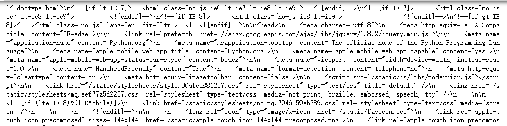
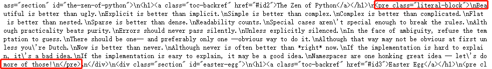
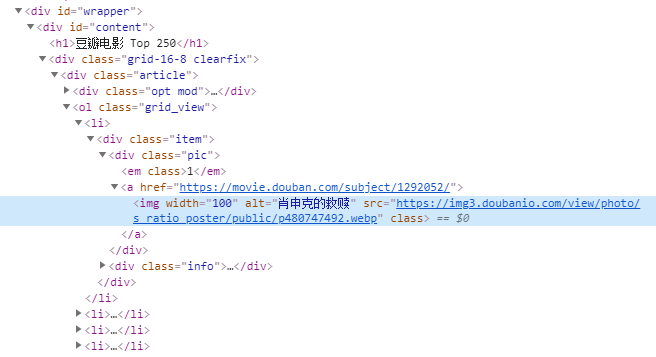

本文主要包括以下内容：

- 互联网的概念
- HTTP的概念
- 网页基础
- 爬虫基础
- API的使用
- JavaScript与AJAX简单介绍

## 互联网

**概念**：互联网也叫因特网(Internet)，是指网络与网络所串联成的庞大网络，这些网络以一组标准的网络协议族相连，连接全世界几十亿个设备，形成逻辑上的单一巨大国际网络。它由从地方到全球范围内几百万个私人的、学术界的、企业的和政府的网络所构成。通过电子、无线和光纤等一系列广泛的技术来实现。这种将计算机网络互相连接在一起的方法可称作“网络互联”，在此基础上发展出来的覆盖全世界的全球性互联网络称为“互联网”，即相互连接在一起的网络。

**提示： 互联网并不等于万维网(WWW)。**

互联网是指凡是能彼此通信的设备组成的网络就叫互联网，指利用[TCP/IP](https://zh.wikipedia.org/wiki/TCP/IP)通讯协定所创建的各种网络，是国际上最大的互联网，也称“国际互联网”。

万维网是一个由许多互相链接的超文本组成的系统，通过互联网访问。 [超文本传输协议](https://zh.wikipedia.org/wiki/超文本傳輸協議)（HTTP）是万维网的主要访问协议，万维网的服务使用HTTP在软件系统之间进行通信和数据传输 。

互联网包含广泛的信息资源和服务，例如相互关联的超文本文件，还有万维网的应用，支持电子邮件的基础设施、点对点网络、文件共享，以及IP电话服务。

> 参考维基百科： https://zh.wikipedia.org/wiki/互联网

## HTTP

 **超文本传输协议**（英语：**H**yper**T**ext **T**ransfer **P**rotocol，缩写：**HTTP**）是一种用于分布式、协作式和[超媒体](https://zh.wikipedia.org/wiki/超媒體)信息系统的[应用层](https://zh.wikipedia.org/wiki/应用层)[协议](https://zh.wikipedia.org/wiki/网络传输协议)。HTTP是[万维网](https://zh.wikipedia.org/wiki/全球資訊網)的数据通信的基础。 

设计HTTP最初的**目的**是为了提供一种发布和接收[HTML](https://zh.wikipedia.org/wiki/HTML)页面的方法。通过HTTP或者[HTTPS](https://zh.wikipedia.org/wiki/HTTPS)协议请求的资源由[统一资源标识符](https://zh.wikipedia.org/wiki/统一资源标志符)（Uniform Resource Identifiers，URI）来标识。 

HTTP是一个**客户端（用户）和服务器端（网站）之间进行请求和应答**的标准，通常使用TCP协议。通过使用网页浏览器、网络爬虫或者其他工具，客户端可以向服务器上的指定端口（默认端口为80）发起一个HTTP请求。这个客户端称为用户代理（user agent）。应答服务器上存储着一些资源码，比如HTML文件和图像。这个应答服务器称为源服务器（origin server）。在用户代理和源服务器中间可能存在多个“中间层”，比如代理服务器、网关或者隧道（tunnel）。

尽管TCP/IP是互联网最流行的协议，但HTTP中并没有规定必须使用它或它支持的层。事实上HTTP可以在互联网协议或其他网络上实现。HTTP假定其下层协议能够提供可靠的传输，因此，任何能够提供这种保证的协议都可以使用。使用TCP/IP协议族时TCP作为传输层。

通常由HTTP客户端发起一个请求，创建一个到服务器指定端口（默认是80端口）的TCP连接。HTTP服务器则在该端口监听客户端的请求。一旦收到请求，服务器会向客户端返回一个状态（比如“HTTP/1.1 200 OK”），以及请求的文件、错误信息等响应内容。

HTTP的**请求方法**：

| 方法    | 说明                                                         |
| ------- | ------------------------------------------------------------ |
| GET     | GET请求会显示请求指定的资源。一般来说GET方法应该只用于数据的读取，而不应当用于会产生副作用的非幂等的操作中，例如在 [网络应用程序](https://zh.wikipedia.org/wiki/网络应用程序) 中，其中一个原因是GET可能会被网络爬虫等随意访问。它期望的应该是而且应该是安全的和幂等的。这里的安全指的是，请求不会影响到资源的状态。 |
| HEAD    | HEAD方法与GET方法一样，都是向服务器发出指定资源的请求。但是，服务器在响应HEAD请求时不会回传资源的内容部分，即：响应主体。这样，我们可以不传输全部内容的情况下，就可以获取服务器的响应头信息。HEAD方法常被用于客户端查看服务器的性能。 |
| POST    | POST请求会 向指定资源提交数据，请求服务器进行处理，如：表单数据提交、文件上传等，请求数据会被包含在请求体中。POST方法是非幂等的方法，因为这个请求可能会创建新的资源或/和修改现有资源。 |
| PUT     | PUT请求会向指定资源位置上传其最新内容，PUT方法是幂等的方法。通过该方法客户端可以将指定资源的最新数据传送给服务器取代指定的资源的内容。 |
| DELETE  | DELETE请求用于请求服务器删除所请求URI（统一资源标识符，Uniform Resource Identifier）所标识的资源。DELETE请求后指定资源会被删除，DELETE方法也是幂等的。 |
| CONNECT | CONNECT方法是HTTP/1.1协议预留的，能够将连接改为管道方式的代理服务器。通常用于SSL加密服务器的链接与非加密的HTTP代理服务器的通信。方法名称是区分大小写的。当某个请求所针对的资源不支持对应的请求方法的时候，服务器应当返回状态码405（Method Not Allowed），当服务器不认识或者不支持对应的请求方法的时候，应当返回状态码501（Not Implemented）。 |
| OPTIONS | OPTIONS请求与HEAD类似，一般也是用于客户端查看服务器的性能。 这个方法会请求服务器返回该资源所支持的所有HTTP请求方法，该方法会用'*'来代替资源名称，向服务器发送OPTIONS请求，可以测试服务器功能是否正常。JavaScript的XMLHttpRequest对象进行CORS跨域资源共享时，就是使用OPTIONS方法发送嗅探请求，以判断是否有对指定资源的访问权限。 |
| TRACE   | TRACE请求服务器回显其收到的请求信息，该方法主要用于HTTP请求的测试或诊断。 |
| PATCH   | PATCH方法出现的较晚，它在2010年的RFC 5789标准中被定义。PATCH请求与PUT请求类似，同样用于资源的更新。二者有以下两点不同：1.PATCH一般用于资源的部分更新，而PUT一般用于资源的整体更新。2.当资源不存在时，PATCH会创建一个新的资源，而PUT只会对已在资源进行更新。 |

**幂等**：对同一个系统，使用同样的条件，一次请求和重复的多次请求对系统资源的影响是一致的。

 **HTTP服务器至少应该实现GET和HEAD方法**，其他方法都是可选的。 


所有HTTP响应的第一行都是**状态行**，依次是当前HTTP版本号，3位数字组成的[状态代码](https://zh.wikipedia.org/wiki/HTTP状态码)，以及描述状态的短语，彼此由空格分隔。

状态代码的第一个数字代表当前响应的类型：

- [1xx消息](https://zh.wikipedia.org/wiki/HTTP状态码#1xx消息)——请求已被服务器接收，继续处理
- [2xx成功](https://zh.wikipedia.org/wiki/HTTP状态码#2xx成功)——请求已成功被服务器接收、理解、并接受
- [3xx重定向](https://zh.wikipedia.org/wiki/HTTP状态码#3xx重定向)——需要后续操作才能完成这一请求
- [4xx请求错误](https://zh.wikipedia.org/wiki/HTTP状态码#4xx请求错误)——请求含有词法错误或者无法被执行
- [5xx服务器错误](https://zh.wikipedia.org/wiki/HTTP状态码#5xx服务器错误)——服务器在处理某个正确请求时发生错误

> 参考
>
> 维基百科： https://zh.wikipedia.org/wiki/超文本传输协议
>
> HTTP请求方法详解： https://juejin.im/entry/5b004085f265da0b886daf7c 


## 网页基础

### 网页组成

我们的数据来源是网页，那么我们在真正抓取数据之前，有必要先了解一下一个网页的组成。

网页是由 HTML 、 CSS 、JavaScript 组成的。HTML 是用来搭建整个网页的骨架，而 CSS 是为了让整个页面更好看，包括我们看到的颜色，每个模块的大小、位置等都是由 CSS 来控制的， JavaScript 是用来让整个网页“动起来”，这个动起来有两层意思，一层是网页的数据动态交互，还有一层是真正的动，比如我们都见过一些网页上的动画，一般都是由 JavaScript 配合 CSS 来完成的。

HTML 是用来描述网页的一种语言。

- HTML 指的是超文本标记语言 (**H**yper **T**ext **M**arkup **L**anguage)
- HTML 不是一种编程语言，而是一种*标记语言* (markup language)
- 标记语言是一套*标记标签* (markup tag)
- HTML 使用*标记标签*来描述网页

CSS 概述

- CSS 指层叠样式表 (Cascading Style Sheets)
- 样式定义*如何显示* HTML 元素
- 样式通常存储在*样式表*中
- 把样式添加到 HTML 4.0 中，是为了*解决内容与表现分离的问题*
- *外部样式表*可以极大提高工作效率
- 外部样式表通常存储在 *CSS 文件*中
- 多个样式定义可*层叠*为一

我们打开 Chrome 浏览器，随便打开一个网站，打开 F12 开发者工具，可以看到：


在选项 Elements 中可以看到网页的源代码，这里展示的就是 HTML 代码。

不同类型的文字通过不同类型的标签来表示，如图片用 &#60;img&#62; 标签表示，视频用 &#60;video&#62; 标签表示，段落用 &#60;p&#62; 标签表示，它们之间的布局又常通过布局标签 &#60;div&#62; 嵌套组合而成，各种标签通过不同的排列和嵌套才形成了网页的框架。

在右边 Styles 标签页中，显示的就是当前选中的 HTML 代码标签的 CSS 层叠样式，“层叠”是指当在HTML中引用了数个样式文件，并且样式发生冲突时，浏览器能依据层叠顺序处理。“样式”指网页中文字大小、颜色、元素间距、排列等格式。

而 JavaScript 就厉害了，它在 HTML 代码中通常使用 &#60;script&#62; 进行包裹，可以直接书写在 HTML 页面中，也可以以文件的形式引入。

> 参考： https://www.w3school.com.cn/index.html 

### 网页结构

我们来手写一个简单 HTML 页面来感受下。
首先创建一个文本文件，将后缀名改为 .html ，比如demo.html，写入如下内容：

```html
<!DOCTYPE  html>
<html>
    <head>
        <meta charset="UTF-8">
        <title>Demo</title>
    </head>
    <body>
        <div id="container">
            <div class="wrapper">
                <h1>Hello World</h1>
                <div>Hello Python.</div>
            </div>
        </div>
    </body>
</html>
```

#### HTML 元素


首先，整个文档是以 DOCTYPE 来开头的，这里定义了文档类型是 html ，整个文档最外层的标签是 &#60;html&#62; ，并且结尾还以 &#60;/html&#62; 来表示闭和。


浏览器解析 HTML 的时候，并不强制需要每个标签都一定要有闭和标签，但是为了语义明确，最好每个标签都跟上对应的闭和标签。删除其中的闭和标签进行尝试，并不会影响浏览器的解析。

整个 HTML 文档一般分为 head 和 body 两个部分，在 head 头中，我们一般会指定当前的编码格式为 UTF-8 ，并且使用 title 来定义网页的标题，这个会显示在浏览器的标签上面。

- \<html> 与 \</html> 之间的文本描述网页
- \<body> 与 \</body> 之间的文本是可见的页面内容
- \<h1> 与 \</h1> 之间的文本被显示为标题，<h1&#62;到&#60;h6>，字体由大到小递减
- \<p> 与 \</p> 之间的文本被显示为段落
- 换行标签为&#60;br&#62;
- 链接使用&#60;a&#62;来创建，herf属性包含链接的URL地址，比如

```html
<a href="http://www.baidu.com">一个指向百度的链接</a>
```

更多HTML标签可查看： https://www.w3school.com.cn/tags/index.asp 

#### HTML 属性

HTML 标签可以拥有*属性*。属性提供了有关 HTML 元素的*更多的信息*。

属性总是以名称/值对的形式出现，比如：*name="value"*。单引号双引号均可，有些值的内容包含特定字符，在html中可以去掉引号。不加引号的属性值被认为是不安全的。

属性总是在 HTML 元素的*开始标签*中规定。

| 属性  | 值                 | 描述                                                         |
| :---- | :----------------- | :----------------------------------------------------------- |
| class | *classname*        | 规定元素的类名（classname），常被用于语义化或格式化。例如，一个html文档可以指定class="标记"来表明所有具有这一类值的元素都属于文档的主文本。格式化后，这样的元素可能会聚集在一起，并作为页面脚注而不会出现在html代码中。类值也可以多值声明。如class="标记 重要"将元素同时放入“标记”与“重要”两类中。 |
| id    | *id*               | 规定元素的唯一 id，它用于识别元素，以便样式表可以改变其外观属性，脚本可以改变、显示或删除其内容或格式化。对于添加到页面的url，它为元素提供了一个全局唯一识别，通常为页面的子章节。 |
| style | *style_definition* | 规定元素的行内样式（inline style）。比起使用id或class属性从样式表中选择元素，“style”被认为是一个更好的做法。 |
| title | *text*             | 规定元素的额外信息（可在工具提示中显示）                     |

更多HTML属性可查看： https://www.w3school.com.cn/tags/html_ref_standardattributes.asp 


将上面创建的.html文件用浏览器打开，这个页面的显示如下：


#### HTML DOM

在 HTML 中，所有标签定义的内容都是节点，它们构成了一个 HTML DOM 树。

根据 W3C 的 HTML DOM 标准，HTML 文档中的所有内容都是节点：

* 整个文档是一个文档节点

* 每个 HTML 元素是元素节点

* HTML 元素内的文本是文本节点

* 每个 HTML 属性是属性节点

* 注释是注释节点

HTML DOM 将 HTML 文档视作树结构。这种结构被称为节点树：


一个HTML文档包括head和body两个部分，head中主要是title元素，body中主要是h1、a、p等元素，这些元素又可以有href、class等属性，以及文本内容。

通过 HTML DOM，树中的所有节点均可通过 JavaScript 进行访问。所有 HTML 元素（节点）均可被修改，也可以创建或删除节点。

节点树中的节点彼此拥有层级关系。

父（parent）、子（child）和同胞（sibling）等术语用于描述这些关系。父节点拥有子节点。同级的子节点被称为同胞（兄弟或姐妹）。

* 在节点树中，顶端节点被称为根（root）

* 每个节点都有父节点、除了根（它没有父节点）

* 一个节点可拥有任意数量的子节点

* 同胞是拥有相同父节点的节点

下面的图片展示了节点树的一部分，以及节点之间的关系：


#### CSS

前面我们介绍到 CSS 可以用来美化网页，那么我们简单加一点 CSS 修改下页面的显示效果。

```html
<!DOCTYPE html>
<html>
    <head>
        <meta charset="UTF-8">
        <title>Demo</title>
        <style type="text/css">
            .wrapper {
                text-align: center;
            }
        </style>
    </head>
    <body>
        <div id="container">
            <div class="wrapper">
                <h1>Hello World</h1>
                <div>Hello Python.</div>
            </div>
        </div>
    </body>
</html>
```


我们在 head 中添加了 style 标签，并注明其中的内容解析方式为 CSS 。其中的内容的含义是让文本居中显示，先看下增加 CSS 后的页面效果吧：


可以看到，原来居左的文字已经居中显示了。

那么，CSS 是如何表示它要修饰的文档结构的呢？这就要说到**CSS 选择器**了。

-  CSS 规则由两个主要的部分构成：选择器，以及一条或多条声明。 
-  选择器通常是需要改变样式的 HTML 元素。 # 开头代表选择 id ，其后紧跟 id 的名称。 . 开头代表选择 class ，其后紧跟 class 的名称。
-  每条声明由一个属性和一个值组成。 
-  属性（property）是希望设置的样式属性（style attribute）。每个属性有一个值。属性和值被冒号分开。 
- 如果值为若干单词，则要给值加引号。例如：p {font-family: "sans serif";}
- 如果要定义不止一个声明，则需要用分号将每个声明分开， 最后一条规则可以不加分号。 例如：p {text-align:center; color:red;}
- CSS 选择器还支持嵌套选择，各个选择器之间加上空格分隔开便可以代表嵌套关系，如： `#container` .wrapper p 则代表先选择 id 为 container 的节点，然后选中其内部的 class 为 wrapper 的节点，然后再进一步选中其内部的 p 节点。另外，如果不加空格，则代表并列关系，如 div#container .wrapper p.text 代表先选择 id 为 container 的 div 节点，然后选中其内部的 class 为 wrapper 的节点，再进一步选中其内部的 class 为 text 的 p 节点。这就是 CSS 选择器，其筛选功能还是非常强大的。

> 参考
>
> 菜鸟教程：https://www.runoob.com/html/html-tutorial.html
>
> w3school： https://www.w3school.com.cn/css/index.asp 
>

#### 使用开发者工具检查网页

如果想要编写一个爬取网页内容的爬虫程序，在动手编写前，最重要的准备工作可能就是检查目标网页了。下面以Chrome为例，看看如何使用开发者工具。

以python官网的“python之禅”为例，首先在Chrome中打开https://www.python.org/dev/peps/pep-0020/ ，可以选择“菜单”中的“更多工具”$\rightarrow$“开发者工具”，也可以直接在网页内容中右击并选择“检查”选项，还可以按f12键。效果如下图所示。


Chrome的开发者模式为用户提供了下面几组工具。

- Elements：允许用户从浏览器的角度来观察网页，用户可以借此看到Chrome渲染页面所需要的HTML、CSS和DOM（Document Object Model）对象。

- Network：可以看到网页向服务器请求了哪些资源、资源的大小以及加载资源的相关信息。此外，还可以查看HTTP的请求头、返回内容等。

- Source：即源代码面板，主要用来调试JavaScript。

- Console：即控制台面板，可以显示各种警告与错误信息。在开发期间，可以使用控制台面板记录诊断信息，或者使用它作为shell在页面上与JavaScript交互。

- Performance：使用这个模块可以记录和查看网站生命周期内发生的各种事情来提高页面运行时的性能。

- Memory：这个面板可以提供比Performance更多的信息，比如跟踪内存泄漏。

- Application：检查加载的所有资源。

- Security：即安全面板，可以用来处理证书问题等。

另外，通过切换设备模式可以观察网页在不同设备上的显示效果，快捷键为：Ctrl + Shift + M（或者在 Mac上使用 Cmd + Shift + M），如下图所示。


在**“Element”**面板中，开发者可以检查和编辑页面的HTML与CSS。选中并双击元素就可以编辑元素了，比如将“python”这几个字去掉，右键该元素，选择“Delete Element”，效果如下图所示：


当然，右击后还有很多操作，值得一提的是其中的**“Copy XPath”**选项。由于XPath是解析网页的利器，因此Chrome中的这个功能对于爬虫程序编写而言就显得十分实用和方便了。

使用**“Network”**工具可以清楚地查看网页加载网络资源地过程和相关信息。请求的每个资源在“Network”表格中显示为一行，对于某个特定的网络请求，可以进一步查看请求头、响应头及已经返回的内容等信息。

对于需要填写并发送**表单**的网页而言（比如执行用户登录操作，以百度贴吧为例），在“Network”面板勾选“Preserve log”复选框，然后进行登录，就可以记录HTTP POST信息，查看发送的表单信息详情。之后在贴吧首页开启开发者工具后再登录时，就可以看到下图所示的信息，其中“Form Data”就包含向服务器发送的表单信息详情。


另外“Network”中的**“Preview”**也是比较常用，可以用来预览数据。

## 爬虫基础

### requests.get

下面我们介绍一下requests库的基本应用，首先讲解一下requests.get

我们的目的是爬取出python之禅


一个网络爬虫程序最普遍的过程：

1. 访问站点；
2. 定位所需的信息；
3. 得到并处理信息。


```python
import requests
url = 'https://www.python.org/dev/peps/pep-0020/'
res = requests.get(url)
text = res.text
text
```



可以看到返回的其实就是开发者工具下Elements的内容，只不过是字符串类型，接下来我们要用python的内置函数find来定位“python之禅”的索引，然后从这段字符串中取出它。

通过观察网站，我们可以发现这段话在一个特殊的容器中，通过审查元素，使用快捷键Ctrl+shift+c快速定位到这段话也可以发现这段话包围在pre标签中，因此我们可以由这个特点用find函数找出具体内容

&#60;pre&#62; 标签可定义预格式化的文本。
被包围在 &#60;pre&#62; 标签 元素中的文本通常会保留空格和换行符。而文本也会呈现为等宽字体。·

在输出的text中查找到我们需要的文本：



查找到“<pre”后，还需要往后几个字符才是我们需要的文本，可以将这段文本复制下来看看字符个数，末尾的“</pre>”同理：

```python
len('<pre class="literal-block">\n'), len('\n')
# (28, 1)
```

因此，查找到“<pre”标签后，还需要往前28个字符才是文本的开头，而“</pre>”则需要退后一个字符才是文本的结尾。


```python
## 爬取python之禅并存入txt文件

with open('zon_of_python.txt', 'w') as f:
    f.write(text[text.find('<pre')+28:text.find('</pre>')-1])
print(text[text.find('<pre')+28:text.find('</pre>')-1])
```

    Beautiful is better than ugly.
    Explicit is better than implicit.
    Simple is better than complex.
    Complex is better than complicated.
    Flat is better than nested.
    Sparse is better than dense.
    Readability counts.
    Special cases aren't special enough to break the rules.
    Although practicality beats purity.
    Errors should never pass silently.
    Unless explicitly silenced.
    In the face of ambiguity, refuse the temptation to guess.
    There should be one-- and preferably only one --obvious way to do it.
    Although that way may not be obvious at first unless you're Dutch.
    Now is better than never.
    Although never is often better than *right* now.
    If the implementation is hard to explain, it's a bad idea.
    If the implementation is easy to explain, it may be a good idea.
    Namespaces are one honking great idea -- let's do more of those!


利用python自带的urllib完成以上操作：


```python
import urllib
url = 'https://www.python.org/dev/peps/pep-0020/'
res = urllib.request.urlopen(url).read().decode('utf-8')
print(res[res.find('<pre')+28:res.find('</pre>')-1])
```

urllib是python3的标准库，包含了很多基本功能，比如向网络请求数据、处理cookie、自定义请求头等，显然，就代码量而言，urllib的工作量比Requests要大，而且看起来也不甚简洁.

Python3.5 版本下将python2.7版本的urllib和urllib2 合并在一起成一个新的urllib，方法并入error、parse、request、response下，连接请求基本在request中通过urllib.request调用，数据处理的一些方式放入parse中

Requests是Python中的HTTP客户端库，网络请求更加直观方便，它与Urllib最大的区别就是在爬取数据的时候连接方式的不同。urllib爬取完数据是直接断开连接的，而requests爬取数据之后可以继续复用socket，并没有断开连接。

参考： https://www.jianshu.com/p/1efa672156d3 

### requests.post

我们先以金山词霸为例，有道翻译百度翻译谷歌翻译都有加密，以后可以自己尝试。

首先进入金山词霸首页http://www.iciba.com/ 

然后打开开发者工具下的“Network”，翻译一段话，比如刚刚我们爬到的第一句话“Beautiful is better than ugly.”

点击翻译后可以发现Name下多了一项请求方法是POST的数据，点击Preview可以发现数据中有我们想要的翻译结果（在此之前会产生很多干扰项，可以在点击翻译之前使用左上角的像“禁止”一样的符号清理一下）


我们目前需要用到的两部分信息是Request Headers中的User-Agent，和From Data


接下来我们利用金山词霸来翻译我们刚刚爬出来的python之禅


```python
import requests
def translate(word):
    # 这是Headers中的General下的Request URL
    url="http://fy.iciba.com/ajax.php?a=fy"

    # Form Data的内容
    data={
        'f': 'auto',
        't': 'auto',
        'w': word,
    }
    
    # Request Headers中的User-Agent，User-Agent会告诉网站服务器，访问者是通过什么工具来请求的，如果是爬虫请求，一般会拒绝，如果是用户浏览器，就会应答。
    headers={
        'user-agent': 'Mozilla/5.0 (Windows NT 10.0; Win64; x64) AppleWebKit/537.36 (KHTML, like Gecko) Chrome/74.0.3729.169 Safari/537.36',
    }
    response = requests.post(url,data=data,headers=headers)     #发起请求
    json_data=response.json()   #获取json数据
    #print(json_data)
    return json_data
    
def run(word): 
    # 可以运行translate函数查看json_data找到翻译结果的key，也可以在审查元素中的Preview中查看
    result = translate(word)['content']['out']   
    print(result)
    return result

def main():
    with open('zon_of_python.txt') as f:
        zh = [run(word) for word in f]

    with open('zon_of_python_zh-CN.txt', 'w') as g:
        for i in zh:
            g.write(i + '\n')
            
if __name__ == '__main__':
    main()
```

     美丽胜过丑陋。
     外显优于内隐..
    简单胜于复杂。
     复杂胜于复杂。
     平比嵌套好..
     疏而不密..
     可读性计数。
     特殊情况不足以打破规则。
     尽管实用性胜过纯度。
     错误永远不应该悄悄地过去。
     除非有明确的沉默。
     面对暧昧，拒绝猜测的诱惑..
     应该有一种----最好只有一种----明显的办法来做到这一点。
    虽然这种方式一开始可能不明显，除非你是荷兰人。
     现在总比永远好。
     虽然从来没有比现在更好。
     如果实施很难解释，那是个坏主意。
     如果实现很容易解释，这可能是个好主意。
     命名空间是一个伟大的想法-让我们做更多的这些！

### requests.get进阶：爬取豆瓣电影

先看看页面结构，打开页面 https://movie.douban.com/top250?start=0&filter= 

按F12查看Elements，点击左上角的箭头，再点击第一个电影《肖申克的救赎》的图片处，可以看到：



“alt”处就是电影标题，"src"是电影的图片地址，可以用ctrl+F键在Elements中查找元素，发现"alt"只在电影页面处出现（也就是我们需要获取的数据），所以可以直接用requests.get获取到页面的文本内容，然后用find函数查找"alt"，得到电影标题和图片地址。

```python
import requests
import re
def douban(url):
    
    headers={
        'user-agent': 'Mozilla/5.0 (Windows NT 10.0; Win64; x64) AppleWebKit/537.36 (KHTML, like Gecko) Chrome/74.0.3729.169 Safari/537.36',
    }
    response = requests.get(url,headers=headers)
    data = response.text
    all_alt = [m.start() for m in re.finditer("alt", data)]
    print(len(all_alt))   # 输出26
    title_img = []
    # 只需要前25个alt，因为每一页是25个电影，第26个数据对我们来说没有用
    for alt in all_alt[:25]:
        # 观察到我们需要的电影名称和图片url都被双引号包裹起来，所以可以直接用双引号分隔，找到想要的数据
        text = data[alt:].split('"')
        title = text[1]
        imgurl = text[3]
        title_img.append([title, imgurl])
    return title_img
print(douban("https://movie.douban.com/top250?start=0&filter="))
```

上述代码只获取了第一页的电影排行榜数据，那么如何获取第2、3，...页的数据呢？点击第2页，发现页面布局是一样的，页面url变成了 https://movie.douban.com/top250?start=25&filter= ，即（页数-1）*25，所以如果想抓取top250的电影，用如下代码：

```python
title_img_list = []
for i in range(10):
    offset = i * 25
    url = 'https://movie.douban.com/top250?start=' + str(offset) +'&filter='
    title_img = douban(url)
    title_img_list.extend(title_img)
print(title_img_list)
```

如果想获取排名数据的话，可以手动加上index，因为我们是按顺序爬取的，list中的电影顺序就是排名的index。可以将电影排行榜数据存到文件中，所有的电影图片存到磁盘中。代码如下：

```python
import os

if not os.path.exists('image'):
     os.mkdir('image')
        
def write_movies_file(item, stars):
    print(stars, item)
    with open('douban_film.txt','a',encoding='utf-8') as f:
        f.write('排名：%d\t电影名：%s\n' % (stars, item[0]))
    # 根据图片url下载图片
    r = requests.get(item[1])
    with open('image/' + str(item[0]) + '.jpg', 'wb') as f:
        f.write(r.content)
        
def main():
    stars = 1
    for i in range(10):
        offset = i * 25
        url = 'https://movie.douban.com/top250?start=' + str(offset) +'&filter='
        for item in douban(url):
            write_movies_file(item, stars)
            stars += 1

if __name__ == '__main__':
    main()
```

## API的使用

所谓的采集网络数据，并不一定必须从网页中抓取数据，而api（Application Programming Iterface）的用处就在这里：API为开发者提供了方便友好的接口，不同的开发者用不同的语言都能获取相同的数据。目前API一般会以XML（Extensible Markup Language，可拓展标记语言）或者JSON（JavaScript Object Notation）格式来返回服务器响应，其中JSON数据格式越来越受到人们的欢迎，我们后面的课程也会详细介绍JSON格式。

### API使用示例

下面以百度地图提供的API为例，首先我们打开链接：http://lbsyun.baidu.com/apiconsole/key 填写自己的信息


邮箱激活后点击申请密钥，然后填入下图信息，注意应用类型选择浏览器端


点击提交后就可以查看AK了，下面以两个小例子展示一下AK的作用：

首先我们创建一个html文件，例如test.html,复制下面代码，输入自己的AK

```html
<!DOCTYPE html>
<html>
<head>
	<meta http-equiv="Content-Type" content="text/html; charset=utf-8" />
	<meta name="viewport" content="initial-scale=1.0, user-scalable=no" />
	<style type="text/css">
		body,
		html,
		#allmap {
			width: 100%;
			height: 100%;
			overflow: hidden;
			margin: 0;
			font-family: "微软雅黑";
		}
	</style>
	<script type="text/javascript" src="http://api.map.baidu.com/api?v=3.0&ak="></script> //在 ak=后面输入你的ak
	<title>地图展示</title>
</head>
    
<body>

	<div id="allmap"></div>

</body>

</html>
<script type="text/javascript">
	// 百度地图API功能
	var map = new BMap.Map("allmap"); // 创建Map实例
	map.centerAndZoom(new BMap.Point(116.404, 39.915), 11); // 初始化地图,设置中心点坐标和地图级别
	//添加地图类型控件
	map.addControl(new BMap.MapTypeControl({
		mapTypes: [
			BMAP_NORMAL_MAP,
			BMAP_HYBRID_MAP
		]
	}));
	map.setCurrentCity("北京"); // 设置地图显示的城市 此项是必须设置的
	map.enableScrollWheelZoom(true); //开启鼠标滚轮缩放
</script>
```


然后用Chrome打开这个文件，效果如下图所示：


当然，百度地图api还有很多作用，关于百度地图API的其他使用，其官方文档说的非常详细和清楚 http://lbsyun.baidu.com/index.php?title=jspopular3.0 ，但是调用更复杂的功能需要有一定的网页基础。下面我们介绍如何实现地理编码功能


```python
import requests

def getUrl(*address):
    ak = ''  ## 填入你的api key
    if len(address) < 1:
        return None
    else:
        for add in address:   
            url = 'http://api.map.baidu.com/geocoding/v3/?address={0}&output=json&ak={1}'.format(add,ak)  
            yield url
            

def getPosition(url):
    '''返回经纬度信息'''
    res = requests.get(url)
    #print(res.text)
    json_data = eval(res.text)
    
    if json_data['status'] == 0:
        lat = json_data['result']['location']['lat'] #纬度
        lng = json_data['result']['location']['lng'] #经度
    else:
        print("Error output!")
        return json_data['status']
    return lat,lng

if __name__ == "__main__":
    address = ['北京市清华大学','北京市北京大学','保定市华北电力大学','上海市复旦大学','武汉市武汉大学']
    for add in address:
        add_url = list(getUrl(add))[0]
        print('url:', add_url)
        try:
            lat,lng = getPosition(add_url)
            print("{0}|经度:{1}|纬度:{2}.".format(add,lng,lat))
        except Error as e:
            print(e)
```

    url: http://api.map.baidu.com/geocoding/v3/?address=北京市清华大学&output=json&ak=这里会显示你的ak
    北京市清华大学|经度:116.33337396094367|纬度:40.009645090734296.
    url: http://api.map.baidu.com/geocoding/v3/?address=北京市北京大学&output=json&ak=这里会显示你的ak
    北京市北京大学|经度:116.31683256328296|纬度:39.99887680537622.
    url: http://api.map.baidu.com/geocoding/v3/?address=保定市华北电力大学&output=json&ak=这里会显示你的ak
    保定市华北电力大学|经度:115.52130317483764|纬度:38.89477430426888.
    url: http://api.map.baidu.com/geocoding/v3/?address=上海市复旦大学&output=json&ak=这里会显示你的ak
    上海市复旦大学|经度:121.74295536914276|纬度:31.06665792321301.
    url: http://api.map.baidu.com/geocoding/v3/?address=武汉市武汉大学&output=json&ak=这里会显示你的ak
    武汉市武汉大学|经度:114.37292090919235|纬度:30.543803317143624.


更多参数可以查看官方文档： http://lbsyun.baidu.com/index.php?title=webapi/guide/webservice-geocoding

## JavaScript与AJAX技术

如果利用Requests库和BeautifulSoup来采集一些大型电商网站的页面，可能会发现一个令人疑感的现象，那就是对于同一个URL、同一个页面，抓取到的内容却与浏览器中看到的内容有所不同。比如有的时候去寻找某一个&lt;div&gt;元素，却发现Python程序报出异常，查看requests.get()方法的响应数据也没有看到想要的元素信息。这其实代表着网页数据抓取的一个关键问题——开发者通过程序获取到的HTTP响应内容都是原始的HTML数据，但浏览器中的页面其实是在HTML的基础上，经过JavaScript进一步加工和处理后生成的效果。比如淘宝的商品评论就是通过JavaScript获取JSON数据，然后“嵌入”到原始HTML中并呈现给用户。这种在页面中使用JavaScript的网页对于20世纪90年代的web界面而言几乎是天方夜测，但在今天，以AJAX（Asynchronous JavaScript and XML，异步JavaScript与XML）技术为代表的结合JavaScript、CSS、HTML等语言的网页开发技术已经成为绝对的主流。

为了避免为每一份要呈现的网页内容都准备一个HTML，网站开发者们开始考虑对网页的呈现方式进行变革。在JavaScript问世之初，Google公司的Gmail邮箱网站是第一个大规模使用JavaScript加载网页数据的产品，在此之前，用户为了获取下一页的网页信息，需要访问新的地址并重新加载整个页面。但新的Gmail则做出了更加优雅的方案，用户只需要单击“下一页”按钮，网页就（实际上是浏览器）会根据用户交互来对下一页数据进行加载，而这个过程并不需要对整个页面（HTML）的刷新。换句话说，JavaScript使得网页可以灵活地加载其中一部分数据。后来，随着这种设计的流行，“AJAX”这个词语也成为一个“术语”，Gmail作为第一个大规模使用这种模式的商业化网站，也成功引领了被称之为“Web2.0”的潮流。

### JavaScript语言

JavaScript语言一般被定义为一种“面向对象、动态类型的解释性语言”，最初由Netscape公司为Navigator浏览器开发，目的是作为新一代浏览器的脚本语言支持。换句话说，不同于PHP或者ASP.NET，JavaScript不是为“网站服务器”提供的语言，而是为“用户浏览器”提供的语言。从客户端——服务器端的角度来说，JavaScript无疑是一种客户端语言，但是由于JavaScript受到业界和用户的强烈欢迎，加之开发者社区的活跃，目前的JavaScript已经开始朝向更为综合的方向发展。随着V8引擎（可以提高JavaScript的解释执行效率）和Node.js等新潮流的出现，JavaScript甚至已经开始涉足“服务器端”。在TIOBE排名（一个针对各类程序设计语言受欢迎度的比较）上，JavaScript稳居前10，井与PHP、Pytbon、C#等分庭抗礼。

有一种说法是，对于今天任何一个正式的网站页面而言，HTML决定了网页的基本内容，CSS（Cascading Style Sheets，层叠样式表）描述了网页的样式布局，JavaScript 则控制了用户与网页的交互。

#### JavaScript语言的特点

* 动态语言

  动态语言是指程序在运行时可以改变其结构：新的函数可以被引进，已有的函数可以被删除等在结构上的变化。JavaScript便是一个动态语言。除此之外如Ruby、Python等也都属于动态语言，而C、C++等语言则不属于动态语言。比如在JavaScript中可以在对象定义之后动态的为其添加属性和方法


* 脚本语言

  脚本语言是为了缩短传统的编写-编译-链接-运行（edit-compile-link-run）过程而创建的计算机编程语言，只在被调用时进行解释或编译，然后执行。它的命名起源于一个脚本“screenplay”，每次运行都会使对话框逐字重复。早期的脚本语言经常被称为批量处理语言或工作控制语言。


* 弱类型

  弱/强类型指的是语言类型系统的类型检查的严格程度，弱类型的语言在声明变量的时候不必进行变量类型的确定，语言的运行时会隐式做数据类型转换，对于弱类型语言来说，不同类型的变量可以进行直接运算，而强类型的则不可以。

#### 如何使用JavaScript

1.通过&lt;script&gt;&lt;/script&gt;中直接编写

```html
<!--test1.html-->

<!DOCTYPE html>
<html>
    <head>
        <meta charset="UTF-8">
        <title></title>
    </head>
    <body>
        <script type="text/javascript">
            alert('js课程开始了')
        </script>
    </body>
</html>
```

结果如下:


2.通过&lt;script src=’目标文档的URL’&gt;&lt;script&gt;连接外部Js文件

```html
<!--test2.html-->

<!DOCTYPE html>
<html>
    <head>
        <meta charset="UTF-8">
        <title></title>
    </head>
    <body>
        <script src="test2.js" type="text/javascript" charset="utf-8"></script>

    </body>
</html>
```

```javascript
<!--test2.js-->

document.write('hello');
```

结果如下:


3.href属性值

作为某个元素的时间属性值或者是超链接的href属性值

```html
<!--test3.js-->

<!DOCTYPE html>
<html>
    <head>
        <meta charset="UTF-8">
        <title></title>
    </head>
    <body>

        <a href="javascript:confirm('缺人吗')">报名</a>
        <p onclick="javascript:alert('hello word')">
            click me
        </p>
    </body>
</html>
```

结果如下:


#### JavaScript的基本语法

* JavaScript的执行顺序：按照HTML文件中出现的顺序依次执行


* 大小写敏感：JavaScript严格区分大小写


* 忽略空白符和换行符


* 语句分隔符：使用；结束语句，可以把多个语句写在一行，最后一个语句的分号可以省略，但尽量不要省略。可以使用{}括成一个语句组，形成一个block


* 通过\对代码进行折行操作：document.write(‘hello\world’);


* //单行注释&#8195;&#8195;多行注释/注释内容/


* JavaScript中的保留字：abstract，else，instanceof，super，boolean，enum，int，switch，break，export，interface，synchronized，byte，extends，let，this，case，false，long，throw，catch，final，native，throws，char，finally，new，transient，class，float，null，true，const，for，package，try，continue，function，private，typeof，debugger，goto，protected，var，defaut，if，public，void，delete，inplements，return，volatile，do，import，short，while，doble，in，static，width


* 通过document.write()向文档书写内容


* 通过console.log()向控制台写入内容


* 语法错误：通过控制台进行调试


* 逻辑错误：通过alert() 进行调试

【提示】JavaScript的名字使得很多人会将其与Java语言联系起来，认为它是Java的某种派生语言，但实际上JavaScript在设计原则上更多受到了Scheme（一种函数式编程语言）和C语言的影响，除了变量类型和命名规范等细节，JavaScript与Java关系并不大。Netscape公司最初为之命名“LiveScript”，但当时正与Sun公司合作，加上Java语言所获得的巨大成功，为了“蹭热点”，遂将其名字改为“JavaScript”。JavaScript推出后受到了业界的一致肯定，对JavaScript的支持也成为在21世纪出现的现代浏览器的基本要求。浏览器端的脚本语言还包括用于Flash动画的ActionScript等。

为了在网页中使用JavaScript，开发者一般会把JavaScript脚本程序写在HTML的&#60;script&#62;标签中。在HTML语法里，&#60;script&#62;标签用于定义客户端脚本，如果需要引用外部脚本文件，可以在src属性中设置其地址，如下图所示。


JavaScript在语法结构上比较类似于C++等面向对象的语言，循环语句、条件语句等也都与Python中的写法有较大的差异，但其弱类型特点会更符合Python开发者的使用习惯。
  一段简单的JavaScript脚本程序如下：计算a+b和a*b

```html
//JavaScript示例，计算a+b和a*b。
function add(a,b)
{
    var sum=a+b;
    console.log('%d + %d equals to %d',a,b,sum);
}
function mut(a,b)
{
    var prod=a * b;
    console.log('%d * %d equals to %d',a,b,prod);
}
```


使用Chrome更多工具——开发者工具下的“Console”工具（“Console”一般翻译为“控制台”），输入并执行这个函数，就可以看到Console对应的输出，如下图。


接下来通过下面的例子展示JavaScript的基本概念和语法。

```html
//JavaScript程序，演示JavaScript的基本内容。

var a = 1; //变量都用var关键字定义
var myFunction = function(arg1){ //注意这个赋值语句，在JavaScript中，变量和函数的本质是一样的
    arg1 += 1;
    return arg1;
}

var myAnotherFunction = function(f, a){ //函数也可作为另一个函数的参数被传入
    return f(a);
}
console.log(myAnotherFunction(myFunction, 2))

//条件语句
if (a > 0){
    a -= 1;
}else if (a == 0){
    a -= 2;
}else{
    a += 2;
}

//数组
arr = [1, 2, 3];
console.log(arr[1]);

//对象
myAnimal = {
    name: "Bob",
    species: "Tiger",
    gender: "Male",
    isAlive: true,
    isMammal: true,
}
console.log(myAnimal.gender); //访问对象的属性

//匿名函数
myFunctionOp = function(f, a){
    return f(a);
}

res = myFunctionOp( //直接再参数处写上一个函数
function(a){
    return a * 2;
},
4)
//可以联想lambda表达式来理解
console.log(res);//结果为8
```


除了对JavaScript 语法的了解，为了更好地分析和抓取网页，还需要对目前广为流行的JavaScript 第三方库有简单的认识。包括jQuery、Prototype、React 等在内的这些JavaScript库一般会提供丰富的函数和设计完善的使用方法。
如果要使用jQuery，可以访问http://jquery.com/download/ ，并将jQuery源码下载到本地，最后在HTML中引用：

```html
<head>
</head>
<body>
    <script src=”jquery-1.10.2.min.js”></script>
</body>
```


jQuery库的教程：https://www.runoob.com/jquery/jquery-tutorial.html

也可使用另一种不必在本地保存.js文件的方法，即使用CDN（见下方代码）。谷歌、百度、新浪等大型互联网公司的网站上都会提供常见JavaScript库的CDN。如果网页使用了CDN，当用户向网站服务器请求文件时，CDN会从离用户最近的服务器上返回响应，这在一定程度上可以提高加载速度。

```html
<head>
</head>
<body>
    <script src=”http://cdn.jsdelivr.net/npm/jquery@3.2.1/dist//jquery.min.js”>
    </script>
</body>
```


【提示】曾经编写过网页的人可能对CDN一词并不陌生。CDN即Content Delivery Network（内容分发网络），一般会用于存放供人们共享使用的代码。Google的API服务器即提供了存放jQuery等JavaScript库的CDN。这是比较狭义的CDN含义，实际上CDN的用途不止“支持JavaScript脚本”一项。

### AJAX

AJAX技术与其说是一种“技术”，不如说是一种“方案”。如上文所述，在网页中使用JavaScript 加载页面中数据的过程，都可以看作AJAX技术。AJAX技术改变了过去用户浏览网站时一个请求对应一个页面的模式，允许浏览器通过异步请求来获取数据，从而使得一个页面能够呈现并容纳更多的内容，同时也就意味着更多的功能。只要用户使用的是主流的浏览器，同时允许浏览器执行JavaScript，用户就能够享受网页中的AJAX内容。

AJAX技术在逐渐流行的同时，也面临着一些批评和意见。由于JavaScript本身是作为客户端脚本语言在浏览器的基础上执行的，因此，浏览器兼容性成为不可忽视的问题。另外，由于JavaScript在某种程度上实现了业务逻辑的分离（此前的业务逻辑统一由服务器端实现），因此在代码维护上也存在一些效率问题。但总体而言，AJAX技术已经成为现代网站技术中的中流砥柱，受到了广泛的欢迎。AJAX目前的使用场景十分广泛，很多时候普通用户甚至察觉不到网页正在使用AJAX技术。
以知乎的首页信息流为例，与用户的主要交互方式就是用户通过下拉页面（具体操作可通过鼠标滚轮、拖动滚动条等实现）查看更多动态，而在一部分动态（对于知乎而言包括被关注用户的点赞和回答等）展示完毕后，就会显示一段加载动画并呈现后续的动态内容。此处的页面动画其实只是“障眼法”，在这个过程中，JavasScript脚本已向服务器请求发送相关数据，并最终加载到页面之中。这时页面显然没有进行全部刷新，而是只“新”刷新了一部分，通过这种异步加载的方式完成了对新内容的获取和呈现，这个过程就是典型的AJAX应用。

比较尴尬的是，爬虫一般不能执行包括“加载新内容”或者“跳到下一页”等功能在内的各类写在网页中的JavaScript代码。如本节开头所述，爬虫会获取网站的原始HTML页面，由于它没有像浏览器一样的执行JavaScript脚本的能力，因此也就不会为网页运行JavaScript。最终，爬虫爬取到的结果就会和浏览器里显示的结果有所差异，很多时候便不能直接获得想要的关键信息。为解决这个尴尬处境，基于Python编写的爬虫程序可以做出两种改进，一种是通过分析AJAX内容（需要开发者手动观察和实验），观察其请求目标、请求内容和请求的参数等信息，最终编写程序来模拟这样的JavaScript 请求，从而获取信息（这个过程也可以叫作“逆向工程”）。另外一种方式则比较取巧，那就是直接模拟出浏览器环境，使得程序得以通过浏览器模拟工具“移花接木”，最终通过浏览器渲染后的页面来获得信息。这两种方式的选择与JavaScript在网页中的具体使用方法有关。

## 参考资料

https://github.com/datawhalechina/team-learning/tree/master/Python爬虫编程实践

