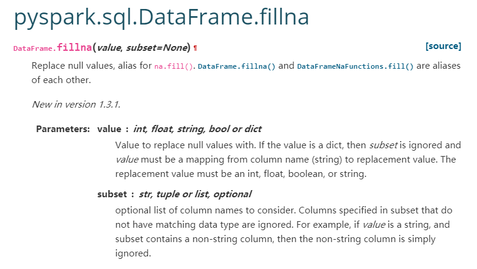

# pyspark

## Pyspark在zeus上的使用

1.基本用法：

```Python
today='${today}'
spark-submit --conf spark.yarn.tags=router,spark2.2.0,streaming --conf spark.driver.maxResultSize=4g --executor-memory 18G \
test.py $today;

```


其中today是传入的参数，在test.py里用sys.argv[1]取

在开头加一行set -e，判断 spark-submit执行是否成功


2.如果使用Python3，加上参数

--conf spark.pyspark.python=/usr/bin/python3.6 \

--conf spark.pyspark.driver.python=/usr/bin/python3.6 \


3.报内存不够的错误时，可以尝试：

1）添加配置--conf spark.sql.adaptive.enabled=false --conf spark.yarn.executor.memoryOverhead=12g

2）代码拆分成多个部分，分开跑

3）添加配置driver-memory 2560m


4.zeus上没有的Python包，可以本地将其打包成.zip文件，上传到zeus，在代码里添加：

（以pypinyin这个包为例）

```Python
1  from pyspark.conf import SparkConf
2  conf = SparkConf()
3  conf.setAppName("Spark Stream")
4  sc = SparkContext(conf=conf)
5  sc.addPyFile("pypinyin.zip")
6  from pypinyin import Style, pinyin, lazy_pinyin, load_phrases_dict

```


即可使用import的方法


## dataframe转rdd方式，再调用python函数

```Python
from pyspark.sql import SparkSession, SQLContext
from pyspark import SparkContext
import pyspark.sql.functions as F
from pyspark.sql.types import *
 
def run(sent):
    gspoiid, taid, lang, taname, poiname, poiename, taename = \
        sent['gspoiid'], sent['taid'], sent['lang'], sent['taname'], sent['poiname'], sent['poiename'], sent['taename']
    res_list = []
    judgelang, problem = isnoen_needclean(taname, lang)
    res_list.append([gspoiid, taid, lang, taname, poiname, poiename, taename, judgelang, problem])
    return res_list
 
 
def df2hive(df,option,table,patition = 'd'):
    if option in ['append','overwrite']:
        df.write.format("hive").mode(option).saveAsTable(table)
    else:
        df.write.format("hive").partitionBy(patition).mode("append").saveAsTable(table)
    print('write df into ',table)
 
spark = SparkSession.builder.appName("run lang clean combine").enableHiveSupport().getOrCreate()
inputtable = str(sys.argv[1])
outputtable = str(sys.argv[2])
 
df = spark.table(inputtable)
 
df = df.repartition(5000)
df = df.rdd.map(lambda x: x.asDict())
y = df.flatMap(run)
# gspoiid, taid, lang, taname, poiname, poiename, taename
schema = StructType(
    [StructField("gspoiid", LongType(), True), StructField("taid", LongType(), True),
     StructField("lang", StringType(), True), StructField("taname", StringType(), True),
     StructField("poiname", StringType(), True),
     StructField("poiename", StringType(), True), StructField("taename", StringType(), True),
     StructField("judgelang", StringType(), True), StructField("problem", StringType(), True)])
df = spark.createDataFrame(y, schema)
df = df.dropDuplicates()
 
idcounts = df.groupBy('taid', 'lang').count()
df = df.join(idcounts, ['taid', 'lang'], 'left')
 
df2hive(df, 'overwrite', outputtable)

```


inputdata = spark.sql(sql).repartition(2001) //sql是从hive表中读取数据的sql语句，注意此处一定要进行repartition，否则默认读入的分区可能很小从而发挥不了分布式计算的优势

ret = inputdata.rdd.map(lambda x: (x["coid"], main_api(x.asDict(), 1, "content", 0, 0)["score"]))


## pyspark写入hive表问题

Pyspark写入问题：源于我在overwrite table某个分区的时候，居然把之前的分区都删掉了，只剩下了最新的分区。问了相关的维护人员，这个数据无法恢复，因为是datasource方式写入的，只有hive table方式的数据删除后是进入trash，可以恢复。2021/03/30-2021/03/31

df.write.format(format).partitionBy('d').mode(option).saveAsTable(outputTable)

1. format='hive'
	1. table是hive上建的正式表，不管option是overwrite还是append都无法写入，Can't create table under official database
	2. table是hive上建的临时表，不管option是overwrite还是append都可以写入，用overwrite的话也会直接重建一张表
	3. table是未建的正式表，不管option是overwrite还是append都无法写入，Can't create table under official database
	4. table是未建的临时表，不管option是overwrite还是append都可以写入
2. format='orc'
	1. table是hive上建的正式表，append和orc会报类型不匹配的错误，overwrite和orc会直接重新写入一张表，原来的表就没了。
	2. table是未建的正式表，overwrite多次写入的话只会保留最新写入的分区。append多次写入的话会保留每个分区。第一次append后续overwrite也只会保留最新写入的分区。


总结：注意几个事情

1. 最好是pyspark写入临时表，再用hive将临时表的数据写入正式表。
2. 在hive上建的正式表，通过pyspark是无法写入的（应该是公司有一些限制），如果是临时表就可以写入。
3. pyspark写入的方式分为orc和hive，两者都可以用，但是新建正式表不能用hive的方式（权限限制），临时表可以。
4. pyspark里直接写入正式表的话，如果不小心删除了就无法恢复的（目前为止是这样）。这样的表如果要操作分区，一定要指定分区的具体值。

对于一张pyspark新建写入的分区表，在hive里执行insert overwrite table partition(d) select * from table，会直接只保留新写入的分区。（如果table之前是以hive方式写入的则不会覆盖）

insert overwrite table tablename partition(d='2021-03-29')

select 字段名称（不包括分区字段） from tablename where d='2021-03-29';

使用上述语句写入则不会覆盖。

orc方式写入似乎比hive方式速度更快

## Pyspark的缺失值填充

### 均值填充问题 Apr 1, 2021

源于发现用户特征中有很多NULL值，是无意义的，需要处理。但是之前的代码中其实已经有填充缺失值了，说明这个填充没有生效。因此找原因。

```python
from pyspark.sql import *
from pyspark.sql.functions import *
from pyspark.sql.types import *
from pyspark.sql import functions as func
import os
os.environ["PYSPARK_PYTHON"] = "/usr/bin/python3.6.5"
spark = SparkSession.builder.appName("poiranking_userfeatures_v3").enableHiveSupport().getOrCreate()
# 测试spark能不能跑通，如果这里不报错有输出就可以
spark.sparkContext.parallelize(range(0, 10)).count()

df = spark.table("table_name")
# 看看有多少个缺失值
df.where("price_pref is null").count()
# 取出5行数据观察下
df.where("price_pref is null").take(5)
# 可以查看df的列的数据类型
df.schema

# 缺失值填充的函数，其实这里把where条件去掉也可以，func.mean计算均值的时候不会把空值计算进去。
def fill_na_by_mean(df, fill_col):
    mean = df.where(col(fill_col).isNotNull()).select(func.mean(fill_col)).collect()[0][0]
    # 第一种方式，传入字典填充
    df1 = df.fillna({fill_col: mean})
    # 第二种方式，指定subset
    df2 = df.fillna(mean, subset=[fill_col])
    return df1

# 填充缺失值
fill_col = 'price_pref'
df = fill_na_by_mean(df, fill_col)
# 看看还有没有缺失值
df.where("price_pref is null").count()
```


这里说一下pyspark的`DataFrame.fillna`这个方法，下面是它的[官方文档介绍](https://spark.apache.org/docs/latest/api/python/reference/api/pyspark.sql.DataFrame.fillna.html)：



`df.fillna()` 也可以写作 `df.na.fill()`。

大致来说有三种用法：

- `df.fillna(value)`，value可以是int, float, string, bool类型，这样的话df的所有列的缺失值都会被填充为value值。
- `df.fillna({colname1:value1, colname2:value2})`，以字典的形式传入列名和相应的需要填充的值
- `df.fillna(value, subset=[colname1,colname2])`, 传入value以及需要填充的列的list。注意这种方式要求subset中的列的数据类型和value的数据类型相同，数据类型不相同的列不予填充（不会报错，而是直接忽略）。

之前的填充代码之所以未生效就是因为使用了第三种方法，而正好数据类型确实不匹配（value是float类型，col是string类型），我改成第二种方式之后就生效了。（还记得吗？查看df的列的数据类型的方法是df.schema）

## pyspark归一化

```python
from pyspark.ml.feature import MinMaxScaler
from pyspark.ml import Pipeline
from pyspark.ml.feature import VectorAssembler

pdf = pd.DataFrame({'x':range(3), 'y':[1,2,5], 'z':[100,200,1000]})
df = spark.createDataFrame(pdf)
columns_to_scale = ["x", "y", "z"]

# 归一化
columns_to_scale = [i for i in feature_df.columns if i not in ['officialpoiid', 'poiname', 'businessid', 'districtid', 'isopen', 'isfree',
                                            'isfee','isHasCoverImage','addressAndCoorScore']]
#columns_to_scale = ['lncommenttotalscore']
unlist = udf(lambda x: float(list(x)[0]), DoubleType())
df = feature_df
df = df.fillna(0, columns_to_scale)
for i in columns_to_scale:
    # VectorAssembler Transformation - Converting column to vector type
    assembler = VectorAssembler(inputCols=[i],outputCol=i+"_Vect")

    # MinMaxScaler Transformation
    scaler = MinMaxScaler(inputCol=i+"_Vect", outputCol=i+"_norm")

    # Pipeline of VectorAssembler and MinMaxScaler
    pipeline = Pipeline(stages=[assembler, scaler])

    # Fitting pipeline on dataframe
    df = pipeline.fit(df).transform(df).withColumn(i+"_norm", unlist(i+"_norm")).drop(i+"_Vect")
df.show()
```


自己实现

```python
for i in columns_to_scale:
    maxval = df.select(F.max(i)).collect()[0][0]
    minval = df.select(F.min(i)).collect()[0][0]
    df = df.withColumn(i[2:]+"_norm", (df[i]-minval)/(maxval-minval))
```


参考：

[https://stackoverflow.com/questions/60281354/apply-minmaxscaler-on-multiple-columns-in-pyspark](https://stackoverflow.com/questions/60281354/apply-minmaxscaler-on-multiple-columns-in-pyspark)

[https://stackoverflow.com/questions/40337744/scalenormalise-a-column-in-spark-dataframe-pyspark](https://stackoverflow.com/questions/40337744/scalenormalise-a-column-in-spark-dataframe-pyspark)

## 新建列（sum）

```PYTHON
tmpdf = tmpdf.withColumn("poiscore", sum(tmpdf[col] for col in tmpcols))
```


[How to add column sum as new column in PySpark dataframe ?](https://www.geeksforgeeks.org/how-to-add-column-sum-as-new-column-in-pyspark-dataframe/)

## UDF(User Defined Function)

### 入门教程

为什么我们需要用UDF呢？原因主要在于UDF可以重用。就像Python里我们定义函数一样，可以反复使用它。为了演示UDF的用法，下面我们举例说明。

1. 创建一个DataFrame

```python
import pyspark
from pyspark.sql import SparkSession
from pyspark.sql.functions import col, udf
from pyspark.sql.types import StringType

spark = SparkSession.builder.appName('SparkByExamples.com').getOrCreate()

columns = ["Seqno","Name"]
data = [("1", "john jones"),
    ("2", "tracey smith"),
    ("3", "amy sanders")]

df = spark.createDataFrame(data=data,schema=columns)

df.show(truncate=False)
```


输出

```
+-----+------------+
|Seqno|Names       |
+-----+------------+
|1    |john jones  |
|2    |tracey smith|
|3    |amy sanders |
+-----+------------+
```


1. 创建一个Python函数

```python
def convertCase(str):
    resStr=""
    arr = str.split(" ")
    for x in arr:
       resStr= resStr + x[0:1].upper() + x[1:len(x)] + " "
    return resStr
```


1. 转成UDF

```python
""" Converting function to UDF """
convertUDF = udf(lambda z: convertCase(z),StringType())

""" Converting function to UDF 
StringType() is by default hence not required """
convertUDF = udf(lambda z: convertCase(z))
```


1. 在DataFrame中使用

可以在select()方法中使用：

```python
df.select(col("Seqno"), \
    convertUDF(col("Name")).alias("Name") ) \
   .show(truncate=False)
```


输出

```python
+-----+-------------+
|Seqno|Name         |
+-----+-------------+
|1    |John Jones   |
|2    |Tracey Smith |
|3    |Amy Sanders  |
+-----+-------------+
```


也可以在withColumn()方法中使用（这里用了个新的UDF）：

```python
def upperCase(str):
    return str.upper()

upperCaseUDF = udf(lambda z:upperCase(z),StringType())   

df.withColumn("Cureated Name", upperCaseUDF(col("Name"))) \
  .show(truncate=False)
```


来看看效果

```python
+-----+------------+-------------+
|Seqno|Name        |Cureated Name|
+-----+------------+-------------+
|1    |john jones  |JOHN JONES   |
|2    |tracey smith|TRACEY SMITH |
|3    |amy sanders |AMY SANDERS  |
+-----+------------+-------------+
```


还可以注册这个函数，将它用到SQL里

```python
""" Using UDF on SQL """
spark.udf.register("convertUDF", convertCase,StringType())
df.createOrReplaceTempView("NAME_TABLE")
spark.sql("select Seqno, convertUDF(Name) as Name from NAME_TABLE") \
     .show(truncate=False)
```


其实可以直接在定义函数的时候将其转成UDF

```python
@udf(returnType=StringType()) 
def upperCase(str):
    return str.upper()

df.withColumn("Cureated Name", upperCase(col("Name"))) \
.show(truncate=False)
```


### 默认返回类型Apr 1, 2021

```python
from pyspark.sql.types import *
from pyspark.sql.functions import *

# 定义元素相乘的udf
multiplyFunc = udf(lambda e1, e2: e1*e2)
# A，B两列都是Float类型的
# 这样得到的C列是String类型的
df.withColumn("C", multiplyFunc(col('A'), col('B'))).schema
# 这样得到的C列是Float类型的
df.withColumn("C", col('A')*col('B')).schema
```


为什么呢？很简单，udf需要设置一个返回类型，但是这里没设置，默认返回的是StringType()。所以最好的方式是指定返回类型，也就是：

```python
multiplyFunc = udf(lambda e1, e2: e1*e2, FloatType())
```


### udf函数传入多个参数

```Python
def generate_udf(constant_var):
    def test(col1, col2):
        if col1 == col2:
            return col1
        else:
            return constant_var
    return f.udf(test, StringType())

df = df.withColumn('new_column', 
                   generate_udf('default_value')(f.col('col1'), f.col('col2')))

```


返回多列

```Python
schema = StructType([
    StructField("probability", VectorUDT(), False),
    StructField("prediction", DoubleType(), False)
])
@udf(returnType=schema)
def keywords_prob(keywords, prob, prediction):
    keywords_split = keywords.split("@@")
    keywords_notept = [(keywords_split[i], i) for i in range(len(keywords_split)) if keywords_split[i] != ""]
    type_words_dict = {0: 2, 1: 3, 2: 5, 3: 92, 4: 93}
    if len(keywords_notept) == 1:
        type = type_words_dict[keywords_notept[0][1]]
        label = type_label_dict[type]
        label_int = int(label)
        new_prob = list([float(x) for x in prob])
        new_prob[label_int] = 0.99
        new_prob[~label_int] = 0.0
        return (Vectors.dense(new_prob), label)
    return (prob, prediction)

mistakes = mistakes.withColumn("new", keywords_prob(mistakes["keywords"], mistakes["probability"], mistakes["prediction"]))
mistakes = mistakes.withColumn("newprobability", mistakes["new.probability"])\
    .withColumn("newprediction", mistakes["new.prediction"]).drop("new")

```


## 分区partition

[编写Spark程序的几个优化点](https://www.jianshu.com/p/389be84b230d)

[spark partition 理解 / coalesce 与 repartition的区别](https://www.cnblogs.com/jiangxiaoxian/p/9539760.html)


## 参考资料

[https://sparkbyexamples.com/pyspark/pyspark-udf-user-defined-function/](https://sparkbyexamples.com/pyspark/pyspark-udf-user-defined-function/)

