Foundations of Convolutional Neural Networks 

## 计算机视觉

Computer Vision Problems:

- Image Classification

- Object detection

- Neural Style Transfer

## 边缘检测示例

Vertical edge detection

## 更多边缘检测内容

通过卷积操作可以找出水平或垂直边缘(比如栏杆)

Sober filter
$$
\begin{matrix}
        1 & 0 & -1 \\
        2 & 0 & -2 \\
        1 & 0 & -1 \\
        \end{matrix}
$$
Scharr filter
$$
\begin{matrix}
          3 & 0 & -3 \\
        10 & 0 & -10 \\
          3 & 0 & -3 \\
        \end{matrix}
$$
或者使用神经网络反向传播学习filter

## Padding

卷积后的维度是(n-f+1)×(n-f+1)

缺点：

1.每次做卷积操作时，图像都会缩小

2.角落边的像素点输出较少，丢掉了很多边缘信息

四周填充padding, 填充层数为p输出维度变成(n+2p-f+1)×(n+2p-f+1)

Valid convolutions：n×n  * f×f  ——> (n-f+1)×(n-f+1)

Same convolutions：Pad so that output size is the same as the input size

(n+2p-f+1)×(n+2p-f+1)，令n+2p-f+1=n, p=(f-1)/2

计算机视觉里f一般是奇数，因为

1.如果f是偶数，只能进行不对称的填充

2.奇数维filter有一个中心点，便于指出过滤器的位置

## 卷积步长

n×n image    f×f filter

padding p       stride s

输出为$\lfloor (n+2p-f)/s+1\rfloor × \lfloor (n+2p-f)/s+1\rfloor$

cross-correlation vs. convolution

## 卷积为何有效

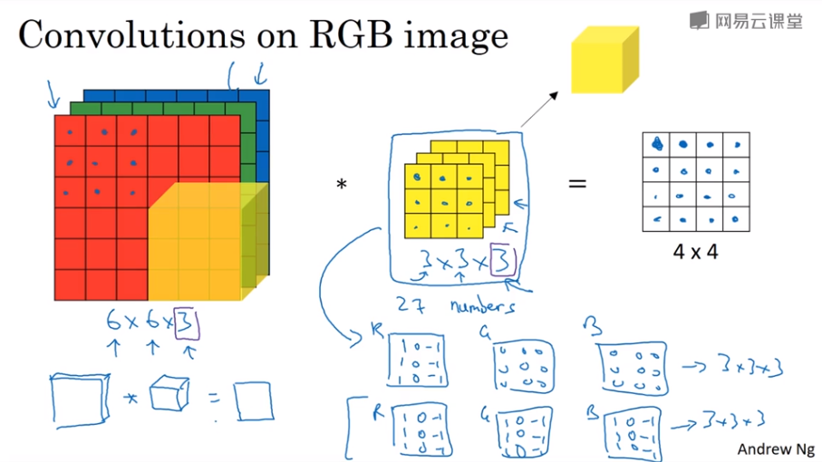

只检测红色的垂直边缘

检测所有颜色的垂直边缘

多个过滤器

## 单层卷积网络

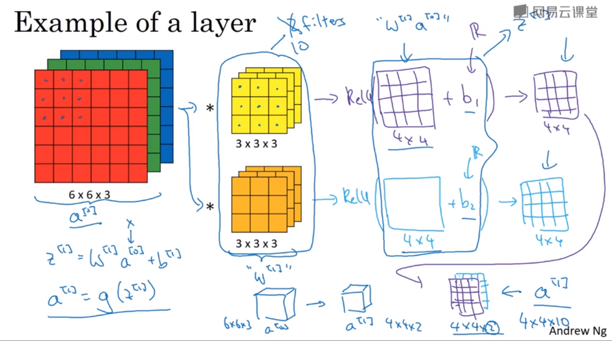

## 简单卷积网络示例

channel(depth)越来越大，Width和Height越来越小

Types of layer in a convolutional network

- Convolution

- Pooling

- Fully connected

## 池化层

Max pooling, Average pooling

Hyperparameters:

f：filter size

s：stride

$n_H×n_W×n_C——>\lfloor \frac{n_H-f}s+1\rfloor × \lfloor \frac{n_W-f}s+1\rfloor×n_H$

No parameters to learn！

## 卷积神经网络示例

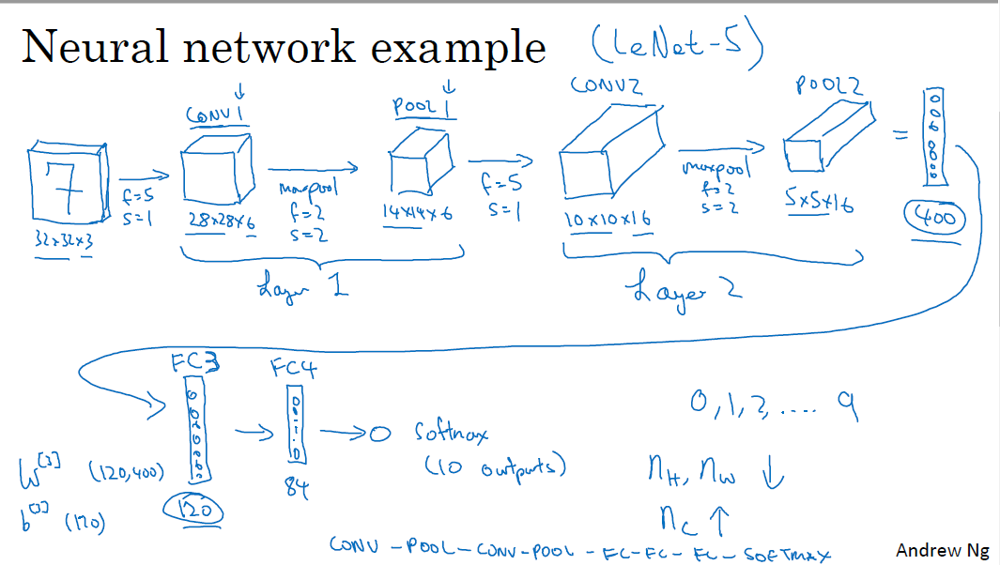

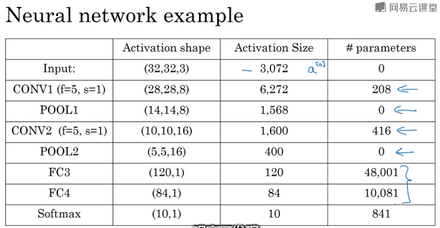

## 为什么使用卷积

参数共享和稀疏连接

Parameter sharing: A feature detector (such as a vertical edge detector) that's useful in one part of the image is probably useful in another part of the image.

Sparsity of connections: In each layer, each output value depends only on a small number of inputs.

Use gradient descent to optimize parameters to reduce $J$

# Deep convolutional models: case studies 

## Case studies

### 为什么要进行实例探究

### 经典网络

**LeNet-5**

**AlexNet**

**VGG-16**

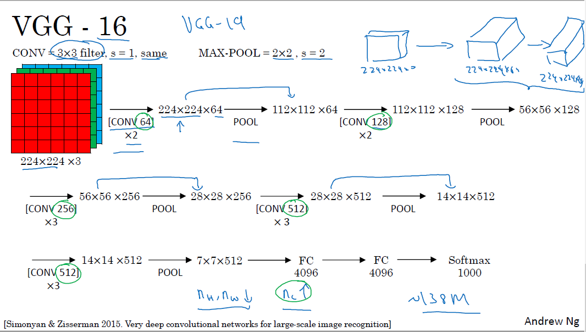

### 残差网络

Residual Nerworks(ResNets)

Residual block

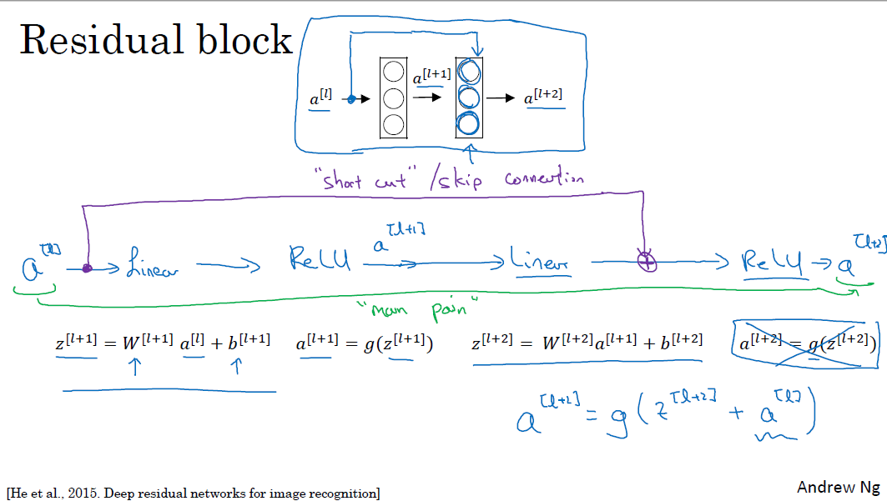

### 残差网络为什么有用

- **残差网络有什么意义？** 残差连接的主要作用是允许从前层直接访问特征，这让信息在整个网络中传播变得更加容易。

残差块学习恒等函数非常容易，效率并不比一般网络低

### 网络中的网络以及1×1卷积

- **为什么要使用很多小的卷积核，比如 3x3，而不是更大的卷积核？**VGGNet 论文（https://arxiv.org/pdf/1409.1556.pdf） 对此做了很好的解释。有两个原因：首先，你可以使用几个较小的卷积核来获取相同的感知字段并捕获更多的空间上下文，使用较小的卷积核意味着较少的参数和计算。其次，因为对于较小的卷积核，你需要使用更多的过滤器，这样就能够使用更多的激活函数，你的 CNN 就可以学习更具辨别力的映射函数。

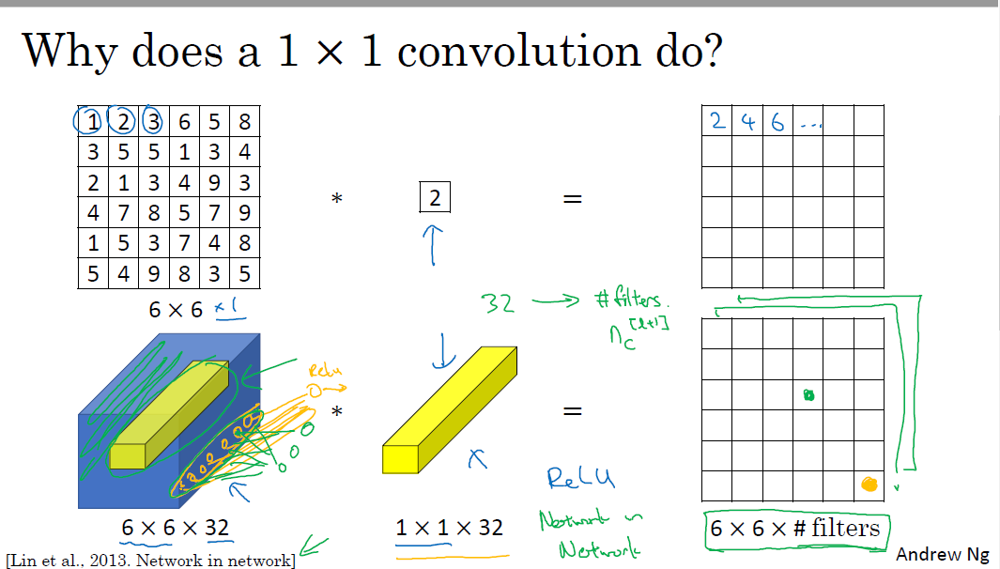

### 谷歌Inception网络

不需要人工选择过滤器维度，把所有可能扔给他，自己训练

### Inception网络

即GoogleNet

## Practical advices for using ConvNets

### 使用开源的实现方案

Github

### 迁移学习

数据不够，使用类似的神经网络的代码和权重，创造自己的输出层，训练输出层权重

这时可以提前计算好输出层之前的激活函数的输出，存到硬盘。这样之后再训练就可以减少计算成本

也可以重新训练多层的权重，数据量够的情况下。

如果数据足够多，训练所有的权重，将下载的权重作为初始化权重

### 数据扩充

Mirroring镜像, Random Cropping随机裁剪, Rotation旋转, Shearing剪切, Local warping局部弯曲

Color shifting颜色变换

Advanced:   PCA, AlexNet paper "PCA color augumentation"

### 计算机视觉现状

Two sources of knowledge

- Labeled data
- Hand engineered features/network architecture/other components

数据量少，更多的还是用手工特征工程

Tips for doing well on benchmarks/winning competitions

Ensembling

- Train several networks independently and average their outputs

Multi-crop at test time

- Run classifier on multiple versions of test images and average results
- 10-crop：对图像及镜像取中间的、四个角的图进行训练

Use open source code

- Use architectures of networks published in the literature
- Use open source implementations if possible
- Use pretrained models and fine-tune on your dataset

# Object detection algorithms

## 目标定位

不仅要判断图片物体是什么，还要判断其具体位置

除了物体类别，还要让神经网络输出物体的边框的四个数字，(bx, by, bh, bw)物体的中心点位置，高度，宽度

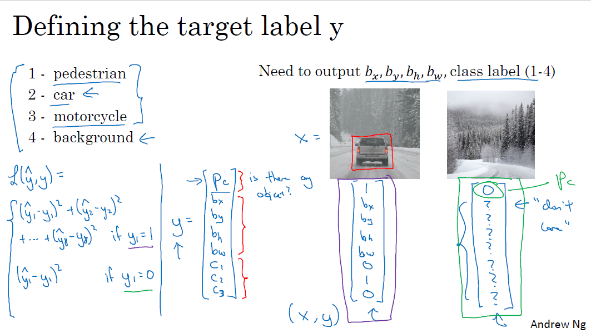

## 特征点检测

landmark detection

输出每个特征点的坐标，比如人脸识别中的眼睛、嘴巴、微笑等脸部特征

人体姿态检测，设定关键特征点，标注，训练，确定人物姿态动作

## 目标检测

Sliding windows detection滑动窗口目标检测方法

以固定幅度滑动窗口，遍历图像的每个区域，把这些剪切后的小图像输入卷积网络，然后进行分类

重复多次，扩大窗口大小

步幅小——成本高，步幅大——性能低

## 卷积的滑动窗口实现

## Bounding Box预测

YOLO algorithm

将图像分成很多个格子，对每个格子，都有一个标签y，就是上面目标定位中的y

不是对每个格子分别运行算法，而是利用卷积一次实现，所以运行速度很快，经常用于实时检测

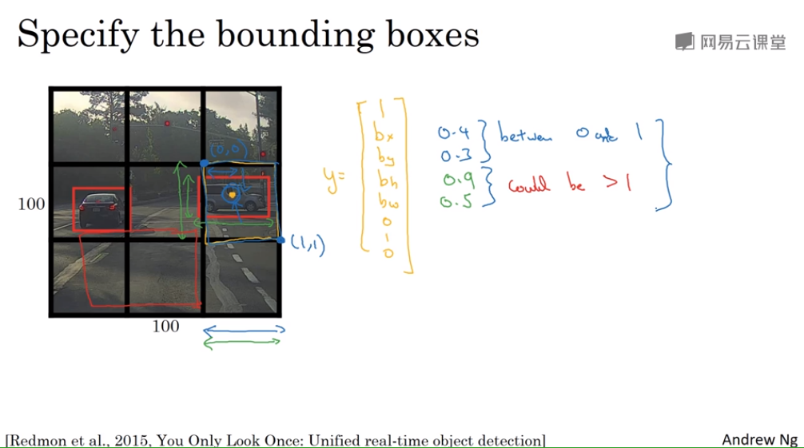

## 交并比

Intersection over union(IoU)

= size of intersection/size of union

其中intersection和union是预测边框与真实边框的交集和并集

Correct if IoU>=0.5

## 非极大值抑制

non-max suppression

## Anchor Boxes

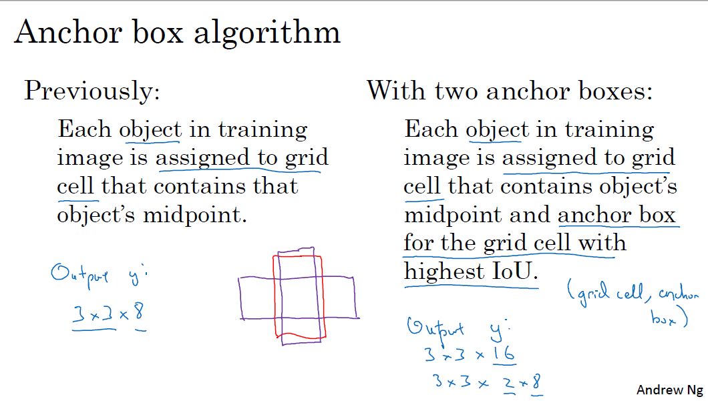

## YOLO算法

putting it together: YOLO algorithm

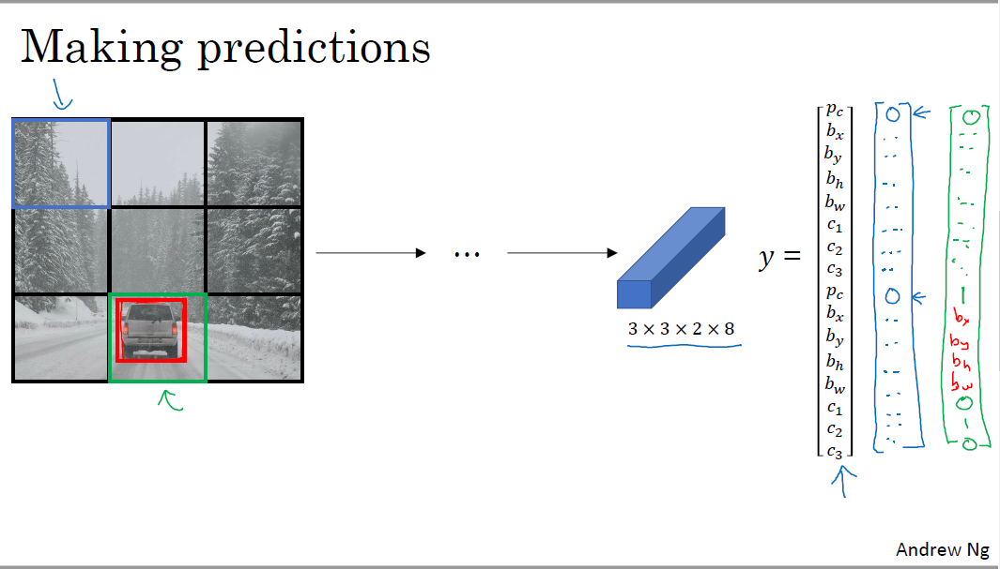

## RPN网络

## 目标检测算法实践(补充)

参考https://mp.weixin.qq.com/s/2mIuy4t3QUdSo0xaBuJRXA

https://medium.com/@jonathan_hui/what-do-we-learn-from-region-based-object-detectors-faster-r-cnn-r-fcn-fpn-7e354377a7c9

# Special applications: Face recognition & Neural style transfer 

## Face Recognition

### 什么是人脸识别

Face verification vs. face recognition

Verification

- Input image, name/ID
- Output whether the input image is that of the claimed person

Recognition

- Has a database of K persons
- Get an input image
- Output ID if the image is any of the K persons (or “not recognized”)

### One-shot learning

根据一张照片学习

Learning from one example to recognize the person again

Learning a "similarity" function

d(img1, img2) = degree of difference between images

If d(img1, img2) ≤ τ， "same"     else  "different"

### Siamese网络

用同样的卷积神经网络架构和参数，两个img作为输入，得到两个img的encoding，比较两个encoding的距离

Goal of learning

Parameters of NN define an encoding $f(x^{(i)})$

Learn parameters so that:

​	If $x^{(i)}, x^{(j)}$ are the same person, $||f(x^{(i)})-f(x^{(j)})||^2$ is small.

​	If $x^{(i)}, x^{(j)}$ are the different person, $||f(x^{(i)})-f(x^{(j)})||^2$ is large.

[Taigman et. al., 2014. DeepFace closing the gap to human level performance]

### Triplet 损失

为了阻止学习到的所有编码都是一样的，要加一个margin，并且拉大了正负样本两者之间的距离

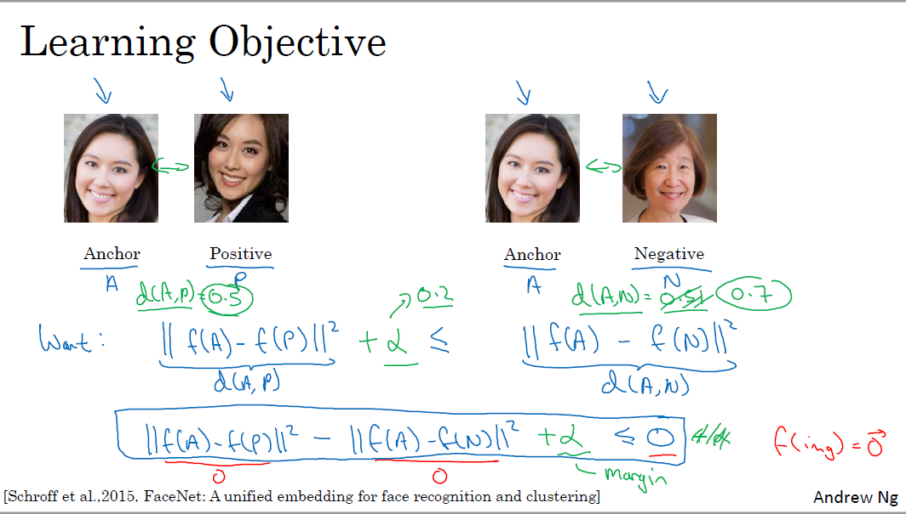

因为要求的训练集很大，成本较高，所以不必从头开始，可以下载别人的预训练模型

论文：A unified embedding for face recognition and clustering

### 面部验证与二分类

最后一层进行二分类，同一个人输出1，否则输出0

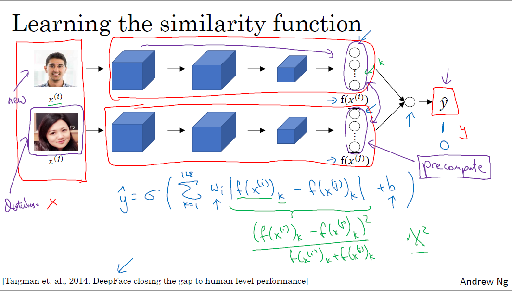

## Neural Style Transfer

### 什么是神经风格迁移

### 深度卷积网络在学什么

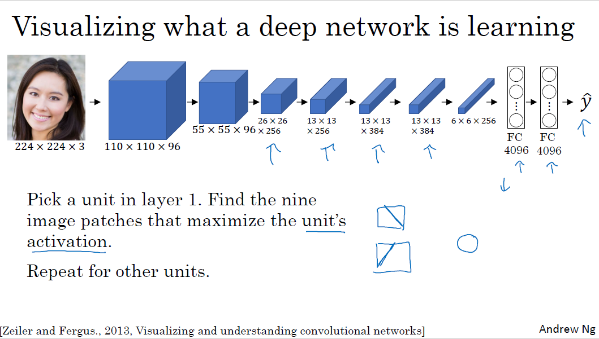

靠后的隐藏单元会看到更大的图片块

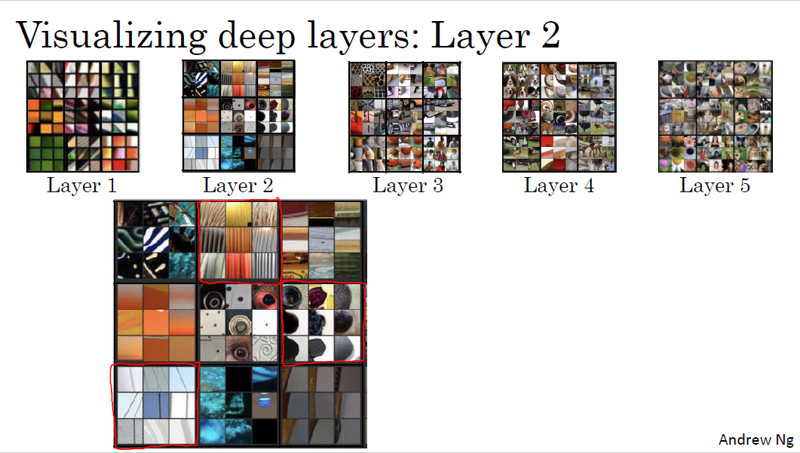

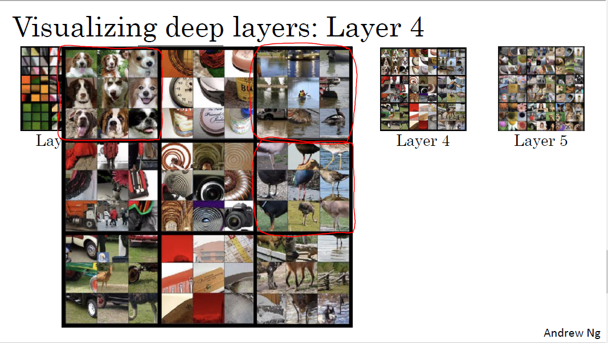

[Zeiler and Fergus., 2013, Visualizing understanding convolutional networks]

### 代价函数

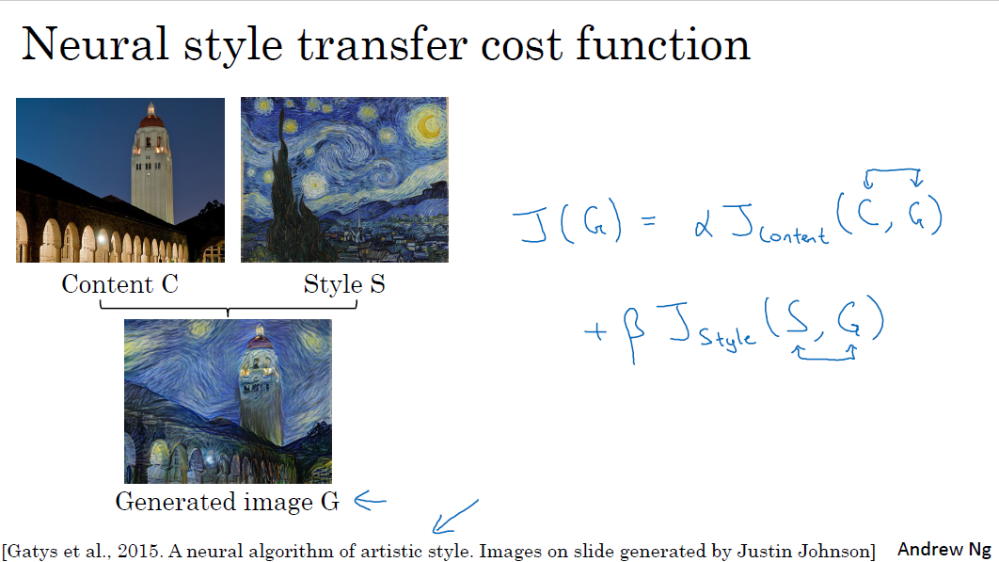

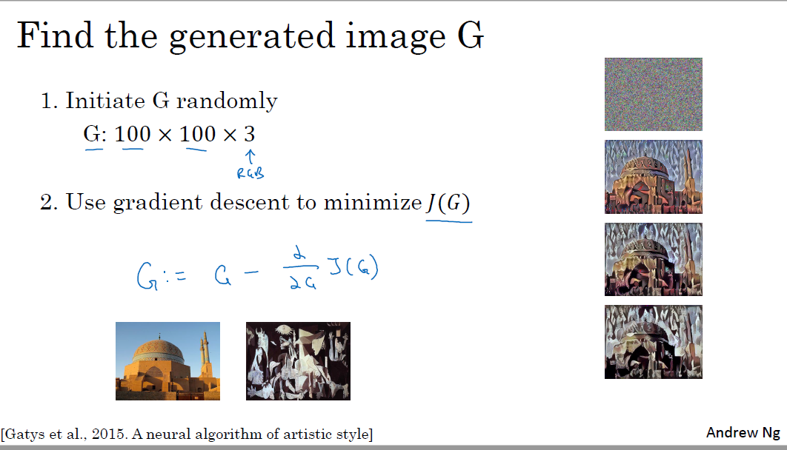

### 内容代价函数

### 风格损失函数

Say you are using layer 𝑙’s activation to measure “style.”
Define style as correlation between activations across channels.

How correlated are the activations across different channels?

相关系数描述了这些不同特征同时出现的概率

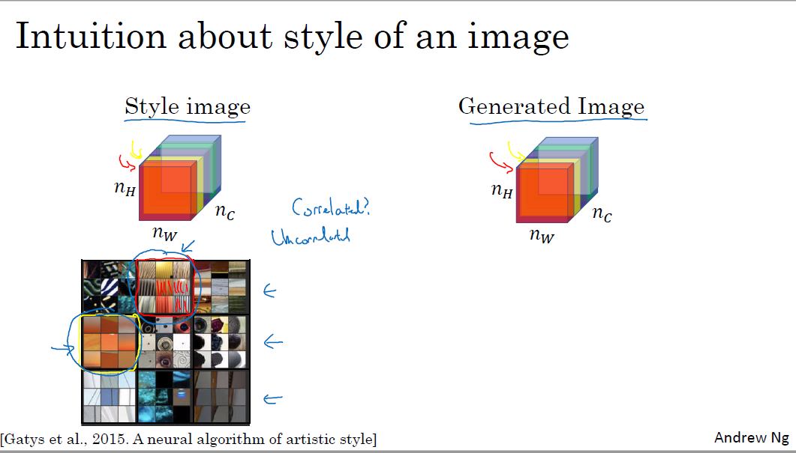

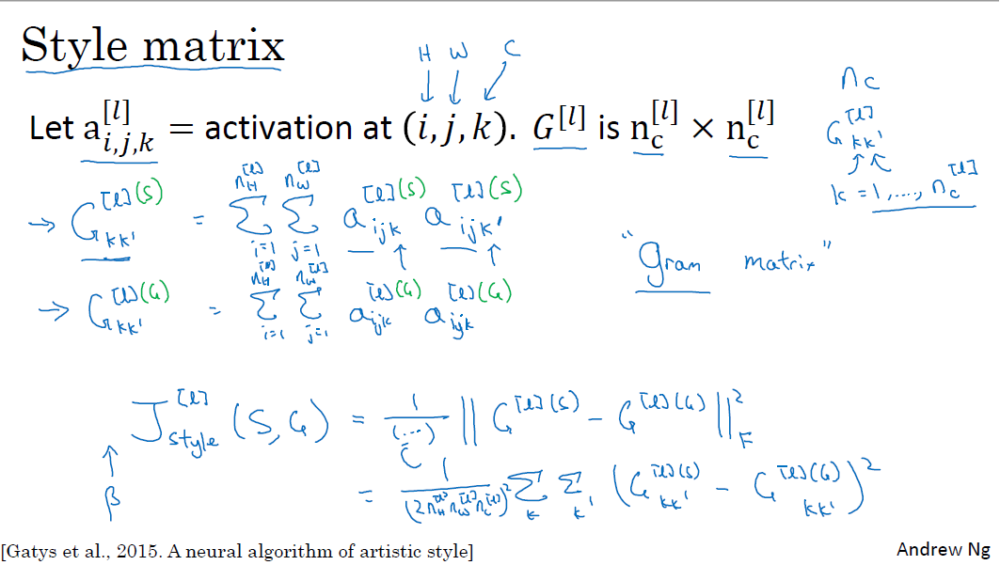

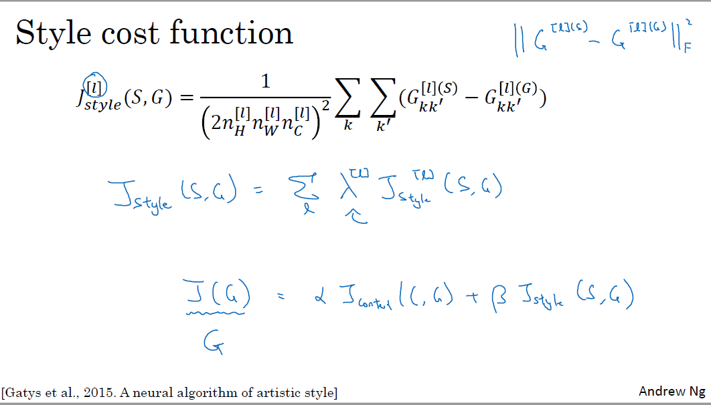

### 一维到三维卷积推广

14×1   *  5×1 ——> 10×16 (16 filters)   * 5×16——>  6×32  (32filters)

14×14×14×1   * 5×5×5×1  ——>10×10×10×16 （16 filters)   *  5×5×5×16 ——> 6×6×6×32   (32filters)

## 常见面试题

**在处理图像时，为什么使用卷积而不仅仅是 FC 层？** 这个问题非常有趣，因为公司通常不会问这样的问题。正如你所料，一家专注于计算机视觉的公司问了这个问题。这个问题的答案由两部分组成。首先，卷积保留、编码并实际使用图像的空间信息。如果我们只使用 FC 层，就没有相关的空间信息。其次，卷积神经网络（CNN）提供了部分内置的平移方差，因为每个卷积核都相当于自己的过滤器和特征检测器。

**是什么让 CNN 具备平移不变性？** 如上所述，每个卷积核都是自己的过滤器和特征检测器。因此，假设你正在进行对象检测，对象在图像中的位置并不重要，因为我们将以滑动窗口的方式在整个图像上应用卷积。

**为什么分段 CNN 通常具有编码器和解码器结构？** 编码器 CNN 基本上可以被认为是特征提取网络，而解码器使用这些信息来预测图像片段（通过“解码”特征并放大到原始图像大小）。

**为什么我们在分类 CNN 中有最大池化（max-pooling）？** 这也是我在面试一个计算机视觉相关职位是被问到的一个问题。CNN 中的最大池化可以减少计算，因为在池化后，特征图变得更小了。因为你正在进行最大程度的激活，所以不会丢失太多的语义信息。还有一种理论认为，最大池化有助于为 CNN 提供更多的方差平移。

