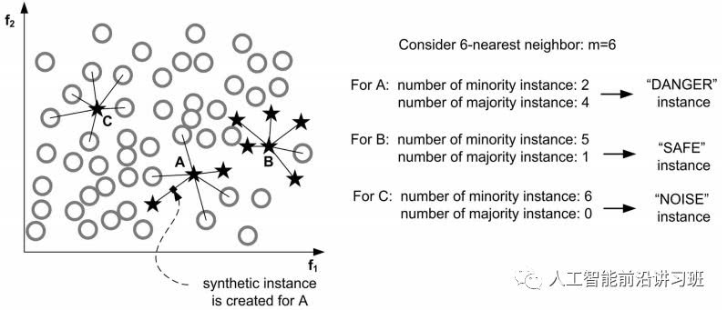
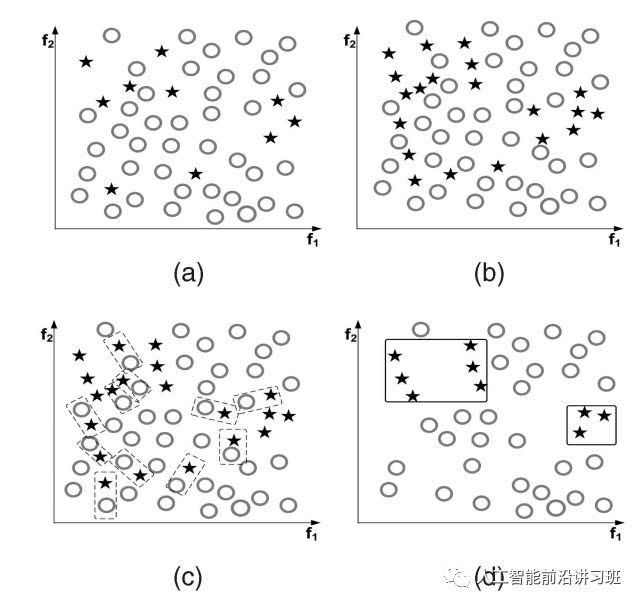

# 机器学习的流程与专业术语

### 什么是机器学习

**当经验以数据形式存储**，研究**算法**使得计算机可以从经验数据中学习，学习到的结果**(模型)**是可以对新情况**(更好地)** 完成**某个任务**。

训练经验E   性能标准P    任务T

###数据集

要进行机器学习，首先要有数据，这里我们又了一批关于西瓜的数据记录。这组记录的集合称为一个“数据集”(data set)

###示例/样本

数据集里每条记录对应关于一个对象（这里是西瓜）的描述，称为一个“示例”(instance)或“样本”(sample)

###属性/特征

每个样本对应的数据都反应了对象在某方面的表现或性质，例如“色泽”。这称为“属性”(attribute) 或“特征”(feature).

###属性值/特征值

每个样本对应的数据都反应了对象在某方面的表现或性质，例如“色泽”。这称为“属性”(attribute) 或“特征”(feature).某个特定样本对应的数据在某个属性上的值称为“属性值”或“特征值”。

###属性空间/特征空间

当我们用d个属性来表示一个对象。这d个属性相当于d个维度将张成一个d维的“属性空间”/“特征空间”。而每个样本对应的数据就是这个空间中的一个点，即一个n维向量，称为“特征向量”。

###标签/标记

机器学习的任务通常是对某些未知的信息（例如好瓜or坏瓜）做“预测”。用来标识样本关于未知信息的信息项成为“标签”。
“标签”的取值空间称为“标签空间”或“输出空间”。({0,1})

###训练/学习

从数据中学的模型的过程称为“学习”(learning)或“训练”(training), 这个过程通过执行某个算法来完成。

###训练数据

训练过程中使用的数据称为训练数据，其中每个样本称为训练样本。训练样本组成的集合称为训练集。

###测试

学得模型后，使用其进行预测的过程称为“测试”。被预测的样本称为“测试样本”

###分类/回归

当我们是用带有真实标签的训练集去学习到一个模型预测某些样本的标签。若我们欲预测标签的是离散值，此类学习任务称为“分类”，若欲预测的是连续值，此类学习任务称为“回归”。

###聚类

当我们的训练数据集中没有关于标签的信息。我们的任务是将训练集根据算法划分成若干个分组（“簇”）。这一任务将有助于我们了解数据内在的规律，以便更深入地分析数据。这样的学习任务称为“聚类”。

###监督学习/无监督学习

训练数据中有标记信息
-----监督学习(Supervised learning)
训练数据中没有标记信息
-----无监督学习(Unsupervised learning)

###强化学习

探索如何让机器在学习如何将场景（环境状态）映射到动作，以获取最大的奖赏。
例如探索如何让机器在种瓜过程中不断探索，最终总结出优秀种瓜策略

### ==VC维==

参考 http://www.flickering.cn/machine_learning/2015/04/vc%E7%BB%B4%E7%9A%84%E6%9D%A5%E9%BE%99%E5%8E%BB%E8%84%89/

H的VC维表示为VC(H) ，指能够被H分散的最大集合的大小。若H能分散任意大小的集合，那么VC(H)为无穷大。 

{二维线性分类器}的VC维是3。 

更一般地,在r 维空间中,**线性决策面的VC维为r+1**。

### ==假设空间==

假设数据集有n种属性，第i个属性可能的取值有ti种，加上该属性的泛化取值(*)（比如什么颜色都是好瓜），所以可能的假设有$∏_i(ti+1)$。再用空集表示没有正例，假设空间中一共$∏_i(ti+1)+1$种假设。

### ==生成模型与判别式模型==

==判别式模型==：给定x，可通过直接建模P(c|x)来预测c。比如决策树，BP神经网络，SVM支持向量机，条件随机场CRF，区分度训练，逻辑斯蒂回归，最近邻KNN，线性判别分析，Boosting，线性回归，CART，高斯过程

==生成式模型==：先对联合概率P(x,c)建模，然后得到P(c|x)。比如贝叶斯分类器，混合高斯模型，隐马尔科夫模型HMM，判别式分析，贝叶斯网络，Sigmoid Belief Networks，马尔科夫随机场，深度信念网络DBN

# 模型评估

## 什么是满意的模型/假设

### 泛化能力

机器学习的目标是使学得的模型能很好地适用于“新样本”，而不是仅仅在训练样本上工作得很好。即使对聚类这样的无监督学习任务，也希望学得的簇划分能适用于没在训练集中出现的样本。
模型适用于新样本的能力，成为“泛化”(generalization) 能力。

==具有强*泛化能力*的模型能很好地适用于**整个样本空间**==

==非监督学习算法对泛化能力也有要求==

####对训练集的偏好：

希望训练集能学习到适用于整个样本空间的假设。训练集作为样本空间的一个采样，能够很好地样本空间的全局特性。
假设样本空间中的样本服从一个未知分布
1.获得的训练样本都是独立地从这个分布上采样获得的，即“独立同分布”(independent and identically distributed, 简称i.i.d.)
2.样本数量尽可能多

####对假设和经验一致性的偏好：

对于新样本的预测标签与其真实标签尽可能一致（泛化误差低）

对于训练样本的预测标签与其真实标签尽可能一致（训练误差低）

为了对模型的泛化误差进行估计，通常将带标签的样本集抽取一部分出来作为“测试集”，其余作“训练集”，以在“测试集”上的“测试误差”作为“泛化误差”的近似。

####对假设复杂度的偏好：

“奥卡姆剃刀”（Occam’s razor）:
若有多个假设与观察一致，则选最简单的那个。
“简单有效原理”
“切勿浪费较多东西去做，用较少的东西，同样可以做好的事情。”

“没有免费的午餐”No free lunch theorem
All models are wrong, but some models are useful. —George Box
A set of assumptions that works well in one domain may work poorly in another

不要脱离了实际问题谈算法效果

## 效果度量

### 均方误差、错误率、精度

### 查准率、查全率、PR图、F1分数

**推荐系统中常用到 **

“判断为不会违约的申请中有多少比例会违约”
“所有不会违约的申请中有多少比例被挑了出来”

根据其真实类别与学习器预测类别的组合划分：
真正例(true positive)、假正例(falsepositive)、真反例(true negative)、假反例(falsenegative)
令TP、FP、TN、FN分别表示对应的样例数(TP+FP+TN+FN=样例总数)
定义：分类结果的“混淆矩阵”(confusion matrix)

| 真实情况 |  预测结果  |            |
| :------: | :--------: | :--------: |
|          |    正例    |    反例    |
|   正例   | TP(真正例) | FN(假反例) |
|   反例   | FP(假正例) | TN(真反例) |

按照某个学习器预测结果对样例进行排序
按照顺序逐个把样本作为正例进行预测
每次可以计算出当前的查全率、查准率
以查准率为纵轴、查全率为横轴做图，就得到了查准率-查全率曲线，简称“P-R曲线”

### 真/假正例率、ROC曲线、AUC

按照某个学习器预测结果对样例进行排序
按照顺序逐个把样本作为正例进行预测
每次计算出TPR与FPR，分别以它们为横、纵坐标作图

### 代价敏感

在现实任务重常常会遇到情况：不同类型的错误所造成的后果不同
为权衡不同类型错误所造成的不同损失，我们为不同的错误赋予“非均等代价”(unequal cost)：
根据任务的领域知识设定一个“代价矩阵”(cost matrix)：

##训练集和测试集的划分

###留出法

不同训练/测试集的划分将导致不同的评估结果。
单次使用留出法得到的估计结果往往不够稳定可靠。
故一般要采用若干次随机划分、重复进行实验评估后取平均值作为留出法的评估结果。

==数据集包含1000个样本，其中500个正例、500个反例，将其划分为包含70%样本的训练集和30%样本的测试集用于留出法评估，试估算共有多少种划分方式。==

按对应比例分别从正例中和反例中采样即可。

$n=C_{500}^{350}*C_{500}^{350}$

共有约  种划分方法。

### 交叉验证法

# 处理缺失值

**数据清理中，处理缺失值的方法是?**

由于调查、编码和录入误差，数据中可能存在一些无效值和缺失值，需要给予适当的处理。常用的处理方法有：估算，整例删除，变量删除和成对删除。

估算(estimation)。最简单的办法就是用某个变量的样本均值、中位数或众数代替无效值和缺失值。这种办法简单，但没有充分考虑数据中已有的信息，误差可能较大。另一种办法就是根据调查对象对其他问题的答案，通过变量之间的相关分析或逻辑推论进行估计。例如，某一产品的拥有情况可能与家庭收入有关，可以根据调查对象的家庭收入推算拥有这一产品的可能性。

整例删除(casewise deletion)是剔除含有缺失值的样本。由于很多问卷都可能存在缺失值，这种做法的结果可能导致有效样本量大大减少，无法充分利用已经收集到的数据。因此，只适合关键变量缺失，或者含有无效值或缺失值的样本比重很小的情况。

变量删除(variable deletion)。如果某一变量的无效值和缺失值很多，而且该变量对于所研究的问题不是特别重要，则可以考虑将该变量删除。这种做法减少了供分析用的变量数目，但没有改变样本量。

成对删除(pairwise deletion)是用一个特殊码(通常是9、99、999等)代表无效值和缺失值，同时保留数据集中的全部变量和样本。但是，在具体计算时只采用有完整答案的样本，因而不同的分析因涉及的变量不同，其有效样本量也会有所不同。这是一种保守的处理方法，最大限度地保留了数据集中的可用信息。

采用不同的处理方法可能对分析结果产生影响，尤其是当缺失值的出现并非随机且变量之间明显相关时。因此，在调查中应当尽量避免出现无效值和缺失值，保证数据的完整性。

数据清理中，处理缺失值的方法有两种：
删除法：1）删除观察样本
​       2）删除变量：当某个变量缺失值较多且对研究目标影响不大时，可以将整个变量整体删除
​       3）使用完整原始数据分析：当数据存在较多缺失而其原始数据完整时，可以使用原始数据替代现有数据进行分析
​       4）改变权重：当删除缺失数据会改变数据结构时，通过对完整数据按照不同的权重进行加权，可以降低删除缺失数据带来的偏差
查补法：均值插补、回归插补、抽样填补等
成对删除与改变权重为一类
估算与查补法为一类

# 数据规范化

**什么是数据规范化以及我们为什么需要它？** 

数据规范化是非常重要的预处理步骤，用于重新调整数值的范围，以确保在反向传播期间具有更好的收敛。通常的做法是减去每个数据点的平均值并除以标准偏差。如果我们不这样做，那么一些特征（具有高幅度的特征）将在成本函数中得到更多的加权（如果高幅度的特征变化 1％，实际上变化是相当大的，但对于较小的特征效果就没有那么明显）。数据规范化可以让所有特征均等加权。

# 探索性数据分析（EDA）

**你是如何进行探索性数据分析（EDA）的？**

EDA 的目标是在应用预测模型之前从数据中收集一些见解。基本上，你应该以从粗略到精细的方式进行 EDA。我们从获得一些高级别的全局见解开始，然后检查一些不平衡的类和每个类的均值和方差。检查前几行，了解它们是关于什么的。运行 pandas 的 df.info() 来检查哪些特征是连续的、分类的以及它们的类型（int、float、string）。接下来，删除在分析和预测中用不到的列。这些列可能看起来就是毫无用处的，它们要么具有相同的值（即不会给我们提供太多的信息），要么缺少值。我们还可以使用最常见的值或中位数来填充缺失值。然后，我们可以开始进行一些基本的可视化。先从高级别的东西开始。对于已经分类的且具有少量组的特征，可以为它们绘制条形图。找出最“一般的特征”，为这些特征单独进行可视化，尝试从中获得一些基本见解。现在我们可以开始更具体的可视化了。在特征之间创建可视化，一次两个或三个。特征之间是如何相互关联的？你还可以通过 PCA 来找出哪些特征包含最多信息。将一些特征组合在一起，以查看它们之间的关系。例如，当 A=0 且 B=0 时，类会发生什么？A=1 和 B=0 呢？比较不同的特征。例如，如果特征 A 可以是“女性”或“男性”，那么我们就可以绘制出特征 A 对应的桶，看看男性和女性是否处于不同的桶中。除了条形图、散点图和其他基本图之外，我们还可以绘制 PDF/CDF 和叠加图等。查看一些统计信息，如分布、p 值等。最后是构建 ML 模型的时候了。先从朴素贝叶斯和线性回归这些简单的东西开始。如果你发现这些行不通，或者数据是高度非线性的，就要使用多项式回归、决策树或 SVM。可以根据 EDA 的重要性选择特征。如果你有大量数据，可以使用神经网络。

#类别不平衡问题

当不同类别的训练样例数目差别很大的时候，将对一些传统机器学习模型的训练造成困扰。
困扰何在？
假设我们现在的任务是判断交易欺诈。
历史交易中的欺诈记录却很少。
欺诈行为带来的损失又是巨大的。所以希望尽可能地将欺诈行为给判断出来。
假设我们的训练数据包含10,000个真实交易以及10个欺诈交易。那么用这个数据训练模型（找寻假设）的时候，模型将所有的交易行为判断为真实交易即能够达到超过99.9%的准确度。一个“好模型”?

如何解决？

假定正例样本很少，反例样本很多。

**欠采样**：
去除一些反例样本使得正、反数据接近。然后再进行学习。
**过采样（重采样）**：
增加一些正例样本使得正、反数据接近。然后再进行学习。
**代价敏感**：
增加将正例样本错判为负例样本的惩罚。或采用“阈值移动”的方法。

$\frac{y'}{1-y'}=\frac{y}{1-y}\times \frac{m^+}{m^-}$

欠采样法的时间开销通常远小于过采样法，因为前者丢弃了很多反例，使得分类器训练集远小于初始训练集，而过采样法增加了很多正例，其训练集大于初始训练集。
过采样法不能简单地对初始整理样本进行重复采样，否则会招致严重的过拟合；过采样法的代表性算法SMOTE是通过对训练集里的正例进行插值来产生额外的正例。
欠采样法若随机丢弃反例，可能丢失一些重要信息；欠采样法的代表性算法EasyEnsemble则是利用集成学习机制，将反例划分为若干个集合供不同学习器使用，这样对每个学习器来看都进行了欠采样，但在全局来看却不会丢失重要信息。

### **数据层面策略：采样技术** 

**随机欠采样和随机过采样**

随机欠采样是针对数据较多的类别下手。通过随机从样本较多的数据类中采样得到一个较小的子集，将此子集和数据较少的类结合作为新的数据集。 

欠采样的优缺点都很明显。优点是在平衡数据的同时减小了数据量，加速训练，尤其是当样本集规模很大的时候。但是这也正是造成其缺点的主要原因，数据减少会影响模型的特征学习能力和泛化能力。

与欠采样相反的是，过采样通过随机复制样本较少类别中的样本以期达到减少不平衡的目的。

过采样的优缺点也很明显。优点是相对于欠采样的方法，过采样没有导致数据信息损失，在实际操作中一般效果也好于欠采样。但是由于对较少类别的复制，过采样增加了过拟合的可能性。 

**基于聚类的过采样** 

这种方法先对不同的类别分别进行聚类，一般情况下设置样本较多的类聚类中心数目较多，而样本较少的类聚类中心较少。然后通过对每个cluster进行过采样/欠采样使原始类别中所有的cluster有相同数目的样本。 

这种方法通过聚类作为中介不但一定程度上缓解了类间的样本不平衡问题，还一定程度上缓解了类内的不平衡问题。但是这种方法和一般的过采样方法一样容易使模型对训练数据过拟合。 

**Informed Over Sampling (SMOTE)** 

由于在一般的过采样方法中直接复制少数类别中的样本容易造成模型泛化能力下降，所以就提出了这种利用人造数据的方法减弱过采样带来的过拟合的方法。这种方法先对数据较少的类别抽取一个子集，然后对这个子集进行过采样。但是这时的过采样不再是直接复制，而是利用人为的方法生成相似的样本。

SMOTE的人为生成方式很简单，如下图b中的一个样本xi，先找到其近邻的K个样本，然后从这几个近邻样本中随机选取一个xi^hat，利用以下公式即可得到新的人工生成样本：

$x_{new}=x_i +(\hat x_i -x_i)\times \delta$

如果是下图所示的二维情况，可以看成是在两者连线中间选择了一个点作为人工样本。 

这种方法的优点是通过人造相似样本取代直接复制的方法减弱了过拟合，也没有丢失有用的信息。但是这种方法在进行人工合成样本时没有考虑进去近邻样本可能来自于不同类别，导致增大类别间的重叠。另外SMOTE在数据维度很高时效率很低。 

**Borderline-SMOTE** 

SMOTE没有考虑样本较少的那个类别（minority classes）自身潜在的分布，Borderline-SMOTE在此上面进行了优化。

MSMOTE通过计算minority classes最近邻K个样本中属于原始类别(minority和majority)的比例将minority classes分为三个不同的组：Danger，Safe，Noise。如下图中A属于Noise，B属于Safe，C属于Danger。

然后只对Danger中的样本采用SMOTE算法，其他两类不再过采样。

除了Borderline-SMOTE外，还有ADASAN等自适应人工合成样本的方式

**基于数据清洗的SMOTE** 

正如前文所示，实际的数据中不但存在样本不均衡的问题，还经常伴随着不同类别的样本重叠问题，如下图a所示。如果直接进行SMOTE过采样，得到的结果如b所示，虽然minority classes样本数目增多了，但是样本的重叠反而加剧了，很明显这并不有利于分类。

如果此时有一种数据清洗技术可以去掉一些重叠样本，那么对分类来说将会十分有益。这就是将要讲述的Tomek Links方法。对于一对样本(x_i, x_j)其中x_i来自于minority classes，x_j来自于majority classes。如果不存在一个x_k使得：

$d(x_i,x_k) < d(x_i, x_j) 或者d(x_j, x_k) < d(x_i, x_j)$

那么称(x_i, x_j)是一个TomekLink。如下图c中的虚线矩形框中的样本对。当得到TomekLink之后，移去所有的Tomek Link并且反复进行。得到结果如d所示。此时样本的重叠大大减小。Tomek Link的优势在于可以和很多算法结合起来，如CNN+Tomek Link。 

### **算法策略： 集成算法** 

集成策略通常通过将多个分类器结果进行融合来提高算法效果。 

**Bagging** 

Bagging是Bootstrap Aggregating的缩写。传统的Bagging算法先生成n个不同的bootstrap训练样本集，然后将算法分别在每个样本集上进行训练，最后将所有的预测结果进行融合。Bagging在一定程度上可以减弱过拟合。和Boosting不同的是，Bagging是允许有放回的数据重采样。 

Bagging的优点是可以提高算法的稳定性和准确率，减弱算法的variance和过拟合，而且在噪声样本环境下，Bagging通常比Boosting表现要好。但是Baging的问题是只在基础分类器都能产生想对不错的结果的时候work，如果有的基础分类器结果很差，可能会很严重的影响Bagging的结果。 

**Boosting**

Boosting通过将弱分类器结合起来构成强分类器。在新一轮的迭代中，新的分类器更加关注上一轮训练中分类错误的样本，给这些样本赋予更大的权重。Ada Boost是Boosting算法中的一个代表。

注意在Boosting算法中所谓的弱分类器的基本假设是其要率好于随机选择的结果，这样才能保证集成之后能提供一个更好的效果。

Boosting算法实现起来很容易并且有很好的泛化性，但是其缺点是对于噪音和离群点比较敏感。

在深度学习流行之前，XG Boost一度占据了Kaggle冠军的大半壁江山。即使现在深度学习如此火热，XG Boost仍然没有落伍，Kaggle比赛仍有很多将其与深度学习结合取得冠军的例子。XG Boost由于其并行执行的特性使其10倍速度于其他的Boosting技术。并且其可以很容易的使用各种自定义的优化器和评价标准，而且其在处理missing value方面表现非常好。

在面对不均衡数据时，没有一步到位的算法可以解决，可能需要尝试多种策略寻找最适应数据集的算法。在大多数情况下，数据合成方法中的SMOTE及其衍生品效果优于其他数据平衡方法。经常的做法是将SMOTE等数据合成方法与Bagging和Boosting等算法结合起来一起使用。

不平衡数据处理算法的研究现在依然不少，只是多数情况下会与具体研究的方向结合起来。如2017年的focal loss在目标检测领域大获成功，其简洁又有效的思路让人眼前一亮。

其它资料：

《8 Tactics to Combat Imbalanced Classes in Your Machine LearningDataset》

来源：https://mp.weixin.qq.com/s/Mc8yYkDTj7I2KYGALceHfw

# 过拟合

 

应该尽可能地学出适用于所有潜在样本的“普遍规律”

可能把训练样本自身的一些特点当做了所有潜在样本都会具有的一般性质，从而导致泛化能力下降。这种现象 在机器学习中称为“过拟合”(overfitting)

与“过拟合”相对的是“欠拟合”(underfitting)，这是指对训练样本的一般性质尚未学好

 

 

==**偏差-方差窘境(bias-variance dilemma)**==

偏差.
偏差度量了学习算法的期望预测与真实结果的偏离程序, 即 刻画了学习算法本身的拟合能力 .

方差.
方差度量了同样大小的训练集的变动所导致的学习性能的变化, 即 刻画了数据扰动所造成的影响 .

噪声.
噪声表达了在当前任务上任何学习算法所能达到的期望泛化误差的下界, 即 刻画了学习问题本身的难度 . 巧妇难为无米之炊, 给一堆很差的食材, 要想做出一顿美味, 肯定是很有难度的.

想当然地, 我们希望偏差与方差越小越好, 但实际并非如此. 一般来说, 偏差与方差是有冲突的, 称为偏差-方差窘境 (bias-variance dilemma).

假定我们能够控制学习算法的拟合能力

当学习器的拟合能力不够强时，训练数据的扰动不足以使得学习器产生显著变化，此时偏差主导了泛化错误率
当学习器的拟合能力逐渐增强，训练数据发生的扰动渐渐能够被学习器学到，方差逐渐主导了泛化错误率
当学习器的拟合能力非常强时，训练数据发生的轻微扰动都会使得学习器发生显著变化。若训练数据自身的、非全局的特性被学习器学到了，则发生了过拟合。

欠拟合则通常是由学习能力低造成的，增加模型的复杂度可以解决（e.g., 增加多项式的最高幂）

有多种因素可能导致过拟合，其中最常见的情况是由于学习能力过于强大，以至于把训练样本所包含的不太一般的特性都学到了
**过拟合是机器学习面临的关键障碍，研究重点。各类算法在提出之后，都有人在研究避免其过拟合的措施。**

==过拟合：增大数据规模、减小数据特征数（维数）、增大正则化系数λ
欠拟合：增多数据特征数、添加高次多项式特征、减小正则化系数λ==

特征数非常多时，用线性函数也可能导致过拟合。

 

 

L1正则化的求解可以使用近端梯度下降（Proximal Gradient Descent，PGD）
P. L. Combettesand V. R. Wajs, “Signal recovery by proximal forwardbackwardsplitting,” MultiscaleModeling and Simulation, vol. 4, no. 4, pp. 1168–1200, 2006.

从经验风险最小化的角度来看，结构风险表达了我们希望获得具有何种性质的模型（例如希望获得复杂度较小的模型）。这是一种引入领域知识和用户意图的途径。另一方面，该信息有助于削减假设空间，从而降低了最小化训练误差的过拟合风险。

L_p 范数是常用的正则化项，其中L_2 范数倾向于w的分量取值尽量均衡，即非零分量个数尽量稠密，而L_0 范数和L_1 范数则倾向于w的分量尽量稀疏，即非零分量个数尽量少。

==防止过拟合的方法==

https://www.zhihu.com/question/59201590

- simpler model structure
- regularization
- data augmentation
- dropout
- Bootstrap/Bagging
- ensemble
- early stopping
- utilize invariance
- Bayesian

#范数

## L0范数与L1范数

L0范数是指向量中非0的元素的个数。如果我们用L0范数来规则化一个参数矩阵W的话，就是希望W的大部分元素都是0。换句话说，让参数W是稀疏的。

L1范数是指向量中各个元素绝对值之和，也有个美称叫“稀疏规则算子”（Lasso regularization）。

为什么L1范数会使权值稀疏？它是L0范数的最优凸近似。任何的规则化算子，如果他在Wi=0的地方不可微，并且可以分解为一个“求和”的形式，那么这个规则化算子就可以实现稀疏。

一是因为L0范数很难优化求解（NP难问题），二是L1范数是L0范数的最优凸近似，而且它比L0范数要容易优化求解。所以大家才把目光和万千宠爱转于L1范数。

为什么要稀疏？

**1）特征选择(Feature Selection)**

**2）可解释性(Interpretability)**

只有少数特征是非零的，说明观测目标只与这几个特征有关

## L2范数

回归里，又称为岭回归（Ridge Regression），或权值衰减（weight decay）。

它主要用于改善过拟合问题。

L2范数是指向量各元素的平方和然后求平方根。我们让L2范数的规则项||W||2最小，可以使得W的每个元素都很小，都接近于0，但与L1范数不同，它不会让它等于0，而是接近于0。而越小的参数说明模型越简单，越简单的模型则越不容易产生过拟合现象。

L2范数的好处

**1）学习理论的角度：**

​       从学习理论的角度来说，L2范数可以防止过拟合，提升模型的泛化能力。

**2）优化计算的角度：**

​       从优化或者数值计算的角度来说，L2范数有助于处理 condition number不好的情况下矩阵求逆很困难的问题。

**关于condition number**

优化有两大难题，一是：局部最小值，二是：ill-condition病态问题。

ill-condition对应的是well-condition。假设我们有个方程组AX=b，我们需要求解X。如果A或者b稍微的改变，会使得X的解发生很大的改变，那么这个方程组系统就是ill-condition的，反之就是well-condition的。

因为一般我们的系数矩阵A和b是从实验数据里面估计得到的，所以它是存在误差的，如果我们的系统对这个误差是可以容忍的就还好，但系统对这个误差太敏感了，以至于我们的解的误差更大，那这个解就太不靠谱了。所以这个方程组系统就是ill-conditioned病态的

condition number就是拿来衡量ill-condition系统的可信度的。condition number衡量的是输入发生微小变化的时候，输出会发生多大的变化。也就是系统对微小变化的敏感度。condition number值小的（1附近）就是well-conditioned的，大的（远大于1）就是ill-conditioned的。

如果方阵A是非奇异的，那么A的conditionnumber定义为矩阵A的norm乘以它的逆的norm。

如果方阵A是奇异的，那么A的condition number就是正无穷大了。

## 核范数

核范数||W||*是指矩阵奇异值的和，英文称呼叫Nuclear Norm。

作用：约束Low-Rank（低秩）

如果矩阵之间各行的相关性很强，那么就表示这个矩阵实际可以投影到更低维的线性子空间，也就是用几个向量就可以完全表达了，它就是低秩的。

如果矩阵表达的是结构性信息，例如图像、用户-推荐表等等，那么这个矩阵各行之间存在着一定的相关性，那这个矩阵一般就是低秩的。

因为rank()是非凸的，在优化问题里面很难求解，那么就需要寻找它的凸近似来近似它了。rank(w)的凸近似就是核范数||W||*。

低秩的应用：

矩阵填充，鲁棒PCA，背景建模，变换不变低秩纹理（TILT）

https://blog.csdn.net/zouxy09/article/details/24971995

https://blog.csdn.net/zouxy09/article/details/24972869