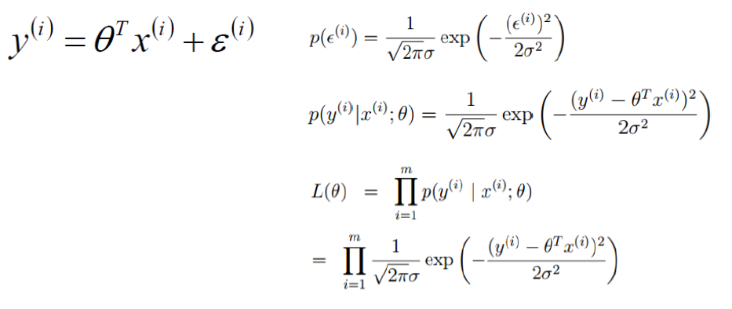
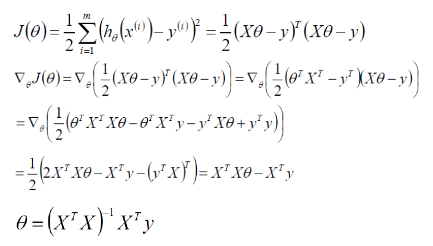

# 线性回归

决策函数：$f(x) = w_1x_1 + w_2 x_2 + ... + w_d x_d + b = w^T x + b$

线性模型形式简单、易于建模，但却蕴涵着机器学习中一些重要的基本思想。许多功能更为强大的非线性模型可在线性模型的基础上通过引入层级结构或高维映射而得。此外，由于w直观表达了各属性在预测中的重要性，因此线性模型有更好的可解释性。例如影响目标的因素有哪些，哪个因素最重要等。

考虑单调可微函数g(.)，令 $y=g^{-1}(w^Tx+b)$，这样的模型称为"广义线性模型"，其中函数g称为"联系函数"(link function).对数线性回归是广义线性模型在g(.)=ln(.)时的特例。

损失函数：squared error  $ err(\hat{y}, y) = (\hat{y}, y)^2 $

###**损失函数的推导**-极大似然

$y^{(i)}=\theta^Tx^{(i)}+\epsilon^{(i)}$

误差$\epsilon^{(i)}$是独立同分布的，通常认为服从均值为0方差为$\sigma^2$的高斯分布(可以通过平移得到均值为0)

之所以独立同分布，可以理解为不同样本之间是独立的，希望决策函数对每个样本拟合的误差服从同一个分布。






###**最小化损失函数（参数学习/假设搜索）**

均方误差，对应了常用的欧几里得距离。基于均方误差最小化来进行模型求解的方法称为"最小二乘法"。

$$   (w^*,b^*) = \mathop{\arg\min}_{(w,b)} \sum\limits_{i=1}^{m}(f(x_i)-y_i)^2=arg min_{(w,b)} \sum\limits_{i=1}^{m}(y_i-wx_i-b)^2 $$


矩阵为满秩矩阵或正定矩阵时，可逆；不可逆时，存在多个解，选择哪个由学习算法的归纳偏好决定，常见的做法是引入正则化项。

###**基于梯度下降的参数学习/假设搜索**

梯度下降法：求解无约束优化问题最简单、最经典的方法之一

当目标函数为凸函数时，局部极小点对应着函数的全局最小点，此时梯度下降法可确保收敛到全局最优解


考虑无约束优化问题$min_x f(x)$, 其中f(x)为连续可微函数

若能构造一个序列$x^0, x^1, x^2,...满足f(x^{t+1}) < f(x^t), t=0,1,2,...$

则不断执行该过程即可收敛到局部极小点

根据泰勒展开式有$f(x+\Delta x) ~= f(x) + \Delta x^T \nabla f(x) $

于是，欲满足$f(x+\Delta x) < f(x)$，可选择 $ \Delta x = -\gamma\nabla f(x)$

其中步长$\gamma$ 是一个小常数。这就是梯度下降法


为了找到一个函数的局部极小值，于是让x朝着当前点对应梯度（或者是近似梯度）的反方向行走一定的距离进行迭代搜索


批量梯度下降，随机梯度下降，小批量梯度下降


迭代终止：
定义一个合理的阈值，当两次迭代之间的差值小于该阈值时，迭代结束;
设置一个大概的迭代步数;
设置函数阈值；


# 线性分类(逻辑回归)

如何使用线性模型进行回归学习？只需找一个单调可微函数将分类任务的真实标记y与线性回归模型的预测值联系起来。

g'(x)=g(x)(1-g(x))

对数几率回归方法的优点：

1. 它是直接对分类可能性进行建模，无需实现假设数据分布，这样就避免了假设分布不准确所带来的问题；
2. 它不是仅预测出“类别”，而是可得到近似概率预测，这对许多需利用概率辅助决策的任务很有用；
3. 对数函数是任意阶可导的凸函数，有很好的数学性质，现有的许多数值优化算法都可直接用于求取最优解。


 

 

**连续特征如何离散化，为什么要离散化**

连续特征的离散化：在什么情况下将连续的特征离散化之后可以获得更好的效果？

Q:CTR预估，发现CTR预估一般都是用LR，而且特征都是离散的。为什么一定要用离散特征呢？这样做的好处在哪里？

A:

在工业界，很少直接将连续值作为逻辑回归模型的特征输入，而是将连续特征离散化为一系列0、1特征交给逻辑回归模型，这样做的优势有以下几点：

0、 离散特征的增加和减少都很容易，易于模型的快速迭代。(离散特征的增加和减少，模型也不需要调整，重新训练是必须的，相比贝叶斯推断方法或者树模型方法迭代快)

1、稀疏向量内积乘法运算速度快，计算结果方便存储，容易扩展；

2、离散化后的特征对异常数据有很强的鲁棒性：比如一个特征是年龄>30是1，否则0。如果特征没有离散化，一个异常数据“年龄300岁”会给模型造成很大的干扰；离散化后年龄300岁也只对应于一个权重，如果训练数据中没有出现特征"年龄-300岁"，那么在LR模型中，其权重对应于0，所以，即使测试数据中出现特征"年龄-300岁",也不会对预测结果产生影响。特征离散化的过程，比如特征A，如果当做连续特征使用，在LR模型中，A会对应一个权重w,如果离散化，那么A就拓展为特征A-1，A-2，A-3...,每个特征对应于一个权重，如果训练样本中没有出现特征A-4，那么训练的模型对于A-4就没有权重，如果测试样本中出现特征A-4,该特征A-4也不会起作用。相当于无效。但是，如果使用连续特征，在LR模型中，y = w*a,a是特征，w是a对应的权重,比如a代表年龄，那么a的取值范围是[0..100]，如果测试样本中,出现了一个测试用例，a的取值是300，显然a是异常值，但是w*a还是有值，而且值还非常大，所以，异常值会对最后结果产生非常大的影响。

3、逻辑回归属于广义线性模型，表达能力受限；单变量离散化为N个后，每个变量有单独的权重，相当于为模型引入了非线性，能够提升模型表达能力，加大拟合；在LR模型中，特征A作为连续特征对应的权重是Wa。A是线性特征，因为y = Wa*A,y对于A的导数就是Wa,如果离散化后，A按区间离散化为A_1,A_2,A_3。那么y = w_1*A_1+w_2*A_2+w_3*A_3.那么y对于A的函数就相当于分段的线性函数，y对于A的导数也随A的取值变动，所以，相当于引入了非线性。

4、 离散化后可以进行特征交叉，加入特征A 离散化为M个值，特征B离散为N个值，那么交叉之后会有M*N个变量，进一步引入非线性，提升表达能力；

5、特征离散化后，模型会更稳定，比如如果对用户年龄离散化，20-30作为一个区间，不会因为一个用户年龄长了一岁就变成一个完全不同的人。当然处于区间相邻处的样本会刚好相反，所以怎么划分区间是门学问；按区间离散化，划分区间是非常关键的。

6、特征离散化以后，起到了简化了逻辑回归模型的作用，降低了模型过拟合的风险。(当使用连续特征时，一个特征对应于一个权重，那么，如果这个特征权重较大，模型就会很依赖于这个特征，这个特征的一个微小变化可能会导致最终结果产生很大的变化，这样子的模型很危险，当遇到新样本的时候很可能因为对这个特征过分敏感而得到错误的分类结果，也就是泛化能力差，容易过拟合。而使用离散特征的时候，一个特征变成了多个，权重也变为多个，那么之前连续特征对模型的影响力就被分散弱化了，从而降低了过拟合的风险。)

 

李沐曾经说过：模型是使用离散特征还是连续特征，其实是一个“海量离散特征+简单模型” 同 “少量连续特征+复杂模型”的权衡。既可以离散化用线性模型，也可以用连续特征加深度学习。就看是喜欢折腾特征还是折腾模型了。通常来说，前者容易，而且可以n个人一起并行做，有成功经验；后者目前看很赞，能走多远还须拭目以待。

http://www.zhihu.com/question/28641663/answer/41653367

# 其他问题(从线性到非线性、从二分类到多分类、类别不平衡)

###从线性到非线性

 

 

 

 


###从二分类到多分类 

 

 

# 参数调节

本质就是模型选择：不同的参数对应不同的模型

如何构建候选模型（参数）集合：
将各参数变量值的可行区间（可从小到大），划分为一系列的小区
产生对应各参数变量值组合
计算各参数组合下的模型的性能
逐一比较择优，从而求得最佳参数组合。

 

#==线性分类器==

**以下()属于线性分类器最佳准则?**

```
感知准则函数
贝叶斯分类
支持向量机
Fisher准则
```

ACD，[赵子龙](https://www.nowcoder.com/profile/730218)

线性分类器有三大类：感知器准则函数、SVM、Fisher准则，而贝叶斯分类器不是线性分类器。

感知器准则函数：代价函数J=-(W*X+w0)，分类的准则是最小化代价函数。感知器是神经网络（NN）的基础，网上有很多介绍。

SVM：支持向量机也是很经典的算法，优化目标是最大化间隔（margin），又称最大间隔分类器，是一种典型的线性分类器。（使用核函数可解决非线性问题）

Fisher准则：更广泛的称呼是线性判别分析（LDA），将所有样本投影到一条远点出发的直线，使得同类样本距离尽可能小，不同类样本距离尽可能大，具体为最大化“广义瑞利商”。

贝叶斯分类器：一种基于统计方法的分类器，要求先了解样本的分布特点（高斯、指数等），所以使用起来限制很多。在满足一些特定条件下，其优化目标与线性分类器有相同结构（同方差高斯分布等），其余条件下不是线性分类。

参考：http://blog.163.com/rustle_go_go/blog/static/20294501420122110431306/