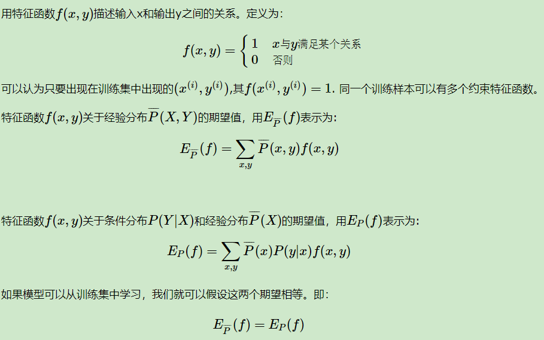
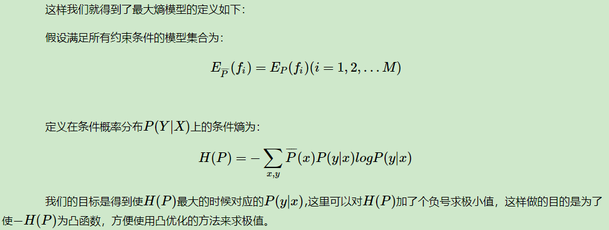
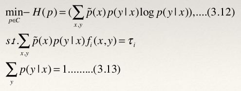

熵度量了事物的不确定性，越不确定的事物，它的熵就越大。

$$H(X)=-\sum_{i=1}^np_ilogp_i$$

两个变量X和Y的联合熵表达式：

$$H(X，Y)=-\sum_{i=1}^np(x_i,y_i)logp(x_i,y_i)$$

条件熵的表达式：

$$H(Y|X)=-\sum_{i=1}^np(x_i,y_i)logp(y_i|x_i)=\sum_{i=1}^np(x_i)H(Y|x_i)=-\sum_{i=1}^np(x_i)\sum_{j=1}^mp(y_j|x_i)logp(y_j|x_i)$$

条件熵度量了在知道X以后Y的不确定性。

用下面这个图很容易明白他们的关系。左边的椭圆代表H(X),右边的椭圆代表H(Y),中间重合的部分就是我们的互信息或者信息增益I(X,Y), 左边的椭圆去掉重合部分就是H(X|Y),右边的椭圆去掉重合部分就是H(Y|X)。两个椭圆的并就是H(X,Y)。

最大熵模型假设分类模型是一个条件概率分布P(Y|X)P(Y|X),X为特征，Y为输出。

在给定训练集的情况下，我们可以得到总体联合分布P(X,Y)的经验分布P¯(X,Y),和边缘分布P(X)P(X)的经验分布P¯(X)。P¯(X,Y)即为训练集中X,Y同时出现的次数除以样本总数m，P¯(X)即为训练集中X出现的次数除以样本总数m。

上式就是最大熵模型学习的约束条件，假如我们有M个特征函数fi(x,y)(i=1,2...,M)fi(x,y)(i=1,2...,M)就有M个约束条件。可以理解为我们如果训练集里有m个样本，就有和这m个样本对应的M个约束条件。

最大熵模型的优点有：

a) 最大熵统计模型获得的是所有满足约束条件的模型中信息熵极大的模型,作为经典的分类模型时准确率较高。

b) 可以灵活地设置约束条件，通过约束条件的多少可以调节模型对未知数据的适应度和对已知数据的拟合程度

最大熵模型的缺点有：

a) 由于约束函数数量和样本数目有关系，导致迭代过程计算量巨大，实际应用比较难。

http://www.cnblogs.com/pinard/p/6093948.html

https://zhuanlan.zhihu.com/p/29978153