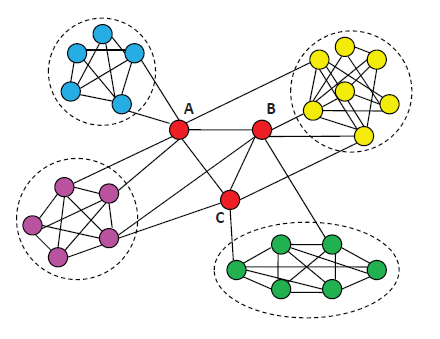
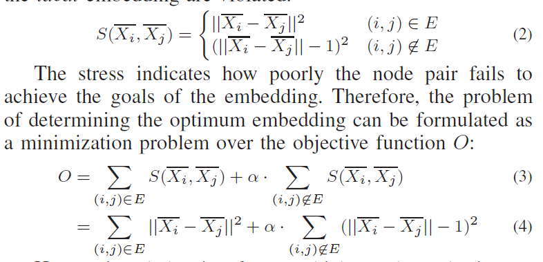
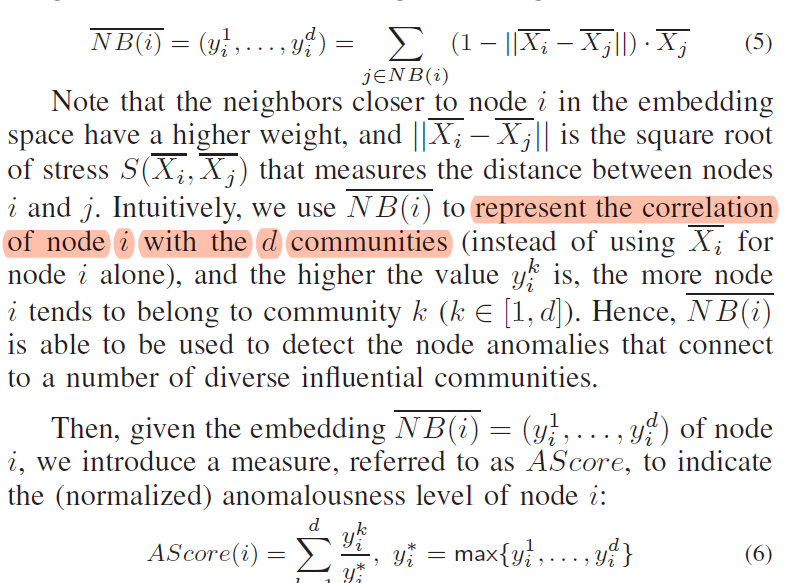

##structural inconsistencies-2016

Hu, Renjun, et al. "An embedding approach to anomaly detection." *Data Engineering (ICDE), 2016 IEEE 32nd International Conference on*. IEEE, 2016. 

our goal is to discover structural inconsistencies, identify such nodes which
bring together diverse portions of the network, i.e., the anomalous nodes that connect to a number of diverse influential communities

现有的graph embedding方法都不是为了异常点识别设计的，没有考虑识别inconsistencies的关键：局部连接和社区结构，因此，作者设计了一个新的embedding方法，专门为了结构异常点的检测。

结点i的向量表示$X_i$是一个d维的向量，其中每一维$x_i^k$代表结点i和社区k的关联。模型中的社区不受限与现实中的社区。embedding的目标：
$$
||X_i - X_j|| =
        \begin{cases}
        0  & (i,j)\in E \\
        1 & (i,j)\notin E
        \end{cases}
$$
目标函数：

计算分数：

为了消除噪声的影响，对于NB(j)中的每个邻居，the entries in Xj whose values fall below the average one of Xj are regarded as non-influential and are replaced with 0.

为了将有影响力的社区和无影响力的区分开，对于$y_i^k < \theta y_i^*$的替换成0，theta是0和1之间的参数。

AScore(i) > thre，结点i是异常点。thre反映了有影响力的社区的diversity，取决于网络中社区结构的强度，也就是inner-community和inter-community edges的比例。强社区结构的网络有更小的thre。thre在[1.5, 10]之间。