##Survey

###Survey 1-[2018IEEE]

Cai H, Zheng V W, Chang K. 

A comprehensive survey of graph embedding: problems, techniques and applications

[J]. IEEE Transactions on Knowledge and Data Engineering, 2018. 

**Graph Embedding Problem Settings**

- Graph Embedding Input
  - Homogeneous Graph
    - Undirected，unweighted，directed，weighted
    - Challenge: How to capture the diversity of connectivity patterns observed in graphs
  - Heterogeneous Graph
    - Community-based question answering (cQA) sites，Multimedia Networks，Knowledge Graphs
    - Challenge: How to explore global consistency between different types of objects, and how to deal with the imbalances of different-typed objects, if any
  - Graph with Auxiliary Information
    - Label，Attribute，Node feature，Information propagation，Knowledge base
    - Challenge: How to incorporate the rich and unstructured information so that the learnt embeddings are both representing the topological structure and discriminative in terms of the auxiliary information.
  - Graph Constructed from Non-relational Data
    - Challenge: How to construct a graph that encodes the pairwise relations between instances and how to preserve the generated node proximity matrix in the embedded space.
- Graph Embedding Output：
- how to find a suitable type of embedding output which meets the needs of the specific application task
  - Node Embedding
    - Challenge: How to define the node pairwise proximity in various types of input graph and how to encode the proximity in the learnt embeddings.
  - Edge Embedding
    - Challenge: How to define the edge-level similarity and how to model the asymmetric property of the edges, if any.
  - Hybrid Embedding
    - Substructure embedding，community embedding
    - Challenge: How to generate the target substructure and how to embed different types of graph components in one common space.
  - Whole-Graph Embedding
    - Challenge: How to capture the properties of a whole graph and how to make a trade-off between expressivity and efficiency.

**Graph Embedding Techniques**

- Matrix Factorization
  - Graph Laplacian Eigenmaps
    - The graph property to be preserved can be interpreted as pairwise node similarities, thus a larger penalty is imposed if two nodes with larger similarity are embedded far apart
  - Node Proximity Matrix Factorization
    - Node proximity can be approximated in low-dimensional space using matrix factorization. The objective of preserving the node proximity is to minimize the loss during the approximation
- Deep Learning
  - With Random Walk
    - The second-order proximity in a graph can be preserved in the embedded space by maximizing the probability of observing the neighbourhood of a node conditioned on its embedding
    - There are usually two solutions to approximate the full softmax: hierarchical softmax and negative sampling.
  - Without Random Walk
    - The multi-layered learning architecture is a robust and effective solution to encode the graph into a low dimensional space
    - Autoencoder，Deep Neural Network，Others
- Edge Reconstruction
  - Maximize Edge Reconstruct Probability
    - Good node embedding maximizes the probability of generating the observed edges in a graph
  - Minimize Distance-based Loss
    - The node proximity calculated based on node embedding should be as close to the node proximity calculated based on the observed edges as possible
  - Minimize Margin-based Ranking Loss
    - A node’s embedding is more similar to the embedding of relevant nodes than that of any other irrelevant node
- Graph Kernel
- The whole graph structure can be represented as a vector containing the counts of elementary substructures that are decomposed from it
  - Based on Graphlet
  - Based on Subtree Patterns
  - Based on Random Walks
- Generative Model
  - Embed Graph into Latent Space
    - Nodes are embedded into the latent semantic space where the distances among node embeddings can explain the observed graph structure
  - Incorporate Semantics for Embedding
    - Nodes who are not only close in the graph but also having similar semantics should be embedded closer. The node semantics can be detected from node descriptions via a generative model
- Hybrid Techniques and Others

**Applications**

- Node Related Applications
  - Node Classification
  - Node Clustering
  - Node Recommendation/Retrieval/Ranking
- Edge Related Applications
  - Link Prediction and Graph Reconstruction
  - Triple Classification
- Graph Related Applications
  - Graph Classification
  - Visualization
- Other Applications
  - Knowledge graph related
  - Multimedia network related
  - Information propagation related
  - Social networks alignment

###Survey 2-[2017]

Hamilton W L, Ying R, Leskovec J. 

Representation Learning on Graphs: Methods and Applications

[J]. arXiv preprint arXiv:1709.05584, 2017. 

**一、Embedding nodes**

1. **Overview of approaches: An encoder-decoder perspective**

The intuition behind the encoder-decoder idea is the following: if we can learn to decode high-dimensional graph information—such as the global positions of nodes in the graph or the structure of local graph neighborhoods—from encoded low-dimensional embeddings, then, in principle, these embeddings should contain all information necessary for downstream machine learning tasks

encoder是将结点转换成embeddings，decoder是接受一系列embeddings，然后从中解码出用户指定的统计量，比如结点属于哪个类，两个结点之间是否存在边等。

目标是优化encoder和decoder的mapping来最小化误差或损失。损失是decoder的结果和真实结果之间的差异。

四个方面的不同：pairwise similarityfunction, encoder function, decoder function, loss function

1. **Shallow embedding approaches**

For these shallow embedding approaches, the encoder function—which maps nodes to vector embeddings—is simply an “embedding lookup”

- Factorization-based approaches
  - Laplacian eigenmaps：decoder是两个向量之差的L2范数的平方，损失函数是decoder的结果的加权和，权重是两个结点的相似性。
  - Inner-product methods：decoder是两个向量的内积，例如The Graph Factorization (GF) algorithm, GraRep, and HOPE，他们的损失函数都是MSE：decoder的结果和实际相似度的差的L2范数的平方。他们的不同之处是相似性的度量。GF直接用邻接矩阵，GraRep用邻接矩阵的平方，HOPE用based on
    Jaccard neighborhood overlaps
  - 他们的共同点是：Loss function基本上是：$||Z^TZ-S||_2^2$ ,  embedding矩阵Z和相似性矩阵S
- Random walk approaches
  - DeepWalk and node2vec：decoder是从结点i出发在T步内经过结点j的概率；交叉熵损失函数
  - Large-scale information network embeddings (LINE)
  - HARP: Extending random-walk embeddings via graph pre-processing：           a graph coarsening procedure is used to collapse related nodes in G together into “supernodes”, and then DeepWalk, node2vec, or LINE is run on this coarsened graph. After embedding the coarsened version of G, the learned embedding of each supernode is used as an initial value for the random walk embeddings of the supernode’s constituent nodes
  - Additional variants of the random-walk idea

缺点：

1.No parameters are shared between nodes in the encoder

2.Shallow embedding also fails to leverage node attributes during encoding

3.Shallow embedding methods are inherently transductive

1. **Generalized encoder-decoder architectures**

- Neighborhood autoencoder methods：       they use autoencoders，例如DNGR, SDNE, Extract high-dimensional neighborhood vector,(si contains vi’s proximity to all other nodes),Compress si to low-dimensional embedding
- Neighborhood aggregation and convolutional encoders：they generate embeddings for a node by aggregating information from its local neighborhood，例如GCN，column networks，GraphSAGE

1. **Incorporating task-specific supervision**

cross-entropy loss,  backpropagation

1. **Extensions to multi-modal graphs**

- Dealing with different node and edge types
- Tying node embeddings across layers：如OhmNet

1. **Embedding structural roles**

struc2vec，GraphWave

1. **Applications of node embeddings**

- Visualization and pattern discovery
- Clustering and community detection
- Node classification and semi-supervised learning
- Link prediction

**二、Embedding subgraphs**

1. **Sets of node embeddings and convolutional approaches**

The basic intuition behind these approaches is that they equate subgraphs with sets of node embeddings

- Sum-based approaches
- Graph-coarsening approaches
- Further variations

1. **Graph neural networks**

GNN，MPNNs

1. **Applications of subgraph embeddings**

### Survey 3-[2017IEEE]

Wang Q, Mao Z, Wang B, et al. Knowledge graph embedding: A survey of approaches and applications[J]. IEEE Transactions on Knowledge and Data Engineering, 2017, 29(12): 2724-2743. 

Summary of Translational Distance Models

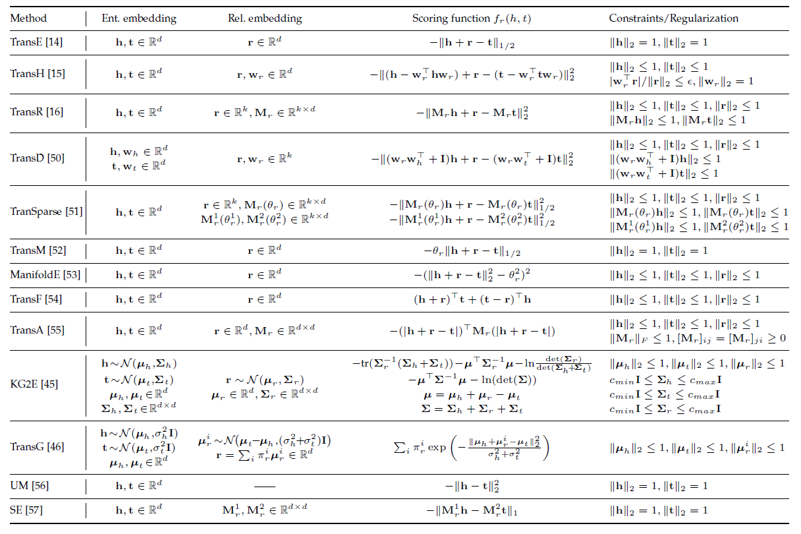

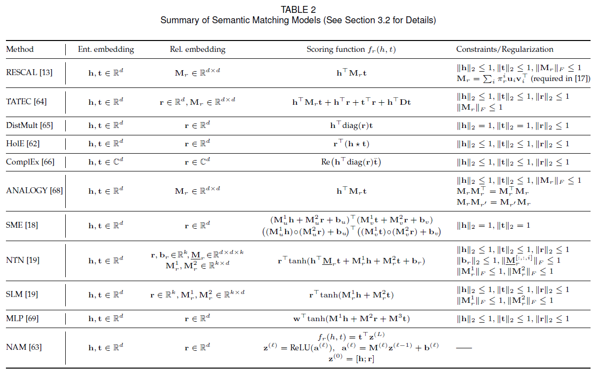

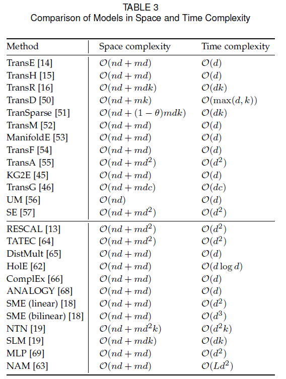

## DeepWalk-随机游走+Skip-Gram-[2014SIGKDD]

Perozzi, B.; Al-Rfou, R.; and Skiena, S. 2014. 

Deepwalk: Online learning of social representations. 

In Proceedings of the 20th ACM SIGKDD international conference on Knowledge discovery and data mining

只适用于不加权的图

算法1：$DeepWalk(G, w, d, \gamma, t)$

**Input: **

graph G(V;E)
window size w
embedding size d
walks per vertex  $\gamma$
walk length t
**Output**: matrix of vertex representations $\Phi \in R^{|V|×d}$
1:  Initialization: Sample $\Phi$ from $U^{|V|×d}$
2:  Build a binary Tree T from V
3:  for i = 0 to  $\gamma$ do
4: 	O = Shuffle(V)
5: 	for each $v_i \in O$ do
6: 		$W_{v_i} = RandomWalk(G, v_i, t)$
7: 		SkipGram($\Phi, W_{v_i} , w$)
8: 	end for
9:  end for

算法2：SkipGram($\Phi, W_{v_i} , w$)

1:  for each $v_j \in W_{v_i}$ do
2:  	for each $u_k \in W_{v_i} [j - w : j + w]$ do
3:  		$J(\Phi) = -log Pr(u_k| \Phi (v_j))$
4: 		$\Phi = \Phi - \alpha * \frac{\partial J}{\partial \Phi}$                        (SGD)
5: 	end for
6:  end for

Computing the partition function (normalization factor) is expensive, so instead we will factorize the conditional probability using Hierarchical softmax. We assign the vertices to the leaves of a binary tree, turning the prediction problem into maximizing the probability of a specic path in the hierarchy.If the path to vertex $u_k$ is identied by a sequence of tree nodes $(b_0, b_1, ..., b_{\lceil log|V |\rceil}), (b_0 = root, b_{\lceil log|V |\rceil} = u_k)$ then

$Pr(u_k| \Phi (v_j)) = \prod_{l=1}^{\lceil log|V |\rceil} Pr(b_l| \Phi (v_j))$

$Pr(b_l| \Phi (v_j))$ could be modeled by a binary classifier that is assigned to the parent of the node $b_l$ as

$Pr(b_l| \Phi (v_j)) =  1/(1+e^{-\Phi(v_j)· \Psi(b_l)})$

where $\Psi(b_l) \in R^d$ is the representation assigned to tree node $b_l$'s parent

实验：多标签分类

参数敏感性分析

## Line-1阶&2阶相似度-[2015]

Tang J, Qu M, Wang M, et al. 

Line: Large-scale information network embedding

[C]//Proceedings of the 24th International Conference on World Wide Web. International World Wide Web Conferences Steering Committee, 2015: 1067-1077. 

以前的方法只适用于小型网络。

Although a few very recent studies approach the embedding of large-scale networks, these methods either
use an indirect approach that is not designed for networks or lack a clear objective function tailored for network embedding。

LINE, which is able to scale to very large, arbitrary types of networks: undirected, directed and/or weighted

The model optimizes an objective which preserves both the local and global network structures

两种相似性：

first-order：两个点之间有很强的联系(比如边的权重很大)。

second-order：两个点有很多相同的邻居

they should be represented closely to each other in the embedded space

**LINE with First-order Proximity**

对于无向边(i, j)，$v_i和v_j$的联合概率是$p_1(v_i, v_j) = \frac1{1+exp(-\overrightarrow{u_i}^T · \overrightarrow{u_j})}$

相应的经验概率是：$\hat p_1(i,j) = \frac{w_{ij}}W, W=\sum_{(i,j) \in E}w_{ij}$

最小化两个概率分布之间的距离，用KL散度距离，因此目标函数是：$O_1 = d(\hat p_1(·,·),p_1(·,·)) = -\sum_{(i,j) \in E}w_{ij}logp_1(v_i, v_j)$

**LINE with Second-order Proximity**

无向和有向图都适用

每个点被看作是"context"，在"context"上有相似分布的结点视作相似。

每个点有两个角色：the vertex itself and a specific "context" of other vertices，对应两个向量$\overrightarrow{u_i}和\overrightarrow{u_i}'$

对于每个有向边(i,j), 定义由点$v_i$ 生成的"context" $v_j$ 的概率为：$p_2(v_j | v_i) = \frac{exp(\overrightarrow{u_j}'^T · \overrightarrow{u_i})}{\sum_{k=1}^{|V|}exp(\overrightarrow{u_k}'^T · \overrightarrow{u_i})}$

where |V| is the number of vertices or "contexts."

最小化目标函数：

$O_2 = \sum_{i \in V}\lambda_i d(\hat p_2(·|v_i),p_2(·|v_i)) = -\sum_{(i,j) \in E}w_{ij}logp_2(v_j|v_i)$

其中$\lambda_i$ 是the prestige声望 of vertex i in the network, which can be measured by the degree or estimated through algorithms such as PageRank，这里取$d_i=\sum_{k \in N(i)}w_{ik}$ 即点i的出度，$\hat p_2(v_j | v_i) = \frac{w_{ij}}{d_i}$ 

分别训练两个LINE模型，然后将两个模型的每个点的向量拼接起来，也可以联合训练两个目标函数(future work)

优化目标函数$O_2$ is computationally expensive,采用负采样方法。对每条边(i,j), 目标函数为：

$log\sigma(\overrightarrow{u_j}'^T · \overrightarrow{u_i})+\sum_{i=1}^K E_{v_n \sim P_n(v)}[log\sigma(\overrightarrow{u_n}'^T · \overrightarrow{u_i})]$

set $ P_n(v) \propto d_v^{3/4}, d_v 是点v的出度$

用asynchronous stochastic gradient algorithm(ASGD)优化上述方程。

In each step, the ASGD algorithm samples a mini-batch of edges and then updates the model parameters.

梯度会由权重乘积而来，而权重的方差很大，会导致难以找到合适的学习率。

用the alias table method根据边的权重进行采样，将采样到的边视为binary edges.

对于目标函数$O_1$也采用负采样的方法，将上式中的$\overrightarrow{u_j}'^T 换成\overrightarrow{u_j}^T$ 

实验：a language network, two social networks, and two citation networks

second-order proximity suffers when the network is extremely sparse, and it outperforms rst-order proximity when there are sufficient nodes in the neighborhood of a node

second-order proximity does not work well for nodes with a low degree

## node2vec-捕捉结构相似性和趋同性-[2016]

Grover A, Leskovec J. 

node2vec: Scalable feature learning for networks

[C]//Proceedings of the 22nd ACM SIGKDD international conference on Knowledge discovery and data mining. ACM, 2016

a semi-supervised algorithm for scalable feature learning in networks

简单来说就是将原有社交网络中的图结构，表达成特征向量矩阵，每一个node（可以是人、物品、内容等）表示成一个特征向量，用向量与向量之间的矩阵运算来得到相互的关系。 (如向量均值，Hadamard积，Weighted-L1, Weighted-L2)

there is no clear winning sampling strategy that works across all networks and all prediction tasks. This is a major shortcoming of prior work which fail to offer any flexibility in sampling of nodes from a network。

Our algorithm node2vec overcomes this limitation by designing a flexible objective that is not tied to a particular sampling strategy and provides parameters to tune the explored search space。

**Algorithm 1 The node2vec algorithm.**
**LearnFeatures** (Graph G = (V, E, W), Dimensions d, Walks per node r, Walk length l, Context size k, Return p, In-out q)
$\pi$ = PreprocessModifiedWeights(G, p, q)
	$G' = (V, E,  \pi)$
	Initialize walks to Empty
	for iter = 1 to r do
		for all nodes $u \in V$ do
			walk = node2vecWalk$(G', u, l)$
			Append walk to walks
	f = StochasticGradientDescent(k, d, walks)
	return f
**node2vecWalk** (Graph $G' = (V, E,  \pi)$, Start node u, Length l)
	Inititalize walk to [u]
	for walk_iter = 1 to l do
		curr = walk[-1]
		$V_{curr}$ = GetNeighbors(curr, G')
		s = AliasSample$(V_{curr}, \pi)$
		Append s to walk
	return walk

RandomWalks:

$P(c_i=x | c_{i-1}=v) = \frac{\pi_{vx}}Z \; if (v,x) \in E  \; otherwise \; 0$

$\pi_{vx} = \alpha_{pq}(t, x) · w_{vx}$ 

$\alpha_{pq}(t, x) = \frac1p    \; if \; d_{tx} =0$

$\alpha_{pq}(t, x) = 1    \; if \; d_{tx} =1$

$\alpha_{pq}(t, x) = \frac1q    \; if \; d_{tx} =2$

$d_{tx}$ denotes the shortest path distance between nodes t and x. t是当前点的上一个点，v是当前点，x是v的邻居结点

Parameter p controls the likelihood of immediately revisiting a node in the walk.

Setting it to a high value(> max(q; 1)) ensures that we are less likely to sample an already visited node in the following two steps (unless the next node in the walk had no other neighbor).

if q > 1, 倾向于BFS广度优先搜索，if q < 1, 倾向于DFS深度优先搜索

极大似然优化，目标函数是：

$max_f \sum_{u \in V} log Pr(N_S(u) | f(u))$

$$Pr(N_S(u) | f(u)) = \prod _{n_i \in N_S(u)} Pr(n_i | f(u))$$

$Pr(n_i | f(u)) = \frac{exp(f(n_i)·f(u))}{\sum_{v \in V}exp(f(v)·f(u))}$

因此目标函数变为：

$max_f \sum_{u \in V}[-logZ_u + \sum_{n_i \in N_S(u)} f(n_i)·f(u)]$

$Z_u = \sum_{v \in V} exp(f(u)·f(v))$

可以通过负采样来优化分母的计算量 ,

用随机梯度下降法优化上述目标函数

实验：聚类，多标签的分类，链接预测

参数敏感分析，扰动分析，可扩展性

- 用学到的向量去做分类任务的特征，结果比其他方法好很多，并且这种方法很鲁棒！即使缺少边也没问题。
- 可扩展到大规模 node！

## structure2vec-[2016]

Dai H, Dai B, Song L. 

Discriminative embeddings of latent variable models for structured data

[C]//International Conference on Machine Learning. 2016: 2702-2711. 

structure2vec, an effective and scalable approach for structured data representation based on the idea of embedding latent variable models into feature spaces, and learning such feature spaces using discriminative information区分性信息.

Structured data, such as sequences, trees and graphs

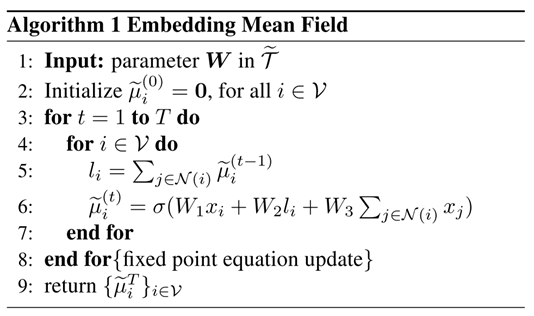

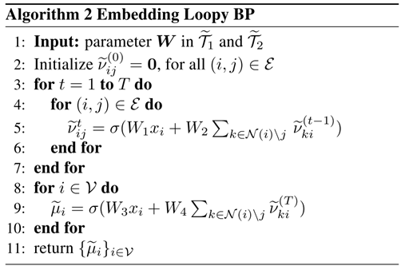

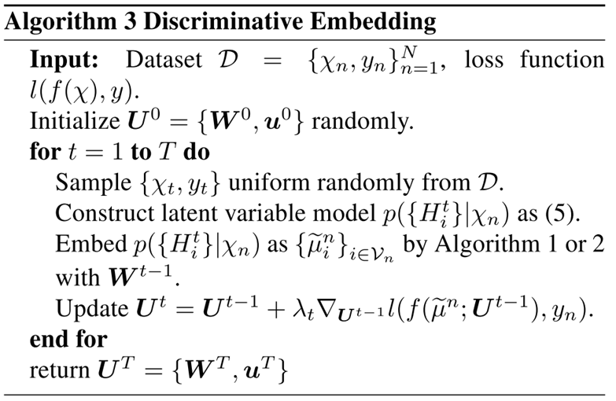

## GraphSAGE-有效生成新结点embedding-[2017]

采样邻居结点，通过累加器得到结点的embedding，对于unseen nodes可以有效地生成embeddings

累加器有三种：Mean aggregator, LSTM aggregator, Pooling aggregator

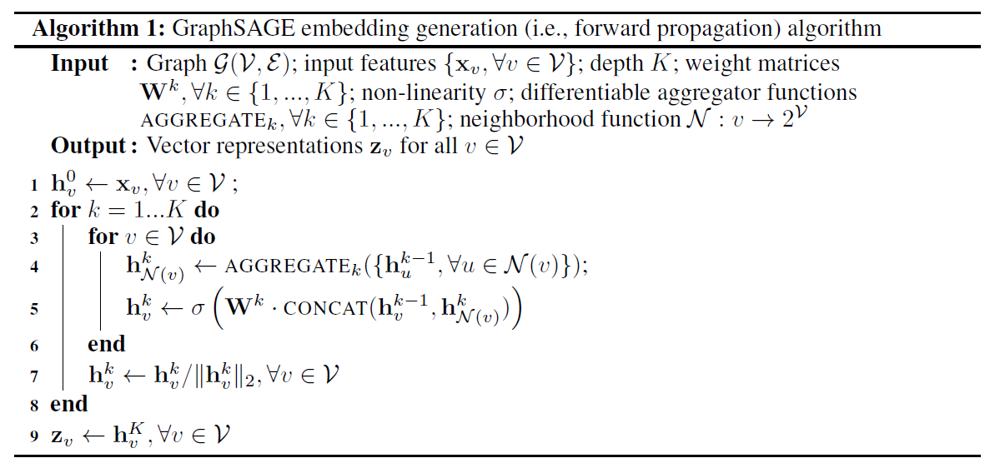

Hamilton W, Ying Z, Leskovec J. 

Inductive representation learning on large graphs

[C]//Advances in Neural Information Processing Systems. 2017

##Proximity

###APP-非对称相似度-阿里-[2017AAAI]

Scalable Graph Embedding for Asymmetric Proximity    C Zhou，Y Liu，X Liu，... - 2017

**asymmetric proximity preserving(APP)**

we propose an asymmetric proximity preserving(APP) graph embedding method via random walk with restart, which captures both asymmetric and high-order similarities between node pairs. We give theoretical analysis that our method implicitly preserves the Rooted PageRank score for any two vertices.

考虑节点间的非对称相似度，每个节点训练出两个向量：头向量和尾向量。两个节点的相似性用两个节点的头向量和尾向量的内积表示

**Higher order proximity :**

**1.SimRank**

SimRank 是一种基于图的拓扑结构来衡量图中任意两个点的相似程度的方法。 在基于链接的相似性度量领域中SimRank被认为与PageRank在信息检索领域具有同样重要的地位 。

如果两个点在图中的邻域比较相似（有很多相似邻居），则这两个点也应该比较相似。即两个点是否相似，由他们的邻居是否相似来决定。而他们的邻居是否相似又由他们邻居的邻居的相似性决定。

跟pagerank类似，这也是一个迭代的定义。即通过迭代的方式计算两个点之间的相似度，最终取收敛的相似度。

**如果两个节点相同，则相似度是1。如果两个节点不同，那他们的相似度就等于他们两个所有一步邻居的两两相似度的均值，再乘以衰减系数cc。 **

SimRank的特点：完全基于结构信息，且可以计算图中任意两个节点间的相似度。  

Jeh, G., and Widom, J. 2002. 

Simrank: a measure of structural-context similarity. 

In International Conference on Knowledge Discovery and Data Mining, 538–543. ACM.

**2.Rooted PageRank**

PageRank的计算充分利用了两个假设：数量假设和质量假设。步骤如下：
      **1）在初始阶段：**网页通过链接关系构建起Web图，每个页面设置相同的PageRank值，通过若干轮的计算，会得到每个页面所获得的最终PageRank值。随着每一轮的计算进行，网页当前的PageRank值会不断得到更新。

​      **2）在一轮中更新页面PageRank得分的计算方法：**在一轮更新页面PageRank得分的计算中，每个页面将其当前的PageRank值平均分配到本页面包含的出链上，这样每个链接即获得了相应的权值。而每个页面将所有指向本页面的入链所传入的权值求和，即可得到新的PageRank得分。当每个页面都获得了更新后的PageRank值，就完成了一轮PageRank计算。

**PageRank的迭代公式：$R=q×P*R+(1-q)*e/N, e是单位向量$ **

**主题敏感PageRank中：$R=q×P*R+(1-q)*s/N$ , s是这样一个向量：对于某topic的s，如果网页k在此topic中，则s中第k个元素为1，否则为0。对于每个topic都有一个不同的s，而|s|表示s中1的数量。每个网页归到一个topic。**

在PageRank中e/N是一个均匀分布，而在PPR中则根据用户的preference指定权重，例如用户指定了10个页面，则可以设置这10个页面对应的权重均为1/10，其余均为0。 

一般来说用户会对某些领域感兴趣，同时，当浏览某个页面时，这个页面也是与某个主题相关的（比如体育报道或者娱乐新闻），所以，当用户看完当前页面，希望跳转时，更倾向于点击和当前页面主题类似的链接，即主题敏感PageRank是将用户兴趣、页面主题以及链接所指向网页与当前网页主题的相似程度综合考虑而建立的模型。 

PageRank是全局性的网页重要性衡量标准，每个网页会根据链接情况，被赋予一个唯一的PageRank分值。主题敏感PageRank在此点有所不同，该算法引入16种主题类型，对于某个网页来说，对应某个主题类型都有相应的PageRank分值，即每个网页会被赋予16个主题相关PageRank分值。 

Haveliwala, T. H. 2002. 

Topic-sensitive pagerank. 

In Proceedings of the 11th international conference on World Wide Web

**3.Katz**

https://en.wikipedia.org/wiki/Katz_centrality

两个节点之间所有路径的加权和

Katz, L. 1953. 

A new status index derived from sociometricanalysis. 

Psychometrika

**Asymmetric graph embedding**

High-Order Proximity preserved Embedding(HOPE for short)

we first derive a general formulation of a class of high-order proximity measurements, then apply generalized SVD to the general formulation, whose time complexity is linear with the size of graph.

Ou, M.; Cui, P.; Pei, J.; and Zhu,W. 2016. 

Asymmetric transitivity preserving graph embedding. 

In International Conference on Knowledge Discovery and Data Mining. ACM.

**the Monte-Carlo End-Point sampling method **

Let $A$ denote the adjacency matrix of the web graph with normalized rows and $c ∈ (0, 1)$ the teleportation probability. In addition, let $r$ be the so-called preference vector inducing a probability distribution over $V$. PageRank vector $p$ is defined as the solution of the following equation

p = (1 - c)  · pA + c ·  r

要么以概率c ·  r选择该网页，要么从别的网页跳到该网页来。

按上述式子迭代的话复杂度很高，所以一般用蒙特卡洛模拟。

To compute a rooted pagerank vector for v, the Monte Carlo approach randomly samples N independent paths started from v, with stoping probability of c. Then the rooted pagerank value can be approximated as,
$ppr_v(u) = |PathEndsAt(u) |/ N$

网页v对于主体u的pagerank score

论文中用蒙特卡洛方法模拟v到达u的概率，用于目标函数中。

Fogaras, D.; R´acz, B.; Csalog´any, K.; and Sarl´os, T. 2005.

Towards scaling fully personalized pagerank: Algorithms, lower bounds, and experiments.

Internet Mathematics

**Common Neighbors (CNbrs for short)**

最简单的基于局部信息的相似性方法。如果两个节点间的共同邻居结点越多，那么两者存在链接的可能性就越大。得分公式：

$score(u,v)=|N(u)\bigcap N(v)|$

**Adamic Adar (Adar for short) **

起初用于计算两个用户的个人主页的相似性。在计算两个用户个人主页时，首先要提取两主页的公共关键词，然后计算每个公共关键词的权重，最后对所有的公共关键词进行加权求和。关键词的权重与关键词出现的次数的倒数成反比。

$\sum_{t\in N(u)\bigcap N(v)} \frac1{log|N(t)|}$

**Jaccard Coefficience **

利用两节点共同邻居的交集与并集个数之比，定义为两节点的相似度。

$score(u,v) = |N(u)\bigcap N(v)|/ |N(u)\bigcup N(v)|$

### ProxEmbed-[2017AAAI]

Liu Z, Zheng V W, Zhao Z, et al. Semantic Proximity Search on Heterogeneous Graph by Proximity Embedding[C]//AAAI. 2017: 154-160. 

任务：语意近似度搜索，比如给定近似度类型如校友，以及某种类型如用户的查询结点，目的是输出同样类型的其它结点的排名列表

核心问题：如何衡量异质图的近似度

we introduce a new concept of proximity embedding, which directly embeds the network structure between two possibly distant nodes.We also design our proximity embedding, so as to flexibly support both symmetric and asymmetric proximities. Based on the proximity embedding, we can easily estimate the proximity score between two nodes and enable search on the graph.

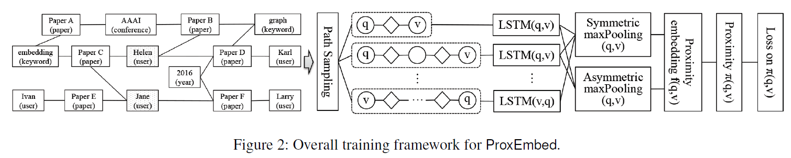

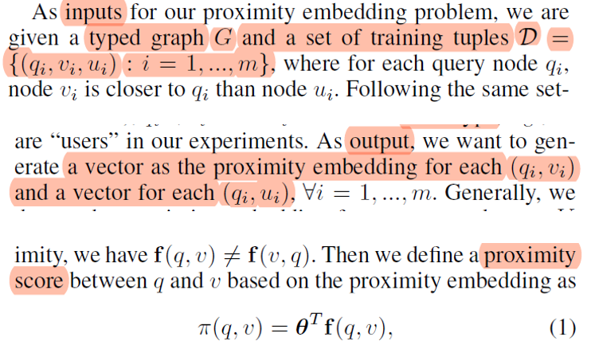

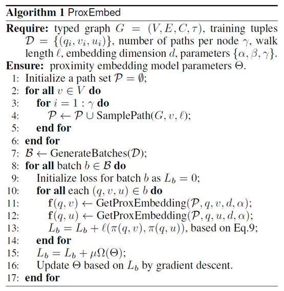

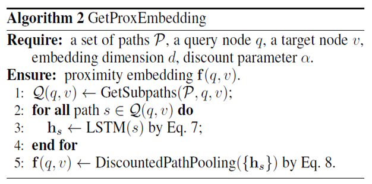

### [D2AGE]-[2018AAAI]

Liu Z, Zheng V W, Zhao Z, et al. Distance-aware dag embedding for proximity search on heterogeneous graphs[C]. AAAI, 2018. 

https://github.com/shuaiOKshuai

we explore a more expressive DAG (directed acyclic graph有向无环图) data structure for modeling the connections between two nodes. Particularly, we are interested in learning a representation for the DAGs to encode the proximity between two nodes. We face two challenges to use DAGs, including how to efficiently generate DAGs and how to effectively learn DAG embedding for proximity search. We find distance-awareness as important for proximity search and the key to solve the above challenges. Thus we develop a novel Distance-aware DAG Embedding (D2AGE) model.

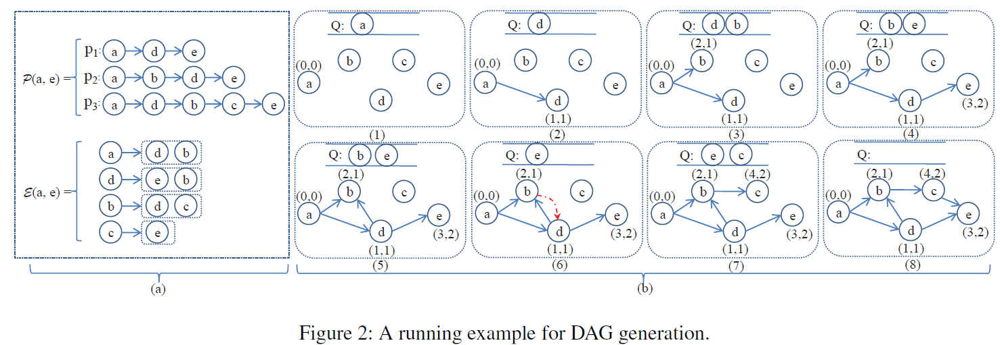

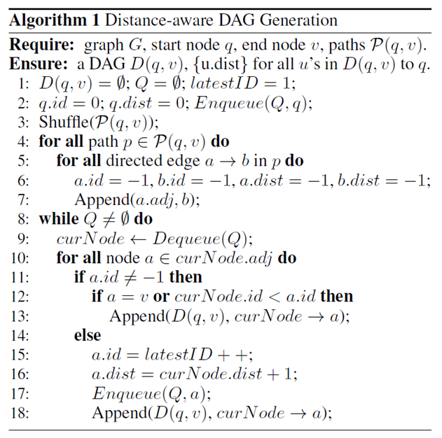

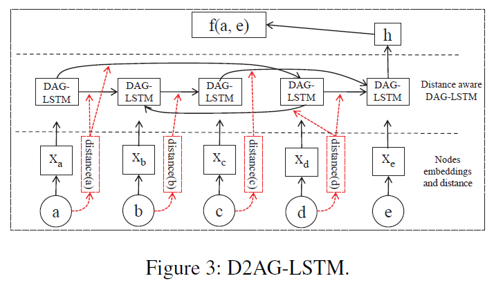

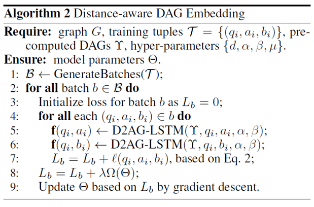

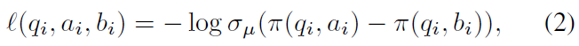

##异质Heterogeneous

###HIN2Vec-异质结点和边-[2017]

Heterogeneous Information Network to Vector (HIN2Vec)

Given a set of relationships specified in forms of meta-paths in an HIN, HIN2Vec carries out multiple prediction
training tasks jointly based on a target set of relationships to learn latent vectors of nodes and meta-paths in the HIN

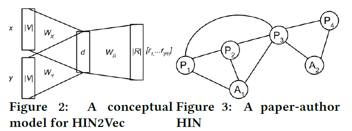

P5

Fu T, Lee W C, Lei Z. 2017

HIN2Vec: Explore Meta-paths in Heterogeneous Information Networks for Representation Learning

[C]//Proceedings of the 2017 ACM on Conference on Information and Knowledge Management. ACM

## IGE-交互图的embedding-[2017]

Zhang Y, Xiong Y, Kong X, et al. 2017

Learning Node Embeddings in Interaction Graphs

[C]//Proceedings of the 2017 ACM on Conference on Information and Knowledge Management. ACM

IGE (Interaction Graph Embedding)

以前的节点嵌入方法都集中在static non-attributed graphs上，现实中attributed interaction graphs.它包含两类实体（如投资者/股票），以及edges of temporal interactions with attributes (e.g. transactions and reviews) 

Our model consists of an attributes encoding network and two prediction networks. Three networks are trained simultaneously by back-propagation. Negative sampling method is applied in training prediction networks for acceleration.将属性转化成固定长度的向量的编码网络（处理属性的异质性）；利用属性向量预测两个实体的暂时事件的子网络 如 预测投资者事件的子网络；预测股票事件的子网络 s

**Attributed interaction graph:  **

G = (X,Y, E), X and Y are two disjoint sets of nodes, and E is the set of edges. Each edge e ∈ E can be represented as a tuple e = (x,y, t , a), where x ∈ X, y ∈ Y, t denotes the timestamp and a = (a1, . . . , am)
is the tuple of heterogeneous attributes of the edge. ai ∈ Ai is an instance of the i-th attribute.

例如(investor, stock, time, buy_or_sell, price, amount)

**Induced Edge List**

Given an attributed interaction graph G = (X,Y, E) and a source node x ∈ X, we say sx = (e1, . . . , en) is an edge list induced by the source node x, if every edge in sx is incident to x. Similarly, we can define a target node y’s induced edge list s′y .

**A Simplified Model**

Let G = (X,Y, E) be a given interaction graph where edges are without attributes. Inspired by the Skip- gram model and Paragraph Vector, we formulate the embedding learning as a maximum likelihood problem.

$L(\theta) = \alpha \sum_{x \in X} logP(s_x; \theta) + (1- \alpha) \sum_{y \in Y} logP(s_y’; \theta)$

$\alpha \in [0,1]$ 是超参数，is used to make a trade-off between the importance of source nodes induced lists and target nodes induced lists。

$\theta$ 代表所有的模型参数

$logP(s_x;\theta) = \sum_i \frac1{Z_i}\sum_{j\neq i} e^{\frac{-|t_i-t_j|}{\tau}} logP(y_j |x,y_i;\theta)$

where$Zi = \sum_{j\neq i} e^{\frac{-|t_i-t_j|}{\tau}} $ is a normalizing constant, and τ is a hyperparameter.If τ is small, weights will
concentrate on the temporally close pairs. Conversely, the larger the τ is, the smoother the weights are. In this case, more long-term effects will be considered.

$logP(y_j =k|x,y_i;\theta) = \frac{exp(U_X[k,:]^T v_x + U_Y[k,:]^T v_{yi} + b)}{\sum_l exp(U_X[l,:]^T v_x + U_Y[l,:]^T v_{yi} + b)}$

$v_x, v_{yi}$ 是x和yi的embeddings，计算下列式子代替前面的式子

$logP(s_x;\theta) = \sum_i \frac1{N(i)}\sum_{j\in N(i)} logP(y_j |x,y_i;\theta)$

where N(i) = {i1, . . . , ic } is the “context” ofyi . c is a pre-chosen hyper-parameter indicating the length of context, and ik is selected randomly with the probability proportional to $e^{\frac{-|t_i-t_j|}{\tau}}$. N(i) is a multiset, which means it allows duplicates of elements.

**Embedding Tensors**

在不同的场景下有不同的embeddings，例如投资者在买卖股票时有不同的策略。所以结点的embeddings是一个tensor，$\mathcal{T} \in \mathfrak{R}^{V\times K \times D}$ , where V is the size of nodes set and D corresponds to the number of tensor slices.

Given a tuple of attributes a = (a1, . . . , am), and an attributes encoder f , we can get an attribute vector $d =f (a) \in \mathfrak{R}^D$. Then we can compute attributed-gated embeddings as $E^d = \sum_{i=1}^D d_i \mathcal{T}[:,:,i]$ .

However, fully 3-way tensors are not practical because of enormous size. It is a common way to factor the tensor by introducing three matrices $ W^{fv} \in \mathfrak{R}^{F\times V}, W^{fd} \in \mathfrak{R}^{F\times D}, W^{fk} \in \mathfrak{R}^{F\times K}$, and re-reprent $E^d$ by the equation $E^d = (W^{fv})^T · diag(W^{fd}d) · W^{fk}$

where diag(·) denotes the matrix with its argument on the diagonal. These matrices are parametrized by a pre-chosen number of factors F.  It can be seen as the embeddings conditioned on d, and we let
$E^d = (W^{fv})^T W^{fk}$ denote unconditional embeddings.

**IGE: A Multiplicative Neural Model**

用$P(y_j |x,y_i, a_i, a_j;\theta)$代替上面式子中的 $P(y_j |x,y_i;\theta)$

$logP(y_j =k|x,y_i, a_i, a_j;\theta) = \frac{exp(U_X[k,:]^T v_x + U_Y^{d_j}[k,:]^T v_{yi}^{d_i} + b)}{\sum_l exp(U_X[l,:]^T v_x + U_Y^{d_j}[l,:]^T v_{yi}^{d_j} + b)}$

交替训练：

1.选择一个x, 选择$s_x$的两条边，根据$logP(y_j |x,y_i, a_i, a_j;\theta^{(t-1)})$ 计算出$\Delta \theta$, 更新$\theta^{(t)}=\theta^{(t-1)}+\alpha\lambda\Delta\theta$

2.选择一个y, 选择$s_y$的两条边，根据$logP(x_t |y,x_s, a_s, a_t;\theta^{(t-1)})$ 计算出$\Delta \theta$, 更新$\theta^{(t)}=\theta^{(t-1)}+(1-\alpha)\lambda\Delta\theta$

## 时间

### Time-Aware-[2016]

Jiang T, Liu T, Ge T, et al. Towards Time-Aware Knowledge Graph Completion[C]//Proceedings of COLING 2016, the 26th International Conference on Computational Linguistics: Technical Papers. 2016: 1715-1724. 

we present a novel time-aware knowledge graph completion model that is able to predict links in a KG using both the existing facts and the temporal information of the facts. To incorporate the happening time of facts, we propose a time-aware KG embedding model using temporal order information among facts. To incorporate the valid time of facts, we propose a joint time-aware inference model based on Integer Linear Programming (ILP) using temporal consistency information as constraints. We further integrate two models to make full use of global temporal information.

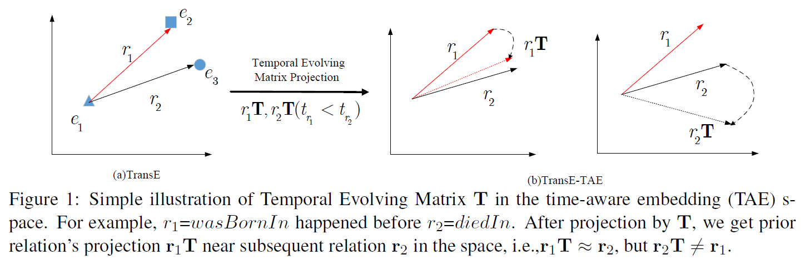

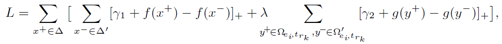

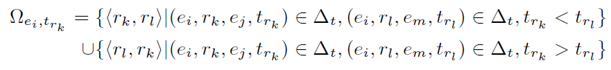

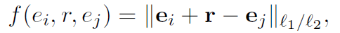

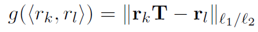

###Know-Evolve-[2017]

Trivedi R, Dai H, Wang Y, et al. 

Know-evolve: Deep temporal reasoning for dynamic knowledge graphs

[C]//International Conference on Machine Learning. 2017: 3462-3471. 

Know-Evolve，a novel deep evolutionary knowledge network that learns non-linearly evolving entity representations over time.

四元组$(e_s, r, e_o, t), 其中e^s, e^o \in \lbrace 1,..., n^e \rbrace(实体), e^s \neq e^o, r \in \lbrace 1, ..., n_r \}, r \in R^+$

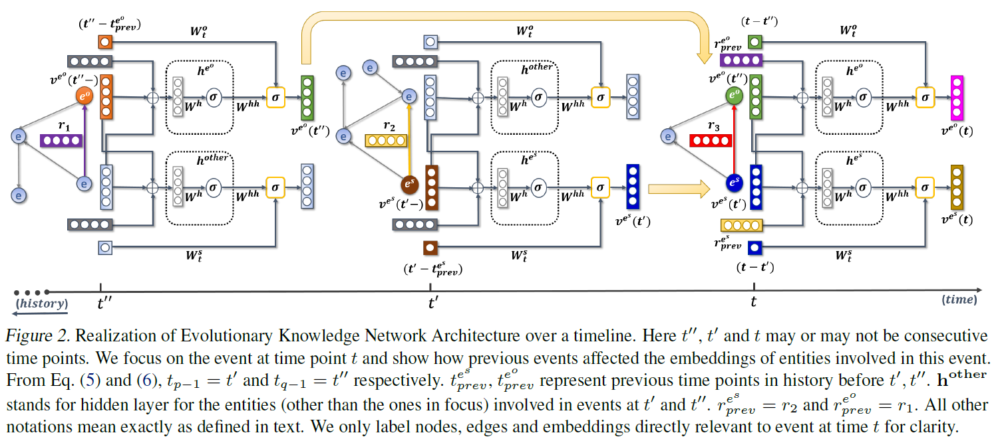

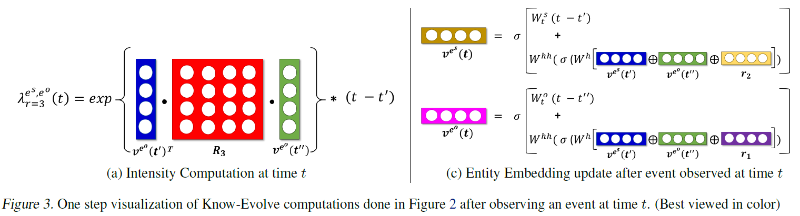

##外部信息

###DKRL-基于文本+结构的embedding-[2016AAAI]

R Xie，Z Liu，J Jia，... - 2016

Representation Learning of Knowledge Graphs with Entity Descriptions

AAAI

考虑实体描述的知识表示学习模型(description-embodied knowledge representation learning, DKRL)提出在知识表示学习中考虑Freebase等知识库中提供的实体描述文本信息。在文本表示方面，DKRL考虑了2种模型：一种是CBOW,将文本中的词向量简单相加作为文本表示；一种是卷积神经网络(convolutional neural network,CNN),能够考虑文本中的词序信息。

优势：除了能够提升实体表示的区分能力外，还能实现对新实体的表示。当新出现一个未曾在知识库中的实体时，DKRL可以根据它的简短描述产生它的实体表示，用于知识图谱补全等任务。

Description-Embodied Knowledge Representation Learning

每个头结点和尾结点有两个向量，分别是基于结构s的向量和基于文本描述d的向量

energy function:

$E = E_S + E_D,   E_D = E_{DD} + E_{DS}+E_{SD}$

$E_{DD}=||h_d+r-t_d||, E_{DS}=||h_d+r-t_s||, E_{SD}=||h_s+r-t_d||$

two encoders to build description-based representations

**Continuous Bag-of-words Encoder**

为每个实体选择文本描述中的top n个关键词(可以用TF-IDF进行排序)作为输入，将关键词的embeddings加起来作为实体的embedding，用来最小化$E_D$

**Convolutional Neural Network Encoder**

5层，实体的预处理后的文本描述作为输入，输出该实体基于文本描述的embedding.

预处理：去停用词，标记文本描述中的短语，将它们作为词，每个词有一个word embedding，作为CNN的输入。

###SSP-三元组+文本学习-[2017AAAI]

Xiao H, Huang M, Meng L, et al. 

SSP: Semantic Space Projection for Knowledge Graph Embedding with Text Descriptions

[C]//AAAI. 2017, 17: 3104-3110. 

semantic space projection (SSP) model which jointly learns from the symbolic triples and textual descriptions

损失函数：

$f_r(h,t) = -\lambda ||e-s^Tes||_2^2 + ||e||_2^2，e=h+r-t$

the component of the loss in the normal vector direction is ($s^Tes$), then the other orthogonal one, that is inside the hyperplane, is ($e-s^Tes$).

$超平面的法向量s=S(s_h, s_t)$

将实体描述看作文档，采用主题模型，得到文档的主题分布作为实体的语义向量s，如(0.1, 0.9, 0.0)表示该实体的主题应该是2

$S(s_h, s_t) = \frac{s_h+s_t}{||s_h+s_t||_2^2}$

Standard setting: 给定预训练好的语义向量，模型中固定它们然后优化其它参数

Joint setting: 同时实施主题模型和embedding模型，此时三元组也会给文本语义带来正向影响。

Total Loss:

$L = L_{embed} + \mu L_{topic}$

$L_{embed} = \sum_{(h,r,t) \in \Delta, (h',r',t') \in \Delta'} [f_{r'}(h', t') - f_r(h, t)+\gamma]_+$

$L_{topic} = \sum_{e \in E, w \in D_e} (C_{e,w}-s_e^Tw)^2$

where E is the set of entities, and $D_e$ is the set of words in the description of entity e. $C_{e,w}$ is the times of the word w occurring in the description e. $s_e$ is the semantic vector of entity e and w is the topic distribution of word w. Similarly, SGD is applied in the optimization.

实验：知识图谱补全，实体预测

###SaC2Vec-基于结构+内容的embedding-[2018]

Sambaran Bandyopadhyay, Harsh Kara, Anirban Biswas, M N Murty，2018.4.27

SaC2Vec: Information Network Representation with Structure and Content

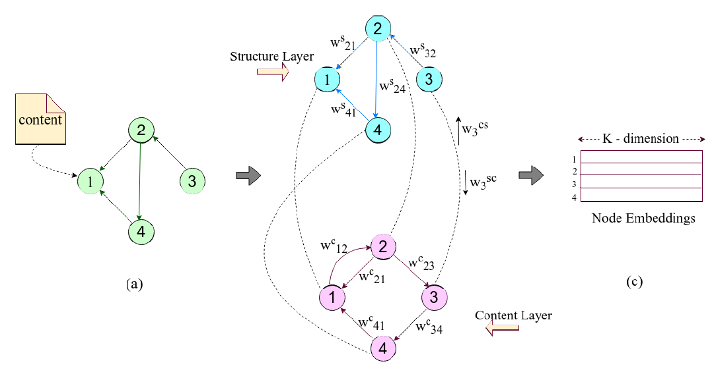

Sac2Vec(structure and content to vector), a network representation technique using structure and content. It is a multi-layered graph approach which uses a random walk to generate the node embedding.

G = (V, E, W, F), F can be considered as the content matrix.其中$f_i$ 是the word vector (content) associated with the node

F可以用词袋模型(bag-of-words)表示，矩阵的每一行是相应结点的文本内容的tf-idf向量，所以F的维度是n×d，d是语料中的unique words的数量。(预处理之后)

给定输入网络G=(V,E,W,F),分为两层：

Structure Layer:  这一层是$G_s=(V,E_s,W_s) , E_s=E, W_s=W$

Content Layer:  这一层是有向图$G_c=(V,E_c,W_c) , w_{ij}^c=Cosine(F_i, F_j), 但是只保留top \; \theta \times \lceil avg_s \rceil的出去的边，其中\theta是一个正整数，avg_s $ 是Structure layer的结点的平均出度，|E|/n(有向)，2×|E|/n(无向)

**Convex Sum of Embeddings: CSoE**

用node2vec为结构层和内容层独立地生成embeddings,然后取两个embeddings的凸组合(维度一致时才能用)

$e_{convex}^i = \alpha e_s^i + (1-\alpha) e_c^i，\forall i \in \lbrace 1,2,...,n \rbrace \; and \; 0 \leq \alpha \leq 1$

**Appended Embeddings: AE**

将两个向量拼接起来,维度不一样也可以

$e_{appended}^i = [e_s^i || e_c^i]，e_s^i \in R^{K_s}, e_c^i \in R^{K_c}, e_{appended}^i \in R^{K_s+K_c}, \forall i \in \lbrace 1,2,..,n \rbrace$

**SaC2Vec Model**

为structure layer的结点$v_i^s$定义$\Gamma_i^s$如下：content layer的$\Gamma_i^c$类似

$\Gamma_i^s = \lbrace (v_i^s, v_j^s) \in E_s | w_{v_i^s, v_j^s}^s \geq \frac1{|E_s|}\sum_{e' \in E_s} w_{e'}^s, v_j^s \in V \rbrace$

是i的那些权重大于该层平均边权重的出边的集合。

两层相同结点之间的权重：

$w_i^{sc} = ln(e+|\Gamma_i^s|), w_i^{cs} = ln(e+|\Gamma_i^c|)$

**random walk**

当前所在结点是$v_i$，要么是结构层，要么是内容层，下一步走到哪一层呢？我们的目标是to move to a layer which is more informative in some sense at node $v_i$.

$p(v_i^s|v_i) = \frac{w_i^{cs}}{w_i^{sc}+w_i^{cs}}$

$p(v_i^c|v_i) = 1- p(v_i^s|v_i)=\frac{w_i^{sc}}{w_i^{sc}+w_i^{cs}}$

考虑第一个式子，$w_i^{sc}$越大，结点$v_i^s$ 的那些权重大于结构层的相对高的权重的出边越多，此时random walk如果在结构层，在走下一步时会有很多选择。如果$w_i^{sc}$很小，random walk 处在结构层的话，下一步选择会很少，此时的选择会更有信息丰富性，并且less random.所以，当$w_i^{sc}$很大时，倾向于选择content layer, 当$w_i^{cs}$很大时，倾向于选择structure layer.一旦选择了某一层，在走下一步时就不用考虑另一层了。

**Algorithm 1 SaC2Vec** - Structure and Content to Vector
1:    Input: The network G = (V,E,W, F), K: Dimension of the embedding space where K << min(n, d)(d是distinct words的数量), r: Number of time to start random walk from each vertex, l: Length of each random walk
2:    Output: The node embeddings of the network G
3:    Generate the structure layer and the content layer
4:    Add the edges between the layers with weights to generate the multi-layered network
5:    Corpus = [ ] .                            Initialize the corpus
6:    for iter $\in$ {1, 2, ..., r} do
7:    		for $v \in V$ do
8:   			 select the node v as the starting node of the random walk
9:    			Walk = [v] . 			Initialize the Walk(sequence of nodes)
10:  			for walkIter $\in$ {1, 2, ..., l} do
11: 	 			Select the layer to move next with probabilities
12:  				Move 1 step using node2vec to find the next node $v_i$
13:  				Append $v_i$ to Walk
14:  			end for
15:  			Append Walk to Corpus
16:  		end for
17:  end for
18:  Find the node embeddings by running language model on Corpus(SkipGram模型，最大化给定该结点的向量表示出现context nodes的概率)

实验：node classication, node clustering and network visualization

It means SaC2Vec is able to understand the bad quality of the content layer during the learning process and embeddings were learnt mostly from the structure layer.

##边的表示

###feature propagation-特征前向传播+edge2vec-[2018]

We study feature propagation on graph, an inference process involved in graph representation learning tasks。however few works studied the convergence of feature propagation

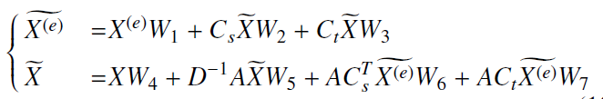

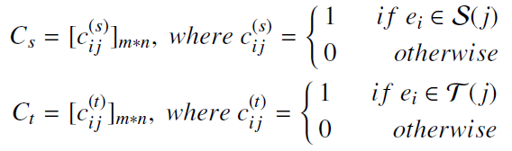

Xiang B, Liu Z, Zhou J, et al. 

Feature Propagation on Graph: A New Perspective to Graph Representation Learning

[J]. arXiv preprint arXiv:1804.06111, 2018. 

###Low-Rank Asymmetric Projections-[2017CIKM]

Abu-El-Haija S, Perozzi B, Al-Rfou R. Learning edge representations via low-rank asymmetric projections[C]//Proceedings of the 2017 ACM on Conference on Information and Knowledge Management. ACM, 2017: 1787-1796. 

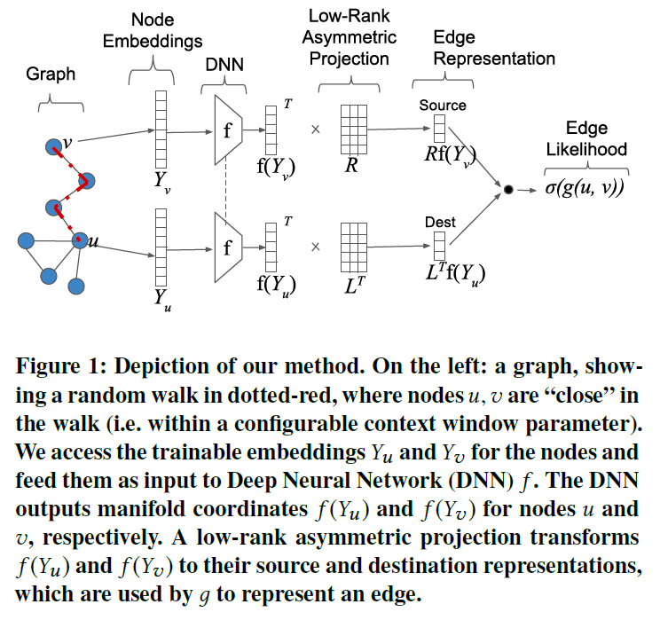

###Graph Embedding through Attention-[2017]

Abu-El-Haija S, Perozzi B, Al-Rfou R, et al. Watch your step: Learning graph embeddings through attention[J]. arXiv preprint arXiv:1710.09599, 2017. 

In this paper, we replace random walk hyperparameters with trainable parameters that we automatically learn via backpropagation. In particular, we learn a novel attention model on the power series of the transition matrix, which guides the random walk to optimize an upstream objective.

A general framework:

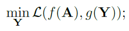

main objective:

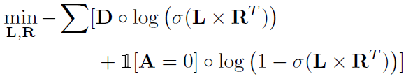

parametrized conditional expectation:

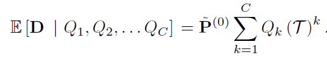

Softmax Attention:

$\lambda$ Geometric Decay Attention:

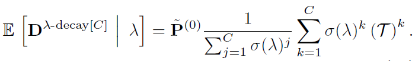

Training objective:

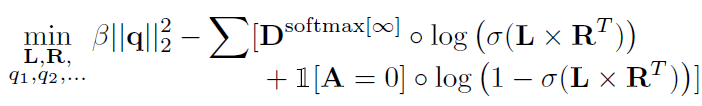

## 关系relation

## 推理

###多关系嵌入的类比推理-[2017ICML]

Liu H, Wu Y, Yang Y. Analogical inference for multi-relational embeddings[J]. arXiv preprint arXiv:1705.02426, 2017. 

https://github.com/quark0/ANALOGY

We presented a novel framework for explicitly modeling analogical structures in multi-relational embedding, along with a differentiable objective function and a linear-time inference algorithm for large-scale embedding of knowledge graphs.

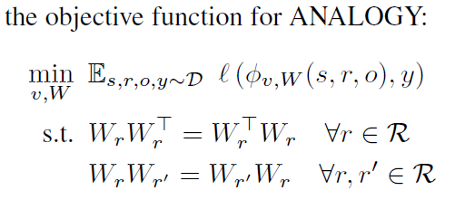

## Word Embedding的稳定性的影响因素-[2018]

Wendlandt L, Kummerfeld J K, Mihalcea R. 

Factors Influencing the Surprising Instability of Word Embeddings

[J]. arXiv preprint arXiv:1804.09692, 2018. 

We define stability as the percent overlap between nearest neighbors in an embedding space

两个embedding空间，找到同一个词的最近的十个邻居，将两个邻居列表的重叠作为词W的stability。

多个embedding空间时，considering the average overlap between two sets of embedding spaces

建立回归模型：

自变量是(1) properties related to the word itself; (2) properties of the data used to train the embeddings; and (3) properties of the algorithm used to construct these embeddings.

岭回归，最小化下列函数：

$L(w) = \frac12 \sum_{n=1}^N (y_n - w^T x_n)^2 + \frac{\lambda}2 ||w||^2$

we set 正则化常数 $\lambda = 1$

**Word Properties：**

Primary part-of-speech： Adjective
Secondary part-of-speech： Noun

Parts-of-speech： 2

WordNet senses： 3

Syllables： 5		音节

**Data Properties**

Raw frequency in corpus A： 106
Raw frequency in corpus B： 669
Diff. in raw frequency： 563
Vocab. size of corpus A： 10,508
Vocab. size of corpus B： 43,888
Diff. in vocab. size： 33,380
Overlap in corpora vocab.： 17%
Domains present： Arts, Europarl
Do the domains match?： False
Training position in A： 1.02%
Training position in B： 0.15%
Diff. in training position： 0.86%
**Algorithm Properties**
Algorithms present： word2vec, PPMI
Do the algorithms match?： False
Embedding dimension of A： 100
Embedding dimension of B： 100
Diff. in dimension： 0
Do the dimensions match?：True

we show that domain and part-of-speech are key factors of instability

In order to use the most stable embedding spaces for future tasks, we recommend either
using GloVe or learning a good curriculum for word2vec training data. We also recommend
using in-domain embeddings whenever possible。

##图嵌入+简单约束-[2018]

Ding B, Wang Q, Wang B, et al. Improving Knowledge Graph Embedding Using Simple Constraints[J]. arXiv preprint arXiv:1805.02408, 2018. 

https://github.com/iieir-km/ComplEx-NNE_AER

we combine together the basic embedding model of ComplEx, the non-negativity constraints on entity representations, and the approximate entailment constraints over relation representations.The overall model is presented as follows

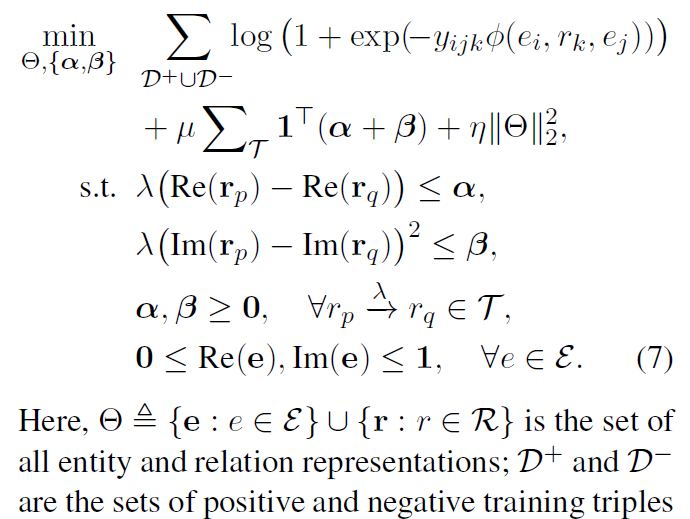

the first term of the objective function is a typical logistic loss, which enforces triples to have scores close to their labels. The second term is the sum of slack variables in the approximate entailment constraints, with a penalty coefficient μ ≥ 0. The motivation
is, although we allow slackness in those constraints we hope the total slackness to be small, so that the constraints can be better satisfied. The last term is L2 regularization to avoid over-fitting, and η ≥ 0 is the regularization coefficient.

##GAKE-[2016coling]

Feng J, Huang M, Yang Y. GAKE: Graph aware knowledge embedding[C]//Proceedings of COLING 2016, the 26th International Conference on Computational Linguistics: Technical Papers. 2016: 641-651. 

https://github.com/JuneFeng/GAKE

in reality, triples are connected to each other and the whole knowledge base could be regarded as a directed graph consisting of vertices (i.e., entities) and directed edges (i.e., relations).we present a novel method to learn the representations of knowledge by utilizing **graph context**(Neighbor context, Edge context, Path context)

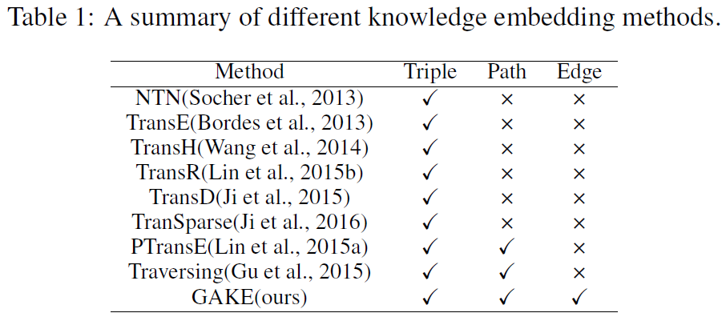

s = (t, k) to represent a subject (i.e., a vertex or an edge) of the knowledge graph
G, where t indicates subject type, and k is the index of the corresponding vertex or edge. Specifically, we let t = 0 to denote a vertex and let t = 1 to denote an edge. We use a set S = {$s_i$} to represent all subjects in G.

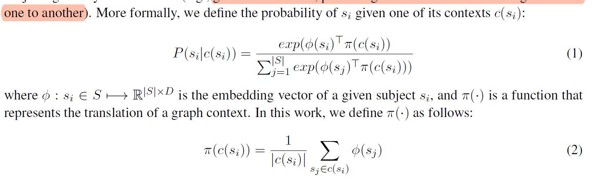

Neighbor context

Formally, when si is an entity, its neighbor context cN(si) is a pair of subjects (e, v), where v is an another vertex in G and e is a directed edge links si and v. In the case of si is a relation, its neighbor context cN(si) is a pair (v, v'), where v and v' are two vertices connected by si. One thing worth to notice is that neighbor context is equivalent to using triplets relevant to the given subject si.

The objective function of taking neighbor context into consideration is to maximize the log-likelihood of all subjects given by their neighbor contexts. Based on Eq. 1, we have

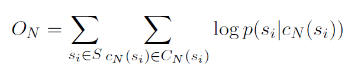

Path context: random walk

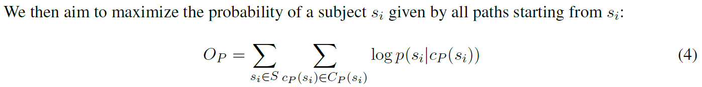

Edge context

When si is a vertex, cE(si) is a set of edges of si, while when si is an edge, cE(si) consists of all vertices connected with si.

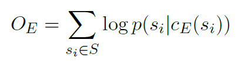

Attention Mechanism

The basic idea of the attention mechanism is using an attention model a(si) to represent how subject si selectively focuses on representing another subject sj when si is a part of sj ’s context

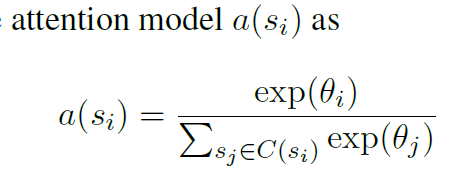

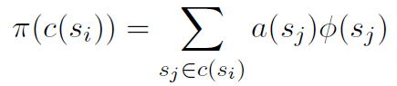

To utilize these three types of context, we combine them by jointly maximizing the objective functions

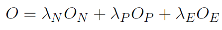

λ represent the prestige of neighbor context, path context and edge context separately.

## Trans系列

###TransE

将知识库中的关系看作实体间的某种平移向量，对于每个三元组(h,r,t)，TransE用关系r的向量$l_r$ ,作为头实体向量$l_h$ 和尾实体向量$l_t$ 之间的平移，也可以看作翻译。

对于每个三元组$(h,r,t)$ ，TransE希望 $l_h + l_r \approx l_t$

损失函数 $f_r(h,t) = |l_h+l_r-l_t|_{L1/L2}$ ,即向量$l_h+l_r$ 和$l_t$ 的$L_1$ 或$L_2$ 距离。

在实际学习过程中，为了增强知识表示的区分能力，TransE采用最大间隔方法，定义了如下优化目标函数：

$L=\sum_{(h,r,t)\in S}\sum_{(h',r',t')\in S^-} max(0, f_r(h,t) + \gamma - f_{r'}(h',t'))$

其中S是合法三元组的集合，$S^-$ 为错误三元组的集合（将S中每个三元组的头实体、关系和尾实体其中之一随机替换成其他实体或关系得到），$\gamma$ 为合法三元组得分与错误三元组得分之间的间隔距离。

Translating embeddings for modeling multi-relational data

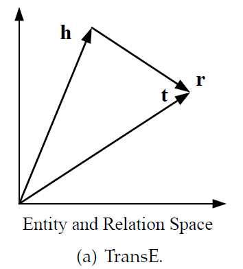

###TransH模型

为了解决TransE模型在处理1-N，N-1，N-N复杂关系时的局限性，TransH模型提出让一个实体在不同的关系下拥有不同的表示。

对于关系r, TransH模型同时使用平移向量$l_r$ 和超平面的法向量$w_r$ 来表示它。对于一个三元组(h,r,t), TransH首先将头实体向量$l_h$ 和尾实体向量$l_r$ 沿法线$w_r$ 投影到关系r对应的超平面上，用$l_{h_r}$ 和$l_{t_r}$ 表示如下：

$l_{h_r} = l_h - w_r^T l_h w_r$

$l_{t_r} = l_t - w_r^T l_t w_r$

因此TransH定义了如下损失函数：$f_r(h,t) = |l_{h_r}+l_r-l_{t_r}|_{L1/L2}$

由于关系r可能存在无限个超平面，TransH简单地令$l_r$ 与$w_r$ 近似正交来选取某一个超平面。

Knowledge graph embedding by translating on hyperplanes

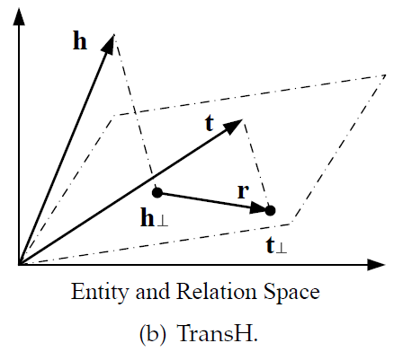

###TransR / CTransR模型

虽然TransH模型使每个实体在不同关系下拥有了不同的表示，它仍然假设实体和关系处于相同的语义空间$R^d$ 中，这一定程度上限制了TransH的表示能力。TransR模型则认为，一个实体是多种属性的综合体，不同关系关注实体的不同属性。TransR认为不同的关系拥有不同的语义空间。对每个三元组，首先应将实体投影到对应的关系空间中，然后再建立从头实体到尾实体的翻译关系。

对于每一个关系r，TransR定义投影矩阵$M_r \in R^{d×k}$ ,将实体向量从实体空间投影到关系r的子空间，用$l_{h_r}$ 和$l_{t_r}$ 表示如下：

$L_{h_r} = l_h M_r$, $L_{t_r} = l_t M_r$

然后使$l_{h_r}+l_r \approx l_{t_r}$ .因此，TransR定义了如下损失函数：

$f_r(h,t) = |l_{h_r}+l_r-l_{t_r}|_{L1/L2}$

CTransR模型通过把关系r对应的实体对的向量差值$l_h-l_t$ 进行聚类，将关系r细分为多个子关系$r_c$ ,CTransR模型为每一个子关系$r_c$ 分别学习向量表示，对于每个三元组(h,r,t),定义了如下损失函数：

$f_r(h,t) = |l_{h_r}+l_{r_c}-l_{t_r}|_{L1/L2}$

Learning entity and relation embeddings for knowledge graph completion

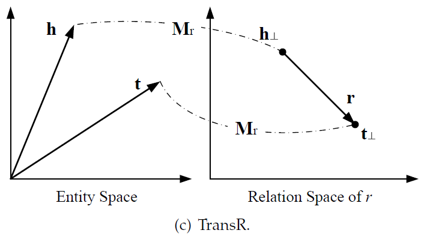

###TransD模型

TransR缺点:

1.在同一个关系r下，头、尾实体共享相同的投影矩阵。然而，一个关系的头、尾实体的类型或属性可能差异巨大。

2.从实体空间到关系空间的投影是实体和关系之间的交互过程，因此TransR让投影矩阵仅与关系有关是不合理的。

3.与TransE和TransH相比，TransR由于引入了空间投影，使得TransR模型参数急剧增加，计算复杂度大大提高。

给定三元组(h,r,t), TransD模型设置了2个分别将头实体和尾实体投影到关系空间的投影矩阵$M_{rh}$ 和$M_{rt}$ ，具体定义如下：

$M_{rh} = l_{r_p}l_{h_p} + I^{d×k}$,  $M_{rt} = l_{r_p}l_{t_p} + I^{d×k}$

这里$l_{h_p}, l_{t_p}\in R^d, l_{r_p} \in R^k$ ,下标p代表该向量为投影向量。显然，$M_{rh}$ 和$M_{rt}$ 与实体和关系均相关。而且，利用2个投影向量构建投影矩阵，解决了原来TransR模型参数过多的问题。最后，TransD模型定义了如下损失函数：

$f_r(h,t) = ||l_hM_{rh}+l_r-l_tM_{rt}||_{L1/L2}$

Knowledge graph embedding via dynamic mapping matrix

###TranSparse模型

为了解决实体和关系的异质性(某些关系可能会与大量的实体有连接，而某些关系则可能仅仅与少量实体有连接)，TranSparse提出使用稀疏矩阵代替TransR模型中的稠密矩阵，其中矩阵$M_r$ 的稀疏度由关系r连接的实体对数量决定。这里头、尾实体共享同一个投影矩阵$M_r$ 。投影矩阵$M_r(\theta_r)$ 的稀疏度$\theta_r$ 定义如下：$\theta_r=1-(1-\theta_{min})N_r / N_{r^*}$

为了解决关系的不平衡性问题(在某些关系中，头实体和尾实体的种类和数量可能差别巨大)，TranSparse对于头实体和尾实体分别使用2个不同的投影矩阵。

Knowledge graph completion with adaptive sparse transfer matrix

###TransA模型

Xiao等人认为TransE及其之后的扩展模型均存在2个重要问题：1）损失函数只采用$L_1$ 或$L_2$ 距离，灵活性不够；2）损失函数过于简单，实体和关系向量的每一维等同考虑。

TransA模型将损失函数中的距离度量改用马氏距离，并为每一维学习不同的权重。对于每个三元组(h,r,t), TransA模型定义了如下评分函数：

$f_r(h,t)=(l_h+l_r-l_t)^TW_r(l_h+l_r-l_t)$, 其中$W_r$ 为与关系r相关的非负权值矩阵。

TransA: An adaptive approach for knowledge graph embedding

###TransG模型

TransG模型提出使用高斯混合模型描述头、尾实体之间的关系。该模型认为，一个关系会对应多种语义，每种语义用一个高斯分布来刻画。

TransG: A generative mixture model for knowledge graph embedding

###PTransE

考虑关系路径，Path-based TransE

面临的挑战在于：

1）并不是所有的实体间的关系路径都是可靠的。为此，PTransE提出Path-Constraint Resource Allocation图算法度量关系路径的可靠性。

2）PTransE需要建立关系路径的向量表示，参与从头实体到尾实体的翻译过程。这是典型的组合语义问题，需要对路径上所有关系的向量进行语义组合产生路径向量。PTransE尝试了3种代表性的语义组合操作，分别是相加、按位相乘和循环神经网络。相关数据实验表明，相加的组合操作效果最好。

### TransNet

TransNet 假设头结点表示向量加上关系表示向量等于尾节点表示向量. 其
中, 通过关键词抽取、命名实体识别等方式, 对交互文本抽取出标签集合来表示关系. 随后, 通过深层自动编码器对标签集合进行压缩, 来得到关系的表示向量. 该模型能够有效地预测未标注的边上的标签集合, 在社会关系抽取任务上取得了显著的提升.

 Tu C C, Zhang Z Y, Liu Z Y, et al. TransNet: translation-based network representation learning for social relation extraction. In: Proceedings of International Joint Conference on Artificial Intelligence (IJCAI), Melbourne, 2017

### TransF

Do K, Tran T, Venkatesh S. Knowledge Graph Embedding with Multiple Relation Projections[J]. arXiv preprint arXiv:1801.08641, 2018. 

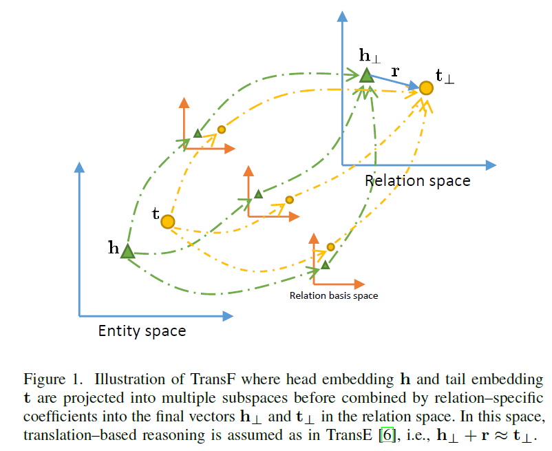

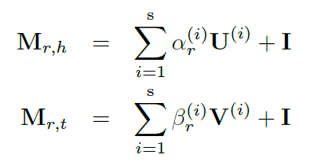

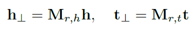

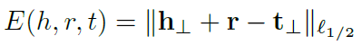

## KG2E模型

KG2E使用高斯分布来表示实体和关系，其中高斯分布的均值表示的是实体或关系在语义空间中的中心位置，而高斯分布的协方差则表示该实体或关系的不确定度。

Learning to represent knowledge graphs with Gaussian embedding

##Event Embedding

Ding X, Zhang Y, Liu T, et al. Knowledge-driven event embedding for stock prediction[C]//Proceedings of COLING 2016, the 26th International Conference on Computational Linguistics: Technical Papers. 2016: 2133-2142. 

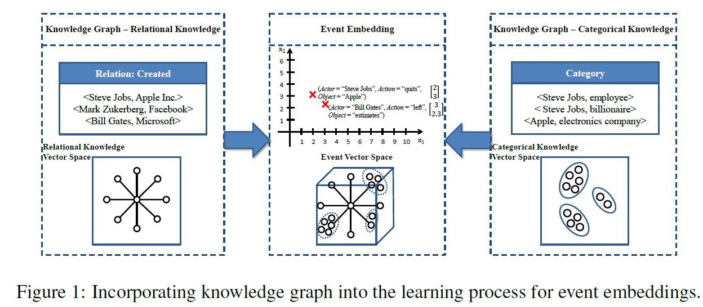

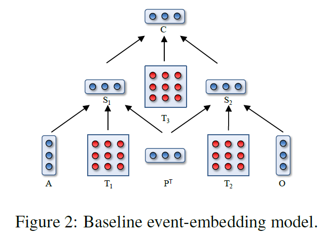

event tuples E = (A, P,O), where P is the action or predicate, A is the actor or subject and O is the object on which
the action is performed.

The inputs of the neural tensor network (NTN) are the word embeddings of A, P and O, and the outputs are event embeddings. We learn an initial word representation of d-dimensions (d = 100) from a large-scale financial news corpus, using the skip-gram algorithm (Mikolov et al., 2013).

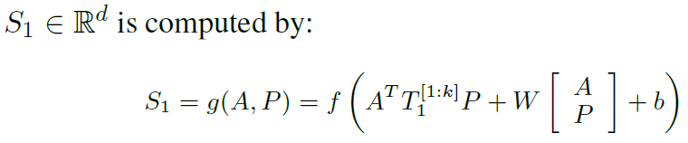

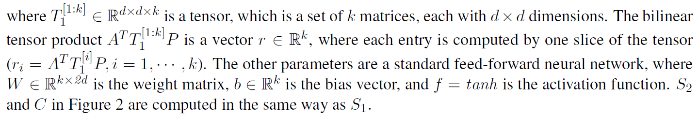

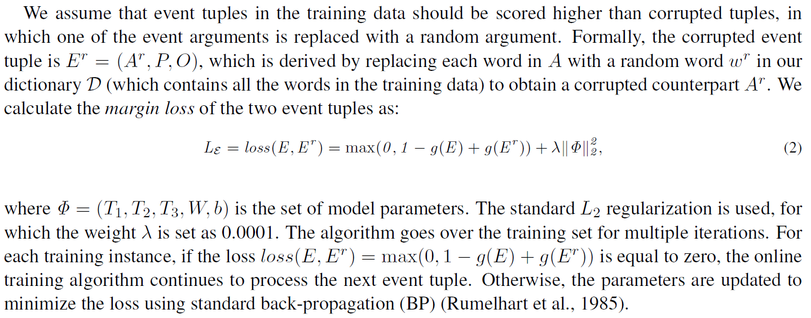

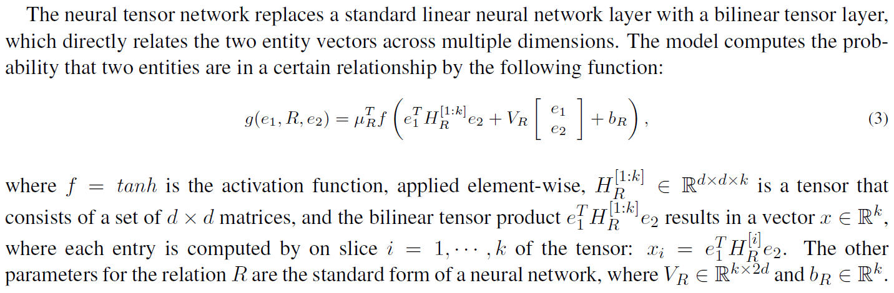

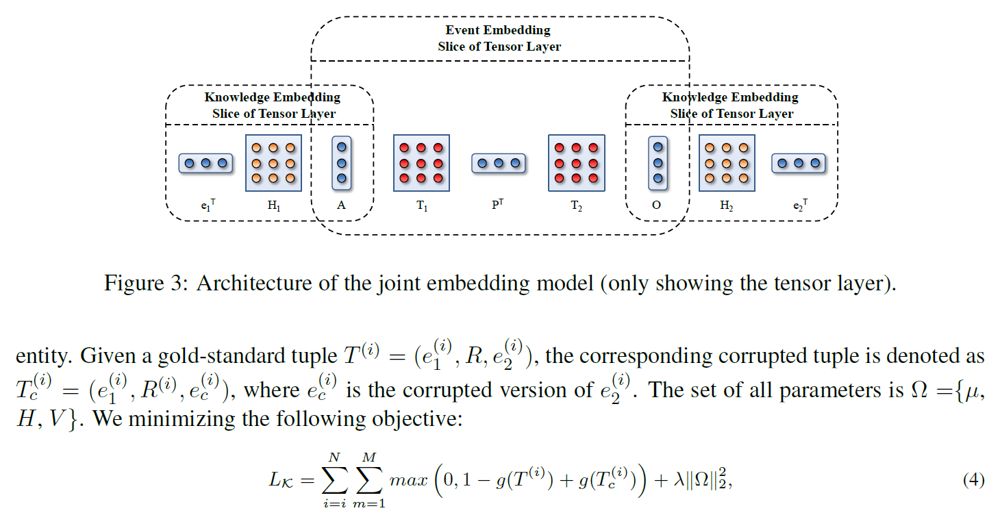

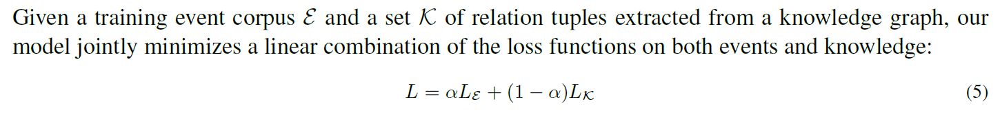

## 异常检测

###属性网络的异常

Liang J, Jacobs P, Sun J, et al. Semi-supervised embedding in attributed networks with outliers[C]//Proceedings of the 2018 SIAM International Conference on Data Mining. Society for Industrial and Applied Mathematics, 2018: 153-161. 

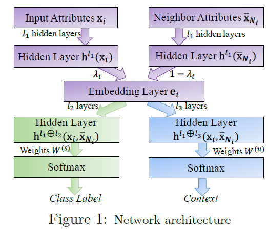

