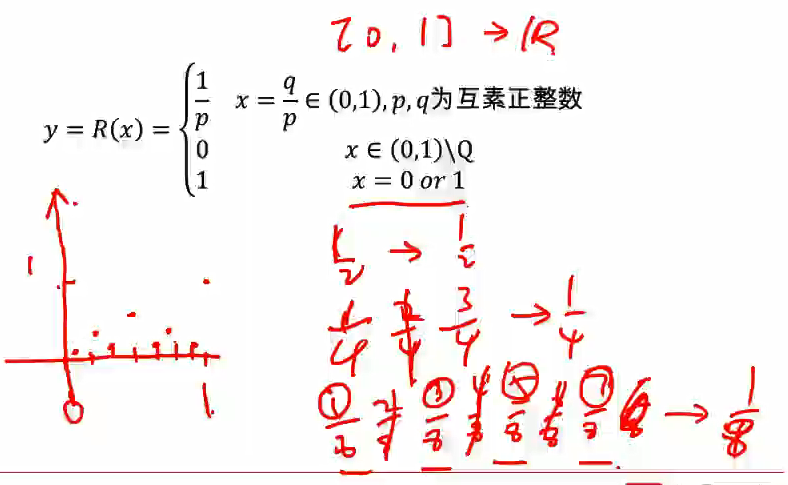

## 数学基础(小象)

- 参考资料：

[1]高等数学（第二版）（上/下册）李忠、周建莹 编著 北京大学出版社

[2]数学分析（第一、二、三册） 伍胜健 编著 北京大学出版社

[3]数学分析中的典型问题与方法（第二版） 裴礼文 编著 高等教育出版社

[4]简明线性代数 丘维声 编著 北京大学出版社

[5]最优化理论与方法 袁亚湘、孙文瑜 编著 科学出版社

[6]Stephen Boyed and Lieven Vandenberghe. Convex optimization. Cambridge university press, 2009

[7]BBC数学的故事<https://www.bilibili.com/video/av487963/>

[8]数学大师 从芝诺到庞加莱 E.T.贝尔著 徐源 译 上海科技教育出版社

[9]天才引导的历程 威廉·邓纳姆 著 苗锋 译 中国对外翻译出版公司

- 演示软件：

[1]WolframAlpha [Wolfram|Alpha: Making the world’s knowledge computable](http://www.wolframalpha.com/)

[2]MATLAB

[3]Python

###集合

集合，元素，子集，真子集，交并差

基数：集合中元素的个数称为集合的基数（又称势），记为|A|

下列语句：(1)0与{0}表示同一个集合；(2)由1，2，3组成的集合可表示为{1，2，3}或{3，2，1}；(3)方程(x-1)(x-1)(x-2)=0的所有解的集合可表示为 {1，1，2}；（4）集合{ }是有限集，正确的是

A:只有（1）和（4）

B:只有（2）和（3）

C:只有（2）

D:以上选项都不对

解析:(1)错误，(2)正确，（3）错误，（4）正确

### 实数集&康托定理

区间，领域，空心领域

**实数集上的数和数轴上的点一一对应**

Q1.有理数是否布满数轴？

并没有（还有无理数呢）

Q2.有理数在数轴上以何种状态存在？

稠密，$\forall (a,b)\bigcap Q\ne \emptyset$

(a,b)是个区间，存在$1/10^n < |a-b|$

Q3.似乎实数集好像是"连续"的，那么怎么描述"连续性"？

完备性的刻画

**1.在实数域中，任意一个单调有界序列必然有极限**

**2.确界存在定理**

**非空有上界的实数集必然有上确界，非空有下界的实数集必然有下确界**

上确界M=supE和下确界M=infE就是上界中最小的那个，下界中最大的一个

比如(1,2]的上确界是2，下确界是1

有理数有多少个？无穷？。无理数有多少个？无穷。实数有多少个？无穷。无穷和无穷是不是一样大？

**等势**：集合A到集合B存在双射(元素一一对应)，称A与B等势，记为$A\approx B$，特别地，称与自然数集N等势的集合为可列集。

$Z \approx N$，用自然数集给整数集编号

$N\approx Q$，用自然数集给有理数集编号

$(0,1)\approx R$，tanx的图像将$(-\frac{\pi}2, \frac{\pi}2)$映射到R上，只要将其转换成(0,1)即可

（康托定理）$N\not\approx R$

证明方式：$N\not\approx R\approx (0,1)\approx [0,1]$，证明$N\not\approx[0,1]$

根据康托定理有$Q\not\approx R，Q\not \approx 无理数$

因为$\sqrt 2+Q\subset 无理数$，所以$|Q|\le |无理数|$

如果有理数和无理数的基数一样，那么R就相当于两个Q，也就相当于两个N，就有$N\approx R$，与康托定理矛盾。

### 常用不等式

三角不等式：|x+y|≤|x|+|y|

**伯努利(Bernoulli)不等式**

对于任意的$x\ge -1$和任意的正整数n，有$(1+x)^n \ge 1+nx$

算数-几何平均值不等式

对于任意n个非负实数$x_1,x_2,...x_n$有

$\frac{x_1+x_2+...+x_n}n \ge \sqrt[n]{x_1x_2...x_n}$

**即算术平均值≥几何平均值**

例如：已知x>0，则$\frac x3+\frac x3+\frac x3+\frac {27}{x^3}\ge 4$

### 映射

映射，对于A中的每个元素，B中有唯一确定的元素b与之对应，A为原象集，B为象集。

单射（嵌入映射）：A中的不同元素的象是不同的

满射（到上映射）：B中所有元素都有原象

双射（一一映射）：既是单射又是满射

### 函数

**六类基本初等函数**：

- 常值函数$y=x^{\alpha}，\alpha>0$
- 幂函数$y=a^x，a>0$
- 指数函数$y=log_a^x，a>0，a\ne 1$
- 三角函数y=sinx，y=cosx，y=tanx，y=cotx，y=secx，y=cscx
- 反三角函数y=arcsinx，y=arccosx，y=arctanx，y=arccotx

"六边形法则"为了记忆

$sin^2x+cos^2x=1，tan^2x+1=sec^2x，1+cot^2x=csc^2x$

sinx*cscx=1等

注意反三角函数的定义域和值域

**四则运算，复合运算，反函数**

如果f是双射，那么f可逆，记为$f^{-1}$

**几个特殊函数**

符号函数：x>0时y=1，x=0时y=0，x<0时y=-1

高斯(Gauss)取整函数y=[x]（向下取整）

狄利克雷(Dirichlet)函数：x是有理数，y=1，否则y=0

黎曼(Riemann)函数：

**有界，单调性，周期性，奇偶性**

X关于原点对称的前提下，奇函数f(x)=-f(-x)，偶函数f(x)=f(-x)

奇函数的反函数也是奇函数

