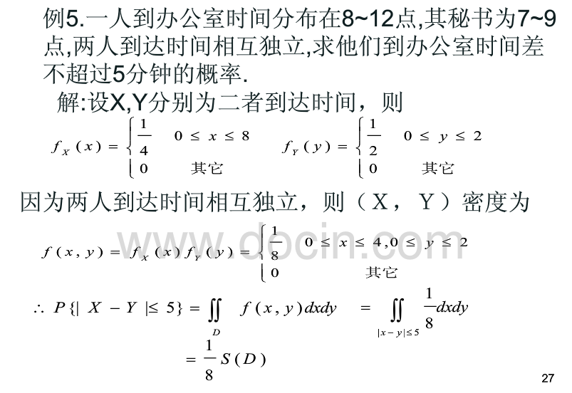

##均值方差&协方差

均匀分布，均值和方差，$D(\overline{X})=$ **

(a+b)/2，(b-a)^2/12，D(X)/n

**协方差和相关系数**

A. 协方差的正或负，反映两个变量X、Y是同向变化或反向变化

B. 协方差的绝对值，反映两个变量X、Y同向或反向变化的程度

C. 两个变量的相关系数是消除量纲和标准化之后的特殊的协方差

D. 相关系数反应两个变量每单位变化的相似程度
ABCD

**max(X,Y),min(X,Y)的期望求解**

max(X,Y)=1/2(X+Y+|X−Y|);

min(X,Y)=1/2(X+Y−|X−Y|);

http://sofasofa.io/forum_main_post.php?postid=1001602

##PDF等

**以下关于PMF(概率质量函数),PDF(概率密度函数),CDF(累积分布函数)描述错误的是()**

```
PDF描述的是连续型随机变量在特定取值区间的概率
CDF是PDF在特定区间上的积分
PMF描述的是离散型随机变量在特定取值点的概率
有一个分布的CDF函数H(x),则H(a)等于P(X<=a)
```

A，概率**质量**函数 (probability mass function，PMF)是**离散随机变量**在各特定取值上的概率。

概率**密度**函数（p robability density function，PDF ）是对 **连续随机变量** 定义的，本身不是概率，只有对连续随机变量的取值进行积分后才是概率。

累积分布函数（cumulative distribution function，CDF） 能完整描述一个**实数随机变量**X的概率分布，是概率密度函数的积分。对於所有实数x ，与pdf相对。


## 分布

**平面上平均每4个单位面积有一个染色点,观察一定面积上的点数X,X近似服从()**

泊松分布的参数λ是单位时间(或单位面积)内随机事件的平均发生率。 泊松分布适合于描述单位时间内随机事件发生的次数。（来自百度百科）

这里某个单位面积有染色点可以看做是个随机事件，而在一定面积上观察这个一定面积可以看做是单位时间

**一领导到达办公室的时间均匀分布在8至12时,他的秘书到达办公室的时间均匀分布在7至9时,设他们到达的时间相互独立,求他们到达时间不超过5分钟的（1／12小时）的概率?**

先随机选定秘书在某分钟到的概率为 P1 = 1/120 ,负责人到办公室的概率p2=1/240
在7点55与8点过5分直接到时,碰见的概率为 积分 ∫ 1/120\*1/240\*（x+5）dx ,x在（-5,5）之间积分.
在8点过5分到9点 直接到时,碰见的概率为 积分 1/120 ∫ 1/240\*10 dx ,x在（5,60）之间积分.
所以概率为 1/120*1/240 *(5+5)^2/2 + 1/240*10 *55/120
=1/120*10/240 *5 + 1/240*10 *55/120 
=1/120*10/240 + 1/240*10 *60/120 
=1/48
所以他们时间相差不超过 5分钟的概率为 1/48



设X和Y分别是领导和他的秘书到达办公室的时间,由假设X和Y的概率密度为
＝1/4,8＜X＜12,0,其它 ＝1/2,7＜y＜12 ,0,其他
因为X.Y相互独立,故（X,Y）的概率密度为
1/8 ,8＜x＜12.7＜y＜9 0,其它.
按题意需要求概率
P｛｜X－Y｜}≤1/12,画出区域：｜X－Y｜≤1/12,以及长方行〔8＜x＜12;7＜y＜9〕,它们的公共部分是个四边行,记为G,显然仅当（X,Y）取值为G内,他们两人到达的时间相差才不超过1/12小时.所求概率为
y-x=1/12 y-x=-1/12
P｛｜X－Y｜≤1/12}= =1/8×(G的面积).
而G的面积=三角形ABC的面积－三角形AB`C`的面积
=1/2（13/12）2－1/2（11/12）2＝1/6
1/6×1/8=1/48
即领导和他的秘书到达办公室的时间相差不超过5分钟的概率为1/48.


一个人4小时间某一分钟到的概率是1/240
秘书2小时间某一分钟到的概率是1/120
5分钟内两人到的概率是1/2880

相差不到5分钟，先到晚到都行，乘以10

两个人相交的时间段只有1小时 再乘以60=1/48

##切比雪夫&中心极限

**切比雪夫不等式，中心极限定理**

$P(|X-\mu|\ge k\sigma)\le \frac1{k^2}$

$P(|X-\mu|\ge \epsilon)\le \frac{\sigma^2}{\epsilon^2}$

中心极限定理：

 

##分层抽样

分层抽样适用在哪些情况**

```
选项：
研究的总体非常小 

在调研中希望了解不同子群体的差异 

总体中只有一部分样本是可以调研的 

没有先验的总体信息 

分层抽样法也叫类型抽样法。它是从一个可以分成不同子总体（或称为层）的总体中，按规定的比例从不同层中随机抽取样品（个体）的方法。这种方法的优点是，样本的代表性比较好，抽样误差比较小。缺点是抽样手续较简单随机抽样还要繁杂些。定量调查中的分层抽样是一种卓越的概率抽样方式，在调查中经常被使用。
总体中赖以进行分层的变量为分层变量，理想的分层变量是调查中要加以测量的变量或与其高度相关的变量。
只有当被查总体中大部分项目（的金额）分布均匀，少数项目属于高金额或低金额之类的异常项目时，运用分层抽样法才有意义。

实施分层抽样的可能原因：
1）总体规模与样本容量大，总体单元之间的差异较大
2）掌握先验信息，可以将总体按一定指标划分为子总体(strata)
链接:https://www.applysquare.com/topic-cn/THmJiXOOE/

```


##线性回归

残差的无偏估计是SSE/(n-p)？

**对n个样本点进行无结局的的线性回归拟合,使得残差平方和最小,回归方程为y=kx,则可推导出的回归系数k为 **

$\frac{\sum_{i=1^n} Y_i X_i}{\sum_{i=1}^n X_i^2}$

**关于线性回归的描述,以下正确的有:**

```
基本假设包括随机干扰项是均值为0,方差为1的标准正态分布
基本假设包括随机干扰项是均值为0的同方差正态分布
在违背基本假设时,普通最小二乘法估计量不再是最佳线性无偏估计量
在违背基本假设时,模型不再可以估计
可以用DW检验残差是否存在序列相关性
多重共线性会使得参数估计值方差减小
```

BCE，一元线性回归的基本假设有

1、随机误差项是一个期望值或平均值为0的随机变量；

2、对于解释变量的所有观测值，随机误差项有相同的方差；

3、随机误差项彼此不相关；

4、解释变量是确定性变量，不是随机变量，与随机误差项彼此之间相互独立；

5、解释变量之间不存在精确的（完全的）线性关系，即解释变量的样本观测值矩阵是满秩矩阵；

6、随机误差项服从正态分布

违背基本假设的计量经济学模型还是可以估计的，只是不能使用普通最小二乘法进行估计。
当存在异方差时，普通最小二乘法估计存在以下问题： 参数估计值虽然是无偏的，但不是最小方差线性无偏估计。

杜宾-瓦特森（DW）检验，计量经济，统计分析中常用的一种检验序列一阶

**自相关** 最常用的方法。

 所谓多重共线性（Multicollinearity）是指线性回归模型中的解释变量之间由于存在精确

相关关系

或高度相关关系而使模型估计失真或难以估计准确。影响

（1）完全共线性下[参数估计](http://baike.baidu.com/view/123231.htm)量不存在

（2）近似共线性下OLS估计量非有效

**多重共线性使参数估计值的方差增大**，1/(1-r2)为[方差膨胀因子](http://baike.baidu.com/view/4502677.htm)(Variance Inflation Factor, VIF)

（3）参数估计量经济含义不合理

（4）变量的显著性检验失去意义，可能将重要的解释变量排除在模型之外

（5）模型的预测功能失效。变大的[方差](http://baike.baidu.com/view/172036.htm)容易使[区间](http://baike.baidu.com/view/70334.htm)预测的“区间”变大，使预测失去意义。

##检验

**给定一组数据,以下哪种方法可以检验数据是否服从正态分布? **

 Q-Q图、wilcoxon符号秩检验、K-S检验、t检验  

 Q-Q图，P-P图 ，直方图 ，箱式图 ，茎叶图 ，偏度系数（Skewness）和峰度系数（Kurtosis） ，**Kolmogorov-Smirnov**检验（D检验）和**Shapiro- Wilk** （W 检验） 

https://blog.csdn.net/zyy160alex5/article/details/9351149

**假设检验的基本步骤**

```
1.根据实际情况提出原假设和备择假设；
2.根据假设的特征，选择合适的检验统计量；
3.根据样本观察值，计算检验统计量的观察值(obs)；
4.选择许容显著性水平，并根据相应的统计量的统计分布表查出相应的临界值(ctrit)；
5.根据检验统计量观察值的位置决定原假设取舍。
```

## 时间序列

**下列时间序列模型中,哪一个模型可以较好地拟合波动性的分析和预测**

```
AR模型
MA模型
ARMA模型
GARCH模型
```

D

AR模型：自回归模型，是一种线性模型，即已知N个数据，可由模型推出第N点前面或后面的数据（设推出P点），所以其本质类似于插值。

MA模型：移动平均法模型，其中使用趋势移动平均法建立直线趋势的预测模型

ARMA模型：自回归滑动平均模型，拟合较高阶模型

GARCH模型：广义回归模型，对误差的方差建模，适用于波动性的分析和预测

## 工具

**SPSS中，整理数据的功能主要在数据和转换上**

**定义一个满足f(f(n))=-n的函数**

```
f(n) = sign(n) - (-1)^n * n
```

```python
def f(n): 
    if n == 0: return 0
    if n >= 0:
        if n % 2 == 1: 
            return n + 1
        else: 
            return -1 * (n - 1)
    else:
        if n % 2 == 1:
            return n - 1
        else:
            return -1 * (n + 1)
```