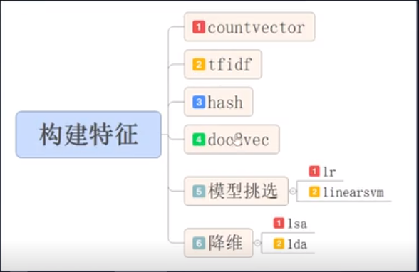
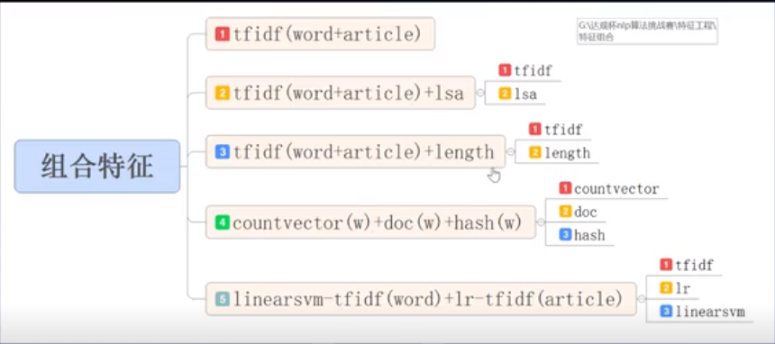
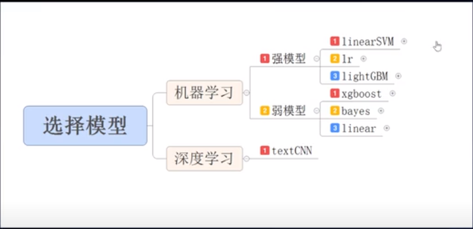
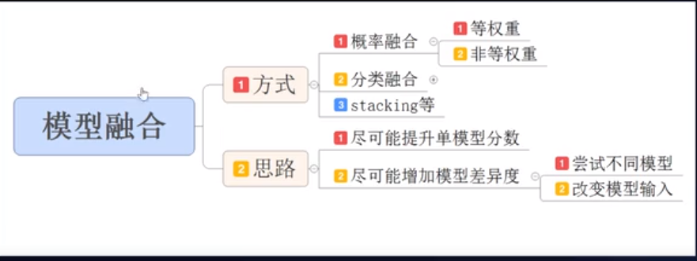

**学习方法三板斧：**

- 记笔记――开博客
- 写代码――存到Github
- 看高水平的论文及其代码

反哺式学习，学习的目的是学懂并且讲给别人听

**如何做好一个AI项目，如何避免做不好一个AI项目：**

- 手握锤子，看哪都是钉子――知识面窄，需要建立知识体系
- 太注重硬件配置，不追求算法效率
- 不求甚解，不会分析错误，只会问，不会分析，误差大还是方差大

先尝试，不需要先把所有理论搞懂

###AI

**所需要的数学理论**

1.优化理论，AI中的部分应用包括：SVM、深度学习BP、决策树等等

2.线性代数与矩阵分析，AI中的部分应用包括：PCA、ICA、推荐系统等等

3.概率与统计，AI中的部分应用包括：朴素贝叶斯等等

4.AI中的各种算法基本上是优化理论、线性代数与矩阵分析和概率与统计的高度融合

**应该怎么学？**

1.以实际应用反推，工程学角度引入。

2.区块化。环环相扣，然后融合。

3.实际应用反复强化。

python的help命令

github:查看相关的案例资料

kaggle:掌握每个算法的基本概念之后，使用kaggle的案例数据进行训练

kettle?

练习复习学习

时间比金钱更重要

最少必要知识

坚持是要不得的想法

**论文**

三大会议是 NIPS、ICML、ICLR。其他会议还包括 AAAI、IJCAI、UAI。每个分支学科也有自己的会议。计算机视觉方面有 CVPR、ECCV、ICCV；自然语言方面，有 ACL、EMNLP、NAACL；机器人方面，有 CoRL（学习）、ICAPS（规划，包括但不限于机器人）、ICRA、IROS、RSS；对于更理论性的研究，有 AISTATS、COLT、KDD。会议是目前论文发表的主要渠道，但是也有一些期刊。JAIR 和 JMLR 是该领域最厉害的两种期刊。偶尔一些论文也会出现在科学期刊上，如 Nature 和 Science。

### 深度&机器学习

Geoffrey Hinton

多看论文，但是不要看太多论文，开始自己思考创造，坚持自己觉得正确的想法
永远不要停止编程

理解底层技术原理，尝试自己实现

Pieter Abbeel

lan Goodfellow

将机器学习应用到感兴趣的领域，或利用已有公开数据

Yoshua Bengio

林元庆

Andrej Karpathy

不要一开始就用TensorFlow等框架，先尝试自己实现，了解底层原理。

Ruslan Salakhutdinov

尝试不同的事情，不要害怕新事物

强化学习，推理和自然语言处理等领域

Yann Lecun

**主要陷阱**

1 假设你的代码没有 bug

机器学习，特别是深度学习和强化学习模型很难进行调试。为了让你了解无数的犯错方式，你可以看看 Andrej Karpathy 发的推文：https://twitter.com/karpathy/status/1013244313327681536

如果你的默认假设是代码可能有问题，那么你将会更加仔细地检索 bug。一行一行地检查代码，并仔细检查中间输出。如果可能的话，将它们进行可视化呈现。张量的形状是否合适？它们是否被正确地初始化、克隆或分离？在模型训练期间监控梯度并注意 NaN。通过设置随机数生成的种子对编写单元测试并使实验结果复现可能有所帮助。

有关神经网络调试的更多小贴士，请参阅 Goodfellow 等人所著的《Deep Learning》一书中第 11.5 章节：Debugging Strategies（调试策略）（http://www.deeplearningbook.org/contents/guidelines.html）

2 只看最终的评估指标

虽然你的项目的目标可能只是实现某些评估指标上的改进，但更重要的是，你应该充分了解模型的工作原理以及取得改进的原因。尤其是在项目的早期阶段，最终评估指标包含的信息很少，但这些信息对迭代和开发算法或者模型却非常有用。

相反，要提出更为深入的问题，并开发出有用的信息诊断方法。如果你已经引入了门控（gating）或注意力机制（attention mechanism），你的模型是否真的利用了它？在你所提出的模型创新中，哪些实际上有助于整体性能的提高？你做过消融研究（ablation study）吗？你的模型需要多少训练样本或轮数（epoch）才能达到合理的性能？和你使用的基线有何区别？你的模型在哪些测试实例上表现良好或很差？它们是否存在系统差异？你的结果对于超参数的变化有多稳健？能够从模型的隐藏状态来预测重要特征吗？

请牢记这一点：**你的研究和项目报告并非是要让研究社区了解你所做的一切与先前最先进的技术相比的一些微小的改进，而是要帮助我们来理解这个领域。这个领域的其他人会想知道哪些是有效的，哪些是无效的，以及你的哪些发现可以应用于他们的问题**。

3 尝试随机变化且无清晰的预期

在当前的深度学习库中，通过添加更多组件、层和优化技巧，很容易使模型变得更加复杂。但是，当你对代码或模型进行更改时，你至少应该对为何这些更改有用有一个直觉。同样，当你进行实验时，你也应该对这个实验结果有清晰的预期。你期望绘制的结果是什么样子的，它们会告诉你什么呢？当你发现自己的模型没有按照预期的方式进行时，这一点就显得尤为重要了。

那么，你现在更有可能看到 bug 的症状，因此，扩展你的模型并不能有助于找到这个 bug，甚至可能使隔离问题变得更加困难。在使你的模型变得更为复杂之前，请先深入了解它可能存在的问题。此外，请记住，在你的报告中必须证明你所做的是正确的。评估你的报告的人，对理解你的思考过程会有兴趣的。

如果你不能制定一个研究假设，并向自己解释为何你做所的事情应该起作用，那么其他任何人很有可能也不能复现你的项目结果。

4 过于复杂

应该要扪心自问：应该起作用的最小的东西是什么？模型能学会记住一个小数据集吗？如果只使用几个参数时，它能学到什么？在单个训练实例而不是批量实例进行训练时，代码是否有效？我们期望看到的最简单的泛化形式是什么？我们期望失败的简单基线是什么？什么是基线的最小扩展才能使它工作？

5 迭代太慢

在短期项目的过程中，不要过早地陷入缓慢的迭代周期是很重要的。使用简单的环境来调试你的模型，并实现对你的想法进行概念验证，这些都可以在个人计算机上运行。

有时一个简单的矩阵游戏或网格世界实验都可以提供有用的想法验证。有时你还可使用 MDP 的精确值函数来测试算法思想，而不必纠缠于梯度估计、Actor-Critic 训练等等。在进行大规模实验时，要简化启动实验和检查结果的流程。在实验完成全部过程之前检查这些结果，看看性能是否平稳。在基础设施上投资，在开始时可能会耗费大量时间，但在项目结束时会有所回报。在分析结果时，要渴望得到有用的信息。

**一些建议**

1 在项目开始之前先了解背景和相关工作

我们通常会在正式开始的日期前几个月就分发项目。其原因是：  

- 三个月对于了解背景和相关工作而言是非常短的时间；
- 三个月对于项目的实施和实验而言也是非常短的时间；
- 三个月对于撰写一份好的报告而言也是非常短的时间。

另外还有一个原因是，我们通常会提出一些研究项目，如果这个项目取得成功，我们有可能会在机器学习领域发表相关论文。虽然我们知道学生在一个学期内会有很多事情要去做，但我们通常都会鼓励你们至少提前开始阅读相关文献。理想情况下，当你开始为项目全职工作时，你应该知道要做什么，它如何与现有方法相关联，并且知道如何做到这一点。这也是熟悉你所选择的机器学习框架的好时机

2 使用版本控制

作为学生，你可以得到免费的私人存储库（https://education.github.com/pack）

3 使用随机重复进行评估

在学术界，你不可能在项目期间访问多个 GPU。然而，尤其是在深度强化学习中，重要的是不要从单个或几个实验中得出聒噪的结论。理想情况下，你希望多次进行实验，并如前所述，得到不同初始条件和超参数的健壮性的感觉。

4 在整个项目中尽早开始写作并始终如一

如果你正在进行一个硕士项目，你的工作将会基于你的书面报告进行评估，而不是基于你已做出但没有足够时间来写清楚的杰出工作。**尽早开始写作，不要低估传播你的研究成果的努力。**

清晰的陈述你的目标、假设和贡献，让读者跟随你的思路。解释你设计选择并清晰地讨论你的发现。理想情况下，你应该在项目过程中始终如一地编写报告。这样，你就会强迫自己去考虑接下来的步骤，当截止日期临近时，你就不大可能会忘记项目中任何重要的信息。

5 当你需要帮助时，要积极主动寻求帮助

**千万不要因为遇到问题，因为不敢寻求帮助而陷入困境，以致无法参加下次会议，记住，当你需要帮助的时候，请尽管找你的老板**。你要积极、主动安排好会议并准备好你想要提前讨论的结果、代码或报告。

