# DNN Tips

> 更新人：李玲
>
> 更新时间：2021/06/20
>
> 注：本章节是在历史版本基础上修改的，感谢之前小伙伴的整理

本章节主要介绍了在训练集表现不好时有哪些可能的解决方案，以及在测试集表现不好时有哪些可能的解决方案。

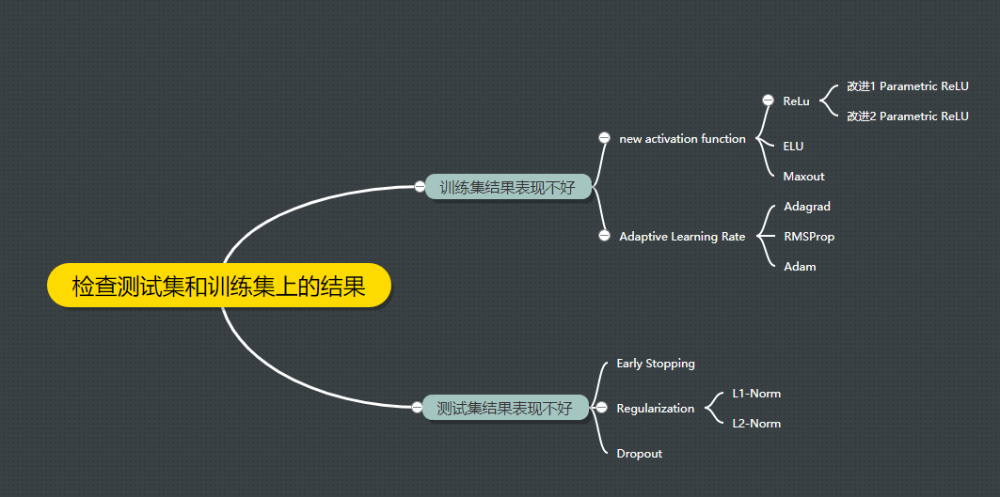

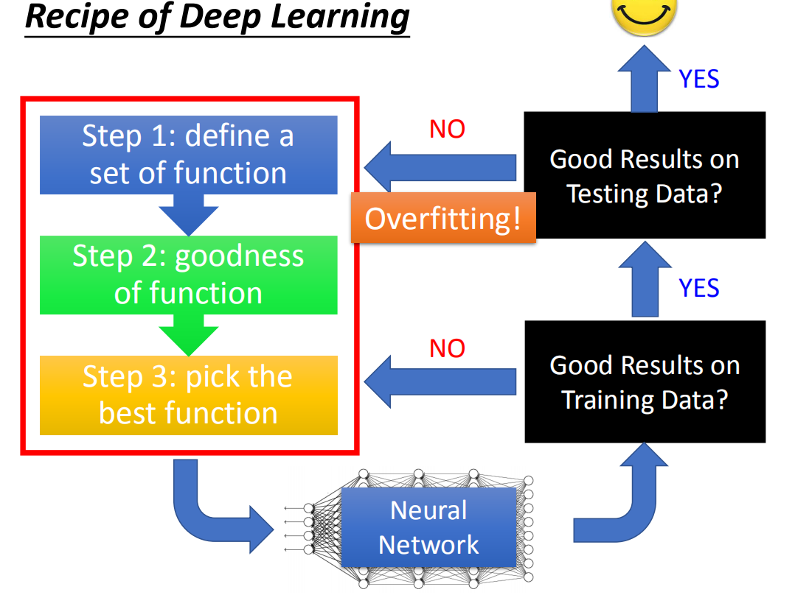

当你的模型表现不好，应该怎么处理？

如上图建立deep learning的流程：

•	define a set of function（define网络结构）

•	goodness of function（决定Loss function）

•	pick the best function（用gradient descent做optimazation）

做完这些事情后，你会得到一个neural network。在得到neural network后，要做什么呢？
##  神经网络的表现
（1）首先你要检查的是，这个neural network在你的**training set**有没有得到好的结果（是否陷入局部最优），没有的话，回头看，是哪个步骤出了什么问题，你可以做什么样的修改，在training set得到好的结果。

很多人容易忽视查看在training set上结果，是因为在机器学习中例如是用SVM，KNN，DT等模型，很容易使得training set得到一个很好的结果，其实很容易overfitting。但是在深度学习中并不是这样的，深度学习相对来说没那么容易overfitting，深度学习没有那么容易在training set上表现很好。所以一定要记得查看training set 上的结果。不要看到所有不好的performance都是overfitting。

（2）假如说你在training set得到了一个好的结果了，然后再把neural network放在你的testing set，testing set的表现（performance）才是我们关心的结果。

如果在training set表现很好，在testing data 表现不好，才是overfitting，这个时候要回头去试着解决overfitting这个问题。但有时候你加了新的technique，想要克服overfitting的问题，却反而让training set上的结果变坏。所以在做这一步的修改以后，要回头去检查training set上的结果是怎么样的。如果training set上的结果变坏，就要从头对network training的过程做调整。

如果同时在training set和testing set都得到好的结果的话，你就可以把你的系统真正应用起来了，你就成功了。

（注：training set上结果就不好，不能说是overfitting的问题）。

注意不要看到所有不好的 performance就说是overfitting。

 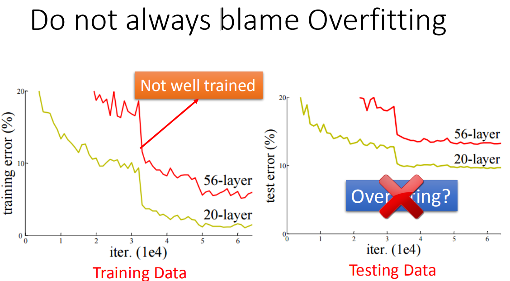

注：上图来源于Deep Residual Learning for Image Recognition http://arxiv.org/abs/1512.03385

例如：上图中横坐标是模型参数更新的次数，纵坐标是error rate，越低越好。在testing data上看到一个56-layer和20-layer，显然20-layer的error较小，有些人看到这个图就会说，56层太多了，参数太多了，56层果然没有必要，这个是overfitting。真的是这样吗？在deep learning中首先你要检查你在training set上的结果。

在training data上56-layer的performance本来就比20-layer表现的要差很多，在做neural network时，有很多的问题使你的train不好，比如local mininmize的问题、saddle point的问题、plateau的问题等等，56-layer可能卡在一个local minimize上，得到一个不好的结果，这样看来，56-layer并不是overfitting，只是没有train好。

有些人会说这是underfitting，但是我（指李宏毅老师，下同）不认为这是underfitting 。我认为underfitting的意思是说这个模型的complexity不够高，参数不够多，所以它的能力不足以解出这个问题。但对这个56层的neural network来说，虽然它得到比较差的表现，但假如这个56层的network其实是在这个20层的network后面再另外堆36层的network，那它的参数其实是比20层的network还多的。理论上20层的network可以做到的事情，56层的network一定可以做到。你前面已经有那 20 层，你前面那 20 层就做跟 20 层 network 一样的事情，后面那 36 层就什么事都不干，就都是 identity 就好了。你明明可以做到跟 20 层一样的事情，你为什么做不到呢？但是，因为会有很多的问题就是让你没有办法做到，所以，这个 56 层的 network 呢，它比 20 层差，并不是因为它能力不够。所以我觉得这不是 underfitting，它这个就是没有 train 好这样子。

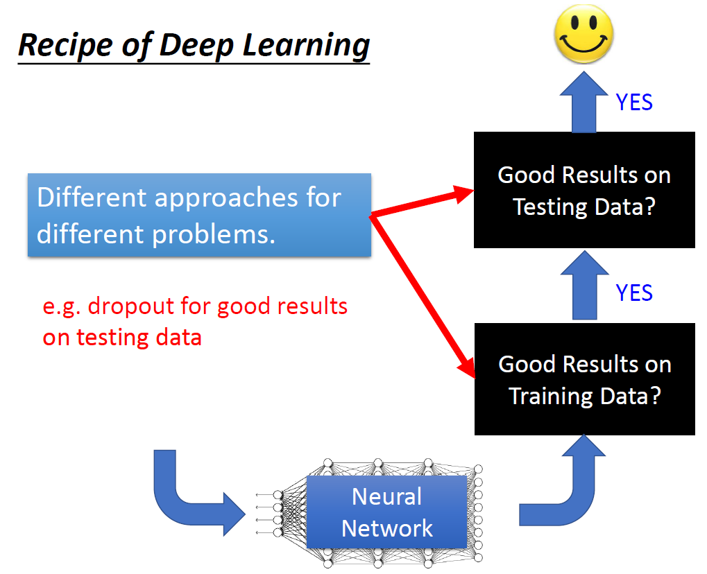
 在deep learning的文献上，当你看到一个方法的时候，你永远要想一下说，它是要解决什么样的问题，是解决在deep learning 中一个training data的performance不好，还是解决testing data performance不好。

当一个方法提出时，往往都是针对这两个其中一个做处理，比如，你可能会听到dropout这个方法，dropout是在training data表现好，testing data上表现不好的时候才会去使用，当training data 结果就不好的时候用dropout 往往会越训练越差。所以不同的方法对治不同的症状，你是必须要在心里想清楚的。

接下来我们就分开讨论这两个问题，看看相对应地有什么样的解决方法。

先来看train不好的时候如何改进。

##  如何改进神经网络？(train不好时)
###  新的激活函数
 
 现在你的training data performance不好的时候，是不是你在做neural的架构时设计的不好，举例来说，你可能用的activation function不够好。可能需要换一些新的激活函数。
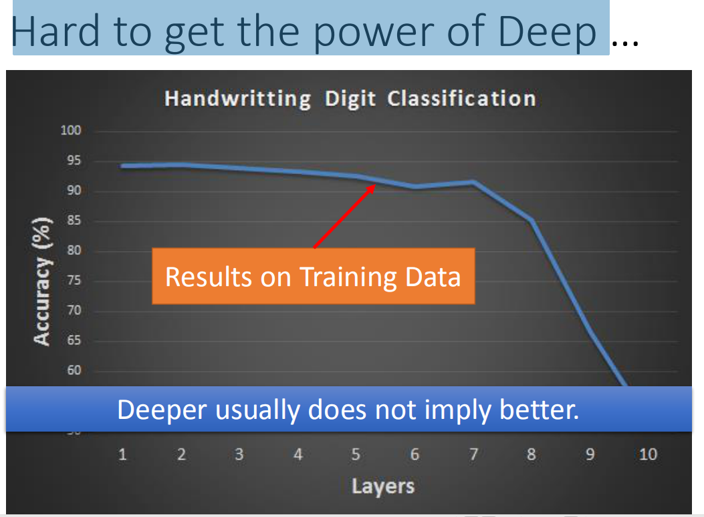

在1980年代的时候，比较常用的激活函数是sigmoid function。今天我们如果用sigmoid function，那么deeper并不一定imply better。

在2006年以前，如果将网络叠很多层，往往会得到上图的结果。上图，是手写数字识别MNIST的训练准确度的实验，使用的是sigmoid function。可以发现一开始是持平，后面就掉下去了。当层数越多，训练结果越差，特别是当网络层数到达9、10层时，训练集上准确度就下降很多。但是这个不是当层数多了以后就overfitting，因为这个是在training set上的结果。

一个原因是梯度消失。

#### 梯度消失

 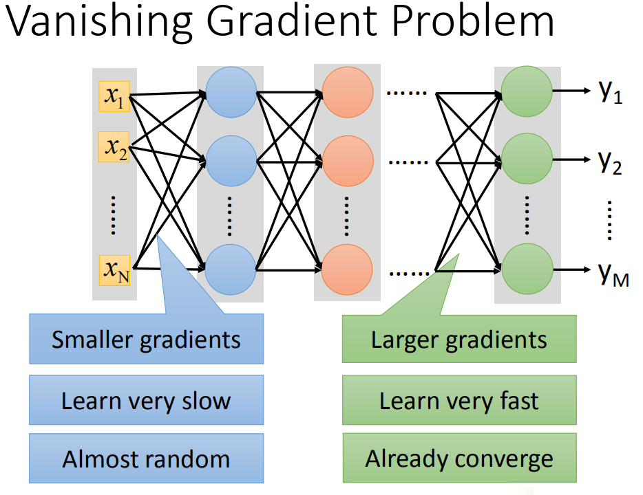
当网络比较深的时候会出现vanishing Gradient problem。

比较靠近input 的几层Gradient值（参数对损失函数的微分）十分小，靠近output的几层Gradient会很大，当你设定相同的learning rate时，靠近input layer 的参数update会很慢，靠近output layer的参数update会很快。当前几层都还没有更动参数的时候（还是随机的时候），随后几层的参数就已经收敛了。前面几层的参数还是随机的，后面几层就根据这些随机的参数陷入了局部最小（local minimum）。这个时候就发现loss下降地很慢，卡在局部最小之类的。这个时候得到的结果是很差的。

 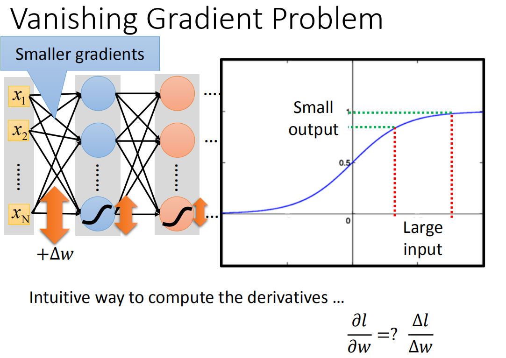

为什么会这样呢？当你把Backpropagation的式子写出来之后，你会很轻易的发现是用sigmoid函数导致了这件事情的发生。但是我们今天不看反向传播的式子，我们从直觉上了解这件事发生的原因。直觉上怎么来理解一个参数的gradient值是多少呢？

某一个参数w对 total loss的偏微分，实际上就是当对参数做一个小小的变化，它对loss的影响，就可以说，这个参数gradient 的值有多大。怎么做呢？

给第一个layer的某个参数加上△w时，对output与target之间的loss有什么样的影响。如果我们的△w很大，通过sigmoid function后这个output会很小(一个large input，通过sigmoid function，得到small output)，每通过一次sigmoid function，这个改变对某个神经元的output的影响就会衰减一次（因为sigmoid function会将值压缩到0到1之间，将参数变化衰减），hidden layer很多的情况下，最后对loss 的影响非常小(对input 修改一个参数其实对output 的影响是非常小)。

因此靠近input的weight的gradient是小的。怎么解决呢？

原来比较早年的做法是去 train RBM，去做这个 layer-wise 的 training。也就是说，你先认好一个 layer，就因为我们现在说，如果你把所有的这个network 兜起来，那你做 Backpropagation 的时候第一个 layer 你几乎没有办法被挑到嘛。所以，用 RBM 做 training 的时候，它的精神就是我先把一个 layer train 好，再 train 第二个，再 train 第三个，最后，你在做Backpropagation 的时候，虽然说，第一个 layer 几乎没有被 train 到，那无所谓，一开始在 pre-train 的时候，就把它 pre-train 好了。所以，这就是 RBM 为什么做 pre-train 可能有用的原因。

其实后来有人发现，改一下激活函数就可以解决这个问题了（Hinton 跟 Pengel似乎几乎在同一时间提出这个想法）。

理论上我们可以设计dynamic的learning rate来解决这个问题，确实这样可以有机会解决这个问题，但是直接改activation function会更好，直接从根本上解决这个问题。（注：这段是历史版本中的，2020年版本中没听到这个说法）

#### ReLU

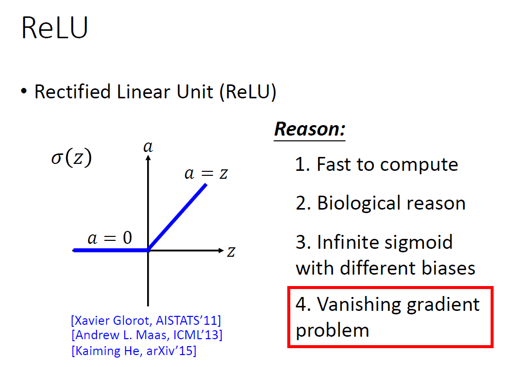

现在比较常用的激活函数就是Rectified Linear Unit，简称ReLU。这个函数是上图所示的样子，z是输入，a是输出。

ReLU input 大于0时，input 等于 output，input小于0时，output等于0。

选择这样的activation function有以下的好处：

•	比sigmoid function比较起来是比较快的（Fast to compute）

•	生物上的原因（Biological reason），paper中有

•	等同于无穷多的sigmoid function叠加在一起的结果(不同的bias)（Infinite sigmoid with different biases）

•	可以处理 vanishing gradient problem（Vanishing gradient problem）（最重要的理由），这点接下来解释
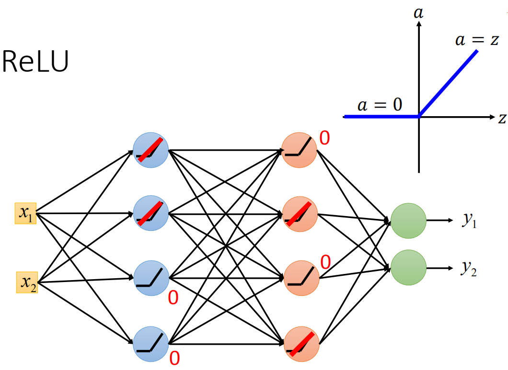

ReLU activation function 作用于两个不同的region，一个region是当激活函数的 input大于0时，input等于output，另外一个是当激活函数的input小于0时,output等于0。

那么对那些output等于0的neural来说，对我们的network一点的影响都没有。假如有个output等于0的话，你就可以把它从整个network拿掉。(下图所示)  剩下的input等于output（就是linear）时，你整个network就是a thinner linear network。

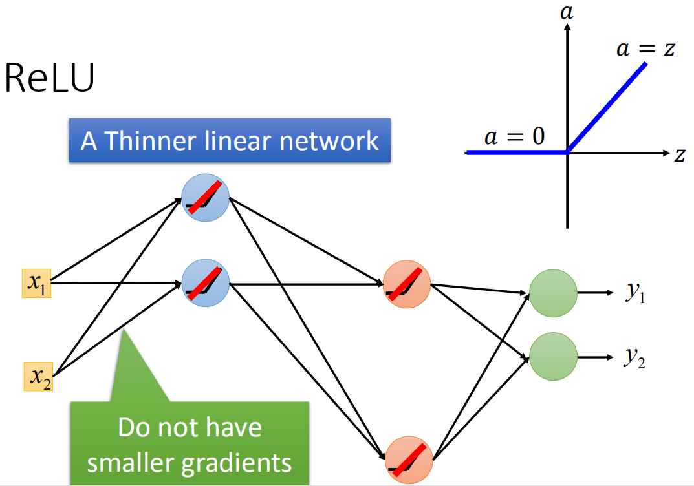

我们之前说，Gradient递减，是通过sigmoid function，sigmoid function会把较大的input变为小的output，如果是linear的话，input等于output,你就不会出现递减的问题。

可是我们需要的不是linear network（就像我们之所以不使用逻辑回归，就是因为逻辑回归是线性的），所以我们才用deep learning ，就是不希望我们的function不是linear，我们需要它不是linear function，而是一个很复杂的function。当我们用ReLU，它不就变成一个linear function了吗？这样不是变得很弱吗？

其实对于ReLU activation function的神经网络，只是在小范围内是线性的，在总体上还是非线性的。

如果你只对input做小小的改变，不改变neural的operation region,它是一个linear function，但是你要对input做比较大的改变，改变了neural的operation region，它就不是linear function。

另外一个问题，ReLU不能微分，怎么办？其实是这样，当input大于0的时候，微分就是1，小于0的时候微分就是0。反正不可能刚好等于0嘛，就不管它。

#### ReLU的变种（variant）

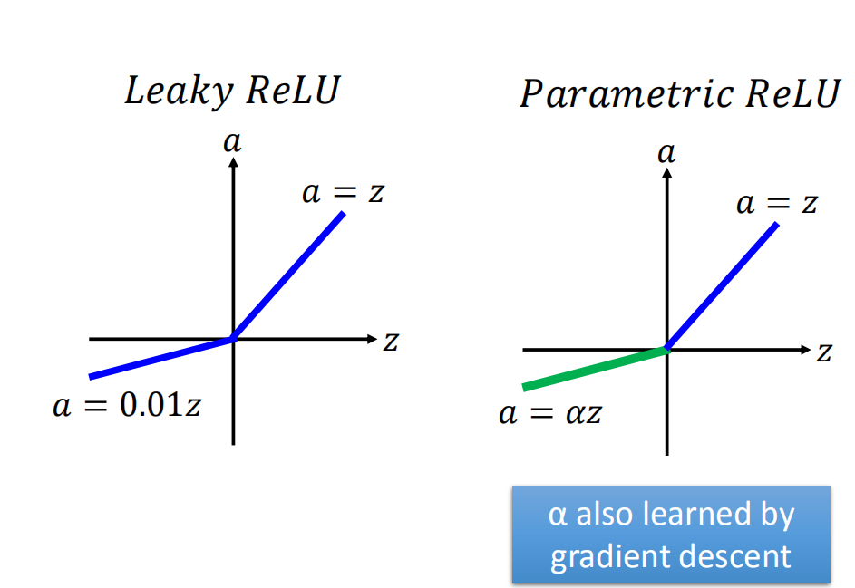

1、改进1 leaky ReLU
ReLU在input小于0时，output为0，这时微分为0，你就没有办法update你的参数，所有我们就应该在input小于0时，output有一点的值(input小于0时，output等于0.01乘以input)，这被叫做leaky ReLU。

为什么是0.01呢？为什么不是别的数值呢？

2、改进2 Parametric ReLU

Parametric ReLU在input小于0时，output等于$\alpha z$，$\alpha$为neural的一个参数，可以通过training data学习出来，甚至每个neural都可以有不同的$\alpha$值。

那么除了ReLU就没有别的activation function了吗，为什么一定要是ReLU这个样子呢？所以后来要一个更进阶的想法，叫做Maxout network。用network来根据training data自动生成activation function。

#### Maxout
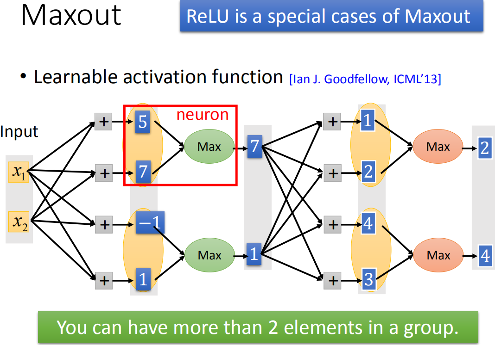

让network自动去学它的activation function，因为activation function是自动学出来的，所以ReLU就是一种特殊的Maxout case。

input是$x_1,x_2$，让$x_1,x_2$乘以不同的weight分别得到5,7,-1,1。这些值本来是通过ReLU或者sigmoid function等得到其他的一些value。现在在Maxout里面，在这些value group起来(哪些value被group起来是事先决定的，如上图所示)，在组里选出一个最大的值当做output(选出7和1，这是一个vector 而不是一个value)，7和1再乘以不同的weight得到不同的value，然后group，再选出max value。

实际中，几个element要不要放在同一个group是你自己决定的，就跟network structure一样，是你自己需要调的参数。

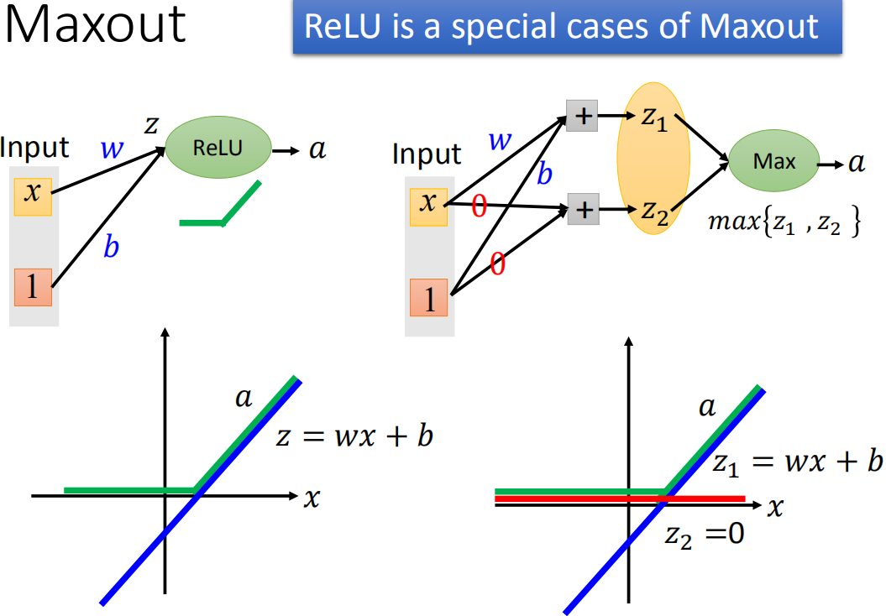
Maxout network 是怎么样产生不同的activation function，Maxout是怎么有办法做到跟ReLU一样的事情呢？

对比ReLu和Maxout

ReLu：input乘以w,b，再经过ReLU得到a。x和z的关系是linear的（蓝色），x和a的关系是绿色线条所示。

Maxout：input中x和1分别乘以w和b得到z1，x和1乘以另一个w和b得到z2(现在假设第二组的w和b等于0，那么z2等于0)，在两个中选出max得到a(如上图所示)

z1和x的关系是蓝色的线，z2和x的关系是红色的线，a和x的关系就是绿色的线。

对比两个图，发现只要两个w和b相等，那么Maxout做的事就是和ReLU是一样的。

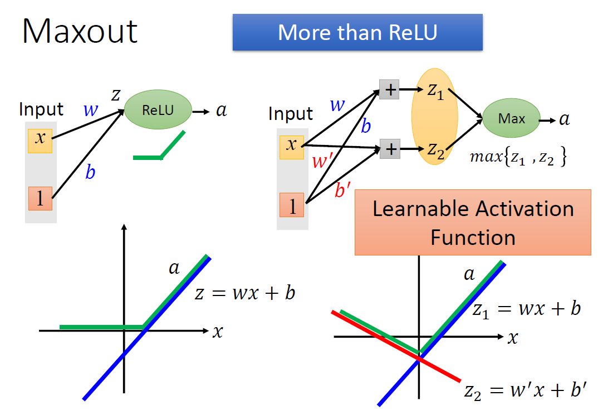

当然在Maxout选择不同的w和b做的事也是不一样的，如果第二组的w和b不是0的话，就得到不同的线(如上图所示)，得到不一样的激活函数，它是由w, b w', b'决定的。每一个Neural根据它不同的weight和bias，就可以有不同的activation function。这些参数都是Maxout network自己学习出来的，根据数据的不同Maxout network可以自己学习出不同的activation function。

Maxout可以做出任何的piecewise linear convex function，如果你看一下它的性质，就不难理解这件事情。piecewise中的piece有多少个就取决于你把多少个element放在一个group。

如果Maxout network中有两个或者三个pieces，Maxout network会学习到不同的activation function如下图所示。
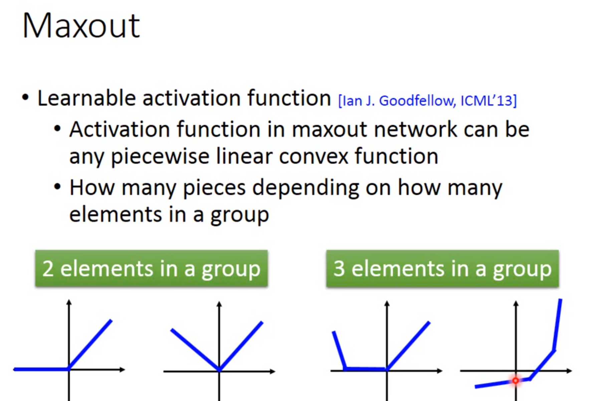

现在面临另外一个问题，怎么样去train，因为max函数无法微分。但是其实只要可以算出参数的变化，对loss的影响就可以用梯度下降来train网络。
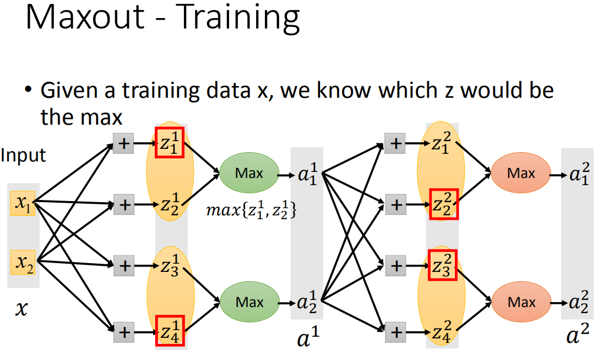

我们现在把每个group里最大的值用方框框起来，每个最大的值就等于对应的max operation的output。当你知道在一组值里面哪一个比较大的时候，max operation其实在这边就是一个linear operation，只不过是在选取前一个group的某一个element。不是max value值就没有用，就可以拿掉。这个时候就是一个thin linear的network，就可以去train它了。
 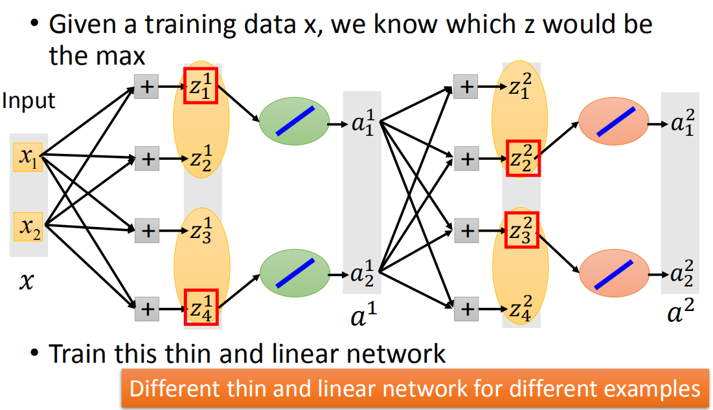
似乎这里面有个问题，没有被train到的element，那么它连接的w就不会被train到了，在做BP时，只会train在图上颜色深的实线，不会train不是max value的weight。这表面上看是一个问题，但实际上不是一个问题。

当你给到不同的input时，得到的z的值是不同的，max value是不一样的，因为我们有很多training data，而neural structure不断的变化，实际上每一个weight都会被training。Maxout就是这么做的。

Maxout其实和Maxpooling是一模一样的operation，只不过换了个说法。你会train Maxpooling，就会train Maxout。

###  适应性学习率(Adaptive Learning Rate)

#### Adagrad

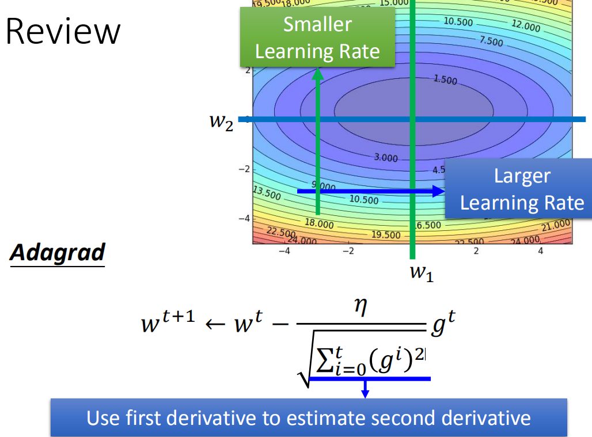
 Adagrad：每一个parameter 都要有不同的learning rate，这个 Adagrad learning rate 就是用固定的learning rate除以这个参数过去所有gradient值的平方和开根号，得到新的parameter。

Adagrad 的精神就是，如果我們今天考虑两个参数，w1, w2（看上图），如果 w1 是在这个方向（横轴方向）上，它平常 gradient 都比较小，那它是比较平坦的，就给它比较大的 learning rate。在纵轴方向上，平常 gradient 都是比较大的，所以，它是比较陡峭的，所以给它比较小的 learning rate。

但是实际上，我们面对的问题有可能是比Adagrad可以处理的问题更加复杂的。也就是说，之前在做这个 Linear Regression 的时候，我们看到的loss function是convex的形状，但实际上我们在做deep learning时，这个loss function可以是任何形状。

#### RMSProp 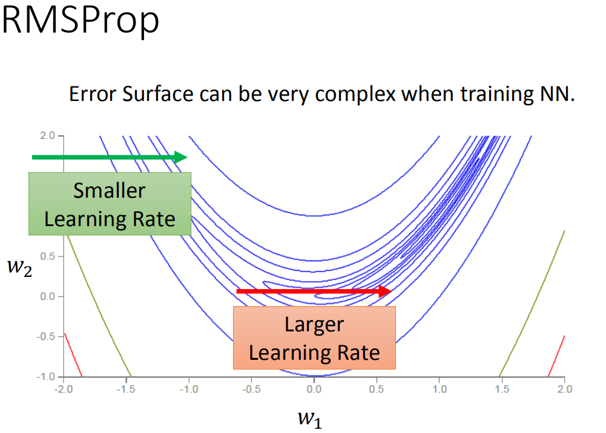
考虑同一个参数假设为w1，参数在绿色箭头处（很平坦)，可能会需要learning rate小一些，参数在红色箭头处（很陡峭)，可能会需要learning rate大一些。

也就是说你的error surface是这个形状的时候，learning rate是要能够快速的变动.

在deep learning 的问题上，Adagrad可能是不够的，这时就需要RMSProp（该方法是Hinton在上课的时候提出来的，找不到对应文献出处）。
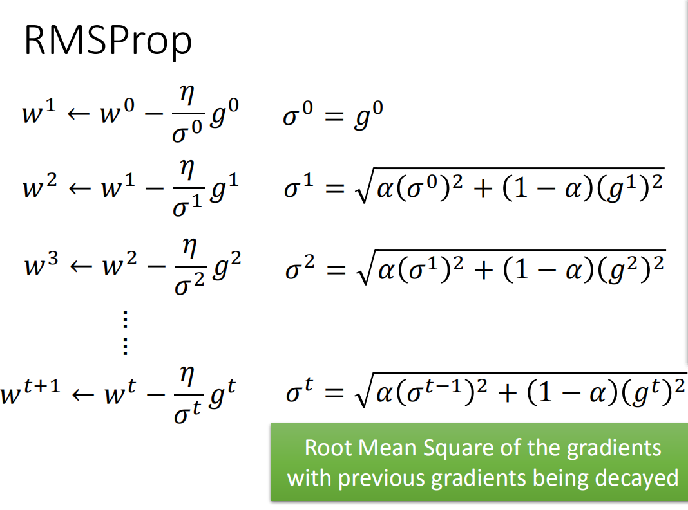
 一个固定的learning rate除以一个$\sigma$(在第一个时间点，$\sigma$就是第一个算出来GD的值)，在第二个时间点，你算出来一个新的GD值$g^1$和$\sigma^1$。$\sigma^1$的计算方法如图中公式所示。原来的 Adagrad 在分母放的值就是把 $g^0, g^1, g^2$ 都取平方和开根号，但是，在 RMSProp 里面，这个 $σ^1$里面包含了 $g^0$ 跟 $g^1$，$\sigma^2$也包含了 $g^0, g^1, g^2$，就跟 Adagrad 一样，但是，你现在可以给它乘上 weight $\alpha$。你可以去手动调一个$\alpha$值，如果把$\alpha$值调整的小一点，说明你倾向于相信新的gradient 告诉你的这个error surface的平滑或者陡峭的程度，比较无视旧的gradient提供的信息。

所以，当你做 RMSProp 的时候，你一样是在这算 gradient 的 zooming square，但是，你可以给现在已经看到的 gradient 比较大的 weight，给过去看到的 gradient 比较小的 weight 。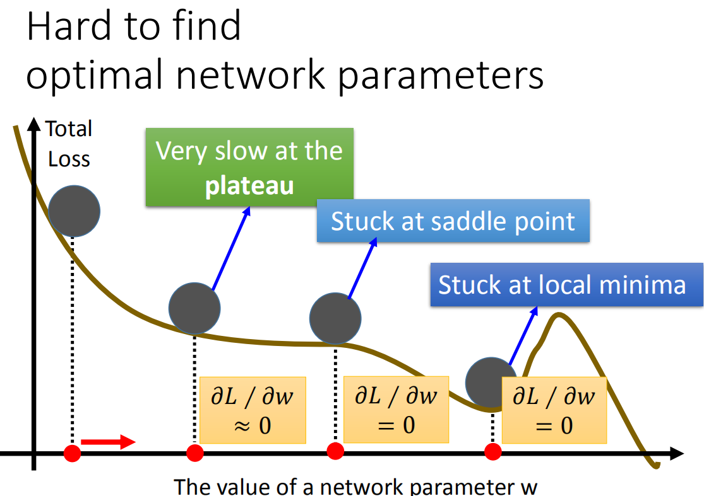
除了learning rate的问题以外，我们在做deep learning的时候，有可能会卡在local minimima，也有可能会卡在 saddle point，甚至会卡在plateau的地方。

其实Yann Lecun在2007年的时候就说过，在error surface上没有太多的local minimima，所以不用太担心。因为，你要是一个local minimima，你在每一个dimension都必须是一个山谷的谷底，假设山谷的谷底出现的几率是P，因为我们的neural有非常多的参数(假设有1000个参数，每一个参数的dimension出现山谷的谷底就是各个P相乘)，你的Neural越大，参数越大，出现的几率越低。所以local minimima在一个很大的neural其实没有你想象的那么多。所以，当你走走走，走到一个你觉得是local minimum 的地方，卡住的时候它八成就是 global minimum，或是很接近 gloal minimum。

#### Momentum  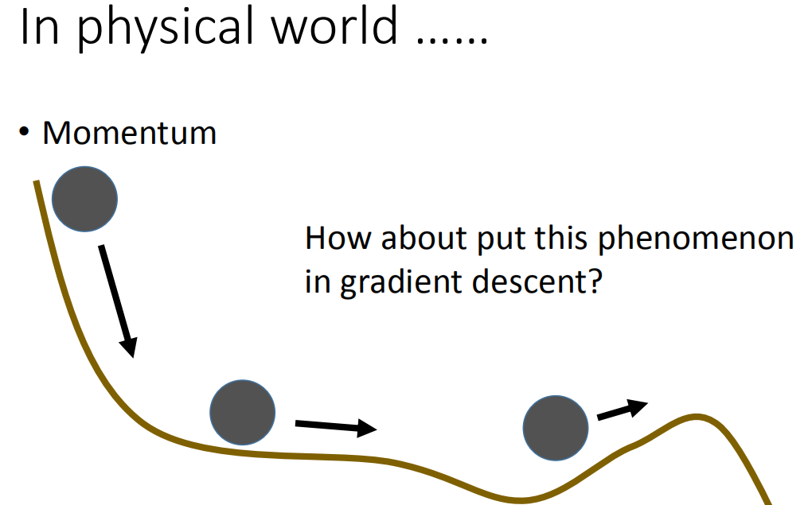
有一个heuristic的方法可以处理下上述所说的问题

在真实的世界中，在如图所示的山坡中，把一个小球从左上角丢下，滚到plateau的地方，不会去停下来(因为有惯性)，就到了山坡处，只要不是很陡，会因为惯性的作用去翻过这个山坡，就会走到比local minimize还要好的地方，所以我们要做的事情就是要把这个惯性加到GD里面(这个就叫Momentum)。

现在先复习下一般的GD
 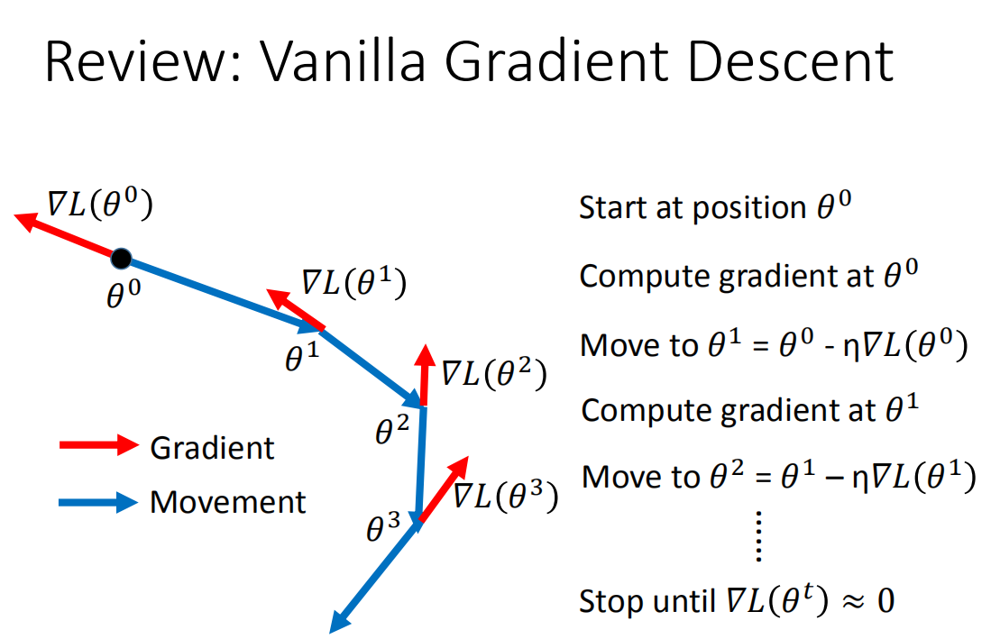
 选择一个初始的值，计算它的gradient，G负梯度方向乘以learning rate，得到θ1，然后继续前面的操作，一直到gradinet等于0时或者趋近于0时。

当我们加上Momentum时
 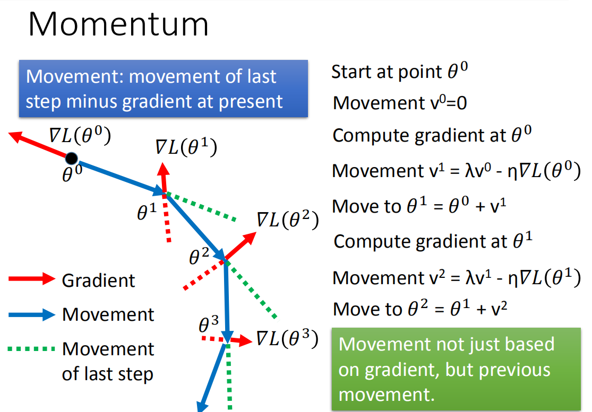

 我们每次移动的方向，不再只有考虑gradient，而是现在的gradient加上前一个时间点移动的方向

（1）步骤

选择一个初始值$\theta^0$，然后用$v$去记录在前一个时间点移动的方向(因为是初始值，所以第一次的前一个时间点是0)。接下来去计算在$\theta^0$上的gradient，移动的方向为$v^1$。在第二个时间点，计算gradient $\theta^1$，gradient告诉我们要走红色虚线的方向(梯度的反方向)，由于惯性是绿色虚线的方向，也就是$v^1$。那么第二个时间点要走的方向就是这两个方向的合成方向，即$v^2$的计算公式。这个$\lambda$和learning rare一样是要调节的参数，$\lambda$会告诉你惯性的影响是多大。以此类推...

（2）运作

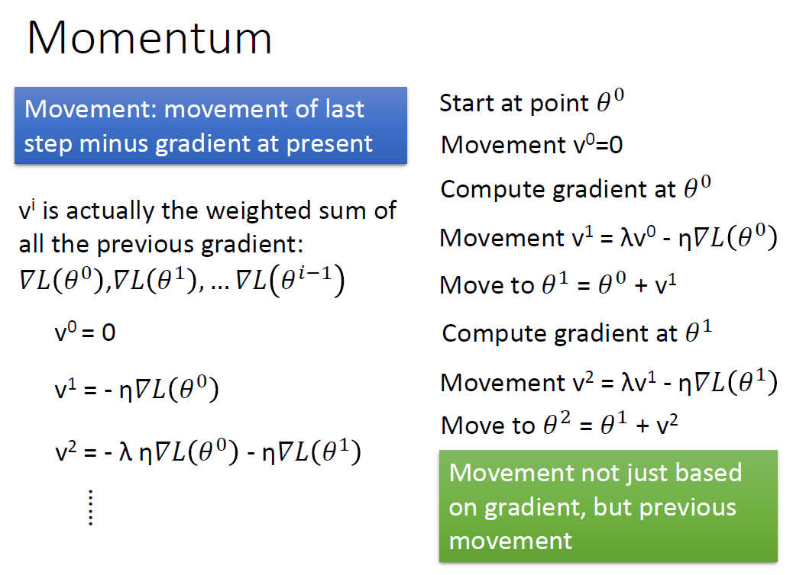

用另外一个方法来理解这件事情，在每一个时间点移动的movement $v^i$其实就是过去所有算出来的gradient的总和。我们可以把$v^0$代入$v^1$的计算公式中，把$v^1$代入$v^2$的计算公式中，以此类推，得到上图所示的新的公式。所以$v^2$里面同时也在$\theta^0$算出来的gradient，也有在$\theta^1$算出来的gradient，只是这两个gradient的权重是不一样的。假如$\lambda$设为小于0的值，那么越之前的gradient，权重就越小，就越在意现在的gradient，但是过去的gradient也对现在要update的方向有一定程度的影响力。这就是momentum。
 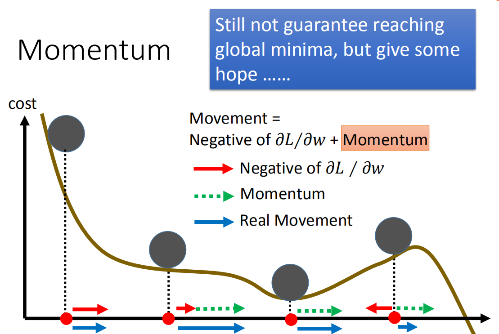

 如果从直觉上理解，加上Momentum之后，每一次移动的方向是 negative gradient加上Momentum的方向(现在这个Momentum就是上一个时间点的Movement)。

现在假设我们的参数是在这个位置(左上角)，gradient建议我们往右走，现在移动到第二个黑色小球的位置，gradient建议往红色箭头的方向走，而Momentum也是会建议我们往右走(绿的箭头，因为之前是往右走的)，所以真正的Movement是蓝色的箭头(两个方向合起来)。现在走到local minimize的地方，gradient等于0(gradient告诉你就停在这个地方)，而Momentum告诉你是往右边的方向走，所以你的update的参数会继续向右。走到第4个小球的位置，gradient建议我们往左走，momentum建议我们往右走，如果momentum比较强的话，最后就还是往右走。所以如果local minimize不深的话，可以借Momentum跳出这个local minimize，走到比较好的global minimum。

#### Adam

Adam：RMSProp+Momentum

如果没有什么偏好的话，就学Adam就好了 。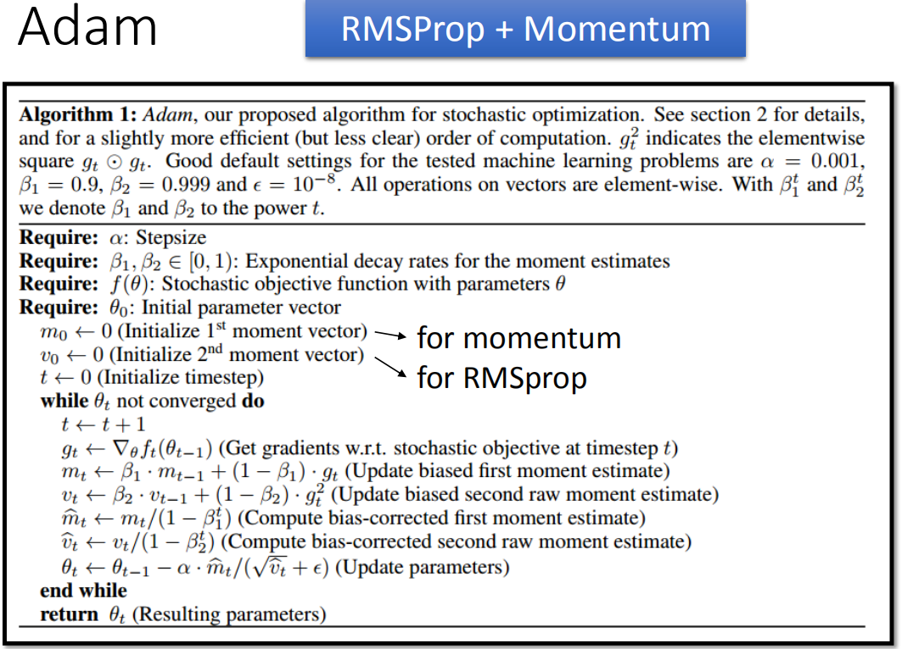

我们非常非常快地来看一下这个式子。在这个式子里面，一开始要先初始一个东西叫做 m0，m0 就是momentum，就是前一个时间点的 movement。那这边有另外一个值叫做 v0，v0 就是我们刚才在 RMSProp 里面看到的那个 σ，这个东西就是之前算出来的 gradient 的平方和。它先算一下 gradient，就是 gt，然后，根据 gt ，你就可以算出 mt，也就是现在要走的方向。现在要走的方向，是考虑过去要走的方向再加上 gradient。接下来，算一下要放在分母的地方的 vt，这个 vt 是过去、前一个时间点的 vt加上 gradient 的平方，等一下要开根号。这边它做了一个跟原来 RMSProp 跟 momentum 里面没有的东西，叫做 bias correction，它会把 mt 跟 vt 都除上一个值，这个值本来比较小，那后来呢，会越来越接近 1。至于为什么要这么做， 他的 paper 里面会告诉你他的理由。最后，你在 update 的时候，你把 momentum 建议你的方向，$\hat m_t$，去乘上 learning rate α，再除掉 RMSProp（就是 RMSProp normalize 以后，建议的 learning rate），最后，得到你 update 的方向。这个就是 Adam 。

## 测试集表现不好时

**如果你在training data已经得到了很好的结果了，但是你在testing data上得不到很好的结果，那么接下来会有三个方法帮助解决。**分别是Early Stopping，Regularization和Dropout。前面两个是很传统的做法，不是专门为深度学习设计的。Dropout则是一个有深度学习特色的方法。

###  Early Stopping
  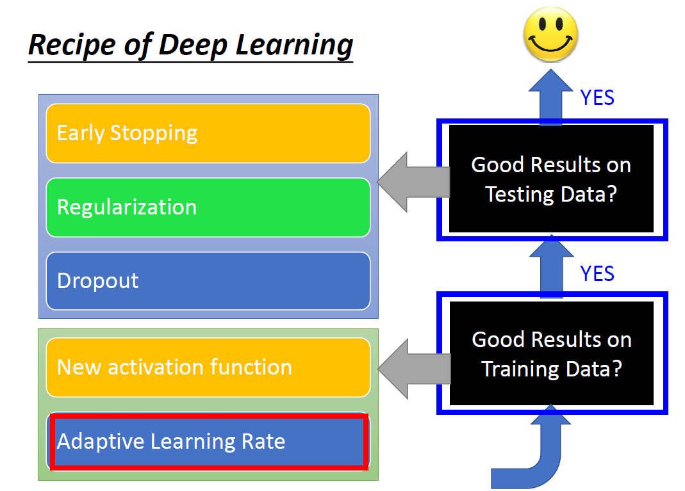
   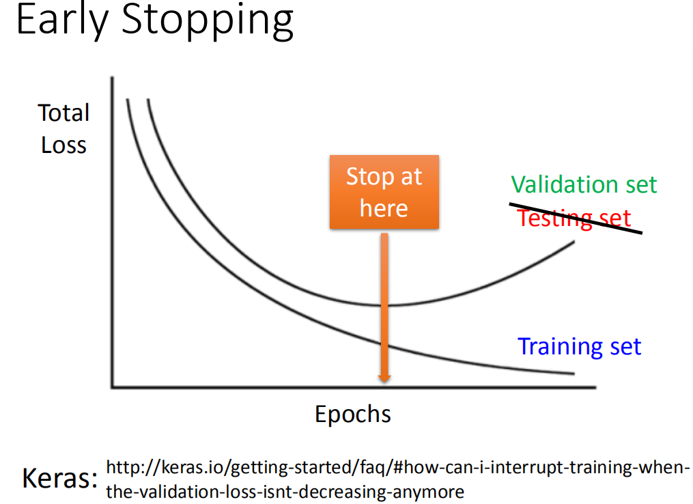

随着你的training，你的total loss会越来越小(learning rate没有设置好，total loss 变大也是有可能的)，但是由于training data和testing data的分布不完全一样，有可能在training data上loss逐渐减小，而在testing data上loss逐渐增大。理想上，假如你知道testing set 上的loss变化，你应该停在不是training set loss最小的地方，而是testing set loss最小的地方(如图所示)，可能training到这个地方就停下来。但是你不知道你的testing set(有label的testing set)上的error是什么。所以我们会用validation set来解决。

用validation set模拟 testing set，什么时候validation set loss最小，你的training 会停下来。

###  Regularization
类似与大脑的神经，刚刚从婴儿到6岁时，神经连接变多，但是到14岁一些没有用的连接消失，神经连接变少。
  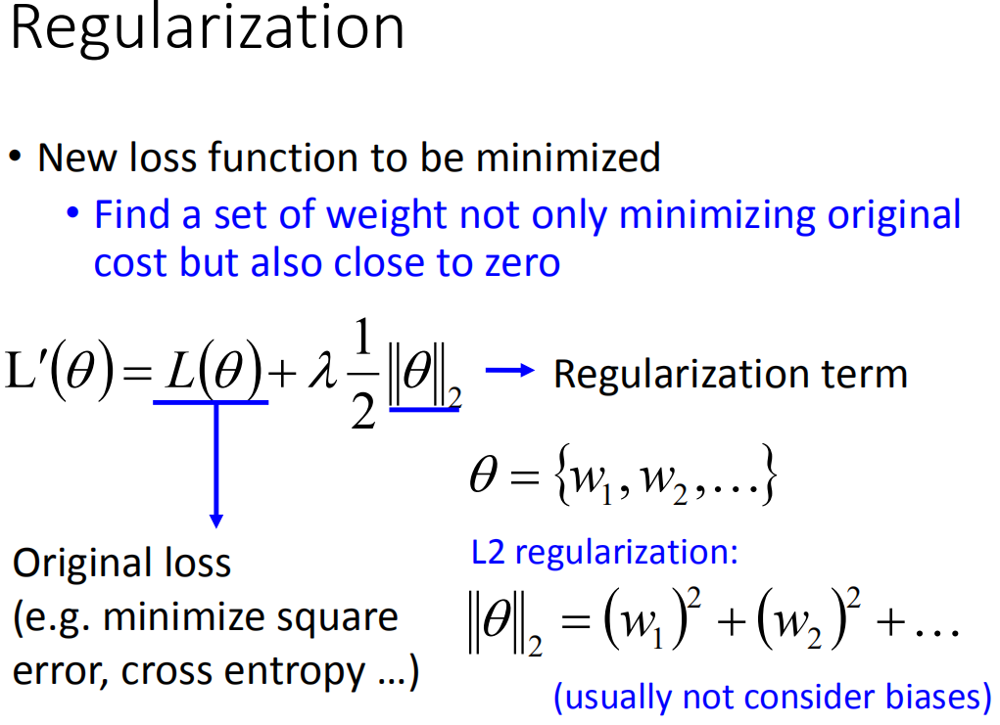
重新去定义要去minimize的那个loss function。

在原来的loss function(比如minimize square error, cross entropy)的基础上加一个regularization term(比如是参数的L2-Norm，公式见上图)，在做regularization时一般是不会加bias这一项的，加regularization的目的是为了让function更加的平滑(bias跟平滑这件事情是没有任何关系的)。

  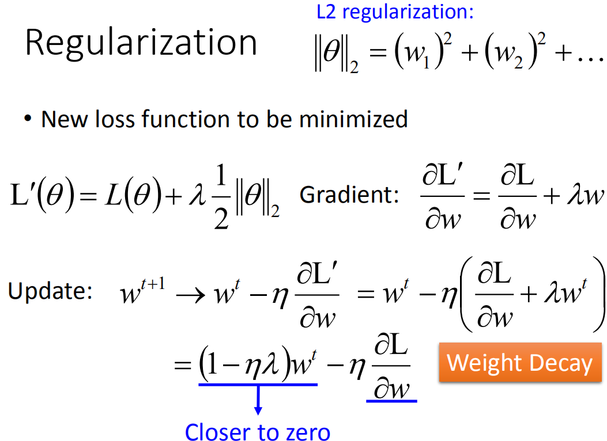

把新的loss function做微分，得到新的Gradient，更新的公式整理后变成上图所示那样。在update参数的时候，其实是在update之前就已经把参数w乘以一个小于1的值(比如0.99，因为$\eta$, $\lambda$都是很小的值)，这样每次都会让weight趋近于0，但是会与后一项梯度的值达到平衡，使得最后的值不等于0。L2的Regularization 又叫做Weight Decay，就像人脑将没有用的神经元去除。

在 deep learning 里面，Regularization 虽然有帮助，但是它的重要性跟其他方法，比如说 SVM 比起来，并没有那么高。有一个可能的原因是，如果你看前面的 Early Stopping，我们可以决定说，什么时候 training 应该要被停下来。因为，我们现在在做这个 neural network 的时候，通常初始的时候，我们都是从一个很小的、接近 0 的值开始。那你在做 update 的时候通常就是让参数离 0 越来越远、越来越远。而做 Regularization 这件事情，它要达到的目的，就是希望我们的参数不要离 0 太远。那我们参数不要离 0 太远，加上 Regularization 所造成的效果跟减少 update 次数所造成的效果，其实，可能是很像的。但你今天做 Early Stopping，减少 update 次数，其实也会避免你的参数离那些接近 0 的值太远。所以在 neural network 里面Regularization 虽然有帮助，但没有那么重要，没有重要到说，比如说你看像 SVM，它是 explicitly 把 Regularization 这件事情写在它的 objective function 里面，因为在做 SVM 的时候，它其实是要解一个 convex optimization problem。所以，实际上它解的时候，并不一定会有 iteration 的过程，它一步就解出那个最好的结果了，它不像 deep learning 里面有 Early Stopping 这件事。SVM 里面，没有 Early Stopping 这件事，一步就走到结果了。所以，你没有办法用 Early Stopping 防止它离你太远，所以你必须要把 Regularization explicitly 加到你的 loss function 里面去。

regularization term当然不只是平方，也可以用L1-Norm

  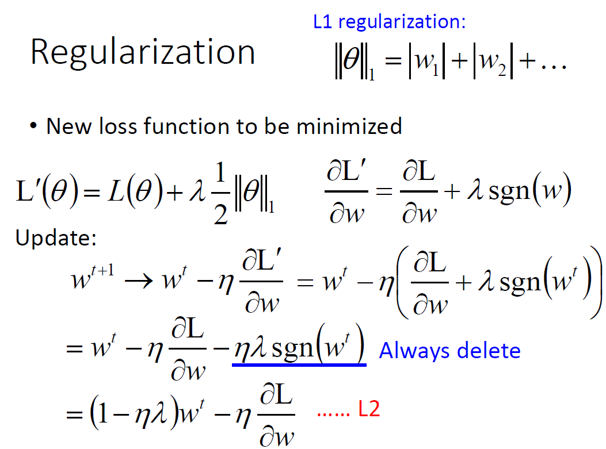

w是正的微分出来就是+1，w是负的微分出来就是-1，只有0的地方不能微分，不用管，可以随便给一个值比如0。所以微分结果可以写为sgn(w)（sign function）。

每一次更新参数时，我们一定要去减一个$\eta \lambda sgn(w^t)$值(w是正的，就是减去一个值，让参数变小；若w是负的，就是加上一个值，让参数变大)。

L2、L1都可以让参数变小，但是有所不同的，若w是一个很大的值，L2下降的很快（因为乘以小于1的值），很快就会变得很小；L1的话，减去一个固定的值(比较小的值)，所以下降的很慢。所以，通过L1-Norm training 出来的model，参数可能还是会有很大的值。如果w是接近0的很小的值时，L2下降的很慢，会保留一些接近0的值；L1则不会保留很多很小的接近0的值。所以，如果你用 L1 做 training，你得到的结果就是会比较 sparse，也就是说你 train 出来的参数里面有很多接近 0 的值，也有很大的值。不像如果是 L2 的话，你 train 出来的结果，你的值是平均的都比较小，所以，他们 train 出来的结果是略有差异的。

### Dropout

#### How to train?

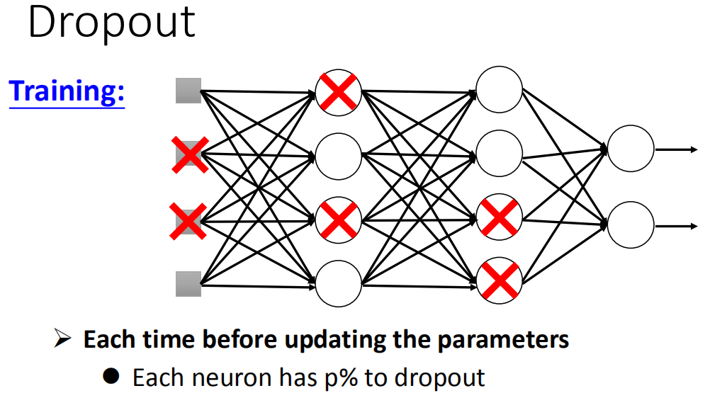

在train的时候，每一次update参数之前，对network里面的每个neural(包括input)，做sampling（抽样）。 每个neural会有p%的概率会被丢掉，跟它相连的weight也会被丢掉。做完sampling之后，你的network的structure就变得比较细长。然后就去train这个新的network。

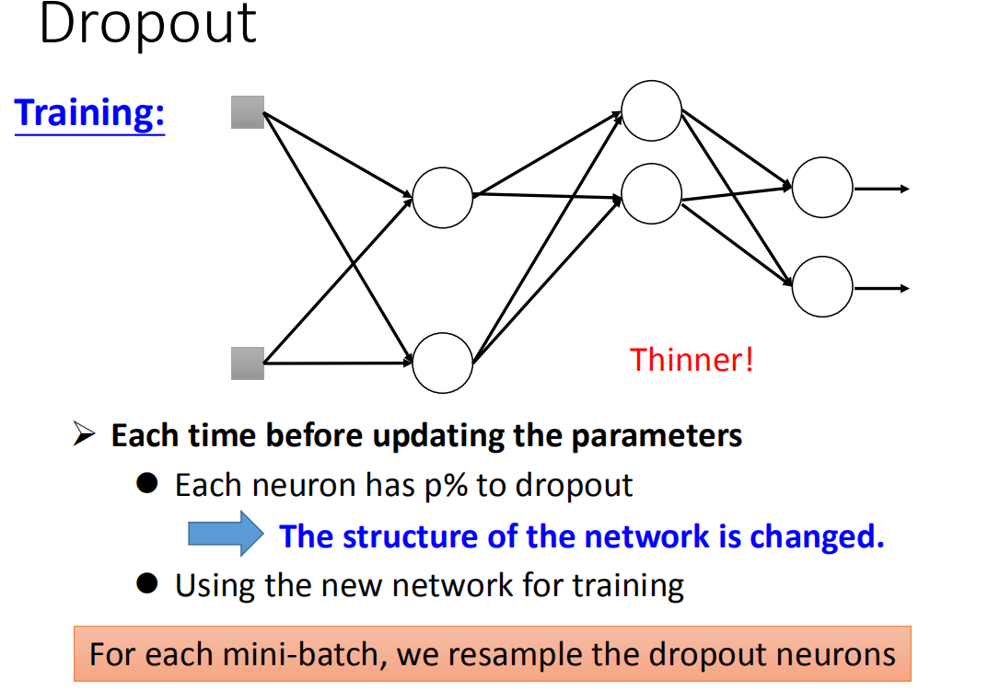

注意，每次update参数之前，都要做一次sampling，每次拿来train的那个network structure是不一样的，得到的结果也是不一样的。

你在training 时，加上dropout的话，performance会变的有一点差(因为某些neural不见了)，但是dropout真正做的事就是让你training的结果变差，但是testing的结果是变好的。

 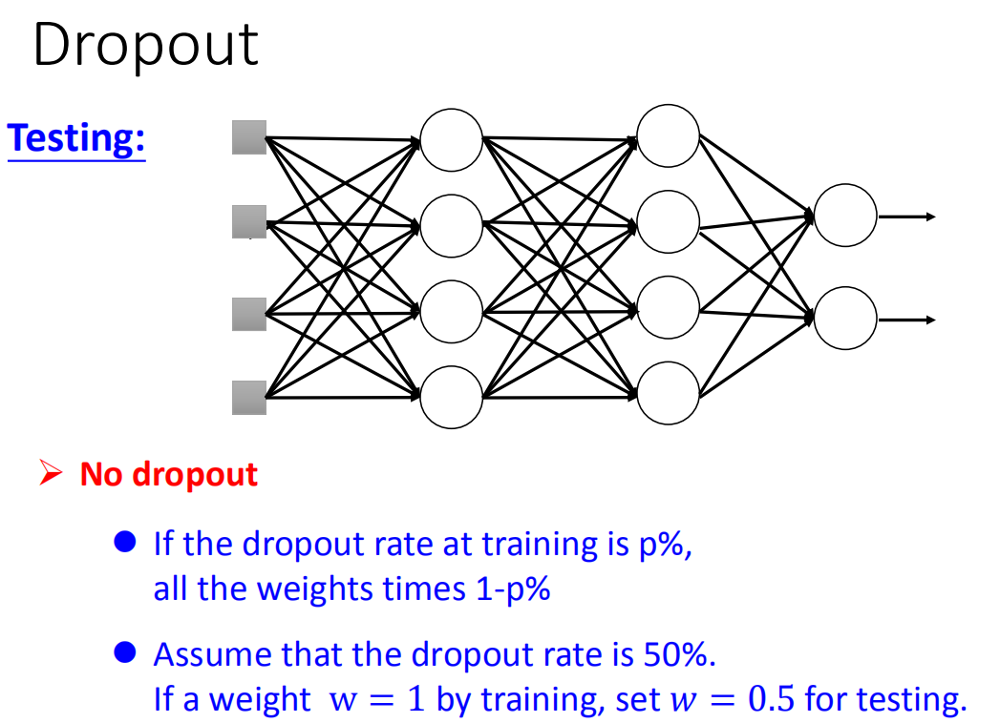

在testing上注意两件事情：
- 第一件事情就是在testing上不做dropout。
- 在dropout的时候，假设dropout rate在training是p%，testing的all weights都要乘以（1-p%）

假设training时dropout rate是p%，在testing rate时weights都要乘以（1-p）%。（假定dropout rate是50%，在training的时候计算出来的weights等于1，那么testing时的rate设为0.5）

#### 为什么Dropout会有用

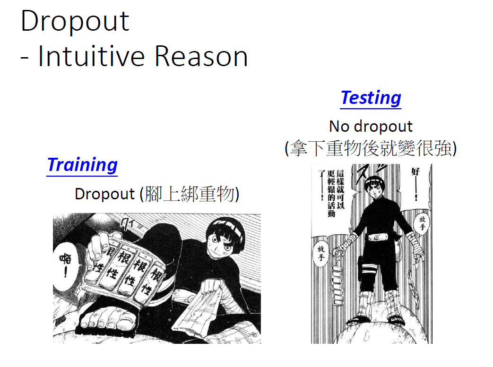

为什么在训练的时候要dropout，但是测试的时候不dropout。

training的时候会丢掉一些neural，就好像使在练习轻功一样在脚上绑上一些重物，然后实际上战斗的时候把重物拿下来就是testing时（没有进行dropout），那时候你就会变得很强

  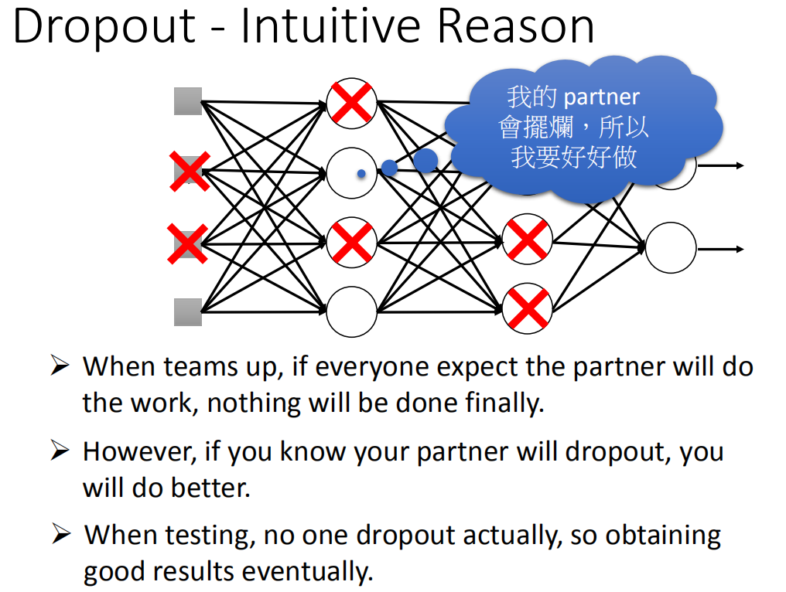

另外一个很直觉的理由是：在一个团队里面，总是会有人摆烂（摆烂，指事情已经无法向好的方向发展,于是就干脆不再采取措施加以控制而是任由其往坏的方向继续发展下去），这就是dropout。

假设你觉得你的队友会摆烂，所以这个时候你就想要好好做，你想要去carry他。但实际上在testing的时候，大家都是有在好好做，没有需要被carry，因为每个人做的很努力，所以结果会更好。

#### testing时为什么要乘以（1-p）%

   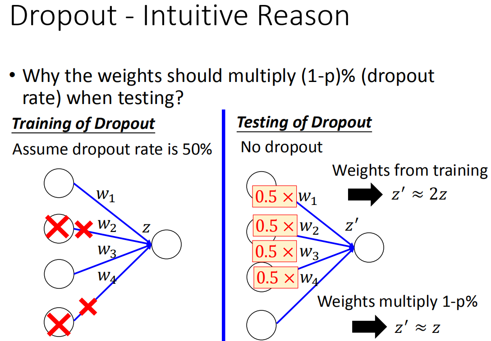

还有一个要解释的是：在做dropout任务时候要乘以（1-p）%，为什么和training时使用的weight不相同呢？很直觉的理由是这样的：

假设dropout rate是50%，那在training的时候总是期望会丢掉一般的neural。假设在training时learning好一组weight($w1,w2,w3,w4$)，但是在testing时没有dropout，对同一组weights来说：在training时得到z，在testing是得到$z'$。但是training和testing得到的值是会差两倍的（因为train的时候会有一半的weight不见，而test的时候weight全都在），所以在做testing时都乘以0.5，这样得到的结果是比较match：$z=z'$。

上述的描述是很直觉的解释

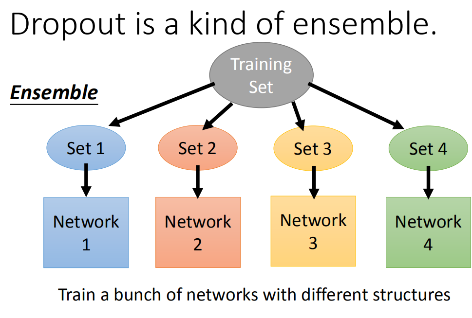

其实dropout还是有很多的理由，这个问题还是可以探讨的问题，你可以在文献上找到很多不同的观点来解释dropout。我觉得我比较能接受的是：dropout是一个终极的ensemble方法

ensemble的意思是：我们有一个很大的training set，每次从training set里面只sample一部分的data。我们之前在讲bias和variance的trade off时，打靶有两种状况：一种是bias很大，所以你打不准；一种是variance很大，所以你打不准。如果今天有一个很复杂的model，往往是bias准，但variance很大。若这样复杂的model有很多，虽然variance很大，但最后平均下来结果就很准。所以ensemble做的事情就是利用这个特性。

我们可以training很多的model（将原来的training data可以sample很多的set，每个model的structure可以不一样）。虽然每个model可能variance很大，但是如果它们都是很复杂的model时，平均起来时bias就很小。

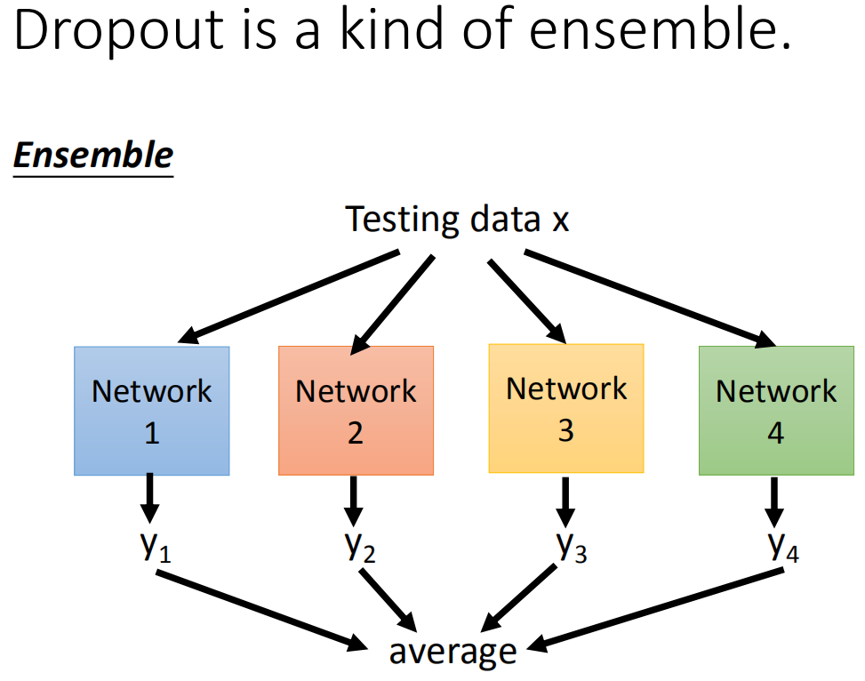

在training时train了很多的model，在testing时输入data x进去通过所有的model（$Network1, Network2, Network3, Network4$），得到结果（$y_1, y_2, y_3, y_4$），再将这些结果做平均当做最后的结果。

如果model很复杂时，这一招是往往有用的

#### 为什么说dropout是终极的ensemble方法

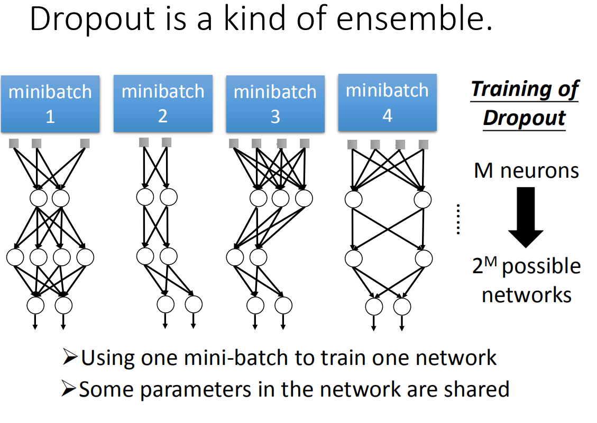

为什么说dropout是终极的ensemble方法？在进行dropout时，每次update参数时，都要sample一个minibatch ，得到不同的network。第一个、第二个、第三个、第四个minibatch如图所示。假设有M个neuron，每个neuron可以dropout或者不dropout，所以可能的network的数目为$2^M$，当你在做dropout时，你等于是在train $2^M$ 个network。所以dropout是一个终极ensemble的方式。

每次只用one mini-batch去train一个neuron，总共有$2^M$个可能的network。因为可能update的次数是有限的，你可能没有办法把$2^M$的network都train一遍，但是你可能已经train好多的network。

每个network用一个batch来train可能会让人觉得很不安（一个batch只有100笔data，怎么可能train整个network呢）。这是没有关系的，因为这些不同network的参数是共享的。一个weight同时存在多个network里，那就会用多个batch来训练。

 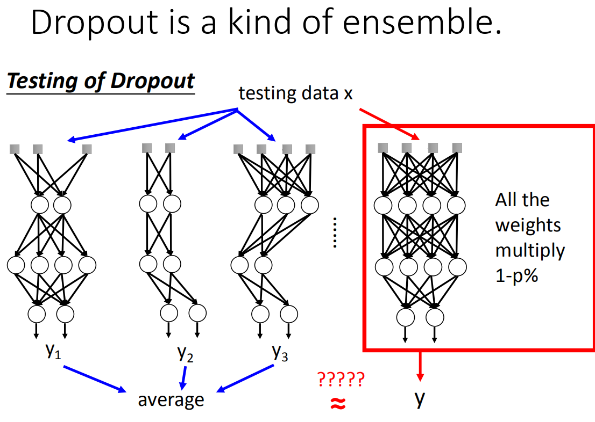

在testing的时候，按照ensemble方法就是，把之前的所有的network拿出来，然后把testing data丢到network里面去，每一个network都会给你一个结果，这些结果的平均值就是最终的结果。但是实际上没有办法这样做，因为network太多了。所以dropout最神奇的是：当你把一个完整的network不进行dropout，但是将它的weights乘以（1-p%），然后将testing data输入，得到的output y。神奇的是：之前做average的结果跟output y是approximated。

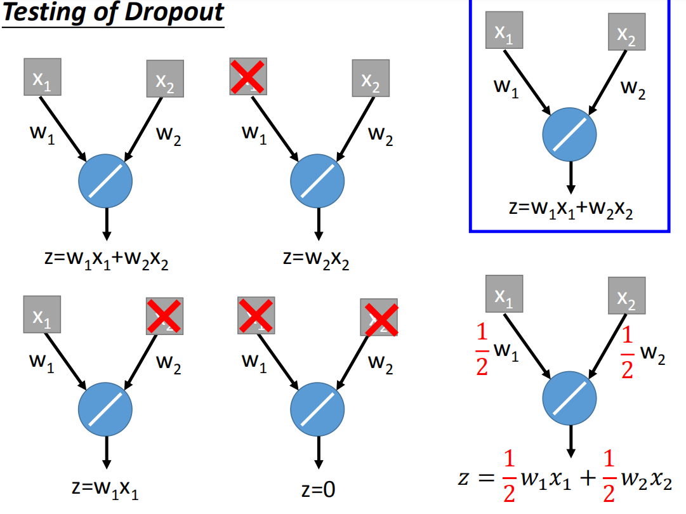

接下来我们来举一个示例：若我们train一个很简单的network（只有一个neuron并且不考虑bias），这个network的activation是linear的。

这个neuron的输入是$x_1, x_2$，经过dropout training以后得到的weights是$w_1, w_2$，所以它的output是$z=w_1x_2+w_2x_2$。如果我们要做ensemble时，每个input可能被dropout或者不被dropout，所以总共有四种structure，它们所对应的结果分别为$z=w_1x_1+w_2x_2, z=w_2x_2, z=w_1x_1, z=0$。因为我们要进行ensemble，所以要把这四个neuron的output要average，得到的结果是$z=\frac{1}{2}w_1x_1+\frac{1}{2}w_2x_2$。

如果我们现在将这两个weights都乘以$\frac{1}{2}$（$\frac{1}{2}w_1x_1+\frac{1}{2}w_2x_2$）,得到的output为$z=\frac{1}{2}w_1x_1+\frac{1}{2}w_2x_2$。在这个最简单的case里面，不同的network structure做ensemble这件事情跟我们将weights 乘以一个值，而不做ensemble所得到的output其实是一样的。

只有是linear network，ensemble才会等于weights multiply一个值。 如果是sigmoid激活函数或是有很多层的话，就不会相等。虽然不相等，但是最后结果还是会work，这就是dropout最后一个很神奇的地方。

所以，根据这个结论，有人有一个想法是说，既然 dropout 在 linear 的 network 上，ensemble 才会
等于weights 乘以一个值。所以，今天如果我的 network 很接近 linear 的话，应该 dropout performance 会比较好，比如说你用 ReLU，用 Maxout network，相对于 sigmoid，它们是比较接近 linear 的。所以 dropout 确实在用 ReLU 或 Maxout network 的时候，它的 performance 是确实比较好的。你去看 Maxout network 的 paper 的话，它里面也有讲到这一点。

## 总结

本章节重要知识点

- 如果training set上的结果表现不好，那么就要去neural network做一些调整
- 如果training set上表现很好，在testing data 表现不好，是overfitting。注意在解决这个问题时要去检查training set的表现，可能要调整网络结构
- 如果同时在training set和testing set都得到好的结果，就意味成功了。
- 解决training set表现不好的方法有使用新的激活函数和调整学习率。
  - Sigmoid函数会有梯度消失问题，而改用ReLU后可以解决这个问题。或者使用Maxout network，这个方法可以自动地学习出不同的激活函数。
  - 调整学习率的方法有Adagrad，RMSProp，Momentum，Adam。
  - Adagrad的学习率是用固定的learning rate除以这个参数过去所有gradient值的平方和开根号，直觉理解就是给陡峭的地方小的学习率，平坦的地方大的学习率。
  - RMSProp改进了Adagrad，将原本的平方和改成加权的平方和，可以自己调整权重，这样最新的GD占的权重可以更大。
  - Momentum不仅考虑当前的GD，还考虑了上一个时间点的移动方向（惯性）。
  - Adam则是RMSProp+Momentum。
- 解决testing set表现不好的方法有Early stopping, Regularization，Dropout。
  - Early stopping就是利用验证集去提前终止训练
  - Regularization分为L1和L2。L1出来的结果会比较sparse。在深度学习中，Regularization其实重要性没有很大。
  - Dropout是在训练中更新参数之前，每次都以p%的概率随机丢掉一些神经元。
  - 注意在test的时候不要Dropout，test时所有的权重都要乘以（1-p%)。
  - dropout可以看做是一种ensemble方法，训练了很多个不同的网络，将这些网络的结果平均得到最终的结果。
