# Unsupervised Learning: Word Embedding

> 更新人：李玲
>
> 更新时间：2021/06/20
>
> 注：本章节是在历史版本基础上修改的，感谢之前小伙伴的整理

本节主题是无监督学习：词嵌入（Unsupervised Learning: Word Embedding），主要讲述如何用一个向量表示一个词。首先介绍了1-of-N Encoding、Word Class两种方法，但是它们都存在向量无法表示出足够信息的问题。接着介绍了Word Embedding方法，它所需的维度比1-of-N Encoding低，而且能表示出词汇的语义相似。

Word Embedding是一个无监督方法，可以用基于计数的词嵌入方法和基于预测的词嵌入来找出词的Embedding。基于计数的词嵌入方法代表性的是Glove，基于预测的词嵌入方法中最具代表性的就是word2vec方法。本节重点介绍了基于预测的词嵌入方法是怎么做的。

此外还简单提及多语言嵌入、多领域嵌入、文档嵌入等，但没有对其做更深入的探讨。

本节内容的框架

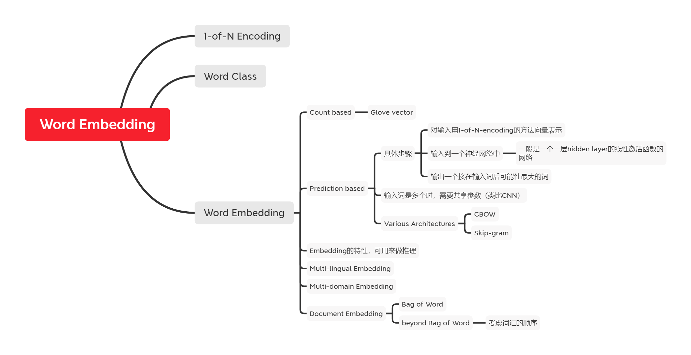

## 1-of-N Encoding & Word Class

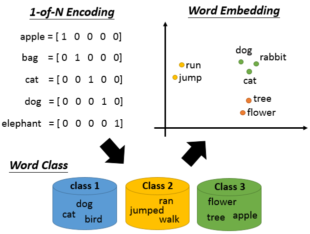

Word Embedding是Dimension Reduction 的一个非常好、非常广为人知的应用。如果今天要你用一个vector来表示一个word，你会怎么做？

最典型（typical）的做法叫做：1-of-N Encoding（上图左上角）。每一个word用一个vector来表示，这个vector的dimension就是这个世界上可能有的word的数目。假设世界上可能有10w个word，那1-of-N Encoding的 dimension就是10w维，那每一个word就对应到其中一维。所以apple的第一维是1，其它都是0，bag就是第一维是1其它是0，cat 就是第三维是 1，以此类推。如果你用这种方式来描述一个word，你的这个vector一点都不informative。你的每一个word的vector都是不一样的，所以从这个vector里面没有办法得到任何的资讯，比如说：cat跟dog都是动物这件事，你没有办法知道。

那怎么办呢？有一个方法叫做Word Class（上图左下角）。也就是你把不同的word，但有同样性质的word，把他们聚类（cluster）成一群一群的，然后用那个word所属的class来表示这个word。这个就是我们之前在做Dimension Reduction的时候讲的clustering的概念。比如说dog, cat跟bird都是class1，ran, jumped,walk是class2，flower,tree,apple是class3等等。但是光用class是不够的(少了一些information)，比如说class1是动物，class2是植物，它们都是属于生物，但是在class里面没有办法来呈现这件事情。或者说：class1是动物，class2是动物可以做的行为，class3是植物，class2里面的行为是class3没有办法做的，所以class2跟class2是有一些关联的，但是没有办法用Word Class呈现出来。

所以怎么办呢？我们需要Word Embedding（上图右上角）：把每一个word都project到高维空间（high dimensional space）上面。虽然这个空间是高维的，但是远比1-of-N Encoding的dimension要低，比如说有10w个word，那1-of-N Encoding就是10w维，但是如果用Word Embedding的话，通常是50维、100维左右。这个就是从1-of-N Encoding到Word Embedding的一个降维（Dimension Reduction）的过程。我们希望在这个Word Embedding图上可以看到的结果是：类似语义（semantic）的词汇，在这个图上是比较接近的。而且在这个高维空间里面，每一个dimension可能都有它特别的含义。假设我们做完Word Embedding以后，每一个word的word Embedding的feature vector长这个样子，那你可能就知道这个dimension代表了生物和其它东西之间的差别(横轴)，那个dimension就代表了会动的跟动作有关的东西和不会动的静止的东西之间的差别(纵轴)。

## 词嵌入

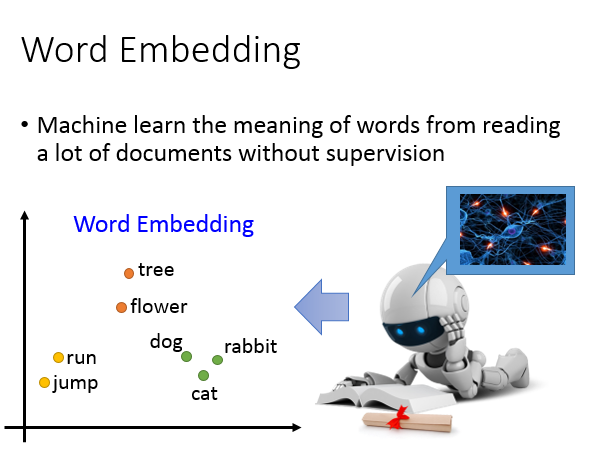

那怎么做Word Embedding呢？Word Embedding是一个无监督方法（Unsupervised approach） 。我们怎么让机器（machine）知道每一个词汇的含义是什么呢，你只要透过让机器阅读大量的文章，它就可以知道每一个词汇的embedding feature vector应该长什么样子。这是一个无监督的问题（Unsupervised problem）。

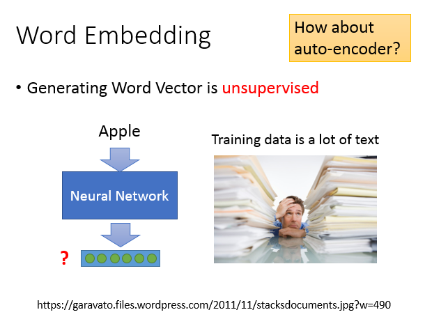

我们要做的就是：learn一个neural network，找一个function，你的input是一个词汇，output就是那个词汇对应的word Embedding。我们手上有的train data是一大堆的文字，所以我们只有input，但是我们没有output(我们不知道每一个word Embedding应该长什么样子)。所以对于我们要找的function，我们只有单项(只知道输入，不知道输出)，所以这是一个Unsupervised learning的问题。

那这个问题要怎么解呢？我们之前讲过一个deep learning based dimension reduction的方法叫做auto-encoder，也就是learn一个network，让它输入等于输出，这边某一个hidden layer拿出来，就是Dimension Reduction的结果。在这个地方你觉得可以用Auto-encoder吗？这个问题是没有办法用auto-encoder来解。如果你是用1-of-N encoding当作它的input，对1-of-N encoding来说，每一个词汇都是独立的（independent），把这样的vector做Auto-encoder，其实没有办法学习出任何informative的information。除非你用character，比如说用character的n-gram来描述一个word，或许可以抓取到一些字首、字根的含义，不过基本上现在大家并不是这么做的。

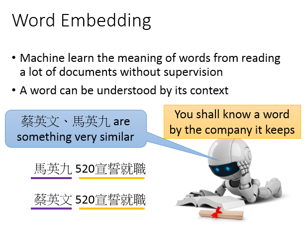

那怎么样找这个word Embedding呢？基本的精神就是：你要如何了解一个词汇的含义呢，你要看它的context(每一个词汇的含义，可以根据它的上下文来得到)。

举例来说：假设机器读了一段文字：“马英九520宣誓就职”，它又读了一段新文字：“蔡英文520宣誓就职”。对机器来说，它不知道马英九和蔡英文指的是什么，但是马英九和蔡英文后面都有接520宣誓就职。对机器来说，它只要读了大量的文章，发现马英九和蔡英文后面有类似的context，机器就可以推论说：蔡英文和马英九代表了某种有关系的物件（object）。它可能不知道他们是人，但机器知道说：蔡英文和马英九这两个词汇代表了可能有同样地位的东西。

### 基于计数的词嵌入

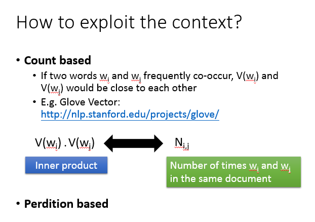

怎样用这个精神来找出word Embedding的vector呢？有两个不同体系的做法，一个做法是：count based的方法。count based：如果我们现在有两个词汇$w_i,w_j$，他们的word vector分别用V($w_i$), V($w_j$)来表示，如果$w_i,w_j$它们常常在同一个文章出现，那他们的V($w_i$), V($w_j$)就会比较接近。这个方法有一个很代表性的例子叫做Glove vector。它的[reference](http://nlp.stanford.edu/projects/glove/)附在这里给大家参考。

这个方法的原则是这样，假设我们知道$w_i$的word vector是$V(w_i)$,$w_j$的word vector是$V(w_j)$,我们可以计算V($w_i$), V($w_j$)的inner product，假设$N_{i,j}$是$w_i$,$w_j$他们在同一个document的次数，那我们就希望找一组vector，使得V($w_i$)和 V($w_j$)内积与$N_{i,j}$越接近越好。你会发现说：这个概念跟我们之前讲的matrix factorization的概念其实是一样的。

### 基于预测的词嵌入

另外一个方式是：prediction based方法，据我所知，好像没有人很认真的比较过prediction based方法跟count based 方法有什么样非常不同的差异或者是谁优谁劣。

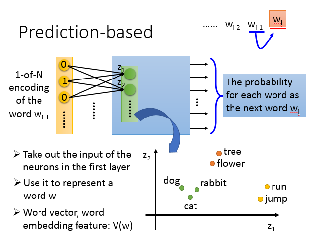

#### 具体步骤

prediction based想法是这样子的：我们来learn一个neural network，这个neural network做的就是given前一个word$w_{i-1}$(w就代表一个sentence的一个word)，predict下一个可能出现的word是什么。每一个word可以用1-of-N encoding表示成一个feature vector，所以我们要做prediction这件事情的话，我们就是learn一个neural network，它的input就是$w_{i-1}$的1-of-N encoding的feature vector，它的output就是下一个word$w_i$是某一个word的几率。也就是说，这个model它的output dimension就是vector的size(假设世界上有10w个word，这个model 的output就是10w维)，每一维代表了某一个word是word$w_{i-1}$的下一个word($w_i$)的几率。所以input跟output都是vector size的，只是它们代表的意思不一样。input 是 1-of-N encoding，output 是下一個 word 的几率。

假设这是一个multiple layer perceptron neural network，那你把input feature vector丢进去的时候，它会通过一些hidden layer，就会得到一些output。接下来我们把第一个hidden layer的input拿出来，把第一个dimension写作是$z_1$，第二个dimension是$z_2$，以此类推，总的写作z。那我们用这个z就可以代表一个word，input不同的1-of-N encoding，这边的z就会不一样。所以我们就把z拿来代表一个词汇，来当作这个词汇的embedding。

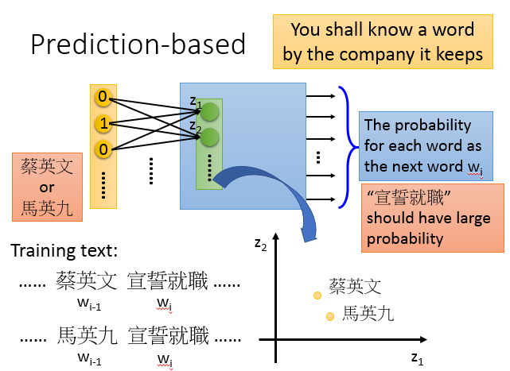

prediction based的方法是怎么体现根据一个词汇的上下文来了解一个词汇的含义这件事情呢？假设我们的train data里面有一个文章是“蔡英文宣誓就职”，另一个文章是“马英九宣誓就职”，在第一个句子里，蔡英文是$w_{i-1}$,宣誓就职是$w_{i}$，在另外一篇文章里面，马英九是$w_{i-1}$，宣誓就职是$w_{i}$。

你在训练这个prediction model的时候，不管input蔡英文还是马英九的 1-of-N encoding，你都会希望learn出来的结果是宣誓就职的几率比较大。也就是说，你希望input蔡英文，马英九的时候，它的output对应到“宣誓就职”那个词汇的那个dimension的几率是高的。蔡英文，马英九虽然是不同的input，但是为了让output的地方得到一样的output，那你就必须让中间的hidden layer做一些事情。中间的hidden layer必须要学到说，这两个不同的词汇，必须要通过weight参数转化以后对应到同样的空间(进入hidden layer之前，必须把他们对应到接近的空间中，这样子我们在output的时候，他们才能有同样的几率)

所以当我们learn一个prediction model的时候，word context这件事情，就自动地考虑在这个prediction model里面。所以我们把prediction model的第一个hidden layer拿出来，我们就可以得到我们想要找的这种word embedding的特性。

#### 共享参数

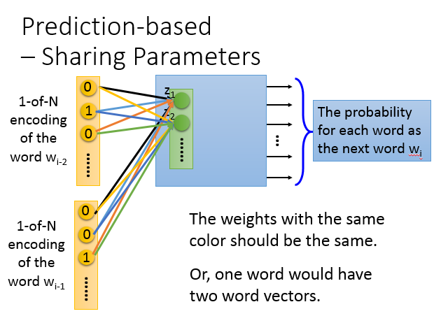

那你可能会说：只用$w_{i-1}$去predict $w_i$好像觉得太弱，就算是人，给一个词汇要predict下一个词汇感觉也很难，因为如果只看一个词汇，下一个词汇的可能性是千千万万的。那怎么办呢？

你可以拓展这个问题，我希望machine learn的input是前面两个词汇($w_{i-2},w_{i-1}$)，然后predict下一个词汇($w_i$)，你可以轻易的把这个model拓展到n个词汇。如果你真要learn这样的word vector的话，你的input可能通常是至少10个词汇，这样才有可能learn出比较reasonable的结果(只input一个或者两个太少了，我这里用input两个word当做例子)

注意的地方是：如果是一般的neural network，你就把input$w_{i-1},w_{i-2}$的1-of-N encoding vector把它接在一起，变成一个很长的vector，直接丢在neural network里面当做input就可以了。但是实际上你在做的时候，你希望$w_{i-2}$的第一个dimension跟第一个hidden layer的第一个neuron，它们之间连的weight和$w_{i-1}$的第一个dimension跟第一个hidden layer的neuron，它们之间连的weight，这两个weight必须是一样的，以此类推。图中用同样的颜色的连线来表示这一点。

为什么这样做呢，一个显而易见的理由是：如果我们不这样做，你把同一个的word放在$w_{i-2}$的位置跟放在$w_{i-1}$的位置，通过这个transform以后，它得到的embedding就会不一样。另外一个理由是：这样做的好处是，可以减少参数量，因为Input的dimension很大，是10w维，所以这个feature vector是一个非常非常大的matrix。一个word就够卡了，有10个word就更吃不消。所以我们强迫让所有的1-of-N encoding那后面接的weight是一样的，那就不会随着你的context增长，而需要更多的参数。

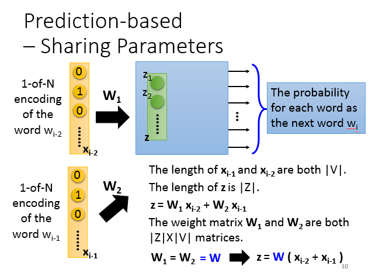

现在假设$w_{i-2}$的1-of-N encoding是$x_{i-2}$,$w_{i-1}$的1-of-N encoding是$x_{i-1}$，那它们的长度都是V的绝对值。把hidden layer的input写成一个vector z，z的长度是Z的绝对值，z等于$x_{i-1}$乘以$W_1$加上$x_{i-2}$乘以$W_2$。现在$W_1,W_2$都是一个$\left | Z|\times|V \right |$ 维度的weight matrix。

我们强制让$W_1=W_2=W$，实际上在处理这个问题的时候，你可以把$x_{i-1}$跟$x_{i-2}$先加起来，因为$W_1, W_2$是一样的，就得到$z= W(x_{i-1}+x_{i-2})$。那要得到一个word vector的时候，就把word的1-of-N encoding乘上这个W，就得到了这个word的word embedding。

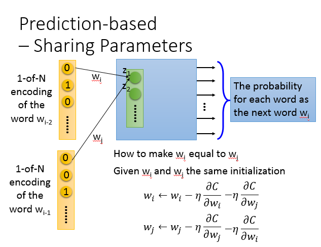

在实际上，你怎么样让$W_1,W_2$一样呢？事实上我们在训练CNN的时候也有类似地问题，也要让某些参数的weight必须是一样的。做法是这样子的：假设我现在有两个weight$w_i,w_j$，我们希望$w_i=w_j$。首先你要给$w_i,w_j$一样的初始值（initialization），接下来计算$w_i$对cost function（下面简称C）的偏微分，然后update $w_i$。然后计算$w_j$对cost function的偏微分，然后update $w_j$。你可能会说，如果$w_i,w_j$对C的偏微分是不一样的，做update以后，它们的值不就不一样了吗？初始值一样也没有用呀。

那怎么办呢？我们就把$w_i$减去$w_j$对C的偏微分，把$w_j$减去$w_i$对C的偏微分，也就是说，它们的update是一模一样的。这样就可以确保它们在update的过程中它们的weight永远都是一样。

#### 训练

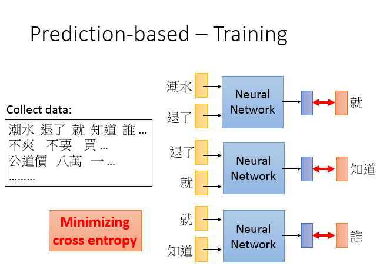

那怎么样训练这个network呢？这个训练是完全Unsupervised的，也就是说，你只需要collect一大堆的文字data(写一个程序去爬虫，比如八卦版块的data，就可以爬到一大堆文字)，然后就可以train你的model了。

比如说有一个句子是：“潮水退了就只知道谁没穿裤子”。那你让你的neural network input “潮水”跟“退了”，希望output就是“就”。所以你会希望你的output跟“就”的1-of-N encoding是minimize cross entropy(“就”也是1-of-N encoding来表示的)。然后input“退了”跟“就”，希望它的output跟“知道”越接近越好。然后input“就”跟“知道”，希望它的output跟“谁”越接近越好。

#### Various Architectures

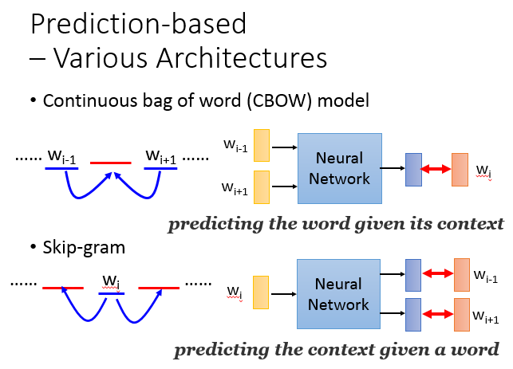

刚才讲的只是最基本的形态。这个prediction based的model可以有种种的变形，我目前还不确定，在这么多的变形中哪一种是比较好的(在不同的task上互有胜负)。有一招叫做continuous bag of word（CBOW) model。我们刚才是拿前面的词汇去predict接下来的词汇。那CBOW的意思就是说：拿某一个词汇的context去predict中间的词汇(即拿$w_{i-1},w_{i+1}$去predict$W_i$)。skip-gram是说：我们拿中间的词汇去predict它的周围的词汇(用$w_i$去predict$w_{i-1},w_{i+1}$)。

虽然在讲deep learning的时候，大家都会提到word vector，把它当作deep learning的一个application。但是假设你有读过word vector的相关文献的话，你会发现这个neural network不是deep的，它其实就是一个linear的hidden layer。就是这个neural network，它只有一个hidden layer，所以你把word input以后，就可以得到word embedding，就直接从那个hidden layer就可以得到output。

Tomas Mikolov 就是 propose word vector 的作者，他说，首先他并不是第一个propose word vector 的人，在过去就有很多这样的概念，他最有名的地方是他把他写的一个非常好的toolkit放到网上，这个toolkit里有种种的tip（如果看他的code的话），所以你自己做的时候做不出他的performance的。他是一个非常非常强的engineer，他有各种他自己直觉的sense。其实他想要verify的最重要的一件事情是说，过去其实其他人就是用deep，他想要证实，其实这个task不用deep就做起来了，不用deep的好处就是减少运算量，所以它可以跑很大量的data。

其实像word embedding这个概念在语音界大概是2010年的时候开始红起来的，那个时候我们把它叫做continuous 的 language model。一开始的时候不是用neural network 来得到这个 word embedding的，因为运算量比较大，而是用一些比较简单的方法。只是后来大家逐渐发现，用neural network 得到的结果才是最好的，所以其他不是 neural network 的方法就渐渐变成了 neural network based 的方法。

### 词嵌入的特性

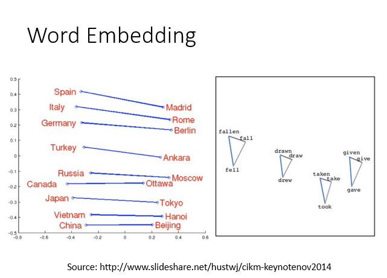

我们知道word vector有一些有趣的特性，如果你把同样类型的东西的word vector摆在一起(比如Italy跟Rome摆在一起，Japan跟Tokyo摆在一起)，你会发现他们之间是有某种固定的关系的。或者说你把动词的三态摆在一起，会发现同一个动词的三态中间有某种固定的关系，成为这个三角形。

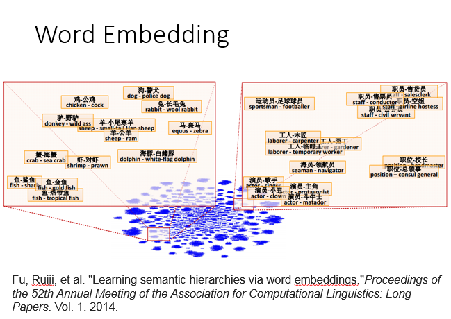

所以从这个word vector里面，你可以discover 你不知道的word和word之间的关系。比如还有人发现说：把两个word vector两两相减，然后project到two dimension space上面。如果是落在这个位置（图中红框）的话，那这两个word vector 具有包含的关系(海豚跟白海豚相减，工人跟木匠相减，职员和售货员相减，都落在这个地方。如果一个东西属于另一个东西的话，两个word vector相减，他们的结果是会很类似的)

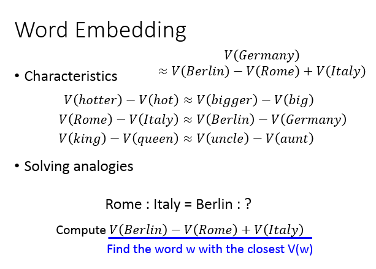

我们用 word vector 的这个概念来做一些推论，我们知道hotter的word vector减掉hot的word vector会很接近bigger的word vector减掉big的word vector。或是Rome的word vector减掉Italy的word vector会很接近Berlin的word vector减掉Germany的word vector。或是King的word vector减掉queen的word vector会很接近uncle的word vector减掉aunt的word vector

如果有人问你说：罗马之于意大利，就如同柏林之于什么呢。机器可以回答这样的问题，怎么做呢？(我们知道Germany vector会很接近于Berlin vector 减去Rome vector加上Italy vector vector)假设我们不知道答案是Germany的话，那你要做的事情就是：计算Berlin vector 减去Rome vector加上Italy vector，然后看看它跟哪一个vector最接近，你可能得到的答案是Germany

### 多语言嵌入

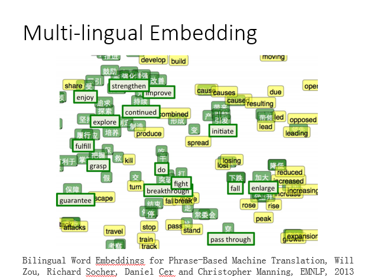

word vector还可以做很多事情，比如你可以把不同语言的word vector拉在一起。假设你有中文的corpus，有一个英文的corpus，各自去train一组word vector，你会发现说，中文和英文word vector是没有任何关系的。因为在train word vector的时候是凭借上下文的关系，如果语料里面没有中文和英文的句子混杂在一起，那machine就没有办法来判断中文和英文之间的词汇关系。但是假如你事先知道某几个中文词汇，跟某几个英文词汇是对应在一起的，你先得到一组中文的word vector，再得到一组英文的word vector。接下来你再learn 一个model，它把中文和英文对应的词汇(比如加大对应enlarge，下跌对应到fall)通过这个projection以后，把他们project到space同一个点。

图中上面是绿色的中文，然后下面是绿色英文，代表是已经知道对应关系中文和英文的词汇。然后你做这个transform以后，接下来有新的中文词汇跟新的英文词汇，你都通过projection把他们project到同一个space上面。你就可以知道中文的降低跟英文的reduce都应该落在差不多的位置，你就可以自动做到类似翻译这样的效果。

### 多领域嵌入

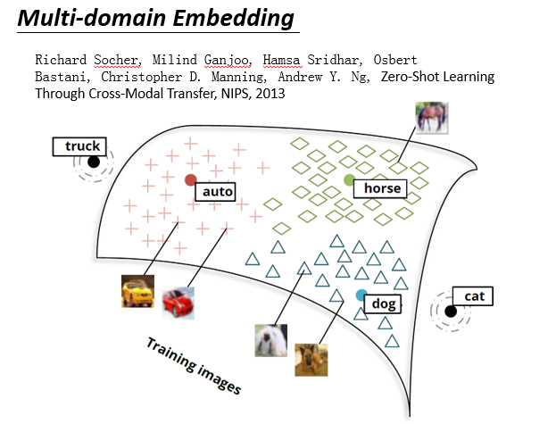

这个word embedding 不局限于文字，你也可以对影像做embedding。举例：我们现在已经找好一组word vector，比如dog vector，horse vector，auto vector，cat vector在空间中是这个样子。接下来，你learn一个model，input一张image，output是一个跟word vector一样dimension的vector。你会希望说，狗的vector分布在狗的周围，马的vector散布在马的周围，车辆的vector散布在auto的周围。

假设有一张新的image进来(它是猫，但是你不知道它是猫)，你通过同样的projection把它project到这个space以后。神奇的是，你发现它就可能在猫的附近，machine就会知道这是个猫。我们一般做影像分类的时候（作业三就是影像分类），你的machine很难去处理新增加的，它没有看过的object。

如果你用这个方法的话，就算有一张image，是在training的时候没有看到过的class。比如说猫这个image，从来都没有看过，但是猫这个image project到cat附近的话，你就会说，这张image叫做cat。如果你可以做到这件事的话，就好像是machine阅读了大量的文章以后，它知道说：每一个词汇它是什么意思。先通过阅读大量的文章，先了解词汇之间的关系，接下来再看image的时候，会根据它阅读的知识去mapping每一个image所该对应的位置。这样就算它没有看过的东西，它也有可能把它的名字叫出来。

### 文档嵌入

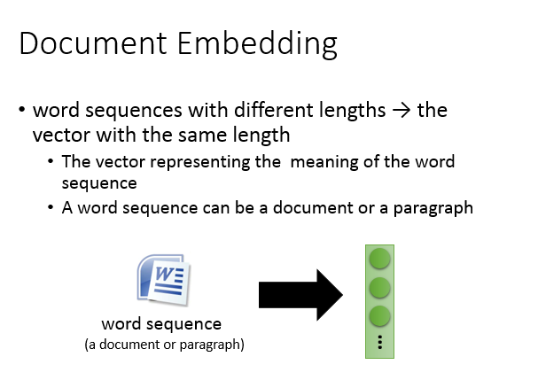

刚才讲的都是word embedding，也可以做document embedding。也就不只是把word变成一个vector，也可以把document变成一个vector

#### 语义嵌入

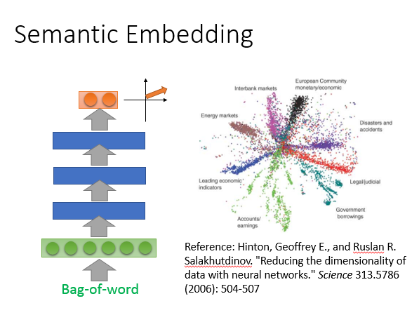

那怎么样把一个document变成一个vector呢？最简单的方法我们之前已经讲过了，就是把一个document变成一个bag-of-word，然后用auto encoder就可以learn出document的semantic embedding。但光这样做是不够的。

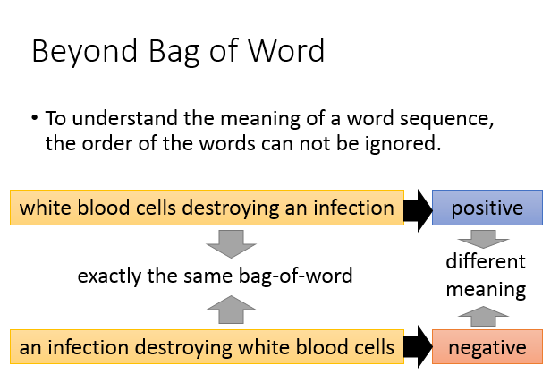

我们光用bag-of-word描述一个document是不够的，为什么呢？因为我们知道词汇的顺序代表了很重要的含义。举例来说，如图有两个句子“white blood cells destroying an infection”，“an infection destroying white blood cells”。这两句话，它们的bag-of-word是一模一样的(词汇相同，只是顺序不一样)。但是上面这句话：白细胞消灭可传染病是positive，下面这句话是negative。虽然他们有相同的bag-of-word，但是它们的语义是不同的，所以如果只是用bag-of-word来描述一篇document是非常不够的，会失去很多重要的information。

那怎么做呢？这边就不细讲了，这里列了一大堆的reference给大家参考，前面的三种是unsupervised，也就是你collect一大堆的document，你就可以让它自己去学。后面的几个方法是supervised的，在这些方法里你需要对每一个document进行额外的label。不用label出每个document的vector是什么，但是你要给它其他的label，才能够learn这些vector。

## 总结

本节重要知识点列表

- 由于1-of-N Encoding、Word Class的缺陷，引入了Word Embedding（词嵌入）的方法。
- 这个方法是一个无监督方法，希望通过让机器阅读大量文章来学习到词的含义。思想是通过词汇的上下文来了解该词汇的含义。
- 具体来说，词嵌入又分为基于计数的方法（以Glove为代表）和基于预测的方法（以Word2vec为代表）
- 基于计数的方法希望达到这样的目标：两个词的向量的内积尽可能和这两个词在同一个文档共现的次数接近。
- 基于预测的方法则希望学习这样一个函数：给定前面N个词，函数能够预测出下一个词。其变形的模式是CBOW（给定上下文，预测中间的词）和Skip-gram（给定中间的词，预测上下文）
- 这样训练出来的词嵌入有一些特性，比如相似的词的向量会很相似，这可以用来做推理。
- 此外多语言嵌入、多领域嵌入、文档嵌入可以进一步学习
